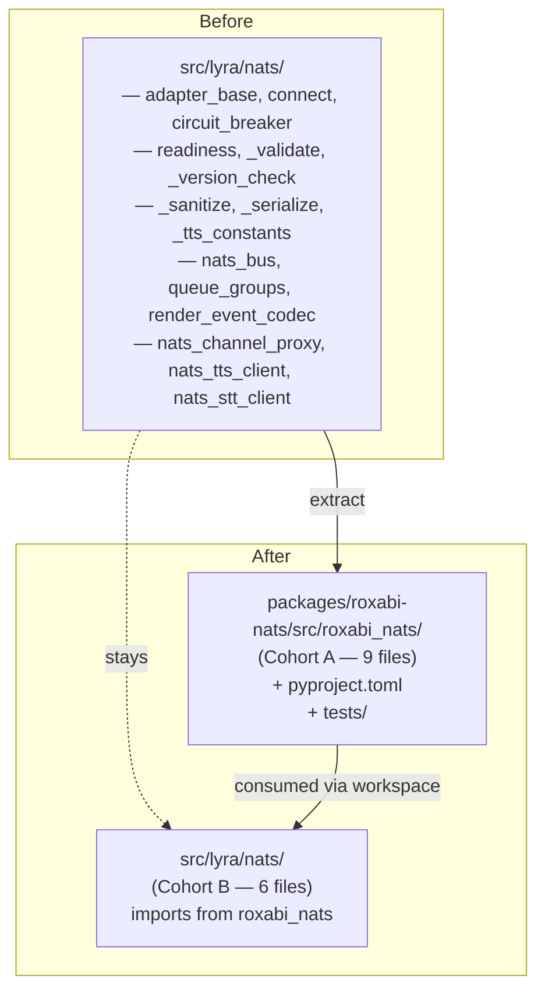
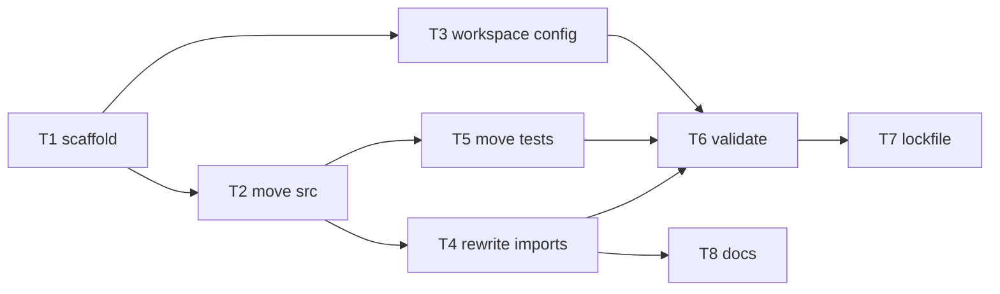

## Summary

Extract 9 transport-primitive files from `src/lyra/nats/` into a new `packages/roxabi-nats/` uv workspace subpackage, rewrite ~42 import sites across lyra src + tests to use the new `roxabi_nats` namespace, update root `pyproject.toml` workspace config + `pyright.include`, regenerate `uv.lock`, verify green test suite, tag `roxabi-nats/v0.1.0` on merge. Cohort B stays in place. Scope is mechanical — refactor, not feature work.

## Architecture

### Repo layout delta

### Import rewrite scope

| Current module | Count | New form |
|---|---|---|
| `lyra.nats._serialize` | 11 | `roxabi_nats._serialize` |
| `lyra.nats.connect` | 6 | `roxabi_nats.connect` |
| `lyra.nats._version_check` | 5 | `roxabi_nats._version_check` |
| `lyra.nats.adapter_base` | 5 | `roxabi_nats.adapter_base` |
| `lyra.nats.readiness` | 4 | `roxabi_nats.readiness` |
| `lyra.nats._validate` | 3 | `roxabi_nats._validate` |
| `lyra.nats._sanitize` | 3 | `roxabi_nats._sanitize` |
| `lyra.nats.circuit_breaker` | 3 | `roxabi_nats.circuit_breaker` |
| `lyra.nats._tts_constants` | 2 | `roxabi_nats._tts_constants` |
| `lyra.nats` (bare) | 10 | case-by-case — split by imported symbol |
| `lyra.nats.nats_bus` | 9 | **unchanged** (Cohort B) |
| `lyra.nats.queue_groups` | 6 | **unchanged** |
| `lyra.nats.{render_event_codec, nats_tts_client, nats_stt_client, nats_channel_proxy}` | 14 | **unchanged** |

**Total rewrites:** ~42 sites in extracted-module imports + 10 bare-`lyra.nats` sites that need per-symbol triage.

## Agents

| Agent | Tasks | Primary files |
|---|---|---|
| `backend-dev` | T1, T2, T4 | `packages/roxabi-nats/**`, lyra import rewrites |
| `devops` | T3, T5, T7 | `pyproject.toml`, `uv.lock`, pyright config, tag |
| `tester` | T6 | full pytest suite + import-layer check |
| `doc-writer` | T8 | `src/lyra/nats/CLAUDE.md`, root `CLAUDE.md` file table |

## Bootstrap Context

Pre-reqs landed:
- PR #710 (queue_groups decoupled from `lyra.core.message.Platform`)
- PR #714 (per-role NATS nkeys + subject ACLs in `auth.conf`)

Open decision deferred from ADR-045: **`_tts_constants.py` cohort assignment.** It contains TTS payload field-name lists. Two reads:
- Transport-primitive (mechanical field whitelist, used by `_sanitize`) — stays Cohort A
- Domain leak (TTS-specific) — belongs in lyra

Plan assumes **Cohort A** (follows ADR-045 literally). If the extraction surfaces lyra-only callers, revisit during T2.

## Micro-Tasks

### T1 — Scaffold `packages/roxabi-nats/`

- **Agent:** backend-dev
- **Parallel-safe:** N (foundation)
- **Files:** `packages/roxabi-nats/pyproject.toml` (new), `packages/roxabi-nats/src/roxabi_nats/__init__.py` (new), `packages/roxabi-nats/tests/__init__.py` (new), `packages/roxabi-nats/README.md` (new, minimal)
- **Do:**
  - `pyproject.toml`: `name="roxabi-nats"`, `version="0.1.0"`, `requires-python=">=3.12"` (broader than lyra), `dependencies=["nats-py>=2.6", "nkeys>=0.1"]`, `[build-system]` hatchling, `[tool.hatch.build.targets.wheel] packages=["src/roxabi_nats"]`
  - `__init__.py`: re-export `NatsAdapterBase`, `nats_connect`, `CONTRACT_VERSION` as public surface; keep `_`-prefixed modules importable via fully-qualified path
- **Verify:** `test -f packages/roxabi-nats/pyproject.toml && test -d packages/roxabi-nats/src/roxabi_nats && test -d packages/roxabi-nats/tests`

### T2 — Move Cohort A source files + rewrite internal imports

- **Agent:** backend-dev
- **Parallel-safe:** N (blocks T4)
- **Depends on:** T1
- **Files moved (9):** `adapter_base.py`, `connect.py`, `circuit_breaker.py`, `readiness.py`, `_validate.py`, `_version_check.py`, `_sanitize.py`, `_serialize.py`, `_tts_constants.py` — from `src/lyra/nats/` to `packages/roxabi-nats/src/roxabi_nats/`
- **Do:**
  - `git mv` each file (preserve history)
  - Within moved files: rewrite `from lyra.nats.X` → `from roxabi_nats.X` (intra-package)
  - Verify no moved file imports `lyra.*` — if any does, surface as blocker (means cohort boundary is wrong)
- **Verify:** `! grep -rn "from lyra" packages/roxabi-nats/src/` → empty output

### T3 — Workspace + build config

- **Agent:** devops
- **Parallel-safe:** Y (with T2) — edits root configs only
- **Files:** `pyproject.toml` (root), `.python-version` (no change expected)
- **Do:**
  - Add `[tool.uv.workspace] members = ["packages/roxabi-nats"]`
  - Add `roxabi-nats = { workspace = true }` under `[tool.uv.sources]`
  - Add `roxabi-nats` to `dependencies`
  - Add `packages/roxabi-nats/src` to `pyright.include`
  - Verify `ruff` picks up `packages/` by default (its `[tool.ruff]` `src` defaults to `["src", "tests"]` — may need `src = ["src", "tests", "packages/roxabi-nats/src", "packages/roxabi-nats/tests"]`)
- **Verify:** `uv sync --reinstall-package lyra` passes without errors

### T4 — Rewrite lyra import sites

- **Agent:** backend-dev
- **Parallel-safe:** N (blocks T6)
- **Depends on:** T2
- **Files:** ~20–25 files across `src/lyra/**` + `tests/**` (52 import sites total: 42 direct + 10 bare)
- **Do:**
  - Bulk rewrite per table above for direct module imports
  - For 10 bare `from lyra.nats import X` sites: triage each — if X is in Cohort A public API (`NatsAdapterBase`, `nats_connect`, `CONTRACT_VERSION`), rewrite to `from roxabi_nats import X`; if X is Cohort B (`NatsBus`, `NatsChannelProxy`, `NatsRenderEventCodec`), leave as `from lyra.nats import X`
  - Update `src/lyra/nats/__init__.py`: drop re-exports of Cohort A, keep Cohort B re-exports (`NatsBus`, `NatsChannelProxy`, `NatsRenderEventCodec`)
- **Verify:** `! grep -rn "from lyra\.nats\.\(adapter_base\|connect\|circuit_breaker\|readiness\|_validate\|_version_check\|_sanitize\|_serialize\|_tts_constants\)" src/ tests/` → empty

### T5 — Move Cohort A tests

- **Agent:** devops (mechanical move + pytest config)
- **Parallel-safe:** Y (with T4)
- **Depends on:** T2
- **Files moved (9 of 18 in tests/nats/):** `test_adapter_base.py`, `test_nats_connect.py`, `test_circuit_breaker.py`, `test_readiness.py`, `test_version_check.py`, `test_sanitize.py`, `test_serialize_outbound.py`, `test_sanitize_single_entry.py`, potentially `test_hub_standalone.py` (check — may be cohort-boundary-crossing)
- **Do:**
  - `git mv` tests from `tests/nats/test_*.py` → `packages/roxabi-nats/tests/test_*.py` for Cohort A
  - Rewrite test imports to `roxabi_nats.*`
  - Ensure `pytest` discovers both `tests/` and `packages/roxabi-nats/tests/` — verify root `pyproject.toml` `[tool.pytest.ini_options] testpaths` covers both
- **Verify:** `uv run pytest packages/roxabi-nats/tests/ -q` passes

### T6 — Full-suite validation

- **Agent:** tester
- **Parallel-safe:** N (gate before T7)
- **Depends on:** T4, T5
- **Do:**
  - `uv run pytest -q` (full suite, both roots)
  - `uv run pyright` (clean across lyra + packages)
  - `uv run ruff check .` (repo-wide, per pre-commit hook)
  - Import-layer check (pre-commit hook `import-layers`) must pass
  - Boot smoke: `uv run lyra --help` (CLI imports resolve)
  - NATS adapter smoke: start embedded NATS via `make lyra` (local) — not mandatory in plan, optional manual step
- **Verify:** all 4 checks green

### T7 — Lockfile + tag prep

- **Agent:** devops
- **Parallel-safe:** N (sequential with T6)
- **Depends on:** T6
- **Files:** `uv.lock`
- **Do:**
  - `uv lock` (regenerates with workspace member)
  - `git add uv.lock` — commit with the extraction commit so prod `uv sync --frozen` doesn't break
  - Plan tag `roxabi-nats/v0.1.0` on merge commit (actual tag applied by human after PR merge, not in this task)
- **Verify:** `uv sync --frozen` succeeds on a fresh clone of the branch

### T8 — CLAUDE.md + doc updates

- **Agent:** doc-writer
- **Parallel-safe:** Y (with T6)
- **Depends on:** T4
- **Files:** `src/lyra/nats/CLAUDE.md` (if exists — check), root `CLAUDE.md` (Key files table), `packages/roxabi-nats/README.md` (minimal: link to ADR-045, import example)
- **Do:**
  - Update `src/lyra/nats/` file table (if a CLAUDE.md lives there) — remove Cohort A entries
  - Add `packages/roxabi-nats/` row to root `CLAUDE.md` Key files table
  - Write `packages/roxabi-nats/README.md`: one-paragraph purpose, ADR-045 link, install snippet (`{ git=..., subdirectory=..., tag=... }`)
- **Verify:** `grep -r "adapter_base.py\|connect.py" CLAUDE.md src/lyra/nats/CLAUDE.md 2>/dev/null` reflects new paths

## Task graph

**Critical path:** T1 → T2 → T4 → T6 → T7.
**Parallel opportunities:** T3 || (T1→T2), T5 || T4, T8 || T6.

## Consistency Report

- **ADR-045 Cohort A files (9):** covered by T2, T5
- **ADR-045 non-negotiables (8):** all covered — (1) T2, (2) T4, (3) T3, (4) T1, (5) T3, (6) T5, (7) T7, (8) human after merge
- **Known gotchas (4):** `_tts_constants.py` cohort decision called out in Bootstrap Context; lint hook addressed by T6 (works on committed state, not working tree); lockfile addressed by T7; voiceCLI migration explicitly out of scope
- **Untraced risks:** 10 bare `from lyra.nats` imports need per-symbol triage in T4 — flagged, not an unknown

## Rollback

Single-commit PR — revert = `git revert` the merge commit. No database migrations, no external API changes. Worst case: `uv lock` regeneration in a follow-up commit if the revert leaves the lockfile inconsistent.

## Out of scope (follow-up PRs)

- voiceCLI migration from ported `voicecli/nats/base.py` to `roxabi-nats` dependency
- roxabi-vault NATS subscriber wiring
- imageCLI NATS subscriber wiring
- PyPI publication (deferred per ADR-045 triggers)

## Task IDs

<!-- Seeded via TaskCreate after approval. Extraction PR is task #6 in local list. -->
