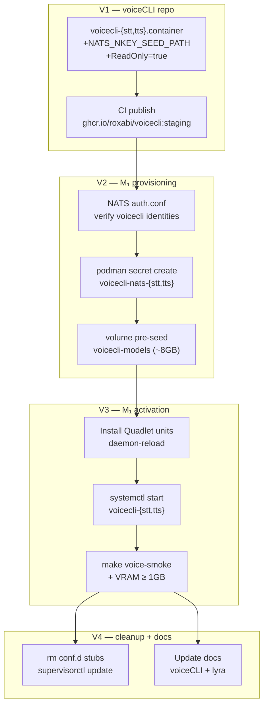
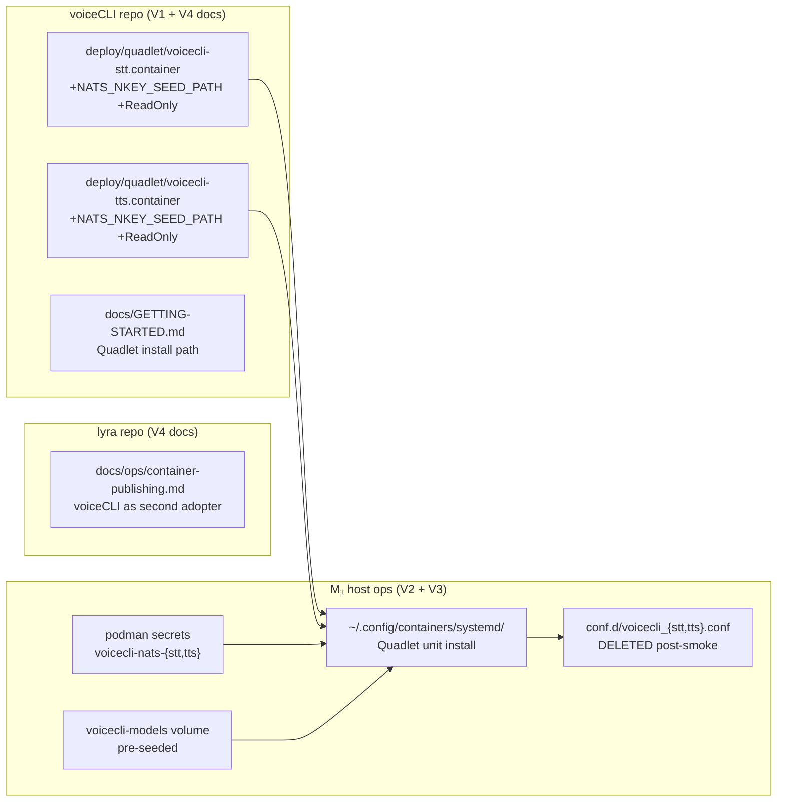

## Summary

Fix two Quadlet file gaps in the voiceCLI repo (NATS_NKEY_SEED_PATH env + ReadOnly=true), then drive M₁ cutover: provision Podman secrets + model cache volume, install units, smoke-test, and retire supervisord stubs. Architecture and image publishing are already in place.

## Architecture





## Agents

| Agent | Slices | Tasks | Files |
|---|---|---|---|
| `devops` | V1–V4 | T1–T16 | voicecli-{stt,tts}.container, M₁ host ops |
| `doc-writer` | V4 | T17–T18 | voiceCLI docs/GETTING-STARTED.md, lyra docs/ops/container-publishing.md |

## Reference Patterns

- Lyra `ReadOnly=true` pattern: `deploy/quadlet/lyra-hub.container` (after `DropCapability=all`)
- `Environment=` inline pattern: existing `Environment=NATS_URL=nats://lyra-nats:4222` in voicecli-stt.container
- Secret mount format: `Secret=voicecli-nats-stt,type=mount,target=<path>,mode=0400` (already in file)

## Consistency Report

| | |
|---|---|
| Spec criteria covered | 18/18 |
| Uncovered criteria | none |
| Untraced tasks | none |
| Exemptions | V2/V3 tasks are host ops (no source files); verified via bash commands |

## Micro-Tasks

---

### V1 — Fix Quadlet gaps → CI publish

---

#### T1 — Fix voicecli-stt.container: add NATS_NKEY_SEED_PATH + ReadOnly

- **File:** `/home/mickael/projects/voiceCLI/deploy/quadlet/voicecli-stt.container`
- **Agent:** devops
- **Phase:** RED
- **Parallel-safe:** N (T2 is parallel-safe with T1 — different file)
- **Spec trace:** SC-1, SC-3
- **Slice:** V1
- **Difficulty:** 1
- **Time estimate:** 3 min

**Code snippet:**
```ini
# After existing Environment=NATS_URL= line:
Environment=NATS_NKEY_SEED_PATH=/home/voicecli/.config/voicecli/nkeys/seed.seed

# After NoNewPrivileges=true (before DropCapability):
ReadOnly=true
```

**Verify:**
```bash
grep -c "NATS_NKEY_SEED_PATH=/home/voicecli/.config/voicecli/nkeys/seed.seed" \
  /home/mickael/projects/voiceCLI/deploy/quadlet/voicecli-stt.container && \
grep -c "^ReadOnly=true" \
  /home/mickael/projects/voiceCLI/deploy/quadlet/voicecli-stt.container
```
**Expected:** `1` on each line

---

#### T2 — Fix voicecli-tts.container: add NATS_NKEY_SEED_PATH + ReadOnly [P]

- **File:** `/home/mickael/projects/voiceCLI/deploy/quadlet/voicecli-tts.container`
- **Agent:** devops
- **Phase:** RED
- **Parallel-safe:** Y (different file from T1)
- **Spec trace:** SC-2, SC-3
- **Slice:** V1
- **Difficulty:** 1
- **Time estimate:** 3 min

**Code snippet:** same as T1 (different file)

**Verify:**
```bash
grep -c "NATS_NKEY_SEED_PATH=/home/voicecli/.config/voicecli/nkeys/seed.seed" \
  /home/mickael/projects/voiceCLI/deploy/quadlet/voicecli-tts.container && \
grep -c "^ReadOnly=true" \
  /home/mickael/projects/voiceCLI/deploy/quadlet/voicecli-tts.container
```
**Expected:** `1` on each line

---

#### T3 — Open voiceCLI PR + verify CI publishes staging image

- **File:** voiceCLI GitHub repo (PR + CI)
- **Agent:** devops
- **Phase:** GREEN
- **Parallel-safe:** N (depends T1, T2)
- **Spec trace:** SC-4
- **Slice:** V1
- **Difficulty:** 2
- **Time estimate:** 5 min + CI wait (~30 min)

**Action:**
```bash
# In voiceCLI repo — commit + push + open PR
cd /home/mickael/projects/voiceCLI
git add deploy/quadlet/voicecli-stt.container deploy/quadlet/voicecli-tts.container
git commit -m "fix(quadlet): add NATS_NKEY_SEED_PATH env + ReadOnly=true to worker containers"
# push + gh pr create, then wait for CI
```

**Verify:**
```bash
gh run list --repo Roxabi/voiceCLI --workflow publish.yml --limit 1
# Must show: completed success
```
**Expected:** `completed	success` in output

---

#### T4 [RED-GATE] — V1 gate: image fields verified

- **Agent:** devops
- **Phase:** RED-GATE
- **Spec trace:** SC-1, SC-2, SC-3, SC-4
- **Slice:** V1

**Verify:**
```bash
# After PR merged and CI complete:
gh run list --repo Roxabi/voiceCLI --workflow publish.yml --limit 1 | grep "completed.*success"
```
**Expected:** match found → V1 complete, proceed to V2

---

### V2 — M₁ provisioning

---

#### T5 — Verify NATS auth.conf voicecli identities

- **File:** `~/projects/lyra/deploy/nats/auth.conf` (M₁)
- **Agent:** devops
- **Phase:** RED
- **Parallel-safe:** N (gate for T6)
- **Spec trace:** SC-5
- **Slice:** V2
- **Difficulty:** 1
- **Time estimate:** 2 min

**Verify:**
```bash
grep -c voicecli ~/projects/lyra/deploy/nats/auth.conf
```
**Expected:** ≥ 2 (voice-stt and voice-tts identities). If < 2 → add missing identities via lyra auth.conf update + `make nats-setup` before proceeding.

---

#### T6 — Create Podman secrets voicecli-nats-stt + voicecli-nats-tts

- **File:** M₁ Podman secrets store
- **Agent:** devops
- **Phase:** RED
- **Parallel-safe:** N (depends T5)
- **Spec trace:** SC-6
- **Slice:** V2
- **Difficulty:** 1
- **Time estimate:** 3 min

**Action:**
```bash
podman secret create voicecli-nats-stt ~/.voicecli/nkeys/voice-stt.seed
podman secret create voicecli-nats-tts ~/.voicecli/nkeys/voice-tts.seed
```

**Verify:**
```bash
podman secret ls --filter name=voicecli-nats-stt && \
podman secret ls --filter name=voicecli-nats-tts
```
**Expected:** both names listed

---

#### T7 — Pre-seed voicecli-models volume from host cache

- **File:** M₁ `voicecli-models` named volume
- **Agent:** devops
- **Phase:** RED
- **Parallel-safe:** N (depends T6; volume must exist before seeding)
- **Spec trace:** SC-7
- **Slice:** V2
- **Difficulty:** 2
- **Time estimate:** 10 min (cp ~8GB)

**Action:**
```bash
# Check source exists first:
ls ~/.cache/huggingface && ls ~/.cache/voicecli || echo "WARN: source missing — cold download on first start"

# Pre-seed (if source exists):
podman run --rm \
  -v ~/.cache/huggingface:/src/huggingface:ro \
  -v ~/.cache/voicecli:/src/voicecli:ro \
  -v voicecli-models:/dst \
  docker.io/library/alpine \
  sh -c "cp -a /src/huggingface /dst/ && cp -a /src/voicecli /dst/"
```

**Verify:**
```bash
podman run --rm -v voicecli-models:/mnt docker.io/library/alpine \
  ls /mnt/huggingface/hub 2>/dev/null | wc -l
```
**Expected:** ≥ 1

---

#### T8 [RED-GATE] — V2 gate: all provisioning verified

- **Agent:** devops
- **Phase:** RED-GATE
- **Spec trace:** SC-5, SC-6, SC-7
- **Slice:** V2

Run all V2 verify commands. All must pass before proceeding to V3.

---

### V3 — Activate + smoke + verify

---

#### T9 — Install Quadlet units + daemon-reload

- **File:** `~/.config/containers/systemd/` (M₁)
- **Agent:** devops
- **Phase:** RED
- **Parallel-safe:** N (depends V2 gate)
- **Spec trace:** (enables SC-8,9)
- **Slice:** V3
- **Difficulty:** 1
- **Time estimate:** 2 min

**Action:**
```bash
cp ~/projects/voiceCLI/deploy/quadlet/voicecli-stt.container \
   ~/projects/voiceCLI/deploy/quadlet/voicecli-tts.container \
   ~/projects/voiceCLI/deploy/quadlet/voicecli-models.volume \
   ~/.config/containers/systemd/
systemctl --user daemon-reload
```

**Verify:**
```bash
systemctl --user list-unit-files | grep voicecli
```
**Expected:** `voicecli-stt.service` and `voicecli-tts.service` listed

---

#### T10 — Start voicecli-stt + voicecli-tts services

- **File:** M₁ systemd user services
- **Agent:** devops
- **Phase:** GREEN
- **Parallel-safe:** N (depends T9)
- **Spec trace:** SC-8, SC-9
- **Slice:** V3
- **Difficulty:** 2
- **Time estimate:** 5 min (model warm-up ~30–60s)

**Action:**
```bash
systemctl --user start voicecli-stt.service voicecli-tts.service
# Wait for warm-up (model load ~15–60s depending on volume cache state)
sleep 30
```

**Verify:**
```bash
systemctl --user is-active voicecli-stt && systemctl --user is-active voicecli-tts
```
**Expected:** `active` for both. On failure → `journalctl --user -u voicecli-stt -n 50`

---

#### T11 — Verify secret path in-container [P]

- **Agent:** devops
- **Phase:** GREEN
- **Parallel-safe:** Y (parallel with T12; depends T10)
- **Spec trace:** SC-10, SC-11
- **Slice:** V3
- **Difficulty:** 1
- **Time estimate:** 2 min

**Verify:**
```bash
podman exec voicecli-stt test -f /home/voicecli/.config/voicecli/nkeys/seed.seed && echo ok
podman exec voicecli-tts test -f /home/voicecli/.config/voicecli/nkeys/seed.seed && echo ok
```
**Expected:** `ok` for both

---

#### T12 — Verify GPU inside container [P]

- **Agent:** devops
- **Phase:** GREEN
- **Parallel-safe:** Y (parallel with T11; depends T10)
- **Spec trace:** SC-12
- **Slice:** V3
- **Difficulty:** 1
- **Time estimate:** 2 min

**Verify:**
```bash
podman exec voicecli-stt nvidia-smi
```
**Expected:** exit 0, GPU info printed

---

#### T13 — Run make voice-smoke + VRAM headroom check

- **Agent:** devops
- **Phase:** GREEN
- **Parallel-safe:** N (depends T10, T11, T12)
- **Spec trace:** SC-13, SC-14
- **Slice:** V3
- **Difficulty:** 2
- **Time estimate:** 5 min

**Verify:**
```bash
cd ~/projects/lyra && make voice-smoke
nvidia-smi --query-gpu=memory.free --format=csv,noheader
```
**Expected:** `make voice-smoke` exits 0; free VRAM ≥ 1000 MiB (measured after warm-up)

---

#### T14 — Verify Restart=on-failure property [P]

- **Agent:** devops
- **Phase:** GREEN
- **Parallel-safe:** Y (parallel with T13; depends T10)
- **Spec trace:** SC-15
- **Slice:** V3
- **Difficulty:** 1
- **Time estimate:** 1 min

**Verify:**
```bash
systemctl --user show voicecli-stt --property=Restart
```
**Expected:** `Restart=on-failure`

---

#### T15 [RED-GATE] — V3 gate: all smoke criteria green

- **Agent:** devops
- **Phase:** RED-GATE
- **Spec trace:** SC-8 through SC-15
- **Slice:** V3

All V3 verify commands must pass. **Do not proceed to V4 (cleanup) until this gate passes.**
If voice-smoke fails → rollback: `systemctl --user stop voicecli-stt voicecli-tts`. Supervisord stubs still present.

---

### V4 — Supervisord cleanup + docs

---

#### T16 — Remove conf.d stubs + supervisorctl update

- **File:** `~/projects/conf.d/voicecli_stt.conf`, `~/projects/conf.d/voicecli_tts.conf` (M₁)
- **Agent:** devops
- **Phase:** REFACTOR
- **Parallel-safe:** N (depends V3 gate)
- **Spec trace:** SC-16, SC-17, SC-18
- **Slice:** V4
- **Difficulty:** 1
- **Time estimate:** 2 min

**Action:**
```bash
rm ~/projects/conf.d/voicecli_stt.conf ~/projects/conf.d/voicecli_tts.conf
supervisorctl reread && supervisorctl update
```

**Verify:**
```bash
ls ~/projects/conf.d/voicecli_stt.conf 2>&1 | grep "No such file" && \
supervisorctl status voicecli_stt 2>&1 | grep "No such process"
```
**Expected:** both match

---

#### T17 — Update voiceCLI docs/GETTING-STARTED.md

- **File:** `/home/mickael/projects/voiceCLI/docs/GETTING-STARTED.md`
- **Agent:** doc-writer
- **Phase:** REFACTOR
- **Parallel-safe:** N (depends V3 gate; should be in same voiceCLI PR as T1/T2 or a follow-up)
- **Spec trace:** SC-19
- **Slice:** V4
- **Difficulty:** 2
- **Time estimate:** 5 min

**Action:** Replace supervisord-based voice worker setup instructions with Quadlet install path:
- Remove: `supervisorctl start voicecli_stt voicecli_tts`
- Add: Quadlet install procedure (cp units, daemon-reload, systemctl start)
- Reference `deploy/quadlet/` as authoritative location

**Verify:**
```bash
grep -c "quadlet\|systemctl" /home/mickael/projects/voiceCLI/docs/GETTING-STARTED.md
```
**Expected:** ≥ 2 (Quadlet + systemctl references present)

---

#### T18 — Update lyra docs/ops/container-publishing.md [P]

- **File:** `docs/ops/container-publishing.md`
- **Agent:** doc-writer
- **Phase:** REFACTOR
- **Parallel-safe:** Y (parallel with T17; different repo)
- **Spec trace:** SC-20
- **Slice:** V4
- **Difficulty:** 1
- **Time estimate:** 3 min

**Action:** Add voiceCLI as the second adopter reference under the "Adopters" or equivalent section. One line: `voiceCLI — ghcr.io/roxabi/voicecli, GPU passthrough (CDI), model cache volume. See voiceCLI/deploy/quadlet/.`

**Verify:**
```bash
grep -c "voicecli\|voiceCLI" docs/ops/container-publishing.md
```
**Expected:** ≥ 1

---

## Task IDs

<!-- Generated by /plan. Used by /implement to resume tasks on session restart. -->
- T1: 12 — T1: Fix voicecli-stt.container — add NATS_NKEY_SEED_PATH + ReadOnly=true
- T2: 13 — T2: Fix voicecli-tts.container — add NATS_NKEY_SEED_PATH + ReadOnly=true
- T3: 14 — T3: Open voiceCLI PR + verify CI publishes staging image
- T4: 15 — T4 [RED-GATE]: V1 gate — image fields verified, CI green
- T5: 16 — T5: Verify NATS auth.conf voicecli identities on M₁
- T6: 17 — T6: Create Podman secrets voicecli-nats-stt + voicecli-nats-tts
- T7: 18 — T7: Pre-seed voicecli-models volume from host cache
- T8: 19 — T8 [RED-GATE]: V2 gate — all provisioning verified
- T9: 20 — T9: Install Quadlet units + daemon-reload
- T10: 21 — T10: Start voicecli-stt + voicecli-tts services
- T11: 22 — T11 [P]: Verify secret path in-container
- T12: 23 — T12 [P]: Verify GPU inside container via CDI
- T13: 24 — T13: Run make voice-smoke + VRAM headroom check
- T14: 25 — T14 [P]: Verify Restart=on-failure property
- T15: 26 — T15 [RED-GATE]: V3 gate — all smoke criteria green
- T16: 27 — T16: Remove conf.d stubs + supervisorctl update
- T17: 28 — T17: Update voiceCLI docs/GETTING-STARTED.md for Quadlet install
- T18: 29 — T18 [P]: Update lyra docs/ops/container-publishing.md — voiceCLI as second adopter
