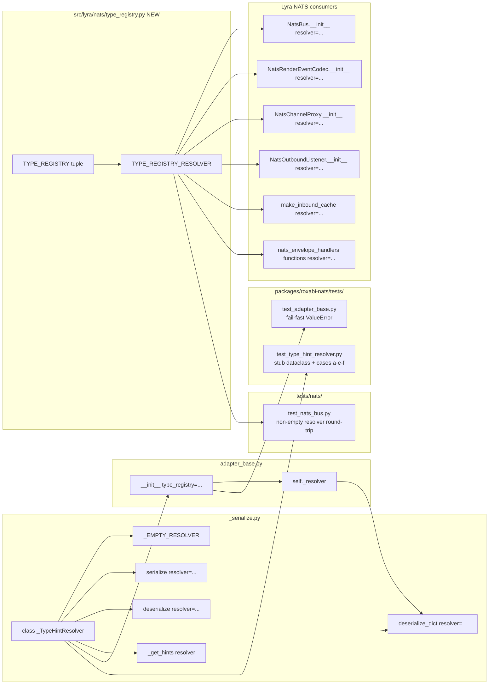

## Summary

Replace `roxabi_nats._serialize._TYPE_CHECKING_IMPORTS` (process-global mutable registry) with a `_TypeHintResolver` instance passed via `type_registry=` on `NatsAdapterBase.__init__` and as a `resolver=` kwarg on `serialize`/`deserialize`/`deserialize_dict`. Clean break in `v0.2.0` — deletes `_register_type_checking_import` and the module-level list entirely, no deprecation shim. Lyra-side wiring goes through a single `TYPE_REGISTRY_RESOLVER` module constant.

## Architecture

### Data flow

```mermaid
flowchart TD
    subgraph SDK[packages/roxabi-nats/ — V1, V2]
        SERIALIZE[_serialize.py<br/>T2 — resolver class + API<br/>DELETE _register_*]
        ADAPTER[adapter_base.py<br/>T5 — type_registry kwarg]
        SDK_TESTS[tests/test_type_hint_resolver.py<br/>T1 — RED<br/>tests/test_adapter_base.py<br/>T4 — fail-fast RED]
    end

    subgraph LyraNats[src/lyra/nats/ — V3]
        TYPE_REG[type_registry.py<br/>T8 — TYPE_REGISTRY + RESOLVER]
        INIT[__init__.py<br/>T9 — drop _register call]
        BUS[nats_bus.py<br/>T10]
        CODEC[render_event_codec.py<br/>T11]
        PROXY[nats_channel_proxy.py<br/>T12]
    end

    subgraph LyraAdapters[src/lyra/adapters/ — V3]
        INCACHE[_inbound_cache.py<br/>T13]
        HANDLERS[nats_envelope_handlers.py<br/>T14]
        LISTENER[nats_outbound_listener.py<br/>T15]
    end

    subgraph Bootstrap[src/lyra/bootstrap/ — V2, V3]
        STT[stt_adapter_standalone.py<br/>T6]
        TTS[tts_adapter_standalone.py<br/>T7]
        WIRING[hub_standalone.py + unified.py<br/>T16 — pass resolver]
    end

    subgraph LyraTests[tests/nats/ — V3]
        BUS_TEST[test_nats_bus.py<br/>T17 — non-empty resolver RED]
    end

    subgraph Release[Release signals — V3]
        PYPROJ[pyproject.toml<br/>T18 — bump 0.2.0]
        CHANGELOG[CHANGELOG.md<br/>T19 — NEW [0.2.0]]
        ADR[ADR-045<br/>T20 — Consequences]
    end

    subgraph Gate[RED-GATE V3]
        VAL[G1 — pytest + pyright + ruff<br/>G2 — grep _TYPE_CHECKING_IMPORTS = 0<br/>G3 — grep _register_type_checking_import = 0]
    end

    SDK_TESTS --> SERIALIZE
    SDK_TESTS --> ADAPTER
    SERIALIZE --> ADAPTER
    ADAPTER --> STT
    ADAPTER --> TTS
    SERIALIZE --> TYPE_REG
    TYPE_REG --> INIT
    TYPE_REG --> BUS
    TYPE_REG --> CODEC
    TYPE_REG --> PROXY
    TYPE_REG --> INCACHE
    TYPE_REG --> HANDLERS
    TYPE_REG --> LISTENER
    BUS --> WIRING
    CODEC --> WIRING
    PROXY --> WIRING
    LISTENER --> WIRING
    BUS --> BUS_TEST
    WIRING --> VAL
    BUS_TEST --> VAL
    PYPROJ --> VAL
    CHANGELOG --> VAL
    ADR --> VAL

    classDef slice1 fill:#8b5cf6,stroke:#5b21b6,color:#fff
    classDef slice2 fill:#3b82f6,stroke:#1e40af,color:#fff
    classDef slice3 fill:#10b981,stroke:#065f46,color:#fff
    classDef gate fill:#ef4444,stroke:#991b1b,color:#fff
    class SERIALIZE,SDK_TESTS slice1
    class ADAPTER,STT,TTS slice2
    class TYPE_REG,INIT,BUS,CODEC,PROXY,INCACHE,HANDLERS,LISTENER,WIRING,BUS_TEST,PYPROJ,CHANGELOG,ADR slice3
    class VAL gate
```

### File × Function map



## Agents

| Agent | Tasks | Files |
|---|---|---|
| `backend-dev` | 13 (T2, T5, T6, T7, T8, T9, T10, T11, T12, T13, T14, T15, T16) | `_serialize.py`, `adapter_base.py`, `stt/tts_adapter_standalone.py`, `src/lyra/nats/*`, `src/lyra/adapters/*`, bootstrap wiring |
| `tester` | 3 (T1, T4, T17) | `packages/roxabi-nats/tests/test_type_hint_resolver.py`, `tests/test_adapter_base.py`, `tests/nats/test_nats_bus.py` |
| `devops` | 1 (T18) | `packages/roxabi-nats/pyproject.toml` |
| `doc-writer` | 2 (T19, T20) | `packages/roxabi-nats/CHANGELOG.md`, `docs/architecture/adr/045-roxabi-nats-sdk-uv-workspace-extraction.mdx` |

## Reference Patterns

- `packages/roxabi-nats/src/roxabi_nats/_serialize.py` — current `_TYPE_CHECKING_IMPORTS` + `_get_hints` pattern to replace.
- `packages/roxabi-nats/src/roxabi_nats/adapter_base.py:34–41` — existing import-time assert pattern (fail-loud at load); `_TypeHintResolver.__init__` fail-fast follows the same philosophy.
- `packages/roxabi-nats/tests/test_adapter_base.py` — existing `_ConcreteAdapter` test harness; reuse for fail-fast `ValueError` test.
- `packages/roxabi-nats/tests/conftest.py` — pytest bootstrap for subpackage tests.
- `src/lyra/nats/__init__.py:8–20` — current `_register_type_checking_import` call site to remove.
- `src/lyra/core/bus.py` — hub-side wiring pattern for injecting transport dependencies (precedent for threading `TYPE_REGISTRY_RESOLVER` through bootstrap).

## Consistency Report

- **Covered:** 17/17 success criteria have at least one owning task.
- **Uncovered:** 0.
- **Untraced tasks:** 0.
- **Spec trace map:**
  - T1 → SC-tests(a–e) (resolver unit tests with stub dataclass)
  - T2 → SC-api(serialize/deserialize resolver kwarg), SC-api(_TypeHintResolver + ValueError), SC-api(_EMPTY_RESOLVER immutable), SC-state(all three removals), SC-tests(f) (ImportError guard via deletion)
  - T4 → SC-api(_TypeHintResolver ValueError at adapter init path)
  - T5 → SC-api(NatsAdapterBase type_registry kwarg)
  - T6, T7 → SC-callsite(stt/tts adapters pass type_registry)
  - T8 → SC-callsite(type_registry.py single source)
  - T9 → SC-callsite(src/lyra/nats/__init__.py no longer calls _register)
  - T10 → SC-callsite(NatsBus), SC-tests(lyra-side NatsBus resolver test setup)
  - T11 → SC-callsite(NatsRenderEventCodec)
  - T12 → SC-callsite(NatsChannelProxy)
  - T13 → SC-callsite(_inbound_cache)
  - T14 → SC-callsite(nats_envelope_handlers)
  - T15 → SC-callsite(NatsOutboundListener)
  - T16 → SC-callsite(all downstream callers pass TYPE_REGISTRY_RESOLVER)
  - T17 → SC-tests(lyra-side NatsBus non-empty resolver round-trip)
  - T18 → SC-release(pyproject version bump)
  - T19 → SC-release(CHANGELOG [0.2.0])
  - T20 → SC-release(ADR-045 Consequences)
  - RED-GATE V3 → SC-quality(pytest + pyright + ruff), SC-state(grep zero matches)

## Micro-Tasks

### Slice V1 — SDK core: resolver + serialize API

#### T1 [P] RED — tester — difficulty 3

**Description:** Create `packages/roxabi-nats/tests/test_type_hint_resolver.py`. Define a local stub dataclass with a TYPE_CHECKING-only annotation (independent of lyra). Cover cases (a)–(e) from the spec + (f) the clean-break guard.

**File:** `packages/roxabi-nats/tests/test_type_hint_resolver.py` (new)

**Code shape:**

```python
from __future__ import annotations

import sys
from dataclasses import dataclass
from typing import TYPE_CHECKING

import pytest

from roxabi_nats._serialize import _TypeHintResolver, deserialize, serialize

if TYPE_CHECKING:
    from roxabi_nats._test_stub_module import StubInner  # resolved via resolver


@dataclass
class _StubOuter:
    name: str
    inner: "StubInner | None" = None


def test_resolver_resolves_stub_type():
    # (a) non-empty resolver round-trip resolves the stub type
    r = _TypeHintResolver([("roxabi_nats._test_stub_module", "StubInner")])
    payload = serialize(_StubOuter(name="x"))
    round = deserialize(payload, _StubOuter, resolver=r)
    assert round.name == "x"


def test_empty_resolver_no_typechecking_hints():
    # (b) empty resolver round-trip of a hint-free dataclass
    @dataclass
    class Plain:
        n: int
    r = _TypeHintResolver(())
    assert deserialize(serialize(Plain(n=5)), Plain, resolver=r).n == 5


def test_duplicate_entries_deduped():
    # (c)
    r = _TypeHintResolver([
        ("roxabi_nats._test_stub_module", "StubInner"),
        ("roxabi_nats._test_stub_module", "StubInner"),
    ])
    assert len(r.entries) == 1


def test_non_existent_module_raises():
    # (d)
    with pytest.raises(ValueError, match="cannot import roxabi_nats._does_not_exist"):
        _TypeHintResolver([("roxabi_nats._does_not_exist", "StubInner")])


def test_non_existent_attribute_raises():
    # (e)
    with pytest.raises(ValueError, match="has no attribute DoesNotExist"):
        _TypeHintResolver([("roxabi_nats._test_stub_module", "DoesNotExist")])


def test_clean_break_imports_removed():
    # (f) SC-state guard: deleted symbols must raise ImportError
    with pytest.raises(ImportError):
        from roxabi_nats._serialize import _register_type_checking_import  # noqa: F401
    with pytest.raises(ImportError):
        from roxabi_nats._serialize import _TYPE_CHECKING_IMPORTS  # noqa: F401
```

Also add `packages/roxabi-nats/src/roxabi_nats/_test_stub_module.py` (new, one line: `class StubInner: ...`) as a minimal import target.

**Verify:** `uv run pytest packages/roxabi-nats/tests/test_type_hint_resolver.py -x`
**Expected:** Every test FAILS with `ImportError: cannot import name '_TypeHintResolver'` (and related) — RED by construction. Passes after T2.
**Spec trace:** SC-tests(a–f), SC-state(guard)
**Slice:** V1 · **Phase:** RED · **Difficulty:** 3

#### T2 GREEN — backend-dev — difficulty 5

**Description:** Rewrite `packages/roxabi-nats/src/roxabi_nats/_serialize.py`:
- Add `_TypeHintResolver` class with fail-fast `__init__` (eager `importlib.import_module` + `getattr`, dedup, `ValueError` with descriptive message on module/attr failure).
- Add `_EMPTY_RESOLVER = _TypeHintResolver(())` module constant. Make `_TypeHintResolver.resolved` a `types.MappingProxyType` so it is runtime-immutable.
- Add keyword-only `resolver: _TypeHintResolver = _EMPTY_RESOLVER` param to `serialize`, `deserialize`, `deserialize_dict`.
- Thread `resolver` through `_decode`, `_decode_concrete`, `_decode_union`, `_decode_dataclass` → `_get_hints(dc_type, resolver)`.
- `_get_hints` uses `resolver.localns()` as `localns` for `typing.get_type_hints` — no module-level scan, no `sys.modules` fallback beyond the caller's own module.
- **DELETE** `_TYPE_CHECKING_IMPORTS` module-level list.
- **DELETE** `_register_type_checking_import` function entirely.

**File:** `packages/roxabi-nats/src/roxabi_nats/_serialize.py` (modify)

**Code shape:**

```python
from __future__ import annotations

import importlib
import types
from collections.abc import Sequence
from typing import Any, TypeVar, get_type_hints

_EMPTY_MAPPING: types.MappingProxyType[str, Any] = types.MappingProxyType({})


class _TypeHintResolver:
    """Per-instance registry of TYPE_CHECKING-only types for deserialization.

    Constructed at adapter/consumer init time. Eagerly imports every
    (module_path, type_name) entry and caches the resolved type object.
    Non-existent modules or attributes raise ``ValueError`` immediately —
    fail-fast at construction, not at first message.
    """

    __slots__ = ("entries", "resolved")

    def __init__(self, entries: Sequence[tuple[str, str]]):
        seen: set[tuple[str, str]] = set()
        deduped: list[tuple[str, str]] = []
        resolved: dict[str, type] = {}
        for module_path, type_name in entries:
            key = (module_path, type_name)
            if key in seen:
                continue
            seen.add(key)
            deduped.append(key)
            try:
                mod = importlib.import_module(module_path)
            except ImportError as exc:
                raise ValueError(
                    f"type_registry: cannot import {module_path}"
                ) from exc
            if not hasattr(mod, type_name):
                raise ValueError(
                    f"type_registry: {module_path} has no attribute {type_name}"
                )
            resolved[type_name] = getattr(mod, type_name)
        self.entries: tuple[tuple[str, str], ...] = tuple(deduped)
        self.resolved: types.MappingProxyType[str, type] = types.MappingProxyType(resolved)

    def localns(self) -> dict[str, Any]:
        return dict(self.resolved)


_EMPTY_RESOLVER = _TypeHintResolver(())


def serialize(item: Any, *, resolver: _TypeHintResolver = _EMPTY_RESOLVER) -> bytes: ...
def deserialize(data: bytes, item_type: type[T], *, resolver: _TypeHintResolver = _EMPTY_RESOLVER) -> T: ...
def deserialize_dict(d: dict[str, Any], item_type: type[T], *, resolver: _TypeHintResolver = _EMPTY_RESOLVER) -> T: ...


def _get_hints(dc_type: type, resolver: _TypeHintResolver) -> dict[str, Any]:
    # Cache key expanded to (type, resolver id) — different resolvers may
    # resolve different hint sets for the same dc_type.
    ...
```

**Verify:** `uv run pytest packages/roxabi-nats/tests/test_type_hint_resolver.py -x && uv run pyright packages/roxabi-nats/src/roxabi_nats/_serialize.py`
**Expected:** All T1 tests pass; pyright clean.
**Spec trace:** SC-api(all 4), SC-state(all 3), SC-tests(f via deletion)
**Depends on:** T1
**Slice:** V1 · **Phase:** GREEN · **Difficulty:** 5

#### T3 RED-GATE V1 — tester — difficulty 1

**Description:** Verify V1 isolation — SDK tests + lint/type checks green before advancing to V2.

**Verify:** `uv run pytest packages/roxabi-nats/tests/ && uv run pyright packages/roxabi-nats/src/ && uv run ruff check packages/roxabi-nats/`
**Expected:** All green. `grep -rE "_TYPE_CHECKING_IMPORTS|_register_type_checking_import" packages/roxabi-nats/src/` returns zero matches.
**Depends on:** T2
**Slice:** V1 · **Phase:** RED-GATE · **Difficulty:** 1

### Slice V2 — Adapter base + subclasses

#### T4 [P] RED — tester — difficulty 2

**Description:** Extend `packages/roxabi-nats/tests/test_adapter_base.py` with a fail-fast `ValueError` test: constructing `_ConcreteAdapter(..., type_registry=[("no.such.module", "X")])` must raise `ValueError` at construction, before `run()`.

**File:** `packages/roxabi-nats/tests/test_adapter_base.py` (modify)

**Code shape:**

```python
def test_type_registry_fail_fast_invalid_module():
    with pytest.raises(ValueError, match="cannot import no.such.module"):
        _ConcreteAdapter(
            subject="test.subj",
            queue_group="test.qg",
            envelope_name="test",
            schema_version=1,
            type_registry=[("no.such.module", "X")],
        )


def test_type_registry_none_ok():
    adapter = _ConcreteAdapter(
        subject="test.subj",
        queue_group="test.qg",
        envelope_name="test",
        schema_version=1,
        type_registry=None,
    )
    assert adapter._resolver is _EMPTY_RESOLVER  # imported from _serialize
```

**Verify:** `uv run pytest packages/roxabi-nats/tests/test_adapter_base.py -x -k "type_registry"`
**Expected:** Both tests FAIL with `TypeError: __init__() got an unexpected keyword argument 'type_registry'` — RED. Passes after T5.
**Spec trace:** SC-api(NatsAdapterBase type_registry kwarg), SC-api(_TypeHintResolver ValueError at adapter init path)
**Depends on:** T3 (RED-GATE V1)
**Slice:** V2 · **Phase:** RED · **Difficulty:** 2

#### T5 GREEN — backend-dev — difficulty 2

**Description:** Update `NatsAdapterBase.__init__` to accept `type_registry: Sequence[tuple[str, str]] | None = None` (keyword-only, append to existing kwargs after `heartbeat_interval`). Build `self._resolver = _TypeHintResolver(type_registry) if type_registry else _EMPTY_RESOLVER`. Import `_TypeHintResolver` and `_EMPTY_RESOLVER` from `._serialize`.

**File:** `packages/roxabi-nats/src/roxabi_nats/adapter_base.py` (modify)

**Code shape:**

```python
from roxabi_nats._serialize import _EMPTY_RESOLVER, _TypeHintResolver

class NatsAdapterBase(ABC):
    def __init__(  # noqa: PLR0913
        self,
        subject,
        queue_group,
        envelope_name,
        schema_version,
        timeout=30.0,
        drain_timeout=30.0,
        *,
        heartbeat_subject: str | None = None,
        heartbeat_interval: float = 5.0,
        type_registry: Sequence[tuple[str, str]] | None = None,
    ):
        ...
        self._resolver: _TypeHintResolver = (
            _TypeHintResolver(type_registry) if type_registry else _EMPTY_RESOLVER
        )
```

**Verify:** `uv run pytest packages/roxabi-nats/tests/test_adapter_base.py -x`
**Expected:** All tests pass including T4 additions.
**Spec trace:** SC-api(NatsAdapterBase type_registry)
**Depends on:** T4
**Slice:** V2 · **Phase:** GREEN · **Difficulty:** 2

#### T6 [P] GREEN — backend-dev — difficulty 1

**Description:** Update `SttAdapterStandalone.__init__` to pass `type_registry=None` explicitly to `super().__init__(...)`. Explicit none-pass is intentional documentation — signals "no TYPE_CHECKING hints in this adapter's payloads."

**File:** `src/lyra/bootstrap/stt_adapter_standalone.py` (modify)

**Verify:** `uv run pytest tests/bootstrap/test_stt_adapter_standalone.py -x 2>/dev/null || uv run pytest src/lyra/bootstrap -x`
**Expected:** Existing tests still pass.
**Spec trace:** SC-callsite(Stt)
**Depends on:** T5
**Slice:** V2 · **Phase:** GREEN · **Difficulty:** 1

#### T7 [P] GREEN — backend-dev — difficulty 1

**Description:** Same as T6 for `TtsAdapterStandalone.__init__`.

**File:** `src/lyra/bootstrap/tts_adapter_standalone.py` (modify)

**Verify:** `uv run pytest tests/bootstrap -x 2>/dev/null`
**Expected:** Existing tests pass.
**Spec trace:** SC-callsite(Tts)
**Depends on:** T5
**Slice:** V2 · **Phase:** GREEN · **Difficulty:** 1

#### T_GATE_V2 RED-GATE — tester — difficulty 1

**Description:** V2 isolation gate.

**Verify:** `uv run pytest packages/roxabi-nats/ && uv run pytest src/lyra/bootstrap/ && uv run pyright packages/ src/lyra/bootstrap/`
**Expected:** All green.
**Depends on:** T5, T6, T7
**Slice:** V2 · **Phase:** RED-GATE · **Difficulty:** 1

### Slice V3 — Lyra call-site migration + release signals

#### T8 GREEN — backend-dev — difficulty 2

**Description:** Create `src/lyra/nats/type_registry.py` with the single source of truth for lyra's TYPE_CHECKING-only type set. Adjacent constants for raw tuples and the pre-built resolver.

**File:** `src/lyra/nats/type_registry.py` (new)

**Code shape:**

```python
"""Lyra-side registry of TYPE_CHECKING-only types needed at NATS deserialization time.

Single source of truth. All NATS consumers (NatsBus, codecs, listeners,
envelope handlers, factory functions) import `TYPE_REGISTRY_RESOLVER` and
pass it into every deserialize call.

Fail-fast: any drift (module renamed, type deleted) raises ValueError at
module import, not at first message.
"""

from __future__ import annotations

from roxabi_nats._serialize import _TypeHintResolver

TYPE_REGISTRY: tuple[tuple[str, str], ...] = (
    ("lyra.core.commands.command_parser", "CommandContext"),
)

TYPE_REGISTRY_RESOLVER = _TypeHintResolver(TYPE_REGISTRY)

__all__ = ["TYPE_REGISTRY", "TYPE_REGISTRY_RESOLVER"]
```

**Verify:** `uv run python -c "from lyra.nats.type_registry import TYPE_REGISTRY_RESOLVER; print(TYPE_REGISTRY_RESOLVER.entries)"`
**Expected:** Prints `(('lyra.core.commands.command_parser', 'CommandContext'),)`.
**Spec trace:** SC-callsite(type_registry.py single source)
**Depends on:** T_GATE_V2
**Slice:** V3 · **Phase:** GREEN · **Difficulty:** 2

#### T9 GREEN — backend-dev — difficulty 1

**Description:** Simplify `src/lyra/nats/__init__.py`. Remove the `from roxabi_nats._serialize import _register_type_checking_import` line and the `_register_type_checking_import(...)` call. Keep the existing re-exports.

**File:** `src/lyra/nats/__init__.py` (modify)

**Verify:** `grep -E "_register_type_checking_import" src/lyra/nats/__init__.py`
**Expected:** Zero matches.
**Spec trace:** SC-callsite(src/lyra/nats/__init__.py no longer calls _register)
**Depends on:** T8
**Slice:** V3 · **Phase:** GREEN · **Difficulty:** 1

#### T10 [P] GREEN — backend-dev — difficulty 3

**Description:** Update `src/lyra/nats/nats_bus.py`. Add `resolver: _TypeHintResolver = TYPE_REGISTRY_RESOLVER` ctor kwarg (keyword-only; default allows in-place upgrade without touching every caller but the lyra call sites will pass it explicitly). Store `self._resolver`. Thread `resolver=self._resolver` into every `deserialize_dict` call inside the class.

**File:** `src/lyra/nats/nats_bus.py` (modify)

**Verify:** `uv run pytest tests/nats/test_nats_bus.py tests/nats/test_nats_bus_multibot.py -x`
**Expected:** Existing tests still pass (default resolver preserves behaviour).
**Spec trace:** SC-callsite(NatsBus)
**Depends on:** T8
**Slice:** V3 · **Phase:** GREEN · **Difficulty:** 3

#### T11 [P] GREEN — backend-dev — difficulty 2

**Description:** Update `src/lyra/nats/render_event_codec.py`. Same pattern as T10 — accept `resolver` in the class constructor, default to `TYPE_REGISTRY_RESOLVER`, thread into every `deserialize` call.

**File:** `src/lyra/nats/render_event_codec.py` (modify)

**Verify:** `uv run pytest tests/nats -k render -x`
**Expected:** Green.
**Spec trace:** SC-callsite(NatsRenderEventCodec)
**Depends on:** T8
**Slice:** V3 · **Phase:** GREEN · **Difficulty:** 2

#### T12 [P] GREEN — backend-dev — difficulty 1

**Description:** Update `src/lyra/nats/nats_channel_proxy.py`. Serialize-only consumer; accept `resolver` kwarg for API symmetry, pass it through `serialize(..., resolver=self._resolver)` even though encode path is resolver-agnostic (consistency + future-proofing).

**File:** `src/lyra/nats/nats_channel_proxy.py` (modify)

**Verify:** `uv run pytest tests/nats/test_nats_channel_proxy.py -x`
**Expected:** Green.
**Spec trace:** SC-callsite(NatsChannelProxy)
**Depends on:** T8
**Slice:** V3 · **Phase:** GREEN · **Difficulty:** 1

#### T13 [P] GREEN — backend-dev — difficulty 2

**Description:** Update `src/lyra/adapters/_inbound_cache.py` — factory function gains `resolver: _TypeHintResolver = TYPE_REGISTRY_RESOLVER` param; threads into every `deserialize_dict` call.

**File:** `src/lyra/adapters/_inbound_cache.py` (modify)

**Verify:** `uv run pyright src/lyra/adapters/_inbound_cache.py`
**Expected:** Clean.
**Spec trace:** SC-callsite(_inbound_cache)
**Depends on:** T8
**Slice:** V3 · **Phase:** GREEN · **Difficulty:** 2

#### T14 [P] GREEN — backend-dev — difficulty 2

**Description:** Update `src/lyra/adapters/nats_envelope_handlers.py`. Every exported module function that calls `_deserialize_dict` gains a `resolver: _TypeHintResolver = TYPE_REGISTRY_RESOLVER` parameter.

**File:** `src/lyra/adapters/nats_envelope_handlers.py` (modify)

**Verify:** `uv run pyright src/lyra/adapters/nats_envelope_handlers.py`
**Expected:** Clean.
**Spec trace:** SC-callsite(nats_envelope_handlers)
**Depends on:** T8
**Slice:** V3 · **Phase:** GREEN · **Difficulty:** 2

#### T15 [P] GREEN — backend-dev — difficulty 2

**Description:** Update `src/lyra/adapters/nats_outbound_listener.py`. Constructor gains `resolver: _TypeHintResolver = TYPE_REGISTRY_RESOLVER`; threads into every `deserialize_dict` call.

**File:** `src/lyra/adapters/nats_outbound_listener.py` (modify)

**Verify:** `uv run pytest tests/adapters/test_nats_outbound_listener.py -x`
**Expected:** Green.
**Spec trace:** SC-callsite(NatsOutboundListener)
**Depends on:** T8
**Slice:** V3 · **Phase:** GREEN · **Difficulty:** 2

#### T16 GREEN — backend-dev — difficulty 3

**Description:** Audit bootstrap and core wiring — `src/lyra/bootstrap/hub_standalone.py`, `src/lyra/bootstrap/unified.py`, `src/lyra/bootstrap/adapter_standalone.py`, `src/lyra/core/bus.py`, `src/lyra/adapters/nats_stream_decoder.py`, and any other caller identified by `grep -nE "NatsBus\(|NatsRenderEventCodec\(|NatsChannelProxy\(|NatsOutboundListener\("`. For each caller, either (a) rely on the default `TYPE_REGISTRY_RESOLVER` (no change needed) or (b) pass `resolver=TYPE_REGISTRY_RESOLVER` explicitly if the spirit of the PR wants no defaults. Pick (a) — defaults are the point of the single-source-of-truth pattern. Document the decision inline in `type_registry.py` module docstring.

**File:** audit + tweak multiple, enumerated by grep.

**Verify:** `grep -nE "NatsBus\(|NatsRenderEventCodec\(|NatsChannelProxy\(|NatsOutboundListener\(" src/lyra/`
**Expected:** Every hit either uses the default or passes `resolver=TYPE_REGISTRY_RESOLVER`. No hit passes an unknown resolver.
**Spec trace:** SC-callsite(all downstream callers)
**Depends on:** T10, T11, T12, T15
**Slice:** V3 · **Phase:** GREEN · **Difficulty:** 3

#### T17 RED→GREEN — tester — difficulty 3

**Description:** Extend `tests/nats/test_nats_bus.py` with `test_nats_bus_with_non_empty_resolver_round_trips_command_context()` — construct a NatsBus with `TYPE_REGISTRY_RESOLVER`, build an `InboundMessage`-like payload that references `CommandContext` in its field type annotations, round-trip through serialize → deserialize_dict, assert the `CommandContext`-typed field is correctly rehydrated.

**File:** `tests/nats/test_nats_bus.py` (modify)

**Verify:** `uv run pytest tests/nats/test_nats_bus.py::test_nats_bus_with_non_empty_resolver_round_trips_command_context -x`
**Expected:** Green.
**Spec trace:** SC-tests(lyra-side NatsBus non-empty resolver)
**Depends on:** T16
**Slice:** V3 · **Phase:** RED→GREEN · **Difficulty:** 3

#### T18 [P] GREEN — devops — difficulty 1

**Description:** Bump `packages/roxabi-nats/pyproject.toml` version from `0.1.0` to `0.2.0`.

**File:** `packages/roxabi-nats/pyproject.toml` (modify)

**Verify:** `grep '^version' packages/roxabi-nats/pyproject.toml`
**Expected:** `version = "0.2.0"`.
**Spec trace:** SC-release(pyproject version)
**Depends on:** T_GATE_V2
**Slice:** V3 · **Phase:** GREEN · **Difficulty:** 1

#### T19 [P] GREEN — doc-writer — difficulty 2

**Description:** Create `packages/roxabi-nats/CHANGELOG.md` with Keep-a-Changelog header + `[0.2.0]` section. Include `### Breaking` block listing constructor signature change on `NatsAdapterBase`, removal of `_register_type_checking_import`, removal of `_TYPE_CHECKING_IMPORTS`. Include `### Migration` block with a before/after snippet showing `type_registry=[(module, name), ...]`.

**File:** `packages/roxabi-nats/CHANGELOG.md` (new)

**Verify:** `grep -E "^## \[0\.2\.0\]" packages/roxabi-nats/CHANGELOG.md && grep -E "type_registry=" packages/roxabi-nats/CHANGELOG.md`
**Expected:** Both matches present.
**Spec trace:** SC-release(CHANGELOG)
**Depends on:** T_GATE_V2
**Slice:** V3 · **Phase:** GREEN · **Difficulty:** 2

#### T20 [P] GREEN — doc-writer — difficulty 2

**Description:** Edit `docs/architecture/adr/045-roxabi-nats-sdk-uv-workspace-extraction.mdx` Consequences section. Remove the paragraph listing `_register_type_checking_import` as known design debt (lines around 185). Replace with: "Resolved in #729 (v0.2.0 — clean break, no deprecation shim). The global registry was deleted; replaced with per-adapter `type_registry=` kwarg."

**File:** `docs/architecture/adr/045-roxabi-nats-sdk-uv-workspace-extraction.mdx` (modify)

**Verify:** `grep -E "Resolved in #729" docs/architecture/adr/045-*.mdx && ! grep -E "_register_type_checking_import.*design debt" docs/architecture/adr/045-*.mdx`
**Expected:** New text present; old design-debt phrasing gone.
**Spec trace:** SC-release(ADR-045 Consequences)
**Depends on:** T_GATE_V2
**Slice:** V3 · **Phase:** GREEN · **Difficulty:** 2

#### T_GATE_V3 RED-GATE — tester — difficulty 2

**Description:** Final gate — full quality + constraint check before PR.

**Verify:**
```bash
uv run pytest \
  && uv run pyright \
  && uv run ruff check . \
  && test "$(grep -rE '_TYPE_CHECKING_IMPORTS|_register_type_checking_import' packages/ src/ | wc -l)" -eq 0 \
  && grep -E '^version = "0\.2\.0"' packages/roxabi-nats/pyproject.toml \
  && test -f packages/roxabi-nats/CHANGELOG.md
```
**Expected:** Exit 0 on every clause.
**Depends on:** T16, T17, T18, T19, T20
**Slice:** V3 · **Phase:** RED-GATE · **Difficulty:** 2

## Notes & Risks

- **Risk — hidden callers of `deserialize*` with TYPE_CHECKING hints.** Grep for all `deserialize(`, `deserialize_dict(` call sites before marking T16 done; any caller outside the enumerated list that hits a TYPE_CHECKING-only annotation will silently fall back to raw JSON under the default empty resolver. T17 covers NatsBus specifically; add focused tests if other consumers deserialize types with TYPE_CHECKING hints.
- **Risk — test stub module pollution.** `_test_stub_module.py` ships inside `packages/roxabi-nats/src/` — it's installed alongside production code. Acceptable because: (a) it is `_`-prefixed, (b) test-only import paths are a known pattern in roxabi-nats (`conftest.py` already lives in `tests/`). Alternative: put stub under `tests/` and add to pytest sys.path — do this if the installer-size check flags the extra file.
- **Risk — `_get_hints` cache semantics.** Current cache is `{dc_type: hints}`. With per-resolver hints, a type decoded with resolver A then resolver B would return A's cached hints. Fix: key the cache on `(dc_type, id(resolver))`; include this in T2's implementation.
- **Non-risk — external consumers.** No external `v0.1.x` consumer exists today (voiceCLI/roxabi-vault/imageCLI have not yet adopted the SDK); the clean break is free of real-world impact.

## Task IDs

<!-- Generated by /plan. Used by /implement to resume tasks on session restart. -->
- T1: 12 — Create test_type_hint_resolver.py with stub dataclass
- T2: 13 — Rewrite _serialize.py: _TypeHintResolver + API + DELETE globals
- T3: 14 — RED-GATE V1 — SDK green
- T4: 15 — Add fail-fast ValueError test for type_registry
- T5: 16 — NatsAdapterBase.__init__ accepts type_registry
- T6: 17 — SttAdapterStandalone passes type_registry=None
- T7: 18 — TtsAdapterStandalone passes type_registry=None
- T_GATE_V2: 19 — Adapter tests green
- T8: 20 — Create src/lyra/nats/type_registry.py
- T9: 21 — Simplify src/lyra/nats/__init__.py
- T10: 22 — Thread resolver through NatsBus
- T11: 23 — Thread resolver through NatsRenderEventCodec
- T12: 24 — Thread resolver through NatsChannelProxy
- T13: 25 — Thread resolver through _inbound_cache
- T14: 26 — Thread resolver through nats_envelope_handlers
- T15: 27 — Thread resolver through NatsOutboundListener
- T16: 28 — Audit bootstrap + core wiring callers
- T17: 29 — NatsBus non-empty resolver round-trip test
- T18: 30 — Bump packages/roxabi-nats/pyproject.toml to 0.2.0
- T19: 31 — Create packages/roxabi-nats/CHANGELOG.md
- T20: 32 — Update ADR-045 Consequences section
- T_GATE_V3: 33 — Full pytest + pyright + ruff + constraint checks
