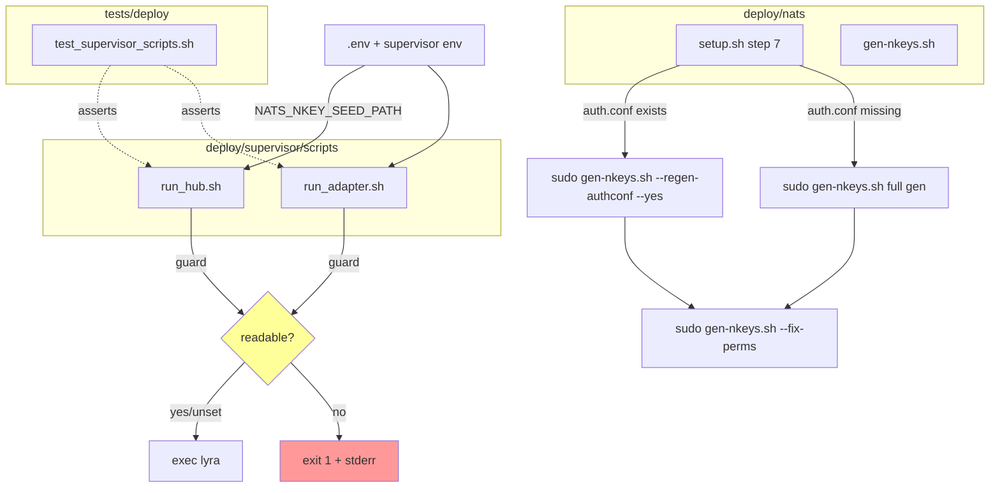
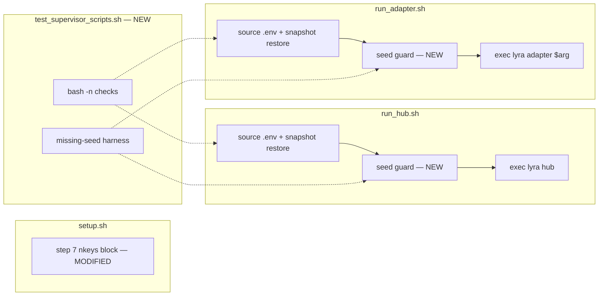

## Summary

Two guard insertions in supervisor wrapper scripts + one call change in `setup.sh` step 7 + a new bash test file. All slices bundled in one implementation pass since scope is small and slice 3 depends on slices 1–2.

## Architecture

### Control flow



### File × function map



## Agents

| Agent | Tasks | Files |
|---|---|---|
| devops | T1, T2, T3 | `deploy/supervisor/scripts/run_hub.sh`, `deploy/supervisor/scripts/run_adapter.sh`, `deploy/nats/setup.sh` |
| tester | T4 | `tests/deploy/test_supervisor_scripts.sh` (new) |

Both agents run sequentially: devops first (the test in T4 asserts against guards in T1/T2).

## Consistency Report

| Spec success criterion | Covered by |
|---|---|
| SC1 — guard exits non-zero w/ stderr (run_hub.sh) | T1 |
| SC2 — guard exits non-zero for run_adapter.sh, FATAL in supervisorctl | T2 |
| SC3 — unset NATS_NKEY_SEED_PATH = no regression | T1, T2 (guard no-ops when unset) |
| SC4 — setup.sh step 7 issues two sequential sudo calls | T3 |
| SC5 — rendered auth.conf matches IDENTITIES matrix | T3 + existing `test_gen_nkeys_acls.sh` (unchanged) |
| SC6 — `--fix-perms` remains valid standalone | T3 (leaves mode untouched) |
| SC7 — `make nats-setup` idempotent across two runs | T3 (deterministic template already confirmed) |
| SC8 — new test file exists and passes | T4 |
| SC9 — existing `test_gen_nkeys_acls.sh` unchanged | implicit (no edit to that file) |

Coverage: 9/9. No uncovered criteria, no untraced tasks.

## Micro-Tasks

### Slice 1 — Seed guard in supervisor scripts

**T1 [devops] — Add seed-path guard to `run_hub.sh`** `[difficulty: 1]` `[~3 min]`
- File: `deploy/supervisor/scripts/run_hub.sh`
- After `unset _sv_snapshot` (line 15 in current file), before `exec`:
  ```bash
  if [ -n "${NATS_NKEY_SEED_PATH:-}" ] && [ ! -r "$NATS_NKEY_SEED_PATH" ]; then
    echo "run_hub.sh: NATS_NKEY_SEED_PATH set but not readable: $NATS_NKEY_SEED_PATH" >&2
    exit 1
  fi
  ```
- Verify: `bash -n deploy/supervisor/scripts/run_hub.sh` → exit 0; `NATS_NKEY_SEED_PATH=/nonexistent HOME=/tmp bash deploy/supervisor/scripts/run_hub.sh 2>&1 | grep -q 'NATS_NKEY_SEED_PATH set but not readable'`
- Spec trace: SC1, SC3
- Phase: GREEN | Slice: V1

**T2 [devops] — Add seed-path guard to `run_adapter.sh`** `[difficulty: 1]` `[~3 min]`
- File: `deploy/supervisor/scripts/run_adapter.sh`
- Same guard snippet as T1 (label message as `run_adapter.sh:`), inserted after `unset _sv_snapshot` (line 15), before `exec`.
- Verify: `bash -n deploy/supervisor/scripts/run_adapter.sh` → exit 0; guard-trigger one-liner analogous to T1 with a platform arg.
- Spec trace: SC2, SC3
- Phase: GREEN | Slice: V1 | `[P]` (independent of T1)

### Slice 2 — setup.sh re-render on re-provision

**T3 [devops] — Split setup.sh step 7 into two sequential sudo calls** `[difficulty: 2]` `[~5 min]`
- File: `deploy/nats/setup.sh` (current lines 127–136)
- In the `[ -f "${NKEYS_AUTH}" ]` branch, replace the single `--fix-perms` call with two invocations:
  ```bash
  if [ -f "${NKEYS_AUTH}" ]; then
    info "auth.conf exists — re-rendering from current seeds (idempotent)."
    sudo "${LYRA_DIR}/deploy/nats/gen-nkeys.sh" --regen-authconf --yes
    sudo "${LYRA_DIR}/deploy/nats/gen-nkeys.sh" --fix-perms
  else
    sudo "${LYRA_DIR}/deploy/nats/gen-nkeys.sh"
  fi
  ```
- Header comment at top of `setup.sh` (line 13) already says "skips if present, re-applies permissions always" — update to read "re-renders auth.conf + re-applies permissions on re-run".
- Verify: `bash -n deploy/nats/setup.sh` → exit 0; `grep -A4 "^section \"nkeys\"" deploy/nats/setup.sh | grep -q 'regen-authconf'` — the new branch contains the regen call.
- Spec trace: SC4, SC5, SC6, SC7
- Phase: GREEN | Slice: V2 | `[P]` (independent of T1/T2)

### Slice 3 — Test harness

**T4 [tester] — Create `tests/deploy/test_supervisor_scripts.sh`** `[difficulty: 3]` `[~8 min]`
- File: `tests/deploy/test_supervisor_scripts.sh` (new)
- Create `tests/deploy/` directory if missing.
- Test body:
  1. `cd` to repo root, assert both scripts exist.
  2. `bash -n` each script (syntax check).
  3. Invoke `run_hub.sh` with `NATS_NKEY_SEED_PATH=/nonexistent/definitely-not-there`, `HOME=$(mktemp -d)` (no `.env`, no `.venv`). Capture stderr + exit code. Assert exit != 0 and stderr contains both `NATS_NKEY_SEED_PATH` and the path.
  4. Repeat for `run_adapter.sh telegram` — same assertions.
  5. Sanity: invoke `run_hub.sh` with `NATS_NKEY_SEED_PATH` unset and `HOME=$(mktemp -d)` → must fail at `exec` (missing `.venv/bin/lyra`) **not** at the guard. Assert exit != 0 and stderr does **not** contain `NATS_NKEY_SEED_PATH set but not readable`. Confirms guard no-ops when unset.
  6. Print PASS summary.
- Use `set -euo pipefail`, `mktemp -d` for scratch `$HOME`, `trap` cleanup.
- Verify: `bash tests/deploy/test_supervisor_scripts.sh` → exits 0 with `PASS` lines.
- Spec trace: SC8, SC9 (no edit to `test_gen_nkeys_acls.sh`)
- Phase: GREEN | Slice: V3 | depends on T1, T2

### RED-GATE sentinel

After T1+T2+T3 land and before T4: manual sanity run — `bash -n` all three scripts, `make nats-setup` locally is NOT required (no NATS daemon on dev box); idempotency check deferred to prod re-provision.

## Task IDs

<!-- Generated by /plan. Used by /implement to resume tasks on session restart. -->
- T1: 12 — Add seed-path guard to run_hub.sh
- T2: 13 — Add seed-path guard to run_adapter.sh
- T3: 14 — Split setup.sh step 7 into two sequential sudo calls
- T4: 15 — Create tests/deploy/test_supervisor_scripts.sh
