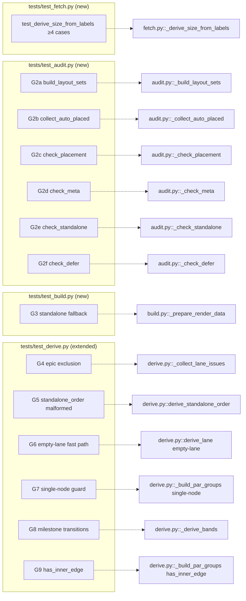

## Summary

Backfill 9 coverage gaps (G1–G9) flagged by the `tester` review agent after PR #739. Adds 2 new test files (`test_fetch.py`, `test_audit.py`, `test_build.py`) and extends `test_derive.py`. Zero production code changes.

## Architecture



## Bootstrap Context

Reference pattern file: `scripts/dep-graph/tests/test_derive.py` — canonical style (synthetic `_issue`/`_lane`/`_gh` helpers, no filesystem, no network). Reuse its helper shape across all new files; either import from `tests.test_derive` or duplicate into each new file (lighter coupling).

Production targets (do NOT modify):
- `scripts/dep-graph/dep_graph/fetch.py:133-138`
- `scripts/dep-graph/dep_graph/audit.py:177-378`
- `scripts/dep-graph/dep_graph/build.py:1189-1253`
- `scripts/dep-graph/dep_graph/derive.py:117-294`

## Agents

| Agent | Task count | Files |
|---|---|---|
| tester | 17 | `scripts/dep-graph/tests/test_fetch.py`, `test_audit.py`, `test_build.py`, `test_derive.py` |

## Consistency Report

- **Covered:** 9/9 gaps (G1, G2a–G2f, G3, G4, G5, G6, G7, G8, G9)
- **Uncovered:** none
- **Untraced tasks:** none
- **Exemptions:** none

## Micro-Tasks

### Slice 2 — `test_fetch.py` (new) · covers G1

#### T1 · GREEN · Create test_fetch.py with ≥4 `_derive_size_from_labels` cases
- **File:** `scripts/dep-graph/tests/test_fetch.py`
- **Snippet:**
  ```python
  from dep_graph.fetch import _derive_size_from_labels

  def test_derive_size_empty_list(): ...
  def test_derive_size_no_size_prefix(): ...
  def test_derive_size_valid_label(): ...
  def test_derive_size_multiple_labels_first_wins(): ...
  ```
- **Verify:** `cd scripts/dep-graph && uv run pytest -v tests/test_fetch.py`
- **Expected:** 4 passed
- **Time:** 5 min
- **Agent:** tester
- **Spec trace:** G1 / SC-2
- **Slice:** V2
- **Phase:** GREEN
- **Difficulty:** 1
- **[P]:** N (new file)

### Slice 1 — `test_derive.py` (extended) · covers G4–G9

#### T2 · GREEN · G4 — epic exclusion (same-repo + cross-repo)
- **File:** `scripts/dep-graph/tests/test_derive.py`
- **Snippet:**
  ```python
  def test_derive_lane_epic_excluded_same_repo(): ...
  def test_derive_lane_epic_not_excluded_cross_repo(): ...
  ```
- **Details:** Build lane with `epic={"repo": REPO, "issue": N}`. Same-repo epic issue must NOT appear in `order`; cross-repo epic MUST appear.
- **Verify:** `cd scripts/dep-graph && uv run pytest -v tests/test_derive.py -k epic`
- **Expected:** 2 passed
- **Time:** 6 min
- **Agent:** tester
- **Spec trace:** G4 / SC-5
- **Slice:** V1
- **Phase:** GREEN
- **Difficulty:** 2
- **[P]:** N (same file as T3–T7)

#### T3 · GREEN · G5 — `derive_standalone_order` malformed + default_repo
- **File:** `scripts/dep-graph/tests/test_derive.py`
- **Snippet:**
  ```python
  @pytest.mark.parametrize("entry", [None, {}, {"standalone": True}, {"standalone": False, "number": 1}])
  def test_derive_standalone_order_skips_malformed(entry): ...

  def test_derive_standalone_order_defaults_repo(): ...
  ```
- **Details:** Skip-case parametrize covers None/empty/missing-number/standalone=False. Separate test: entry with `standalone=True`, `number=5` and NO `repo` → entry.repo defaults to `primary_repo`.
- **Verify:** `cd scripts/dep-graph && uv run pytest -v tests/test_derive.py -k standalone_order`
- **Expected:** 5 passed (4 parametrized skip cases + 1 default_repo + 2 existing)
- **Time:** 5 min
- **Agent:** tester
- **Spec trace:** G5 / SC-5
- **Slice:** V1
- **Phase:** GREEN
- **Difficulty:** 2
- **[P]:** N

#### T4 · GREEN · G6 — empty-lane fast path
- **File:** `scripts/dep-graph/tests/test_derive.py`
- **Snippet:**
  ```python
  def test_derive_lane_empty_fast_path():
      result = derive_lane(_lane("nomatch"), _gh(_issue(1, lane="other")), REPO)
      assert result["order"] == []
      assert result["par_groups"] == {}
      assert result["bands"] == []
  ```
- **Verify:** `cd scripts/dep-graph && uv run pytest -v tests/test_derive.py -k empty_fast_path`
- **Expected:** 1 passed
- **Time:** 3 min
- **Agent:** tester
- **Spec trace:** G6 / SC-5
- **Slice:** V1
- **Phase:** GREEN
- **Difficulty:** 1
- **[P]:** N

#### T5 · GREEN · G7 — single-node `par_groups` guard
- **File:** `scripts/dep-graph/tests/test_derive.py`
- **Snippet:**
  ```python
  def test_derive_lane_single_node_no_par_group():
      result = derive_lane(_lane("s"), _gh(_issue(1, lane="s")), REPO)
      assert result["par_groups"] == {}
  ```
- **Verify:** `cd scripts/dep-graph && uv run pytest -v tests/test_derive.py -k single_node`
- **Expected:** 1 passed
- **Time:** 3 min
- **Agent:** tester
- **Spec trace:** G7 / SC-5
- **Slice:** V1
- **Phase:** GREEN
- **Difficulty:** 1
- **[P]:** N

#### T6 · GREEN · G8 — milestone transitions (3 separate tests)
- **File:** `scripts/dep-graph/tests/test_derive.py`
- **Snippet:**
  ```python
  def test_derive_bands_none_to_named():
      # #1 no milestone, #2 has milestone "M1" → band before #2
      ...
  def test_derive_bands_named_to_none():
      # #1 has "M1", #2 has no milestone → NO band inserted after #1
      ...
  def test_derive_bands_all_same_milestone():
      # all issues share "M1" → exactly 1 band at start
      ...
  ```
- **Verify:** `cd scripts/dep-graph && uv run pytest -v tests/test_derive.py -k bands`
- **Expected:** 3 new + 2 existing = 5 passed
- **Time:** 8 min
- **Agent:** tester
- **Spec trace:** G8 / SC-5
- **Slice:** V1
- **Phase:** GREEN
- **Difficulty:** 3
- **[P]:** N

#### T7 · GREEN · G9 — `_build_par_groups` `has_inner_edge` skip (2 tests)
- **File:** `scripts/dep-graph/tests/test_derive.py`
- **Snippet:**
  ```python
  def test_build_par_groups_has_inner_edge_skip():
      # Call _build_par_groups directly with hand-built depth/edges
      # where one bucket contains an intra-bucket edge
      ...
  def test_build_par_groups_creates_group_without_inner_edge():
      # Bucket with no intra-bucket edges → par_group created
      ...
  ```
- **Details:** Per spec G9 hint — call `_build_par_groups` directly with hand-built `depth`/`edges` inputs to exercise the skip branch deterministically. Avoids wrestling with topo-sort depth assignment to create a cycle-based same-depth edge via `derive_lane`.
- **Verify:** `cd scripts/dep-graph && uv run pytest -v tests/test_derive.py -k par_groups`
- **Expected:** 2 new + 1 existing = 3 passed
- **Time:** 8 min
- **Agent:** tester
- **Spec trace:** G9 / SC-5
- **Slice:** V1
- **Phase:** GREEN
- **Difficulty:** 3
- **[P]:** N

### Slice 3 — `test_audit.py` (new) · covers G2a–G2f

#### T8 · GREEN · test_audit.py scaffold + G2a `_build_layout_sets` (≥3 cases)
- **File:** `scripts/dep-graph/tests/test_audit.py`
- **Snippet:**
  ```python
  from dep_graph.audit import (
      _build_layout_sets,
      _collect_auto_placed,
      _check_placement,
      _check_meta,
      _check_standalone,
      _check_defer,
  )

  REPO = "Owner/repo"

  def test_build_layout_sets_lane_with_order(): ...
  def test_build_layout_sets_lane_without_order_added_to_auto_codes(): ...
  def test_build_layout_sets_epic_missing_repo_excluded(): ...
  ```
- **Details:** First task in slice 3 — creates the file and exercises constraint #3 (helper importability) by doing the 6 imports at the top. If any ImportError, record in PR description and fall back to testing via public entry point for that helper. Epic-missing-repo case targets `audit.py:301 if epic_repo:` dark branch.
- **Verify:** `cd scripts/dep-graph && uv run pytest -v tests/test_audit.py`
- **Expected:** 3 passed
- **Time:** 8 min
- **Agent:** tester
- **Spec trace:** G2a / SC-3
- **Slice:** V3
- **Phase:** GREEN
- **Difficulty:** 2
- **[P]:** N (creates file)

#### T9 · GREEN · G2b `_collect_auto_placed` (≥3 cases)
- **File:** `scripts/dep-graph/tests/test_audit.py`
- **Snippet:**
  ```python
  def test_collect_auto_placed_empty_lane_codes(): ...
  def test_collect_auto_placed_populated_match(): ...
  def test_collect_auto_placed_standalone_order_absent_extends_set(): ...
  ```
- **Verify:** `cd scripts/dep-graph && uv run pytest -v tests/test_audit.py -k collect_auto_placed`
- **Expected:** 3 passed
- **Time:** 6 min
- **Agent:** tester
- **Spec trace:** G2b / SC-3
- **Slice:** V3
- **Phase:** GREEN
- **Difficulty:** 2
- **[P]:** N

#### T10 · GREEN · G2c `_check_placement` (both branches)
- **File:** `scripts/dep-graph/tests/test_audit.py`
- **Snippet:**
  ```python
  def test_check_placement_empty_layout_lane_of_prints_skipped(capsys): ...
  def test_check_placement_populated_calls_label_mismatches(): ...
  ```
- **Verify:** `cd scripts/dep-graph && uv run pytest -v tests/test_audit.py -k check_placement`
- **Expected:** 2 passed
- **Time:** 5 min
- **Agent:** tester
- **Spec trace:** G2c / SC-3
- **Slice:** V3
- **Phase:** GREEN
- **Difficulty:** 2
- **[P]:** N

#### T11 · GREEN · G2d `_check_meta` forwards `auto_placed` to `_check_defer` only
- **File:** `scripts/dep-graph/tests/test_audit.py`
- **Snippet:**
  ```python
  def test_check_meta_forwards_auto_placed(monkeypatch):
      # Stub _check_defer and _check_standalone to capture call kwargs;
      # assert _check_defer received auto_placed and _check_standalone did not.
      ...
  ```
- **Verify:** `cd scripts/dep-graph && uv run pytest -v tests/test_audit.py -k check_meta`
- **Expected:** 1 passed
- **Time:** 6 min
- **Agent:** tester
- **Spec trace:** G2d / SC-3
- **Slice:** V3
- **Phase:** GREEN
- **Difficulty:** 3
- **[P]:** N

#### T12 · GREEN · G2e `_check_standalone` auto-mode (both branches)
- **File:** `scripts/dep-graph/tests/test_audit.py`
- **Snippet:**
  ```python
  def test_check_standalone_auto_mode_empty_order_skips(capsys): ...
  def test_check_standalone_explicit_order_detects_drift(): ...
  ```
- **Verify:** `cd scripts/dep-graph && uv run pytest -v tests/test_audit.py -k check_standalone`
- **Expected:** 2 passed
- **Time:** 6 min
- **Agent:** tester
- **Spec trace:** G2e / SC-3
- **Slice:** V3
- **Phase:** GREEN
- **Difficulty:** 2
- **[P]:** N

#### T13 · GREEN · G2f `_check_defer` `auto_placed` arg (both branches)
- **File:** `scripts/dep-graph/tests/test_audit.py`
- **Snippet:**
  ```python
  def test_check_defer_auto_placed_none(): ...
  def test_check_defer_auto_placed_populated_excludes_items(): ...
  ```
- **Verify:** `cd scripts/dep-graph && uv run pytest -v tests/test_audit.py -k check_defer`
- **Expected:** 2 passed
- **Time:** 6 min
- **Agent:** tester
- **Spec trace:** G2f / SC-3
- **Slice:** V3
- **Phase:** GREEN
- **Difficulty:** 2
- **[P]:** N

### Slice 4 — `test_build.py` (new) · covers G3

#### T14 · GREEN · test_build.py scaffold + G3 standalone fallback (called + not-called)
- **File:** `scripts/dep-graph/tests/test_build.py`
- **Snippet:**
  ```python
  from dep_graph.build import _prepare_render_data

  def test_prepare_render_data_standalone_fallback_called(monkeypatch):
      # layout with empty standalone.order → derive_standalone_order IS called
      calls = []
      monkeypatch.setattr(
          "dep_graph.build.derive_standalone_order",
          lambda gh, repo: (calls.append((gh, repo)), [])[1],
      )
      _prepare_render_data({...}, {}, REPO, {})
      assert len(calls) == 1

  def test_prepare_render_data_standalone_fallback_skipped(monkeypatch):
      # layout with non-empty standalone.order → derive_standalone_order NOT called
      ...
  ```
- **Details:** Patch target is **`dep_graph.build.derive_standalone_order`** (the import inside `build.py`), not `dep_graph.derive.derive_standalone_order`. Split positive (called) and negative (not called) into separate tests per spec G3 handler.
- **Verify:** `cd scripts/dep-graph && uv run pytest -v tests/test_build.py`
- **Expected:** 2 passed
- **Time:** 8 min
- **Agent:** tester
- **Spec trace:** G3 / SC-4
- **Slice:** V4
- **Phase:** GREEN
- **Difficulty:** 3
- **[P]:** N (new file)

### Gates

#### T15 · RED-GATE · Full pytest suite green
- **Verify:** `cd scripts/dep-graph && uv run pytest -v`
- **Expected:** Exit 0; ≥19 new tests + 11 existing; all green. Print the numeric total.
- **Depends on:** T1–T14
- **Time:** 2 min
- **Agent:** tester
- **Spec trace:** SC-7
- **Slice:** V5
- **Phase:** RED-GATE
- **Difficulty:** 1
- **[P]:** N

#### T16 · RED-GATE · Lint + format clean on new test files
- **Verify:** `uv run ruff check scripts/dep-graph/tests/ && uv run ruff format --check scripts/dep-graph/tests/`
- **Expected:** Both commands exit 0.
- **Depends on:** T15
- **Time:** 2 min
- **Agent:** tester
- **Spec trace:** SC-9
- **Slice:** V5
- **Phase:** RED-GATE
- **Difficulty:** 1
- **[P]:** N

#### T17 · REFACTOR · Mutation-check 3 gaps + verify no-prod-changes + write PR description block
- **Verify:**
  1. Pick 3 gaps (author's choice).
  2. For each: mutate target line in production (e.g., flip a condition, swap a constant), re-run the matching test, confirm it FAILS, then revert the mutation.
  3. `git diff origin/staging -- scripts/dep-graph/dep_graph/` MUST be empty (constraint #1).
  4. `grep -E "open\(|json\.load|requests\.|gh\.json" scripts/dep-graph/tests/test_{fetch,audit,build,derive}.py` MUST return nothing from the new files.
  5. Record which 3 gaps were mutation-checked in a draft PR-description block saved to scratch.
- **Expected:** All 3 mutations flip a test red; reversion leaves suite green; prod diff is empty; no filesystem/network greps match.
- **Depends on:** T16
- **Time:** 10 min
- **Agent:** tester
- **Spec trace:** SC-1 / SC-6 / SC-7
- **Slice:** V5
- **Phase:** REFACTOR
- **Difficulty:** 2
- **[P]:** N

## Task IDs

<!-- Generated by /plan. Used by /implement to resume tasks on session restart. -->
- T1: 12 — Create test_fetch.py with ≥4 _derive_size_from_labels cases
- T2: 13 — G4 epic exclusion — same-repo + cross-repo
- T3: 14 — G5 derive_standalone_order malformed + default_repo
- T4: 15 — G6 empty-lane fast path
- T5: 16 — G7 single-node par_groups guard
- T6: 17 — G8 milestone transitions (3 tests)
- T7: 18 — G9 _build_par_groups has_inner_edge skip (2 tests)
- T8: 19 — Create test_audit.py + G2a _build_layout_sets (≥3 cases)
- T9: 20 — G2b _collect_auto_placed (≥3 cases)
- T10: 21 — G2c _check_placement (skip + populated branches)
- T11: 22 — G2d _check_meta forwards auto_placed to _check_defer only
- T12: 23 — G2e _check_standalone auto-mode (both branches)
- T13: 24 — G2f _check_defer auto_placed arg (both branches)
- T14: 25 — Create test_build.py + G3 standalone fallback (called + not-called)
- T15: 26 — RED-GATE Full pytest green
- T16: 27 — RED-GATE Ruff check + format
- T17: 28 — REFACTOR Mutation-check 3 gaps + verify constraints + PR description block
