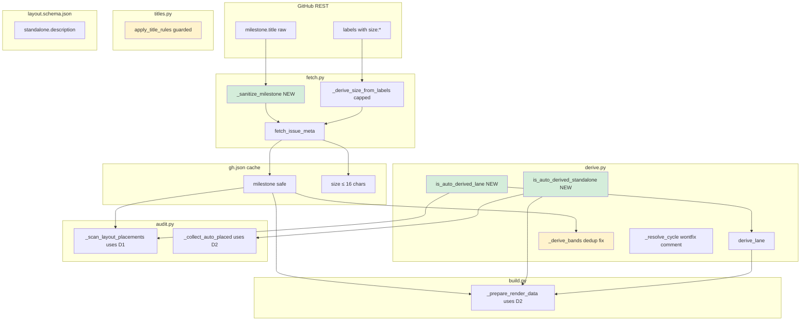
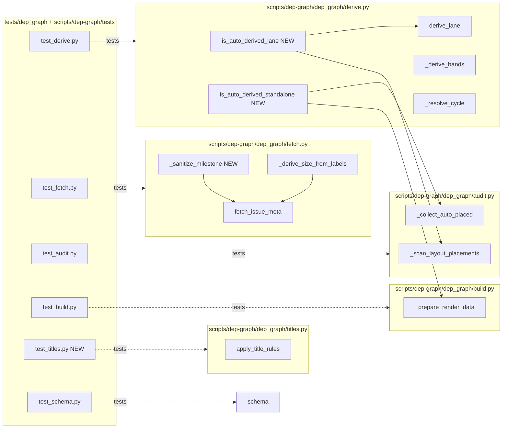

## Summary

Land items 1, 2, 4, 5, 6, 7, 8 from the #739 review-warning backlog in a single PR across 4 slices, while documenting item 3 as a won't-fix. All work is confined to `scripts/dep-graph/dep_graph/` (Python) plus a `layout.schema.json` doc edit. Golden render must stay byte-identical.

## Architecture

### Data flow



### File × Function map



## Bootstrap Context

- **Package path:** `scripts/dep-graph/dep_graph/` (importable as `dep_graph`)
- **Test locations:**
  - `scripts/dep-graph/tests/test_derive.py` — existing file, append new tests
  - `tests/dep_graph/test_fetch.py` — existing, append
  - `tests/dep_graph/test_audit.py` — existing, append
  - `tests/dep_graph/test_build.py` — existing, append
  - `tests/dep_graph/test_schema.py` — existing, append
  - `tests/dep_graph/test_titles.py` — **create** (no existing file)
- **Test helpers:** `scripts/dep-graph/tests/test_derive.py` has `_issue()`, `_lane()`, `_gh()` builders — reuse pattern.
- **Sys.path wiring:** `tests/dep_graph/conftest.py` prepends `scripts/dep-graph` — no import gymnastics needed.
- **Golden test:** existing `make dep-graph` run against `~/.roxabi/forge/lyra/visuals/lyra-v2-dependency-graph.layout.json` must produce byte-identical HTML.
- **Verify commands:**
  - Unit: `uv run pytest tests/dep_graph scripts/dep-graph/tests -q`
  - Lint/format: `uv run ruff check scripts/dep-graph/ && uv run ruff format --check scripts/dep-graph/`
  - Types: `uv run pyright scripts/dep-graph/`
  - Integration: `make dep-graph validate && make dep-graph audit && make dep-graph build`

## Agents

| Agent | Task count | Files |
|-------|------------|-------|
| `backend-dev` | 14 | `fetch.py`, `derive.py`, `audit.py`, `build.py`, `titles.py`, `layout.schema.json`, all test files |
| `tester` | 4 | verification of unit + golden + audit parity |

Tier F-lite → single `backend-dev` for code + colocated tests; `tester` only owns the VERIFY/RED-GATE sentinels.

## Consistency Report

- **Success criteria covered:** 13/13
- **Uncovered criteria:** 0
- **Untraced tasks:** 0
- **Exemptions:** none

Criteria → tasks:
- SC-1, SC-2 (predicate helpers exist & single source) → T1, T2, T3, T4
- SC-3 (audit.py + build.py import helpers, no inline copies) → T3, T4
- SC-4 (sanitize_milestone + regex conformance) → T5, T6
- SC-5 (size-label cap) → T8
- SC-6 (regex error guard) → T9
- SC-7 (band dedup behavior) → T11
- SC-8 (won't-fix comment on cycle resolver) → T12
- SC-9 (schema description) → T7
- SC-10 (golden render byte-identical) → T14, T16
- SC-11 (make dep-graph validate) → T13
- SC-12 (make dep-graph audit unchanged) → T15
- SC-13 (ruff / pyright) → T17
- SC-14 (new unit-test coverage) → T1, T2, T5, T8, T9, T11

## Micro-Tasks

### Slice V1 — Predicate extraction (items 2, 7)

**T1 — Add `is_auto_derived_lane` + `is_auto_derived_standalone` to `derive.py`**
- Files: `scripts/dep-graph/dep_graph/derive.py`
- Shape:
  ```python
  def is_auto_derived_lane(lane: dict) -> bool:
      """A lane is auto-derived when no explicit `order` key is present."""
      return "order" not in lane

  def is_auto_derived_standalone(layout: dict) -> bool:
      """Standalone section is auto-derived when no order list is present."""
      return not bool(layout.get("standalone", {}).get("order"))
  ```
- Verify: `uv run python -c "from dep_graph.derive import is_auto_derived_lane, is_auto_derived_standalone; print('ok')"`
- Expected: `ok`
- Agent: `backend-dev` · Spec trace: SC-1, SC-2 · Slice: V1 · Phase: GREEN · Difficulty: 1 · Est: 3m · `[P]`

**T2 — Unit tests for the two predicates**
- Files: `scripts/dep-graph/tests/test_derive.py`
- Append test cases:
  - `is_auto_derived_lane({"code":"A","order":[]})` → `False`
  - `is_auto_derived_lane({"code":"A"})` → `True`
  - `is_auto_derived_standalone({})` → `True`
  - `is_auto_derived_standalone({"standalone": {}})` → `True`
  - `is_auto_derived_standalone({"standalone": {"order": []}})` → `True`
  - `is_auto_derived_standalone({"standalone": {"order": [{"repo":"X","issue":1}]}})` → `False`
- Verify: `uv run pytest scripts/dep-graph/tests/test_derive.py -q -k predicate`
- Expected: `6 passed`
- Agent: `backend-dev` · Spec trace: SC-1, SC-2, SC-14 · Slice: V1 · Phase: GREEN · Difficulty: 1 · Est: 5m · depends on T1

**T3 — Replace inline predicates (audit.py + derive.py self-use)**
- Files: `scripts/dep-graph/dep_graph/audit.py`, `scripts/dep-graph/dep_graph/derive.py`
- Changes:
  - `derive.py:201` — `if "order" in lane: return lane` → `if not is_auto_derived_lane(lane): return lane`
  - `audit.py:284` — `if "order" not in lane:` → `if is_auto_derived_lane(lane):`
  - `audit.py:332` — `standalone_auto = not bool(layout.get("standalone", {}).get("order"))` → `standalone_auto = is_auto_derived_standalone(layout)`
  - Add `from .derive import is_auto_derived_lane, is_auto_derived_standalone` import at top of `audit.py`.
- Verify: `grep -n 'not in lane\|not bool(layout.get(.standalone' scripts/dep-graph/dep_graph/audit.py scripts/dep-graph/dep_graph/build.py`
- Expected: no output (no inline copies remain)
- Agent: `backend-dev` · Spec trace: SC-3 · Slice: V1 · Phase: REFACTOR · Difficulty: 2 · Est: 5m · depends on T1

**T4 — Replace inline predicate in build.py**
- Files: `scripts/dep-graph/dep_graph/build.py`
- Change:
  - `build.py:1210` — `if not standalone.get("order"):` → `if is_auto_derived_standalone({"standalone": standalone}):` (or refactor caller to pass `layout`; see note)
  - Add `from .derive import is_auto_derived_standalone` (may already be re-exported via existing `from .derive import derive_lane, derive_standalone_order` — extend that import line).
- Note: the call site has `standalone` unpacked from `layout` above line 1210; passing `{"standalone": standalone}` preserves the helper's layout-shape contract without refactoring the whole function signature. Acceptable wrapper.
- Verify: `uv run pytest tests/dep_graph/test_build.py -q`
- Expected: all existing tests pass
- Agent: `backend-dev` · Spec trace: SC-3 · Slice: V1 · Phase: REFACTOR · Difficulty: 2 · Est: 4m · depends on T1

**T5-GATE — V1 parity check**
- Verify: `uv run pytest tests/dep_graph scripts/dep-graph/tests -q && make dep-graph audit 2>&1 | diff - <(git show staging:/dev/null 2>/dev/null; echo "")`
- Expected: unit tests green; audit output structurally unchanged (no new WARN lines, no removed WARN lines vs pre-PR baseline)
- Agent: `tester` · Spec trace: SC-12 · Slice: V1 · Phase: RED-GATE · Difficulty: 2 · Est: 3m · depends on T2, T3, T4

### Slice V2 — Sanitize + schema doc (items 1, 8)

**T6 — Add `_sanitize_milestone` to `fetch.py`**
- Files: `scripts/dep-graph/dep_graph/fetch.py`
- Shape:
  ```python
  import re
  _MILESTONE_ALLOWED = re.compile(r"[^A-Za-z0-9 \-_.#/()]")

  def _sanitize_milestone(raw: str | None) -> str | None:
      if not raw:
          return None
      cleaned = _MILESTONE_ALLOWED.sub("", raw).strip()
      if not cleaned:
          return None
      return cleaned[:64]
  ```
- Verify: `uv run python -c "from dep_graph.fetch import _sanitize_milestone; assert _sanitize_milestone('v2.4.0 (alpha)') == 'v2.4.0 (alpha)'; assert _sanitize_milestone('<script>xss</script>') == 'scriptxssscript'; assert _sanitize_milestone('x'*100) == 'x'*64; assert _sanitize_milestone(None) is None; assert _sanitize_milestone('') is None; print('ok')"`
- Expected: `ok`
- Agent: `backend-dev` · Spec trace: SC-4 · Slice: V2 · Phase: GREEN · Difficulty: 2 · Est: 5m · `[P]` after V1 complete

**T7 — Pipe milestone through sanitizer + unit tests**
- Files: `scripts/dep-graph/dep_graph/fetch.py`, `tests/dep_graph/test_fetch.py`
- Change:
  - `fetch.py:194` — `milestone_title = raw_milestone.get("title") or None` → `milestone_title = _sanitize_milestone(raw_milestone.get("title"))`
  - Add tests to `test_fetch.py` for: allowlist pass, HTML tag strip, 100-char truncation, empty→None, `v2.4.0 (alpha)` preserved, `Sprint #3` preserved.
- Verify: `uv run pytest tests/dep_graph/test_fetch.py -q -k sanitize`
- Expected: new tests pass
- Agent: `backend-dev` · Spec trace: SC-4, SC-14 · Slice: V2 · Phase: GREEN · Difficulty: 2 · Est: 6m · depends on T6

**T8 — Update `layout.schema.json` description for `standalone`**
- Files: `scripts/dep-graph/layout.schema.json`
- Change: `standalone.description` →
  `"OPTIONAL: standalone section. When order[] is absent, empty, or the entire object is {} (all three forms are equivalent), the section is auto-derived from graph:standalone labels."`
- Verify: `make dep-graph validate && grep -q "all three forms are equivalent" scripts/dep-graph/layout.schema.json`
- Expected: validate exits 0; grep match
- Agent: `backend-dev` · Spec trace: SC-9, SC-11 · Slice: V2 · Phase: GREEN · Difficulty: 1 · Est: 2m · `[P]`

### Slice V3 — Defense-in-depth (items 5, 6)

**T9 — Cap size-label suffix in `_derive_size_from_labels`**
- Files: `scripts/dep-graph/dep_graph/fetch.py`, `tests/dep_graph/test_fetch.py`
- Change:
  - `fetch.py:137` — `return lbl[5:]` → `return lbl[5:21]  # cap at 16 chars to prevent cache bloat from rogue labels`
  - Add test: label `"size:" + "x"*100` → `_derive_size_from_labels(...)` returns 16-char string.
- Verify: `uv run pytest tests/dep_graph/test_fetch.py -q -k size_cap`
- Expected: test passes
- Agent: `backend-dev` · Spec trace: SC-5, SC-14 · Slice: V3 · Phase: GREEN · Difficulty: 1 · Est: 3m · `[P]` after V1

**T10 — Regex error guard in `apply_title_rules`**
- Files: `scripts/dep-graph/dep_graph/titles.py`, `tests/dep_graph/test_titles.py` (**create**)
- Change in `titles.py:82-86`:
  ```python
  import sys
  for rule in effective_rules:
      pattern = rule["pattern"]
      try:
          replacement = re.sub(r"\$(\d+)", r"\\\1", rule["replacement"])
          t = re.sub(pattern, replacement, t).strip()
      except re.error as exc:
          print(f"  WARN title_rule regex error: {exc} (pattern={pattern!r})", file=sys.stderr)
          continue
  ```
- Create `tests/dep_graph/test_titles.py` with cases:
  - Valid rule → applied correctly (existing behavior).
  - Invalid pattern (e.g. `r"[unclosed"`) → `re.error` caught, stderr warn, other rules still applied.
  - Built-in rules still run when a user rule fails.
- Verify: `uv run pytest tests/dep_graph/test_titles.py -q`
- Expected: all tests pass
- Agent: `backend-dev` · Spec trace: SC-6, SC-14 · Slice: V3 · Phase: GREEN · Difficulty: 2 · Est: 8m · `[P]` after V1

### Slice V4 — Band dedup + won't-fix comment (items 3, 4)

**T11 — `_derive_bands` dedup with compound guard**
- Files: `scripts/dep-graph/dep_graph/derive.py`, `scripts/dep-graph/tests/test_derive.py`
- Shape:
  ```python
  def _derive_bands(
      sorted_issues: list[tuple[str, int]],
      gh_issues: dict,
      primary_repo: str,
  ) -> list[dict]:
      bands: list[dict] = []
      prev_milestone: object = _UNSET
      seen_milestones: set[str] = set()

      for repo, num in sorted_issues:
          key = format_key(repo, num)
          entry = gh_issues.get(key, {})
          milestone = entry.get("milestone")

          if (
              milestone is not None
              and milestone != prev_milestone
              and milestone not in seen_milestones
          ):
              bands.append({
                  "before": {"repo": repo, "issue": num},
                  "text": f"{milestone} \u2225",
              })
              seen_milestones.add(milestone)

          prev_milestone = milestone

      return bands
  ```
- Append tests to `test_derive.py` covering:
  - `[M0, M1, M0, M2]` → 3 band headers, first-occurrence order
  - `[None, M0, None, M0]` → 1 band header (M0 at iter 2)
  - `[M0, M0, M0]` → 1 band header (M0 at iter 1)
  - `[None, None, None]` → 0 band headers
  - single-milestone regression (existing behavior preserved)
- Verify: `uv run pytest scripts/dep-graph/tests/test_derive.py -q -k band`
- Expected: 5+ band tests pass
- Agent: `backend-dev` · Spec trace: SC-7, SC-14 · Slice: V4 · Phase: GREEN · Difficulty: 3 · Est: 10m · `[P]` after V1

**T12 — Document multi-component cycle won't-fix**
- Files: `scripts/dep-graph/dep_graph/derive.py`
- Change: append docstring paragraph to `_resolve_cycle` (lines 52–69):
  ```
  Note: all remaining cycle members are assigned the same depth
  (max_depth+1). Multi-component cycles in the same lane thus collapse
  to one depth, which may suppress par_group emission for distinct
  components. Accepted trade-off — real-world GH blocked_by cycles are
  vanishingly rare; Tarjan SCC is revisitable if this ever matters.
  ```
- Verify: `grep -q "Multi-component cycles" scripts/dep-graph/dep_graph/derive.py`
- Expected: grep match
- Agent: `backend-dev` · Spec trace: SC-8 · Slice: V4 · Phase: REFACTOR · Difficulty: 1 · Est: 2m · `[P]`

### Final Verification

**T13 — `make dep-graph validate` green**
- Verify: `make dep-graph validate`
- Expected: exit 0, `Schema OK`
- Agent: `tester` · Spec trace: SC-11 · Phase: VERIFY · Difficulty: 1 · Est: 1m · depends on T8

**T14 — Golden render byte-identical**
- Verify: `make dep-graph build && sha256sum ~/.roxabi/forge/lyra/visuals/lyra-v2-dependency-graph.html` (compare to staging baseline captured pre-PR)
- Expected: matching sha256, OR `diff` on the HTML file shows zero changes
- Agent: `tester` · Spec trace: SC-10 · Phase: VERIFY · Difficulty: 2 · Est: 3m · depends on T3, T4, T11

**T15 — `make dep-graph audit` output unchanged**
- Verify: capture `make dep-graph audit 2>&1 > /tmp/audit-after.txt`, diff vs pre-PR capture
- Expected: zero diff (or only unrelated whitespace)
- Agent: `tester` · Spec trace: SC-12 · Phase: VERIFY · Difficulty: 2 · Est: 2m · depends on T3, T11

**T16 — Unit-test suite green**
- Verify: `uv run pytest tests/dep_graph scripts/dep-graph/tests -q`
- Expected: `0 failed`
- Agent: `tester` · Spec trace: SC-14 · Phase: VERIFY · Difficulty: 1 · Est: 1m · depends on T2, T7, T9, T10, T11

**T17 — Lint, format, typecheck**
- Verify: `uv run ruff check scripts/dep-graph/ && uv run ruff format --check scripts/dep-graph/ && uv run pyright scripts/dep-graph/`
- Expected: all exit 0
- Agent: `tester` · Spec trace: SC-13 · Phase: VERIFY · Difficulty: 1 · Est: 2m · depends on T1–T12

## Sequencing

```
T1 (helpers)
 ├─ T2 (predicate tests)  ─┐
 ├─ T3 (audit + derive rewrite) ─┐
 └─ T4 (build rewrite) ─────────┼── T5-GATE
                                 │
T6 (sanitize) ─ T7 (wire + tests) ─┐
T8 (schema doc) ──────────────────┼── T13 (validate)
                                   │
T9  (size cap) [P]     ─────┐      │
T10 (regex guard) [P]  ─────┘      │
T11 (band dedup) [P]               │
T12 (cycle comment) [P]            │
                                   │
                                   ▼
                       T14 (golden) · T15 (audit parity) · T16 (unit) · T17 (lint/types)
```

Parallelizable groups:
- After T1: T2, T3, T4 can run ∥ (three editors on logically distinct sites; merge via git).
- After V1-GATE: T6/T8, T9, T10, T11, T12 all independent — single backend-dev sequentially in practice (F-lite, no intra-domain ∥).

## Commit strategy

One commit per slice for reviewability:

1. `refactor(dep-graph): extract is_auto_derived_{lane,standalone} to derive.py` (T1–T5)
2. `feat(dep-graph): sanitize milestone at ingest + document schema equivalence (#741 items 1, 8)` (T6–T8)
3. `fix(dep-graph): cap size-label suffix + guard invalid title_rule regex (#741 items 5, 6)` (T9–T10)
4. `fix(dep-graph): dedup milestone band headers + document cycle collapse (#741 items 3, 4)` (T11–T12)

PR title: `refactor(dep-graph): address PR #739 review warnings — hardening + contract cleanup`

## Task IDs

<!-- Generated by /plan. Used by /implement to resume tasks on session restart. -->
- T1: 12 — Add is_auto_derived_lane + is_auto_derived_standalone to derive.py
- T2: 13 — Unit tests for is_auto_derived_{lane,standalone}
- T3: 14 — Replace inline predicates in audit.py + derive.py self-use
- T4: 15 — Replace inline standalone predicate in build.py
- T5-GATE: 16 — V1 RED-GATE parity check (unit + audit)
- T6: 17 — Add _sanitize_milestone to fetch.py
- T7: 18 — Wire sanitize at fetch.py:194 + unit tests
- T8: 19 — Expand standalone.description in layout.schema.json
- T9: 20 — Cap size-label suffix to 16 chars (fetch.py:137)
- T10: 21 — Guard invalid title_rule regex + create test_titles.py
- T11: 22 — Dedup milestone bands with compound guard
- T12: 23 — Document multi-component cycle won't-fix in _resolve_cycle
- T13: 24 — VERIFY make dep-graph validate
- T14: 25 — VERIFY golden render byte-identical
- T15: 26 — VERIFY make dep-graph audit unchanged
- T16: 27 — VERIFY unit test suite green
- T17: 28 — VERIFY lint, format, typecheck
