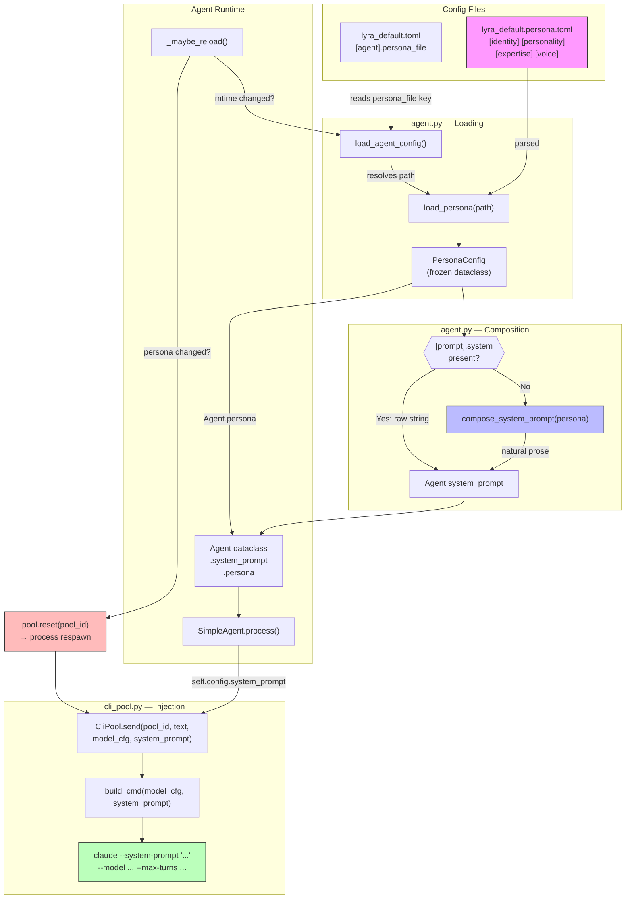
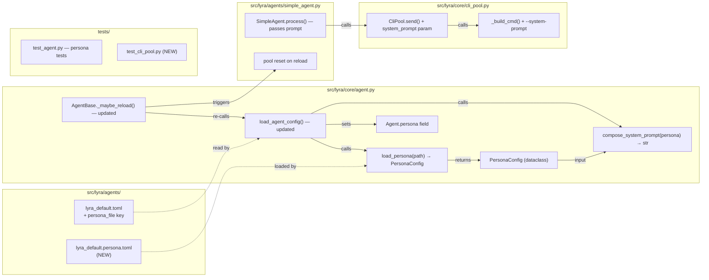

## Summary

Add structured persona config ("soul file") to Lyra agents, auto-compose natural prose system prompts, and fix the `--system-prompt` CLI injection gap. 3 slices, 18 micro-tasks.

## Architecture



### File × Function Map



## Bootstrap Context

From [analysis](../analyses/75-agent-persona-analysis.mdx):
- **Injection gap**: `_build_cmd()` in `cli_pool.py:190-209` never passes `--system-prompt` — the `Agent.system_prompt` field is dead code today.
- **Hot-reload lifecycle**: `--system-prompt` is fixed at process spawn. Persona change requires pool reset to respawn with new prompt.
- **Reference patterns**: Existing `ModelConfig` frozen dataclass + `load_agent_config()` in `agent.py` — follow same patterns for `PersonaConfig` + `load_persona()`.

## Agents

| Agent | Task count | Files |
|-------|-----------|-------|
| backend-dev | 13 | persona.toml, agent.py, cli_pool.py, simple_agent.py, lyra_default.toml |
| tester | 5 | test_agent.py, test_cli_pool.py |

## Consistency Report

| Metric | Value |
|--------|-------|
| Success criteria | 17/17 covered |
| Edge cases | 7/7 covered |
| Uncovered | 0 |
| Untraced | 0 |

## Micro-Tasks

### Slice 1: Persona Dataclass + Loader

#### Task 1.1 — Create sub-dataclasses for persona sections [P]
**Agent:** backend-dev
**File:** `src/lyra/core/agent.py`
**Spec trace:** SC-1, SC-2
**Phase:** RED
**Difficulty:** 2

Add frozen dataclasses: `IdentityConfig` (name, tagline, creator, role, goal), `PersonalityConfig` (traits, communication_style, tone, humor), `ExpertiseConfig` (areas, instructions), `VoiceConfig` (speaking_style, pace, warmth).

```python
@dataclass(frozen=True)
class IdentityConfig:
    name: str
    tagline: str = ""
    creator: str = ""
    role: str = ""
    goal: str = ""

@dataclass(frozen=True)
class PersonalityConfig:
    traits: tuple[str, ...] = ()
    communication_style: str = ""
    tone: str = ""
    humor: str = ""

@dataclass(frozen=True)
class ExpertiseConfig:
    areas: tuple[str, ...] = ()
    instructions: tuple[str, ...] = ()

@dataclass(frozen=True)
class VoiceConfig:
    speaking_style: str = ""
    pace: str = ""
    warmth: str = ""

@dataclass(frozen=True)
class PersonaConfig:
    identity: IdentityConfig
    personality: PersonalityConfig = field(default_factory=PersonalityConfig)
    expertise: ExpertiseConfig = field(default_factory=ExpertiseConfig)
    voice: VoiceConfig = field(default_factory=VoiceConfig)
```

**Verify:** `uv run python -c "from lyra.core.agent import PersonaConfig, IdentityConfig; print('OK')"`
**Expected:** `OK`

#### Task 1.2 — Implement `load_persona()` [P]
**Agent:** backend-dev
**File:** `src/lyra/core/agent.py`
**Spec trace:** SC-3, SC-4, Edge: missing file, missing name, path traversal
**Phase:** RED
**Difficulty:** 3

```python
def load_persona(path: Path, agents_dir: Path) -> PersonaConfig:
    """Load PersonaConfig from a TOML file.

    Path is resolved relative to agents_dir.
    Validates: file exists, [identity].name present, no path traversal.
    """
```

- Resolve path relative to `agents_dir`
- Guard against path traversal (same `is_relative_to` check as `load_agent_config`)
- Parse TOML, extract sections
- Convert lists to tuples (same pattern as `ModelConfig.tools`)
- Raise `FileNotFoundError` if missing, `ValueError` if `[identity].name` absent

**Verify:** `uv run python -c "from lyra.core.agent import load_persona; from pathlib import Path; p = load_persona(Path('lyra_default.persona.toml'), Path('src/lyra/agents')); print(p.identity.name)"`
**Expected:** `Lyra`

#### Task 1.3 — Create persona TOML file [P]
**Agent:** backend-dev
**File:** `src/lyra/agents/lyra_default.persona.toml` (NEW)
**Spec trace:** SC-1
**Phase:** GREEN
**Difficulty:** 1

Create the file with all 4 sections matching the spec breadboard schema. Include `goal` field in `[identity]`.

**Verify:** `uv run python -c "import tomllib; f=open('src/lyra/agents/lyra_default.persona.toml','rb'); d=tomllib.load(f); print(d['identity']['name'], d['identity']['goal'])"`
**Expected:** `Lyra Be Mickael's primary assistant — direct, precise, no fluff`

#### Task 1.4 — Test: PersonaConfig frozen, all fields accessible [P]
**Agent:** tester
**File:** `tests/core/test_agent.py`
**Spec trace:** SC-2
**Phase:** GREEN
**Difficulty:** 2

Test frozen enforcement, all sub-config fields accessible, voice fields specifically (speaking_style, pace, warmth).

**Verify:** `uv run pytest tests/core/test_agent.py::TestPersonaConfig -v`

#### Task 1.5 — Test: load_persona happy path [P]
**Agent:** tester
**File:** `tests/core/test_agent.py`
**Spec trace:** SC-3, SC-4
**Phase:** GREEN
**Difficulty:** 2

Test: loads valid TOML, returns populated PersonaConfig, path resolved relative to agents_dir.

**Verify:** `uv run pytest tests/core/test_agent.py::TestLoadPersona::test_valid_load -v`

#### Task 1.6 — Test: load_persona missing file [P]
**Agent:** tester
**File:** `tests/core/test_agent.py`
**Spec trace:** SC-3, Edge: missing file
**Phase:** GREEN
**Difficulty:** 1

**Verify:** `uv run pytest tests/core/test_agent.py::TestLoadPersona::test_missing_file -v`

#### Task 1.7 — Test: load_persona missing identity.name [P]
**Agent:** tester
**File:** `tests/core/test_agent.py`
**Spec trace:** SC-3, Edge: missing name
**Phase:** GREEN
**Difficulty:** 1

**Verify:** `uv run pytest tests/core/test_agent.py::TestLoadPersona::test_missing_name -v`

---
**RED-GATE: Slice 1** — Run `uv run pytest tests/core/test_agent.py -v`. All persona dataclass + loader tests pass.

---

### Slice 2: Prompt Composer

#### Task 2.1 — Implement `compose_system_prompt()` [P]
**Agent:** backend-dev
**File:** `src/lyra/core/agent.py`
**Spec trace:** SC-5, SC-6
**Phase:** RED
**Difficulty:** 3

```python
def compose_system_prompt(persona: PersonaConfig) -> str:
    """Build a natural prose system prompt from PersonaConfig fields.

    Output reads as natural text, not a field dump.
    All fields (name, goal, traits, areas, instructions) appear as substrings.
    """
```

Compose natural paragraphs:
- Identity paragraph: "You are {name}, {tagline}, created by {creator}. {goal}."
- Personality paragraph: traits, communication style, tone, humor woven naturally
- Expertise paragraph: areas listed, each instruction as a bullet or sentence
- Size guard: check composed output against `_MAX_PROMPT_BYTES`

**Verify:** `uv run python -c "from lyra.core.agent import load_persona, compose_system_prompt; from pathlib import Path; p = load_persona(Path('lyra_default.persona.toml'), Path('src/lyra/agents')); s = compose_system_prompt(p); print(s[:200])"`

#### Task 2.2 — Test: composed prompt contains all fields as substrings [P]
**Agent:** tester
**File:** `tests/core/test_agent.py`
**Spec trace:** SC-5
**Phase:** GREEN
**Difficulty:** 2

Assert: name, goal, each trait, each area, each instruction all appear as substrings in composed output.

**Verify:** `uv run pytest tests/core/test_agent.py::TestComposeSystemPrompt::test_contains_all_fields -v`

#### Task 2.3 — Test: composed prompt is natural prose [P]
**Agent:** tester
**File:** `tests/core/test_agent.py`
**Spec trace:** SC-5
**Phase:** GREEN
**Difficulty:** 1

Assert: output does NOT start with "Name:" or contain mechanical patterns like "Traits:". Assert it starts with "You are" or similar natural prose.

**Verify:** `uv run pytest tests/core/test_agent.py::TestComposeSystemPrompt::test_natural_prose -v`

#### Task 2.4 — Test: composed prompt size guard [P]
**Agent:** tester
**File:** `tests/core/test_agent.py`
**Spec trace:** SC-6, Edge: exceeds 64KB
**Phase:** GREEN
**Difficulty:** 1

Test with oversized persona (giant instructions list) → raises `ValueError`.

**Verify:** `uv run pytest tests/core/test_agent.py::TestComposeSystemPrompt::test_size_guard -v`

---
**RED-GATE: Slice 2** — Run `uv run pytest tests/core/test_agent.py -v`. All persona + composer tests pass.

---

### Slice 3: Agent Integration + Injection Fix

#### Task 3.1 — Add `persona` field to `Agent` dataclass
**Agent:** backend-dev
**File:** `src/lyra/core/agent.py`
**Spec trace:** SC-7
**Phase:** RED
**Difficulty:** 1

Add `persona: PersonaConfig | None = None` to `Agent` dataclass.

#### Task 3.2 — Update `load_agent_config()` — persona loading + composition + override
**Agent:** backend-dev
**File:** `src/lyra/core/agent.py`
**Spec trace:** SC-8, SC-9, SC-10, SC-11, SC-6, Edge: no persona_file, both present, path traversal
**Phase:** RED
**Difficulty:** 4

- Read `[agent].persona_file` if present
- Resolve path relative to `agents_dir`
- Call `load_persona()` → store on `Agent.persona`
- If `[prompt].system` absent → `compose_system_prompt(persona)` → `Agent.system_prompt`
- If `[prompt].system` present → use raw string, still load persona for programmatic access
- Move 64KB size guard to AFTER composition (covers both paths)
- No persona_file → `Agent.persona = None`, `[prompt].system` used unchanged

#### Task 3.3 — Add `system_prompt` param to `CliPool.send()` and `_build_cmd()`
**Agent:** backend-dev
**File:** `src/lyra/core/cli_pool.py`
**Spec trace:** SC-15
**Phase:** RED
**Difficulty:** 2

- Add `system_prompt: str = ""` parameter to `send()`
- Pass to `_spawn()` → `_build_cmd()`
- `_build_cmd()` appends `["--system-prompt", system_prompt]` when non-empty
- Store on `_ProcessEntry` for model_config comparison

#### Task 3.4 — Update `SimpleAgent.process()` — pass system_prompt + hot-reload pool reset
**Agent:** backend-dev
**File:** `src/lyra/agents/simple_agent.py`
**Spec trace:** SC-16, SC-14, SC-17, Edge: persona change during session
**Phase:** RED
**Difficulty:** 3

- Pass `self.config.system_prompt` to `self._pool.send()`
- Extend `_maybe_reload()` in `AgentBase` to track persona file mtime
- On persona change detection: call `await self._pool.reset(pool_id)` (need to store pool_id or pass pool ref)
- Alternatively: detect config change in `process()` after `_maybe_reload()` and reset if system_prompt changed

#### Task 3.5 — Update `lyra_default.toml` — add persona_file, remove raw prompt
**Agent:** backend-dev
**File:** `src/lyra/agents/lyra_default.toml`
**Spec trace:** SC-8, SC-12
**Phase:** GREEN
**Difficulty:** 1

- Add `persona_file = "lyra_default.persona.toml"` to `[agent]` section
- Remove `[prompt].system` (persona auto-composes now)
- Keep `[prompt]` section empty or remove it (backward-compat: absence triggers composition)

#### Task 3.6 — Test: load_agent_config with persona, override, and no-persona paths
**Agent:** tester
**File:** `tests/core/test_agent.py`
**Spec trace:** SC-8, SC-9, SC-10, SC-11, SC-13
**Phase:** GREEN
**Difficulty:** 3

Three test cases:
1. Agent TOML with `persona_file` only → composed prompt, persona populated
2. Agent TOML with `persona_file` + `[prompt].system` → raw prompt wins, persona still loaded
3. Agent TOML without `persona_file` → `persona is None`, raw prompt used

Also: existing tests still pass (SC-13).

**Verify:** `uv run pytest tests/core/test_agent.py -v`

#### Task 3.7 — Test: `_build_cmd` includes `--system-prompt`
**Agent:** tester
**File:** `tests/core/test_cli_pool.py` (NEW)
**Spec trace:** SC-15
**Phase:** GREEN
**Difficulty:** 2

Test that `_build_cmd()` with a non-empty system_prompt includes `--system-prompt` in the command list. Test that empty system_prompt omits the flag.

**Verify:** `uv run pytest tests/core/test_cli_pool.py -v`

---
**RED-GATE: Slice 3** — Run `uv run pytest tests/ -v`. All tests pass. Run `uv run ruff check .` and `uv run pyright` for lint/type checks.

---

## Final Validation

```bash
uv run pytest tests/ -v          # All tests pass
uv run ruff check .               # No lint errors
uv run pyright                     # No type errors
uv run ruff format --check .       # Formatting OK
```
