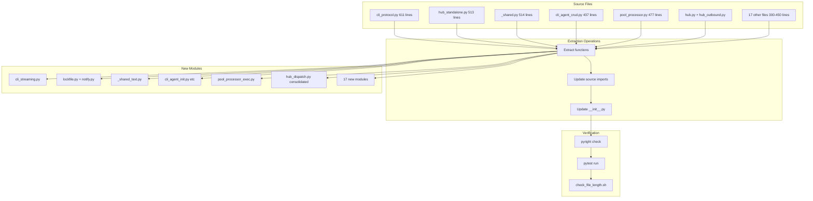
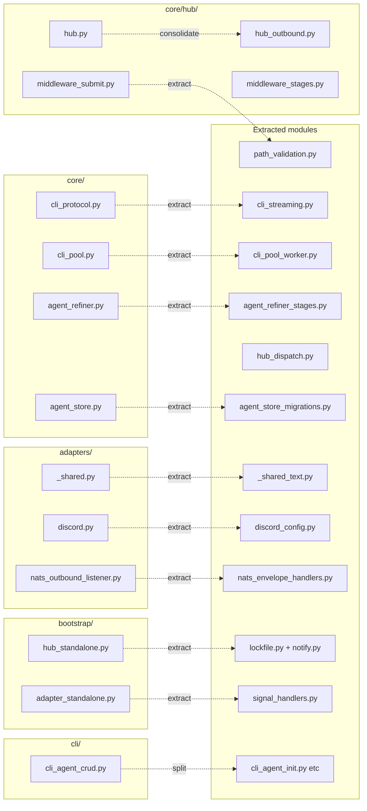

## Summary

Refactor 25 exempted files to comply with 300-line cap via parallel code extractions. 21 files need extraction into new modules; 4 need exemption removal only. All tasks are parallel-safe with no shared state.

## Architecture

### Data Flow (Extraction Pattern)

### File × Function Map

## Bootstrap Context

No analysis artifact — promoted directly from frame per F-lite tier.

## Agents

| Agent | Task count | Files |
|-------|-----------|-------|
| backend-dev × 21 | 21 extraction tasks | All source files + new modules |
| devops | 1 final verification | check_file_length.sh, pyright, pytest |

## Consistency Report

- Criteria covered: 6/6
- Uncovered criteria: none
- Tasks without spec backing: none
- Gold plating exemptions applied: 0

## Micro-Tasks

### Slice V1: All Exemptions Eliminated

#### Task 1: Extract cli_protocol.py → cli_streaming.py [P] → backend-dev
- **File:** `src/lyra/core/cli_protocol.py` → `src/lyra/core/cli_streaming.py`
- **Snippet:** Extract `StreamingIterator` + streaming helpers
- **Verify:** `uv run pyright src/lyra/core/cli_protocol.py src/lyra/core/cli_streaming.py`
- **Expected:** 0 errors, cli_protocol.py &lt; 300 lines
- **Time:** 5 min | **Difficulty:** 3
- **Traces:** SC-1, N1→N2→N3 | **Phase:** REFACTOR

#### Task 2: Extract hub_standalone.py → lockfile.py + notify.py [P] → backend-dev
- **File:** `src/lyra/bootstrap/hub_standalone.py` → `src/lyra/bootstrap/lockfile.py`, `src/lyra/bootstrap/notify.py`
- **Snippet:** Extract `_notify_startup`, lockfile helpers
- **Verify:** `uv run pyright src/lyra/bootstrap/`
- **Expected:** 0 errors, hub_standalone.py &lt; 300 lines
- **Time:** 5 min | **Difficulty:** 3
- **Traces:** SC-1, N1→N2→N3 | **Phase:** REFACTOR

#### Task 3: Extract _shared.py → _shared_text.py [P] → backend-dev
- **File:** `src/lyra/adapters/_shared.py` → `src/lyra/adapters/_shared_text.py`
- **Snippet:** Extract `chunk_text`, `truncate_caption`, `sanitize_filename`
- **Verify:** `uv run pyright src/lyra/adapters/_shared.py`
- **Expected:** 0 errors, _shared.py &lt; 300 lines
- **Time:** 5 min | **Difficulty:** 2
- **Traces:** SC-1, N1→N2→N3 | **Phase:** REFACTOR

#### Task 4: Split cli_agent_crud.py → 4 modules [P] → backend-dev
- **File:** `src/lyra/cli_agent_crud.py` → `src/lyra/cli_agent_init.py`, `src/lyra/cli_agent_list.py`, `src/lyra/cli_agent_edit.py`, `src/lyra/cli/agents/__init__.py`
- **Snippet:** Split CRUD commands, re-export from `__init__.py`
- **Verify:** `uv run pyright src/lyra/cli/`
- **Expected:** 0 errors, each file &lt; 300 lines
- **Time:** 8 min | **Difficulty:** 4
- **Traces:** SC-1, N1→N2→N3 | **Phase:** REFACTOR

#### Task 5: Extract pool_processor.py → pool_processor_exec.py [P] → backend-dev
- **File:** `src/lyra/core/pool/pool_processor.py` → `src/lyra/core/pool/pool_processor_exec.py`
- **Snippet:** Extract `_process_one` + `_guarded_process_one`
- **Verify:** `uv run pyright src/lyra/core/pool/`
- **Expected:** 0 errors, pool_processor.py &lt; 300 lines
- **Time:** 5 min | **Difficulty:** 3
- **Traces:** SC-1, N1→N2→N3 | **Phase:** REFACTOR

#### Task 6: Consolidate hub.py + hub_outbound.py [P] → backend-dev
- **File:** `src/lyra/core/hub/hub.py`, `src/lyra/core/hub/hub_outbound.py`
- **Snippet:** Fold dispatch methods into hub.py or extract `_dispatch_item` pattern
- **Verify:** `uv run pyright src/lyra/core/hub/`
- **Expected:** 0 errors, hub.py &lt; 300 lines (or accept per ADR-025 F-3)
- **Time:** 8 min | **Difficulty:** 4
- **Traces:** SC-1, N1→N2→N3 | **Phase:** REFACTOR

#### Task 7: Extract cli_pool.py → cli_pool_worker.py [P] → backend-dev
- **File:** `src/lyra/core/cli_pool.py` → `src/lyra/core/cli_pool_worker.py`
- **Snippet:** Extract `_spawn`, `_kill`, `_idle_reaper`
- **Verify:** `uv run pyright src/lyra/core/cli_pool.py`
- **Expected:** 0 errors, cli_pool.py &lt; 300 lines
- **Time:** 4 min | **Difficulty:** 2
- **Traces:** SC-1, N1→N2→N3 | **Phase:** REFACTOR

#### Task 8: Extract turn_store.py → turn_store_queries.py [P] → backend-dev
- **File:** `src/lyra/core/stores/turn_store.py` → `src/lyra/core/stores/turn_store_queries.py`
- **Snippet:** Extract session aggregation queries
- **Verify:** `uv run pyright src/lyra/core/stores/`
- **Expected:** 0 errors, turn_store.py &lt; 300 lines
- **Time:** 4 min | **Difficulty:** 2
- **Traces:** SC-1, N1→N2→N3 | **Phase:** REFACTOR

#### Task 9: Extract command_router.py → command_patterns.py [P] → backend-dev
- **File:** `src/lyra/core/commands/command_router.py` → `src/lyra/core/commands/command_patterns.py`
- **Snippet:** Extract pattern matching
- **Verify:** `uv run pyright src/lyra/core/commands/`
- **Expected:** 0 errors, command_router.py &lt; 300 lines
- **Time:** 4 min | **Difficulty:** 2
- **Traces:** SC-1, N1→N2→N3 | **Phase:** REFACTOR

#### Task 10: Extract outbound_dispatcher.py [P] → backend-dev
- **File:** `src/lyra/core/hub/outbound_dispatcher.py`
- **Snippet:** Extract `_dispatch_item` from `_worker_loop`
- **Verify:** `uv run pyright src/lyra/core/hub/outbound_dispatcher.py`
- **Expected:** 0 errors, file &lt; 300 lines
- **Time:** 4 min | **Difficulty:** 2
- **Traces:** SC-1, N1→N2→N3 | **Phase:** REFACTOR

#### Task 11: Extract agent_refiner.py → agent_refiner_stages.py [P] → backend-dev
- **File:** `src/lyra/core/agent_refiner.py` → `src/lyra/core/agent_refiner_stages.py`
- **Snippet:** Extract refinement stages
- **Verify:** `uv run pyright src/lyra/core/agent_refiner.py`
- **Expected:** 0 errors, agent_refiner.py &lt; 300 lines
- **Time:** 4 min | **Difficulty:** 2
- **Traces:** SC-1, N1→N2→N3 | **Phase:** REFACTOR

#### Task 12: Extract middleware_submit.py → path_validation.py [P] → backend-dev
- **File:** `src/lyra/core/hub/middleware_submit.py` → `src/lyra/core/hub/path_validation.py`
- **Snippet:** Extract path validation
- **Verify:** `uv run pyright src/lyra/core/hub/`
- **Expected:** 0 errors, middleware_submit.py &lt; 300 lines
- **Time:** 3 min | **Difficulty:** 2
- **Traces:** SC-1, N1→N2→N3 | **Phase:** REFACTOR

#### Task 13: Extract agent_store.py → agent_store_migrations.py [P] → backend-dev
- **File:** `src/lyra/core/stores/agent_store.py` → `src/lyra/core/stores/agent_store_migrations.py`
- **Snippet:** Extract DB migrations
- **Verify:** `uv run pyright src/lyra/core/stores/`
- **Expected:** 0 errors, agent_store.py &lt; 300 lines
- **Time:** 4 min | **Difficulty:** 2
- **Traces:** SC-1, N1→N2→N3 | **Phase:** REFACTOR

#### Task 14: Extract tts/__init__.py → engine_selector.py [P] → backend-dev
- **File:** `src/lyra/tts/__init__.py` → `src/lyra/tts/engine_selector.py`
- **Snippet:** Extract engine selection logic
- **Verify:** `uv run pyright src/lyra/tts/`
- **Expected:** 0 errors, tts/__init__.py &lt; 300 lines
- **Time:** 4 min | **Difficulty:** 2
- **Traces:** SC-1, N1→N2→N3 | **Phase:** REFACTOR

#### Task 15: Extract discord.py → discord_config.py [P] → backend-dev
- **File:** `src/lyra/adapters/discord.py` → `src/lyra/adapters/discord_config.py`
- **Snippet:** Extract `DiscordConfig`
- **Verify:** `uv run pyright src/lyra/adapters/discord.py`
- **Expected:** 0 errors, discord.py &lt; 300 lines
- **Time:** 3 min | **Difficulty:** 1
- **Traces:** SC-1, N1→N2→N3 | **Phase:** REFACTOR

#### Task 16: Extract nats_outbound_listener.py → nats_envelope_handlers.py [P] → backend-dev
- **File:** `src/lyra/adapters/nats_outbound_listener.py` → `src/lyra/adapters/nats_envelope_handlers.py`
- **Snippet:** Extract envelope handlers
- **Verify:** `uv run pyright src/lyra/adapters/nats_outbound_listener.py`
- **Expected:** 0 errors, file &lt; 300 lines
- **Time:** 4 min | **Difficulty:** 2
- **Traces:** SC-1, N1→N2→N3 | **Phase:** REFACTOR

#### Task 17: Extract adapter_standalone.py → signal_handlers.py [P] → backend-dev
- **File:** `src/lyra/bootstrap/adapter_standalone.py` → `src/lyra/bootstrap/signal_handlers.py`
- **Snippet:** Extract signal handlers
- **Verify:** `uv run pyright src/lyra/bootstrap/`
- **Expected:** 0 errors, adapter_standalone.py &lt; 300 lines
- **Time:** 3 min | **Difficulty:** 1
- **Traces:** SC-1, N1→N2→N3 | **Phase:** REFACTOR

#### Task 18: Trim middleware_stages.py [P] → backend-dev
- **File:** `src/lyra/core/hub/middleware_stages.py`
- **Snippet:** Trim whitespace only (already near limit at 307 lines)
- **Verify:** `wc -l src/lyra/core/hub/middleware_stages.py`
- **Expected:** file &lt; 300 lines
- **Time:** 2 min | **Difficulty:** 1
- **Traces:** SC-1, N4 | **Phase:** REFACTOR

#### Task 19: Extract simple_agent.py → simple_agent_prompts.py [P] → backend-dev
- **File:** `src/lyra/agents/simple_agent.py` → `src/lyra/agents/simple_agent_prompts.py`
- **Snippet:** Extract system prompt builder
- **Verify:** `uv run pyright src/lyra/agents/simple_agent.py`
- **Expected:** 0 errors, simple_agent.py &lt; 300 lines
- **Time:** 3 min | **Difficulty:** 2
- **Traces:** SC-1, N1→N2→N3 | **Phase:** REFACTOR

#### Task 20: Trim _shared_streaming.py [P] → backend-dev
- **File:** `src/lyra/adapters/_shared_streaming.py`
- **Snippet:** Trim whitespace only (already near limit at 302 lines)
- **Verify:** `wc -l src/lyra/adapters/_shared_streaming.py`
- **Expected:** file &lt; 300 lines
- **Time:** 2 min | **Difficulty:** 1
- **Traces:** SC-1, N4 | **Phase:** REFACTOR

#### Task 21: Extract pool_processor.py additional [P] → backend-dev
- **File:** `src/lyra/core/pool/pool_processor.py`
- **Snippet:** Additional extraction if needed after Task 5
- **Verify:** `uv run pyright src/lyra/core/pool/pool_processor.py`
- **Expected:** file &lt; 300 lines
- **Time:** 3 min | **Difficulty:** 2
- **Traces:** SC-1, N1→N2→N3 | **Phase:** REFACTOR

#### Task 22: Remove stale exemptions [P] → devops
- **File:** `tools/check_file_length.sh`
- **Snippet:** Remove from EXEMPT: telegram_outbound.py, discord_outbound.py, unified.py, audio_pipeline.py
- **Verify:** `grep -c "EXEMPT" tools/check_file_length.sh`
- **Expected:** 21 remaining exemptions (or 0 if all extractions done)
- **Time:** 2 min | **Difficulty:** 1
- **Traces:** SC-2, N4 | **Phase:** REFACTOR

#### Task 23: Final verification → devops
- **File:** All modified files
- **Snippet:** Run full verification suite
- **Verify:** `uv run pyright && uv run pytest && ./tools/check_file_length.sh`
- **Expected:** 0 pyright errors, 0 test failures, empty EXEMPT array
- **Time:** 5 min | **Difficulty:** 2
- **Traces:** SC-3, SC-4, SC-5, SC-6, N5 | **Phase:** REFACTOR

#### RED-GATE: V1 Complete → tester
- **Verify:** All 23 tasks marked complete, EXEMPT array empty
- **Phase:** REFACTOR-GATE

## Task IDs

<!-- Generated by /plan. Used by /implement to resume tasks on session restart. -->
- T1: 10 — Extract cli_protocol.py → cli_streaming.py
- T2: 11 — Extract hub_standalone.py → lockfile.py + notify.py
- T3: 12 — Extract _shared.py → _shared_text.py
- T4: 13 — Split cli_agent_crud.py → 4 modules
- T5: 14 — Extract pool_processor.py → pool_processor_exec.py
- T6: 15 — Consolidate hub.py + hub_outbound.py
- T7: 16 — Extract cli_pool.py → cli_pool_worker.py
- T8: 17 — Extract turn_store.py → turn_store_queries.py
- T9: 18 — Extract command_router.py → command_patterns.py
- T10: 19 — Extract outbound_dispatcher.py
- T11: 20 — Extract agent_refiner.py → agent_refiner_stages.py
- T12: 21 — Extract middleware_submit.py → path_validation.py
- T13: 22 — Extract agent_store.py → agent_store_migrations.py
- T14: 23 — Extract tts/__init__.py → engine_selector.py
- T15: 24 — Extract discord.py → discord_config.py
- T16: 25 — Extract nats_outbound_listener.py → nats_envelope_handlers.py
- T17: 26 — Extract adapter_standalone.py → signal_handlers.py
- T18: 27 — Trim middleware_stages.py
- T19: 28 — Extract simple_agent.py → simple_agent_prompts.py
- T20: 29 — Trim _shared_streaming.py
- T21: 30 — Verify pool_processor.py extraction complete
- T22: 31 — Remove stale exemptions from check_file_length.sh
- T23: 32 — Final verification: pyright + pytest + check_file_length
