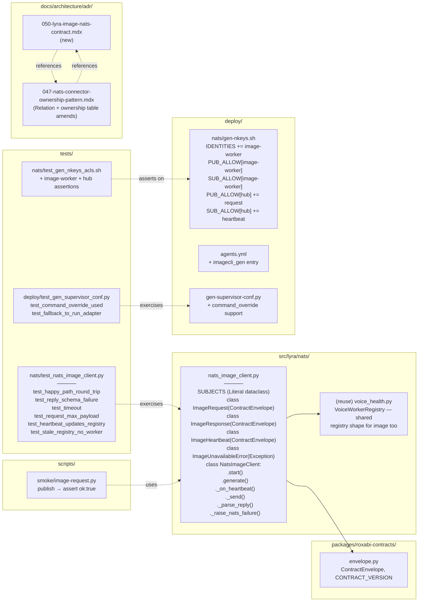

## Summary

Four slices, one PR. **V1** lands ADR-050 (the lyra↔imagecli wire contract, parallel to ADR-044 for voice) and cross-references it from ADR-047. **V2** implements `NatsImageClient` + inline `ImageRequest`/`ImageResponse`/`ImageHeartbeat` Pydantic models (extending `ContractEnvelope`) + 6 unit tests. **V3** adds the `image-worker` nkey to `gen-nkeys.sh` and amends the `hub` ACL to publish on `lyra.image.generate.request` and subscribe to `lyra.image.heartbeat`. **V4** extends `gen-supervisor-conf.py` to support external-satellite commands (via a new `command_override` field), adds the `imagecli_gen` entry to `deploy/agents.yml`, amends ADR-047's ownership table, writes `scripts/smoke/image-request.py`, and prepares the rollout-evidence harness. Manual Machine-1 rollout (key rotation + NATS reload + smoke capture) is a runbook item referenced by the PR description, not an automated CI gate.

## Architecture

### Data Flow

```mermaid
flowchart TD
    subgraph doc[Docs]
        ADR050["docs/architecture/adr/<br/>050-lyra-image-nats-contract.mdx"]
        ADR047["docs/architecture/adr/<br/>047-nats-connector-ownership-pattern.mdx<br/>(Relation + Ownership table amendments)"]
    end
    subgraph hub[Hub runtime / src]
        CLIENT["src/lyra/nats/<br/>nats_image_client.py<br/>NatsImageClient, ImageRequest,<br/>ImageResponse, ImageHeartbeat,<br/>ImageUnavailableError"]
        ENV["packages/roxabi-contracts/<br/>roxabi_contracts/envelope.py<br/>(ContractEnvelope, CONTRACT_VERSION)"]
    end
    subgraph deploy[Deploy]
        NKEYS["deploy/nats/gen-nkeys.sh<br/>(+ image-worker identity;<br/>hub ACL amended)"]
        AGENTS["deploy/agents.yml<br/>(+ imagecli_gen entry)"]
        GENCONF["deploy/gen-supervisor-conf.py<br/>(+ command_override field)"]
        CONF["deploy/supervisor/conf.d/<br/>lyra_imagecli_gen.conf<br/>(generated)"]
    end
    subgraph tests[Tests]
        UT["tests/nats/test_nats_image_client.py"]
        ACL["tests/nats/test_gen_nkeys_acls.sh<br/>(extended)"]
        GENT["tests/deploy/test_gen_supervisor_conf.py<br/>(new)"]
    end
    subgraph runtime[Machine 1 runtime (manual)]
        SUP["supervisord<br/>lyra_imagecli_gen"]
        SAT["imagecli nats-serve<br/>(shipped)"]
        NATS["nats-server<br/>(auth.conf)"]
        EVID["artifacts/rollout-evidence/<br/>754-image-smoke.txt"]
    end
    subgraph smoke[Smoke]
        SCR["scripts/smoke/<br/>image-request.py"]
    end
    ADR050 -.->|authoritative for| CLIENT
    CLIENT --> ENV
    UT -.->|exercises| CLIENT
    ACL -.->|asserts on| NKEYS
    GENT -.->|exercises| GENCONF
    NKEYS -->|auth.conf<br/>regen| NATS
    AGENTS -->|make gen-conf| GENCONF
    GENCONF --> CONF
    CONF --> SUP
    SUP -->|spawn| SAT
    SAT -.->|lyra.image.heartbeat| CLIENT
    CLIENT -.->|lyra.image.generate.request| SAT
    SCR -->|nc.request| NATS
    NATS -->|route| SAT
    SAT -->|reply| SCR
    SCR -->|stdout| EVID
    ADR050 -.->|cross-ref| ADR047
    classDef new fill:#dcfce7,stroke:#16a34a,color:#14532d
    classDef edit fill:#fef3c7,stroke:#d97706,color:#78350f
    classDef gen fill:#e0f2fe,stroke:#0284c7,color:#0c4a6e
    class ADR050,CLIENT,UT,GENT,SCR new
    class ADR047,NKEYS,AGENTS,GENCONF,ACL edit
    class CONF,EVID gen
```

### File × Function Map



## Agents

| Agent | Task count | Files |
|-------|-----------|-------|
| doc-writer | 3 | `docs/architecture/adr/050-lyra-image-nats-contract.mdx`, `docs/architecture/adr/047-nats-connector-ownership-pattern.mdx` |
| backend-dev | 1 | `src/lyra/nats/nats_image_client.py` |
| devops | 5 | `deploy/nats/gen-nkeys.sh`, `deploy/agents.yml`, `deploy/gen-supervisor-conf.py`, `scripts/smoke/image-request.py`, `deploy/supervisor/conf.d/lyra_imagecli_gen.conf` (generated) |
| tester | 7 (incl. 4 RED-GATE sentinels) | `tests/nats/test_nats_image_client.py`, `tests/nats/test_gen_nkeys_acls.sh`, `tests/deploy/test_gen_supervisor_conf.py` |

Intra-domain parallelism: V1/V2/V3 are independent and may land in any order. V4 waits on V2+V3. Within V4, T10/T11 (generator + test) land before T12 (agents.yml add), and T14 (ADR-047 ownership table) is `[P]` with the whole V4 track. No need for multiple same-type agents running in parallel on the same files.

## Consistency Report

- Automated gates covered: **23** (of 25 gated + 2 regression criteria)
- Manual runbook items: **3** (Machine 1 rollout: supervisorctl RUNNING pre-gate, T15 re-measure, rollout-evidence capture — handled via PR description + post-merge operator step, per spec)
- Uncovered criteria: **0** (the 3 manual items are explicitly runbook-scoped in the spec)
- Tasks without spec backing: **0**
- Gold-plating exemptions: **0**

Mapping matrix (spec success-criterion → covering task):

| Spec criterion group | Covering task(s) |
|---|---|
| ADR-050 exists w/ full structure | T1 (compose), T3 (gate) |
| ADR-050 subjects / queue group / contract_version | T1, T3 |
| ADR-050 Request/Reply/Heartbeat schemas + error codes | T1, T3 |
| ADR-050 max-payload + `file_path` coupling note | T1, T3 |
| ADR-050 user-controlled fields sanitization table | T1, T3 |
| ADR-050 referenced by ADR-047 Relation section | T2, T3 |
| ADR-047 Subject/nkey ownership table amended (Image row) | T14, T16 |
| `nats_image_client.py` exists + typechecks | T5, T7 |
| `NatsImageClient.start()` subscribes to heartbeat | T4, T5 |
| `NatsImageClient.generate()` publish/parse/error-map | T4, T5 |
| 6 unit-test cases (a–f) + heartbeat-registry-stale path | T4, T5 |
| No inline subject f-strings; subjects as `Literal[…]` on frozen dataclass | T5, T7 |
| `pyright` + `pytest` green on new module | T5, T7 |
| `image-worker` in `IDENTITIES` + correct PUB/SUB allow-lists | T7 (RED extend), T8, T9 |
| Hub ACL amended (PUB request, SUB heartbeat) | T7, T8, T9 |
| `--template-only` renders image-worker block + amended hub block | T8, T9 |
| `test_gen_nkeys_acls.sh` passes | T7, T9 |
| `agents.yml` gains `imagecli_gen` entry | T12, T13 |
| `make gen-conf` produces generated conf idempotently | T13 |
| Generator honors `command_override` (no regression on hub/adapters) | T10, T11 |
| `scripts/smoke/image-request.py` exists + asserts `ok:true` | T15, T16 |
| Full-suite pytest + pyright green (no regressions) | T7, T16 |
| `supervisorctl status RUNNING` pre-smoke | **runbook** (PR description) |
| T15 re-measure on RTX 3080 | **runbook** (PR description) |
| `artifacts/rollout-evidence/754-image-smoke.txt` captured | **runbook** (post-merge) |

## Micro-Tasks

### Slice V1 — Contract ADR-050 + ADR-047 cross-reference

#### Task T1: Write ADR-050 — lyra ↔ imagecli image-domain wire contract → doc-writer

- **File:** `docs/architecture/adr/050-lyra-image-nats-contract.mdx` (new)
- **Snippet (frontmatter + section skeleton — full content follows ADR-044 structure adapted for image):**
  ```markdown
  ---
  title: "ADR-050: lyra ↔ imagecli NATS image contract"
  description: "Freeze the request/reply and heartbeat payloads exchanged between lyra (hub) and imagecli (satellite) over NATS. Declare max-payload cap (1 MB NATS + 750 KB b64 threshold + file_path fallback coupling) and enumerate user-controlled-fields sanitization contract."
  ---

  ## Status
  Accepted

  ## Context
  (include heartbeat-subject reconciliation note — issue #754 body says
  lyra.image.generate.heartbeat, but shipped satellite at
  imagecli/src/imagecli/nats/adapter.py:18 uses lyra.image.heartbeat. ADR
  aligns to shipped.)

  ## Decision
  ### Subjects
  | Subject | Direction | Producer | Consumer | Purpose |
  | lyra.image.generate.request | request-reply | NatsImageClient | ImageNatsAdapter | Generate image |
  | lyra.image.heartbeat        | fire-and-forget | ImageNatsAdapter | NatsImageClient | Liveness + capacity |

  Queue group: IMAGE_WORKERS.

  ### Payload encoding
  UTF-8 JSON. Binary payloads base64-in-payload OR (fallback) absolute
  file_path on shared filesystem. NATS max_payload: 1 MB.

  ### contract_version — additive, one-way
  (identical paragraph to ADR-044)

  ### Request — lyra.image.generate.request
  (JSON example + field table: contract_version, trace_id, issued_at,
  request_id, prompt, engine, negative_prompt, width, height, steps,
  guidance, seed, format, output_mode, lora_path, lora_scale, trigger,
  embedding_path)

  ### Reply — success
  (JSON example + field table covering both b64 and file_path branches:
  contract_version, trace_id, issued_at, request_id, ok=true,
  (image_b64 | file_path), mime_type, width, height, engine, seed_used)

  ### Reply — error
  (JSON example + field table: contract_version, trace_id, issued_at,
  request_id, ok=false, error, error_detail)

  ### Error codes
  | Code | When |
  | missing_required_field | prompt/engine missing OR bounds violation OR path outside allowlist |
  | unknown_engine | engine name not in imagecli.engine.list_engines() |
  | engine_load_failed | import/instantiation failure |
  | insufficient_resources | InsufficientResourcesError or MemoryError |
  | generation_failed | any other exception during generate or encoding |

  ### Heartbeat — lyra.image.heartbeat
  (JSON example + field table: base NatsAdapterBase fields +
  engine_loaded, active_requests, vram_used_mb?, vram_total_mb?
  (both optional — satellite may not populate; registry uses
  active_requests only))

  ### Max payload (ADR-047 Rule 4)
  - NATS max_payload: 1 MB (nats-container.conf; shipped default).
  - Base64 overhead 4/3 → useful image ceiling ~750 KB.
  - Satellite dual-mode at adapter.py:254-310: b64 fallback to file_path
    when encoded length > 750 KB.
  - file_path mode requires shared filesystem between hub and worker
    (holds today — both on Machine 1). Hub MUST treat file_path as
    satellite-resolved, hub-opaque — no validation, no traversal.

  ### User-controlled fields (sanitization contract)
  (table — prompt, negative_prompt, trigger (untrusted),
  width/height/steps (bounded), lora_path/embedding_path (allowlisted
  dirs))

  ## Rationale
  (why image follows ADR-044 shape; why the ADR aligns to shipped
  satellite subject name rather than the issue body.)

  ## Consequences
  ### Positive
  - Frozen contract is greppable and diffable.
  - file_path fallback extends the binary-domain ceiling.
  ### Negative
  - file_path couples to shared filesystem; hub/worker split will need
    a replacement path.
  ### Neutral
  - contract_version is a string; wire overhead negligible.

  ## Relation to other ADRs
  - ADR-035 — subject naming.
  - ADR-044 — canonical contract-ADR shape (voice).
  - ADR-046 — nkey provisioning; image-worker identity required
    (see Invariant 2).
  - ADR-047 — ownership pattern; this ADR is the lyra-owned half of
    image.

  ## References
  - Spec: artifacts/specs/754-lyra-image-domain-integration-spec.mdx
  - Issue: #754
  - Satellite: imageCLI/src/imagecli/nats/adapter.py (shipped by imageCLI#50)
  - Hub code: src/lyra/nats/nats_image_client.py (new)
  ```
- **Verify:**
  ```bash
  test -f docs/architecture/adr/050-lyra-image-nats-contract.mdx
  grep -cE '^## (Status|Context|Decision|Rationale|Consequences|Relation to other ADRs|References)' docs/architecture/adr/050-lyra-image-nats-contract.mdx  # ≥7
  grep -nE 'lyra\.image\.generate\.request|lyra\.image\.heartbeat' docs/architecture/adr/050-lyra-image-nats-contract.mdx                                  # ≥2 hits
  grep -nE 'IMAGE_WORKERS|max_payload|image_b64|file_path|file_path mode' docs/architecture/adr/050-lyra-image-nats-contract.mdx                         # all hit
  grep -nE 'missing_required_field|unknown_engine|engine_load_failed|insufficient_resources|generation_failed' docs/architecture/adr/050-lyra-image-nats-contract.mdx | wc -l                                                                                              # ≥5
  ```
- **Expected:** file exists; all 7 top-level sections present; both subjects present; all 5 error codes enumerated
- **Time:** 30 min (one long atomic op — large ADR file)
- **Difficulty:** 3
- **Traces:** SC(ADR-050 structure, subjects, queue group, payload, error codes, max-payload, user-controlled fields)
- **Phase:** GREEN
- **Depends on:** —

#### Task T2: Cross-reference ADR-050 from ADR-047 Relation section [P with T1] → doc-writer

- **File:** `docs/architecture/adr/047-nats-connector-ownership-pattern.mdx`
- **Snippet (append one bullet to the "Relation to other ADRs" section, sorted by number):**
  ```markdown
  - **ADR-050** — lyra ↔ imagecli NATS image contract. The image-domain analogue of ADR-044; landed under this ownership pattern.
  ```
- **Verify:**
  ```bash
  grep -nE '^- \*\*ADR-050\*\* — lyra.*imagecli' docs/architecture/adr/047-nats-connector-ownership-pattern.mdx  # 1 hit
  ```
- **Expected:** exactly one matching bullet in ADR-047
- **Time:** 2 min
- **Difficulty:** 1
- **Traces:** SC(ADR-050 referenced from ADR-047 Relation section)
- **Phase:** GREEN
- **Depends on:** —

#### Task T3: RED-GATE V1 — ADR-050 consistency sweep → tester

- **File:** no new file — verification only
- **Verify:**
  ```bash
  set -e
  test -f docs/architecture/adr/050-lyra-image-nats-contract.mdx
  # All required sections:
  for section in "^## Status" "^## Context" "^## Decision" "^## Rationale" "^## Consequences" "^## Relation to other ADRs" "^## References"; do
    grep -qE "$section" docs/architecture/adr/050-lyra-image-nats-contract.mdx
  done
  # Subjects + queue group + error codes + reconciliation:
  grep -qE 'lyra\.image\.generate\.request' docs/architecture/adr/050-lyra-image-nats-contract.mdx
  grep -qE 'lyra\.image\.heartbeat' docs/architecture/adr/050-lyra-image-nats-contract.mdx
  grep -qE 'IMAGE_WORKERS' docs/architecture/adr/050-lyra-image-nats-contract.mdx
  grep -qiE 'reconciliation|issue body|shipped satellite|lyra\.image\.generate\.heartbeat' docs/architecture/adr/050-lyra-image-nats-contract.mdx
  grep -qE 'max_payload|1 MB|750 KB' docs/architecture/adr/050-lyra-image-nats-contract.mdx
  grep -qE 'missing_required_field' docs/architecture/adr/050-lyra-image-nats-contract.mdx
  # Cross-reference:
  grep -qE '^- \*\*ADR-050\*\*' docs/architecture/adr/047-nats-connector-ownership-pattern.mdx
  # Docs lint / build (if configured):
  # (no lyra-specific docs-build step; Fumadocs/MDX validity is implicit)
  echo "V1 ADR-050 GATE PASS"
  ```
- **Expected:** `V1 ADR-050 GATE PASS` printed
- **Time:** 3 min
- **Difficulty:** 1
- **Traces:** V1 consistency
- **Phase:** RED-GATE
- **Depends on:** T1, T2

### Slice V2 — Hub publisher + inline models + unit tests

#### Task T4: Write RED `tests/nats/test_nats_image_client.py` (6 cases) → tester

- **File:** `tests/nats/test_nats_image_client.py` (new)
- **Snippet (structure — 6 test cases per spec SC):**
  ```python
  """Tests for NatsImageClient — mocked NATS, no live satellite required."""
  from __future__ import annotations
  import base64
  import json
  import time
  from datetime import datetime, timezone
  from unittest.mock import AsyncMock, MagicMock
  import pytest
  from roxabi_contracts.envelope import CONTRACT_VERSION
  # Import under test — will fail at RED step until T5 lands:
  from lyra.nats.nats_image_client import (
      ImageRequest, ImageResponse, ImageHeartbeat,
      NatsImageClient, ImageUnavailableError, SUBJECTS,
  )


  def _make_heartbeat(worker_id: str = "img-1", active: int = 0, vram_used: int | None = None) -> bytes:
      payload: dict = {
          "contract_version": "1",
          "trace_id": "t",
          "issued_at": datetime.now(timezone.utc).isoformat(),
          "worker_id": worker_id,
          "service": "image",
          "host": "machine1",
          "subject": "lyra.image.generate.request",
          "queue_group": "IMAGE_WORKERS",
          "ts": time.time(),
          "engine_loaded": "flux2-klein",
          "active_requests": active,
      }
      if vram_used is not None:
          payload["vram_used_mb"] = vram_used
      return json.dumps(payload).encode()


  def _ok_reply_b64(request_id: str = "r1") -> bytes:
      return json.dumps({
          "contract_version": "1",
          "trace_id": "t",
          "issued_at": datetime.now(timezone.utc).isoformat(),
          "request_id": request_id,
          "ok": True,
          "image_b64": base64.b64encode(b"PNGDATA").decode(),
          "mime_type": "image/png",
          "width": 512, "height": 512,
          "engine": "flux2-klein",
          "seed_used": 42,
      }).encode()


  class TestNatsImageClient:
      @pytest.mark.asyncio
      async def test_happy_path_round_trip(self) -> None:
          # (a) mock nc.request returns a valid ImageResponse — generate returns typed result
          ...

      @pytest.mark.asyncio
      async def test_reply_schema_failure_raises_domain_error(self) -> None:
          # (b) bad reply shape (missing `ok`) → ImageUnavailableError + cb.record_failure
          ...

      @pytest.mark.asyncio
      async def test_timeout_raises_domain_error(self) -> None:
          # (c) nc.request raises TimeoutError → ImageUnavailableError
          ...

      @pytest.mark.asyncio
      async def test_request_max_payload_raises_domain_error(self) -> None:
          # (d) nc.request raises MaxPayloadError (simulated via str("max_payload") in exc)
          # → ImageUnavailableError("payload too large"). Reply direction never surfaces this
          # because satellite downgrades to file_path.
          ...

      @pytest.mark.asyncio
      async def test_heartbeat_updates_registry(self) -> None:
          # (e) _on_heartbeat parses bytes; registry knows worker; vram_used optional absence is fine.
          ...

      @pytest.mark.asyncio
      async def test_stale_registry_raises_no_worker(self) -> None:
          # (f) registry stale >15 s → generate raises ImageUnavailableError("no live worker")
          ...
  ```
- **Verify:**
  ```bash
  test -f tests/nats/test_nats_image_client.py
  # 6 test methods:
  grep -cE '^\s+async def test_' tests/nats/test_nats_image_client.py  # ==6
  # Run — expect fail because src module doesn't exist yet:
  uv run pytest tests/nats/test_nats_image_client.py 2>&1 | grep -E 'ModuleNotFoundError|collected 6 items' || true
  ```
- **Expected:** file exists; 6 async test methods; `pytest` fails with `ModuleNotFoundError: lyra.nats.nats_image_client` (RED proven)
- **Time:** 18 min
- **Difficulty:** 3
- **Traces:** SC(6 test cases a–f)
- **Phase:** RED
- **Depends on:** —

#### Task T5: Implement `src/lyra/nats/nats_image_client.py` → backend-dev

- **File:** `src/lyra/nats/nats_image_client.py` (new)
- **Snippet (skeleton — follow `nats_tts_client.py` shape minus per-worker subject routing; single-worker image domain):**
  ```python
  """NatsImageClient — hub-side NATS request-reply client for image generation.

  Publishes to lyra.image.generate.request (queue group IMAGE_WORKERS) and
  subscribes to lyra.image.heartbeat for worker liveness tracking.
  Contract authoritative in ADR-050.

  Models are inline for this issue; a later ticket ports them to
  packages/roxabi-contracts/src/roxabi_contracts/image/ (mirroring #763 for voice).
  """
  from __future__ import annotations
  import json
  import logging
  from dataclasses import dataclass
  from datetime import datetime, timezone
  from typing import Literal, NoReturn
  from uuid import uuid4

  from nats.aio.client import Client as NATS
  from pydantic import Field, ValidationError

  from roxabi_contracts.envelope import CONTRACT_VERSION, ContractEnvelope
  from roxabi_nats.circuit_breaker import NatsCircuitBreaker
  from lyra.nats.voice_health import VoiceWorkerRegistry  # reused: same shape

  log = logging.getLogger(__name__)


  @dataclass(frozen=True, slots=True)
  class _Subjects:
      image_request: Literal["lyra.image.generate.request"] = "lyra.image.generate.request"
      image_heartbeat: Literal["lyra.image.heartbeat"] = "lyra.image.heartbeat"
      image_workers: Literal["IMAGE_WORKERS"] = "IMAGE_WORKERS"


  SUBJECTS = _Subjects()


  class ImageUnavailableError(Exception):
      """Raised when the image domain cannot satisfy the request."""


  class ImageRequest(ContractEnvelope):
      request_id: str
      prompt: str
      engine: str
      negative_prompt: str | None = None
      width: int | None = None
      height: int | None = None
      steps: int | None = None
      guidance: float | None = None
      seed: int | None = None
      format: Literal["png", "jpeg", "webp"] = "png"
      output_mode: Literal["b64", "file"] = "b64"
      lora_path: str | None = None
      lora_scale: float | None = None
      trigger: str | None = None
      embedding_path: str | None = None


  class ImageResponse(ContractEnvelope):
      request_id: str
      ok: bool
      # success fields (populated when ok=True; at least one of image_b64/file_path non-null)
      image_b64: str | None = None
      file_path: str | None = None
      mime_type: str | None = None
      width: int | None = None
      height: int | None = None
      engine: str | None = None
      seed_used: int | None = None
      # error fields (populated when ok=False)
      error: str | None = None
      error_detail: str | None = None


  class ImageHeartbeat(ContractEnvelope):
      worker_id: str
      service: str
      host: str
      subject: str
      queue_group: str
      ts: float
      engine_loaded: str | None = None
      active_requests: int | None = None
      vram_used_mb: int | None = None
      vram_total_mb: int | None = None


  class NatsImageClient:
      def __init__(self, nc: NATS, *, timeout: float = 120.0) -> None:
          self._nc = nc
          self._timeout = timeout
          self._cb = NatsCircuitBreaker()
          self._registry = VoiceWorkerRegistry()  # reused; holds image workers keyed by worker_id
          self._hb_sub = None

      async def start(self) -> None:
          if self._hb_sub is None:
              self._hb_sub = await self._nc.subscribe(SUBJECTS.image_heartbeat, cb=self._on_heartbeat)

      async def _on_heartbeat(self, msg) -> None:
          try:
              data = json.loads(msg.data)
          except Exception:
              log.debug("image_client: heartbeat parse error", exc_info=True)
              return
          worker_id = data.get("worker_id")
          if not isinstance(worker_id, str) or not worker_id:
              return
          self._registry.record_heartbeat(data)

      def _parse_reply(self, raw: bytes) -> ImageResponse:
          try:
              return ImageResponse.model_validate_json(raw)
          except ValidationError as exc:
              self._cb.record_failure()
              raise ImageUnavailableError("Image reply failed schema validation") from exc

      async def _send(self, payload: bytes) -> ImageResponse:
          try:
              reply = await self._nc.request(SUBJECTS.image_request, payload, timeout=self._timeout)
          except TimeoutError as exc:
              self._cb.record_failure()
              raise ImageUnavailableError(f"Image adapter timeout after {self._timeout:.0f}s") from exc
          except Exception as exc:
              self._raise_nats_failure(exc, len(payload) / 1024)
          resp = self._parse_reply(reply.data)
          if not resp.ok:
              self._cb.record_failure()
              raise ImageUnavailableError(resp.error or "Image generation failed")
          return resp

      def _raise_nats_failure(self, exc: Exception, payload_kb: float) -> NoReturn:
          if isinstance(exc, ImageUnavailableError):
              raise exc
          if "max_payload" in str(exc).lower() or "MaxPayload" in type(exc).__name__:
              log.error("Image payload too large (%.0f KB) — check NATS max_payload", payload_kb)
              self._cb.record_failure()
              raise ImageUnavailableError("Image request payload too large") from exc
          log.warning("Image adapter unreachable: %s: %s", type(exc).__name__, exc)
          self._cb.record_failure()
          raise ImageUnavailableError("Image adapter unreachable") from exc

      async def generate(
          self,
          prompt: str,
          *,
          engine: str,
          negative_prompt: str | None = None,
          width: int | None = None,
          height: int | None = None,
          steps: int | None = None,
          guidance: float | None = None,
          seed: int | None = None,
          format: Literal["png", "jpeg", "webp"] = "png",
          output_mode: Literal["b64", "file"] = "b64",
          lora_path: str | None = None,
          lora_scale: float | None = None,
          trigger: str | None = None,
          embedding_path: str | None = None,
      ) -> ImageResponse:
          preferred = self._registry.pick_least_loaded()
          if preferred is None:
              raise ImageUnavailableError("Image: no live worker (heartbeat stale >15s)")
          if self._cb.is_open():
              raise ImageUnavailableError("Image circuit open — adapter temporarily unavailable")
          request = ImageRequest(
              contract_version=CONTRACT_VERSION,
              trace_id=str(uuid4()),
              issued_at=datetime.now(timezone.utc),
              request_id=str(uuid4()),
              prompt=prompt,
              engine=engine,
              negative_prompt=negative_prompt,
              width=width, height=height, steps=steps, guidance=guidance, seed=seed,
              format=format, output_mode=output_mode,
              lora_path=lora_path, lora_scale=lora_scale, trigger=trigger,
              embedding_path=embedding_path,
          )
          payload = request.model_dump_json(exclude_none=True).encode("utf-8")
          resp = await self._send(payload)
          self._cb.record_success()
          return resp
  ```
- **Verify:**
  ```bash
  test -f src/lyra/nats/nats_image_client.py
  # No inline subject f-strings — subjects only via SUBJECTS.* Literal:
  grep -nE 'f"lyra\.image|"lyra\.image\.' src/lyra/nats/nats_image_client.py  # 0 hits
  # File length under 300 (global rule):
  test "$(wc -l < src/lyra/nats/nats_image_client.py)" -lt 300
  # Typecheck:
  uv run pyright src/lyra/nats/nats_image_client.py
  # Tests pass:
  uv run pytest tests/nats/test_nats_image_client.py -x
  # Ruff clean:
  uv run ruff check src/lyra/nats/nats_image_client.py
  ```
- **Expected:** pyright 0 errors; 6/6 tests green; ruff clean; no inline subject strings; file <300 lines
- **Time:** 25 min
- **Difficulty:** 4
- **Traces:** SC(NatsImageClient, start, generate, _on_heartbeat, models exist, pyright clean, pytest green)
- **Phase:** GREEN
- **Depends on:** T4

#### Task T6: RED-GATE V2 — full publisher gate → tester

- **File:** no new file — verification only
- **Verify:**
  ```bash
  set -e
  uv run pytest tests/nats/test_nats_image_client.py -v
  uv run pyright src/lyra/nats/nats_image_client.py
  uv run ruff check src/lyra/nats/nats_image_client.py
  # No inline literals / f-strings:
  ! grep -qE 'f"lyra\.image|"lyra\.image\.' src/lyra/nats/nats_image_client.py
  # Subjects via Literal dataclass pattern:
  grep -qE 'Literal\["lyra\.image\.generate\.request"\]' src/lyra/nats/nats_image_client.py
  grep -qE 'Literal\["lyra\.image\.heartbeat"\]' src/lyra/nats/nats_image_client.py
  # Models extend ContractEnvelope:
  grep -qE 'class ImageRequest\(ContractEnvelope\)' src/lyra/nats/nats_image_client.py
  grep -qE 'class ImageResponse\(ContractEnvelope\)' src/lyra/nats/nats_image_client.py
  grep -qE 'class ImageHeartbeat\(ContractEnvelope\)' src/lyra/nats/nats_image_client.py
  echo "V2 PUBLISHER GATE PASS"
  ```
- **Expected:** `V2 PUBLISHER GATE PASS` printed; no gates fail
- **Time:** 3 min
- **Difficulty:** 1
- **Traces:** SC(all V2 publisher criteria)
- **Phase:** RED-GATE
- **Depends on:** T5

### Slice V3 — nkey identity + ACL

#### Task T7: Extend RED `tests/nats/test_gen_nkeys_acls.sh` with image-worker + hub assertions → tester

- **File:** `tests/nats/test_gen_nkeys_acls.sh`
- **Snippet (append new assertions after existing ones; use the `--template-only` output as input):**
  ```bash
  # Added by #754 — image-worker identity + amended hub ACL
  output=$(./deploy/nats/gen-nkeys.sh --template-only)

  # image-worker block present with correct permissions:
  echo "$output" | grep -qE '# image-worker'
  echo "$output" | awk '/# image-worker/,/^    }$/' | grep -qE 'publish:\s*\{\s*allow:\s*\[\s*"lyra\.image\.heartbeat"\s*\]'
  echo "$output" | awk '/# image-worker/,/^    }$/' | grep -qE 'subscribe:\s*\{\s*allow:\s*\[\s*"lyra\.image\.generate\.request"\s*\]'

  # Hub block amended: now contains lyra.image.generate.request (PUB) + lyra.image.heartbeat (SUB):
  echo "$output" | awk '/# hub/,/^    }$/' | grep -qE '"lyra\.image\.generate\.request"'
  echo "$output" | awk '/# hub/,/^    }$/' | grep -qE '"lyra\.image\.heartbeat"'

  # No other identity's allow-lists gained image subjects:
  for id in telegram-adapter discord-adapter tts-adapter stt-adapter voice-tts voice-stt llm-worker monitor; do
    ! echo "$output" | awk "/# $id/,/^    }$/" | grep -qE 'lyra\.image\.'
  done
  ```
- **Verify:** `bash tests/nats/test_gen_nkeys_acls.sh` — expected to FAIL before T8 lands (image-worker not in script yet)
- **Expected (RED, before T8):** assertions at lines added fail because `image-worker` is not yet in `IDENTITIES` / `PUB_ALLOW` / `SUB_ALLOW`
- **Time:** 10 min
- **Difficulty:** 2
- **Traces:** SC(image-worker block), SC(amended hub block), SC(other identities unchanged)
- **Phase:** RED
- **Depends on:** —

#### Task T8: Add `image-worker` + amend `hub` ACL in `deploy/nats/gen-nkeys.sh` → devops

- **File:** `deploy/nats/gen-nkeys.sh`
- **Snippet (insertion points around lines 40–80 of current script):**
  ```bash
  # Add to IDENTITIES array (maintain alphabetical where sensible; here: before monitor):
  IDENTITIES=(hub telegram-adapter discord-adapter tts-adapter stt-adapter voice-tts voice-stt llm-worker image-worker monitor)

  # New block alongside other identities:
  PUB_ALLOW[image-worker]='"lyra.image.heartbeat"'
  SUB_ALLOW[image-worker]='"lyra.image.generate.request"'

  # Amend hub allow-lists:
  PUB_ALLOW[hub]='"lyra.outbound.telegram.>","lyra.outbound.discord.>","lyra.voice.tts.request.>","lyra.voice.stt.request.>","lyra.llm.request","lyra.image.generate.request"'
  SUB_ALLOW[hub]='"lyra.inbound.telegram.>","lyra.inbound.discord.>","lyra.voice.tts.heartbeat","lyra.voice.stt.heartbeat","lyra.llm.health.*","lyra.system.ready","_INBOX.>","lyra.image.heartbeat"'
  ```
- **Verify:**
  ```bash
  # image-worker in IDENTITIES:
  grep -qE 'IDENTITIES=\(.*\bimage-worker\b' deploy/nats/gen-nkeys.sh
  # Allow-lists present and exact:
  grep -qE 'PUB_ALLOW\[image-worker\]=.*"lyra\.image\.heartbeat"' deploy/nats/gen-nkeys.sh
  grep -qE 'SUB_ALLOW\[image-worker\]=.*"lyra\.image\.generate\.request"' deploy/nats/gen-nkeys.sh
  # Hub amended:
  grep -qE 'PUB_ALLOW\[hub\].*"lyra\.image\.generate\.request"' deploy/nats/gen-nkeys.sh
  grep -qE 'SUB_ALLOW\[hub\].*"lyra\.image\.heartbeat"' deploy/nats/gen-nkeys.sh
  # Template-only render works without root:
  ./deploy/nats/gen-nkeys.sh --template-only | grep -q '# image-worker'
  # Full ACL test now passes:
  bash tests/nats/test_gen_nkeys_acls.sh
  ```
- **Expected:** all greps hit; `--template-only` prints image-worker block; test script exits 0
- **Time:** 10 min
- **Difficulty:** 2
- **Traces:** SC(image-worker identity + ACL), SC(hub ACL amended), SC(--template-only works), SC(test script passes)
- **Phase:** GREEN
- **Depends on:** T7

#### Task T9: RED-GATE V3 — nkey + ACL gate → tester

- **File:** no new file — verification only
- **Verify:**
  ```bash
  set -e
  bash tests/nats/test_gen_nkeys_acls.sh
  # Spot-check that rendering to a tmp file round-trips identity count:
  output=$(./deploy/nats/gen-nkeys.sh --template-only)
  test "$(echo "$output" | grep -cE '^\s+# (hub|telegram-adapter|discord-adapter|tts-adapter|stt-adapter|voice-tts|voice-stt|llm-worker|image-worker|monitor)$')" -eq 10
  echo "V3 NKEY-ACL GATE PASS"
  ```
- **Expected:** `V3 NKEY-ACL GATE PASS`; 10 identity blocks rendered (9 existing + image-worker)
- **Time:** 2 min
- **Difficulty:** 1
- **Traces:** V3 consistency
- **Phase:** RED-GATE
- **Depends on:** T8

### Slice V4 — Supervisor wiring + ADR-047 ownership table + smoke harness

#### Task T10: Extend `deploy/gen-supervisor-conf.py` to honor `command_override` field → devops

- **File:** `deploy/gen-supervisor-conf.py`
- **Snippet (in `generate_conf` around lines 99–103, replace the if/else block):**
  ```python
  # Determine command:
  #   - explicit command_override — used verbatim (for external-satellite programs
  #     like imagecli_gen that are not lyra CLI subcommands)
  #   - name == "hub" — run_hub.sh
  #   - default — run_adapter.sh <name>
  if "command_override" in agent:
      cmd_path = agent["command_override"]
  elif name == "hub":
      cmd_path = RUN_HUB.format(home=ctx["home"])
  else:
      cmd_path = f"{RUN_ADAPTER.format(home=ctx['home'])} {name}"
  ```
- **Verify:**
  ```bash
  grep -nE 'if "command_override" in agent' deploy/gen-supervisor-conf.py   # 1 hit
  grep -nE 'cmd_path = agent\["command_override"\]' deploy/gen-supervisor-conf.py  # 1 hit
  # Existing agents.yml still generates without changes (no command_override field):
  uv run deploy/gen-supervisor-conf.py --dry-run | grep -E 'command=.*run_hub\.sh'     # hub still uses run_hub.sh
  uv run deploy/gen-supervisor-conf.py --dry-run | grep -E 'command=.*run_adapter\.sh telegram'  # telegram still uses run_adapter.sh
  ```
- **Expected:** both greps hit; existing agents unchanged; dry-run shows current commands unchanged
- **Time:** 8 min
- **Difficulty:** 2
- **Traces:** SC(generator honors command_override; no regression on hub/adapters)
- **Phase:** GREEN
- **Depends on:** —

#### Task T11: Add `tests/deploy/test_gen_supervisor_conf.py` with override + fallback cases → tester

- **File:** `tests/deploy/test_gen_supervisor_conf.py` (new)
- **Snippet:**
  ```python
  """Tests for deploy/gen-supervisor-conf.py command-generation behavior."""
  from __future__ import annotations
  import subprocess
  import sys
  from pathlib import Path

  import pytest
  import yaml


  REPO = Path(__file__).resolve().parents[2]
  SCRIPT = REPO / "deploy" / "gen-supervisor-conf.py"


  def _run_dry(tmp_agents: Path) -> str:
      result = subprocess.run(
          [sys.executable, str(SCRIPT), "--dry-run", "--agents-file", str(tmp_agents)],
          capture_output=True, text=True, check=True,
      )
      return result.stdout


  def test_command_override_used_verbatim(tmp_path: Path) -> None:
      agents = {"schema_version": "1.0", "defaults": {}, "agents": {
          "imagecli_gen": {
              "command_override": "imagecli nats-serve",
              "priority": 200, "startsecs": 20, "nkey": "image-worker.seed",
          },
      }}
      tmp = tmp_path / "agents.yml"
      tmp.write_text(yaml.safe_dump(agents))
      out = _run_dry(tmp)
      assert "command=imagecli nats-serve" in out


  def test_fallback_run_hub_for_hub_name(tmp_path: Path) -> None:
      agents = {"schema_version": "1.0", "defaults": {}, "agents": {
          "hub": {"priority": 100},
      }}
      tmp = tmp_path / "agents.yml"
      tmp.write_text(yaml.safe_dump(agents))
      out = _run_dry(tmp)
      assert "run_hub.sh" in out
      assert "imagecli nats-serve" not in out


  def test_fallback_run_adapter_for_other_names(tmp_path: Path) -> None:
      agents = {"schema_version": "1.0", "defaults": {}, "agents": {
          "telegram": {"priority": 200},
      }}
      tmp = tmp_path / "agents.yml"
      tmp.write_text(yaml.safe_dump(agents))
      out = _run_dry(tmp)
      assert "run_adapter.sh telegram" in out
  ```
- **Verify:**
  ```bash
  test -f tests/deploy/test_gen_supervisor_conf.py
  uv run pytest tests/deploy/test_gen_supervisor_conf.py -v
  ```
- **Expected:** file exists; 3 tests pass
- **Time:** 12 min
- **Difficulty:** 2
- **Traces:** SC(generator behavior — override + both fallbacks)
- **Phase:** GREEN
- **Depends on:** T10

#### Task T12: Add `imagecli_gen` entry to `deploy/agents.yml` → devops

- **File:** `deploy/agents.yml`
- **Snippet (append under `agents:`):**
  ```yaml
    imagecli_gen:
      command_override: "imagecli nats-serve"
      priority: 200
      startsecs: 20  # T15 note — re-measure first-ready time on RTX 3080 pre-merge
      nkey: image-worker.seed
  ```
- **Verify:**
  ```bash
  grep -qE '^\s+imagecli_gen:' deploy/agents.yml
  grep -qE '^\s+command_override: "imagecli nats-serve"' deploy/agents.yml
  grep -qE '^\s+startsecs: 20' deploy/agents.yml
  grep -qE '^\s+nkey: image-worker\.seed' deploy/agents.yml
  uv run python -c "import yaml; y = yaml.safe_load(open('deploy/agents.yml')); assert 'imagecli_gen' in y['agents']"
  ```
- **Expected:** all greps hit; yaml validates; imagecli_gen key present
- **Time:** 3 min
- **Difficulty:** 1
- **Traces:** SC(agents.yml imagecli_gen entry)
- **Phase:** GREEN
- **Depends on:** T11

#### Task T13: Run `make gen-conf` + verify idempotency → devops

- **File:** generated — `deploy/supervisor/conf.d/lyra_imagecli_gen.conf`
- **Snippet:** no source change — execution only
- **Verify:**
  ```bash
  make gen-conf
  test -f deploy/supervisor/conf.d/lyra_imagecli_gen.conf
  grep -qE '^command=imagecli nats-serve' deploy/supervisor/conf.d/lyra_imagecli_gen.conf
  grep -qE 'NATS_NKEY_SEED_PATH=.*/\.lyra/nkeys/image-worker\.seed' deploy/supervisor/conf.d/lyra_imagecli_gen.conf
  grep -qE '^startsecs=20' deploy/supervisor/conf.d/lyra_imagecli_gen.conf
  grep -qE '^priority=200' deploy/supervisor/conf.d/lyra_imagecli_gen.conf
  # Idempotency: second run produces identical file:
  cp deploy/supervisor/conf.d/lyra_imagecli_gen.conf /tmp/lyra_imagecli_gen.before
  make gen-conf
  diff -u /tmp/lyra_imagecli_gen.before deploy/supervisor/conf.d/lyra_imagecli_gen.conf
  rm /tmp/lyra_imagecli_gen.before
  ```
- **Expected:** file generated with expected fields; second run produces zero diff
- **Time:** 3 min
- **Difficulty:** 1
- **Traces:** SC(make gen-conf produces conf), SC(idempotent)
- **Phase:** GREEN
- **Depends on:** T12

#### Task T14: Amend ADR-047 Subject and nkey ownership table — Image row → shipped [P with T10–T13] → doc-writer

- **File:** `docs/architecture/adr/047-nats-connector-ownership-pattern.mdx`
- **Snippet (replace the Image row and add status/footnote):**
  ```markdown
  | Image | `lyra.image.generate.request`, `lyra.image.heartbeat` | `IMAGE_WORKERS` | `image-worker` [^img-shipped] | `imagecli/src/imagecli/nats/adapter.py` |

  [^img-shipped]: Shipped via #754 (ADR-050 + hub publisher + nkey + supervisor entry). Satellite shipped via imageCLI#50 (2026-04-15).
  ```
  Also update the "Status" column if one is added alongside, per spec preference. Current table has no Status column; the footnote marker `[^img-shipped]` is the minimum non-breaking change.
- **Verify:**
  ```bash
  grep -qE '\| Image \|.*lyra\.image\.generate\.request.*lyra\.image\.heartbeat.*IMAGE_WORKERS.*image-worker' docs/architecture/adr/047-nats-connector-ownership-pattern.mdx
  grep -qE '\[\^img-shipped\]' docs/architecture/adr/047-nats-connector-ownership-pattern.mdx
  grep -qE '\[\^img-shipped\]:\s*Shipped via #754' docs/architecture/adr/047-nats-connector-ownership-pattern.mdx
  # No "(to provision)" left on image-worker:
  ! grep -qE 'image-worker.*\(to provision\)' docs/architecture/adr/047-nats-connector-ownership-pattern.mdx
  ```
- **Expected:** amended row present; shipped footnote present; "(to provision)" gone
- **Time:** 4 min
- **Difficulty:** 1
- **Traces:** SC(ADR-047 Image row amended)
- **Phase:** GREEN
- **Depends on:** —

#### Task T15: Write `scripts/smoke/image-request.py` → devops

- **File:** `scripts/smoke/image-request.py` (new; create `scripts/smoke/` dir if absent)
- **Snippet:**
  ```python
  #!/usr/bin/env python3
  """Smoke test: publish one image request, assert ok:true.

  Usage: python scripts/smoke/image-request.py [--prompt "..."] [--engine flux2-klein]

  Run on the hub host (Machine 1) with NATS_URL set and the hub's nkey seed
  path exported. Captures stdout as rollout evidence under
  artifacts/rollout-evidence/754-image-smoke.txt (committed by operator).
  """
  from __future__ import annotations
  import argparse
  import asyncio
  import os
  import sys

  from nats.aio.client import Client as NATS

  from lyra.nats.nats_image_client import NatsImageClient, ImageUnavailableError


  async def main() -> int:
      parser = argparse.ArgumentParser()
      parser.add_argument("--prompt", default="test image")
      parser.add_argument("--engine", default="flux2-klein")
      parser.add_argument("--width", type=int, default=512)
      parser.add_argument("--height", type=int, default=512)
      parser.add_argument("--steps", type=int, default=10)
      args = parser.parse_args()

      nats_url = os.environ.get("NATS_URL", "nats://127.0.0.1:4222")
      seed = os.environ.get("NATS_NKEY_SEED_PATH")

      nc = NATS()
      kwargs: dict = {"servers": [nats_url]}
      if seed:
          kwargs["nkeys_seed"] = seed
      await nc.connect(**kwargs)

      client = NatsImageClient(nc, timeout=180.0)
      await client.start()

      # Wait briefly for at least one heartbeat to arrive:
      await asyncio.sleep(2.0)

      try:
          resp = await client.generate(
              args.prompt,
              engine=args.engine,
              width=args.width, height=args.height, steps=args.steps,
          )
      except ImageUnavailableError as exc:
          print(f"SMOKE FAIL: {exc}", file=sys.stderr)
          await nc.drain()
          return 1

      print(f"SMOKE OK: request_id={resp.request_id} engine={resp.engine} "
            f"{'b64' if resp.image_b64 else 'file_path'} "
            f"size={resp.width}x{resp.height}")
      await nc.drain()
      return 0


  if __name__ == "__main__":
      sys.exit(asyncio.run(main()))
  ```
- **Verify:**
  ```bash
  test -f scripts/smoke/image-request.py
  test -x scripts/smoke/image-request.py || chmod +x scripts/smoke/image-request.py
  uv run pyright scripts/smoke/image-request.py
  uv run ruff check scripts/smoke/image-request.py
  # Script imports cleanly without running (protects against import errors):
  uv run python -c "import importlib.util, pathlib; spec = importlib.util.spec_from_file_location('smoke_ir', 'scripts/smoke/image-request.py'); mod = importlib.util.module_from_spec(spec); spec.loader.exec_module(mod)"
  ```
- **Expected:** pyright + ruff clean; import-only execution succeeds
- **Time:** 8 min
- **Difficulty:** 2
- **Traces:** SC(scripts/smoke/image-request.py exists + correct shape)
- **Phase:** GREEN
- **Depends on:** T5

#### Task T16: RED-GATE V4 — final sign-off (automated portion; rollout-evidence is manual post-merge) → tester

- **File:** no new file — verification only
- **Verify:**
  ```bash
  set -e
  # Slice 4 automated gates:
  test -f deploy/supervisor/conf.d/lyra_imagecli_gen.conf
  grep -q 'command=imagecli nats-serve' deploy/supervisor/conf.d/lyra_imagecli_gen.conf
  grep -qE '\[\^img-shipped\]' docs/architecture/adr/047-nats-connector-ownership-pattern.mdx
  test -f scripts/smoke/image-request.py
  # Full-repo sign-off:
  uv run pyright
  uv run pytest tests/nats/test_nats_image_client.py tests/deploy/test_gen_supervisor_conf.py
  bash tests/nats/test_gen_nkeys_acls.sh
  uv run pytest
  # Final grep-gate: ADR-050 present, ADR-047 cross-ref + Image row updated, client/tests/deploy artifacts all exist:
  for f in \
    docs/architecture/adr/050-lyra-image-nats-contract.mdx \
    src/lyra/nats/nats_image_client.py \
    tests/nats/test_nats_image_client.py \
    tests/deploy/test_gen_supervisor_conf.py \
    scripts/smoke/image-request.py \
    deploy/supervisor/conf.d/lyra_imagecli_gen.conf; do
    test -f "$f" || { echo "MISSING: $f"; exit 1; }
  done
  echo "V4 AUTOMATED GATES PASS — Machine 1 rollout evidence pending (runbook, not CI)"
  ```
- **Expected:** `V4 AUTOMATED GATES PASS ...` printed; every file present; full pytest + pyright green
- **Time:** 4 min
- **Difficulty:** 1
- **Traces:** all automated V4 + full-repo no-regressions gates
- **Phase:** RED-GATE
- **Depends on:** T13, T14, T15

### Process item (handled by `/pr`, listed here for consistency)

#### Task T17: PR description — rollout runbook + stale-issue-body note → backend-dev (deferred to `/pr`)

- **Content:**
  1. **Rollout runbook** (Machine 1, post-merge):
     - `sudo ./deploy/nats/gen-nkeys.sh --regenerate --yes` (rotates all seeds — pairs with prior Slice 3 auth.conf regen; keys for existing identities change; restart all programs).
     - `sudo systemctl reload nats.service`; restart programs in order (`make telegram reload && make discord reload && make tts reload && make stt reload && make lyra reload`).
     - `make imagecli_gen start`; wait for `supervisorctl status imagecli_gen | grep RUNNING` (startsecs=20; re-measure T15 time on RTX 3080, bump agents.yml if >20s before final merge).
     - `python scripts/smoke/image-request.py > artifacts/rollout-evidence/754-image-smoke.txt` with `NATS_URL` + `NATS_NKEY_SEED_PATH` exported. Append `supervisorctl status imagecli_gen` and `scripts/check-nats-acls.sh --since <reload-ts>` output to the same file. Commit.
     - If smoke fails: follow spec §Slice 4 rollback (atomic restore of `auth.conf.bak.{epoch}` + `~/.lyra/nkeys.bak.{epoch}/` + reload + program restart).
  2. **Stale-issue-body note** — issue #754 body lists heartbeat subject as `lyra.image.generate.heartbeat`; this PR aligns to shipped satellite (`lyra.image.heartbeat`) — spec §Context and ADR-050 Context both document the reconciliation.
- **Verify:** `gh pr view {N} --json body` contains both items.
- **Expected:** PR body rendered with runbook + reconciliation note.
- **Time:** 6 min
- **Difficulty:** 1
- **Traces:** manual runbook items (supervisorctl RUNNING pre-gate, T15 re-measure, rollout-evidence capture, stale issue body)
- **Phase:** REFACTOR (post-CI)
- **Depends on:** T16

## Task IDs

<!-- Generated by /plan. Used by /implement to resume tasks on session restart. -->

- T1:  12 — Write ADR-050 — lyra ↔ imagecli image-domain wire contract
- T2:  13 — Cross-reference ADR-050 from ADR-047 Relation section
- T3:  14 — RED-GATE V1: ADR-050 consistency sweep
- T4:  15 — Write RED tests/nats/test_nats_image_client.py (6 cases)
- T5:  16 — Implement src/lyra/nats/nats_image_client.py
- T6:  17 — RED-GATE V2: full publisher gate
- T7:  18 — Extend tests/nats/test_gen_nkeys_acls.sh with image-worker + amended hub
- T8:  19 — Add image-worker identity + amend hub ACL in deploy/nats/gen-nkeys.sh
- T9:  20 — RED-GATE V3: nkey + ACL gate
- T10: 21 — Extend deploy/gen-supervisor-conf.py — command_override field
- T11: 22 — Add tests/deploy/test_gen_supervisor_conf.py
- T12: 23 — Add imagecli_gen entry to deploy/agents.yml
- T13: 24 — Run make gen-conf + verify idempotency
- T14: 25 — Amend ADR-047 Subject and nkey ownership table — Image row → shipped
- T15: 26 — Write scripts/smoke/image-request.py
- T16: 27 — RED-GATE V4: final automated sign-off
- T17: deferred to /pr — PR description (rollout runbook + stale-issue-body note)
