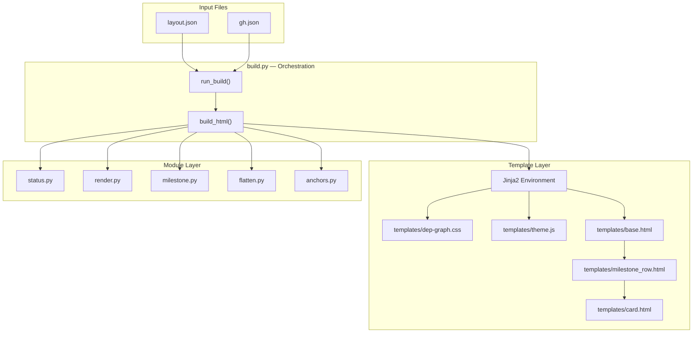
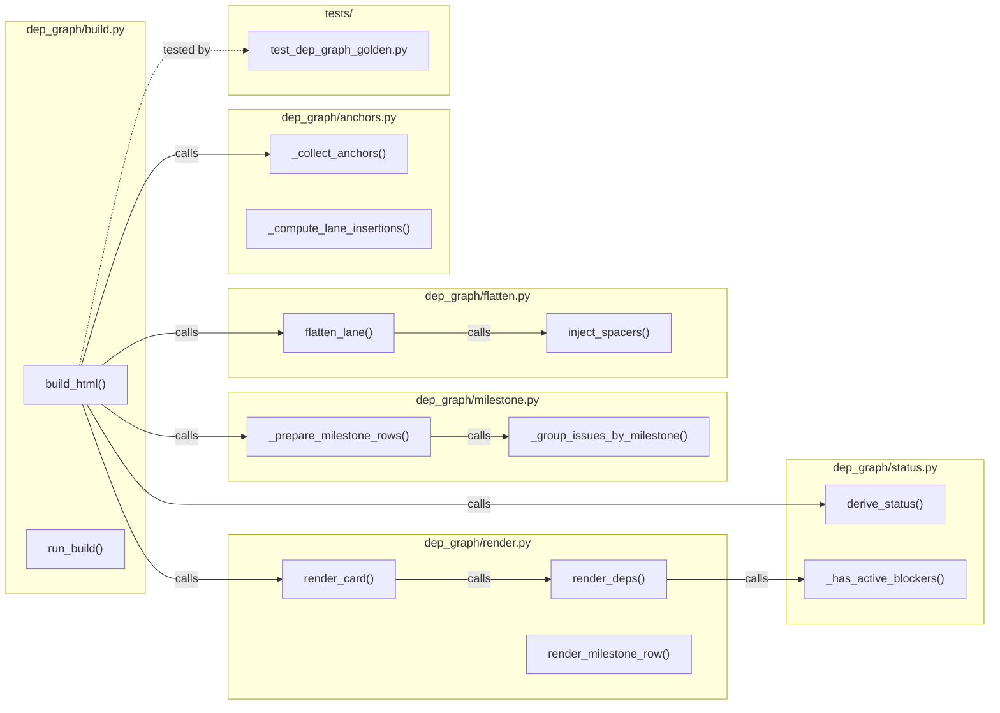

## Summary

Extract ~580 lines of CSS and ~20 lines of JS from inline constants in `build.py` into external template files, then extract Jinja2 HTML templates for the rendering logic, and finally split the remaining Python code into focused modules to achieve `build.py` &lt; 300 lines.

## Architecture

### Data Flow



### File x Function Map



## Agents

| Agent | Task count | Files |
|--------|------------|-------|
| backend-dev | 10 | `build.py`, `status.py`, `render.py`, `milestone.py`, `flatten.py`, `anchors.py`, `templates/*.html` |
| tester | 4 | `test_dep_graph_golden.py` |
| devops | 1 | `pyproject.toml` |

## Consistency Report

- Criteria covered: 14/14
- Uncovered criteria: none
- Tasks without spec backing: none
- Gold plating exemptions applied: 0

## Micro-Tasks

### Slice V1: Static Asset Extraction

#### Task 1: Extract CSS_BASE to external file → backend-dev
- **File:** `scripts/dep-graph/dep_graph/templates/dep-graph.css`
- **Snippet:**
```css
/* Extracted from build.py CSS_BASE */
:root {
  --slot-h: 56px;
}
:root, [data-theme="dark"] {
  --bg: #0d1117;
  /* ... full CSS from CSS_BASE ... */
}
```
- **Verify:** `test -f scripts/dep-graph/dep_graph/templates/dep-graph.css && wc -l scripts/dep-graph/dep_graph/templates/dep-graph.css | grep -E '[5-9][0-9]{2}'` (ready)
- **Expected:** File exists with ~580 lines
- **Time:** 3 min
- **Difficulty:** 1
- **Traces:** SC-1
- **Phase:** GREEN

#### Task 2: Extract THEME_SCRIPT to external file → backend-dev
- **File:** `scripts/dep-graph/dep_graph/templates/theme.js`
- **Snippet:**
```javascript
(function() {
  const btn = document.getElementById('theme-toggle');
  const KEY = 'lyra-v2-graph-theme';
  // ... theme toggle logic ...
})();
```
- **Verify:** `test -f scripts/dep-graph/dep_graph/templates/theme.js` (ready)
- **Expected:** File exists with theme toggle script
- **Time:** 2 min
- **Difficulty:** 1
- **Traces:** SC-2
- **Phase:** GREEN

#### Task 3: Add jinja2 dependency → devops
- **File:** `scripts/dep-graph/pyproject.toml`
- **Snippet:**
```toml
dependencies = ["jsonschema>=4.0", "jinja2>=3.0"]
```
- **Verify:** `cd scripts/dep-graph && grep -q 'jinja2' pyproject.toml` (ready)
- **Expected:** jinja2 in dependencies list
- **Time:** 1 min
- **Difficulty:** 1
- **Traces:** SC-1.3
- **Phase:** GREEN

#### Task 4: Create templates directory marker → backend-dev
- **File:** `scripts/dep-graph/dep_graph/templates/__init__.py`
- **Snippet:** `# Template package for dep-graph HTML generation`
- **Verify:** `test -f scripts/dep-graph/dep_graph/templates/__init__.py` (ready)
- **Expected:** Package marker file exists
- **Time:** 1 min
- **Difficulty:** 1
- **Traces:** S1
- **Phase:** GREEN

#### RED-GATE: RED complete V1 → tester
- **Verify:** All asset files exist
- **Phase:** RED-GATE

### Slice V2: Template Extraction

#### Task 5: Create base.html template → backend-dev
- **File:** `scripts/dep-graph/dep_graph/templates/base.html`
- **Snippet:**
```html
<!DOCTYPE html>
<html lang="en" data-theme="dark">
<head>
  <meta charset="UTF-8">
  <title>{{ title }}</title>
  <style>
  
  </style>
</head>
<body>
  <header>...</header>
  <div class="milestones">
  
  </div>
  <footer>...</footer>
  
</body>
</html>
```
- **Verify:** `test -f scripts/dep-graph/dep_graph/templates/base.html` (ready)
- **Expected:** Template file exists with HTML skeleton
- **Time:** 5 min
- **Difficulty:** 2
- **Traces:** SC-3, U0→N1
- **Phase:** GREEN

#### Task 6: Create card.html template → backend-dev
- **File:** `scripts/dep-graph/dep_graph/templates/card.html`
- **Snippet:**
```html
<div class="card {{ status }}" id="card-{{ repo_slug }}-{{ issue_num }}">
  <div class="top">
    <span class="num">#{{ issue_num }}</span>
    {{ repo_badge }}
  </div>
  <div class="title">{{ title }}</div>
  <div class="deps">{{ deps_html }}</div>
</div>
```
- **Verify:** `test -f scripts/dep-graph/dep_graph/templates/card.html` (ready)
- **Expected:** Template renders card HTML identically
- **Time:** 4 min
- **Difficulty:** 2
- **Traces:** SC-4, U5→N1
- **Phase:** GREEN

#### Task 7: Create milestone_row.html template → backend-dev
- **File:** `scripts/dep-graph/dep_graph/templates/milestone_row.html`
- **Snippet:**
```html
<div class="milestone-row">
  <div class="milestone-row-header">
    <span class="ms-label">{{ milestone }}</span>
  </div>
  <div class="milestone-cols">
  
    
  
  </div>
</div>
```
- **Verify:** `test -f scripts/dep-graph/dep_graph/templates/milestone_row.html` (ready)
- **Expected:** Template renders milestone rows identically
- **Time:** 4 min
- **Difficulty:** 2
- **Traces:** SC-5, U3→N1
- **Phase:** GREEN

#### Task 8: Create lane_col.html template → backend-dev
- **File:** `scripts/dep-graph/dep_graph/templates/lane_col.html`
- **Snippet:**
```html
<div class="lane-col">
  <div class="lane-col-head" data-lane="{{ color }}">
    <span class="code">{{ code }}</span>
    <span class="name">{{ name }}</span>
  </div>
  <div class="lane-col-cards">
  
    
  
  </div>
</div>
```
- **Verify:** `test -f scripts/dep-graph/dep_graph/templates/lane_col.html` (ready)
- **Expected:** Template renders lane columns identically
- **Time:** 3 min
- **Difficulty:** 2
- **Traces:** U4→N1
- **Phase:** GREEN

#### Task 9: Refactor build_html() to use Jinja2 → backend-dev
- **File:** `scripts/dep-graph/dep_graph/build.py`
- **Snippet:**
```python
from jinja2 import Environment, PackageLoader

def build_html(layout: dict, gh_issues: dict) -> str:
    env = Environment(loader=PackageLoader('dep_graph', 'templates'))
    template = env.get_template('base.html')
    # ... orchestration logic ...
    return template.render(**template_data)
```
- **Verify:** `grep -q 'PackageLoader' scripts/dep-graph/dep_graph/build.py` (ready)
- **Expected:** build_html uses Jinja2 templates
- **Time:** 8 min
- **Difficulty:** 3
- **Traces:** N1→S1
- **Phase:** GREEN

#### Task 10: Create golden output verification test → tester
- **File:** `scripts/dep-graph/tests/test_dep_graph_golden.py`
- **Snippet:**
```python
def test_output_matches_golden():
    """Verify extracted templates produce identical HTML."""
    # Build from current code
    # Compare byte-for-byte with golden
    assert output == golden
```
- **Verify:** `test -f scripts/dep-graph/tests/test_dep_graph_golden.py` (ready)
- **Expected:** Test file exists
- **Time:** 5 min
- **Difficulty:** 2
- **Traces:** SC-10
- **Phase:** GREEN

#### RED-GATE: RED complete V2 → tester
- **Verify:** Golden test passes
- **Phase:** RED-GATE

### Slice V3: Module Extraction

#### Task 11: Extract status.py module → backend-dev [P]
- **File:** `scripts/dep-graph/dep_graph/status.py`
- **Snippet:**
```python
"""Status derivation and blocker detection."""
from .build import CardContext

def derive_status(ovr, gh_entry, extra_blocked_by, gh_issues, repo=""): -> str: ...
def _has_active_blockers(gh_entry, extra_blocked_by, gh_issues, own_repo): -> bool: ...
```
- **Verify:** `test -f scripts/dep-graph/dep_graph/status.py && grep -q 'derive_status' scripts/dep-graph/dep_graph/status.py` (ready)
- **Expected:** Module exists with status functions
- **Time:** 5 min
- **Difficulty:** 2
- **Traces:** SC-6
- **Phase:** GREEN

#### Task 12: Extract render.py module → backend-dev [P]
- **File:** `scripts/dep-graph/dep_graph/render.py`
- **Snippet:**
```python
"""HTML rendering functions for dep-graph cards."""
def render_card(ctx: CardContext, anchor_attr: str = "") -> str: ...
def render_deps(ctx: CardContext) -> str: ...
def display_title(issue_num, ovr, gh_entry, title_rules) -> str: ...
```
- **Verify:** `test -f scripts/dep-graph/dep_graph/render.py && grep -q 'render_card' scripts/dep-graph/dep_graph/render.py` (ready)
- **Expected:** Module exists with render functions
- **Time:** 6 min
- **Difficulty:** 2
- **Traces:** SC-7
- **Phase:** GREEN

#### Task 13: Extract milestone.py module → backend-dev
- **File:** `scripts/dep-graph/dep_graph/milestone.py`
- **Snippet:**
```python
"""Milestone grouping and rendering logic."""
MILESTONE_ORDER = [...]
LANE_GROUPS = {...}

def _prepare_milestone_rows(layout, gh_issues, primary_repo, overrides): ...
def _group_issues_by_milestone(gh_issues, primary_repo): ...
```
- **Verify:** `test -f scripts/dep-graph/dep_graph/milestone.py && grep -q 'MILESTONE_ORDER' scripts/dep-graph/dep_graph/milestone.py` (ready)
- **Expected:** Module exists with milestone logic
- **Time:** 6 min
- **Difficulty:** 3
- **Traces:** SC-8
- **Phase:** GREEN

#### Task 14: Extract flatten.py module → backend-dev [P]
- **File:** `scripts/dep-graph/dep_graph/flatten.py`
- **Snippet:**
```python
"""Lane flattening and spacer injection."""
def flatten_lane(lane, overrides, label_drift_check, gh_issues) -> dict: ...
def inject_spacers(flat_lanes: list[dict]) -> list[dict]: ...
```
- **Verify:** `test -f scripts/dep-graph/dep_graph/flatten.py && grep -q 'flatten_lane' scripts/dep-graph/dep_graph/flatten.py` (ready)
- **Expected:** Module exists with flatten functions
- **Time:** 5 min
- **Difficulty:** 2
- **Traces:** SC-9
- **Phase:** GREEN

#### Task 15: Extract anchors.py module → backend-dev [P]
- **File:** `scripts/dep-graph/dep_graph/anchors.py`
- **Snippet:**
```python
"""Anchor and spacer computation for cross-lane alignment."""
def compute_slot_index(flat_rows, target_issue) -> int: ...
def _collect_anchors(flat_lanes) -> dict: ...
def _compute_lane_insertions(fl, anchors) -> list: ...
```
- **Verify:** `test -f scripts/dep-graph/dep_graph/anchors.py && grep -q 'compute_slot_index' scripts/dep-graph/dep_graph/anchors.py` (ready)
- **Expected:** Module exists with anchor functions
- **Time:** 4 min
- **Difficulty:** 2
- **Traces:** SC-10
- **Phase:** GREEN

#### Task 16: Update imports in build.py → backend-dev
- **File:** `scripts/dep-graph/dep_graph/build.py`
- **Snippet:**
```python
from .status import derive_status
from .render import render_card, render_deps
from .milestone import _prepare_milestone_rows, MILESTONE_ORDER
from .flatten import flatten_lane, inject_spacers
from .anchors import compute_slot_index
```
- **Verify:** `grep -c 'from \\.' scripts/dep-graph/dep_graph/build.py | grep -E '[5-9]'` (ready)
- **Expected:** build.py imports from extracted modules
- **Time:** 3 min
- **Difficulty:** 2
- **Traces:** N1
- **Phase:** GREEN

#### RED-GATE: RED complete V3 → tester
- **Verify:** `wc -l scripts/dep-graph/dep_graph/build.py | awk '{print $1}' | xargs -I{} test {} -lt 300`
- **Expected:** build.py &lt; 300 lines
- **Phase:** RED-GATE

### Final Verification

#### Task 17: Run full test suite → tester
- **File:** `scripts/dep-graph/tests/`
- **Verify:** `cd scripts/dep-graph && uv run pytest` (ready)
- **Expected:** All tests pass
- **Time:** 3 min
- **Difficulty:** 1
- **Traces:** SC-11
- **Phase:** REFACTOR

#### Task 18: Type check → tester
- **File:** `scripts/dep-graph/`
- **Verify:** `cd scripts/dep-graph && uv run pyright` (ready)
- **Expected:** No type errors
- **Time:** 2 min
- **Difficulty:** 1
- **Traces:** SC-12
- **Phase:** REFACTOR

#### Task 19: Verify golden output → tester
- **File:** `scripts/dep-graph/tests/test_dep_graph_golden.py`
- **Verify:** `cd scripts/dep-graph && uv run pytest tests/test_dep_graph_golden.py -v` (ready)
- **Expected:** Golden test passes
- **Time:** 2 min
- **Difficulty:** 1
- **Traces:** SC-10
- **Phase:** REFACTOR

## Task IDs

<!-- Generated by /plan. Used by /implement to resume tasks on session restart. -->
- T1: 10 — Extract CSS_BASE to external file
- T2: 11 — Extract THEME_SCRIPT to external file
- T3: 12 — Add jinja2 dependency
- T4: 13 — Create templates directory marker
- T5: 14 — Create base.html template
- T6: 15 — Create card.html template
- T7: 16 — Create milestone_row.html template
- T8: 17 — Create lane_col.html template
- T9: 18 — Refactor build_html() to use Jinja2
- T10: 19 — Create golden output verification test
- T11: 20 — Extract status.py module
- T12: 21 — Extract render.py module
- T13: 22 — Extract milestone.py module
- T14: 23 — Extract flatten.py module
- T15: 24 — Extract anchors.py module
- T16: 25 — Update imports in build.py
- T17: 26 — Run full test suite
- T18: 27 — Type check
- T19: 28 — Verify golden output
