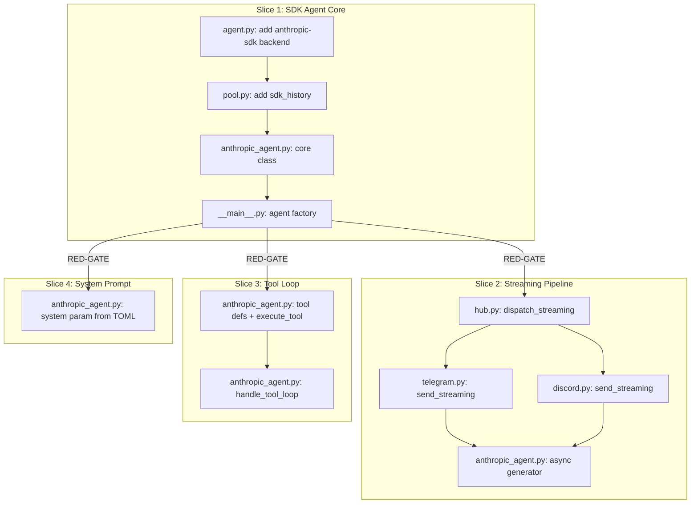

## Summary

Build `AnthropicAgent` alongside `SimpleAgent` using the raw Anthropic Messages API (`AsyncAnthropic`). 4 slices: SDK agent core → streaming pipeline + tool loop + system prompt (parallel after S1 gate). CLI remains default; SDK is opt-in via `backend = "anthropic-sdk"` in agent TOML.

## Bootstrap Context

**Reference patterns:**
- `src/lyra/agents/simple_agent.py` — existing `AgentBase` implementation (follow same structure)
- `src/lyra/core/cli_pool.py` — pool pattern for process management
- `tests/agents/test_simple_agent.py` — test conventions (make_message, make_pool, make_agent helpers)
- `tests/core/test_hub.py` — MockAdapter pattern (must add `send_streaming`)

**Key constraint:** `from __future__ import annotations` is used throughout — `isinstance` checks must use `collections.abc.AsyncIterator`, not `typing.AsyncIterator`.

## Architecture



**File x Function map:**

| File | Functions/Methods | Slice |
|------|------------------|-------|
| `core/agent.py` | `_VALID_BACKENDS += "anthropic-sdk"` | S1 |
| `core/pool.py` | `Pool.sdk_history`, `Pool.max_sdk_history`, `Pool.append_sdk_exchange()` | S1 |
| `agents/anthropic_agent.py` | `AnthropicAgent.__init__()`, `process()`, `_build_messages()`, `_extract_text()` | S1 |
| `agents/anthropic_agent.py` | `process()` → async generator with yield | S2 |
| `agents/anthropic_agent.py` | `_execute_tool()`, `_handle_tool_loop()`, `TOOLS` | S3 |
| `agents/anthropic_agent.py` | `process()` passes `system=` param | S4 |
| `__main__.py` | `_create_agent()` factory function | S1 |
| `core/hub.py` | `dispatch_streaming()`, `run()` isinstance branch | S2 |
| `adapters/telegram.py` | `send_streaming()` | S2 |
| `adapters/discord.py` | `send_streaming()` | S2 |

## Agents

| Agent | Role | Task count | Files |
|-------|------|------------|-------|
| backend-dev (A) | Agent core, pool, factory, hub streaming | 13 | agent.py, pool.py, anthropic_agent.py, __main__.py, hub.py |
| backend-dev (B) | Adapter streaming | 5 | telegram.py, discord.py |
| tester | All test files | 7 | test_anthropic_agent.py, test_hub.py, test_streaming.py, test_main.py |

## Consistency Report

| Metric | Value |
|--------|-------|
| Success criteria | 24 |
| Covered by tasks | 24 |
| Uncovered | 0 |
| Untraced tasks | 0 |

## Micro-Tasks

### Slice 1 — SDK Agent Core

---

**T1.1** [P] Add `"anthropic-sdk"` to valid backends
- **File:** `src/lyra/core/agent.py`
- **Agent:** backend-dev (A)
- **Spec trace:** SC-S1.2
- **Phase:** RED
- **Difficulty:** 1
- **Description:** Add `"anthropic-sdk"` to `_VALID_BACKENDS` frozenset.
- **Code snippet:**
```python
_VALID_BACKENDS: frozenset[str] = frozenset({"claude-cli", "ollama", "anthropic-sdk"})
```
- **Verify:** `uv run python -c "from lyra.core.agent import load_agent_config; print('ok')"`
- **Expected:** `ok`
- **Time:** 2 min

---

**T1.2** [P] Add `sdk_history` and `max_sdk_history` to Pool
- **File:** `src/lyra/core/pool.py`
- **Agent:** backend-dev (A)
- **Spec trace:** SC-S1.3, SC-S1.4
- **Phase:** RED
- **Difficulty:** 2
- **Description:** Add `sdk_history: list[dict]` and `max_sdk_history: int = 50` fields. Add `append_sdk_exchange(user_msg, assistant_msg)` method that appends and trims to cap.
- **Code snippet:**
```python
sdk_history: list[dict] = field(default_factory=list)
max_sdk_history: int = 50

def append_sdk_exchange(self, user_msg: dict, assistant_msg: dict) -> None:
    self.sdk_history.append(user_msg)
    self.sdk_history.append(assistant_msg)
    while len(self.sdk_history) > self.max_sdk_history * 2:
        self.sdk_history.pop(0)
        self.sdk_history.pop(0)
```
- **Verify:** `uv run python -c "from lyra.core.pool import Pool; p = Pool('x','a'); p.append_sdk_exchange({'role':'user','content':'hi'}, {'role':'assistant','content':'hey'}); print(len(p.sdk_history))"`
- **Expected:** `2`
- **Time:** 5 min

---

**T1.3** Create `AnthropicAgent` class (non-streaming)
- **File:** `src/lyra/agents/anthropic_agent.py` (new)
- **Agent:** backend-dev (A)
- **Spec trace:** SC-S1.1, SC-S1.6, SC-S1.7
- **Phase:** RED
- **Difficulty:** 4
- **Deps:** T1.1, T1.2
- **Description:** Create `AnthropicAgent(AgentBase)`. Constructor validates `ANTHROPIC_API_KEY` (raises `SystemExit` if missing). `process()` calls `AsyncAnthropic.messages.create()` (non-streaming for S1), returns `Response`. Appends exchange to `pool.sdk_history`.
- **Code snippet:**
```python
class AnthropicAgent(AgentBase):
    def __init__(self, config: Agent) -> None:
        super().__init__(config)
        api_key = os.environ.get("ANTHROPIC_API_KEY")
        if not api_key:
            raise SystemExit("Missing required env var: ANTHROPIC_API_KEY")
        self._client = anthropic.AsyncAnthropic(api_key=api_key)

    async def process(self, msg: Message, pool: Pool) -> Response:
        self._maybe_reload()
        text = _extract_text(msg)
        messages = self._build_messages(text, pool)
        response = await self._client.messages.create(
            model=self.config.model_config.model,
            max_tokens=4096,
            messages=messages,
        )
        reply = response.content[0].text
        pool.append_sdk_exchange(
            {"role": "user", "content": text},
            {"role": "assistant", "content": reply},
        )
        log.info("SDK response: %d chars, in=%d out=%d tokens",
                 len(reply), response.usage.input_tokens, response.usage.output_tokens)
        return Response(content=reply)
```
- **Verify:** `uv run python -c "from lyra.agents.anthropic_agent import AnthropicAgent; print('import ok')"`
- **Expected:** `import ok`
- **Time:** 10 min

---

**T1.4** Agent factory in `__main__.py`
- **File:** `src/lyra/__main__.py`
- **Agent:** backend-dev (A)
- **Spec trace:** SC-S1.5
- **Deps:** T1.3
- **Phase:** GREEN
- **Difficulty:** 2
- **Description:** Replace hardcoded `SimpleAgent(agent_config, cli_pool)` with factory that selects by `backend`. Only start `CliPool` if backend is `claude-cli`.
- **Code snippet:**
```python
def _create_agent(config: Agent, cli_pool: CliPool | None) -> AgentBase:
    backend = config.model_config.backend
    if backend == "anthropic-sdk":
        from lyra.agents.anthropic_agent import AnthropicAgent
        return AnthropicAgent(config)
    if backend == "claude-cli":
        if cli_pool is None:
            raise RuntimeError("CliPool required for claude-cli backend")
        return SimpleAgent(config, cli_pool)
    raise ValueError(f"Unknown backend: {backend}")
```
- **Verify:** `uv run pytest tests/test_main.py -x -q`
- **Expected:** All pass
- **Time:** 5 min

---

**T1.5** Test: AnthropicAgent core
- **File:** `tests/agents/test_anthropic_agent.py` (new)
- **Agent:** tester
- **Spec trace:** SC-S1.1, SC-S1.3, SC-S1.4, SC-S1.6, SC-S1.7, SC-S1.8
- **Deps:** T1.3
- **Phase:** GREEN
- **Difficulty:** 3
- **Description:** Tests for `AnthropicAgent`: construction with/without API key, `process()` with mocked SDK, `sdk_history` appending and eviction. Also verify `SimpleAgent` still works (regression).
- **Verify:** `uv run pytest tests/agents/test_anthropic_agent.py -x -q`
- **Expected:** All pass
- **Time:** 10 min

---

**T1.6** Test: agent factory in __main__
- **File:** `tests/test_main.py`
- **Agent:** tester
- **Spec trace:** SC-S1.5, SC-S1.8
- **Deps:** T1.4
- **Phase:** GREEN
- **Difficulty:** 2
- **Description:** Add test that factory selects correct agent class based on backend config.
- **Verify:** `uv run pytest tests/test_main.py -x -q`
- **Expected:** All pass
- **Time:** 5 min

---

### **RED-GATE: Slice 1 Complete**

```bash
uv run pytest tests/ -x -q && echo "S1 GATE PASSED"
```

All S1 criteria verified. Slices 2, 3, 4 may proceed in parallel.

---

### Slice 2 — Streaming Pipeline

---

**T2.1** Hub `dispatch_streaming()` and isinstance detection
- **File:** `src/lyra/core/hub.py`
- **Agent:** backend-dev (A)
- **Spec trace:** SC-S2.2, SC-S2.8
- **Phase:** RED
- **Difficulty:** 4
- **Description:** Add `dispatch_streaming(msg, chunks: AsyncIterator[str])` method. Modify `run()`: after `agent.process()`, check `isinstance(result, collections.abc.AsyncIterator)`. If streaming, call `dispatch_streaming()` inside `pool.lock`. If `Response`, use existing `dispatch_response()`.
- **Code snippet:**
```python
from collections.abc import AsyncIterator

async def dispatch_streaming(self, msg: Message, chunks: AsyncIterator[str]) -> None:
    adapter = self.adapter_registry.get((msg.platform, msg.bot_id))
    if adapter is None:
        raise KeyError(...)
    if hasattr(adapter, "send_streaming"):
        await adapter.send_streaming(msg, chunks)
    else:
        # Fallback: accumulate and send
        text = ""
        async for chunk in chunks:
            text += chunk
        await adapter.send(msg, Response(content=text))
```
- **Verify:** `uv run pytest tests/core/test_hub.py -x -q`
- **Expected:** All pass
- **Time:** 8 min

---

**T2.2** Update `ChannelAdapter` protocol + MockAdapter
- **File:** `src/lyra/core/hub.py`, `tests/core/test_hub.py`
- **Agent:** backend-dev (A)
- **Spec trace:** SC-S2.3, SC-cross.3
- **Phase:** GREEN
- **Difficulty:** 2
- **Description:** Add `send_streaming()` to `ChannelAdapter` Protocol. Update `MockAdapter` in tests.
- **Verify:** `uv run pyright src/lyra/core/hub.py`
- **Expected:** 0 errors
- **Time:** 5 min

---

**T2.3** [P] Telegram `send_streaming()` with edit-in-place
- **File:** `src/lyra/adapters/telegram.py`
- **Agent:** backend-dev (B)
- **Spec trace:** SC-S2.4, SC-S2.6, SC-S2.7
- **Deps:** T2.1
- **Phase:** RED
- **Difficulty:** 4
- **Description:** Implement `send_streaming()`: send placeholder via `bot.send_message()`, store message ID. `async for chunk in chunks`: accumulate text, debounce edits at ~500ms via `time.monotonic()`. On placeholder send failure, catch exception and fall back to accumulate + `send()`. On iterator exception, edit with accumulated text + " [response interrupted]".
- **Verify:** `uv run pytest tests/adapters/test_telegram.py -x -q`
- **Expected:** All pass
- **Time:** 10 min

---

**T2.4** [P] Discord `send_streaming()` with edit-in-place
- **File:** `src/lyra/adapters/discord.py`
- **Agent:** backend-dev (B)
- **Spec trace:** SC-S2.5, SC-S2.6, SC-S2.7
- **Deps:** T2.1
- **Phase:** RED
- **Difficulty:** 4
- **Description:** Implement `send_streaming()`: send placeholder via `messageable.send()`, store message object. Edit via `message.edit()` debounced at ~1s. Truncate at `DISCORD_MAX_LENGTH`. Same fallback and mid-stream error handling as Telegram.
- **Verify:** `uv run pytest tests/adapters/test_discord.py -x -q`
- **Expected:** All pass
- **Time:** 10 min

---

**T2.5** Upgrade `AnthropicAgent.process()` to async generator
- **File:** `src/lyra/agents/anthropic_agent.py`
- **Agent:** backend-dev (A)
- **Spec trace:** SC-S2.1, SC-S2.9
- **Deps:** T2.1
- **Phase:** GREEN
- **Difficulty:** 4
- **Description:** Change `process()` to `async def` that yields `str` deltas. Use `self._client.messages.stream()` context manager. Iterate `stream.text_stream`. After stream completes, get final message for usage logging and history append.
- **Code snippet:**
```python
async def process(self, msg: Message, pool: Pool) -> AsyncIterator[str]:
    self._maybe_reload()
    text = _extract_text(msg)
    messages = self._build_messages(text, pool)
    async with self._client.messages.stream(
        model=self.config.model_config.model,
        max_tokens=4096,
        messages=messages,
    ) as stream:
        async for delta in stream.text_stream:
            yield delta
        final = stream.get_final_message()
    # Log and append history after stream completes
    log.info("SDK stream: in=%d out=%d", final.usage.input_tokens, final.usage.output_tokens)
    pool.append_sdk_exchange(
        {"role": "user", "content": text},
        {"role": "assistant", "content": final.content[0].text},
    )
```
- **Verify:** `uv run pytest tests/agents/test_anthropic_agent.py -x -q`
- **Expected:** All pass
- **Time:** 8 min

---

**T2.6** Test: streaming pipeline (hub + adapters)
- **File:** `tests/adapters/test_streaming.py` (new)
- **Agent:** tester
- **Spec trace:** SC-S2.1–S2.9
- **Deps:** T2.3, T2.4, T2.5
- **Phase:** GREEN
- **Difficulty:** 3
- **Description:** Test streaming end-to-end with mock SDK: verify placeholder sent, edits called with debounce, mid-stream error handling, fallback on placeholder failure.
- **Verify:** `uv run pytest tests/adapters/test_streaming.py -x -q`
- **Expected:** All pass
- **Time:** 10 min

---

### Slice 3 — Tool Loop (parallel with S2)

---

**T3.1** Tool definitions and `_execute_tool()`
- **File:** `src/lyra/agents/anthropic_agent.py`
- **Agent:** backend-dev (A)
- **Spec trace:** SC-S3.1, SC-S3.3, SC-S3.4
- **Phase:** RED
- **Difficulty:** 3
- **Description:** Define `TOOLS` list with `get_time` tool schema. Implement `_execute_tool(name, input)` that dispatches to handler functions. Wrap in try/except — on error, return `{"type": "tool_result", "tool_use_id": id, "content": str(error), "is_error": True}`.
- **Code snippet:**
```python
TOOLS = [
    {
        "name": "get_time",
        "description": "Get the current date and time",
        "input_schema": {"type": "object", "properties": {}, "required": []},
    }
]

def _execute_tool(self, name: str, tool_input: dict) -> str:
    if name == "get_time":
        return datetime.now(timezone.utc).isoformat()
    raise ValueError(f"Unknown tool: {name}")
```
- **Verify:** `uv run python -c "from lyra.agents.anthropic_agent import AnthropicAgent; print(AnthropicAgent.TOOLS[0]['name'])"`
- **Expected:** `get_time`
- **Time:** 5 min

---

**T3.2** Tool loop in `process()`
- **File:** `src/lyra/agents/anthropic_agent.py`
- **Agent:** backend-dev (A)
- **Spec trace:** SC-S3.2, SC-S3.5
- **Deps:** T3.1, T2.5
- **Phase:** GREEN
- **Difficulty:** 4
- **Description:** After initial stream, check `stop_reason`. If `"tool_use"`, extract tool blocks, execute each, append tool results, re-call SDK. Loop until `stop_reason != "tool_use"` or `max_turns` reached. On max_turns, return accumulated text.
- **Verify:** `uv run pytest tests/agents/test_anthropic_agent.py -k tool -x -q`
- **Expected:** All pass
- **Time:** 10 min

---

**T3.3** Test: tool loop
- **File:** `tests/agents/test_anthropic_agent.py`
- **Agent:** tester
- **Spec trace:** SC-S3.1–S3.5
- **Deps:** T3.2
- **Phase:** GREEN
- **Difficulty:** 3
- **Description:** Test tool loop with mock SDK returning `tool_use`, verify `_execute_tool` called, verify `is_error=True` on tool failure, verify `max_turns` termination.
- **Verify:** `uv run pytest tests/agents/test_anthropic_agent.py -k tool -x -q`
- **Expected:** All pass
- **Time:** 8 min

---

### Slice 4 — System Prompt (parallel with S2, S3)

---

**T4.1** Pass system prompt from TOML to SDK
- **File:** `src/lyra/agents/anthropic_agent.py`
- **Agent:** backend-dev (A)
- **Spec trace:** SC-S4.1, SC-S4.2
- **Phase:** GREEN
- **Difficulty:** 2
- **Description:** In `process()`, read `self.config.system_prompt`. If non-empty, pass as `system=` parameter. If empty, omit the parameter.
- **Code snippet:**
```python
kwargs = {}
if self.config.system_prompt:
    kwargs["system"] = self.config.system_prompt
```
- **Verify:** `uv run pytest tests/agents/test_anthropic_agent.py -k system -x -q`
- **Expected:** All pass
- **Time:** 3 min

---

**T4.2** Test: system prompt injection
- **File:** `tests/agents/test_anthropic_agent.py`
- **Agent:** tester
- **Spec trace:** SC-S4.1, SC-S4.2
- **Deps:** T4.1
- **Phase:** GREEN
- **Difficulty:** 2
- **Description:** Test that system prompt from config is passed to SDK call. Test that empty prompt omits the parameter.
- **Verify:** `uv run pytest tests/agents/test_anthropic_agent.py -k system -x -q`
- **Expected:** All pass
- **Time:** 5 min

---

### Cross-cutting

---

**T5.1** Full regression test suite
- **Agent:** tester
- **Spec trace:** SC-cross.1
- **Deps:** all previous tasks
- **Phase:** GREEN
- **Difficulty:** 1
- **Description:** Run full test suite to verify no regressions.
- **Verify:** `uv run pytest tests/ -x -q`
- **Expected:** All pass
- **Time:** 3 min

---

**T5.2** Pyright typecheck
- **Agent:** tester
- **Spec trace:** SC-cross.2
- **Deps:** all previous tasks
- **Phase:** GREEN
- **Difficulty:** 1
- **Description:** Run pyright to verify type conformance, especially `ChannelAdapter` protocol.
- **Verify:** `uv run pyright`
- **Expected:** 0 errors
- **Time:** 2 min
