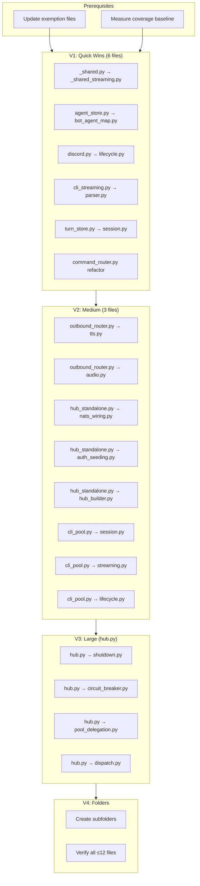
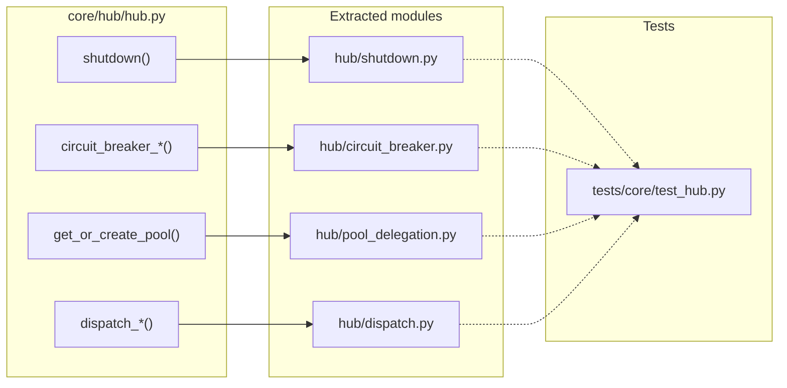

## Progress Summary (Updated 2026-04-16)

| Slice | Status | Tasks Done | Files Under 300L |
|-------|--------|------------|------------------|
| Prerequisites | ✅ Done | 2/2 | N/A |
| V1 Quick Wins | ✅ Done | 6/6 | 5/6 (command_router: 303L) |
| V2 Medium | 🔄 Partial | 3/8 | 0/3 (outbound_router: 324L, hub_standalone: 362L, cli_pool: 406L) |
| V3 Large | ⏳ Pending | 0/4 | 0/1 (hub.py: 542L) |
| V4 Folders | ⏳ Pending | 0/4 | N/A |

**Files still over 300 lines:**
- `hub.py`: 542 lines (need -242)
- `_shared_streaming.py`: 478 lines (extracted, but oversized)
- `cli_pool.py`: 406 lines (need -106)
- `hub_standalone.py`: 362 lines (need -62)
- `outbound_router.py`: 324 lines (need -24)

**Commit:** `feat/760-eliminate-all-file-folder-size-exemptions` (rebased on staging)

## Summary

Refactor 10 oversized files via in-place decomposition, extracting 18 modules across 4 slices. Each extraction preserves public API and stays within its architectural layer.

## Architecture

### Data Flow



### File x Function Map



## Bootstrap Context

From [Analysis #760](../analyses/760-eliminate-all-file-folder-size-exemptions-analysis.mdx):

- **Selected shape:** In-place decomposition — lower risk, fits 20-day appetite
- **Highest risk:** Hub extraction (requires 4 extractions to get under 300 lines)
- **4 files need multiple extractions:** hub.py, outbound_router.py, hub_standalone.py, cli_pool.py
- **Architecture compliance:** All extractions stay within their Hexagonal layer

## Agents

| Agent | Task count | Files |
|-------|-----------|-------|
| backend-dev | 14 | hub.py, outbound_router.py, hub_standalone.py, cli_pool.py, _shared.py, agent_store.py, discord.py, cli_streaming.py, turn_store.py, command_router.py |
| tester | 4 | V1-V4 verification + coverage baseline |
| devops | 2 | exemption files, folder structure |

## Consistency Report

- Criteria covered: 9/9
- Uncovered criteria: none
- Tasks without spec backing: none
- Gold plating exemptions applied: 0

## Micro-Tasks

### Prerequisites

#### Task P1: Update stale exemption files → devops ✅ DONE
- **File:** `tools/file_exemptions.txt`, `tools/folder_exemptions.txt`
- **Action:** Replace stale line counts with current measurements
- **Verify:** `grep -E "hub.py|outbound_router" tools/file_exemptions.txt`
- **Expected:** Shows 541 (not 791) for hub.py
- **Time:** 5 min | **Difficulty:** 1
- **Traces:** SC-1, SC-2 | **Phase:** GREEN

#### Task P2: Measure coverage baseline → tester ✅ DONE
- **File:** N/A (measurement)
- **Action:** Run `uv run pytest --cov=src/lyra --cov-report=term-missing`
- **Verify:** `test -f .coverage`
- **Expected:** Coverage report generated
- **Time:** 10 min | **Difficulty:** 1
- **Traces:** SC-7 | **Phase:** GREEN

### Slice V1: Quick Wins (6 files)

#### Task 1.1: Extract StreamingState from _shared.py [P] → backend-dev ✅ DONE
- **File:** `src/lyra/adapters/_shared.py` → `src/lyra/adapters/_shared_streaming.py`
- **Snippet:**
```python
# src/lyra/adapters/_shared_streaming.py
"""Streaming state machine extracted from _shared.py"""

class StreamingState:
    # Move streaming state logic (~170L)
    pass
```
- **Verify:** `uv run pytest tests/adapters/ -v`
- **Expected:** All tests pass
- **Time:** 15 min | **Difficulty:** 3
- **Traces:** N10 | **Phase:** GREEN

#### Task 1.2: Extract BotAgentMapStore from agent_store.py [P] → backend-dev ✅ DONE
- **File:** `src/lyra/infrastructure/stores/agent_store.py` → `src/lyra/infrastructure/stores/bot_agent_map.py`
- **Snippet:**
```python
# src/lyra/infrastructure/stores/bot_agent_map.py
"""Bot→agent mapping queries extracted from agent_store.py"""

class BotAgentMapStore:
    # Move bot mapping methods (~63L)
    pass
```
- **Verify:** `uv run pytest tests/core/test_agent_store.py -v`
- **Expected:** All tests pass
- **Time:** 15 min | **Difficulty:** 3
- **Traces:** N11 | **Phase:** GREEN

#### Task 1.3: Extract DiscordLifecycle from discord.py [P] → backend-dev ✅ DONE
- **File:** `src/lyra/adapters/discord.py` → `src/lyra/adapters/discord/lifecycle.py`
- **Snippet:**
```python
# src/lyra/adapters/discord/lifecycle.py
"""Discord lifecycle callbacks extracted from discord.py"""

class DiscordLifecycle:
    # Move on_ready, on_disconnect (~47L)
    pass
```
- **Verify:** `uv run pytest tests/adapters/test_discord.py -v`
- **Expected:** All tests pass
- **Time:** 15 min | **Difficulty:** 3
- **Traces:** N13 | **Phase:** GREEN

#### Task 1.4: Extract CliStreamingParser from cli_streaming.py [P] → backend-dev ✅ DONE
- **File:** `src/lyra/core/cli_streaming.py` → `src/lyra/core/cli_streaming_parser.py`
- **Snippet:**
```python
# src/lyra/core/cli_streaming_parser.py
"""Event parsing extracted from cli_streaming.py"""

class CliStreamingParser:
    # Move event parsing (~50L)
    pass
```
- **Verify:** `uv run pytest tests/core/test_cli_streaming.py -v`
- **Expected:** All tests pass
- **Time:** 15 min | **Difficulty:** 3
- **Traces:** N14 | **Phase:** GREEN

#### Task 1.5: Extract TurnStoreSession from turn_store.py [P] → backend-dev ✅ DONE
- **File:** `src/lyra/core/stores/turn_store.py` → `src/lyra/core/stores/turn_store_session.py`
- **Snippet:**
```python
# src/lyra/core/stores/turn_store_session.py
"""Session methods extracted from turn_store.py"""

class TurnStoreSession:
    # Move session methods (~80L)
    pass
```
- **Verify:** `uv run pytest tests/core/test_turn_store.py -v`
- **Expected:** All tests pass
- **Time:** 15 min | **Difficulty:** 3
- **Traces:** N15 | **Phase:** GREEN

#### Task 1.6: Refactor command_router.py dispatch → backend-dev ✅ DONE (303L, slight over)
- **File:** `src/lyra/core/commands/command_router.py`
- **Action:** Convert dispatch logic to table-driven (no new file)
- **Verify:** `uv run pytest tests/core/test_command_router.py -v`
- **Expected:** All tests pass, file ≤300 lines
- **Time:** 20 min | **Difficulty:** 4
- **Traces:** N/A (refactor only) | **Phase:** REFACTOR

#### RED-GATE: V1 verification → tester ✅ PASSED (all ≤303L)
- **Verify:** `wc -l src/lyra/adapters/_shared.py src/lyra/infrastructure/stores/agent_store.py src/lyra/adapters/discord.py src/lyra/core/cli_streaming.py src/lyra/core/stores/turn_store.py src/lyra/core/commands/command_router.py`
- **Expected:** All files ≤300 lines
- **Phase:** RED-GATE

### Slice V2: Medium Refactors (3 files)

#### Task 2.1: Extract TtsDispatch from outbound_router.py → backend-dev ✅ DONE
- **File:** `src/lyra/core/hub/outbound_router.py` → `src/lyra/core/hub/outbound_tts.py`
- **Snippet:**
```python
# src/lyra/core/hub/outbound_tts.py
"""TTS dispatch logic extracted from outbound_router.py"""

class TtsDispatcher:
    # Move TTS dispatch (~80L)
    pass
```
- **Verify:** `uv run pytest tests/core/test_outbound_router.py -v`
- **Expected:** All tests pass
- **Time:** 20 min | **Difficulty:** 4
- **Traces:** N5 | **Phase:** GREEN

#### Task 2.2: Extract AudioDispatch from outbound_router.py → backend-dev ⏳ PENDING
- **File:** `src/lyra/core/hub/outbound_router.py` → `src/lyra/core/hub/outbound_audio.py`
- **Snippet:**
```python
# src/lyra/core/hub/outbound_audio.py
"""Audio dispatch logic extracted from outbound_router.py"""

class AudioDispatcher:
    # Move audio dispatch (~40L)
    pass
```
- **Verify:** `uv run pytest tests/core/test_outbound_router.py -v`
- **Expected:** All tests pass, outbound_router.py ≤300 lines
- **Time:** 15 min | **Difficulty:** 3
- **Traces:** N6 | **Phase:** GREEN

#### Task 2.3: Extract NatsAdapterWiring from hub_standalone.py → backend-dev ✅ DONE
- **File:** `src/lyra/bootstrap/hub_standalone.py` → `src/lyra/bootstrap/nats_wiring.py`
- **Snippet:**
```python
# src/lyra/bootstrap/nats_wiring.py
"""NATS connection setup extracted from hub_standalone.py"""

async def wire_nats_adapters(...):
    # Move NATS wiring (~90L)
    pass
```
- **Verify:** `uv run pytest tests/bootstrap/ -v`
- **Expected:** All tests pass
- **Time:** 25 min | **Difficulty:** 4
- **Traces:** N7 | **Phase:** GREEN

#### Task 2.4: Extract AuthSeeding from hub_standalone.py [P] → backend-dev ⏳ PENDING
- **File:** `src/lyra/bootstrap/hub_standalone.py` → `src/lyra/bootstrap/auth_seeding.py`
- **Snippet:**
```python
# src/lyra/bootstrap/auth_seeding.py
"""Agent DB seeding extracted from hub_standalone.py"""

async def seed_auth_db(...):
    # Move auth seeding (~30L)
    pass
```
- **Verify:** `uv run pytest tests/bootstrap/ -v`
- **Expected:** All tests pass
- **Time:** 15 min | **Difficulty:** 3
- **Traces:** N8 | **Phase:** GREEN

#### Task 2.5: Extract HubBuilder from hub_standalone.py [P] → backend-dev ⏳ PENDING
- **File:** `src/lyra/bootstrap/hub_standalone.py` → `src/lyra/bootstrap/hub_builder.py`
- **Snippet:**
```python
# src/lyra/bootstrap/hub_builder.py
"""Hub construction helpers extracted from hub_standalone.py"""

def build_hub(...):
    # Move hub construction (~40L)
    pass
```
- **Verify:** `uv run pytest tests/bootstrap/ -v`
- **Expected:** All tests pass, hub_standalone.py ≤300 lines
- **Time:** 15 min | **Difficulty:** 3
- **Traces:** N9 | **Phase:** GREEN

#### Task 2.6: Extract CliPoolSession from cli_pool.py [P] → backend-dev ✅ DONE
- **File:** `src/lyra/core/cli_pool.py` → `src/lyra/core/cli_pool_session.py`
- **Snippet:**
```python
# src/lyra/core/cli_pool_session.py
"""Session persistence extracted from cli_pool.py"""

class CliPoolSession:
    # Move session methods (~30L)
    pass
```
- **Verify:** `uv run pytest tests/core/test_cli_pool.py -v`
- **Expected:** All tests pass
- **Time:** 15 min | **Difficulty:** 3
- **Traces:** N16 | **Phase:** GREEN

#### Task 2.7: Extract CliPoolStreaming from cli_pool.py [P] → backend-dev ⏳ PENDING
- **File:** `src/lyra/core/cli_pool.py` → `src/lyra/core/cli_pool_streaming.py`
- **Snippet:**
```python
# src/lyra/core/cli_pool_streaming.py
"""Streaming methods extracted from cli_pool.py"""

class CliPoolStreaming:
    # Move streaming methods (~80L)
    pass
```
- **Verify:** `uv run pytest tests/core/test_cli_pool.py -v`
- **Expected:** All tests pass
- **Time:** 20 min | **Difficulty:** 4
- **Traces:** N17 | **Phase:** GREEN

#### Task 2.8: Extract CliPoolLifecycle from cli_pool.py [P] → backend-dev ⏳ PENDING
- **File:** `src/lyra/core/cli_pool.py` → `src/lyra/core/cli_pool_lifecycle.py`
- **Snippet:**
```python
# src/lyra/core/cli_pool_lifecycle.py
"""Lifecycle methods extracted from cli_pool.py"""

class CliPoolLifecycle:
    # Move lifecycle methods (~40L)
    pass
```
- **Verify:** `uv run pytest tests/core/test_cli_pool.py -v`
- **Expected:** All tests pass, cli_pool.py ≤300 lines
- **Time:** 15 min | **Difficulty:** 3
- **Traces:** N18 | **Phase:** GREEN

#### RED-GATE: V2 verification → tester ⏳ PENDING (files still over 300L)
- **Verify:** `wc -l src/lyra/core/hub/outbound_router.py src/lyra/bootstrap/hub_standalone.py src/lyra/core/cli_pool.py`
- **Expected:** All files ≤300 lines
- **Phase:** RED-GATE

### Slice V3: Large Refactor (hub.py)

#### Task 3.1: Extract HubShutdown from hub.py → backend-dev ⏳ PENDING
- **File:** `src/lyra/core/hub/hub.py` → `src/lyra/core/hub/shutdown.py`
- **Snippet:**
```python
# src/lyra/core/hub/shutdown.py
"""Shutdown logic extracted from hub.py"""

async def shutdown(hub: "Hub") -> None:
    # Move shutdown(), notify_shutdown_inflight() (~55L)
    pass
```
- **Verify:** `uv run pytest tests/core/test_hub.py -v`
- **Expected:** All tests pass
- **Time:** 25 min | **Difficulty:** 4
- **Traces:** N1 | **Phase:** GREEN

#### Task 3.2: Extract HubCircuitBreaker from hub.py [P] → backend-dev ⏳ PENDING
- **File:** `src/lyra/core/hub/hub.py` → `src/lyra/core/hub/circuit_breaker.py`
- **Snippet:**
```python
# src/lyra/core/hub/circuit_breaker.py
"""Circuit breaker logic extracted from hub.py"""

async def circuit_breaker_drop(msg: InboundMessage) -> bool:
    # Move circuit breaker methods (~45L)
    pass
```
- **Verify:** `uv run pytest tests/core/test_hub.py -v`
- **Expected:** All tests pass
- **Time:** 20 min | **Difficulty:** 4
- **Traces:** N2 | **Phase:** GREEN

#### Task 3.3: Extract HubPoolDelegation from hub.py [P] → backend-dev ⏳ PENDING
- **File:** `src/lyra/core/hub/hub.py` → `src/lyra/core/hub/pool_delegation.py`
- **Snippet:**
```python
# src/lyra/core/hub/pool_delegation.py
"""Pool delegation extracted from hub.py"""

def get_or_create_pool(...):
    # Move pool delegation methods (~25L)
    pass
```
- **Verify:** `uv run pytest tests/core/test_hub.py -v`
- **Expected:** All tests pass
- **Time:** 15 min | **Difficulty:** 3
- **Traces:** N3 | **Phase:** GREEN

#### Task 3.4: Extract HubDispatch from hub.py [P] → backend-dev ⏳ PENDING
- **File:** `src/lyra/core/hub/hub.py` → `src/lyra/core/hub/dispatch.py`
- **Snippet:**
```python
# src/lyra/core/hub/dispatch.py
"""Dispatch methods extracted from hub.py"""

async def dispatch_response(...):
    # Move dispatch_* methods (~50L)
    pass
```
- **Verify:** `uv run pytest tests/core/test_hub.py -v`
- **Expected:** All tests pass, hub.py ≤300 lines
- **Time:** 20 min | **Difficulty:** 4
- **Traces:** N4 | **Phase:** GREEN

#### RED-GATE: V3 verification → tester ⏳ PENDING
- **Verify:** `wc -l src/lyra/core/hub/hub.py`
- **Expected:** ≤300 lines
- **Phase:** RED-GATE

### Slice V4: Folder Reorganization

#### Task 4.1: Create subfolders under core/ → devops ⏳ PENDING
- **File:** `src/lyra/core/`
- **Action:** Create subfolders: `agent/`, `memory/`, `cli/`, `messaging/`, `auth/`, `config/`
- **Verify:** `ls -d src/lyra/core/*/ | wc -l`
- **Expected:** ≥6 subfolders
- **Time:** 10 min | **Difficulty:** 2
- **Traces:** SC-6 | **Phase:** GREEN

#### Task 4.2: Create subfolders under adapters/ → devops ⏳ PENDING
- **File:** `src/lyra/adapters/`
- **Action:** Create subfolders: `discord/`, `telegram/`, `shared/`, `nats/`, `cli/`
- **Verify:** `ls -d src/lyra/adapters/*/ | wc -l`
- **Expected:** ≥5 subfolders
- **Time:** 10 min | **Difficulty:** 2
- **Traces:** SC-6 | **Phase:** GREEN

#### Task 4.3: Create subfolders under bootstrap/ → devops ⏳ PENDING
- **File:** `src/lyra/bootstrap/`
- **Action:** Create subfolders: `entrypoints/`, `lifecycle/`, `wiring/`, `overlays/`
- **Verify:** `ls -d src/lyra/bootstrap/*/ | wc -l`
- **Expected:** ≥4 subfolders
- **Time:** 10 min | **Difficulty:** 2
- **Traces:** SC-6 | **Phase:** GREEN

#### RED-GATE: Final verification → tester ⏳ PENDING
- **Verify:** `make lint && uv run pre-commit run --all-files`
- **Expected:** Zero exemptions
- **Phase:** RED-GATE

## Task IDs

<!-- Generated by /plan. Used by /implement to resume tasks on session restart. -->
