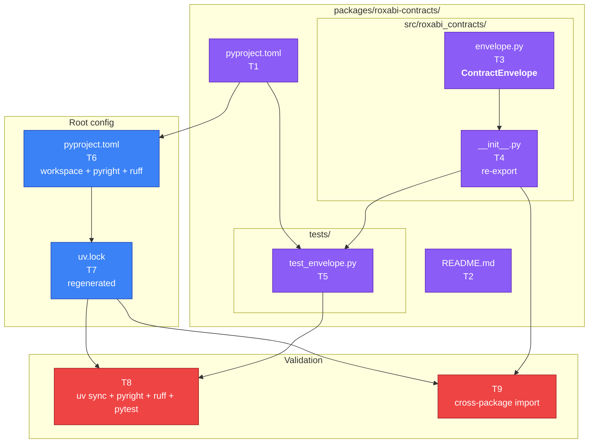
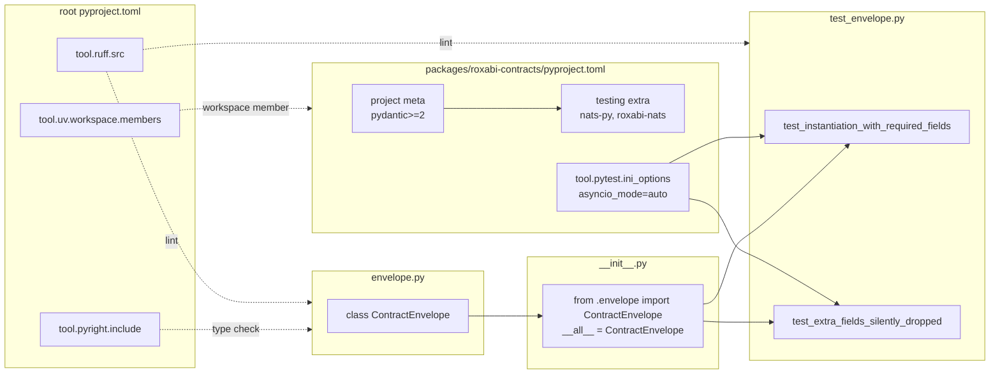

## Summary

Scaffold the `packages/roxabi-contracts/` uv workspace subpackage (5 new files) and register it in root tooling (`pyproject.toml` + regenerated `uv.lock`). Ships `ContractEnvelope` as the shared Pydantic base class for all future per-domain contract models. Scope is deliberately narrow — voice submodule (#763), CONTRACT_VERSION migration (#765), and root pytest integration (#768) are out of scope.

## Architecture

### Data flow



### File × Function map



## Agents

| Agent | Tasks | Files |
|---|---|---|
| `backend-dev` | 2 (T3, T4) | `src/roxabi_contracts/envelope.py`, `src/roxabi_contracts/__init__.py` |
| `devops` | 6 (T1, T2, T6, T7, T8, T9) | `packages/roxabi-contracts/pyproject.toml`, `README.md`, root `pyproject.toml`, `uv.lock`, validation runs |
| `tester` | 1 (T5) | `tests/test_envelope.py` |

## Reference Patterns

- `packages/roxabi-nats/pyproject.toml` — subpackage manifest precedent (build-system, hatch wheel target, pytest ini_options)
- `packages/roxabi-nats/src/roxabi_nats/__init__.py` — re-export pattern with `__all__` and module docstring referencing the ADR
- `packages/roxabi-nats/README.md` — minimal external-install docs pointing to ADR
- `packages/roxabi-nats/tests/conftest.py` — pytest bootstrap inside the subpackage
- Root `pyproject.toml` lines 74–75, 100, 130 — existing roxabi-nats registration (mirror structure for roxabi-contracts)

## Consistency Report

- **Covered:** 14/14 success criteria have at least one owning task
- **Uncovered:** 0
- **Untraced tasks:** 0
- **Spec trace map:**
  - T1 → SC1, SC2, SC3 (manifest fields + testing extra + pytest ini_options)
  - T3 → SC4 (ContractEnvelope class definition)
  - T4 → SC5 (init re-export of ContractEnvelope only)
  - T5 → SC12 (test_envelope.py passes, verifies instantiation + extra=ignore)
  - T6 → SC6, SC7, SC8 (workspace members + pyright include + ruff src)
  - T7 → SC9 (uv.lock regenerated and committed)
  - T8 → SC10, SC11 (pyright + ruff gates; also re-runs SC12)
  - T9 → SC13 (cross-package import integration)
  - Implicit via T3+T4 files: SC14 (no placeholder submodules)

## Micro-Tasks

### Slice V1 — Package + envelope (F1–F5)

#### T1 [P] GREEN — devops — difficulty 2

**Description:** Create `packages/roxabi-contracts/pyproject.toml` with project meta, dependencies, testing extra, hatch wheel target, and pytest ini_options.

**File:** `packages/roxabi-contracts/pyproject.toml`

**Code shape:**

```toml
[project]
name = "roxabi-contracts"
version = "0.1.0"
description = "Shared Pydantic schemas for Lyra cross-project NATS contracts"
readme = "README.md"
license = { text = "MIT" }
requires-python = ">=3.12"
authors = [{ name = "Roxabi SAS", email = "mickael@bouly.io" }]
dependencies = ["pydantic>=2"]

[project.optional-dependencies]
testing = ["nats-py>=2.6", "roxabi-nats"]

[project.urls]
Repository = "https://github.com/Roxabi/lyra"
Issues = "https://github.com/Roxabi/lyra/issues"

[build-system]
requires = ["hatchling"]
build-backend = "hatchling.build"

[tool.hatch.build.targets.wheel]
packages = ["src/roxabi_contracts"]

[tool.pytest.ini_options]
asyncio_mode = "auto"
testpaths = ["tests"]
```

**Verify:** `grep -E '^name = "roxabi-contracts"|requires-python = ">=3.12"|"pydantic>=2"|"nats-py>=2.6"|asyncio_mode = "auto"' packages/roxabi-contracts/pyproject.toml | wc -l`

**Expected:** `5`

**Spec trace:** SC1, SC2, SC3
**Time:** 3 min

---

#### T2 [P] GREEN — devops — difficulty 1

**Description:** Create minimal `README.md` pointing to ADR-049. Full content arrives with #763 (voice submodule). Mirror structure from `packages/roxabi-nats/README.md`.

**File:** `packages/roxabi-contracts/README.md`

**Code shape:**

```markdown
# roxabi-contracts

Shared Pydantic schemas for Lyra cross-project NATS contracts. Per-domain submodules (voice, image, memory, llm) import `ContractEnvelope` from this package as their common base. Extracted from Lyra as a uv workspace subpackage per [ADR-049](../../docs/architecture/adr/049-roxabi-contracts-shared-schema-package.mdx).

## Install (external projects)

```toml
[tool.uv.sources]
roxabi-contracts = {
  git = "https://github.com/Roxabi/lyra.git",
  subdirectory = "packages/roxabi-contracts",
  tag = "roxabi-contracts/v0.1.0"
}
```

## Public API contract

The stable external contract is defined by `__all__` in `roxabi_contracts/__init__.py`. v0.1.0 ships:

- `ContractEnvelope` — base Pydantic model for all per-domain contract schemas

Future domain submodules (voice, image, memory, llm) arrive in subsequent tags. See ADR-049 §Versioning for SemVer rules.
```

**Verify:** `test -f packages/roxabi-contracts/README.md && grep -c 'ADR-049' packages/roxabi-contracts/README.md`

**Expected:** `≥1`

**Spec trace:** F2
**Time:** 2 min

---

#### T3 [P] GREEN — backend-dev — difficulty 2

**Description:** Create `envelope.py` defining `ContractEnvelope` — pure Pydantic BaseModel with `extra="ignore"` and three required fields. Zero transport imports.

**File:** `packages/roxabi-contracts/src/roxabi_contracts/envelope.py`

**Code shape:**

```python
"""Envelope base for all roxabi-contracts domain models.

See docs/architecture/adr/049-roxabi-contracts-shared-schema-package.mdx.
CONTRACT_VERSION is NOT defined here — it is migrated from
roxabi_nats.adapter_base in a follow-up issue (#765).
"""

from datetime import datetime

from pydantic import BaseModel, ConfigDict


class ContractEnvelope(BaseModel):
    """Common base for every per-domain NATS contract model.

    All subclasses inherit ``extra="ignore"`` so a v0.1.0 consumer
    receiving a v0.2.0 payload with new optional fields parses cleanly.
    Unknown fields are silently dropped (ADR-049 §Versioning).
    """

    model_config = ConfigDict(extra="ignore")

    contract_version: str
    trace_id: str
    issued_at: datetime
```

**Verify:** `grep -c -E 'class ContractEnvelope|extra="ignore"|contract_version: str|trace_id: str|issued_at: datetime' packages/roxabi-contracts/src/roxabi_contracts/envelope.py`

**Expected:** `5`

**Spec trace:** SC4
**Time:** 3 min

---

#### T4 GREEN — backend-dev — difficulty 1 — depends T3

**Description:** Create `__init__.py` that re-exports `ContractEnvelope` only. Do NOT export `CONTRACT_VERSION` (deferred to #765).

**File:** `packages/roxabi-contracts/src/roxabi_contracts/__init__.py`

**Code shape:**

```python
"""roxabi_contracts — shared Pydantic schemas for Lyra cross-project NATS contracts.

See docs/architecture/adr/049-roxabi-contracts-shared-schema-package.mdx.

Public API: only the names in ``__all__`` are part of the stable external
contract. v0.1.0 ships ``ContractEnvelope`` only; per-domain submodules
(voice, image, memory, llm) arrive in later tags.
"""

from roxabi_contracts.envelope import ContractEnvelope

__all__ = ["ContractEnvelope"]
```

**Verify:** `grep -E 'from roxabi_contracts.envelope import ContractEnvelope|__all__ = \["ContractEnvelope"\]' packages/roxabi-contracts/src/roxabi_contracts/__init__.py | wc -l`

**Expected:** `2`

**Spec trace:** SC5
**Time:** 2 min

---

#### T5 RED→GREEN — tester — difficulty 2 — depends T4

**Description:** Write test for `ContractEnvelope`. Two tests: (a) instantiation with required fields succeeds; (b) unknown fields are silently dropped (`extra="ignore"` invariant).

**File:** `packages/roxabi-contracts/tests/test_envelope.py`

**Code shape:**

```python
"""Tests for roxabi_contracts.envelope.ContractEnvelope."""

from datetime import datetime, timezone

from roxabi_contracts import ContractEnvelope


def test_instantiation_with_required_fields() -> None:
    env = ContractEnvelope(
        contract_version="1",
        trace_id="abc-123",
        issued_at=datetime.now(timezone.utc),
    )
    assert env.contract_version == "1"
    assert env.trace_id == "abc-123"
    assert isinstance(env.issued_at, datetime)


def test_extra_fields_silently_dropped() -> None:
    """Forward-compat invariant: unknown fields MUST be dropped, not raise.

    ADR-049 §Versioning: a v0.1.0 satellite receiving a v0.2.0 payload
    with a new optional field parses cleanly.
    """
    env = ContractEnvelope.model_validate(
        {
            "contract_version": "1",
            "trace_id": "abc-123",
            "issued_at": "2026-04-16T12:00:00+00:00",
            "future_field": "this should not raise",
            "another_unknown": 42,
        }
    )
    assert env.contract_version == "1"
    assert not hasattr(env, "future_field")
    assert not hasattr(env, "another_unknown")
```

**Verify:** `cd packages/roxabi-contracts && uv run pytest tests/test_envelope.py -v 2>&1 | tail -5`

**Expected:** `2 passed`

**Spec trace:** SC12
**Time:** 4 min

---

### Slice V2 — Root integration (F6–F9)

#### T6 [P] GREEN — devops — difficulty 2

**Description:** Update root `pyproject.toml` across three sections to register the new subpackage. Mirror the existing roxabi-nats entries exactly.

**File:** `pyproject.toml`

**Edits (3 sections):**

```toml
# Line ~75
[tool.uv.workspace]
members = ["packages/roxabi-nats", "packages/roxabi-contracts"]

# Line ~78 — add after roxabi-nats
[tool.uv.sources]
roxabi-nats = { workspace = true }
roxabi-contracts = { workspace = true }
# ...

# Line ~100
[tool.pyright]
include = ["src", "tests", "packages/roxabi-nats/src", "packages/roxabi-contracts/src"]

# Line ~130
[tool.ruff]
src = ["src", "tests", "packages/roxabi-nats/src", "packages/roxabi-nats/tests", "packages/roxabi-contracts/src", "packages/roxabi-contracts/tests"]
```

**Note:** also add `roxabi-contracts = { workspace = true }` to `[tool.uv.sources]` so the workspace resolver treats it as a workspace member when consumed from within the repo. The spec AC does not explicitly require this, but it mirrors roxabi-nats and is necessary for `uv sync` to resolve it as a workspace member rather than attempting a PyPI lookup.

**Verify:** `grep -c 'packages/roxabi-contracts' pyproject.toml`

**Expected:** `≥4` (workspace members, pyright include, ruff src × 2 paths)

**Spec trace:** SC6, SC7, SC8
**Time:** 4 min

---

#### T7 GREEN — devops — difficulty 2 — depends T1, T6

**Description:** Regenerate `uv.lock` via `uv sync`. The lock file must be committed in the same PR — without it, `uv sync --frozen` fails at deploy time (ADR-049 §Migration step 8).

**File:** `uv.lock` (regenerated, not hand-edited)

**Command:** `uv sync`

**Verify:** `git diff --stat uv.lock 2>&1 | head -1`

**Expected:** lock file shows changes (new workspace member resolved)

**Spec trace:** SC9
**Time:** 3 min

---

### RED-GATE — Validation sentinels

#### T8 RED-GATE — devops — difficulty 2 — depends T1, T2, T3, T4, T5, T6, T7

**Description:** Run the full validation suite from repo root. All four commands must exit 0.

**Commands:**

```bash
uv sync
uv run pyright packages/roxabi-contracts/src
uv run ruff check packages/roxabi-contracts/
cd packages/roxabi-contracts && uv run pytest tests/test_envelope.py -v
```

**Verify (one-liner):** `uv sync && uv run pyright packages/roxabi-contracts/src && uv run ruff check packages/roxabi-contracts/ && (cd packages/roxabi-contracts && uv run pytest tests/test_envelope.py)`

**Expected:** exit code 0 on the full chain; `2 passed` from pytest

**Spec trace:** SC9, SC10, SC11, SC12
**Time:** 4 min

---

#### T9 RED-GATE — devops — difficulty 1 — depends T4, T6, T7

**Description:** Cross-package import smoke test from repo root — verifies `roxabi_contracts` is importable from outside its own directory (i.e., the workspace installed it correctly).

**Command:** `uv run python -c "from roxabi_contracts import ContractEnvelope; print(ContractEnvelope.__name__)"`

**Verify:** same

**Expected:** stdout `ContractEnvelope`

**Spec trace:** SC13
**Time:** 1 min

---

## Parallel Bands

| Band | Tasks | After |
|---|---|---|
| A (all parallel) | T1, T2, T3, T6 | start |
| B | T4 | T3 |
| C | T5 | T4 |
| D | T7 | T1, T6 |
| E (RED-GATE) | T8, T9 | all GREEN |

## Task IDs

<!-- Generated by /plan. Used by /implement to resume tasks on session restart. -->
- T1: 12 — Create packages/roxabi-contracts/pyproject.toml
- T2: 13 — Create packages/roxabi-contracts/README.md
- T3: 14 — Create envelope.py with ContractEnvelope
- T4: 15 — Create __init__.py re-exporting ContractEnvelope
- T5: 16 — Write test_envelope.py (instantiation + extra=ignore invariant)
- T6: 17 — Register subpackage in root pyproject.toml (workspace + pyright + ruff)
- T7: 18 — Regenerate uv.lock via uv sync
- T8: 19 — RED-GATE — full validation suite (sync + pyright + ruff + pytest)
- T9: 20 — RED-GATE — cross-package import smoke test
