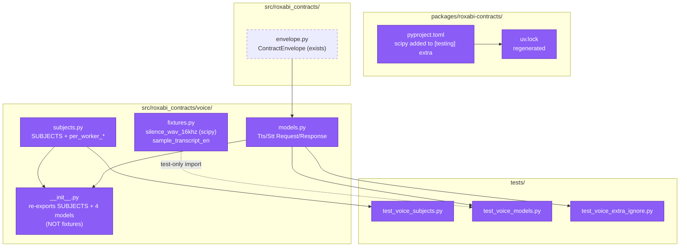
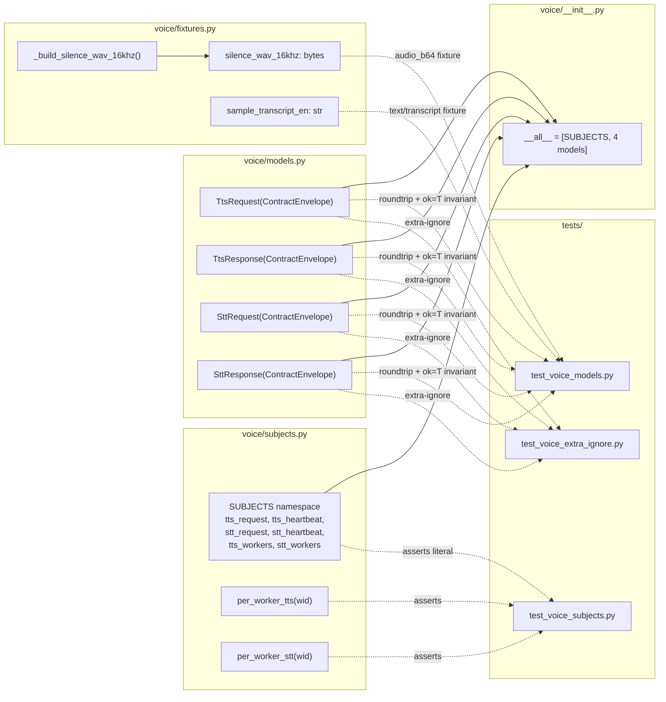

## Summary

Ship `roxabi_contracts.voice` submodule (subjects + four ContractEnvelope subclasses + synthesized fixtures + three test files) under a single PR with three logical commits (V1 subjects → V2 models+fixtures+tests → V3 README+smoke). TDD: tests written RED first per slice, implementation GREEN after, RED-GATE sentinels enforce slice-wise completion before the next slice starts.

## Architecture

### Data Flow



### File × Function Map



## Agents

| Agent | Task count | Files |
|-------|-----------|-------|
| tester | 6 (incl. 3 RED-GATE sentinels) | `tests/test_voice_subjects.py`, `tests/test_voice_models.py`, `tests/test_voice_extra_ignore.py` |
| backend-dev | 4 | `src/roxabi_contracts/voice/subjects.py`, `src/roxabi_contracts/voice/fixtures.py`, `src/roxabi_contracts/voice/models.py`, `src/roxabi_contracts/voice/__init__.py` |
| devops | 1 | `packages/roxabi-contracts/pyproject.toml`, `uv.lock` |
| doc-writer | 1 | `packages/roxabi-contracts/README.md` |

Intra-domain parallelism: V2 has 2 independent RED tasks (T4, T5) and 2 independent GREEN tasks (T6 devops, T7 backend-dev fixtures). No same-type agents spawned in parallel (F-lite; surface too small).

## Consistency Report

- Criteria covered: 27/27
- Uncovered criteria: none
- Tasks without spec backing: none
- Gold plating exemptions applied: 0

Mapping matrix (spec §Success Criteria group → covering task):

| Spec group | Tasks |
|---|---|
| Subjects (F2, F7) | T1 (RED), T2 (GREEN), T3 (RED-GATE) |
| Models (F3, F5, F6) | T4, T5 (RED), T8, T9 (GREEN), T10 (RED-GATE) |
| Fixtures (F4, F8) | T6 (pyproject + lock), T7 (fixtures.py), T10 (gate) |
| Package surface (F1) | T9 (__init__.py), T12 (subprocess smoke) |
| Drift reconciliation | T8 (field set), T4 (invariant tests), PR body (T14 below) |
| Integration smoke tests | T12 |
| Tooling gates | T10 (pytest + pyright + ruff), T13 (final sign-off) |

## Micro-Tasks

### Slice V1: Subjects namespace

#### Task T1: Write failing test for SUBJECTS namespace [P] → tester
- **File:** `packages/roxabi-contracts/tests/test_voice_subjects.py`
- **Snippet:**
  ```python
  from roxabi_contracts.voice import SUBJECTS
  from roxabi_contracts.voice.subjects import per_worker_tts, per_worker_stt

  def test_tts_request_subject() -> None:
      assert SUBJECTS.tts_request == "lyra.voice.tts.request"

  def test_tts_heartbeat_subject() -> None:
      assert SUBJECTS.tts_heartbeat == "lyra.voice.tts.heartbeat"

  def test_stt_request_subject() -> None:
      assert SUBJECTS.stt_request == "lyra.voice.stt.request"

  def test_stt_heartbeat_subject() -> None:
      assert SUBJECTS.stt_heartbeat == "lyra.voice.stt.heartbeat"

  def test_queue_group_constants() -> None:
      assert SUBJECTS.tts_workers == "tts_workers"
      assert SUBJECTS.stt_workers == "stt_workers"

  def test_per_worker_helpers() -> None:
      assert per_worker_tts("w1") == "lyra.voice.tts.request.w1"
      assert per_worker_stt("w2") == "lyra.voice.stt.request.w2"

  def test_voice_init_does_not_expose_fixtures() -> None:
      import roxabi_contracts.voice as voice_mod
      assert "fixtures" not in vars(voice_mod)
  ```
- **Verify:** `cd packages/roxabi-contracts && uv run pytest tests/test_voice_subjects.py` (deferred — expected fail ImportError at RED)
- **Expected (RED):** ModuleNotFoundError or ImportError on `roxabi_contracts.voice`
- **Time:** 5 min
- **Difficulty:** 1
- **Traces:** SC(Subjects)-1, SC(Subjects)-2, SC(Subjects)-3, SC(Package surface)-3
- **Phase:** RED

#### Task T2: Create voice package with subjects.py + __init__.py → backend-dev
- **File:** `packages/roxabi-contracts/src/roxabi_contracts/voice/subjects.py`, `packages/roxabi-contracts/src/roxabi_contracts/voice/__init__.py`
- **Snippet:**
  ```python
  # subjects.py
  from dataclasses import dataclass

  @dataclass(frozen=True, slots=True)
  class _Subjects:
      tts_request: str = "lyra.voice.tts.request"
      tts_heartbeat: str = "lyra.voice.tts.heartbeat"
      stt_request: str = "lyra.voice.stt.request"
      stt_heartbeat: str = "lyra.voice.stt.heartbeat"
      tts_workers: str = "tts_workers"
      stt_workers: str = "stt_workers"

  SUBJECTS = _Subjects()

  def per_worker_tts(worker_id: str) -> str:
      return f"{SUBJECTS.tts_request}.{worker_id}"

  def per_worker_stt(worker_id: str) -> str:
      return f"{SUBJECTS.stt_request}.{worker_id}"
  ```
  ```python
  # __init__.py (Slice V1 minimal form — extended in T9)
  from roxabi_contracts.voice.subjects import SUBJECTS

  __all__ = ["SUBJECTS"]
  ```
- **Verify:** `cd packages/roxabi-contracts && uv run pytest tests/test_voice_subjects.py` (ready)
- **Expected (GREEN):** 7 tests pass
- **Time:** 7 min
- **Difficulty:** 2
- **Traces:** SC(Subjects)-1, SC(Subjects)-2, SC(Package surface)-2
- **Phase:** GREEN
- **Depends on:** T1

#### Task T3: RED-GATE V1 → tester
- **Verify:** T1, T2 complete; `uv run pytest tests/test_voice_subjects.py` green; `uv run pyright packages/roxabi-contracts/src/roxabi_contracts/voice/subjects.py` clean
- **Expected:** exit 0 on all three commands
- **Time:** 2 min
- **Difficulty:** 1
- **Traces:** SC(Subjects)-all
- **Phase:** RED-GATE
- **Depends on:** T2

### Slice V2: Models + Fixtures + Tests

#### Task T4: Write failing roundtrip + invariant tests [P] → tester
- **File:** `packages/roxabi-contracts/tests/test_voice_models.py`
- **Snippet:**
  ```python
  import pytest
  from datetime import datetime, timezone
  from roxabi_contracts.voice import (
      TtsRequest, TtsResponse, SttRequest, SttResponse,
  )
  from roxabi_contracts.voice.fixtures import silence_wav_16khz, sample_transcript_en
  import base64

  ENVELOPE = dict(
      contract_version="1",
      trace_id="tst-trace",
      issued_at=datetime(2026, 4, 17, tzinfo=timezone.utc),
  )

  def _b64(b: bytes) -> str:
      return base64.b64encode(b).decode("ascii")

  @pytest.mark.parametrize("model,valid", [
      (TtsRequest, {**ENVELOPE, "request_id": "r1", "text": sample_transcript_en}),
      (TtsResponse, {**ENVELOPE, "ok": True, "request_id": "r1",
                     "audio_b64": _b64(silence_wav_16khz),
                     "mime_type": "audio/wav", "duration_ms": 1000}),
      (SttRequest, {**ENVELOPE, "request_id": "r2",
                    "audio_b64": _b64(silence_wav_16khz),
                    "model": "large-v3-turbo"}),
      (SttResponse, {**ENVELOPE, "ok": True, "request_id": "r2",
                     "text": sample_transcript_en, "language": "en",
                     "duration_seconds": 1.0}),
  ])
  def test_roundtrip(model, valid) -> None:
      inst = model.model_validate(valid)
      parsed = model.model_validate_json(inst.model_dump_json())
      assert parsed == inst

  def test_tts_response_success_invariant() -> None:
      """When ok=True, audio_b64 AND mime_type AND duration_ms must be non-null."""
      resp = TtsResponse(**ENVELOPE, ok=True, request_id="r1",
                         audio_b64=_b64(silence_wav_16khz),
                         mime_type="audio/wav", duration_ms=1000)
      assert resp.audio_b64 is not None
      assert resp.mime_type is not None
      assert resp.duration_ms is not None

  def test_stt_response_success_invariant() -> None:
      """When ok=True, text AND language AND duration_seconds must be non-null."""
      resp = SttResponse(**ENVELOPE, ok=True, request_id="r2",
                         text="hello", language="en", duration_seconds=1.0)
      assert resp.text is not None
      assert resp.language is not None
      assert resp.duration_seconds is not None
  ```
- **Verify:** `cd packages/roxabi-contracts && uv run pytest tests/test_voice_models.py` (deferred — expected fail)
- **Expected (RED):** ImportError on `voice.models` or `voice.fixtures`
- **Time:** 10 min
- **Difficulty:** 2
- **Traces:** SC(Models)-6, SC(Models)-7, SC(Models)-8
- **Phase:** RED
- **Depends on:** T3 (V1 green)

#### Task T5: Write failing extra-ignore tests [P] → tester
- **File:** `packages/roxabi-contracts/tests/test_voice_extra_ignore.py`
- **Snippet:**
  ```python
  import pytest
  from datetime import datetime, timezone
  from roxabi_contracts.voice import (
      TtsRequest, TtsResponse, SttRequest, SttResponse,
  )

  ENVELOPE = dict(
      contract_version="1",
      trace_id="tst-trace",
      issued_at=datetime(2026, 4, 17, tzinfo=timezone.utc).isoformat(),
  )

  @pytest.mark.parametrize("model,required", [
      (TtsRequest, {"request_id": "r1", "text": "hello"}),
      (TtsResponse, {"ok": False, "request_id": "r1", "error": "engine_unavailable"}),
      (SttRequest, {"request_id": "r2", "audio_b64": "AAAA", "model": "m"}),
      (SttResponse, {"ok": False, "request_id": "r2", "error": "audio_decode_failed"}),
  ])
  def test_extra_field_dropped_dict_path(model, required) -> None:
      inst = model.model_validate({**ENVELOPE, **required, "surprise_field": "x", "nested": {"a": 1}})
      dumped = inst.model_dump()
      assert "surprise_field" not in dumped
      assert "nested" not in dumped

  @pytest.mark.parametrize("model,required", [
      (TtsRequest, {"request_id": "r1", "text": "hello"}),
      (TtsResponse, {"ok": False, "request_id": "r1", "error": "x"}),
      (SttRequest, {"request_id": "r2", "audio_b64": "AAAA", "model": "m"}),
      (SttResponse, {"ok": False, "request_id": "r2", "error": "x"}),
  ])
  def test_extra_field_dropped_json_path(model, required) -> None:
      import json
      payload = json.dumps({**ENVELOPE, **required, "future_v2_field": 42})
      inst = model.model_validate_json(payload)
      assert "future_v2_field" not in inst.model_dump()
  ```
- **Verify:** `cd packages/roxabi-contracts && uv run pytest tests/test_voice_extra_ignore.py` (deferred — expected fail)
- **Expected (RED):** ImportError on `voice.models`
- **Time:** 7 min
- **Difficulty:** 2
- **Traces:** SC(Models)-7
- **Phase:** RED
- **Depends on:** T3

#### Task T6: Add scipy to [testing] extra, regen uv.lock [P] → devops
- **File:** `packages/roxabi-contracts/pyproject.toml`, `uv.lock` (regen)
- **Snippet:**
  ```toml
  [project.optional-dependencies]
  testing = ["nats-py>=2.6", "roxabi-nats", "scipy>=1.11"]
  ```
- **Verify:** `uv sync --extra testing && uv run python -c "import scipy.io.wavfile"` (ready)
- **Expected:** no resolver error; scipy imports cleanly; `uv.lock` has `scipy` entry under the `roxabi-contracts` package testing deps
- **Time:** 4 min (depending on network for resolver)
- **Difficulty:** 2
- **Traces:** SC(Fixtures)-3
- **Phase:** GREEN
- **Depends on:** T3

#### Task T7: Create voice/fixtures.py [P] → backend-dev
- **File:** `packages/roxabi-contracts/src/roxabi_contracts/voice/fixtures.py`
- **Snippet:**
  ```python
  """Test fixtures for voice contracts. Pure data, no NATS imports."""

  import io
  import numpy as np
  from scipy.io.wavfile import write as _wav_write


  def _build_silence_wav_16khz() -> bytes:
      """Synthesize 1 s of 16 kHz mono int16 silence as a WAV bytes buffer."""
      sample_rate = 16_000
      samples = np.zeros(sample_rate, dtype=np.int16)
      buf = io.BytesIO()
      _wav_write(buf, sample_rate, samples)
      return buf.getvalue()


  silence_wav_16khz: bytes = _build_silence_wav_16khz()

  sample_transcript_en: str = "Hello, this is a roxabi-contracts test fixture."
  ```
- **Verify:** `cd packages/roxabi-contracts && uv run python -c "from roxabi_contracts.voice.fixtures import silence_wav_16khz, sample_transcript_en; assert silence_wav_16khz[:4] == b'RIFF' and len(sample_transcript_en) > 0"` (ready)
- **Expected:** exits 0
- **Time:** 5 min
- **Difficulty:** 2
- **Traces:** SC(Fixtures)-1, SC(Fixtures)-2
- **Phase:** GREEN
- **Depends on:** T6

#### Task T8: Create voice/models.py → backend-dev
- **File:** `packages/roxabi-contracts/src/roxabi_contracts/voice/models.py`
- **Snippet:**
  ```python
  """Voice-domain NATS contract models. Pure Pydantic; no transport imports."""

  from typing import Annotated

  from pydantic import StringConstraints

  from roxabi_contracts.envelope import ContractEnvelope


  class TtsRequest(ContractEnvelope):
      request_id: str
      text: Annotated[str, StringConstraints(min_length=1)]
      language: str | None = None
      voice: str | None = None
      fallback_language: str | None = None
      default_language: str | None = None
      languages: list[str] | None = None
      chunked: bool = True
      engine: str | None = None
      accent: str | None = None
      personality: str | None = None
      speed: float | None = None
      emotion: str | None = None
      exaggeration: float | None = None
      cfg_weight: float | None = None
      segment_gap: float | None = None
      crossfade: float | None = None
      chunk_size: int | None = None


  class TtsResponse(ContractEnvelope):
      ok: bool
      request_id: str
      error: str | None = None
      audio_b64: str | None = None
      mime_type: str | None = None   # see spec drift item #1
      duration_ms: int | None = None
      waveform_b64: str | None = None


  class SttRequest(ContractEnvelope):
      request_id: str
      audio_b64: Annotated[str, StringConstraints(min_length=1)]
      model: str
      mime_type: str | None = None
      language: str | None = None
      language_detection_threshold: float | None = None
      language_detection_segments: int | None = None
      language_fallback: str | None = None


  class SttResponse(ContractEnvelope):
      ok: bool
      request_id: str
      error: str | None = None
      text: str | None = None
      language: str | None = None       # see spec drift item #3
      duration_seconds: float | None = None  # see spec drift item #4
  ```
- **Verify:** `cd packages/roxabi-contracts && uv run pyright src/roxabi_contracts/voice/models.py` (ready)
- **Expected:** 0 errors, 0 warnings
- **Time:** 10 min
- **Difficulty:** 3
- **Traces:** SC(Models)-1 through SC(Models)-5
- **Phase:** GREEN
- **Depends on:** T4, T5

#### Task T9: Extend voice/__init__.py to re-export models → backend-dev
- **File:** `packages/roxabi-contracts/src/roxabi_contracts/voice/__init__.py`
- **Snippet:**
  ```python
  from roxabi_contracts.voice.models import (
      SttRequest,
      SttResponse,
      TtsRequest,
      TtsResponse,
  )
  from roxabi_contracts.voice.subjects import SUBJECTS

  __all__ = [
      "SUBJECTS",
      "SttRequest",
      "SttResponse",
      "TtsRequest",
      "TtsResponse",
  ]
  ```
  Note: `fixtures` is DELIBERATELY NOT re-exported — test-only path.
- **Verify:** `cd packages/roxabi-contracts && uv run python -c "from roxabi_contracts.voice import SUBJECTS, TtsRequest, TtsResponse, SttRequest, SttResponse; assert 'fixtures' not in vars(__import__('roxabi_contracts.voice', fromlist=['']))"` (ready)
- **Expected:** exits 0
- **Time:** 3 min
- **Difficulty:** 1
- **Traces:** SC(Package surface)-1, SC(Package surface)-3
- **Phase:** GREEN
- **Depends on:** T8

#### Task T10: RED-GATE V2 — full test suite + lint/typecheck → tester
- **Verify:**
  1. `cd packages/roxabi-contracts && uv run pytest` → all test files green (envelope + voice_subjects + voice_models + voice_extra_ignore)
  2. `uv run pyright packages/roxabi-contracts/src` → 0 errors
  3. `uv run ruff check packages/roxabi-contracts/` → 0 findings
  4. No `nats.*`/`roxabi_nats.*` imports in `voice/` sources: `rg '^(from|import) (nats|roxabi_nats)' packages/roxabi-contracts/src/roxabi_contracts/voice/` returns empty
- **Expected:** all four commands exit 0
- **Time:** 3 min
- **Difficulty:** 1
- **Traces:** SC(Tooling gates)-all, SC(Package surface)-2
- **Phase:** RED-GATE
- **Depends on:** T7, T8, T9

### Slice V3: README + integration smoke

#### Task T11: Update README.md with voice submodule section [P] → doc-writer
- **File:** `packages/roxabi-contracts/README.md`
- **Snippet:** add a `## Voice domain` section after the package overview; document: `SUBJECTS` constants, four models with one-line purpose each, no-transport-import invariant, fixtures being test-only. Keep under 40 lines added.
- **Verify:** `test -s packages/roxabi-contracts/README.md && grep -q 'Voice domain' packages/roxabi-contracts/README.md` (ready)
- **Expected:** README grew; section heading present
- **Time:** 8 min
- **Difficulty:** 1
- **Traces:** (documentation for public surface — not a spec-enumerated SC, but referenced in F9)
- **Phase:** REFACTOR
- **Depends on:** T10

#### Task T12: Integration smoke tests [P] → tester
- **File:** no new file — commands run via `uv run python -c`
- **Snippet:**
  ```bash
  # Smoke 1: subprocess import + namespace attribute access
  uv run python -c "from roxabi_contracts.voice import SUBJECTS, TtsRequest, TtsResponse, SttRequest, SttResponse; print(SUBJECTS.tts_request)"
  # Smoke 2: fixture produces real WAV bytes
  uv run python -c "from roxabi_contracts.voice.fixtures import silence_wav_16khz; assert len(silence_wav_16khz) > 44 and silence_wav_16khz[:4] == b'RIFF'; print('OK')"
  # Smoke 3: no NATS pulled transitively
  uv run python -c "import roxabi_contracts.voice; import sys; bad = [m for m in sys.modules if m.startswith('nats') or m.startswith('roxabi_nats')]; assert not bad, bad; print('OK')"
  ```
- **Verify:** run all three; each must print its expected line and exit 0
- **Expected:** `lyra.voice.tts.request`, `OK`, `OK`
- **Time:** 3 min
- **Difficulty:** 1
- **Traces:** SC(Integration smoke tests)-1, SC(Integration smoke tests)-2, SC(Package surface)-2
- **Phase:** REFACTOR
- **Depends on:** T10

#### Task T13: RED-GATE V3 — consolidated sign-off → tester
- **Verify:** walk `## Success Criteria` in `artifacts/specs/763-port-voice-domain-spec.mdx` end-to-end; confirm each checkbox is satisfied by a passing command or a present artifact. Report any unchecked.
- **Expected:** 27/27 criteria satisfied
- **Time:** 5 min
- **Difficulty:** 1
- **Traces:** (meta-gate)
- **Phase:** RED-GATE
- **Depends on:** T11, T12

### Process task: PR description body (handled by /pr; listed here for consistency)

#### Task T14: Author PR description with six-item drift table → backend-dev (deferred to /pr)
- **Content:** bullet list of drift items 1–6 from spec `## Expected Behavior > Known drift`, with file+line references, resolution, and the migration obligation for #766 + voiceCLI#69.
- **Verify:** `gh pr view {N} --json body` contains every drift-item resolution
- **Expected:** PR body rendered correctly on GitHub
- **Time:** 5 min
- **Difficulty:** 1
- **Traces:** SC(Drift reconciliation)-1, SC(Drift reconciliation)-2, SC(Drift reconciliation)-3
- **Phase:** REFACTOR
- **Depends on:** T13 (satisfy before opening PR)

## Task IDs

<!-- Generated by /plan. Filled in Step 6b after TaskCreate. Used by /implement to resume tasks on session restart. -->

- T1: 11 — Write failing test for SUBJECTS namespace
- T2: 12 — Create voice package with subjects.py + __init__.py
- T3: 13 — RED-GATE V1
- T4: 14 — Write failing roundtrip + invariant tests
- T5: 15 — Write failing extra-ignore tests
- T6: 16 — Add scipy to [testing] extra, regen uv.lock
- T7: 17 — Create voice/fixtures.py
- T8: 18 — Create voice/models.py
- T9: 19 — Extend voice/__init__.py to re-export models
- T10: 20 — RED-GATE V2
- T11: 21 — Update README.md with voice submodule section
- T12: 22 — Integration smoke tests
- T13: 23 — RED-GATE V3 — 27/27 spec criteria sign-off
- T14: deferred to /pr — Author PR description with six-item drift table
