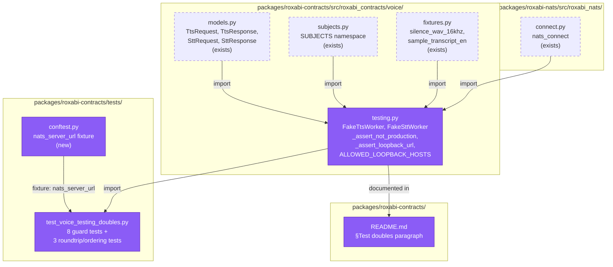
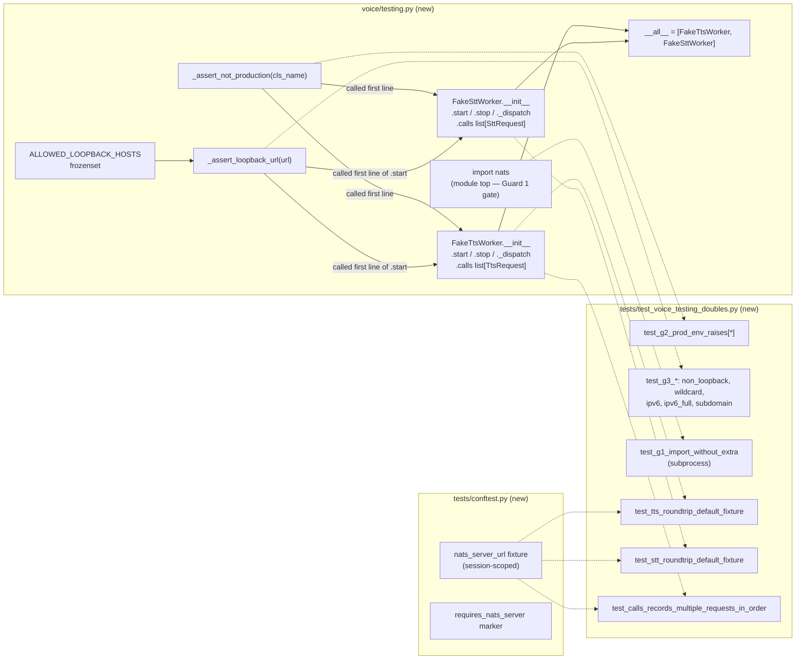

## Summary

Ship `roxabi_contracts.voice.testing` (FakeTtsWorker + FakeSttWorker + 2 module-private guard helpers) behind the existing `[testing]` extra in a single PR with three logical commits (V1 helpers+guard-tests RED/GREEN → V2 classes+roundtrip → V3 Guard 1 subprocess test+README). TDD: failing tests land per slice; RED-GATE sentinels enforce slice completion before the next begins.

## Architecture

### Data Flow



### File × Function Map



## Bootstrap Context

Read before starting (spec cross-refs):
- Spec: `artifacts/specs/764-voice-test-doubles-spec.mdx`
- ADR-049 §Test-double pattern: `docs/architecture/adr/049-roxabi-contracts-shared-schema-package.mdx` lines 148–170
- Existing voice models to import: `packages/roxabi-contracts/src/roxabi_contracts/voice/models.py`
- Existing fixtures: `packages/roxabi-contracts/src/roxabi_contracts/voice/fixtures.py`
- Existing subjects namespace: `packages/roxabi-contracts/src/roxabi_contracts/voice/subjects.py`
- Reference NATS fixture (to copy into contracts conftest): `packages/roxabi-nats/tests/conftest.py` lines 71–106 (`_free_port`, `nats_server_url`, `requires_nats_server`)
- Reference test style for parametrized envelope construction: `packages/roxabi-contracts/tests/test_voice_models.py`
- Pattern for `model_validate_json` in `_dispatch`: `packages/roxabi-nats/src/roxabi_nats/adapter_base.py` lines 129–156
- `[testing]` extra declaration (already present, no edit required): `packages/roxabi-contracts/pyproject.toml` line 16

## Agents

| Agent | Task count | Files |
|-------|-----------|-------|
| backend-dev | 3 | `packages/roxabi-contracts/src/roxabi_contracts/voice/testing.py` (V1 helpers, V2 classes, V3 import invariant confirmation) |
| tester | 7 (incl. 3 RED-GATE sentinels) | `packages/roxabi-contracts/tests/conftest.py`, `packages/roxabi-contracts/tests/test_voice_testing_doubles.py` |
| doc-writer | 1 | `packages/roxabi-contracts/README.md` |

No intra-domain parallelism (F-lite, surface too small; backend-dev and tester interleave serially with RED-GATE sentinels).

## Consistency Report

- Criteria covered: 34/34
- Uncovered criteria: none
- Tasks without spec backing: none
- Gold plating exemptions applied: 0

Mapping matrix (spec §Success Criteria group → covering task):

| Spec group | Tasks |
|---|---|
| Guard 1 — `[testing]` extra at import time | T1 (module-top `import nats`, implicit in T3), T8 (RED), T9 (GREEN), T10 (RED-GATE) |
| Guard 2 — `LYRA_ENV=production` in `__init__` | T1 (RED), T2 (GREEN), T3 (RED-GATE) |
| Guard 3 — loopback-only URL in `start()` | T1 (RED), T2 (GREEN), T3 (RED-GATE) |
| API surface — matches ADR-049 | T4 (RED: instantiation + attribute types), T5 (GREEN classes), T7 (RED-GATE) |
| Runtime behavior — dispatch, idempotent stop, invariants | T4 (RED), T5 (GREEN), T6 (conftest NATS fixture), T7 (RED-GATE) |
| Integration tests — roundtrip + ordering | T4 (RED), T5 (GREEN), T6 (fixture), T7 (RED-GATE) |
| Tooling gates | T11 (pytest + pyright + ruff full-package run) |
| Documentation | T12 (README §Test doubles paragraph) |

## Micro-Tasks

### Slice V1: Guard helpers + `testing.py` skeleton

#### Task T1: Write failing tests for Guard 2 + Guard 3 [P] → tester
- **File:** `packages/roxabi-contracts/tests/test_voice_testing_doubles.py`
- **Snippet:**
  ```python
  """Three-guard tests for roxabi_contracts.voice.testing. See spec #764."""
  from __future__ import annotations

  import os
  import pytest

  # Imports are here (not inside fixtures) to prove the module loads in the
  # test env — Guard 1 (import-time) is exercised in a separate subprocess
  # test in Slice V3.
  from roxabi_contracts.voice.testing import FakeSttWorker, FakeTtsWorker


  @pytest.fixture(autouse=True)
  def _clear_lyra_env(monkeypatch: pytest.MonkeyPatch) -> None:
      monkeypatch.delenv("LYRA_ENV", raising=False)


  @pytest.mark.parametrize("cls", [FakeTtsWorker, FakeSttWorker])
  def test_g2_prod_env_raises(cls, monkeypatch: pytest.MonkeyPatch) -> None:
      monkeypatch.setenv("LYRA_ENV", "production")
      with pytest.raises(RuntimeError, match=f"{cls.__name__} cannot run in production"):
          cls()


  @pytest.mark.parametrize("cls", [FakeTtsWorker, FakeSttWorker])
  def test_g2_prod_env_raises_even_when_g3_would_pass(
      cls, monkeypatch: pytest.MonkeyPatch
  ) -> None:
      monkeypatch.setenv("LYRA_ENV", "production")
      with pytest.raises(RuntimeError):
          cls(nats_url="nats://127.0.0.1:4222")


  @pytest.mark.parametrize("cls", [FakeTtsWorker, FakeSttWorker])
  @pytest.mark.parametrize(
      "bad_url",
      [
          "nats://10.0.0.5:4222",
          "nats://0.0.0.0:4222",
          "nats://localhost.evil.com:4222",
          "nats://example.com:4222",
      ],
  )
  async def test_g3_non_loopback_raises(cls, bad_url: str) -> None:
      w = cls(nats_url=bad_url)
      with pytest.raises(ValueError, match="loopback"):
          await w.start()


  @pytest.mark.parametrize("cls", [FakeTtsWorker, FakeSttWorker])
  @pytest.mark.parametrize(
      "ok_url",
      ["nats://127.0.0.1:4222", "nats://[::1]:4222", "nats://[0:0:0:0:0:0:0:1]:4222"],
  )
  async def test_g3_accepts_loopback_but_refuses_connect_without_server(
      cls, ok_url: str
  ) -> None:
      # No nats-server running on these ports in this unit test — assert the
      # guard does NOT raise ValueError, but some other error (connection
      # refused / timeout) occurs downstream. We only care that Guard 3 passed.
      w = cls(nats_url=ok_url)
      with pytest.raises(Exception) as exc_info:
          await w.start()
      assert not isinstance(exc_info.value, ValueError) or "loopback" not in str(
          exc_info.value
      )
  ```
- **Verify:** `cd packages/roxabi-contracts && uv run pytest tests/test_voice_testing_doubles.py -k "g2 or g3" -x`
- **Expected (RED):** `ModuleNotFoundError: No module named 'roxabi_contracts.voice.testing'` (testing.py does not exist yet)
- **Time:** 6 min
- **Difficulty:** 2
- **Agent:** tester
- **Spec trace:** SC §Guard 2, §Guard 3
- **Slice:** V1
- **Phase:** RED

#### Task T2: Implement Guard 2 + Guard 3 helpers in `testing.py` → backend-dev
- **File:** `packages/roxabi-contracts/src/roxabi_contracts/voice/testing.py` (new)
- **Snippet:**
  ```python
  """FakeTtsWorker + FakeSttWorker — test doubles for roxabi_contracts.voice.

  Three non-bypassable guards prevent production contamination. See spec #764
  and ADR-049 §Test-double pattern.

  Guard 1 (import-time): nats-py is imported at module top; installing
      roxabi-contracts WITHOUT the [testing] extra fails with
      ModuleNotFoundError at import.
  Guard 2 (env): __init__ raises RuntimeError when LYRA_ENV == "production".
  Guard 3 (loopback): start() raises ValueError on non-loopback NATS URL.
  """

  from __future__ import annotations

  import logging
  import os
  from urllib.parse import urlparse

  # Guard 1: fails at import with ModuleNotFoundError when [testing] extra
  # is not installed. Do NOT wrap in try/except — that would defeat Guard 1.
  import nats  # noqa: F401

  __all__ = []  # populated at the end of Slice V2

  log = logging.getLogger(__name__)

  ALLOWED_LOOPBACK_HOSTS: frozenset[str] = frozenset(
      {"127.0.0.1", "localhost", "::1", "0:0:0:0:0:0:0:1"}
  )


  def _assert_not_production(cls_name: str) -> None:
      """Guard 2 — raises RuntimeError when LYRA_ENV=production."""
      if os.environ.get("LYRA_ENV") == "production":
          raise RuntimeError(f"{cls_name} cannot run in production")


  def _assert_loopback_url(url: str) -> None:
      """Guard 3 — raises ValueError when the URL hostname is not loopback."""
      host = urlparse(url).hostname
      if host not in ALLOWED_LOOPBACK_HOSTS:
          raise ValueError(
              f"loopback NATS URL required — refusing host {host!r}; "
              f"allowed: {sorted(ALLOWED_LOOPBACK_HOSTS)}"
          )
  ```
- **Also in this task:** stub `FakeTtsWorker` / `FakeSttWorker` skeleton so the T1 tests can import. Bodies are minimal:
  ```python
  class FakeTtsWorker:
      def __init__(
          self,
          nats_url: str = "nats://127.0.0.1:4222",
          reply_fixture: bytes | None = None,
      ) -> None:
          _assert_not_production("FakeTtsWorker")
          self._nats_url = nats_url
          # reply_fixture default resolution deferred to V2
          self._reply_fixture = reply_fixture
          self._nc = None
          self._sub = None
          self.calls: list = []  # type refined in V2

      async def start(self) -> None:
          _assert_loopback_url(self._nats_url)
          raise NotImplementedError  # V2

      async def stop(self) -> None:
          raise NotImplementedError  # V2


  class FakeSttWorker:  # symmetric to FakeTtsWorker
      def __init__(
          self,
          nats_url: str = "nats://127.0.0.1:4222",
          reply_fixture: str | None = None,
      ) -> None:
          _assert_not_production("FakeSttWorker")
          self._nats_url = nats_url
          self._reply_fixture = reply_fixture
          self._nc = None
          self._sub = None
          self.calls: list = []

      async def start(self) -> None:
          _assert_loopback_url(self._nats_url)
          raise NotImplementedError

      async def stop(self) -> None:
          raise NotImplementedError
  ```
- **Verify:** `cd packages/roxabi-contracts && uv run pytest tests/test_voice_testing_doubles.py -k "g2 or g3" -x`
- **Expected (GREEN):** All G2 tests pass; G3 tests pass (loopback path reaches `start()` which is `NotImplementedError` but the guard assertion fired first)
- **Time:** 8 min
- **Difficulty:** 2
- **Agent:** backend-dev
- **Spec trace:** SC §Guard 2, §Guard 3
- **Slice:** V1
- **Phase:** GREEN

#### Task T3: RED-GATE V1 — verify guard tests pass → tester
- **File:** (no file change)
- **Verify:**
  ```bash
  cd packages/roxabi-contracts && uv run pytest tests/test_voice_testing_doubles.py -k "g2 or g3" -v
  uv run pyright packages/roxabi-contracts/src/roxabi_contracts/voice/testing.py
  ```
- **Expected:** All parametrized G2 + G3 tests pass; pyright has 0 errors on `testing.py`. Proceed to V2 only if green.
- **Time:** 2 min
- **Difficulty:** 1
- **Agent:** tester
- **Spec trace:** SC §Guard 2, §Guard 3 (gate)
- **Slice:** V1
- **Phase:** RED-GATE

### Slice V2: FakeTtsWorker + FakeSttWorker bodies + roundtrip tests

#### Task T4: Write failing roundtrip + ordering tests [P] → tester
- **File:** `packages/roxabi-contracts/tests/test_voice_testing_doubles.py` (extend)
- **Snippet:**
  ```python
  import base64
  from datetime import datetime, timezone
  import nats as _nats

  from roxabi_contracts.voice import SttRequest, SttResponse, TtsRequest, TtsResponse
  from roxabi_contracts.voice.fixtures import sample_transcript_en, silence_wav_16khz
  from roxabi_contracts.voice.subjects import SUBJECTS

  from .conftest import requires_nats_server


  _ENVELOPE = {
      "contract_version": "1",
      "trace_id": "test-trace",
      "issued_at": datetime(2026, 4, 18, tzinfo=timezone.utc),
  }


  @requires_nats_server
  async def test_tts_roundtrip_default_fixture(nats_server_url: str) -> None:
      worker = FakeTtsWorker(nats_url=nats_server_url)
      await worker.start()
      try:
          nc = await _nats.connect(nats_server_url)
          req = TtsRequest(**_ENVELOPE, request_id="r1", text="hello")
          msg = await nc.request(
              SUBJECTS.tts_request, req.model_dump_json().encode(), timeout=2.0
          )
          reply = TtsResponse.model_validate_json(msg.data)
          assert reply.ok is True
          assert reply.request_id == "r1"
          assert reply.mime_type == "audio/wav"
          assert base64.b64decode(reply.audio_b64) == silence_wav_16khz
          assert len(worker.calls) == 1
          assert worker.calls[0].text == "hello"
          await nc.close()
      finally:
          await worker.stop()


  @requires_nats_server
  async def test_stt_roundtrip_default_fixture(nats_server_url: str) -> None:
      worker = FakeSttWorker(nats_url=nats_server_url)
      await worker.start()
      try:
          nc = await _nats.connect(nats_server_url)
          req = SttRequest(
              **_ENVELOPE,
              request_id="r2",
              audio_b64=base64.b64encode(silence_wav_16khz).decode("ascii"),
              model="large-v3-turbo",
          )
          msg = await nc.request(
              SUBJECTS.stt_request, req.model_dump_json().encode(), timeout=2.0
          )
          reply = SttResponse.model_validate_json(msg.data)
          assert reply.ok is True
          assert reply.request_id == "r2"
          assert reply.text == sample_transcript_en
          assert reply.language == "en"
          assert reply.duration_seconds == 1.0
          assert len(worker.calls) == 1
          await nc.close()
      finally:
          await worker.stop()


  @requires_nats_server
  async def test_calls_records_multiple_requests_in_order(
      nats_server_url: str,
  ) -> None:
      worker = FakeTtsWorker(nats_url=nats_server_url)
      await worker.start()
      try:
          nc = await _nats.connect(nats_server_url)
          for i in range(3):
              req = TtsRequest(**_ENVELOPE, request_id=f"r{i}", text=f"msg-{i}")
              await nc.request(
                  SUBJECTS.tts_request, req.model_dump_json().encode(), timeout=2.0
              )
          assert [r.request_id for r in worker.calls] == ["r0", "r1", "r2"]
          await nc.close()
      finally:
          await worker.stop()


  async def test_stop_is_idempotent() -> None:
      worker = FakeTtsWorker()
      await worker.stop()
      await worker.stop()  # second call: no exception


  async def test_start_twice_raises() -> None:
      """start() with a live _nc must raise RuntimeError."""
      # Bypass actual connection by setting _nc manually to exercise the check.
      worker = FakeTtsWorker()
      worker._nc = object()  # type: ignore[assignment]
      with pytest.raises(RuntimeError, match="already started"):
          await worker.start()
  ```
- **Verify:** `cd packages/roxabi-contracts && uv run pytest tests/test_voice_testing_doubles.py -k "roundtrip or order or idempotent or twice" -x`
- **Expected (RED):** `NotImplementedError` from `start()`/`stop()` stubs, OR `AttributeError` on `.calls` population
- **Time:** 7 min
- **Difficulty:** 3
- **Agent:** tester
- **Spec trace:** SC §API surface, §Runtime behavior, §Integration tests
- **Slice:** V2
- **Phase:** RED

#### Task T5: Implement FakeTtsWorker/FakeSttWorker bodies (`start`, `stop`, `_dispatch`) → backend-dev
- **File:** `packages/roxabi-contracts/src/roxabi_contracts/voice/testing.py` (extend)
- **Snippet:**
  ```python
  import asyncio
  import base64
  from datetime import datetime, timezone

  from nats.aio.subscription import Subscription
  from nats.aio.client import Client as NATS
  from pydantic import ValidationError

  from roxabi_contracts.voice.fixtures import sample_transcript_en, silence_wav_16khz
  from roxabi_contracts.voice.models import (
      SttRequest,
      SttResponse,
      TtsRequest,
      TtsResponse,
  )
  from roxabi_contracts.voice.subjects import SUBJECTS
  from roxabi_nats.connect import nats_connect


  _DRAIN_TIMEOUT_S = 2.0


  class FakeTtsWorker:
      def __init__(
          self,
          nats_url: str = "nats://127.0.0.1:4222",
          reply_fixture: bytes | None = None,
      ) -> None:
          _assert_not_production("FakeTtsWorker")
          self._nats_url = nats_url
          self._reply_fixture: bytes = (
              reply_fixture if reply_fixture is not None else silence_wav_16khz
          )
          self._nc: NATS | None = None
          self._sub: Subscription | None = None
          self.calls: list[TtsRequest] = []

      async def start(self) -> None:
          _assert_loopback_url(self._nats_url)
          if self._nc is not None:
              raise RuntimeError("FakeTtsWorker already started")
          self._nc = await nats_connect(self._nats_url)
          self._sub = await self._nc.subscribe(
              SUBJECTS.tts_request,
              queue=SUBJECTS.tts_workers,
              cb=self._dispatch,
          )

      async def stop(self) -> None:
          if self._sub is not None:
              await self._sub.unsubscribe()
              self._sub = None
          if self._nc is not None and self._nc.is_connected:
              try:
                  await asyncio.wait_for(self._nc.drain(), timeout=_DRAIN_TIMEOUT_S)
              except asyncio.TimeoutError:
                  log.warning("FakeTtsWorker drain timed out after %.1fs", _DRAIN_TIMEOUT_S)
          self._nc = None

      async def _dispatch(self, msg) -> None:
          try:
              req = TtsRequest.model_validate_json(msg.data)
          except ValidationError as exc:
              log.warning("FakeTtsWorker dropped malformed request: %s", exc)
              return
          self.calls.append(req)
          if not msg.reply or self._nc is None:
              return
          reply = TtsResponse(
              contract_version=req.contract_version,
              trace_id=req.trace_id,
              issued_at=datetime.now(timezone.utc),
              ok=True,
              request_id=req.request_id,
              audio_b64=base64.b64encode(self._reply_fixture).decode("ascii"),
              mime_type="audio/wav",
              duration_ms=1000,
          )
          await self._nc.publish(msg.reply, reply.model_dump_json().encode())
  ```
  (Symmetric `FakeSttWorker` body: `reply_fixture: str`, default `sample_transcript_en`; in `_dispatch` builds `SttResponse(text=self._reply_fixture, language="en", duration_seconds=1.0, request_id=req.request_id)`; subscribes to `SUBJECTS.stt_request` queue `SUBJECTS.stt_workers`.)
- **Also in this task:** update `__all__ = ["FakeTtsWorker", "FakeSttWorker"]`.
- **Verify:** `cd packages/roxabi-contracts && uv run pytest tests/test_voice_testing_doubles.py -k "roundtrip or order or idempotent or twice" -x`
- **Expected (GREEN):** all 5 tests pass (roundtrip × 2, ordering × 1, idempotent stop, double start)
- **Time:** 12 min
- **Difficulty:** 3
- **Agent:** backend-dev
- **Spec trace:** SC §API surface, §Runtime behavior, §Integration tests
- **Slice:** V2
- **Phase:** GREEN

#### Task T6: Add `conftest.py` with `nats_server_url` fixture (port from roxabi-nats) → tester
- **File:** `packages/roxabi-contracts/tests/conftest.py` (new)
- **Snippet:**
  ```python
  """Pytest fixtures for roxabi-contracts tests.

  Ports the `nats_server_url` session-scoped fixture from
  `packages/roxabi-nats/tests/conftest.py` so integration tests for
  `voice.testing` can subscribe/publish against a real loopback NATS
  without cross-package dependency.
  """

  from __future__ import annotations

  import shutil
  import socket
  import subprocess
  import time
  from collections.abc import Generator

  import pytest


  _nats_server_available = shutil.which("nats-server") is not None
  requires_nats_server = pytest.mark.skipif(
      not _nats_server_available,
      reason="nats-server not found in PATH — install via 'make nats-install'",
  )


  def _free_port() -> int:
      with socket.socket(socket.AF_INET, socket.SOCK_STREAM) as s:
          s.bind(("127.0.0.1", 0))
          return s.getsockname()[1]


  @pytest.fixture(scope="session")
  def nats_server_url() -> Generator[str, None, None]:
      if not _nats_server_available:
          pytest.skip("nats-server not found in PATH")
      port = _free_port()
      url = f"nats://127.0.0.1:{port}"
      proc = subprocess.Popen(
          ["nats-server", "-p", str(port)],
          stdout=subprocess.DEVNULL,
          stderr=subprocess.DEVNULL,
      )
      deadline = time.monotonic() + 5.0
      while time.monotonic() < deadline:
          try:
              with socket.create_connection(("127.0.0.1", port), timeout=0.2):
                  break
          except OSError:
              time.sleep(0.05)
      else:
          proc.terminate()
          raise RuntimeError(f"nats-server did not start on port {port}")
      yield url
      proc.terminate()
      proc.wait()
  ```
- **Verify:** `cd packages/roxabi-contracts && uv run pytest tests/ -k "roundtrip"` — should now skip cleanly if `nats-server` is not installed, or run green if it is
- **Expected:** fixture resolves; integration tests either all PASS (if `nats-server` installed) or all SKIP (marker fires) — no errors
- **Time:** 4 min
- **Difficulty:** 1
- **Agent:** tester
- **Spec trace:** SC §Integration tests (fixture plumbing)
- **Slice:** V2
- **Phase:** GREEN

#### Task T7: RED-GATE V2 — verify classes + roundtrip green → tester
- **Verify:**
  ```bash
  cd packages/roxabi-contracts && uv run pytest tests/test_voice_testing_doubles.py -v
  uv run pyright packages/roxabi-contracts/src/roxabi_contracts/voice/testing.py packages/roxabi-contracts/tests/test_voice_testing_doubles.py
  ```
- **Expected:** all tests in the file pass or skip-with-reason (never error); pyright 0 errors on both files. Proceed to V3 only if green.
- **Time:** 2 min
- **Difficulty:** 1
- **Agent:** tester
- **Spec trace:** SC §API surface, §Runtime behavior, §Integration tests (gate)
- **Slice:** V2
- **Phase:** RED-GATE

### Slice V3: Guard 1 subprocess test + README §Test doubles

#### Task T8: Write failing Guard 1 subprocess test → tester
- **File:** `packages/roxabi-contracts/tests/test_voice_testing_doubles.py` (extend)
- **Snippet:**
  ```python
  import subprocess
  import sys
  import textwrap
  from pathlib import Path


  def test_g1_import_without_extra(tmp_path: Path) -> None:
      """Guard 1 — importing roxabi_contracts.voice.testing without nats-py
      installed fails at import (not instantiation).

      Implementation: craft a temp dir containing a sabotaging `nats.py`
      that raises ModuleNotFoundError on execution, prepend it to
      PYTHONPATH so the subprocess's `import nats` hits it before the real
      package, then assert the import of `roxabi_contracts.voice.testing`
      fails. This proves Guard 1 fires at module-top-level (line: `import nats`).
      """
      sabotage = tmp_path / "nats.py"
      sabotage.write_text(
          textwrap.dedent(
              """
              raise ModuleNotFoundError("No module named 'nats' (sabotaged)")
              """
          ).lstrip()
      )
      script = textwrap.dedent(
          """
          import sys
          try:
              import roxabi_contracts.voice.testing  # noqa: F401
          except ModuleNotFoundError as exc:
              if "nats" in str(exc):
                  sys.exit(42)
              raise
          sys.exit(0)
          """
      ).lstrip()
      result = subprocess.run(
          [sys.executable, "-c", script],
          env={"PYTHONPATH": str(tmp_path), "PATH": "/usr/bin:/bin"},
          capture_output=True,
          text=True,
          timeout=10,
      )
      assert result.returncode == 42, (
          f"expected exit 42 (ModuleNotFoundError for nats), got {result.returncode}\n"
          f"stdout: {result.stdout}\nstderr: {result.stderr}"
      )
  ```
- **Verify:** `cd packages/roxabi-contracts && uv run pytest tests/test_voice_testing_doubles.py -k g1 -v`
- **Expected (RED):** one of:
  - if `import nats` is already at module top of `testing.py` from T2: this test passes immediately — in that case, upgrade the verify to also assert that removing `import nats` from `testing.py` breaks the test (manually, or via mutation). Document in task notes.
  - if the T2 stub's `import nats` was commented-out for expedience: FAIL — test exits non-42 because `roxabi_contracts.voice.testing` imports successfully.
- **Time:** 5 min
- **Difficulty:** 3
- **Agent:** tester
- **Spec trace:** SC §Guard 1
- **Slice:** V3
- **Phase:** RED

#### Task T9: Verify `import nats` at module top of `testing.py` (Guard 1 in source) → backend-dev
- **File:** `packages/roxabi-contracts/src/roxabi_contracts/voice/testing.py` (verify — no change if T2 already did it correctly)
- **Check:**
  ```bash
  head -20 packages/roxabi-contracts/src/roxabi_contracts/voice/testing.py | grep -E '^import nats'
  ```
- **Expected:** a bare `import nats` appears in the first 20 lines with NO surrounding `try`/`except`. If wrapped in `try/except` — remove the wrapper (Guard 1 requires import-time failure).
- **Verify:** `cd packages/roxabi-contracts && uv run pytest tests/test_voice_testing_doubles.py::test_g1_import_without_extra -v`
- **Expected (GREEN):** subprocess exits 42; test passes.
- **Time:** 2 min
- **Difficulty:** 1
- **Agent:** backend-dev
- **Spec trace:** SC §Guard 1
- **Slice:** V3
- **Phase:** GREEN

#### Task T10: RED-GATE V3 — full test file green → tester
- **Verify:**
  ```bash
  cd packages/roxabi-contracts && uv run pytest tests/test_voice_testing_doubles.py -v
  ```
- **Expected:** every test passes or skips-with-reason (integration tests skipped without nats-server). Zero errors, zero failures.
- **Time:** 2 min
- **Difficulty:** 1
- **Agent:** tester
- **Spec trace:** SC §Guard 1, §Guard 2, §Guard 3, §API, §Runtime, §Integration (gate)
- **Slice:** V3
- **Phase:** RED-GATE

#### Task T11: Full-package tooling gates → tester
- **Verify:**
  ```bash
  cd packages/roxabi-contracts && uv run pytest
  uv run pyright packages/roxabi-contracts/src packages/roxabi-contracts/tests
  uv run ruff check packages/roxabi-contracts/
  ```
- **Expected:** pytest: all existing tests still green + new tests green/skipped. pyright: zero new errors. ruff: zero findings.
- **Time:** 2 min
- **Difficulty:** 1
- **Agent:** tester
- **Spec trace:** SC §Tooling gates
- **Slice:** V3
- **Phase:** RED-GATE

#### Task T12: Add §Test doubles section to package README → doc-writer
- **File:** `packages/roxabi-contracts/README.md` (modify)
- **Snippet:**
  ```markdown
  ## Test doubles

  `roxabi_contracts.voice.testing` provides in-process replacements for a real
  voiceCLI satellite (`FakeTtsWorker`, `FakeSttWorker`) — intended for lyra hub
  tests and voiceCLI adapter tests that need to exercise the NATS request/reply
  cycle without a GPU or real model.

  Install with the `[testing]` optional extra:

  ```bash
  uv pip install "roxabi-contracts[testing]"
  ```

  Three non-bypassable guards prevent production contamination
  (see [ADR-049 §Test-double pattern](../../docs/architecture/adr/049-roxabi-contracts-shared-schema-package.mdx)):

  1. **Import-time gate.** `voice.testing` imports `nats` at module top. A
     bare `roxabi-contracts` install (no `[testing]` extra) fails with
     `ModuleNotFoundError: No module named 'nats'` before any runtime code runs.
  2. **Environment assertion.** `__init__` raises `RuntimeError` when
     `LYRA_ENV=production`. No override flag.
  3. **Loopback-only URL.** `start()` raises `ValueError` on any non-loopback
     NATS URL (`127.0.0.1`, `localhost`, `::1`, `0:0:0:0:0:0:0:1` are the only
     accepted hosts). No override.
  ```
- **Verify:** `grep -A2 "## Test doubles" packages/roxabi-contracts/README.md | head -20`
- **Expected:** section renders; links resolve.
- **Time:** 4 min
- **Difficulty:** 1
- **Agent:** doc-writer
- **Spec trace:** SC §Documentation
- **Slice:** V3
- **Phase:** REFACTOR

## Task IDs

<!-- Generated by /plan. Used by /implement to resume tasks on session restart. -->
- T1: 12 — T1 RED: Write failing tests for Guard 2 + Guard 3
- T2: 13 — T2 GREEN: Implement Guard 2/3 helpers + class stubs in testing.py
- T3: 14 — T3 RED-GATE V1: Guard helpers green
- T4: 15 — T4 RED: Write failing roundtrip + ordering + idempotent tests
- T5: 16 — T5 GREEN: Implement FakeTtsWorker/FakeSttWorker bodies
- T6: 17 — T6 GREEN: Add conftest.py with nats_server_url fixture
- T7: 18 — T7 RED-GATE V2: Classes + roundtrip green
- T8: 19 — T8 RED: Write Guard 1 subprocess test
- T9: 20 — T9 GREEN: Verify `import nats` at module top (no try/except)
- T10: 21 — T10 RED-GATE V3: Full test file green
- T11: 22 — T11 GATE: Full-package tooling gates
- T12: 23 — T12 REFACTOR: Add §Test doubles section to README
