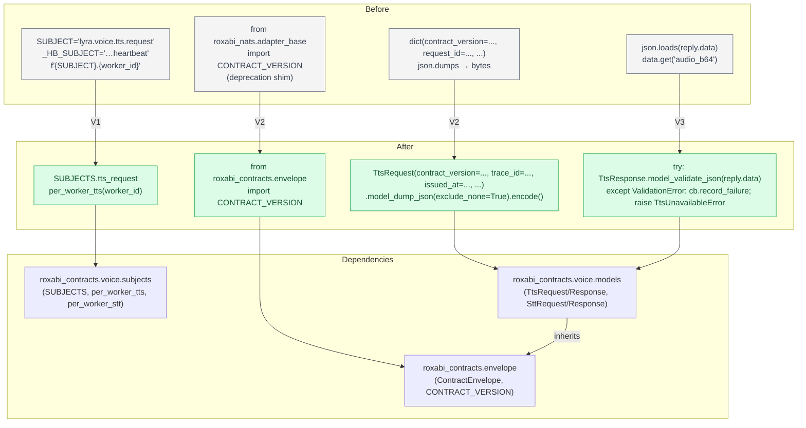
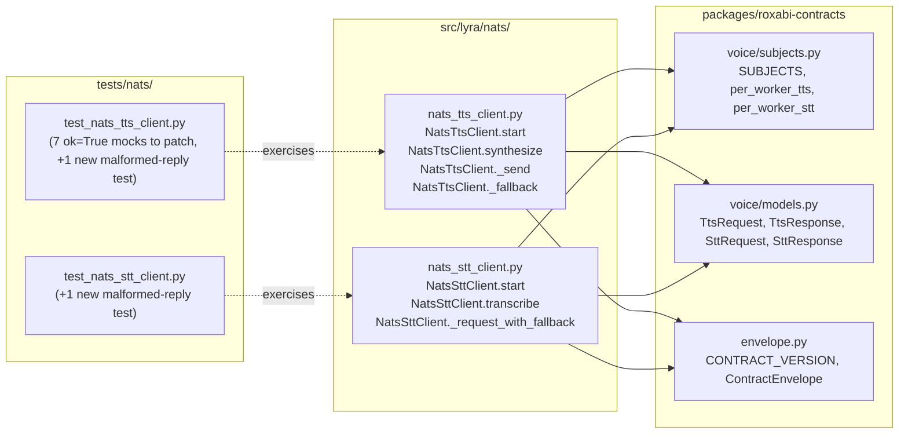

## Summary

Three slices, one PR. V1 replaces subject string literals with `SUBJECTS` + `per_worker_*` in both clients; V2 adopts `TtsRequest` / `SttRequest` for outgoing serialization and swaps `CONTRACT_VERSION` to its canonical contracts-package home; V3 adopts `TtsResponse` / `SttResponse` for incoming parsing with a `try/except pydantic.ValidationError → domain-error + CB failure` boundary, updates 7 TTS response mocks to include `duration_ms`, and adds two new malformed-reply tests (one per client). No `pyproject.toml` / `uv.lock` changes — the issue AC item on workspace `[testing]` extras is scoped out per spec §Expected Behavior 7.

## Architecture

### Data Flow



### File × Function Map



## Agents

| Agent | Task count | Files |
|-------|-----------|-------|
| backend-dev | 5 | `src/lyra/nats/nats_tts_client.py`, `src/lyra/nats/nats_stt_client.py` |
| tester | 6 (incl. 3 RED-GATE sentinels) | `tests/nats/test_nats_tts_client.py`, `tests/nats/test_nats_stt_client.py` |

Intra-domain parallelism: V1 and V2 each have 2 independent tasks (one per client file, no shared state between TTS and STT clients) that backend-dev can land in either order. V3 has 2 independent `[P]` RED tasks (new malformed-reply tests). No need to spawn multiple same-type agents in parallel at this surface — single backend-dev + single tester sequentially is efficient.

## Consistency Report

- Automated gates covered: 15/15
- Manual review items covered: 1/1
- Uncovered criteria: none
- Tasks without spec backing: none
- Gold plating exemptions applied: 0

Mapping matrix (spec success-criteria group → covering task):

| Spec criterion | Covering task(s) |
|---|---|
| `from roxabi_contracts.voice import … TtsRequest/Response …` (TTS) | T2, T4, T9 |
| `from roxabi_contracts.voice import … SttRequest/Response …` (STT) | T3, T5, T10 |
| `from roxabi_contracts.envelope import CONTRACT_VERSION` (both files) | T4, T5 |
| `from roxabi_nats.adapter_base import CONTRACT_VERSION` zero hits | T4, T5 |
| `"lyra.voice.(tts|stt).(request|heartbeat)"` literals zero hits in nats/ | T2, T3, T6 (gate) |
| `f"{...SUBJECT..."` derivation zero hits | T2, T3, T6 (gate) |
| `class (Tts|Stt)(Request|Response)` / `@dataclass` zero hits in nats/ | T6, T11 (gates) |
| `.get("audio_b64"/…)` zero hits in nats/ | T9, T10, T11 (gate) |
| `(nats_tts_client|nats_stt_client).SUBJECT\b` zero hits in src+tests | T2, T3, T6 (gate) |
| `except (pydantic.)?ValidationError` in both files | T9, T10 |
| TTS response mocks with `"ok": True` include `duration_ms` | T9 |
| Two new `test_malformed_reply_raises_domain_error` tests | T7 (TTS), T8 (STT), T9/T10 (make them pass) |
| `uv run pyright` exits 0 | T11 (gate) |
| `uv run pytest tests/nats/` exits 0 | T6, T11 (gate) |
| `uv run pytest` (full suite) exits 0 | T11 (gate) |
| PR description drift paragraph | deferred to `/pr` (T12 below, not seeded as plan-task) |

## Micro-Tasks

### Slice V1 — Swap subjects (no model change yet)

#### Task T1: Write RED-GATE probe for slice V1 [P] → tester

- **File:** no new file — verification commands only
- **Snippet:**
  ```bash
  # All must return 0 hits after V1:
  grep -nE '"lyra\.voice\.(tts|stt)\.(request|heartbeat)' src/lyra/nats/
  grep -nF 'f"{' src/lyra/nats/nats_tts_client.py src/lyra/nats/nats_stt_client.py | grep -E 'SUBJECT|\.request\.'
  grep -nE '(nats_tts_client|nats_stt_client)\.SUBJECT\b' src/lyra/ tests/
  ```
- **Verify:** run three greps after T2+T3 land
- **Expected (now, before V1 changes):** non-zero hits on the first two, zero on the third
- **Time:** 2 min
- **Difficulty:** 1
- **Traces:** SC(subject literals), SC(f-string derivation), SC(SUBJECT attr)
- **Phase:** RED (documents the pre-change state; becomes GATE after T2+T3)
- **Depends on:** —

#### Task T2: Migrate `nats_tts_client.py` subjects → backend-dev

- **File:** `src/lyra/nats/nats_tts_client.py`
- **Snippet (imports block head):**
  ```python
  from roxabi_contracts.voice import SUBJECTS
  from roxabi_contracts.voice.subjects import per_worker_tts
  ```
  Delete `_HB_SUBJECT = "lyra.voice.tts.heartbeat"` (module const) and `SUBJECT = "lyra.voice.tts.request"` (class attr).
  Replace `await self._nc.subscribe(_HB_SUBJECT, …)` → `await self._nc.subscribe(SUBJECTS.tts_heartbeat, …)`.
  Replace `target = f"{self.SUBJECT}.{worker_id}"` → `target = per_worker_tts(worker_id)`.
  Replace `await self._nc.request(self.SUBJECT, payload, …)` (fallback path) → `await self._nc.request(SUBJECTS.tts_request, payload, …)`.
- **Verify:**
  ```bash
  grep -nE '"lyra\.voice\.tts\.' src/lyra/nats/nats_tts_client.py    # 0 hits
  grep -nE '\bSUBJECT\b' src/lyra/nats/nats_tts_client.py            # 0 hits (class attr gone)
  uv run pytest tests/nats/test_nats_tts_client.py                   # still green
  ```
- **Expected:** three zero-hit/green outcomes
- **Time:** 8 min
- **Difficulty:** 2
- **Traces:** V1→(subject literals, SUBJECT attr, f-string derivation) for TTS side
- **Phase:** GREEN
- **Depends on:** T1

#### Task T3: Migrate `nats_stt_client.py` subjects [P with T2] → backend-dev

- **File:** `src/lyra/nats/nats_stt_client.py`
- **Snippet:**
  ```python
  from roxabi_contracts.voice import SUBJECTS
  from roxabi_contracts.voice.subjects import per_worker_stt
  ```
  Delete `_HB_SUBJECT = "lyra.voice.stt.heartbeat"` and `SUBJECT = "lyra.voice.stt.request"` class attr.
  Replace `_nc.subscribe(_HB_SUBJECT, …)` → `_nc.subscribe(SUBJECTS.stt_heartbeat, …)`.
  Replace `target = f"{self.SUBJECT}.{worker_id}"` → `target = per_worker_stt(worker_id)`.
  Replace `_nc.request(self.SUBJECT, payload, …)` (fallback) → `_nc.request(SUBJECTS.stt_request, payload, …)`.
- **Verify:**
  ```bash
  grep -nE '"lyra\.voice\.stt\.' src/lyra/nats/nats_stt_client.py    # 0 hits
  grep -nE '\bSUBJECT\b' src/lyra/nats/nats_stt_client.py            # 0 hits
  uv run pytest tests/nats/test_nats_stt_client.py                   # still green
  ```
- **Expected:** three zero-hit/green outcomes
- **Time:** 8 min
- **Difficulty:** 2
- **Traces:** V1→(subject literals, SUBJECT attr, f-string derivation) for STT side
- **Phase:** GREEN
- **Depends on:** T1 (¬depend on T2 — files are independent)

#### Task T6: RED-GATE V1 → tester

- **File:** no new file — verification only
- **Verify:**
  ```bash
  # The three greps from T1 now ALL return 0 hits:
  grep -nE '"lyra\.voice\.(tts|stt)\.(request|heartbeat)' src/lyra/nats/ ; echo "exit=$?"
  grep -nF 'f"{' src/lyra/nats/nats_tts_client.py src/lyra/nats/nats_stt_client.py | grep -E 'SUBJECT|\.request\.' ; echo "exit=$?"
  grep -nE '(nats_tts_client|nats_stt_client)\.SUBJECT\b' src/lyra/ tests/ ; echo "exit=$?"
  # Full nats test suite green (no semantic change expected in V1):
  uv run pytest tests/nats/
  ```
- **Expected:** greps exit 1 (no match) three times; pytest exits 0
- **Time:** 2 min
- **Difficulty:** 1
- **Traces:** all V1 grep gates
- **Phase:** RED-GATE
- **Depends on:** T2, T3

### Slice V2 — Adopt request models + envelope import swap

#### Task T4: Migrate `nats_tts_client.py` outgoing path → backend-dev

- **File:** `src/lyra/nats/nats_tts_client.py`
- **Snippet (new imports + synthesize path skeleton):**
  ```python
  from datetime import datetime, timezone
  from roxabi_contracts.envelope import CONTRACT_VERSION
  from roxabi_contracts.voice import TtsRequest

  # REMOVE:  from roxabi_nats.adapter_base import CONTRACT_VERSION

  # inside synthesize(), replace the dict-building block:
  req_kwargs: dict[str, object] = {
      "contract_version": CONTRACT_VERSION,
      "trace_id": str(uuid4()),
      "issued_at": datetime.now(timezone.utc),
      "request_id": str(uuid4()),
      "text": text,
      "language": language,
      "voice": voice,
      "fallback_language": fallback_language,
      "chunked": True,
  }
  if agent_tts is not None:
      for field in _TTS_CONFIG_FIELDS:
          val = getattr(agent_tts, field, None)
          if val is not None:
              req_kwargs[field] = val
      if language is None and getattr(agent_tts, "language", None) is not None:
          req_kwargs["language"] = agent_tts.language
      if voice is None and getattr(agent_tts, "voice", None) is not None:
          req_kwargs["voice"] = agent_tts.voice
  request = TtsRequest(**req_kwargs)
  payload = request.model_dump_json(exclude_none=True).encode("utf-8")
  ```
  Response parsing path (inside `_send` / `_fallback`) is untouched in V2 — still `json.loads(reply.data)` + raw dict. V3 flips it.
- **Verify:**
  ```bash
  grep -n 'TtsRequest(' src/lyra/nats/nats_tts_client.py                              # ≥1 hit
  grep -n 'model_dump_json' src/lyra/nats/nats_tts_client.py                          # ≥1 hit
  grep -n 'from roxabi_contracts.envelope import CONTRACT_VERSION' src/lyra/nats/nats_tts_client.py  # 1 hit
  grep -n 'from roxabi_nats.adapter_base import' src/lyra/nats/nats_tts_client.py     # 0 hits
  uv run pytest tests/nats/test_nats_tts_client.py                                    # still green
  uv run python -c "import json,base64; from pathlib import Path; from roxabi_contracts.voice import TtsRequest; print('OK')"
  ```
- **Expected:** hits/no-hits as annotated; pytest green (request-shape tests already assert `contract_version='1'` — still passes because CONTRACT_VERSION re-export is value-identical)
- **Time:** 12 min
- **Difficulty:** 3
- **Traces:** SC(TtsRequest import), SC(envelope CONTRACT_VERSION), SC(no adapter_base CONTRACT_VERSION)
- **Phase:** GREEN
- **Depends on:** T6

#### Task T5: Migrate `nats_stt_client.py` outgoing path → backend-dev

- **File:** `src/lyra/nats/nats_stt_client.py`
- **Snippet:**
  ```python
  from datetime import datetime, timezone
  from roxabi_contracts.envelope import CONTRACT_VERSION
  from roxabi_contracts.voice import SttRequest

  # REMOVE:  from roxabi_nats.adapter_base import CONTRACT_VERSION

  # inside transcribe(), replace the dict-building block:
  request = SttRequest(
      contract_version=CONTRACT_VERSION,
      trace_id=str(uuid4()),
      issued_at=datetime.now(timezone.utc),
      request_id=str(uuid4()),
      audio_b64=base64.b64encode(audio_bytes).decode("ascii"),
      mime_type=mime,
      model=self._model,
      language_detection_threshold=self._detection_threshold,
      language_detection_segments=self._detection_segments,
      language_fallback=self._detection_fallback,
  )
  payload = request.model_dump_json(exclude_none=True).encode("utf-8")
  ```
  Response parsing path inside `_request_with_fallback` untouched in V2.
- **Verify:**
  ```bash
  grep -n 'SttRequest(' src/lyra/nats/nats_stt_client.py                              # ≥1 hit
  grep -n 'model_dump_json' src/lyra/nats/nats_stt_client.py                          # ≥1 hit
  grep -n 'from roxabi_contracts.envelope import CONTRACT_VERSION' src/lyra/nats/nats_stt_client.py   # 1 hit
  grep -n 'from roxabi_nats.adapter_base import' src/lyra/nats/nats_stt_client.py      # 0 hits
  uv run pytest tests/nats/test_nats_stt_client.py                                     # still green
  ```
- **Expected:** hits/no-hits as annotated; pytest green
- **Time:** 10 min
- **Difficulty:** 3
- **Traces:** SC(SttRequest import), SC(envelope CONTRACT_VERSION), SC(no adapter_base CONTRACT_VERSION)
- **Phase:** GREEN
- **Depends on:** T6 (¬depend on T4 — files independent)

#### Task T7: RED-GATE V2 → tester

- **File:** no new file — verification only
- **Verify:**
  ```bash
  uv run pytest tests/nats/                      # green
  uv run pyright src/lyra/nats/                  # 0 errors
  # Sanity: the request bytes we now emit parse back through the contract model:
  uv run python - <<'PY'
  from datetime import datetime, timezone
  from roxabi_contracts.envelope import CONTRACT_VERSION
  from roxabi_contracts.voice import TtsRequest, SttRequest
  req = TtsRequest(contract_version=CONTRACT_VERSION, trace_id="t", issued_at=datetime.now(timezone.utc),
                   request_id="r", text="hi")
  assert TtsRequest.model_validate_json(req.model_dump_json()).text == "hi"
  req2 = SttRequest(contract_version=CONTRACT_VERSION, trace_id="t", issued_at=datetime.now(timezone.utc),
                    request_id="r", audio_b64="AAAA", model="m")
  assert SttRequest.model_validate_json(req2.model_dump_json()).model == "m"
  print("OK")
  PY
  ```
- **Expected:** pytest + pyright exit 0; `OK` printed
- **Time:** 3 min
- **Difficulty:** 1
- **Traces:** V2 completion gate
- **Phase:** RED-GATE
- **Depends on:** T4, T5

### Slice V3 — Adopt response models + error boundary + tests

#### Task T7r: Write RED malformed-reply test for TTS [P] → tester

- **File:** `tests/nats/test_nats_tts_client.py`
- **Snippet (append a new test class at end of file):**
  ```python
  from pydantic import ValidationError as _PydanticValidationError  # unused at GREEN but documents intent


  class TestMalformedReply:
      """Pydantic ValidationError on reply MUST surface as TtsUnavailableError."""

      @pytest.mark.asyncio
      async def test_malformed_reply_raises_domain_error(self) -> None:
          mock_nc = AsyncMock()
          # Missing required success-invariant fields: ok=True but no duration_ms.
          bad_payload = json.dumps(
              {
                  "contract_version": "1",
                  "trace_id": "t",
                  "issued_at": "2026-04-19T00:00:00+00:00",
                  "ok": True,
                  "request_id": "r",
                  "audio_b64": base64.b64encode(b"x").decode(),
                  "mime_type": "audio/ogg",
                  # duration_ms intentionally missing → fails _enforce_success_invariant
              }
          ).encode()
          fake_reply = MagicMock()
          fake_reply.data = bad_payload
          mock_nc.request = AsyncMock(return_value=fake_reply)
          client = NatsTtsClient(nc=mock_nc)
          _inject_fresh_worker(client)
          initial_failures = client._cb._failures

          with pytest.raises(TtsUnavailableError, match="schema"):
              await client.synthesize("hello")

          assert client._cb._failures == initial_failures + 1
  ```
- **Verify:** `uv run pytest tests/nats/test_nats_tts_client.py::TestMalformedReply -x`
- **Expected (RED, before T9 lands):** currently the client returns the reply as a dict and never validates, so the test fails — either by not raising, or by raising something other than `TtsUnavailableError`. Document the failure mode in the commit body.
- **Time:** 8 min
- **Difficulty:** 2
- **Traces:** SC(except ValidationError — TTS), SC(new malformed-reply test — TTS)
- **Phase:** RED
- **Depends on:** T7 (V2 gate)

#### Task T8r: Write RED malformed-reply test for STT [P] → tester

- **File:** `tests/nats/test_nats_stt_client.py`
- **Snippet:** same pattern as T7r but for `NatsSttClient.transcribe` — mock a file on disk (use `tmp_path`), craft a bad `SttResponse` payload (ok=True but missing `duration_seconds`), assert `pytest.raises(STTUnavailableError, match="schema")` and `client._cb._failures` incremented by 1. Import `STTUnavailableError` from `lyra.stt`.
- **Verify:** `uv run pytest tests/nats/test_nats_stt_client.py::TestMalformedReply -x`
- **Expected (RED, before T10 lands):** fails — raw `KeyError` or silent dict access
- **Time:** 8 min
- **Difficulty:** 2
- **Traces:** SC(except ValidationError — STT), SC(new malformed-reply test — STT)
- **Phase:** RED
- **Depends on:** T7 (V2 gate)

#### Task T9: Adopt TtsResponse + error boundary + fix existing mocks → backend-dev

- **File:** `src/lyra/nats/nats_tts_client.py` AND `tests/nats/test_nats_tts_client.py`
- **Snippet (client, replace `_send`'s parse step; same pattern in `_fallback`):**
  ```python
  from pydantic import ValidationError
  from roxabi_contracts.voice import TtsResponse

  # inside _send, replacing json.loads + dict access:
  try:
      resp = TtsResponse.model_validate_json(reply.data)
  except ValidationError as exc:
      self._cb.record_failure()
      raise TtsUnavailableError("TTS reply failed schema validation") from exc
  if not resp.ok:
      self._cb.record_failure()
      raise TtsUnavailableError(resp.error or "TTS synthesis failed")
  return resp

  # and in synthesize() where the audio is returned:
  # data = await self._send(payload, preferred.worker_id)  # now returns TtsResponse
  # audio_bytes = base64.b64decode(data.audio_b64 or "")   # ok=True invariant ensures non-null
  # return SynthesisResult(
  #     audio_bytes=audio_bytes,
  #     mime_type=resp.mime_type or "audio/ogg",
  #     duration_ms=resp.duration_ms,
  #     waveform_b64=resp.waveform_b64,
  # )
  ```
  `_fallback` gets the same wrap (or, cleaner: extract a private `_parse_reply(data: bytes) -> TtsResponse` helper and call it from both paths).

  **Test-fixture update (same commit):** every `"ok": True` literal in `tests/nats/test_nats_tts_client.py` (7 occurrences per current `grep -c '"ok": True'`) gets a `"duration_ms": <int>` sibling added. Also add `"trace_id"` + `"issued_at"` siblings where the mocks are supposed to parse through `TtsResponse.model_validate_json` — without those, `_enforce_success_invariant` still fires but `ContractEnvelope` fields would 400 too.
- **Verify:**
  ```bash
  grep -n 'TtsResponse.model_validate_json' src/lyra/nats/nats_tts_client.py                         # ≥1 hit
  grep -nE 'except\s+ValidationError|except\s+pydantic\.ValidationError' src/lyra/nats/nats_tts_client.py  # ≥1 hit
  grep -nE '\.get\("(audio_b64|mime_type|duration_ms|waveform_b64|ok|error)"' src/lyra/nats/nats_tts_client.py  # 0 hits
  # Every ok=True in the test file has a duration_ms sibling within the same dict:
  uv run python - <<'PY'
  import ast, pathlib, sys
  src = pathlib.Path("tests/nats/test_nats_tts_client.py").read_text()
  tree = ast.parse(src)
  bad = []
  for node in ast.walk(tree):
      if isinstance(node, ast.Dict):
          keys = [k.value for k in node.keys if isinstance(k, ast.Constant) and isinstance(k.value, str)]
          values = dict(zip(keys, node.values))
          ok_node = values.get("ok")
          if isinstance(ok_node, ast.Constant) and ok_node.value is True:
              if "duration_ms" not in keys:
                  bad.append(node.lineno)
  sys.exit(0 if not bad else (print("missing duration_ms at lines:", bad) or 1))
  PY
  uv run pytest tests/nats/test_nats_tts_client.py                                                   # green including T7r
  ```
- **Expected:** greps as annotated; AST scan exits 0; pytest green (T7r now passes)
- **Time:** 18 min
- **Difficulty:** 4
- **Traces:** SC(TtsResponse import), SC(.get zero hits TTS), SC(except ValidationError TTS), SC(duration_ms in all ok=True mocks), SC(T7r passes)
- **Phase:** GREEN
- **Depends on:** T7r

#### Task T10: Adopt SttResponse + error boundary → backend-dev

- **File:** `src/lyra/nats/nats_stt_client.py`
- **Snippet (same shape as T9, minus the mock-fix step — STT mocks already carry `duration_seconds`):**
  ```python
  from pydantic import ValidationError
  from roxabi_contracts.voice import SttResponse

  # inside _request_with_fallback, replacing each json.loads:
  try:
      resp = SttResponse.model_validate_json(reply.data)
  except ValidationError as exc:
      self._cb.record_failure()
      raise STTUnavailableError("STT reply failed schema validation") from exc
  return resp   # transcribe() unpacks .ok / .text / .language / .duration_seconds / .error
  ```
  Update `transcribe()` to consume `resp.ok`, `resp.error`, `resp.text`, `resp.language`, `resp.duration_seconds`.
- **Verify:**
  ```bash
  grep -n 'SttResponse.model_validate_json' src/lyra/nats/nats_stt_client.py                         # ≥1 hit
  grep -nE 'except\s+ValidationError|except\s+pydantic\.ValidationError' src/lyra/nats/nats_stt_client.py  # ≥1 hit
  grep -nE '\.get\("(text|language|duration_seconds|ok|error|audio_b64|mime_type)"' src/lyra/nats/nats_stt_client.py   # 0 hits
  uv run pytest tests/nats/test_nats_stt_client.py                                                   # green including T8r
  ```
- **Expected:** greps as annotated; pytest green (T8r now passes)
- **Time:** 12 min
- **Difficulty:** 3
- **Traces:** SC(SttResponse import), SC(.get zero hits STT), SC(except ValidationError STT), SC(T8r passes)
- **Phase:** GREEN
- **Depends on:** T8r (¬depend on T9 — files independent)

#### Task T11: RED-GATE V3 — full spec walk → tester

- **File:** no new file — verification only
- **Verify:** walk `artifacts/specs/766-migrate-lyra-voice-publishers-spec.mdx` §Automated gates top-to-bottom, running each grep / pytest / pyright command. Report any unchecked gate.
  ```bash
  # Consolidated sign-off (one-shot):
  set -e
  grep -qE 'from roxabi_contracts\.voice import.*TtsRequest' src/lyra/nats/nats_tts_client.py
  grep -qE 'from roxabi_contracts\.voice import.*TtsResponse' src/lyra/nats/nats_tts_client.py
  grep -qE 'from roxabi_contracts\.voice import.*SttRequest' src/lyra/nats/nats_stt_client.py
  grep -qE 'from roxabi_contracts\.voice import.*SttResponse' src/lyra/nats/nats_stt_client.py
  grep -qE 'from roxabi_contracts\.envelope import CONTRACT_VERSION' src/lyra/nats/nats_tts_client.py
  grep -qE 'from roxabi_contracts\.envelope import CONTRACT_VERSION' src/lyra/nats/nats_stt_client.py
  ! grep -qE 'from roxabi_nats\.adapter_base import.*CONTRACT_VERSION' src/lyra/nats/nats_tts_client.py src/lyra/nats/nats_stt_client.py
  ! grep -qE '"lyra\.voice\.(tts|stt)\.(request|heartbeat)' src/lyra/nats/nats_tts_client.py src/lyra/nats/nats_stt_client.py
  ! grep -qE '^class (Tts|Stt)(Request|Response)|@dataclass' src/lyra/nats/
  ! grep -qE '\.get\("(audio_b64|mime_type|duration_ms|waveform_b64|text|language|duration_seconds|ok|error)"' src/lyra/nats/nats_tts_client.py src/lyra/nats/nats_stt_client.py
  ! grep -qE '(nats_tts_client|nats_stt_client)\.SUBJECT\b' src/lyra/ tests/
  grep -qE 'except\s+ValidationError|except\s+pydantic\.ValidationError' src/lyra/nats/nats_tts_client.py
  grep -qE 'except\s+ValidationError|except\s+pydantic\.ValidationError' src/lyra/nats/nats_stt_client.py
  uv run pyright
  uv run pytest tests/nats/
  uv run pytest
  echo "ALL GATES PASS"
  ```
- **Expected:** every gate satisfied; final line `ALL GATES PASS` printed.
- **Time:** 4 min
- **Difficulty:** 1
- **Traces:** all 15 automated gates
- **Phase:** RED-GATE
- **Depends on:** T9, T10

### Process task (PR body drift note, handled by `/pr`, listed here for consistency)

#### Task T12: Author PR description with "Wire-shape drift vs prior lyra payloads" paragraph → backend-dev (deferred to `/pr`)

- **Content:** (a) new `trace_id` + `issued_at` envelope fields now present on every request (previously absent — new drift, intentional, matches contracts package). (b) issue-AC deviation on workspace `[testing]` extras + uv.lock non-regen, with a link to spec §Expected Behavior 7. (c) two new `test_malformed_reply_raises_domain_error` tests as anti-drift guards on the receive path.
- **Verify:** `gh pr view {N} --json body` contains each of the three items.
- **Expected:** PR body rendered correctly on GitHub.
- **Time:** 5 min
- **Difficulty:** 1
- **Traces:** manual review item from spec
- **Phase:** REFACTOR (post-CI)
- **Depends on:** T11

## Task IDs

<!-- Generated by /plan. Used by /implement to resume tasks on session restart. -->

- T1:  11 — Write RED-GATE probe for slice V1
- T2:  12 — Migrate nats_tts_client.py subjects
- T3:  13 — Migrate nats_stt_client.py subjects
- T6:  14 — RED-GATE V1: subject swap complete
- T4:  15 — Migrate nats_tts_client.py outgoing path to TtsRequest
- T5:  16 — Migrate nats_stt_client.py outgoing path to SttRequest
- T7:  17 — RED-GATE V2: request-model adoption complete
- T7r: 18 — Write RED malformed-reply test for TTS
- T8r: 19 — Write RED malformed-reply test for STT
- T9:  20 — Adopt TtsResponse + error boundary + fix existing TTS mocks
- T10: 21 — Adopt SttResponse + error boundary
- T11: 22 — RED-GATE V3: full spec walk + final sign-off
- T12: deferred to /pr — Author PR description with drift paragraph
