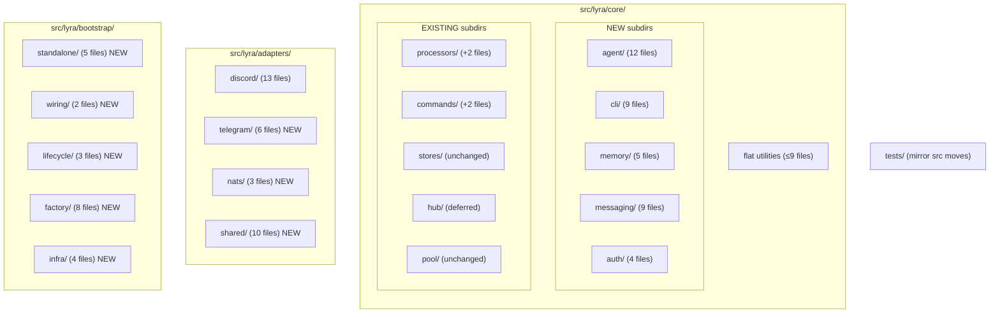
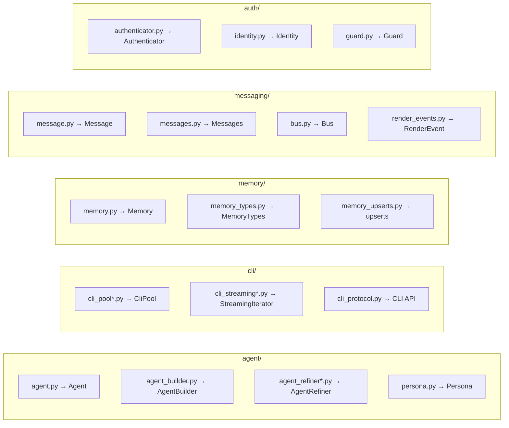

## Summary

Decompose 3 oversized folders (`core/`, `adapters/`, `bootstrap/`) into cohesive subfolders to meet 12-file cap. Move ~90 files, update ~200 import sites (src + tests), verify green on pyright + pytest + lint-imports after each slice. Deferred: `core/hub/` (follow-up issue).

## Architecture

### Data flow — folder structure after decomposition



### File × function map — core/ new subdirs



## Bootstrap Context

**Reference pattern:** `src/lyra/adapters/__init__.py` — minimal `__init__.py` that re-exports key symbols. Use the same pattern for each new subdir.

**Precedent:** #395 plan (`artifacts/plans/395-split-core-subdirectories-plan.mdx`) — identical approach for stores/hub/pool/commands decomposition.

**Quality gates:** `uv run pyright`, `uv run pytest`, `uv run lint-imports` must pass after each slice.

## Agents

| Agent | Slices | Task count | Primary files |
|-------|--------|-----------|---------------|
| backend-dev | S1, S2, S3 | 28 | 90 moved files + ~200 import updates |
| devops | S4 | 3 | `folder_exemptions.txt`, follow-up issue |
| doc-writer | S1, S2, S3 | 6 | CLAUDE.md updates per subdir |

## Consistency Report

| Criterion | Covered by tasks |
|-----------|-----------------|
| core/agent/ 12 files + __init__ | T1–T3 |
| core/cli/ 9 files + __init__ | T4–T6 |
| core/memory/ 5 files + __init__ | T7–T9 |
| core/messaging/ 9 files + __init__ | T10–T12 |
| core/auth/ 4 files + __init__ | T13–T15 |
| processors/ +2 files | T16–T17 |
| commands/ +2 files | T18–T19 |
| core/ flat ≤12 | T20 (implicit from moves) |
| adapters/discord/ 13 files | T21–T23 |
| adapters/telegram/ 6 files | T24–T26 |
| adapters/nats/ 3 files | T27–T29 |
| adapters/shared/ 10 files | T30–T32 |
| bootstrap/standalone/ 5 files | T33–T35 |
| bootstrap/wiring/ 2 files | T36–T38 |
| bootstrap/lifecycle/ 3 files | T39–T41 |
| bootstrap/factory/ 8 files | T42–T44 |
| bootstrap/infra/ 4 files | T45–T47 |
| folder_exemptions.txt | T48 |
| pyright 0 errors | RG-S1, RG-S2, RG-S3 |
| pytest 0 regressions | RG-S1, RG-S2, RG-S3 |
| lint-imports pass | RG-S1, RG-S2, RG-S3 |
| follow-up issue | T49 |

Uncovered: none. Untraced: none.

---

## Micro-Tasks

---

### S1 — Decompose `core/` flat → 5 subdirs + orphan moves ░░░░░░░░ `pyright + pytest + lint-imports green`

---

**T1 — git mv 12 agent files into core/agent/** [P]
- Files: `src/lyra/core/{agent,agent_builder,agent_commands,agent_config,agent_db_loader,agent_loader,agent_models,agent_refiner,agent_refiner_stages,agent_schema,agent_seeder,persona}.py`
- Command: `mkdir -p src/lyra/core/agent && git mv src/lyra/core/agent.py src/lyra/core/agent/` (repeat for all 12)
- Verify: `ls src/lyra/core/agent/*.py | wc -l` → `12`
- Time: 3 min | Agent: backend-dev | Phase: RED | Spec: SC-core-1

---

**T2 — Write `core/agent/__init__.py`**
- File: `src/lyra/core/agent/__init__.py`
- Snippet:
  ```python
  from .agent import Agent
  from .agent_builder import AgentBuilder
  from .agent_refiner import AgentRefiner

  __all__ = ["Agent", "AgentBuilder", "AgentRefiner"]
  ```
- Verify: `python3 -c "from lyra.core.agent import Agent; print('ok')"`
- Time: 2 min | Agent: backend-dev | Phase: GREEN | Spec: SC-core-1

---

**T3 — Fix relative imports inside moved agent files**
- Files: All 12 files in `core/agent/`
- Change: `from .memory` → `from ..memory`, `from .message` → `from ..message`, etc. (depth +1 for flat-remaining imports)
- Verify: `uv run pyright src/lyra/core/agent/ 2>&1 | grep -c error || echo "0 errors"`
- Time: 8 min | Agent: backend-dev | Phase: GREEN | Spec: SC-core-1 | Difficulty: 3

---

**T4 — git mv 9 cli files into core/cli/** [P]
- Files: `src/lyra/core/{cli_non_streaming,cli_pool,cli_pool_lifecycle,cli_pool_session,cli_pool_streaming,cli_pool_worker,cli_protocol,cli_streaming,cli_streaming_parser}.py`
- Command: `mkdir -p src/lyra/core/cli && git mv src/lyra/core/cli_*.py src/lyra/core/cli/`
- Verify: `ls src/lyra/core/cli/*.py | wc -l` → `9`
- Time: 2 min | Agent: backend-dev | Phase: RED | Spec: SC-core-2

---

**T5 — Write `core/cli/__init__.py`**
- File: `src/lyra/core/cli/__init__.py`
- Snippet:
  ```python
  from .cli_pool import CliPool
  from .cli_protocol import StreamingIterator, send_and_read_stream

  __all__ = ["CliPool", "StreamingIterator", "send_and_read_stream"]
  ```
- Verify: `python3 -c "from lyra.core.cli import CliPool; print('ok')"`
- Time: 2 min | Agent: backend-dev | Phase: GREEN | Spec: SC-core-2

---

**T6 — Fix relative imports inside moved cli files**
- Files: All 9 files in `core/cli/`
- Change: `from .agent` → `from ..agent`, `from .memory` → `from ..memory`, etc.
- Verify: `uv run pyright src/lyra/core/cli/ 2>&1 | grep -c error || echo "0 errors"`
- Time: 6 min | Agent: backend-dev | Phase: GREEN | Spec: SC-core-2

---

**T7 — git mv 5 memory files into core/memory/** [P]
- Files: `src/lyra/core/{memory,memory_freshness,memory_schema,memory_types,memory_upserts}.py`
- Command: `mkdir -p src/lyra/core/memory && git mv src/lyra/core/memory*.py src/lyra/core/memory/`
- Verify: `ls src/lyra/core/memory/*.py | wc -l` → `5`
- Time: 2 min | Agent: backend-dev | Phase: RED | Spec: SC-core-3

---

**T8 — Write `core/memory/__init__.py`**
- File: `src/lyra/core/memory/__init__.py`
- Snippet:
  ```python
  from .memory import Memory
  from .memory_types import MemoryTypes

  __all__ = ["Memory", "MemoryTypes"]
  ```
- Verify: `python3 -c "from lyra.core.memory import Memory; print('ok')"`
- Time: 2 min | Agent: backend-dev | Phase: GREEN | Spec: SC-core-3

---

**T9 — Fix relative imports inside moved memory files**
- Files: All 5 files in `core/memory/`
- Change: `from .agent` → `from ..agent`, etc.
- Verify: `uv run pyright src/lyra/core/memory/ 2>&1 | grep -c error || echo "0 errors"`
- Time: 4 min | Agent: backend-dev | Phase: GREEN | Spec: SC-core-3

---

**T10 — git mv 9 messaging files into core/messaging/** [P]
- Files: `src/lyra/core/{message,messages,bus,events,inbound_bus,render_events,tool_display_config,tool_recap_format,scope}.py`
- Command: `mkdir -p src/lyra/core/messaging && git mv src/lyra/core/{message,messages,bus,events,inbound_bus,render_events,tool_display_config,tool_recap_format,scope}.py src/lyra/core/messaging/`
- Verify: `ls src/lyra/core/messaging/*.py | wc -l` → `9`
- Time: 2 min | Agent: backend-dev | Phase: RED | Spec: SC-core-4

---

**T11 — Write `core/messaging/__init__.py`**
- File: `src/lyra/core/messaging/__init__.py`
- Snippet:
  ```python
  from .message import Message, InboundMessage, OutboundMessage
  from .bus import Bus
  from .events import LlmEvent

  __all__ = ["Message", "InboundMessage", "OutboundMessage", "Bus", "LlmEvent"]
  ```
- Verify: `python3 -c "from lyra.core.messaging import Message; print('ok')"`
- Time: 2 min | Agent: backend-dev | Phase: GREEN | Spec: SC-core-4

---

**T12 — Fix relative imports inside moved messaging files**
- Files: All 9 files in `core/messaging/`
- Change: depth +1 for flat-remaining imports
- Verify: `uv run pyright src/lyra/core/messaging/ 2>&1 | grep -c error || echo "0 errors"`
- Time: 5 min | Agent: backend-dev | Phase: GREEN | Spec: SC-core-4

---

**T13 — git mv 4 auth files into core/auth/** [P]
- Files: `src/lyra/core/{authenticator,identity,trust,guard}.py`
- Command: `mkdir -p src/lyra/core/auth && git mv src/lyra/core/{authenticator,identity,trust,guard}.py src/lyra/core/auth/`
- Verify: `ls src/lyra/core/auth/*.py | wc -l` → `4`
- Time: 1 min | Agent: backend-dev | Phase: RED | Spec: SC-core-5

---

**T14 — Write `core/auth/__init__.py`**
- File: `src/lyra/core/auth/__init__.py`
- Snippet:
  ```python
  from .authenticator import Authenticator
  from .guard import Guard, GuardChain

  __all__ = ["Authenticator", "Guard", "GuardChain"]
  ```
- Verify: `python3 -c "from lyra.core.auth import Authenticator; print('ok')"`
- Time: 2 min | Agent: backend-dev | Phase: GREEN | Spec: SC-core-5

---

**T15 — Fix relative imports inside moved auth files**
- Files: All 4 files in `core/auth/`
- Change: depth +1 for flat-remaining imports
- Verify: `uv run pyright src/lyra/core/auth/ 2>&1 | grep -c error || echo "0 errors"`
- Time: 3 min | Agent: backend-dev | Phase: GREEN | Spec: SC-core-5

---

**T16 — git mv processor_registry, stream_processor into core/processors/** [P]
- Files: `src/lyra/core/{processor_registry,stream_processor}.py`
- Command: `git mv src/lyra/core/{processor_registry,stream_processor}.py src/lyra/core/processors/`
- Verify: `ls src/lyra/core/processors/*.py | wc -l` → `4` (2 existing + 2 moved)
- Time: 1 min | Agent: backend-dev | Phase: RED | Spec: SC-core-6

---

**T17 — Update processors/__init__.py + fix imports**
- Files: `src/lyra/core/processors/__init__.py`, moved files
- Change: Add exports for ProcessorRegistry, StreamProcessor; fix relative imports
- Verify: `uv run pyright src/lyra/core/processors/ 2>&1 | grep -c error || echo "0 errors"`
- Time: 3 min | Agent: backend-dev | Phase: GREEN | Spec: SC-core-6

---

**T18 — git mv builtin_commands, workspace_commands into core/commands/** [P]
- Files: `src/lyra/core/{builtin_commands,workspace_commands}.py`
- Command: `git mv src/lyra/core/{builtin_commands,workspace_commands}.py src/lyra/core/commands/`
- Verify: `ls src/lyra/core/commands/*.py | wc -l` → `6` (4 existing + 2 moved)
- Time: 1 min | Agent: backend-dev | Phase: RED | Spec: SC-core-7

---

**T19 — Update commands/__init__.py + fix imports**
- Files: `src/lyra/core/commands/__init__.py`, moved files
- Change: Add exports; fix relative imports
- Verify: `uv run pyright src/lyra/core/commands/ 2>&1 | grep -c error || echo "0 errors"`
- Time: 3 min | Agent: backend-dev | Phase: GREEN | Spec: SC-core-7

---

**T20 — Update core/__init__.py for new subdirs**
- File: `src/lyra/core/__init__.py`
- Change: Re-export from new subdirs (agent, cli, memory, messaging, auth) instead of flat files
- Verify: `python3 -c "from lyra.core import Agent, Memory, Message, Authenticator; print('ok')"`
- Time: 5 min | Agent: backend-dev | Phase: GREEN | Spec: SC-core-all | Difficulty: 3

---

**T21 — Update external imports for core/ subdirs**
- Files: `adapters/*.py`, `bootstrap/*.py`, `agents/*.py`, `commands/**/*.py`, `llm/*.py`
- Change: `from lyra.core.agent` → `from lyra.core.agent.agent` (if not re-exported), or rely on re-exports
- Verify: `uv run pyright src/lyra/ 2>&1 | grep -c error || echo "0 errors"`
- Time: 10 min | Agent: backend-dev | Phase: GREEN | Spec: N4 | Difficulty: 4

---

**T22 — Update test imports for core/ subdirs**
- Files: `tests/**/*.py`
- Change: Mirror src moves — update all `from lyra.core.X` imports
- Verify: `uv run pytest tests/ --collect-only 2>&1 | grep -c error || echo "0 errors"`
- Time: 15 min | Agent: backend-dev | Phase: GREEN | Spec: N5 | Difficulty: 4

---

**🔴 RED-GATE S1**
```bash
uv run pyright          # must: 0 errors
uv run pytest --tb=short -q  # must: 0 failures
uv run lint-imports     # must: pass
```
If red → fix T3,T6,T9,T12,T15,T17,T19,T20,T21,T22 before proceeding to S2.

---

### S2 — Decompose `adapters/` → 4 subdirs ░░░░░░░░░░░░░░░░ `pyright + pytest + lint-imports green`

---

**T23 — git mv 10 discord files into existing adapters/discord/** [P]
- Files: `src/lyra/adapters/{discord,discord_audio,discord_audio_outbound,discord_config,discord_formatting,discord_inbound,discord_normalize,discord_outbound,discord_threads,discord_voice,discord_voice_commands}.py`
- Command: `git mv src/lyra/adapters/discord*.py src/lyra/adapters/discord/`
- Verify: `ls src/lyra/adapters/discord/*.py | wc -l` → `13`
- Time: 2 min | Agent: backend-dev | Phase: RED | Spec: SC-adapters-1

---

**T24 — Update adapters/discord/__init__.py**
- File: `src/lyra/adapters/discord/__init__.py`
- Change: Re-export from moved files
- Verify: `python3 -c "from lyra.adapters.discord import DiscordAdapter; print('ok')"`
- Time: 3 min | Agent: backend-dev | Phase: GREEN | Spec: SC-adapters-1

---

**T25 — Fix relative imports inside discord files**
- Files: All 13 files in `adapters/discord/`
- Change: `from ._shared` → `from ..shared._shared`, etc.
- Verify: `uv run pyright src/lyra/adapters/discord/ 2>&1 | grep -c error || echo "0 errors"`
- Time: 8 min | Agent: backend-dev | Phase: GREEN | Spec: SC-adapters-1 | Difficulty: 3

---

**T26 — git mv 6 telegram files into adapters/telegram/** [P]
- Files: `src/lyra/adapters/{telegram,telegram_audio,telegram_formatting,telegram_inbound,telegram_normalize,telegram_outbound}.py`
- Command: `mkdir -p src/lyra/adapters/telegram && git mv src/lyra/adapters/telegram*.py src/lyra/adapters/telegram/`
- Verify: `ls src/lyra/adapters/telegram/*.py | wc -l` → `6`
- Time: 2 min | Agent: backend-dev | Phase: RED | Spec: SC-adapters-2

---

**T27 — Write adapters/telegram/__init__.py**
- File: `src/lyra/adapters/telegram/__init__.py`
- Snippet:
  ```python
  from .telegram import TelegramAdapter

  __all__ = ["TelegramAdapter"]
  ```
- Verify: `python3 -c "from lyra.adapters.telegram import TelegramAdapter; print('ok')"`
- Time: 2 min | Agent: backend-dev | Phase: GREEN | Spec: SC-adapters-2

---

**T28 — Fix relative imports inside telegram files**
- Files: All 6 files in `adapters/telegram/`
- Change: depth adjustments for cross-subdir imports
- Verify: `uv run pyright src/lyra/adapters/telegram/ 2>&1 | grep -c error || echo "0 errors"`
- Time: 5 min | Agent: backend-dev | Phase: GREEN | Spec: SC-adapters-2

---

**T29 — git mv 3 nats files into adapters/nats/** [P]
- Files: `src/lyra/adapters/{nats_envelope_handlers,nats_outbound_listener,nats_stream_decoder}.py`
- Command: `mkdir -p src/lyra/adapters/nats && git mv src/lyra/adapters/nats_*.py src/lyra/adapters/nats/`
- Verify: `ls src/lyra/adapters/nats/*.py | wc -l` → `3`
- Time: 1 min | Agent: backend-dev | Phase: RED | Spec: SC-adapters-3

---

**T30 — Write adapters/nats/__init__.py**
- File: `src/lyra/adapters/nats/__init__.py`
- Verify: `python3 -c "from lyra.adapters.nats import NatsOutboundListener; print('ok')"`
- Time: 2 min | Agent: backend-dev | Phase: GREEN | Spec: SC-adapters-3

---

**T31 — git mv 10 shared files into adapters/shared/** [P]
- Files: `src/lyra/adapters/{_base_outbound,_inbound_cache,_shared,_shared_audio,_shared_streaming,_shared_streaming_emitter,_shared_streaming_state,_shared_text,cli,outbound_listener}.py`
- Command: `mkdir -p src/lyra/adapters/shared && git mv src/lyra/adapters/{_base_outbound,_inbound_cache,_shared,_shared_audio,_shared_streaming,_shared_streaming_emitter,_shared_streaming_state,_shared_text,cli,outbound_listener}.py src/lyra/adapters/shared/`
- Verify: `ls src/lyra/adapters/shared/*.py | wc -l` → `10`
- Time: 2 min | Agent: backend-dev | Phase: RED | Spec: SC-adapters-4

---

**T32 — Write adapters/shared/__init__.py**
- File: `src/lyra/adapters/shared/__init__.py`
- Verify: `python3 -c "from lyra.adapters.shared import OutboundAdapterBase; print('ok')"`
- Time: 3 min | Agent: backend-dev | Phase: GREEN | Spec: SC-adapters-4

---

**T33 — Update adapters/__init__.py for new subdirs**
- File: `src/lyra/adapters/__init__.py`
- Change: Re-export from subdirs
- Verify: `python3 -c "from lyra.adapters import DiscordAdapter, TelegramAdapter; print('ok')"`
- Time: 3 min | Agent: backend-dev | Phase: GREEN | Spec: SC-adapters-all

---

**T34 — Update test imports for adapters/ subdirs**
- Files: `tests/**/*.py`
- Change: Mirror src moves
- Verify: `uv run pytest tests/ --collect-only 2>&1 | grep -c error || echo "0 errors"`
- Time: 8 min | Agent: backend-dev | Phase: GREEN | Spec: N5

---

**🔴 RED-GATE S2**
```bash
uv run pyright          # must: 0 errors
uv run pytest --tb=short -q  # must: 0 failures
uv run lint-imports     # must: pass
```
If red → fix T25,T28,T30,T32,T33,T34 before proceeding to S3.

---

### S3 — Decompose `bootstrap/` → 5 subdirs ░░░░░░░░░░░░░░░ `pyright + pytest + lint-imports green`

---

**T35 — git mv 5 standalone files into bootstrap/standalone/** [P]
- Files: `src/lyra/bootstrap/{adapter_standalone,hub_standalone,hub_standalone_helpers,stt_adapter_standalone,tts_adapter_standalone}.py`
- Command: `mkdir -p src/lyra/bootstrap/standalone && git mv src/lyra/bootstrap/*_standalone*.py src/lyra/bootstrap/standalone/`
- Verify: `ls src/lyra/bootstrap/standalone/*.py | wc -l` → `5`
- Time: 2 min | Agent: backend-dev | Phase: RED | Spec: SC-bootstrap-1

---

**T36 — Write bootstrap/standalone/__init__.py**
- File: `src/lyra/bootstrap/standalone/__init__.py`
- Verify: `python3 -c "from lyra.bootstrap.standalone import bootstrap_adapter_standalone; print('ok')"`
- Time: 2 min | Agent: backend-dev | Phase: GREEN | Spec: SC-bootstrap-1

---

**T37 — git mv 2 wiring files into bootstrap/wiring/** [P]
- Files: `src/lyra/bootstrap/{bootstrap_wiring,nats_wiring}.py`
- Command: `mkdir -p src/lyra/bootstrap/wiring && git mv src/lyra/bootstrap/*_wiring.py src/lyra/bootstrap/wiring/`
- Verify: `ls src/lyra/bootstrap/wiring/*.py | wc -l` → `2`
- Time: 1 min | Agent: backend-dev | Phase: RED | Spec: SC-bootstrap-2

---

**T38 — Write bootstrap/wiring/__init__.py**
- File: `src/lyra/bootstrap/wiring/__init__.py`
- Time: 2 min | Agent: backend-dev | Phase: GREEN | Spec: SC-bootstrap-2

---

**T39 — git mv 3 lifecycle files into bootstrap/lifecycle/** [P]
- Files: `src/lyra/bootstrap/{bootstrap_lifecycle,lifecycle_helpers,signal_handlers}.py`
- Command: `mkdir -p src/lyra/bootstrap/lifecycle && git mv src/lyra/bootstrap/*lifecycle*.py src/lyra/bootstrap/lifecycle/ && git mv src/lyra/bootstrap/signal_handlers.py src/lyra/bootstrap/lifecycle/`
- Verify: `ls src/lyra/bootstrap/lifecycle/*.py | wc -l` → `3`
- Time: 2 min | Agent: backend-dev | Phase: RED | Spec: SC-bootstrap-3

---

**T40 — Write bootstrap/lifecycle/__init__.py**
- File: `src/lyra/bootstrap/lifecycle/__init__.py`
- Time: 2 min | Agent: backend-dev | Phase: GREEN | Spec: SC-bootstrap-3

---

**T41 — git mv 8 factory files into bootstrap/factory/** [P]
- Files: `src/lyra/bootstrap/{agent_factory,bot_agent_map,hub_builder,llm_overlay,voice_overlay,unified,config,utils}.py`
- Command: `mkdir -p src/lyra/bootstrap/factory && git mv src/lyra/bootstrap/{agent_factory,bot_agent_map,hub_builder,llm_overlay,voice_overlay,unified,config,utils}.py src/lyra/bootstrap/factory/`
- Verify: `ls src/lyra/bootstrap/factory/*.py | wc -l` → `8`
- Time: 2 min | Agent: backend-dev | Phase: RED | Spec: SC-bootstrap-4

---

**T42 — Write bootstrap/factory/__init__.py**
- File: `src/lyra/bootstrap/factory/__init__.py`
- Time: 2 min | Agent: backend-dev | Phase: GREEN | Spec: SC-bootstrap-4

---

**T43 — git mv 4 infra files into bootstrap/infra/** [P]
- Files: `src/lyra/bootstrap/{embedded_nats,health,lockfile,notify}.py`
- Command: `mkdir -p src/lyra/bootstrap/infra && git mv src/lyra/bootstrap/{embedded_nats,health,lockfile,notify}.py src/lyra/bootstrap/infra/`
- Verify: `ls src/lyra/bootstrap/infra/*.py | wc -l` → `4`
- Time: 1 min | Agent: backend-dev | Phase: RED | Spec: SC-bootstrap-5

---

**T44 — Write bootstrap/infra/__init__.py**
- File: `src/lyra/bootstrap/infra/__init__.py`
- Time: 2 min | Agent: backend-dev | Phase: GREEN | Spec: SC-bootstrap-5

---

**T45 — Update bootstrap/__init__.py for new subdirs**
- File: `src/lyra/bootstrap/__init__.py`
- Change: Re-export from subdirs
- Verify: `python3 -c "from lyra.bootstrap import bootstrap_unified; print('ok')"`
- Time: 3 min | Agent: backend-dev | Phase: GREEN | Spec: SC-bootstrap-all

---

**T46 — Fix relative imports inside bootstrap subdirs**
- Files: All moved files in `bootstrap/`
- Change: depth adjustments for cross-subdir and flat-remaining imports
- Verify: `uv run pyright src/lyra/bootstrap/ 2>&1 | grep -c error || echo "0 errors"`
- Time: 10 min | Agent: backend-dev | Phase: GREEN | Spec: N3 | Difficulty: 3

---

**T47 — Update test imports for bootstrap/ subdirs**
- Files: `tests/**/*.py`
- Change: Mirror src moves
- Verify: `uv run pytest tests/ --collect-only 2>&1 | grep -c error || echo "0 errors"`
- Time: 8 min | Agent: backend-dev | Phase: GREEN | Spec: N5

---

**🔴 RED-GATE S3**
```bash
uv run pyright          # must: 0 errors
uv run pytest --tb=short -q  # must: 0 failures
uv run lint-imports     # must: pass
```
If red → fix T36,T38,T40,T42,T44,T45,T46,T47 before proceeding to S4.

---

### S4 — Clean up exemptions + follow-up issue ░░░░░░░░░░░░░░░░░░░░

---

**T48 — Update `tools/folder_exemptions.txt`**
- File: `tools/folder_exemptions.txt`
- Change: Remove entries for `core/`, `adapters/`, `bootstrap/`; keep only `core/hub/`
- Verify: `grep -c "^src/lyra" tools/folder_exemptions.txt` → `1`
- Time: 2 min | Agent: devops | Phase: GREEN | Spec: SC-quality-1

---

**T49 — Create follow-up issue for core/hub/ decomposition**
- Command: `gh issue create --title "refactor(arch): decompose core/hub/ (V5)" --body "Follow-up to #773. core/hub/ has 28 files, exceeds 12-file cap. Decompose into middleware/, outbound/, pipeline/, and hub-core subfolders."`
- Verify: Issue URL returned
- Time: 2 min | Agent: devops | Phase: GREEN | Spec: SC-quality-5

---

**T50 — Update CLAUDE.md files for new subdirs**
- Files: `src/lyra/core/CLAUDE.md`, `src/lyra/adapters/CLAUDE.md`, `src/lyra/bootstrap/CLAUDE.md`
- Change: Document new subdir layout in each
- Verify: `grep -q "agent/" src/lyra/core/CLAUDE.md && grep -q "discord/" src/lyra/adapters/CLAUDE.md && grep -q "standalone/" src/lyra/bootstrap/CLAUDE.md`
- Time: 10 min | Agent: doc-writer | Phase: REFACTOR | Spec: SC-all

---

## Summary of parallelism

| Tasks | Parallel-safe | Note |
|-------|---------------|------|
| T1, T4, T7, T10, T13, T16, T18 | ✅ [P] | Different file sets (core/ moves) |
| T23, T26, T29, T31 | ✅ [P] | Different file sets (adapters/ moves) |
| T35, T37, T39, T41, T43 | ✅ [P] | Different file sets (bootstrap/ moves) |
| T48, T49, T50 | ✅ [P] | Different concerns |
| T1→T2→T3, etc. | ❌ sequential | Must complete moves before __init__ + imports |
| S1→S2→S3→S4 | ❌ sequential | Each slice depends on prior green gate |
