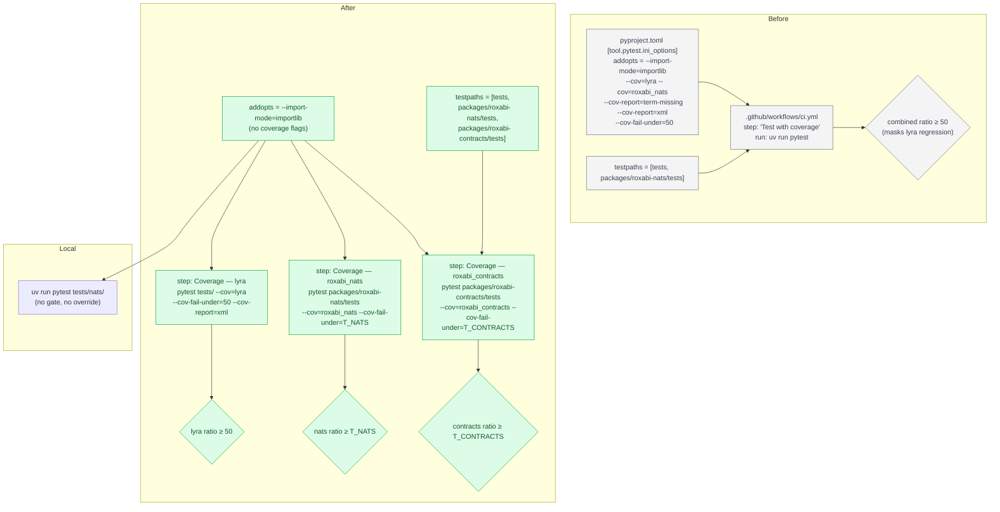
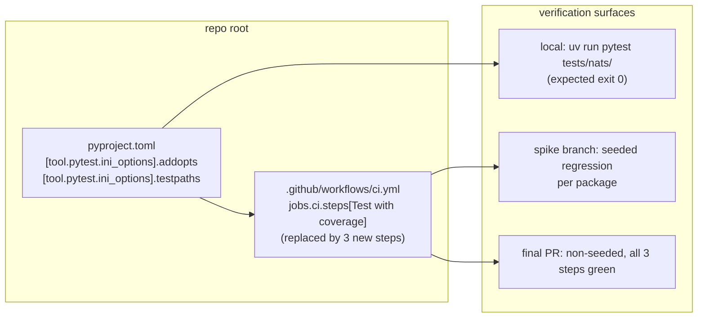

## Summary

Three slices, one PR. V1 strips coverage flags from the root `pyproject.toml` `addopts` and extends `testpaths` to discover the `roxabi-contracts` test directory from the repo root. V2 measures each package's actual per-package coverage on a bare runner (no `nats-server`), pins thresholds accordingly, then replaces the single `Test with coverage` CI step with three independent per-package coverage steps. V3 removes any lingering `--cov-fail-under=0` workarounds and verifies the final non-seeded PR CI is green across all three new steps plus the unchanged `integration` job.

## Architecture

### Data Flow



### File × Function Map



## Agents

| Agent | Task count | Files |
|-------|-----------|-------|
| devops | 5 (T1, T2, T4, T5, T6, T8) | `pyproject.toml`, `.github/workflows/ci.yml`, plus audit grep across repo for T8 |
| tester | 3 (T3, T7, T9) | `tests/nats/` (verify), spike verification run, final PR status check |

T5 is a measurement-driven decision task — threshold values get written into this plan doc and then consumed by T6. Single-session, no need for multiple same-type agents.

## Consistency Report

- Automated gates covered: 7/7 (all spec `- [ ]` success criteria)
- Manual verification items covered: 1/1 (T7 spike verification)
- Uncovered criteria: none
- Tasks without spec backing: none
- Gold plating exemptions applied: 0

Mapping matrix (spec success-criterion → covering task):

| Spec criterion | Covering task(s) |
|---|---|
| SC1: `addopts` no `--cov=*`, `--cov-report=*`, `--cov-fail-under=*` | T1 (edit), T3 (verify no gate trips) |
| SC2: `testpaths` includes `packages/roxabi-contracts/tests` | T2 (edit), T3 (verify contracts collected) |
| SC3: three CI steps named `Coverage — lyra` / `roxabi_nats` / `roxabi_contracts`, old `Test with coverage` removed | T6 (edit) |
| SC4: plan records measured per-package actuals on bare runner | T4 (measure), T5 (pin) |
| SC5: seeded regression in package X fails only step X | T7 (spike verification on throwaway branch) |
| SC6: final non-seeded PR has all 3 coverage steps green AND `integration` job green | T9 (final PR gate) |
| SC7: no `--cov-fail-under=0` workarounds remain | T8 (audit + cleanup) |
| (spec body) targeted `uv run pytest tests/nats/` works without override | T3 |

## Threshold Pinning (filled by T5)

| Package | Proposed | Actual (T4, bare runner) | Pinned (T5) | Policy |
|---|---|---|---|---|
| `lyra` | 50% | <filled by T4> | 50% (policy floor) | Keep current; do not raise. |
| `roxabi_nats` | 70% | <filled by T4> | `min(70, actual − 2)` | Floor at current skip-adjusted actual − 2 pts. |
| `roxabi_contracts` | 80% | <filled by T4; note nats-server skips> | `min(80, actual − 2)` | If actual < 75%, open a follow-up issue per spec Edge Cases to either install `nats-server` in `ci` job or relocate nats-gated tests to `integration`. |

## Micro-Tasks

### Slice V1 — Strip coverage from addopts + extend testpaths

#### Task T1: Remove coverage flags from root `pyproject.toml` `addopts` → devops

- **File:** `pyproject.toml`
- **Snippet (before → after, line ~89):**
  ```toml
  # before:
  addopts = "--import-mode=importlib --cov=lyra --cov=roxabi_nats --cov-report=term-missing --cov-report=xml --cov-fail-under=50"
  # after:
  addopts = "--import-mode=importlib"
  ```
- **Verify:**
  ```bash
  grep -E '^addopts' pyproject.toml
  ```
- **Expected:** exactly `addopts = "--import-mode=importlib"` — no `--cov*` substring.
- **Time:** 2 min
- **Difficulty:** 1
- **Traces:** SC1
- **Phase:** GREEN
- **Depends on:** —

#### Task T2: Extend `testpaths` to include `packages/roxabi-contracts/tests` → devops

- **File:** `pyproject.toml`
- **Snippet (line ~88):**
  ```toml
  # before:
  testpaths = ["tests", "packages/roxabi-nats/tests"]
  # after:
  testpaths = ["tests", "packages/roxabi-nats/tests", "packages/roxabi-contracts/tests"]
  ```
- **Verify:**
  ```bash
  uv run pytest --collect-only -q 2>/dev/null | grep -c "packages/roxabi-contracts/tests"
  ```
- **Expected:** count ≥ 1 (previously 0 when addopts dropped).
- **Time:** 2 min
- **Difficulty:** 1
- **Traces:** SC2
- **Phase:** GREEN
- **Depends on:** T1 (same file, sequential edit)

#### Task T3: RED-GATE V1 — targeted pytest succeeds without override + new testpath clears duplicate-basename gate → tester

- **File:** no file edits — verification-only task
- **Snippet:**
  ```bash
  # (a) the #766 pain: targeted run must succeed with no override
  uv run pytest tests/nats/ -q
  # (b) contracts tests are now collected from the repo root
  uv run pytest --collect-only -q 2>/dev/null | grep -c "packages/roxabi-contracts/tests"
  # (c) new quality gate (per .claude/stack.yml): bare-basename collisions across testpaths
  bash tools/check_duplicate_test_basenames.sh
  ```
- **Verify:** (a) exit 0, (b) ≥ 1, (c) exit 0.
- **Expected:** first command exit 0; second prints ≥ 1; third exits 0 ("no collisions").
- **Time:** 3 min
- **Difficulty:** 1
- **Traces:** SC1 (no gate trips), SC2 (contracts discovered + no collision)
- **Phase:** RED-GATE V1
- **Depends on:** T1, T2

### Slice V2 — Per-package CI coverage steps (measure → pin → edit)

#### Task T4: Measure per-package actual coverage on bare runner → devops

- **File:** no file edits (measurement only; record results in this plan's Threshold Pinning table)
- **Snippet:**
  ```bash
  # Bare runner = no nats-server binary in PATH (matches the ci job)
  command -v nats-server && echo "INSTALLED — unskip this check locally to simulate ci"

  uv run pytest tests/ \
    --cov=lyra --cov-report=term --cov-fail-under=0 -q | tail -5
  uv run pytest packages/roxabi-nats/tests \
    --cov=roxabi_nats --cov-report=term --cov-fail-under=0 -q | tail -5
  uv run pytest packages/roxabi-contracts/tests \
    --cov=roxabi_contracts --cov-report=term --cov-fail-under=0 -q | tail -5
  ```
- **Verify:** each invocation prints a `TOTAL ... NN%` line. Record percentages in the Threshold Pinning table above.
- **Expected:** three numeric `TOTAL` lines; contracts may report lower than local run due to `requires_nats_server` skip — that is the measurement we need.
- **Time:** 5 min
- **Difficulty:** 2
- **Traces:** SC4
- **Phase:** GREEN (measurement)
- **Depends on:** T1, T2 (run after addopts/testpaths are already config-correct so the per-package invocations behave like CI)

#### Task T5: Pin final thresholds in this plan doc → devops

- **File:** `artifacts/plans/795-split-cov-fail-under-per-package-plan.mdx` (this file, Threshold Pinning section)
- **Snippet:** Apply policy `min(proposed, actual − 2)` with floors:
  - `lyra`: always 50% (spec constraint; current ratio is not relevant for raising).
  - `roxabi_nats`: `min(70, nats_actual − 2)` rounded to int.
  - `roxabi_contracts`: `min(80, contracts_actual − 2)` rounded to int. If `contracts_actual < 75%`, open GitHub issue "Install nats-server in ci job OR move nats-gated contracts tests to integration job" and link from this plan doc; still land #795 with the reduced gate.
- **Verify:**
  ```bash
  grep -E '^\| `(lyra|roxabi_nats|roxabi_contracts)`' artifacts/plans/795-split-cov-fail-under-per-package-plan.mdx | grep -vc '<filled'
  ```
- **Expected:** count = 3 (all three rows filled).
- **Time:** 3 min
- **Difficulty:** 1
- **Traces:** SC3 (thresholds), SC4 (actuals recorded)
- **Phase:** GREEN (decision)
- **Depends on:** T4

#### Task T6: Replace CI `Test with coverage` with three per-package steps → devops

- **File:** `.github/workflows/ci.yml`
- **Snippet (replace the existing `Test with coverage` step — currently lines 40–41):**
  ```yaml
  - name: Coverage — lyra
    run: uv run pytest tests/ --cov=lyra --cov-report=term-missing --cov-report=xml --cov-fail-under=50

  - name: Coverage — roxabi_nats
    run: uv run pytest packages/roxabi-nats/tests --cov=roxabi_nats --cov-report=term-missing --cov-fail-under=<T_NATS from T5>

  - name: Coverage — roxabi_contracts
    run: uv run pytest packages/roxabi-contracts/tests --cov=roxabi_contracts --cov-report=term-missing --cov-fail-under=<T_CONTRACTS from T5>
  ```
  Do NOT touch `Test dep-graph sub-project`, `Validate dep-graph schema`, `integration` job, or any other step. The existing single `Test with coverage` step is deleted.
- **Verify:**
  ```bash
  grep -c '^\s*- name: Coverage —' .github/workflows/ci.yml     # expect 3
  grep -c '^\s*- name: Test with coverage$' .github/workflows/ci.yml  # expect 0
  uv run python -c "import yaml; yaml.safe_load(open('.github/workflows/ci.yml')); print('yaml OK')"
  ```
- **Expected:** `3`, `0`, `yaml OK`.
- **Time:** 5 min
- **Difficulty:** 2
- **Traces:** SC3
- **Phase:** GREEN
- **Depends on:** T5

#### Task T7: Spike verification — per-package regression isolates → tester

- **File:** no file edits on the PR branch; uses a throwaway branch off the PR branch (e.g. `795-spike-regression`). Branch is discarded before merge.
- **Snippet:** For each package, in order:
  1. Checkout throwaway branch from the PR branch head.
  2. Introduce a ≥20-statement untested addition to the package:
     - `lyra`: append an untested module `src/lyra/_spike_dead_code.py` with ~30 lines of unreferenced helpers.
     - `roxabi_nats`: same pattern in `packages/roxabi-nats/src/roxabi_nats/_spike_dead_code.py`.
     - `roxabi_contracts`: same pattern in `packages/roxabi-contracts/src/roxabi_contracts/_spike_dead_code.py`.
  3. Push the throwaway branch; observe the CI run.
  4. Record the failing step (must be ONLY the matching `Coverage — <pkg>` step). Screenshot or copy the job URL.
  5. Repeat for the other two packages on fresh throwaway branches.
  6. Delete all throwaway branches.
- **Verify:**
  ```bash
  gh run list --branch 795-spike-regression-lyra --limit 1 \
    --json conclusion,displayTitle,databaseId --jq '.[0]'
  gh run view <id> --json jobs --jq '.jobs[].steps[] | select(.name | startswith("Coverage")) | {name, conclusion}'
  ```
- **Expected:** only the seeded package's step has `conclusion: "failure"`; the other two coverage steps have `conclusion: "success"`. Copy the three run IDs into the PR description.
- **Time:** 15 min
- **Difficulty:** 3
- **Traces:** SC5
- **Phase:** RED-GATE V2 (cross-slice verification)
- **Depends on:** T6

### Slice V3 — Drop #766 workarounds + final PR gate

#### Task T8: Audit and remove `--cov-fail-under=0` workarounds → devops

- **File:** any repo file outside `.venv/` and `artifacts/`
- **Snippet:**
  ```bash
  rg --type-add 'shell:*.sh' \
     -g '!.venv' -g '!artifacts' \
     'cov-fail-under=0'
  ```
  - If hits exist: remove the override at each call site (it is no longer needed once T1 lands). Commit as a separate file-scoped change per caller.
  - If zero hits: record in the plan that this slice is vacuous today (current `staging` has no such overrides; #766 may land them later — if so, a follow-up would re-run T8).
- **Verify:**
  ```bash
  rg -g '!.venv' -g '!artifacts' 'cov-fail-under=0' ; echo "exit=$?"
  ```
- **Expected:** `exit=1` (no matches).
- **Time:** 5 min
- **Difficulty:** 1
- **Traces:** SC7
- **Phase:** GREEN
- **Depends on:** T1 (addopts stripped before workaround removal is safe)

#### Task T9: RED-GATE V3 — final PR CI green → tester

- **File:** no file edits — final PR verification
- **Snippet:**
  ```bash
  # On the PR branch (non-seeded), after push:
  gh pr checks <pr-number> --watch
  # OR
  gh run view <latest-run-id> --json jobs \
    --jq '[.jobs[] | {name, conclusion}] | map(select(.name=="ci" or .name=="integration" or (.name|startswith("Coverage"))))'
  ```
- **Verify:** `ci` job conclusion = `success` (all three `Coverage — *` steps green), `integration` job conclusion = `success`.
- **Expected:** both jobs `success`.
- **Time:** 3 min (modulo CI runtime)
- **Difficulty:** 1
- **Traces:** SC6
- **Phase:** RED-GATE V3 (final)
- **Depends on:** T6, T7, T8

## Task IDs

<!-- Generated by /plan. Used by /implement to resume tasks on session restart. -->
- T1: 12 — Strip coverage flags from pyproject.toml addopts
- T2: 13 — Extend pyproject.toml testpaths to include contracts tests
- T3: 14 — RED-GATE V1: targeted pytest + duplicate-basename gate
- T4: 15 — Measure per-package actual coverage on bare runner
- T5: 16 — Pin final thresholds in plan Threshold Pinning table
- T6: 17 — Replace CI Test with coverage step with 3 per-package coverage steps
- T7: 18 — Spike verification: regression in one package fails only its step
- T8: 19 — Audit and remove --cov-fail-under=0 workarounds
- T9: 20 — RED-GATE V3: final PR CI green on non-seeded branch
