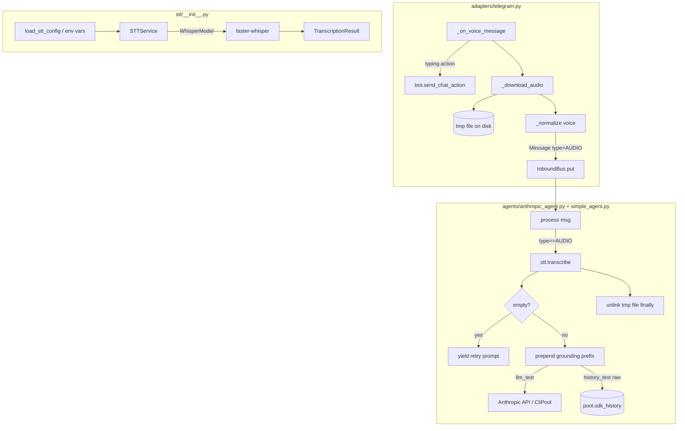

## Summary

Add faster-whisper STT to Lyra's Telegram adapter: intercept voice messages, download to a temp file, transcribe on GPU (CPU fallback), inject the transcript into the existing LLM pipeline with a grounding prefix (stripped from history). 4 sequential slices — adapter (V1), STT service (V2), agent wiring (V3), observability (V4).

---

## Architecture



```mermaid
flowchart LR
    subgraph message["core/message.py"]
        AC[AudioContent<br>url,duration,file_id]
    end

    subgraph stt_module["stt/__init__.py"]
        TR[TranscriptionResult<br>text,language,duration]
        STTS[STTService<br>transcribe]
        STTC[STTConfig<br>model_size,device,compute_type]
        STTS --> TR
        STTC --> STTS
    end

    subgraph telegram_adapter["adapters/telegram.py"]
        ON_VOICE[_on_voice_message]
        DL[_download_audio]
        ON_VOICE --> DL
        DL --> AC
    end

    subgraph agent_base["core/agent.py"]
        AB[AgentBase<br>stt: STTService|None]
    end

    subgraph anthropic["agents/anthropic_agent.py"]
        AA[AnthropicAgent.process]
    end

    subgraph simple["agents/simple_agent.py"]
        SA[SimpleAgent.process]
    end

    subgraph tests["tests/"]
        T_VOICE[test_telegram_voice.py]
        T_STT[test_stt_service.py]
        T_AGENT[test_anthropic_agent.py<br>test_simple_agent.py additions]
    end

    AC --> AA
    AC --> SA
    AA -->|calls| STTS
    SA -->|calls| STTS
    AB --> AA
    AB --> SA
    T_VOICE -.-> ON_VOICE
    T_STT -.-> STTS
    T_AGENT -.-> AA
    T_AGENT -.-> SA
```

---

## Agents

| Agent | Task count | Files |
|-------|-----------|-------|
| backend-dev | 14 | `core/message.py`, `adapters/telegram.py`, `stt/__init__.py`, `core/agent.py`, `agents/anthropic_agent.py`, `agents/simple_agent.py`, `__main__.py` |
| tester | 3 | `tests/adapters/test_telegram_voice.py`, `tests/stt/test_stt_service.py`, `tests/agents/test_anthropic_agent.py` (additions) |
| doc-writer | 2 | `docs/ARCHITECTURE.md` |

---

## Consistency Report

| | Count |
|--|--|
| Spec acceptance criteria | 14 |
| Tasks covering criteria | 14 |
| Uncovered | 0 |
| Untraced tasks | 0 |

All 14 success criteria are traced to at least one task. Criteria SC-1 through SC-14 map to slices V1–V4.

---

## Micro-Tasks

---

### V1 — Voice download + normalize

> **Goal:** Voice messages reach the hub as `MessageType.AUDIO` with a valid temp file path. Typing indicator fires before download.

---

#### T1.1 — Extend AudioContent with `file_id`

- **Description:** Add `file_id: str | None = None` to `AudioContent` in `core/message.py`
- **File:** `src/lyra/core/message.py`
- **Code shape:**
  ```python
  class AudioContent(BaseModel):
      url: str
      duration_seconds: float | None = None
      file_id: str | None = None  # Telegram file_id for debugging
  ```
- **Verify:** `python -c "from lyra.core.message import AudioContent; a = AudioContent(url='/tmp/x.ogg', file_id='BQACAgI…'); assert a.file_id"`
- **Expected:** No error, field accessible
- **Time:** 2 min
- **Parallel-safe:** Y
- **Agent:** backend-dev
- **Spec trace:** Data Model (AudioContent)
- **Slice:** V1
- **Phase:** RED
- **Difficulty:** 1

---

#### T1.2 — `_download_audio()` in TelegramAdapter

- **Description:** Add async `_download_audio(file_id: str, duration: int | None) -> tuple[Path, float | None]` to `TelegramAdapter`. Uses `bot.get_file()` + `bot.download_file()` (aiogram v3), writes to `tempfile.mkstemp(suffix=".ogg")`. Returns `(path, duration_seconds)`.
- **File:** `src/lyra/adapters/telegram.py`
- **Code shape:**
  ```python
  async def _download_audio(self, file_id: str, duration: int | None = None) -> tuple[Path, float | None]:
      file_info = await self.bot.get_file(file_id)
      _, tmp_path = tempfile.mkstemp(suffix=".ogg")
      await self.bot.download_file(file_info.file_path, destination=tmp_path)
      return Path(tmp_path), float(duration) if duration is not None else None
  ```
- **Verify:** Unit test with mock bot (T1.5)
- **Expected:** Returns valid Path and duration
- **Time:** 5 min
- **Parallel-safe:** N (depends on T1.1)
- **Agent:** backend-dev
- **Spec trace:** N1
- **Slice:** V1
- **Phase:** RED
- **Difficulty:** 2

---

#### T1.3 — `_on_voice_message()` handler

- **Description:** Add async `_on_voice_message(msg)` to `TelegramAdapter`. Sends `ChatAction.TYPING` first, then downloads audio, normalises to `Message(type=AUDIO, content=AudioContent(...))`, pushes to hub. Mirrors `_on_message()` circuit-guard logic.
- **File:** `src/lyra/adapters/telegram.py`
- **Code shape:**
  ```python
  async def _on_voice_message(self, msg) -> None:
      if msg.from_user and getattr(msg.from_user, "is_bot", False):
          return
      from aiogram.enums import ChatAction
      await self.bot.send_chat_action(chat_id=msg.chat.id, action=ChatAction.TYPING)
      voice = msg.voice or msg.audio
      path, duration = await self._download_audio(voice.file_id, getattr(voice, "duration", None))
      platform_context = TelegramContext(
          chat_id=msg.chat.id,
          topic_id=msg.message_thread_id,
          is_group=msg.chat.type != "private",
          message_id=getattr(msg, "message_id", None),
      )
      timestamp = msg.date
      if timestamp.tzinfo is None:
          timestamp = timestamp.replace(tzinfo=timezone.utc)
      hub_msg = Message.from_adapter(
          platform=Platform.TELEGRAM,
          bot_id=self._bot_id,
          user_id=f"tg:user:{msg.from_user.id}",
          user_name=msg.from_user.full_name,
          content=AudioContent(url=str(path), duration_seconds=duration, file_id=voice.file_id),
          type=MessageType.AUDIO,
          timestamp=timestamp,
          is_mention=False,
          is_from_bot=False,
          platform_context=platform_context,
      )
      # Hub circuit guard (same as _on_message)
      if self._circuit_registry is not None:
          cb = self._circuit_registry.get("hub")
          if cb is not None and cb.is_open():
              path.unlink(missing_ok=True)
              return
      try:
          self._hub.inbound_bus.put(Platform.TELEGRAM, hub_msg)
      except asyncio.QueueFull:
          path.unlink(missing_ok=True)
  ```
- **Verify:** Unit test T1.5
- **Expected:** Hub receives AUDIO message
- **Time:** 8 min
- **Parallel-safe:** N (depends on T1.2)
- **Agent:** backend-dev
- **Spec trace:** U1, N0, N1, N2
- **Slice:** V1
- **Phase:** RED
- **Difficulty:** 3

---

#### T1.4 — Register voice handler in Dispatcher

- **Description:** In `TelegramAdapter.__init__`, register `_on_voice_message` for voice and audio messages using aiogram filters. Must be registered BEFORE `_on_message` to avoid the generic handler swallowing voice updates.
- **File:** `src/lyra/adapters/telegram.py`
- **Code shape:**
  ```python
  from aiogram import F
  self._dp.message.register(self._on_voice_message, F.voice | F.audio)
  self._dp.message.register(self._on_message)  # must be after
  ```
- **Verify:** `uv run pytest tests/adapters/test_telegram_voice.py -x`
- **Expected:** Tests pass
- **Time:** 3 min
- **Parallel-safe:** N (depends on T1.3)
- **Agent:** backend-dev
- **Spec trace:** U1
- **Slice:** V1
- **Phase:** RED
- **Difficulty:** 1

---

#### T1.5 — Tests: voice download + normalize

- **Description:** Write `tests/adapters/test_telegram_voice.py` with: (a) voice message → hub receives `MessageType.AUDIO`, (b) typing action sent before download, (c) AudioContent has correct `file_id` and `url`, (d) circuit-open → message dropped + temp file cleaned.
- **File:** `tests/adapters/test_telegram_voice.py`
- **Code shape:**
  ```python
  @pytest.mark.asyncio
  async def test_voice_message_normalized_to_audio():
      hub = MagicMock(); hub.inbound_bus = MagicMock()
      adapter = TelegramAdapter(bot_id="main", token="t", hub=hub)
      adapter.bot = AsyncMock()
      adapter.bot.get_file.return_value = SimpleNamespace(file_path="voice/file.ogg")
      adapter.bot.download_file = AsyncMock()
      voice = SimpleNamespace(file_id="ABC123", duration=3)
      msg = make_voice_msg(voice)
      await adapter._on_voice_message(msg)
      call_args = hub.inbound_bus.put.call_args
      hub_msg = call_args[0][1]
      assert hub_msg.type == MessageType.AUDIO
      assert hub_msg.content.file_id == "ABC123"
  ```
- **Verify:** `uv run pytest tests/adapters/test_telegram_voice.py -v`
- **Expected:** All pass
- **Time:** 8 min
- **Parallel-safe:** N (depends on T1.4)
- **Agent:** tester
- **Spec trace:** SC-1, SC-9
- **Slice:** V1
- **Phase:** GREEN
- **Difficulty:** 2

---

**🔴 RED-GATE V1:** `uv run pytest tests/adapters/test_telegram_voice.py -v` → all pass. Hub receives `MessageType.AUDIO`. Typing action called. Temp file created.

---

### V2 — STT service + config

> **Goal:** `STTService.transcribe(path)` returns a `TranscriptionResult`. Config loads from env vars with startup validation.

---

#### T2.1 — `stt/__init__.py`: models + config loader

- **Description:** Create `src/lyra/stt/__init__.py` with `TranscriptionResult` dataclass, `STTConfig` dataclass, `load_stt_config()` from env vars, and `is_whisper_noise()` helper.
- **File:** `src/lyra/stt/__init__.py`
- **Code shape:**
  ```python
  from dataclasses import dataclass
  import os

  WHISPER_NOISE_TOKENS = {"[music]", "[applause]", "[laughter]", "[silence]", "[noise]"}

  @dataclass
  class TranscriptionResult:
      text: str
      language: str
      duration_seconds: float

  @dataclass
  class STTConfig:
      model_size: str = "small"
      device: str = "auto"   # "auto" | "cuda" | "cpu"
      compute_type: str = "auto"  # "auto" | "float16" | "int8"

  def load_stt_config() -> STTConfig:
      return STTConfig(
          model_size=os.environ.get("STT_MODEL_SIZE", "small"),
          device=os.environ.get("STT_DEVICE", "auto"),
          compute_type=os.environ.get("STT_COMPUTE_TYPE", "auto"),
      )

  def is_whisper_noise(text: str) -> bool:
      stripped = text.strip().lower()
      return not stripped or stripped in WHISPER_NOISE_TOKENS
  ```
- **Verify:** `python -c "from lyra.stt import STTConfig, TranscriptionResult, load_stt_config; print(load_stt_config())"`
- **Expected:** No import error, default config printed
- **Time:** 5 min
- **Parallel-safe:** N
- **Agent:** backend-dev
- **Spec trace:** Data Model (STTConfig, TranscriptionResult)
- **Slice:** V2
- **Phase:** RED
- **Difficulty:** 1

---

#### T2.2 — `STTConfig.validate()`

- **Description:** Add `validate()` method to `STTConfig` that raises `ValueError` for invalid device/compute_type combinations: `float16+cpu` and `int8+cuda`.
- **File:** `src/lyra/stt/__init__.py`
- **Code shape:**
  ```python
  def validate(self) -> None:
      if self.device == "cpu" and self.compute_type == "float16":
          raise ValueError("compute_type='float16' requires CUDA — use 'int8' or 'auto' for CPU")
      if self.device == "cuda" and self.compute_type == "int8":
          raise ValueError("compute_type='int8' is CPU-only — use 'float16' or 'auto' for CUDA")
  ```
- **Verify:** Unit test T2.5
- **Expected:** ValueError raised for invalid combos
- **Time:** 3 min
- **Parallel-safe:** N (depends on T2.1)
- **Agent:** backend-dev
- **Spec trace:** SC-11
- **Slice:** V2
- **Phase:** RED
- **Difficulty:** 1

---

#### T2.3 — `STTService.__init__` with lazy model loading

- **Description:** Add `STTService` class to `src/lyra/stt/__init__.py`. Validates config at init. Resolves `device="auto"` by attempting `torch.cuda.is_available()`. Loads WhisperModel lazily on first `transcribe()` call.
- **File:** `src/lyra/stt/__init__.py`
- **Code shape:**
  ```python
  class STTService:
      def __init__(self, config: STTConfig) -> None:
          config.validate()
          self._config = config
          self._model = None
          # Resolve "auto" device
          if config.device == "auto":
              try:
                  import torch
                  self._device = "cuda" if torch.cuda.is_available() else "cpu"
              except ImportError:
                  self._device = "cpu"
          else:
              self._device = config.device
          # Resolve "auto" compute_type
          self._compute_type = (
              "float16" if self._device == "cuda" else "int8"
          ) if config.compute_type == "auto" else config.compute_type

      def _load_model(self):
          if self._model is None:
              from faster_whisper import WhisperModel
              self._model = WhisperModel(
                  self._config.model_size,
                  device=self._device,
                  compute_type=self._compute_type,
              )
          return self._model
  ```
- **Verify:** `STTService(STTConfig())` constructs without error in test (model not loaded)
- **Expected:** No error
- **Time:** 5 min
- **Parallel-safe:** N (depends on T2.2)
- **Agent:** backend-dev
- **Spec trace:** Data Model (STTConfig constraints)
- **Slice:** V2
- **Phase:** RED
- **Difficulty:** 2

---

#### T2.4 — `STTService.transcribe(path)`

- **Description:** Implement `async transcribe(path: Path | str) -> TranscriptionResult`. Runs in `asyncio.get_event_loop().run_in_executor(None, ...)`. Loads model lazily. Joins all segment texts. Returns `TranscriptionResult`. Language detected from first segment. Logging happens here (moved to V4 task T4.1 for INFO log, but basic debug logging here).
- **File:** `src/lyra/stt/__init__.py`
- **Code shape:**
  ```python
  async def transcribe(self, path: Path | str) -> TranscriptionResult:
      import asyncio
      loop = asyncio.get_event_loop()
      result = await loop.run_in_executor(None, self._transcribe_sync, str(path))
      return result

  def _transcribe_sync(self, path: str) -> TranscriptionResult:
      model = self._load_model()
      segments, info = model.transcribe(path, beam_size=5)
      texts = [seg.text for seg in segments]
      full_text = "".join(texts).strip()
      return TranscriptionResult(
          text=full_text,
          language=info.language,
          duration_seconds=info.duration,
      )
  ```
- **Verify:** Unit test T2.5
- **Expected:** Returns TranscriptionResult with text + language
- **Time:** 8 min
- **Parallel-safe:** N (depends on T2.3)
- **Agent:** backend-dev
- **Spec trace:** N5, SC-3, SC-4
- **Slice:** V2
- **Phase:** RED
- **Difficulty:** 3

---

#### T2.5 — Tests: STTService

- **Description:** Write `tests/stt/test_stt_service.py`. Tests: (a) GPU→CPU fallback when torch.cuda unavailable, (b) empty transcript detection via `is_whisper_noise`, (c) `STTConfig.validate()` raises on invalid combos, (d) `transcribe()` joins segments correctly (mock WhisperModel).
- **File:** `tests/stt/test_stt_service.py` (also create `tests/stt/__init__.py`)
- **Code shape:**
  ```python
  def test_config_validate_float16_cpu_raises():
      with pytest.raises(ValueError, match="float16"):
          STTConfig(device="cpu", compute_type="float16").validate()

  @pytest.mark.asyncio
  async def test_transcribe_joins_segments(mock_whisper_model):
      svc = STTService(STTConfig())
      svc._model = mock_whisper_model  # inject mock
      result = await svc.transcribe("/tmp/fake.ogg")
      assert result.text == "Hello world"
      assert result.language == "en"
  ```
- **Verify:** `uv run pytest tests/stt/ -v`
- **Expected:** All pass
- **Time:** 8 min
- **Parallel-safe:** N (depends on T2.4)
- **Agent:** tester
- **Spec trace:** SC-4, SC-11
- **Slice:** V2
- **Phase:** GREEN
- **Difficulty:** 2

---

**🔴 RED-GATE V2:** `uv run pytest tests/stt/ -v` → all pass. Config validation raises. Transcription joins segments.

---

### V3 — Agent integration + cleanup

> **Goal:** AUDIO messages are transcribed, prefixed for grounding, injected into LLM. Prefix stripped from history. Temp file always deleted. Error and empty-transcript paths handled.

---

#### T3.1 — Add `stt` to `AgentBase.__init__`

- **Description:** Add `stt: STTService | None = None` as optional keyword argument to `AgentBase.__init__()` in `core/agent.py`. Store as `self._stt`.
- **File:** `src/lyra/core/agent.py`
- **Code shape:**
  ```python
  def __init__(
      self,
      config: Agent,
      circuit_registry: CircuitRegistry | None = None,
      admin_user_ids: set[str] | None = None,
      msg_manager: MessageManager | None = None,
      stt: "STTService | None" = None,
  ) -> None:
      ...
      self._stt = stt
  ```
- **Verify:** Import test
- **Expected:** No error
- **Time:** 3 min
- **Parallel-safe:** N
- **Agent:** backend-dev
- **Spec trace:** N4
- **Slice:** V3
- **Phase:** RED
- **Difficulty:** 1

---

#### T3.2 — AUDIO branch in `AnthropicAgent.__init__` + `process()`

- **Description:** (a) Accept `stt` in `AnthropicAgent.__init__` and pass to `super()`. (b) Add AUDIO pre-processing block in `process()` before `extract_text()`: transcribe in `try/finally` (cleanup in finally), empty check (yield retry prompt + return), prefix for LLM, raw for history. Use two text vars: `llm_text` (with prefix) and `history_text` (raw, stored in `new_messages[0]`).
- **File:** `src/lyra/agents/anthropic_agent.py`
- **Code shape:**
  ```python
  # At top of process():
  tmp_path: Path | None = None
  try:
      if msg.type == MessageType.AUDIO and self._stt is not None:
          tmp_path = Path(msg.content.url)
          result = await self._stt.transcribe(tmp_path)
          if is_whisper_noise(result.text):
              yield "I couldn't make out your voice message, please try again."
              return
          llm_text = f"🎤 [transcribed]: {result.text}"
          history_text = result.text
      else:
          llm_text = history_text = extract_text(msg)
      messages = self._build_messages(llm_text, pool)
      new_messages: list[dict[str, Any]] = [{"role": "user", "content": history_text}]
      # ... rest of existing LLM loop unchanged ...
  except Exception:
      log.exception("...")
      raise
  finally:
      if tmp_path:
          tmp_path.unlink(missing_ok=True)
      if len(new_messages) > 1:
          pool.extend_sdk_history(new_messages)
  ```
- **Verify:** `uv run pytest tests/agents/test_anthropic_agent.py -v`
- **Expected:** Existing tests pass + new voice tests pass
- **Time:** 10 min
- **Parallel-safe:** N (depends on T3.1)
- **Agent:** backend-dev
- **Spec trace:** N4, N6, N7, S1, E1, C1, SC-2, SC-3, SC-5, SC-6
- **Slice:** V3
- **Phase:** RED
- **Difficulty:** 4

---

#### T3.3 — AUDIO branch in `SimpleAgent.process()`

- **Description:** Accept `stt` in `SimpleAgent.__init__`, pass to `super()`. Add AUDIO branch at top of `process()`: transcribe in `try/finally`, empty check returns retry `Response`, prefix + pass to CLI. SimpleAgent doesn't manage sdk_history directly so grounding prefix goes into CLI context (no stripping needed).
- **File:** `src/lyra/agents/simple_agent.py`
- **Code shape:**
  ```python
  if msg.type == MessageType.AUDIO and self._stt is not None:
      tmp_path = Path(msg.content.url)
      try:
          result = await self._stt.transcribe(tmp_path)
      except Exception:
          log.exception("STT failed in SimpleAgent")
          return Response(content="Sorry, I couldn't transcribe your voice message.", metadata={"error": True})
      finally:
          tmp_path.unlink(missing_ok=True)
      if is_whisper_noise(result.text):
          return Response(content="I couldn't make out your voice message, please try again.")
      text = f"🎤 [transcribed]: {result.text}"
  else:
      text = extract_text(msg)
  ```
- **Verify:** `uv run pytest tests/agents/test_simple_agent.py -v`
- **Expected:** Existing tests pass
- **Time:** 8 min
- **Parallel-safe:** N (depends on T3.1)
- **Agent:** backend-dev
- **Spec trace:** N4, N6, N7, S1, E1, C1
- **Slice:** V3
- **Phase:** RED
- **Difficulty:** 3

---

#### T3.4 — Wire `STTService` in `__main__.py`

- **Description:** In `__main__.py`, import `load_stt_config`, `STTService`, create instance, pass to agent constructors. Validate config at startup (raises `ValueError` → clean exit with message).
- **File:** `src/lyra/__main__.py`
- **Code shape:**
  ```python
  from lyra.stt import STTService, load_stt_config
  stt_config = load_stt_config()
  stt_config.validate()  # fail fast on invalid env var combo
  stt_service = STTService(stt_config)
  # ... pass stt=stt_service to AnthropicAgent / SimpleAgent constructors
  ```
- **Verify:** `uv run python -m lyra --help` (startup, no crash)
- **Expected:** No error with default env vars
- **Time:** 5 min
- **Parallel-safe:** N (depends on T3.2, T3.3)
- **Agent:** backend-dev
- **Spec trace:** SC-7, SC-11
- **Slice:** V3
- **Phase:** RED
- **Difficulty:** 2

---

#### T3.5 — Integration tests: voice → reply

- **Description:** Extend `tests/agents/test_anthropic_agent.py` with: (a) voice msg → LLM receives grounded text, (b) prefix absent from `pool.sdk_history`, (c) empty transcript → retry prompt yielded, (d) STT exception → error reply, (e) temp file deleted in all paths.
- **File:** `tests/agents/test_anthropic_agent.py` (additions)
- **Code shape:**
  ```python
  @pytest.mark.asyncio
  async def test_voice_transcript_grounded_prefix_stripped_from_history():
      stt = AsyncMock(); stt.transcribe.return_value = TranscriptionResult("Hello", "en", 2.0)
      agent = AnthropicAgent(config, stt=stt)
      # ... assert LLM called with "🎤 [transcribed]: Hello"
      # ... assert pool.sdk_history[0]["content"] == "Hello"

  @pytest.mark.asyncio
  async def test_empty_transcript_returns_retry():
      stt = AsyncMock(); stt.transcribe.return_value = TranscriptionResult("", "en", 0.5)
      agent = AnthropicAgent(config, stt=stt)
      chunks = [c async for c in agent.process(audio_msg, pool)]
      assert "couldn't make out" in "".join(chunks)
  ```
- **Verify:** `uv run pytest tests/agents/ -v`
- **Expected:** All pass
- **Time:** 10 min
- **Parallel-safe:** N (depends on T3.4)
- **Agent:** tester
- **Spec trace:** SC-1, SC-2, SC-4, SC-5, SC-6, SC-9
- **Slice:** V3
- **Phase:** GREEN
- **Difficulty:** 3

---

**🔴 RED-GATE V3:** `uv run pytest tests/ -v` → all pass. Voice → LLM reply. Prefix stripped from history. Tmp file deleted.

---

### V4 — Observability + docs

> **Goal:** Language and duration logged per transcription. VRAM budget documented.

---

#### T4.1 — INFO logging in `STTService.transcribe()`

- **Description:** Add `log.info("STT: lang=%s dur=%.1fs text_len=%d", result.language, result.duration_seconds, len(result.text))` after building `TranscriptionResult` in `_transcribe_sync`. Import `logging` at module top.
- **File:** `src/lyra/stt/__init__.py`
- **Code shape:**
  ```python
  import logging
  log = logging.getLogger(__name__)
  # ... in _transcribe_sync after building result:
  log.info("STT: lang=%s dur=%.1fs text_len=%d", result.language, result.duration_seconds, len(result.text))
  ```
- **Verify:** `uv run pytest tests/stt/ -v -s` → INFO line visible in logs
- **Expected:** Log line present
- **Time:** 2 min
- **Parallel-safe:** Y
- **Agent:** backend-dev
- **Spec trace:** SC-12
- **Slice:** V4
- **Phase:** REFACTOR
- **Difficulty:** 1

---

#### T4.2 — Document VRAM budget in ARCHITECTURE.md

- **Description:** Add `### Voice STT (faster-whisper)` subsection to the models/infrastructure section of `docs/ARCHITECTURE.md`. Document: model sizes + VRAM, device fallback behavior, env vars.
- **File:** `docs/ARCHITECTURE.md`
- **Code shape:**
  ```markdown
  ### Voice STT (faster-whisper)

  | Model | VRAM | Notes |
  |-------|------|-------|
  | `tiny` | ~200 MB | Low accuracy |
  | `small` | ~1 GB | **Default** — good accuracy/speed trade-off |
  | `medium` | ~2.5 GB | Higher accuracy |
  | `large-v3` | ~6 GB | Best accuracy |

  **Env vars:** `STT_MODEL_SIZE` (default: `small`), `STT_DEVICE` (default: `auto`), `STT_COMPUTE_TYPE` (default: `auto`)
  **Device fallback:** `auto` → CUDA if available, else CPU. `float16` on CUDA, `int8` on CPU.
  ```
- **Verify:** File contains VRAM table, `uv run ruff format .` clean
- **Expected:** Documentation present
- **Time:** 5 min
- **Parallel-safe:** Y
- **Agent:** doc-writer
- **Spec trace:** SC-10, SC-14
- **Slice:** V4
- **Phase:** REFACTOR
- **Difficulty:** 1

---

**🔴 RED-GATE V4:** `uv run pytest tests/ -v` → all pass. ARCHITECTURE.md has VRAM table. STT logs at INFO.
