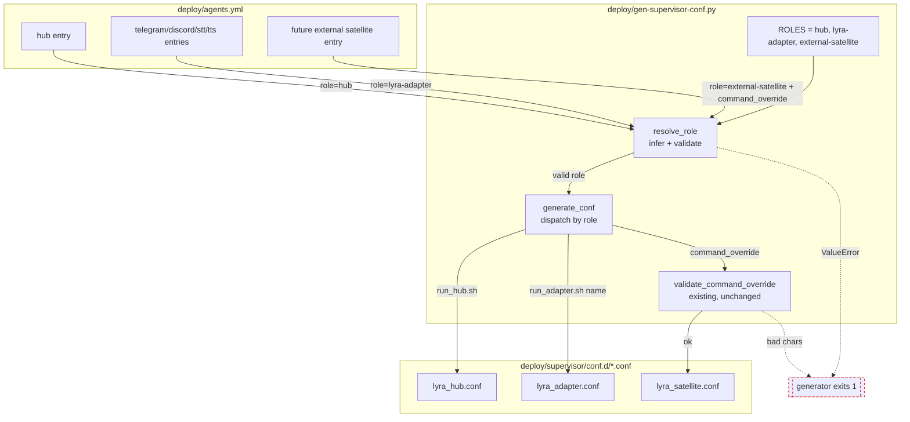
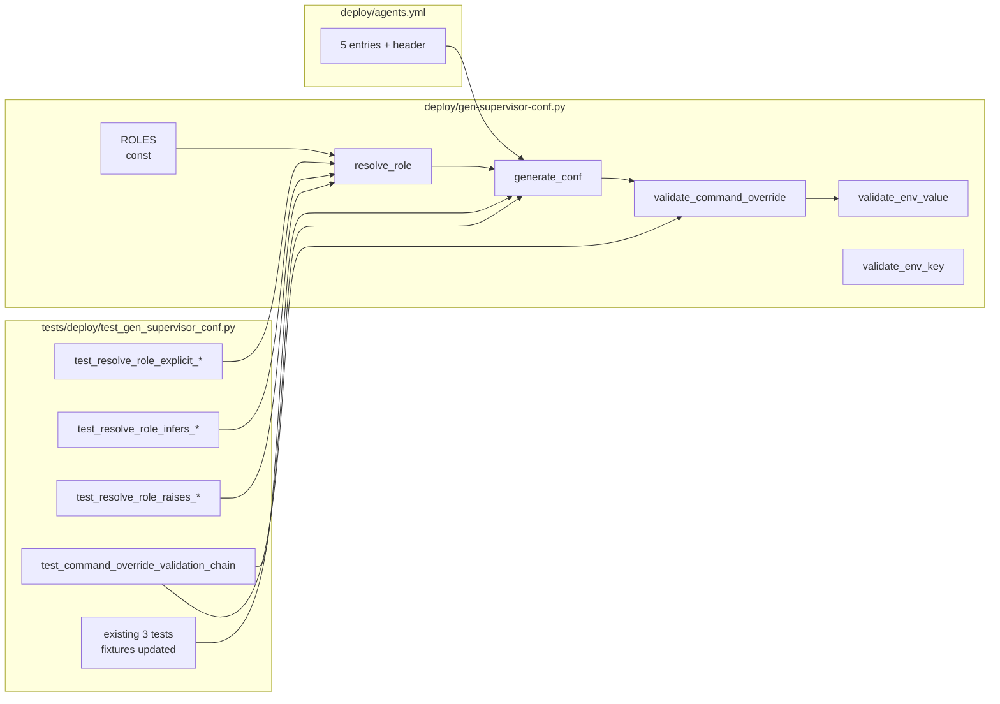

## Summary

Replace the 3-branch launcher dispatch in `deploy/gen-supervisor-conf.py` with a role-keyed dispatch driven by a new `resolve_role(name, agent)` function that combines inference and full validation. Add 11 tests, migrate `deploy/agents.yml` to explicit `role:` lines + header comment. Output of `make gen-conf` must be byte-identical to pre-change.

## Architecture

### Data flow



### File × Function map



## Bootstrap Context

- Existing tests use `subprocess.run([python, SCRIPT, "--dry-run", "--agents-file", tmp])` with temp YAML fixtures. Helper: `_write_agents(tmp_path, agents) → Path`. Pattern: `_run_dry(p, expect_fail=True)` returns stderr.
- Existing validator pattern: module-level `validate_*(value) -> bool` + inline `raise ValueError(f"... ({name!r}): ...")` in `generate_conf`.
- `gen-supervisor-conf.py` uses hyphen in filename → imported for tests via `subprocess`, never as a module. Keep it that way.
- `agents.yml` entries carry a `command:` field that is DEAD (not consumed by generator) — do NOT confuse with `command_override`.
- `make gen-conf` is the entrypoint; CI greens on `git diff --exit-code` against conf.d/*.conf, so byte-identical output is load-bearing.

## Agents

| Agent | Task count | Files |
|-------|-----------|-------|
| devops | 4 | `deploy/gen-supervisor-conf.py`, `deploy/agents.yml` |
| tester | 5 | `tests/deploy/test_gen_supervisor_conf.py` |

## Consistency Report

| Spec criterion | Covered by |
|---|---|
| SC-1 `ROLES` closed set of 3 | T1 |
| SC-2 `resolve_role` returns/infers | T2 |
| SC-3 unknown role `ValueError` | T2, T5 |
| SC-4 external-satellite without override → `ValueError` | T2, T5 |
| SC-5 lyra-adapter with override → `ValueError` | T2, T5 |
| SC-6 hub on wrong name → `ValueError` | T2, T5 |
| SC-7 validation lives in `resolve_role` | T2 |
| SC-8 `generate_conf` dispatches via role | T3 |
| SC-9 `validate_command_override` still called on external-satellite | T3, T7 |
| SC-10 byte-identical output | T3 (manual diff), T9 (final check) |
| SC-11 all 5 entries have explicit `role:` | T9 |
| SC-12 header comment canonical wording | T10 |
| SC-13 exact test function count (3+4+3+1=11) | T4, T5, T6, T7 |
| SC-14 existing 3 tests remain green | T8 |

Covered: 14 / 14. Untraced: 0. Exemptions: 0.

## Micro-Tasks

### V1 — Resolver with full validation (spec slice 1)

#### T1 [GREEN] Add `ROLES` constant + `HUB_NAME` [P] — devops — SC-1, difficulty 1, ~3 min

**File:** `deploy/gen-supervisor-conf.py`

**Shape:**
```python
# Insert after validate_command_override(), before DEFAULTS block
HUB_NAME = "hub"
ROLES: frozenset[str] = frozenset({"hub", "lyra-adapter", "external-satellite"})
```

**Verify:**
```bash
uv run python -c "import sys; sys.path.insert(0, 'deploy'); \
  exec(open('deploy/gen-supervisor-conf.py').read().split('def main')[0]); \
  assert ROLES == frozenset({'hub', 'lyra-adapter', 'external-satellite'}); \
  assert HUB_NAME == 'hub'; print('ok')"
```
Expected: `ok`

---

#### T2 [GREEN] Implement `resolve_role(name, agent)` — devops — SC-2,3,4,5,6,7, difficulty 3, ~8 min — depends on T1

**File:** `deploy/gen-supervisor-conf.py`

**Shape:**
```python
def resolve_role(name: str, agent: dict[str, Any]) -> str:
    """Resolve + validate the launcher-dispatch role for an agent entry.

    If `role` is present, validate it is in ROLES and that cross-checks hold.
    If absent, infer: command_override present → external-satellite; else
    name == HUB_NAME → hub; else → lyra-adapter.

    Raises ValueError with agent name on any misconfig.
    """
    has_override = "command_override" in agent
    if "role" in agent:
        role = agent["role"]
        if role not in ROLES:
            raise ValueError(
                f"unknown role {role!r} (agent {name!r}); "
                f"expected one of: {', '.join(sorted(ROLES))}"
            )
        if role == "external-satellite" and not has_override:
            raise ValueError(
                f"role=external-satellite requires command_override (agent {name!r})"
            )
        if role == "lyra-adapter" and has_override:
            raise ValueError(
                f"role=lyra-adapter must not set command_override (agent {name!r})"
            )
        if role == "hub" and name != HUB_NAME:
            raise ValueError(
                f"role=hub requires name=={HUB_NAME!r} (got {name!r})"
            )
        return role
    # Inference fallback (intentionally retained for backward-compat, see #807 spec)
    if has_override:
        return "external-satellite"
    if name == HUB_NAME:
        return "hub"
    return "lyra-adapter"
```

**Verify:** (smoke via interactive)
```bash
uv run python -c "
import importlib.util, sys
spec = importlib.util.spec_from_file_location('g', 'deploy/gen-supervisor-conf.py')
m = importlib.util.module_from_spec(spec); spec.loader.exec_module(m)
assert m.resolve_role('hub', {}) == 'hub'
assert m.resolve_role('telegram', {}) == 'lyra-adapter'
assert m.resolve_role('sat', {'command_override': 'x'}) == 'external-satellite'
try: m.resolve_role('x', {'role': 'bad'}); assert False
except ValueError as e: assert 'unknown role' in str(e)
try: m.resolve_role('x', {'role': 'external-satellite'}); assert False
except ValueError as e: assert 'requires command_override' in str(e)
try: m.resolve_role('tg', {'role': 'lyra-adapter', 'command_override': 'x'}); assert False
except ValueError as e: assert 'must not set' in str(e)
try: m.resolve_role('notHub', {'role': 'hub'}); assert False
except ValueError as e: assert 'name==' in str(e)
print('ok')
"
```
Expected: `ok`

---

### V2 — Wire `generate_conf` dispatch (spec slice 2)

#### T3 [REFACTOR] Replace 3-branch if/elif with role-keyed dispatch — devops — SC-8,9, difficulty 3, ~8 min — depends on T2

**File:** `deploy/gen-supervisor-conf.py`

**Shape:** (replace lines 114–128 of current `generate_conf`)
```python
role = resolve_role(name, agent)

if role == "external-satellite":
    cmd_path = agent["command_override"]
    if not validate_command_override(cmd_path):
        raise ValueError(
            f"Invalid command_override for {name!r} (shell-metachar or empty): {cmd_path!r}"
        )
elif role == "hub":
    cmd_path = RUN_HUB.format(home=ctx["home"])
else:  # lyra-adapter
    cmd_path = f"{RUN_ADAPTER.format(home=ctx['home'])} {name}"
```

**Verify:**
```bash
# Byte-identical generation against CURRENT agents.yml (no role: fields yet)
mkdir -p /tmp/807-conf-a /tmp/807-conf-b
git show staging:deploy/gen-supervisor-conf.py > /tmp/807-gen-pre.py
# Baseline
uv run python /tmp/807-gen-pre.py --output /tmp/807-conf-a >/dev/null
# New
uv run python deploy/gen-supervisor-conf.py --output /tmp/807-conf-b >/dev/null
diff -rq /tmp/807-conf-a /tmp/807-conf-b
```
Expected: (empty stdout — no differences)

---

### V3 — Test coverage (spec slice 3)

#### T4 [RED→GREEN] Add 3 happy-path tests [P] — tester — SC-13, difficulty 2, ~6 min — depends on T3

**File:** `tests/deploy/test_gen_supervisor_conf.py`

**Shape:**
```python
def test_resolve_role_explicit_hub(tmp_path: Path) -> None:
    p = _write_agents(tmp_path, {"hub": {"role": "hub", "priority": 100}})
    out = _run_dry(p)
    assert "run_hub.sh" in out

def test_resolve_role_explicit_lyra_adapter(tmp_path: Path) -> None:
    p = _write_agents(tmp_path, {"telegram": {"role": "lyra-adapter", "priority": 200}})
    out = _run_dry(p)
    assert "run_adapter.sh telegram" in out

def test_resolve_role_explicit_external_satellite(tmp_path: Path) -> None:
    p = _write_agents(tmp_path, {
        "sat": {"role": "external-satellite", "command_override": "foo bar", "priority": 200}
    })
    out = _run_dry(p)
    assert "command=foo bar" in out
```

**Verify:** `uv run pytest tests/deploy/test_gen_supervisor_conf.py -k "resolve_role_explicit" -v`
Expected: 3 passed

---

#### T5 [RED→GREEN] Add 4 error-case tests [P] — tester — SC-13, difficulty 2, ~8 min — depends on T3

**File:** `tests/deploy/test_gen_supervisor_conf.py`

**Shape:**
```python
def test_resolve_role_raises_on_unknown_value(tmp_path: Path) -> None:
    p = _write_agents(tmp_path, {"x": {"role": "adapter"}})
    err = _run_dry(p, expect_fail=True)
    assert "unknown role 'adapter'" in err and "agent 'x'" in err

def test_resolve_role_raises_external_satellite_without_override(tmp_path: Path) -> None:
    p = _write_agents(tmp_path, {"sat": {"role": "external-satellite"}})
    err = _run_dry(p, expect_fail=True)
    assert "requires command_override" in err and "agent 'sat'" in err

def test_resolve_role_raises_lyra_adapter_with_override(tmp_path: Path) -> None:
    p = _write_agents(tmp_path, {
        "telegram": {"role": "lyra-adapter", "command_override": "x"}
    })
    err = _run_dry(p, expect_fail=True)
    assert "must not set command_override" in err and "agent 'telegram'" in err

def test_resolve_role_raises_hub_on_wrong_name(tmp_path: Path) -> None:
    p = _write_agents(tmp_path, {"side_hub": {"role": "hub"}})
    err = _run_dry(p, expect_fail=True)
    assert "name=='hub'" in err and "got 'side_hub'" in err
```

**Verify:** `uv run pytest tests/deploy/test_gen_supervisor_conf.py -k "resolve_role_raises" -v`
Expected: 4 passed

---

#### T6 [RED→GREEN] Add 3 inference-when-absent tests [P] — tester — SC-13, difficulty 2, ~6 min — depends on T3

**File:** `tests/deploy/test_gen_supervisor_conf.py`

**Shape:**
```python
def test_resolve_role_infers_hub_from_name(tmp_path: Path) -> None:
    p = _write_agents(tmp_path, {"hub": {"priority": 100}})
    out = _run_dry(p)
    assert "run_hub.sh" in out and "run_adapter.sh hub" not in out

def test_resolve_role_infers_lyra_adapter_default(tmp_path: Path) -> None:
    p = _write_agents(tmp_path, {"telegram": {"priority": 200}})
    out = _run_dry(p)
    assert "run_adapter.sh telegram" in out

def test_resolve_role_infers_external_satellite_from_command_override(tmp_path: Path) -> None:
    p = _write_agents(tmp_path, {
        "sat": {"command_override": "foo bar", "priority": 200}
    })
    out = _run_dry(p)
    assert "command=foo bar" in out
```

**Verify:** `uv run pytest tests/deploy/test_gen_supervisor_conf.py -k "resolve_role_infers" -v`
Expected: 3 passed

---

#### T7 [RED→GREEN] Add `validate_command_override` pass-through test [P] — tester — SC-9,13, difficulty 2, ~4 min — depends on T3

**File:** `tests/deploy/test_gen_supervisor_conf.py`

**Shape:**
```python
def test_command_override_validation_chain_still_enforced(tmp_path: Path) -> None:
    # A valid role but a garbage command_override must still raise via
    # validate_command_override — the refactor must not bypass that guard.
    p = _write_agents(tmp_path, {
        "sat": {"role": "external-satellite", "command_override": "foo; rm -rf /"}
    })
    err = _run_dry(p, expect_fail=True)
    assert "Invalid command_override" in err and "'sat'" in err
```

**Verify:** `uv run pytest tests/deploy/test_gen_supervisor_conf.py::test_command_override_validation_chain_still_enforced -v`
Expected: 1 passed

---

#### T8 [REFACTOR] Verify existing 3 tests still green (no fixture changes expected) — tester — SC-14, difficulty 1, ~2 min — depends on T3

**File:** `tests/deploy/test_gen_supervisor_conf.py` (no edit unless needed)

**Shape:** (no code change expected — fixtures have no `role:` and rely on inference, which we preserved)

**Verify:** `uv run pytest tests/deploy/test_gen_supervisor_conf.py -k "test_command_override_used_verbatim or test_fallback_run_hub_for_hub_name or test_fallback_run_adapter_for_other_names" -v`
Expected: 3 passed

---

#### V3-RED-GATE — all slice 3 tests (11 new + 3 existing) pass

```bash
uv run pytest tests/deploy/test_gen_supervisor_conf.py -v
```
Expected: 14 passed. Blocks V4.

---

### V4 — Migrate `agents.yml` (spec slice 4)

#### T9 [GREEN] Add explicit `role:` to all 5 entries — devops — SC-11, difficulty 1, ~3 min — depends on V3-RED-GATE

**File:** `deploy/agents.yml`

**Shape:** (add `role:` as first field after map key, before `command:`)
```yaml
agents:
  hub:
    role: hub
    command: lyra hub
    ...
  telegram:
    role: lyra-adapter
    command: lyra adapter telegram
    ...
  # discord, stt, tts → same shape with role: lyra-adapter
```

**Verify:**
```bash
# Must round-trip byte-identical
uv run deploy/gen-supervisor-conf.py --output /tmp/807-conf-final >/dev/null
diff -rq /tmp/807-conf-a /tmp/807-conf-final
```
Expected: (empty stdout)

---

#### T10 [GREEN] Add header comment with canonical wording — devops — SC-12, difficulty 1, ~2 min — depends on T9

**File:** `deploy/agents.yml`

**Shape:** (insert after line 4 `schema_version: "1.0"` block, before `defaults:`)
```yaml
# Per-entry `role:` controls launcher dispatch in deploy/gen-supervisor-conf.py:
#   role: hub                 → run_hub.sh (name must be 'hub')
#   role: lyra-adapter        → run_adapter.sh <name> (default)
#   role: external-satellite  → command_override (required on the entry)
# Optional — inferred when absent; see resolve_role in gen-supervisor-conf.py.
```

**Verify:**
```bash
grep -c "role: hub" deploy/agents.yml
grep -c "role: lyra-adapter" deploy/agents.yml
grep -c "role: external-satellite" deploy/agents.yml
grep -q "resolve_role in gen-supervisor-conf.py" deploy/agents.yml && echo comment-ok
```
Expected: `1`, `4`, `1` (satellite only in comment), `comment-ok`

---

#### V4-RED-GATE — full suite green + generator idempotent

```bash
uv run pytest tests/deploy/ -v
uv run deploy/gen-supervisor-conf.py --output /tmp/807-idem-a >/dev/null
uv run deploy/gen-supervisor-conf.py --output /tmp/807-idem-b >/dev/null
diff -rq /tmp/807-idem-a /tmp/807-idem-b
diff -rq /tmp/807-conf-a /tmp/807-idem-a  # vs pre-change baseline
```
Expected: all green, both diffs empty.

## Task IDs

<!-- Generated by /plan. Used by /implement to resume tasks on session restart. -->
- T1: 12 — Add ROLES constant + HUB_NAME to gen-supervisor-conf.py
- T2: 13 — Implement resolve_role(name, agent) with inference + validation
- T3: 14 — Replace 3-branch if/elif in generate_conf with role-keyed dispatch
- T4: 15 — Add 3 happy-path tests (test_resolve_role_explicit_*)
- T5: 16 — Add 4 error-case tests (test_resolve_role_raises_*)
- T6: 17 — Add 3 inference-when-absent tests (test_resolve_role_infers_*)
- T7: 18 — Add validate_command_override pass-through test
- T8: 19 — Verify existing 3 tests still green (no fixture edits expected)
- T9: 20 — Migrate deploy/agents.yml — add explicit role: to all 5 entries
- T10: 21 — Add canonical header comment to agents.yml
