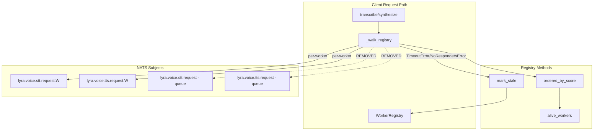
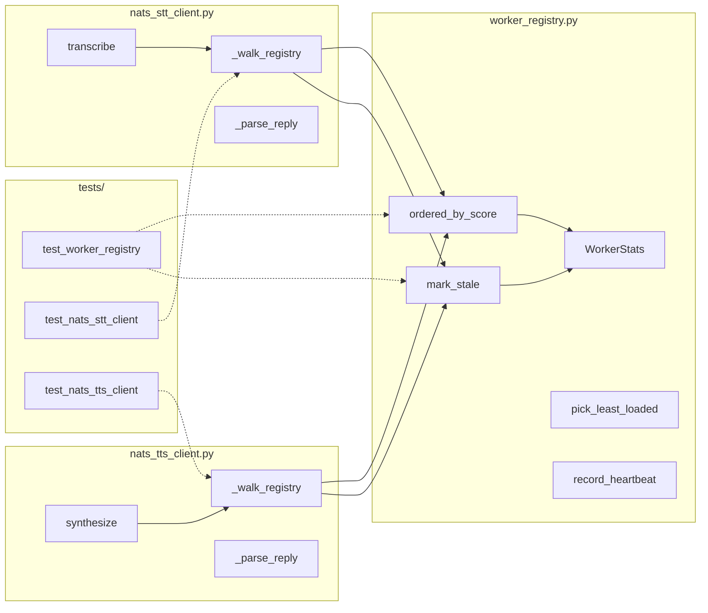

## Summary

Replace the dual load-balancer (registry + NATS queue-group fallback) with a single registry-authoritative routing strategy. On failure, clients walk the registry-ordered candidate list themselves, evicting bad workers immediately. Four slices: registry primitives → STT walk → TTS walk (parallel after V1) → ADR.

## Architecture

### Data Flow



### File × Function Map



## Agents

| Agent | Tasks | Files |
|-------|-------|-------|
| backend-dev | 5 | `src/lyra/nats/worker_registry.py`, `src/lyra/nats/nats_stt_client.py`, `src/lyra/nats/nats_tts_client.py` |
| tester | 4 | `tests/nats/test_worker_registry.py`, `tests/nats/test_nats_stt_client.py`, `tests/nats/test_nats_tts_client.py` |
| doc-writer | 1 | `docs/architecture/adr/NNN-voice-registry-authoritative-routing.mdx` |

## Consistency Report

- Criteria covered: 17/17
- Uncovered criteria: none
- Tasks without spec backing: none
- Gold plating exemptions applied: 0

## Micro-Tasks

### Slice V1: Registry primitives

#### Task 1: Add `ordered_by_score()` method → backend-dev
- **File:** `src/lyra/nats/worker_registry.py`
- **Snippet:**
```python
def ordered_by_score(self) -> list[WorkerStats]:
    """Return alive workers sorted ascending by (score, worker_id)."""
    alive = self.alive_workers()
    return sorted(alive, key=lambda w: (self.score(w), w.worker_id))
```
- **Verify:** `uv run pytest tests/nats/test_worker_registry.py -v` (deferred)
- **Expected:** Tests for `ordered_by_score` pass
- **Time:** 3 min
- **Difficulty:** 2
- **Traces:** SC-1, R1
- **Phase:** GREEN

#### Task 2: Add `mark_stale()` method → backend-dev
- **File:** `src/lyra/nats/worker_registry.py`
- **Snippet:**
```python
def mark_stale(self, worker_id: str) -> None:
    """Idempotently evict a worker until next heartbeat.
    
    Mutates last_heartbeat in place (does NOT delete) so the worker
    falls out of alive_workers() immediately. Re-admitted on next heartbeat.
    """
    if worker_id in self._workers:
        # Set to past-timestamp so alive_workers() excludes it
        self._workers[worker_id].last_heartbeat = 0.0
```
- **Verify:** `uv run pytest tests/nats/test_worker_registry.py -v` (deferred)
- **Expected:** Tests for `mark_stale` pass
- **Time:** 3 min
- **Difficulty:** 2
- **Traces:** SC-2, SC-3, R2
- **Phase:** GREEN

#### Task 3: Add tests for `ordered_by_score` and `mark_stale` → tester
- **File:** `tests/nats/test_worker_registry.py`
- **Snippet:**
```python
class TestOrderedByScore:
    def test_returns_sorted_by_score(self, registry_with_workers):
        workers = registry_with_workers.ordered_by_score()
        scores = [registry_with_workers.score(w) for w in workers]
        assert scores == sorted(scores)

    def test_returns_empty_when_no_alive(self, empty_registry):
        assert empty_registry.ordered_by_score() == []

    def test_tiebreaker_by_worker_id(self, registry_with_tied_scores):
        workers = registry_with_tied_scores.ordered_by_score()
        ids = [w.worker_id for w in workers]
        assert ids == sorted(ids)

class TestMarkStale:
    def test_excludes_from_alive_workers(self, registry_with_workers):
        registry_with_workers.mark_stale("w1")
        alive = registry_with_workers.alive_workers()
        assert all(w.worker_id != "w1" for w in alive)

    def test_idempotent(self, registry_with_workers):
        registry_with_workers.mark_stale("w1")
        registry_with_workers.mark_stale("w1")  # second call
        alive = registry_with_workers.alive_workers()
        assert all(w.worker_id != "w1" for w in alive)

    def test_readmit_on_heartbeat(self, registry_with_workers):
        registry_with_workers.mark_stale("w1")
        registry_with_workers.record_heartbeat({"worker_id": "w1", "active_requests": 0})
        alive = registry_with_workers.alive_workers()
        assert any(w.worker_id == "w1" for w in alive)

    def test_does_not_delete_entry(self, registry_with_workers):
        initial_count = len(registry_with_workers._workers)
        registry_with_workers.mark_stale("w1")
        assert len(registry_with_workers._workers) == initial_count
```
- **Verify:** `uv run pytest tests/nats/test_worker_registry.py -v` (ready)
- **Expected:** All new tests pass
- **Time:** 5 min
- **Difficulty:** 3
- **Traces:** SC-1, SC-2, SC-3, SC-12
- **Phase:** RED

#### RED-GATE: RED complete V1 → tester
- **Verify:** `uv run pytest tests/nats/test_worker_registry.py -v`
- **Phase:** RED-GATE

### Slice V2: STT registry walk

#### Task 4: Replace `_request_with_fallback` with `_walk_registry` in STT client → backend-dev
- **File:** `src/lyra/nats/nats_stt_client.py`
- **Snippet:**
```python
async def _walk_registry(self, payload: bytes) -> SttResponse:
    """Iterate candidates, dispatch to per-worker subject, mark_stale on fail."""
    candidates = self._registry.ordered_by_score()
    if not candidates:
        raise STTUnavailableError("STT: no live worker (heartbeat stale >15s)")

    last_exc: Exception | None = None
    for worker in candidates:
        target = per_worker_stt(worker.worker_id)
        try:
            reply = await self._nc.request(target, payload, timeout=self._timeout)
            return self._parse_reply(reply.data)
        except TimeoutError:
            self._registry.mark_stale(worker.worker_id)
            last_exc = TimeoutError(f"STT: worker {worker.worker_id} timed out")
            continue
        except Exception as exc:
            if self._is_no_responders(exc):
                self._registry.mark_stale(worker.worker_id)
                last_exc = exc
                continue
            self._raise_nats_failure(exc, len(payload) / 1024)

    # All candidates exhausted
    log.warning("STT: all workers unresponsive, last error type=%s", type(last_exc).__name__)
    self._cb.record_failure()
    raise STTUnavailableError("STT: all workers unresponsive") from last_exc

def _is_no_responders(self, exc: Exception) -> bool:
    return "NoRespondersError" in type(exc).__name__ or "no responders" in str(exc).lower()
```
- **Verify:** `uv run pytest tests/nats/test_nats_stt_client.py -v` (deferred)
- **Expected:** Walk-order tests pass
- **Time:** 5 min
- **Difficulty:** 3
- **Traces:** SC-4, SC-6, SC-7, SC-8, SC-9, SC-10, S1
- **Phase:** GREEN

#### Task 5: Update `transcribe` to use `_walk_registry` → backend-dev
- **File:** `src/lyra/nats/nats_stt_client.py`
- **Snippet:**
```python
async def transcribe(self, path: Path | str) -> TranscriptionResult:
    if self._cb.is_open():
        raise STTUnavailableError("STT circuit open — adapter temporarily unavailable")
    # ... build request ...
    resp = await self._walk_registry(payload)  # replaces _request_with_fallback
    # ... post-process ...
```
- **Verify:** `uv run pytest tests/nats/test_nats_stt_client.py -v` (deferred)
- **Expected:** Integration tests pass
- **Time:** 2 min
- **Difficulty:** 2
- **Traces:** S3
- **Phase:** GREEN

#### Task 6: Add STT walk-order tests → tester
- **File:** `tests/nats/test_nats_stt_client.py`
- **Snippet:**
```python
class TestSttWalkRegistry:
    async def test_single_worker_success(self, stt_client, mock_nats):
        # Setup: one worker, successful reply
        ...

    async def test_timeout_walks_to_second(self, stt_client, mock_nats):
        # W1 times out, mark_stale called, W2 succeeds
        ...

    async def test_no_responders_walks_to_second(self, stt_client, mock_nats):
        # W1 raises NoRespondersError, mark_stale called, W2 succeeds
        ...

    async def test_all_fail_raises_unavailable(self, stt_client, mock_nats):
        # All workers fail, raises STTUnavailableError with chained cause
        ...

    async def test_circuit_breaker_once_per_exhaustion(self, stt_client, mock_nats):
        # record_failure called once, not per candidate
        ...

    async def test_eviction_idempotent_across_requests(self, stt_client, mock_nats):
        # Two concurrent requests both mark_stale same worker
        ...
```
- **Verify:** `uv run pytest tests/nats/test_nats_stt_client.py -v` (ready)
- **Expected:** All walk-order tests pass
- **Time:** 8 min
- **Difficulty:** 4
- **Traces:** SC-11, S1, S3
- **Phase:** RED

#### RED-GATE: RED complete V2 → tester
- **Verify:** `uv run pytest tests/nats/test_nats_stt_client.py -v`
- **Phase:** RED-GATE

### Slice V3: TTS registry walk [P]

#### Task 7: Replace `_send`/`_fallback` with `_walk_registry` in TTS client → backend-dev
- **File:** `src/lyra/nats/nats_tts_client.py`
- **Snippet:** Symmetric to STT Task 4
- **Verify:** `uv run pytest tests/nats/test_nats_tts_client.py -v` (deferred)
- **Expected:** Walk-order tests pass
- **Time:** 4 min
- **Difficulty:** 3
- **Traces:** SC-5, SC-6, SC-7, SC-8, SC-9, SC-10, S2
- **Phase:** GREEN

#### Task 8: Update `synthesize` to use `_walk_registry` → backend-dev
- **File:** `src/lyra/nats/nats_tts_client.py`
- **Snippet:** Symmetric to STT Task 5
- **Verify:** `uv run pytest tests/nats/test_nats_tts_client.py -v` (deferred)
- **Expected:** Integration tests pass
- **Time:** 2 min
- **Difficulty:** 2
- **Traces:** S4
- **Phase:** GREEN

#### Task 9: Add TTS walk-order tests → tester
- **File:** `tests/nats/test_nats_tts_client.py`
- **Snippet:** Symmetric to STT Task 6 (5 scenarios + circuit-breaker)
- **Verify:** `uv run pytest tests/nats/test_nats_tts_client.py -v` (ready)
- **Expected:** All walk-order tests pass
- **Time:** 8 min
- **Difficulty:** 4
- **Traces:** SC-13, S2, S4
- **Phase:** RED

#### RED-GATE: RED complete V3 → tester
- **Verify:** `uv run pytest tests/nats/test_nats_tts_client.py -v`
- **Phase:** RED-GATE

### Slice V4: Documentation

#### Task 10: Create ADR for registry-authoritative routing → doc-writer
- **File:** `docs/architecture/adr/052-voice-registry-authoritative-routing.mdx`
- **Snippet:**
```markdown
# ADR-052: Registry-authoritative voice routing

## Status
Accepted

## Context
...

## Decision
Single-LB design: WorkerRegistry is the sole routing authority...
```
- **Verify:** `test -f docs/architecture/adr/052-voice-registry-authoritative-routing.mdx` (manual)
- **Expected:** ADR file exists with required sections
- **Time:** 5 min
- **Difficulty:** 2
- **Traces:** SC-14, D1
- **Phase:** GREEN

## Quality Gates

After all slices complete:
- `uv run pytest tests/nats/` passes
- `uv run pyright src/lyra/nats/` passes
- `uv run ruff check src/lyra/nats/` passes

## Task IDs

<!-- Generated by /plan. Used by /implement to resume tasks on session restart. -->
- T7: 7 — Add ordered_by_score() method
- T8: 8 — Add mark_stale() method
- T9: 9 — Add tests for ordered_by_score and mark_stale
- T10: 10 — Replace _request_with_fallback with _walk_registry (STT)
- T11: 11 — Update transcribe to use _walk_registry
- T12: 12 — Add STT walk-order tests
- T13: 13 — Replace _send/_fallback with _walk_registry (TTS)
- T14: 14 — Update synthesize to use _walk_registry
- T15: 15 — Add TTS walk-order tests
- T16: 16 — Create ADR for registry-authoritative routing
