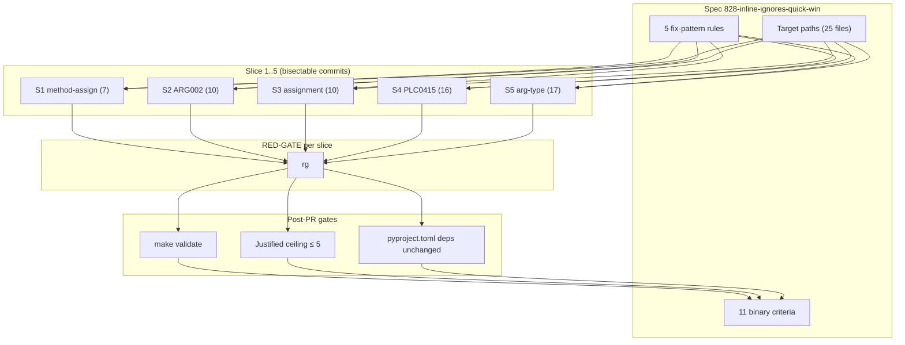
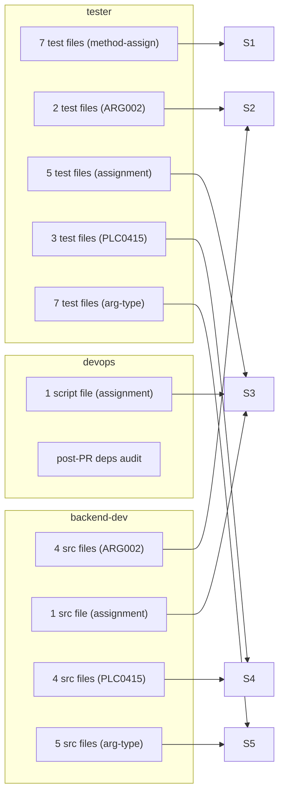

## Summary

Remove 60 mechanical inline lint/type ignores across 5 buckets (`method-assign`, `ARG002`, `assignment`, `PLC0415`, `arg-type`) in 25 files. Per-slice bisectable commits. Agents: `tester` (tests), `backend-dev` (src), `devops` (1 script + post-PR dep audit).

## Architecture

### Data flow — ignore → fix-pattern → verification



### Agent × Bucket × File map



## Agents

| Agent | Task count | Files |
|-------|-----------|-------|
| tester | 6 (T1, T2, T4, T7, T9, T16) | tests/, packages/*/tests/ |
| backend-dev | 4 (T3, T5, T8, T10) | src/lyra/, packages/roxabi-nats/src/ |
| devops | 2 (T6, T18) | scripts/dep-graph/, pyproject.toml audit |
| — (cross-agent sentinel) | 5 RED-GATEs + 1 T17 ceiling = 6 | global grep checks |

Total: **18 micro-tasks** (10 work + 5 RED-GATE + 3 post-PR).

## Consistency Report

- Criteria covered: **11/11**
  - SC1 (`arg-type → 0`) ← RED-GATE G5 after T9+T10
  - SC2 (`ARG002 → 0`) ← RED-GATE G2 after T2+T3
  - SC3 (`assignment → 0`) ← RED-GATE G3 after T4+T5+T6
  - SC4 (`method-assign → 0`) ← RED-GATE G1 after T1
  - SC5 (`PLC0415 → 0`) ← RED-GATE G4 after T7+T8
  - SC6 (justified ≤5) ← T17
  - SC7 (`make validate`) ← T16
  - SC8 (coverage ≥ baseline) ← T16
  - SC9 (5 bucket-scoped commits) ← implicit from slice structure
  - SC10 (no edits outside target paths) ← T17 path audit
  - SC11 (no new deps) ← T18
- Uncovered criteria: **none**
- Tasks without spec backing: **none**
- Gold plating exemptions applied: **0**

## Micro-Tasks

Format: `Tn [P?] (agent) Slice=V# Phase=X Diff=1-5` — description / files / verify / expected.

---

### Slice V1 — `method-assign` (7 ignores, 4 files)

**T1** `[P]` (tester) Slice=V1 Phase=GREEN Diff=2 SpecTrace=SC4 — **30 min**

Replace 7 `# type: ignore[method-assign]` sites with `unittest.mock.patch.object`. Distinguish two sub-cases:
- **(a) mock replacement** → `patch.object(obj, "method", new=AsyncMock(spec=obj.method))` with `autospec=True`
- **(b) tracking closure / spy** → `patch.object(obj, "method", side_effect=fn)` (no `autospec`)

Files + sites:
- `packages/roxabi-nats/tests/test_adapter_base.py:741,756,771` — **(a)** `adapter.handle = AsyncMock()`
- `packages/roxabi-nats/tests/test_adapter_base.py:1043` — **(b)** `task.cancel = _tracking_cancel`
- `tests/bootstrap/test_tts_adapter_standalone.py:135` — **(b)** `adapter.reply = capture_reply`
- `tests/bootstrap/test_stt_adapter_standalone.py:138` — **(b)** `adapter.reply = capture_reply`
- `tests/core/test_sqlite_base_wal.py:185` — **(b)** `store._checkpoint = spy`

Verify: `rg 'type:\s*ignore\[method-assign\]' packages/roxabi-nats/tests/test_adapter_base.py tests/bootstrap/ tests/core/test_sqlite_base_wal.py | grep -v 'justified:'`
Expected: **no output**; `uv run pytest packages/roxabi-nats/tests/test_adapter_base.py tests/bootstrap/test_tts_adapter_standalone.py tests/bootstrap/test_stt_adapter_standalone.py tests/core/test_sqlite_base_wal.py` green.

**G1 RED-GATE V1** — **1 min**
Verify: same as T1 verify. Blocked by T1. No code.

Commit: `refactor(tests): replace method-assign ignores with patch.object (#828)`

---

### Slice V2 — `ARG002` (10 ignores, 4 test + 6 src files)

**T2** `[P]` (tester) Slice=V2 Phase=GREEN Diff=1 SpecTrace=SC2 — **15 min**

Prefix unused callback params with `_` (protocol-required slots) or drop via `functools.partial`. 4 sites:
- `tests/core/test_pool_streaming.py:72,362,430` — `on_intermediate=None` (callback protocol)
- `tests/core/test_session_commands_pre.py:117` — same pattern

Verify: `rg 'noqa:.*ARG002' tests/core/test_pool_streaming.py tests/core/test_session_commands_pre.py`
Expected: **no output**; `uv run pytest tests/core/test_pool_streaming.py tests/core/test_session_commands_pre.py` green.

**T3** `[P]` (backend-dev) Slice=V2 Phase=GREEN Diff=2 SpecTrace=SC2 — **30 min**

Fix 6 src `ARG002` — prefer `_` prefix when the param is protocol-required (abstract method slot):
- `src/lyra/nats/nats_bus.py:122,205`
- `src/lyra/core/hub/hub_registration.py:46,47`
- `src/lyra/core/inbound_bus.py:69`
- `src/lyra/llm/drivers/nats_driver.py:87` (note: already has inline comment "pool_id unused — stateless" → migrate to `_pool_id` + keep comment)

Verify: `rg 'noqa:.*ARG002' src/lyra/nats/nats_bus.py src/lyra/core/hub/hub_registration.py src/lyra/core/inbound_bus.py src/lyra/llm/drivers/nats_driver.py`
Expected: **no output**; `uv run pytest` touched modules green + `uv run pyright src/` green.

**G2 RED-GATE V2** — **1 min**
Verify: `rg 'noqa:.*ARG002' src/ packages/ tests/ scripts/ | grep -v 'justified:'`
Expected: **no output**.

Commit: `refactor: drop ARG002 ignores — prefix unused params with _ (#828)`

---

### Slice V3 — `assignment` (10 ignores, 7 test + 2 src + 1 script)

**T4** `[P]` (tester) Slice=V3 Phase=GREEN Diff=3 SpecTrace=SC3 — **60 min**

Replace 7 test `# type: ignore[assignment]` with `mock.patch.object(...)` context/decorator. Sites:
- `tests/core/test_middleware.py:594,627,733` — `hub._turn_store = _FakeTurnStore()`
- `tests/integration/test_session_clear.py:81,96` — `pool._observer._turn_store = fake_store`
- `tests/adapters/test_streaming_session.py:381` — `cb.send_message = _send_message`
- `tests/core/test_audio_pipeline_tts.py:462` — `hub.adapter_registry[key] = adapter`
- `packages/roxabi-contracts/tests/test_voice_testing_doubles.py:256` — `worker._nc = object()`

Verify: `rg 'type:\s*ignore\[assignment\]' tests/ packages/roxabi-contracts/tests/`
Expected: **no output**; scoped pytest green.

**T5** `[P]` (backend-dev) Slice=V3 Phase=GREEN Diff=2 SpecTrace=SC3 — **20 min**

Fix 1 src `assignment` — `src/lyra/adapters/telegram_formatting.py:29` (conditional import rename via `as _convert_markdown`). Use `cast` or type-narrowed conditional-import pattern since fallback object and real import differ in type.

Verify: `rg 'type:\s*ignore\[assignment\]' src/lyra/adapters/telegram_formatting.py`
Expected: **no output**; `uv run pyright src/lyra/adapters/telegram_formatting.py` green.

**T6** `[P]` (devops) Slice=V3 Phase=GREEN Diff=2 SpecTrace=SC3 — **15 min**

Fix 1 script `assignment` — `scripts/dep-graph/dep_graph/schema.py:35` (`result: dict = _schema_cache`). Annotate `_schema_cache: dict | None` at module level; remove ignore.

Verify: `rg 'type:\s*ignore\[assignment\]' scripts/`
Expected: **no output**; `make dep-graph validate` green.

**G3 RED-GATE V3** — **1 min**
Verify: `rg 'type:\s*ignore\[assignment\]' src/ packages/ tests/ scripts/ | grep -v 'justified:'`
Expected: **no output**.

Commit: `refactor: drop assignment ignores — prefer patch.object (#828)`

---

### Slice V4 — `PLC0415` (16 ignores, 3 test + 4 src files — needs per-site classification)

**T7** `[P]` (tester) Slice=V4 Phase=GREEN Diff=2 SpecTrace=SC5 — **45 min**

Lift 12 test `PLC0415` imports. Default = module-level import; fallback = pytest fixture-scoped:
- `tests/test_circuit_config.py:34,35,63,64,106,107,145,176,177` (9 sites — all `_load_circuit_config` / `_load_raw_config` / `lyra.bootstrap.config` re-imports for isolation). Consolidate into a single module-level import + use `importlib.reload` inside tests that need a fresh state.
- `packages/roxabi-nats/tests/test_type_hint_resolver.py:59,187,215` (3 sites — `StubInner` from a dynamically-created module). If truly dynamic, classify as `# justified: resolves module created at test runtime`.

Verify: `rg 'noqa:.*PLC0415' tests/test_circuit_config.py packages/roxabi-nats/tests/test_type_hint_resolver.py | grep -v 'justified:'`
Expected: **no output**; `uv run pytest tests/test_circuit_config.py packages/roxabi-nats/tests/test_type_hint_resolver.py` green.

**T8** `[P]` (backend-dev) Slice=V4 Phase=GREEN Diff=3 SpecTrace=SC5 — **30 min**

Classify + fix 4 src `PLC0415`:
- `src/lyra/core/runtime_config.py:95` → **lift** `from pydantic_core import PydanticUndefinedType` to top-level (`pydantic_core` always available with pydantic).
- `src/lyra/bootstrap/stt_adapter_standalone.py:53` + `tts_adapter_standalone.py:78` → **`try/except ImportError` at module scope** for `pynvml` (runtime side effects, NOT `TYPE_CHECKING`).
- `src/lyra/core/hub/middleware_stages.py:128` → **keep lazy** with `# justified: breaks import cycle with .hub` (confirmed circular break).

Verify: `rg 'noqa:.*PLC0415' src/lyra/ | grep -v 'justified:'`
Expected: **no output** (only the middleware_stages.py line remains, annotated).

**G4 RED-GATE V4** — **1 min**
Verify: `rg 'noqa:.*PLC0415' src/ packages/ tests/ scripts/ | grep -v 'justified:' | wc -l` reports **≤ 0 silent** (justified ones are retained with inline reason); total `# justified:` across all 5 slices is tracked against the ≤5 ceiling.
Expected: **0 silent; justified counter updated in commit body**.

Commit: `refactor: drop PLC0415 ignores — lift or guard imports (#828)`

---

### Slice V5 — `arg-type` (17 ignores, 7 test + 5 src files)

**T9** `[P]` (tester) Slice=V5 Phase=GREEN Diff=3 SpecTrace=SC1 — **90 min**

Fix 10 test `arg-type` sites — prefer `MagicMock(spec=Proto)` for fake fixtures; narrow call-site typing where argument is simply mistyped:
- `tests/integration/test_session_telegram.py:88,192`
- `tests/integration/test_session_dm_discord.py:83,153`
- `tests/integration/test_session_reply_to.py:52`
- `tests/adapters/test_discord_auth.py:282`
- `tests/core/test_pipeline_event_bus.py:38`
- `tests/core/test_middleware.py:169`
- `tests/nats/test_nats_bus.py:183`
- `packages/roxabi-nats/tests/test_readiness.py:300`

Verify: `rg 'type:\s*ignore\[arg-type\]' tests/ packages/roxabi-nats/tests/`
Expected: **no output**; `uv run pytest` scoped subset green.

**T10** `[P]` (backend-dev) Slice=V5 Phase=GREEN Diff=4 SpecTrace=SC1 — **120 min**

Fix 7 src `arg-type` sites. Narrow annotations preferred over `cast`:
- `packages/roxabi-nats/src/roxabi_nats/_serialize.py:156,289` — `dataclasses.fields(obj)` with wider input type
- `packages/roxabi-nats/src/roxabi_nats/adapter_base.py:181` — `self._heartbeat_subject` narrow check
- `src/lyra/nats/voice_health.py:58` — `int(value)` with `value: int | str | float` narrowing
- `src/lyra/bootstrap/tts_adapter_standalone.py:125` — `agent_tts` duck-typed stand-in; introduce Protocol
- `src/lyra/core/agent_refiner.py:142` — `messages` → correct to `list[MessageParam]` per anthropic SDK
- `src/lyra/core/hub/middleware_submit.py:85` — `update_fn` callback type mismatch

Verify: `rg 'type:\s*ignore\[arg-type\]' src/ packages/roxabi-nats/src/`
Expected: **no output** (or entries retained with `# justified: 3rd-party typing gap`); `uv run pyright src/ packages/roxabi-nats/src/` green.

**G5 RED-GATE V5** — **1 min**
Verify: `rg 'type:\s*ignore\[arg-type\]' src/ packages/ tests/ scripts/ | grep -v 'justified:'`
Expected: **no output**.

Commit: `refactor: drop arg-type ignores — narrow annotations + MagicMock(spec=) (#828)`

---

### Post-PR gates (global)

**T16** (tester) Phase=REFACTOR Diff=1 SpecTrace=SC7,SC8 — **5 min**

Run full `make validate` + coverage comparison vs pre-PR baseline.
Verify: `make validate && uv run pytest --cov=lyra --cov-report=term | tail -20`
Expected: all checks pass; coverage ≥ baseline (grep the final totals line).

**T17** (cross-agent sentinel) Phase=REFACTOR Diff=1 SpecTrace=SC6,SC10 — **5 min**

Audit justified-ignore ceiling + path scope.
Verify:
```bash
# Ceiling ≤ 5
rg '(type:\s*ignore|noqa:)' src/ packages/ tests/ scripts/ | grep 'justified:' | wc -l
# Path-scope audit
git diff --name-only origin/staging...HEAD | grep -vE '^(artifacts/|src/lyra/|packages/|tests/|scripts/dep-graph/)'
```
Expected: count ≤ 5; 2nd command returns **no output**.

**T18** (devops) Phase=REFACTOR Diff=1 SpecTrace=SC11 — **5 min**

Audit `pyproject.toml` deps unchanged.
Verify: `git diff origin/staging...HEAD -- pyproject.toml packages/*/pyproject.toml | grep -E '^[+-](dependencies|tool\.uv\.sources)' | grep -v '^$'`
Expected: **no output**.

## Time summary

| Slice | Est. time |
|---|---|
| V1 | 30 min |
| V2 | 45 min |
| V3 | 95 min |
| V4 | 75 min |
| V5 | 210 min |
| Post-PR | 15 min |
| **Total** | **~7.5h** |

Revised downward from frame's 10-12h after enumerating concrete edits.

## Parallel execution notes

Within each slice: tester ∥ backend-dev ∥ devops tasks run in parallel (no shared files).
Across slices: serial (each slice's RED-GATE must pass before next slice starts) — ensures bisectability.

Post-PR T16/T17/T18 can run in parallel once all slices land.

## Task IDs

<!-- Generated by /plan. Used by /implement to resume tasks on session restart. -->
- T1: 1 — Replace method-assign ignores with patch.object (7 sites)
- G1: 2 — RED-GATE V1 — method-assign bucket clean
- T2: 3 — Drop ARG002 in 4 test sites (test_pool_streaming, test_session_commands_pre)
- T3: 4 — Drop ARG002 in 6 src sites (nats_bus, hub_registration, inbound_bus, nats_driver)
- G2: 5 — RED-GATE V2 — ARG002 bucket clean
- T4: 6 — Replace assignment ignores in 5 test files with patch.object (7 sites)
- T5: 7 — Fix assignment ignore in telegram_formatting.py (conditional import)
- T6: 8 — Fix assignment ignore in dep-graph/schema.py
- G3: 9 — RED-GATE V3 — assignment bucket clean
- T7: 10 — Lift PLC0415 imports in 2 test files (12 sites)
- T8: 11 — Classify + fix PLC0415 in 4 src files
- G4: 12 — RED-GATE V4 — PLC0415 bucket clean (justified tracked)
- T9: 13 — Fix arg-type in 7 test files (10 sites) — MagicMock(spec=) or narrow
- T10: 14 — Fix arg-type in 5 src files (7 sites) — narrow annotations preferred
- G5: 15 — RED-GATE V5 — arg-type bucket clean
- T16: 16 — Run make validate + pytest --cov vs baseline
- T17: 17 — Audit justified-ignore ceiling (≤5) + path scope
- T18: 18 — Audit pyproject.toml deps unchanged
