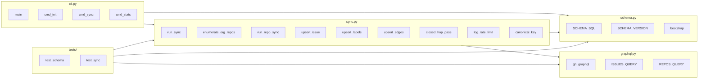

## Summary

Build `scripts/corpus/` (Python, stdlib + httpx + `gh` CLI token) that syncs all Roxabi-org issues into a local SQLite DB at `~/.roxabi/corpus.db` via GraphQL, with incremental `since:` cursoring and a +1 closed-hop pass. Three slices delivered RED→GREEN→RED-GATE: (V1) schema + CLI scaffold, (V2) single-repo sync with rate-limit logging, (V3) org-wide iteration + incremental cursor + closed-hop. Phase 2–5 deferred.

## Architecture

### Data flow

```mermaid
flowchart TD
    subgraph Make[Makefile]
      MK[make corpus &lt;sub&gt;]
    end
    subgraph CLI[scripts/corpus/cli.py]
      CI[cmd_init]
      CS[cmd_sync]
      CT[cmd_stats]
    end
    subgraph Schema[scripts/corpus/schema.py]
      SB[bootstrap conn]
      SV[SCHEMA_SQL + user_version pragma]
    end
    subgraph Sync[scripts/corpus/sync.py]
      RS[run_sync]
      ER[enumerate_org_repos]
      RR[run_repo_sync]
      WI[upsert_issue/labels/edges]
      SS[write_sync_state]
      CH[closed_hop_pass]
      RL[log_rate_limit]
    end
    subgraph GQL[scripts/corpus/graphql.py]
      GG[gh_graphql wrapper]
      Q1[ISSUES_QUERY]
      Q2[REPOS_QUERY]
    end
    subgraph DB[(~/.roxabi/corpus.db)]
      TI[issues]
      TL[labels]
      TE[edges + ix_edges_dst]
      TS[sync_state]
    end

    MK --> CI & CS & CT
    CI --> SB --> SV
    CS --> RS --> ER --> RR --> GG --> Q1
    RR --> WI & RL
    RS --> CH
    ER --> Q2
    WI --> TI & TL & TE
    RR --> SS --> TS
    CT --> TI & TL & TE & TS

    style DB fill:#eef,stroke:#557
    style GQL fill:#efe,stroke:#575
```

### File × function map



## Agents

| Agent | Tasks | Files |
|---|---|---|
| backend-dev | 15 | `scripts/corpus/{__init__,schema,graphql,sync,cli}.py` |
| devops | 1 | `Makefile` |
| tester | 4 | `scripts/corpus/tests/test_{schema,sync}.py` |
| doc-writer | 1 | `CLAUDE.md` (root) |

Tester handles all test code (per stack convention). backend-dev owns module logic. devops touches only the Makefile target. doc-writer updates the project file table for the new package. No architect agent — single-domain, scoped, no new architectural pattern.

## Reference patterns

- `scripts/dep-graph/dep_graph/fetch.py` (474 lines) — existing lyra-only fetch via REST. Patterns to lift: `gh api graphql` subprocess invocation, retry/backoff, dependency parsing shape. **Do not copy REST loop** — new module is GraphQL-first.
- `scripts/dep-graph/dep_graph/cli.py` (168 lines) — argparse subcommand structure. Mirror layout for `cmd_init` / `cmd_sync` / `cmd_stats`.
- Makefile `dep-graph` target (`/home/mickael/projects/lyra/Makefile:253`) — dispatch pattern (`case "$$action" in ...`). Mirror for `corpus`.

## Consistency report

| Check | Result |
|---|---|
| Spec success criteria → covered by tasks | 8/8 ✓ |
| Breadboard affordances → covered by tasks | C1/C2/C3/N1/N2/N3/N4/D1 → 8/8 ✓ |
| Micro-tasks with no spec trace | 0 |
| Exemptions | none |

## Micro-Tasks

### Slice V1 — Schema + CLI scaffold + stats

**T1** [RED] [tester] — Failing bootstrap idempotency test
- File: `scripts/corpus/tests/test_schema.py`
- Snippet: `def test_bootstrap_idempotent(tmp_path): ...` — call `bootstrap()` twice on same path, assert no error and `SELECT name FROM sqlite_master` has expected tables
- Verify: `uv run pytest scripts/corpus/tests/test_schema.py -x` — must fail with ModuleNotFoundError
- Difficulty: 1 · Est: 5 min · [P]: N · Trace: SC-1, SC-8

**T2** [GREEN] [backend-dev] — Package skeleton
- File: `scripts/corpus/__init__.py`, `scripts/corpus/pyproject.toml` (if needed; else inline in lyra pyproject)
- Snippet: `"""Roxabi-org issue corpus sync."""` + version constant
- Verify: `python -c "import scripts.corpus"` or `uv run python -c "from scripts.corpus import __version__"`
- Difficulty: 1 · Est: 3 min · [P]: Y · Trace: N1

**T3** [GREEN] [backend-dev] — SCHEMA_SQL constants
- File: `scripts/corpus/schema.py`
- Snippet: `SCHEMA_VERSION = 1`; `SCHEMA_SQL = """CREATE TABLE IF NOT EXISTS issues (...); CREATE TABLE IF NOT EXISTS labels (...); CREATE TABLE IF NOT EXISTS edges (...); CREATE INDEX IF NOT EXISTS ix_edges_dst ON edges(dst_key); CREATE TABLE IF NOT EXISTS sync_state (...);"""` — no `body` / `body_hash` column per spec
- Verify: grep `CREATE TABLE` count == 4 and `body` absent
- Difficulty: 2 · Est: 5 min · [P]: N · Trace: SC-1, SC-3, SC-7

**T4** [GREEN] [backend-dev] — bootstrap(conn) function
- File: `scripts/corpus/schema.py`
- Snippet: `def bootstrap(conn: sqlite3.Connection) -> None:` — executes `SCHEMA_SQL`, sets `PRAGMA user_version = SCHEMA_VERSION`, enables WAL; idempotent via `IF NOT EXISTS`
- Verify: T1 test now passes: `uv run pytest scripts/corpus/tests/test_schema.py -x`
- Difficulty: 2 · Est: 5 min · [P]: N · Trace: SC-1

**T5** [GREEN] [backend-dev] — CLI argparse skeleton
- File: `scripts/corpus/cli.py`
- Snippet: `main(argv=None)` with subparsers `init`, `sync` (accepts `--repo`), `stats`. `cmd_init` opens `~/.roxabi/corpus.db`, creates dir if missing, calls `schema.bootstrap(conn)`. `cmd_stats` runs `SELECT COUNT(*) FROM issues`, same for labels/edges, prints counts. `cmd_sync` raises `NotImplementedError` for now.
- Verify: `uv run python -m scripts.corpus.cli init && uv run python -m scripts.corpus.cli stats` → prints `issues=0 labels=0 edges=0 repos=0`
- Difficulty: 3 · Est: 8 min · [P]: N · Trace: C2, C3, N3, D1

**T6** [GREEN] [devops] — Makefile target
- File: `Makefile`
- Snippet: mirror `dep-graph` target. `make corpus` dispatches to `init | sync | stats`. `CORPUS_DIR := $(HOME)/projects/lyra/scripts/corpus`. Default behaviour = `sync`.
- Verify: `make corpus init && make corpus stats` → same stdout as T5
- Difficulty: 2 · Est: 5 min · [P]: Y · Trace: C1, C2, C3

**T7** [RED-GATE] [tester] — V1 slice gate
- Verify: `make corpus init && make corpus stats` prints all-zero counts, `uv run pytest scripts/corpus/tests/test_schema.py` passes
- Difficulty: 1 · Est: 2 min · [P]: N · Trace: V1 gate

### Slice V2 — Single-repo sync + rate-limit log + sync_state

**T8** [RED] [tester] — Failing test: edge dedup + key canonicalisation + rate-limit log
- File: `scripts/corpus/tests/test_sync.py`
- Snippet: three failing tests — (a) calling `upsert_edges` twice on the same edge leaves exactly one row; (b) `canonical_key(repo, bare_number)` returns `"owner/repo#N"`; (c) `log_rate_limit({"cost":3,"remaining":4997,"resetAt":"2026-04-20T21:00:00Z"})` writes to stderr matching regex `cost=\d+ remaining=\d+ reset=.*`
- Verify: `uv run pytest scripts/corpus/tests/test_sync.py -x` — all 3 fail with ModuleNotFoundError or AttributeError
- Difficulty: 2 · Est: 8 min · [P]: N · Trace: SC-3, SC-6, SC-8

**T9** [GREEN] [backend-dev] — GraphQL wrapper
- File: `scripts/corpus/graphql.py`
- Snippet: `def gh_graphql(query, variables) -> dict:` — `subprocess.run(["gh","api","graphql","-f",f"query={query}",...])`, parses JSON, raises `GraphQLError` on `errors` key
- Verify: `uv run python -c "from scripts.corpus.graphql import gh_graphql; r = gh_graphql('query{viewer{login}}', {}); print(r['data']['viewer']['login'])"` prints username
- Difficulty: 3 · Est: 8 min · [P]: Y · Trace: N4

**T10** [GREEN] [backend-dev] — ISSUES_QUERY template
- File: `scripts/corpus/graphql.py`
- Snippet: GraphQL string constant. Per-repo issues page with `number`, `title`, `state`, `url`, `createdAt`, `updatedAt`, `closedAt`, `labels(first:30)`, `milestone`, `trackedIssues`/`trackedInIssues` (issue dependencies), and `rateLimit { cost remaining resetAt }` sibling. Accepts `$owner, $name, $cursor, $since` variables.
- Verify: `uv run python -c "from scripts.corpus.graphql import ISSUES_QUERY; assert 'trackedInIssues' in ISSUES_QUERY and 'rateLimit' in ISSUES_QUERY"`
- Difficulty: 3 · Est: 10 min · [P]: Y · Trace: N4

**T11** [GREEN] [backend-dev] — canonical_key + upsert_issue/labels/edges
- File: `scripts/corpus/sync.py`
- Snippet: `canonical_key(repo, number) -> str`; `upsert_issue(conn, iss)` INSERT OR REPLACE; `upsert_labels(conn, key, labels)` DELETE + INSERT; `upsert_edges(conn, key, blocked_by)` DELETE + INSERT with canonical `src blocks dst` direction (i.e. each blocked_by ref → `(ref_key, key)` row)
- Verify: T8 tests (a) and (b) now pass: `uv run pytest scripts/corpus/tests/test_sync.py::test_edge_dedup scripts/corpus/tests/test_sync.py::test_canonical_key -x`
- Difficulty: 3 · Est: 12 min · [P]: N · Trace: SC-3, SC-6

**T12** [GREEN] [backend-dev] — log_rate_limit
- File: `scripts/corpus/sync.py`
- Snippet: `def log_rate_limit(rl: dict) -> None:` writes one line per call to `sys.stderr` formatted as `[corpus] cost=N remaining=N reset=ISO`
- Verify: T8 test (c) passes: `uv run pytest scripts/corpus/tests/test_sync.py::test_rate_limit_log -x`
- Difficulty: 1 · Est: 3 min · [P]: Y · Trace: SC-6

**T13** [GREEN] [backend-dev] — run_repo_sync (page loop, no cursor yet)
- File: `scripts/corpus/sync.py`
- Snippet: `def run_repo_sync(conn, owner, name, since=None):` — paginates `ISSUES_QUERY`, calls upserts, calls `log_rate_limit` per page, writes `sync_state` row with current UTC iso as `last_synced_at` on success
- Verify: import-level; integration exercised by T16
- Difficulty: 4 · Est: 15 min · [P]: N · Trace: N2, SC-2, SC-5

**T14** [GREEN] [backend-dev] — wire cmd_sync --repo
- File: `scripts/corpus/cli.py`
- Snippet: `cmd_sync` reads `--repo owner/name`, calls `schema.bootstrap` (defensive), opens conn, calls `run_repo_sync(conn, owner, name)`, prints summary line
- Verify: `make corpus sync --repo Roxabi/lyra && make corpus stats` — `issues` count matches `gh issue list -R Roxabi/lyra -s all --limit 1000 --json number | jq length`; stderr shows ≥1 `cost=` line
- Difficulty: 2 · Est: 5 min · [P]: N · Trace: C1, SC-2, SC-5, SC-6

**T15** [RED-GATE] [tester] — V2 slice gate
- Verify: T8 and T14 acceptance commands; spot-check `SELECT COUNT(*) FROM edges` > 0 after a real sync
- Difficulty: 1 · Est: 3 min · [P]: N · Trace: V2 gate

### Slice V3 — Org-wide + cursor + closed-hop

**T16** [RED] [tester] — Failing closed-hop test
- File: `scripts/corpus/tests/test_sync.py`
- Snippet: inject a fixture DB with one open issue in `Roxabi/lyra` that is `blocked_by` a stub-only key not yet in `issues`. Call `closed_hop_pass` with a mocked `gh_graphql` returning a closed issue. Assert the stub row is written with `is_stub=1`.
- Verify: `uv run pytest scripts/corpus/tests/test_sync.py::test_closed_hop_triggers -x` fails
- Difficulty: 3 · Est: 10 min · [P]: N · Trace: SC-4

**T17** [GREEN] [backend-dev] — REPOS_QUERY + enumerate_org_repos
- File: `scripts/corpus/graphql.py` + `scripts/corpus/sync.py`
- Snippet: `REPOS_QUERY` lists `organization(login).repositories(first:50, isArchived:false)` with cursor. `enumerate_org_repos(org: str) -> list[tuple[str,str]]` paginates and returns `[(owner, name), ...]`
- Verify: `uv run python -c "from scripts.corpus.sync import enumerate_org_repos; print(len(enumerate_org_repos('Roxabi')))"` prints >= 7
- Difficulty: 3 · Est: 10 min · [P]: Y · Trace: N2, N4, SC-2

**T18** [GREEN] [backend-dev] — since: cursor from sync_state
- File: `scripts/corpus/sync.py`
- Snippet: before `run_repo_sync`, `SELECT last_synced_at FROM sync_state WHERE repo = ?`; pass as `since` to ISSUES_QUERY
- Verify: integration test in T20
- Difficulty: 2 · Est: 5 min · [P]: N · Trace: SC-5

**T19** [GREEN] [backend-dev] — closed_hop_pass
- File: `scripts/corpus/sync.py`
- Snippet: `def closed_hop_pass(conn):` — `SELECT DISTINCT src_key FROM edges WHERE src_key NOT IN (SELECT key FROM issues)` → chunk, for each owner/repo group issue a minimal GraphQL query, upsert stub rows with `is_stub=1`
- Verify: T16 test now passes
- Difficulty: 4 · Est: 15 min · [P]: N · Trace: SC-4

**T20** [GREEN] [backend-dev] — run_sync orchestrator
- File: `scripts/corpus/sync.py`
- Snippet: `def run_sync(conn, org: str):` — `enumerate_org_repos(org)`, loop `run_repo_sync(conn, *)` per repo, then `closed_hop_pass(conn)`
- Verify: `make corpus sync` on fresh DB populates ≥7 repos; `make corpus sync` a second time fetches 0 issues (verified by comparing `make corpus stats` output before/after)
- Difficulty: 2 · Est: 5 min · [P]: N · Trace: C1, SC-2, SC-5

**T21** [GREEN] [backend-dev] — wire cmd_sync (no --repo)
- File: `scripts/corpus/cli.py`
- Snippet: when `--repo` absent, `cmd_sync` calls `run_sync(conn, "Roxabi")`
- Verify: same as T20
- Difficulty: 1 · Est: 3 min · [P]: N · Trace: C1

**T22** [GREEN] [doc-writer] — CLAUDE.md file table
- File: `CLAUDE.md` (project root)
- Snippet: add row under Key files: `scripts/corpus/` | Org-wide GraphQL → SQLite corpus (Phase 1 foundation for dep-graph v2 and roxabi-dashboard)
- Verify: `grep -q "scripts/corpus/" CLAUDE.md`
- Difficulty: 1 · Est: 2 min · [P]: Y · Trace: — (hygiene)

**T23** [RED-GATE] [tester] — V3 slice gate
- Verify:
  1. `make corpus sync` on empty DB completes
  2. `make corpus stats` shows >0 issues across >5 repos
  3. Run `make corpus sync` again immediately → `make corpus stats` output identical to run 1 (proves zero-fetch incremental)
  4. All tests: `uv run pytest scripts/corpus/tests/` green
- Difficulty: 1 · Est: 5 min · [P]: N · Trace: V3 gate / SC-1…SC-8

## Totals

- 23 micro-tasks (7 / 8 / 8 per slice)
- 4 agents: backend-dev (15), tester (4), devops (1), doc-writer (1)
- Estimated wall-clock: ~2.5 h if sequential, ~1.5 h with `[P]` parallelism

## Task IDs

<!-- Generated by /plan. Used by /implement to resume tasks on session restart. -->
- T1:  12 — RED: failing bootstrap idempotency test
- T2:  13 — GREEN: package skeleton
- T3:  14 — GREEN: SCHEMA_SQL constants
- T4:  15 — GREEN: bootstrap(conn) function
- T5:  16 — GREEN: CLI argparse skeleton
- T6:  17 — GREEN: Makefile corpus target
- T7:  18 — RED-GATE: V1 slice gate
- T8:  19 — RED: test_sync failing tests
- T9:  20 — GREEN: gh_graphql wrapper
- T10: 21 — GREEN: ISSUES_QUERY template
- T11: 22 — GREEN: canonical_key + upserts
- T12: 23 — GREEN: log_rate_limit
- T13: 24 — GREEN: run_repo_sync page loop
- T14: 25 — GREEN: wire cmd_sync --repo
- T15: 26 — RED-GATE: V2 slice gate
- T16: 27 — RED: closed-hop failing test
- T17: 28 — GREEN: REPOS_QUERY + enumerate_org_repos
- T18: 29 — GREEN: since: cursor from sync_state
- T19: 30 — GREEN: closed_hop_pass
- T20: 31 — GREEN: run_sync orchestrator
- T21: 32 — GREEN: wire cmd_sync (no --repo)
- T22: 33 — GREEN: CLAUDE.md file table
- T23: 34 — RED-GATE: V3 slice gate
