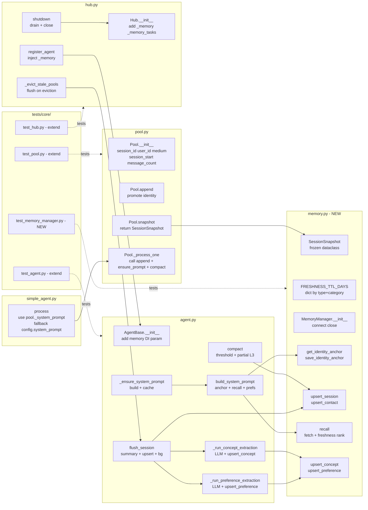

## Summary

Wire `AsyncMemoryDB` (roxabi-vault) into `Pool`, `AgentBase`, and `Hub` across 7 sequential
slices: Pool identity fields → MemoryManager infra → identity anchor + system prompt caching →
session flush → compaction with crash-safe L3 write → cross-session recall with freshness
ranking → background concept/preference extraction with upsert-by-name dedup.

---

## Architecture

### Data flow

```mermaid
flowchart TD
  subgraph pool_py["pool.py"]
    SUBMIT[Pool.submit]
    APPEND[Pool.append\nidentity + count]
    SNAPSHOT[Pool.snapshot\nSessionSnapshot]
    PROCESS[Pool._process_one]
  end

  subgraph agent_py["agent.py (AgentBase)"]
    ENSURE[_ensure_system_prompt\npool._system_prompt cache]
    BSP[build_system_prompt\nanchor + recall + prefs]
    COMPACT[compact\nLLM summary + L3 partial + truncate]
    FLUSH[flush_session\nLLM summary + upsert + bg tasks]
    EXTRACT_C[_run_concept_extraction\nLLM + upsert_concept]
    EXTRACT_P[_run_preference_extraction\nLLM + upsert_preference]
  end

  subgraph memory_py["memory.py (MemoryManager)"]
    MM_IA[get/save identity_anchor]
    MM_US[upsert_session]
    MM_UC[upsert_contact]
    MM_RE[recall\nfreshness-aware]
    MM_UPC[upsert_concept\nfresh-merge or stale-replace]
    MM_UPP[upsert_preference\nstrength accumulation]
  end

  subgraph hub_py["hub.py (Hub)"]
    HUB_EVICT[_evict_stale_pools\ncreate_task flush_session]
    HUB_TASKS[_memory_tasks\nset - shutdown drain]
    HUB_SHUT[shutdown\ndrain + close]
  end

  SUBMIT --> PROCESS
  PROCESS --> APPEND
  PROCESS --> ENSURE
  ENSURE --> BSP
  BSP --> MM_IA
  BSP --> MM_RE
  PROCESS --> COMPACT
  COMPACT --> MM_US
  HUB_EVICT --> FLUSH
  FLUSH --> SNAPSHOT
  FLUSH --> MM_US
  FLUSH --> MM_UC
  FLUSH -.->|create_task| EXTRACT_C
  FLUSH -.->|create_task| EXTRACT_P
  EXTRACT_C --> MM_UPC
  EXTRACT_P --> MM_UPP
  FLUSH -.->|register| HUB_TASKS
  HUB_SHUT --> HUB_TASKS

  style memory_py fill:#0f1a14,stroke:#064e3b
  style hub_py fill:#0d1117,stroke:#0c4a6e
```



### File × Function map



---

## Bootstrap Context

Reference patterns from existing codebase:

- `Pool._process_one()` — call site for new `append()` and `_ensure_system_prompt()` hooks
  (`src/lyra/core/pool.py:288`)
- `Hub.register_agent()` — injection point for `_memory` DI
  (`src/lyra/core/hub.py:210`)
- `Hub._evict_stale_pools()` — extend with `create_task(flush_session)`
  (`src/lyra/core/hub.py:~360`)
- `SimpleAgent.process()` — replace `self.config.system_prompt` with
  `pool._system_prompt or self.config.system_prompt`
  (`src/lyra/agents/simple_agent.py:~198`)
- `AsyncMemoryDB.upsert_session()` — pattern for upsert-by-metadata-key
  (`roxabi_vault`: queries `json_extract(metadata, '$.session_id')`)
- `Hub._background_tasks` pattern — already used in `AsyncMemoryDB`; mirror for `_memory_tasks`
- Test mock pattern: `_make_ctx_mock()` in `tests/core/test_pool.py`

---

## Agents

| Agent | Slices | Files | Task count |
|-------|--------|-------|-----------|
| backend-dev | S1–S7 (GREEN) | `pool.py`, `memory.py`, `agent.py`, `simple_agent.py`, `hub.py` | 33 |
| tester | S1–S7 (RED) | `test_pool.py`, `test_memory_manager.py`, `test_agent.py`, `test_hub.py` | 22 |

---

## Consistency Report

| Spec section | Covered | Tasks |
|---|---|---|
| S1 Pool identity | ✓ | T1.1–T1.8 |
| S2 MemoryManager + Hub | ✓ | T2.1–T2.12 |
| S3 Identity anchor | ✓ | T3.1–T3.6 |
| S4 Session flush | ✓ | T4.1–T4.7 |
| S5 Compaction | ✓ | T5.1–T5.6 |
| S6 Cross-session recall | ✓ | T6.1–T6.8 |
| S7 Concept + preference extraction | ✓ | T7.1–T7.9 |
| B8 Freshness model | ✓ | T6.4–T6.5, T7.5–T7.6 |
| Provenance (source_session_id) | ✓ | T7.5–T7.6 |
| Compact → L3 partial write | ✓ | T5.3–T5.4 |
| Upsert by (name, user_id, namespace) | ✓ | T7.5–T7.6 |

**Covered:** 39/39 acceptance criteria + 3 post-spec improvements
**Uncovered:** none
**Exemptions:** `#67 turn_logger` hook wired in T1.6 but full implementation deferred to #67

---

## Micro-Tasks

### S1 — Pool identity

> RED-GATE: all S1 tests must pass before S2 begins

#### RED phase

**T1.1** [P]
- **Description:** Write tests for Pool identity fields
- **File:** `tests/core/test_pool.py`
- **Snippet:**
  ```python
  def test_pool_has_session_id(pool):
      assert isinstance(pool.session_id, str) and len(pool.session_id) == 36
  def test_pool_identity_defaults(pool):
      assert pool.user_id == "" and pool.medium == "" and pool.message_count == 0
  def test_pool_session_start_is_utc(pool):
      assert pool.session_start.tzinfo is not None
  ```
- **Verify:** `uv run pytest tests/core/test_pool.py::test_pool_has_session_id -x`
- **Expected:** FAIL (fields not yet added)
- **Time:** 5 min | **Agent:** tester | **Spec:** SC-S1-1 | **Phase:** RED

**T1.2** [P]
- **Description:** Write tests for Pool.append() — identity promotion, count, turn_logger
- **File:** `tests/core/test_pool.py`
- **Snippet:**
  ```python
  def test_append_promotes_user_id_once(pool, make_msg):
      msg = make_msg(user_id="u1", platform="telegram")
      pool.append(msg)
      assert pool.user_id == "u1" and pool.message_count == 1
      pool.append(make_msg(user_id="u2", platform="discord"))
      assert pool.user_id == "u1"  # not overwritten
  def test_append_calls_turn_logger(pool, make_msg):
      calls = []
      pool._turn_logger = lambda sid, m: calls.append((sid, m)) or asyncio.coroutine(lambda: None)()
      pool.append(make_msg())
      assert len(calls) == 1
  ```
- **Verify:** `uv run pytest tests/core/test_pool.py -k "append" -x`
- **Expected:** FAIL
- **Time:** 5 min | **Agent:** tester | **Spec:** SC-S1-2,3,4,5 | **Phase:** RED

**T1.3** [P]
- **Description:** Write tests for Pool.snapshot()
- **File:** `tests/core/test_pool.py`
- **Snippet:**
  ```python
  def test_snapshot_returns_session_snapshot(pool, make_msg):
      pool.append(make_msg(user_id="u1", platform="telegram"))
      snap = pool.snapshot("lyra")
      assert snap.session_id == pool.session_id
      assert snap.user_id == "u1"
      assert snap.medium == "telegram"
      assert snap.message_count == 1
      assert snap.session_end >= snap.session_start
  ```
- **Verify:** `uv run pytest tests/core/test_pool.py -k "snapshot" -x`
- **Expected:** FAIL
- **Time:** 4 min | **Agent:** tester | **Spec:** SC-S1-6 | **Phase:** RED

#### GREEN phase

**T1.4** [P]
- **Description:** Add UUID/datetime imports to pool.py
- **File:** `src/lyra/core/pool.py`
- **Snippet:**
  ```python
  import sys
  import uuid
  from datetime import UTC, datetime
  from typing import TYPE_CHECKING, Awaitable, Callable, Protocol, runtime_checkable
  ```
- **Verify:** `uv run python -c "from lyra.core.pool import Pool"`
- **Expected:** no import error
- **Time:** 2 min | **Agent:** backend-dev | **Spec:** SC-S1-1 | **Phase:** GREEN

**T1.5**
- **Description:** Add identity fields to Pool.__init__()
- **File:** `src/lyra/core/pool.py`
- **Snippet:**
  ```python
  self.session_id: str = str(uuid.uuid4())
  self.user_id: str = ""
  self.medium: str = ""
  self.session_start: datetime = datetime.now(UTC)
  self.message_count: int = 0
  self._system_prompt: str = ""
  self._turn_logger: Callable[[str, "InboundMessage"], Awaitable[None]] | None = None
  ```
- **Verify:** `uv run pytest tests/core/test_pool.py::test_pool_has_session_id -x`
- **Expected:** PASS
- **Time:** 4 min | **Agent:** backend-dev | **Spec:** SC-S1-1 | **Phase:** GREEN | **Depends:** T1.4

**T1.6**
- **Description:** Add Pool.append(msg) method
- **File:** `src/lyra/core/pool.py`
- **Snippet:**
  ```python
  def append(self, msg: "InboundMessage") -> None:
      """Called from _process_one after debounce merge. Promotes identity, tracks count."""
      if self.user_id == "":
          self.user_id = msg.user_id
          self.medium = msg.platform
      self.message_count += 1
      if self._turn_logger is not None:
          asyncio.create_task(self._turn_logger(self.session_id, msg))
  ```
- **Verify:** `uv run pytest tests/core/test_pool.py -k "append" -x`
- **Expected:** PASS
- **Time:** 5 min | **Agent:** backend-dev | **Spec:** SC-S1-2,3,4,5 | **Phase:** GREEN | **Depends:** T1.5

**T1.7**
- **Description:** Add Pool.snapshot(agent_namespace) method
- **File:** `src/lyra/core/pool.py`
- **Snippet:**
  ```python
  def snapshot(self, agent_namespace: str) -> "SessionSnapshot":
      from .memory import SessionSnapshot
      return SessionSnapshot(
          session_id=self.session_id,
          user_id=self.user_id,
          medium=self.medium,
          agent_namespace=agent_namespace,
          session_start=self.session_start,
          session_end=datetime.now(UTC),
          message_count=self.message_count,
          source_turns=len(self.sdk_history),
      )
  ```
- **Verify:** `uv run pytest tests/core/test_pool.py -k "snapshot" -x`
- **Expected:** PASS (once memory.py S2 exists — use TYPE_CHECKING guard)
- **Time:** 5 min | **Agent:** backend-dev | **Spec:** SC-S1-6 | **Phase:** GREEN | **Depends:** T1.5

**T1.8**
- **Description:** Call pool.append(msg) in Pool._process_one() after debounce merge
- **File:** `src/lyra/core/pool.py`
- **Snippet:**
  ```python
  async def _process_one(self, msg: InboundMessage, agent: "AgentBase") -> None:
      self.append(msg)  # NEW — identity + count before LLM call
      # ... existing code continues
  ```
- **Verify:** `uv run pytest tests/core/test_pool.py -x`
- **Expected:** all pool tests PASS
- **Time:** 4 min | **Agent:** backend-dev | **Spec:** SC-S1-2 | **Phase:** GREEN | **Depends:** T1.6

> **RED-GATE S1** — `uv run pytest tests/core/test_pool.py -x` must be fully green

---

### S2 — MemoryManager + Hub injection

> RED-GATE: all S2 tests must pass before S3 begins

#### RED phase

**T2.1** [P]
- **Description:** Write tests for SessionSnapshot dataclass
- **File:** `tests/core/test_memory_manager.py`
- **Snippet:**
  ```python
  def test_session_snapshot_is_frozen():
      snap = SessionSnapshot(session_id="s1", user_id="u1", medium="telegram",
          agent_namespace="lyra", session_start=datetime.now(UTC),
          session_end=datetime.now(UTC), message_count=3, source_turns=5)
      with pytest.raises(FrozenInstanceError): snap.user_id = "x"
  ```
- **Verify:** `uv run pytest tests/core/test_memory_manager.py -k "snapshot" -x`
- **Expected:** FAIL
- **Time:** 3 min | **Agent:** tester | **Spec:** SC-S2 | **Phase:** RED

**T2.2** [P]
- **Description:** Write tests for MemoryManager.connect/close with mock AsyncMemoryDB
- **File:** `tests/core/test_memory_manager.py`
- **Snippet:**
  ```python
  @pytest.fixture
  def mock_db(mocker):
      db = AsyncMock()
      mocker.patch("lyra.core.memory.AsyncMemoryDB", return_value=db)
      return db

  async def test_connect_calls_db_connect(mock_db):
      mm = MemoryManager(":memory:")
      await mm.connect()
      mock_db.connect.assert_awaited_once()

  async def test_close_calls_db_close(mock_db):
      mm = MemoryManager(":memory:")
      await mm.connect()
      await mm.close()
      mock_db.close.assert_awaited_once()
  ```
- **Verify:** `uv run pytest tests/core/test_memory_manager.py -k "connect or close" -x`
- **Expected:** FAIL
- **Time:** 5 min | **Agent:** tester | **Spec:** SC-S2-1 | **Phase:** RED

**T2.3** [P]
- **Description:** Write tests for MemoryManager.get_identity_anchor/save_identity_anchor
- **File:** `tests/core/test_memory_manager.py`
- **Snippet:**
  ```python
  async def test_get_identity_anchor_returns_none_when_empty(mm):
      result = await mm.get_identity_anchor("lyra")
      assert result is None

  async def test_save_then_get_identity_anchor(mm):
      await mm.save_identity_anchor("lyra", "You are Lyra.")
      result = await mm.get_identity_anchor("lyra")
      assert result == "You are Lyra."
  ```
- **Verify:** `uv run pytest tests/core/test_memory_manager.py -k "identity_anchor" -x`
- **Expected:** FAIL
- **Time:** 5 min | **Agent:** tester | **Spec:** SC-S3-1,2 | **Phase:** RED

**T2.4** [P]
- **Description:** Write tests for MemoryManager.upsert_session, upsert_contact
- **File:** `tests/core/test_memory_manager.py`
- **Snippet:**
  ```python
  async def test_upsert_session_idempotent(mm, make_snap):
      snap = make_snap()
      await mm.upsert_session(snap, "summary 1")
      await mm.upsert_session(snap, "summary 2")  # same session_id
      # only one entry in DB
      entries = await mm._db.search("summary", "lyra", limit=10)
      session_entries = [e for e in entries if e.get("type") == "session"]
      assert len(session_entries) == 1 and "summary 2" in session_entries[0]["content"]

  async def test_upsert_contact_updates_last_seen(mm, make_snap):
      snap = make_snap()
      await mm.upsert_contact(snap.user_id, snap.medium, snap.agent_namespace)
      await mm.upsert_contact(snap.user_id, snap.medium, snap.agent_namespace)
      # only one contact entry
  ```
- **Verify:** `uv run pytest tests/core/test_memory_manager.py -k "upsert" -x`
- **Expected:** FAIL
- **Time:** 6 min | **Agent:** tester | **Spec:** SC-S4-5,6 | **Phase:** RED

**T2.5** [P]
- **Description:** Write tests for Hub _memory_tasks registry and _memory injection
- **File:** `tests/core/test_hub.py`
- **Snippet:**
  ```python
  def test_hub_has_memory_tasks_set(hub):
      assert hasattr(hub, "_memory_tasks")
      assert isinstance(hub._memory_tasks, set)

  def test_register_agent_injects_memory(hub, mock_memory_manager, mock_agent):
      hub._memory = mock_memory_manager
      hub.register_agent(mock_agent)
      assert mock_agent._memory is mock_memory_manager
  ```
- **Verify:** `uv run pytest tests/core/test_hub.py -k "memory" -x`
- **Expected:** FAIL
- **Time:** 5 min | **Agent:** tester | **Spec:** SC-S2-3,4,5 | **Phase:** RED

#### GREEN phase

**T2.6**
- **Description:** Create src/lyra/core/memory.py — SessionSnapshot + FRESHNESS_TTL_DAYS
- **File:** `src/lyra/core/memory.py`
- **Snippet:**
  ```python
  from __future__ import annotations
  from dataclasses import dataclass
  from datetime import UTC, datetime
  from pathlib import Path
  from typing import Any

  @dataclass(frozen=True)
  class SessionSnapshot:
      session_id: str
      user_id: str
      medium: str
      agent_namespace: str
      session_start: datetime
      session_end: datetime
      message_count: int
      source_turns: int

  FRESHNESS_TTL_DAYS: dict[str, int | None] = {
      "concept:technology": 180,
      "concept:project": 90,
      "concept:decision": None,
      "concept:fact": 60,
      "concept:entity": 180,
      "preference": 30,
  }
  ```
- **Verify:** `uv run python -c "from lyra.core.memory import SessionSnapshot, FRESHNESS_TTL_DAYS; print('ok')"`
- **Expected:** ok
- **Time:** 5 min | **Agent:** backend-dev | **Spec:** SC-S2-2 | **Phase:** GREEN

**T2.7**
- **Description:** Implement MemoryManager.__init__, connect(), close()
- **File:** `src/lyra/core/memory.py`
- **Snippet:**
  ```python
  class MemoryManager:
      def __init__(self, vault_path: Path | str) -> None:
          from roxabi_vault import AsyncMemoryDB
          self._db = AsyncMemoryDB(vault_path)

      async def connect(self) -> None:
          await self._db.connect()

      async def close(self) -> None:
          await self._db.close()
  ```
- **Verify:** `uv run pytest tests/core/test_memory_manager.py -k "connect or close" -x`
- **Expected:** PASS
- **Time:** 4 min | **Agent:** backend-dev | **Spec:** SC-S2-1 | **Phase:** GREEN | **Depends:** T2.6

**T2.8**
- **Description:** Implement MemoryManager.get_identity_anchor, save_identity_anchor
- **File:** `src/lyra/core/memory.py`
- **Snippet:**
  ```python
  async def get_identity_anchor(self, namespace: str) -> str | None:
      results = await self._db.search("IDENTITY_ANCHOR", namespace, limit=1)
      anchors = [r for r in results if r.get("type") == "anchor"]
      return anchors[0]["content"] if anchors else None

  async def save_identity_anchor(self, namespace: str, text: str) -> None:
      existing = await self.get_identity_anchor(namespace)
      if existing is None:
          await self._db.save_entry(
              content=text, type="anchor", title="IDENTITY_ANCHOR", namespace=namespace
          )
      else:
          # update existing anchor
          await self._db._db.execute(
              "UPDATE entries SET content=?, updated_at=datetime('now')"
              " WHERE type='anchor' AND namespace=? AND title='IDENTITY_ANCHOR'",
              (text, namespace)
          )
          await self._db._db.commit()
  ```
- **Verify:** `uv run pytest tests/core/test_memory_manager.py -k "identity_anchor" -x`
- **Expected:** PASS
- **Time:** 8 min | **Agent:** backend-dev | **Spec:** SC-S3-1,2,3 | **Phase:** GREEN | **Depends:** T2.7

**T2.9**
- **Description:** Implement MemoryManager.upsert_session, upsert_contact
- **File:** `src/lyra/core/memory.py`
- **Snippet:**
  ```python
  async def upsert_session(self, snap: SessionSnapshot, summary: str,
                            status: str = "final") -> None:
      await self._db.upsert_session(
          snap.session_id, summary,
          user_id=snap.user_id, medium=snap.medium,
          agent_namespace=snap.agent_namespace,
          session_start=snap.session_start.isoformat(),
          session_end=snap.session_end.isoformat(),
          message_count=snap.message_count,
          source_turns=snap.source_turns,
          status=status,
      )

  async def upsert_contact(self, user_id: str, medium: str, namespace: str) -> None:
      # find-or-insert/update pattern using raw SQL via _db._db
      db = self._db._db_or_raise()
      async with db.execute(
          "SELECT id FROM entries WHERE type='contact'"
          " AND json_extract(metadata,'$.user_id')=? AND namespace=?",
          (user_id, namespace)
      ) as cur:
          row = await cur.fetchone()
      import json
      meta = json.dumps({"user_id": user_id, "medium": medium,
                         "last_seen": datetime.now(UTC).isoformat()})
      if row:
          await db.execute(
              "UPDATE entries SET metadata=?, updated_at=datetime('now') WHERE id=?",
              (meta, row[0])
          )
      else:
          await self._db.save_entry(
              content=user_id, type="contact", title=user_id,
              namespace=namespace, metadata={"user_id": user_id, "medium": medium,
                                             "last_seen": datetime.now(UTC).isoformat()}
          )
      await db.commit()
  ```
- **Verify:** `uv run pytest tests/core/test_memory_manager.py -k "upsert" -x`
- **Expected:** PASS
- **Time:** 10 min | **Agent:** backend-dev | **Spec:** SC-S4-5,6 | **Phase:** GREEN | **Depends:** T2.8

**T2.10**
- **Description:** Add _memory and _memory_tasks fields to Hub.__init__()
- **File:** `src/lyra/core/hub.py`
- **Snippet:**
  ```python
  from .memory import MemoryManager  # new import

  # in __init__:
  self._memory: MemoryManager | None = None
  self._memory_tasks: set[asyncio.Task] = set()
  ```
- **Verify:** `uv run python -c "from lyra.core.hub import Hub; h=Hub(); print(h._memory_tasks)"`
- **Expected:** `set()`
- **Time:** 4 min | **Agent:** backend-dev | **Spec:** SC-S2-7 | **Phase:** GREEN | **Depends:** T2.6

**T2.11**
- **Description:** Extend Hub.register_agent() to inject _memory into agent
- **File:** `src/lyra/core/hub.py`
- **Snippet:**
  ```python
  def register_agent(self, agent: AgentBase) -> None:
      self.agent_registry[agent.name] = agent
      if self._memory is not None:
          agent._memory = self._memory  # inject DI
  ```
- **Verify:** `uv run pytest tests/core/test_hub.py -k "inject_memory" -x`
- **Expected:** PASS
- **Time:** 4 min | **Agent:** backend-dev | **Spec:** SC-S2-3,4 | **Phase:** GREEN | **Depends:** T2.10

**T2.12**
- **Description:** Add Hub.shutdown() with _memory_tasks drain and _memory.close()
- **File:** `src/lyra/core/hub.py`
- **Snippet:**
  ```python
  async def shutdown(self) -> None:
      if self._memory_tasks:
          await asyncio.gather(*self._memory_tasks, return_exceptions=True)
      if self._memory is not None:
          await self._memory.close()
  ```
- **Verify:** `uv run pytest tests/core/test_hub.py -k "shutdown" -x`
- **Expected:** PASS
- **Time:** 4 min | **Agent:** backend-dev | **Spec:** SC-S2-6,7 | **Phase:** GREEN | **Depends:** T2.10, T2.11

> **RED-GATE S2** — `uv run pytest tests/core/test_memory_manager.py tests/core/test_hub.py -x` fully green

---

### S3 — Identity anchor

> RED-GATE: all S3 tests must pass before S4 begins

#### RED phase

**T3.1** [P]
- **Description:** Write tests for AgentBase._ensure_system_prompt
- **File:** `tests/core/test_agent.py`
- **Snippet:**
  ```python
  async def test_ensure_system_prompt_sets_cache(agent_with_memory, pool):
      assert pool._system_prompt == ""
      await agent_with_memory._ensure_system_prompt(pool)
      assert pool._system_prompt != ""

  async def test_ensure_system_prompt_cached_no_second_call(agent_with_memory, pool, mock_mm):
      pool._system_prompt = "cached"
      await agent_with_memory._ensure_system_prompt(pool)
      mock_mm.get_identity_anchor.assert_not_awaited()

  async def test_ensure_system_prompt_noop_without_memory(agent_no_memory, pool):
      await agent_no_memory._ensure_system_prompt(pool)
      assert pool._system_prompt == ""  # no-op, no crash
  ```
- **Verify:** `uv run pytest tests/core/test_agent.py -k "ensure_system_prompt" -x`
- **Expected:** FAIL
- **Time:** 6 min | **Agent:** tester | **Spec:** SC-S3-5,6 | **Phase:** RED

**T3.2** [P]
- **Description:** Write tests for AgentBase.build_system_prompt — first boot + subsequent
- **File:** `tests/core/test_agent.py`
- **Snippet:**
  ```python
  async def test_build_system_prompt_seeds_from_toml_on_first_boot(agent, pool, mock_mm):
      mock_mm.get_identity_anchor.return_value = None
      mock_mm.recall.return_value = ""
      result = await agent.build_system_prompt(pool)
      mock_mm.save_identity_anchor.assert_awaited_once()
      assert agent.config.system_prompt in result

  async def test_build_system_prompt_reads_l3_on_subsequent_boot(agent, pool, mock_mm):
      mock_mm.get_identity_anchor.return_value = "Stored anchor"
      mock_mm.recall.return_value = ""
      result = await agent.build_system_prompt(pool)
      assert "Stored anchor" in result
      mock_mm.save_identity_anchor.assert_not_awaited()
  ```
- **Verify:** `uv run pytest tests/core/test_agent.py -k "build_system_prompt" -x`
- **Expected:** FAIL
- **Time:** 6 min | **Agent:** tester | **Spec:** SC-S3-1,2,3 | **Phase:** RED

#### GREEN phase

**T3.3**
- **Description:** Add _memory DI param to AgentBase.__init__()
- **File:** `src/lyra/core/agent.py`
- **Snippet:**
  ```python
  from .memory import MemoryManager  # TYPE_CHECKING guard if needed

  def __init__(self, config: Agent, ..., memory: "MemoryManager | None" = None) -> None:
      ...
      self._memory: "MemoryManager | None" = memory
  ```
- **Verify:** `uv run python -c "from lyra.core.agent import AgentBase; print('ok')"`
- **Expected:** ok
- **Time:** 4 min | **Agent:** backend-dev | **Spec:** SC-S2-4,5 | **Phase:** GREEN

**T3.4**
- **Description:** Implement AgentBase._ensure_system_prompt() + build_system_prompt()
- **File:** `src/lyra/core/agent.py`
- **Snippet:**
  ```python
  async def _ensure_system_prompt(self, pool: Pool) -> None:
      if pool._system_prompt or self._memory is None:
          return
      pool._system_prompt = await self.build_system_prompt(pool)
      pool.max_sdk_history = sys.maxsize  # compact owns truncation

  async def build_system_prompt(self, pool: Pool) -> str:
      ns = self.config.memory_namespace
      anchor = await self._memory.get_identity_anchor(ns)
      if anchor is None:
          anchor = self.config.system_prompt
          await self._memory.save_identity_anchor(ns, anchor)
      first_msg = pool.history[-1].text if pool.history else ""
      recall_block = await self._memory.recall(
          pool.user_id, ns, first_msg=first_msg, token_budget=1000
      )
      parts = [p for p in [anchor, recall_block] if p]
      return "\n\n".join(parts)
  ```
- **Verify:** `uv run pytest tests/core/test_agent.py -k "ensure_system_prompt or build_system_prompt" -x`
- **Expected:** PASS
- **Time:** 10 min | **Agent:** backend-dev | **Spec:** SC-S3-1,2,4,5 | **Phase:** GREEN | **Depends:** T3.3

**T3.5**
- **Description:** Call _ensure_system_prompt(pool) in Pool._process_one() before agent.process()
- **File:** `src/lyra/core/pool.py`
- **Snippet:**
  ```python
  async def _process_one(self, msg: InboundMessage, agent: "AgentBase") -> None:
      self.append(msg)
      await agent._ensure_system_prompt(self)  # NEW — populate cache on first turn
      # ... existing agent.process() call continues
  ```
- **Verify:** `uv run pytest tests/core/test_pool.py -x`
- **Expected:** PASS
- **Time:** 4 min | **Agent:** backend-dev | **Spec:** SC-S3-5 | **Phase:** GREEN | **Depends:** T3.4

**T3.6**
- **Description:** Update SimpleAgent.process() to use pool._system_prompt with fallback
- **File:** `src/lyra/agents/simple_agent.py`
- **Snippet:**
  ```python
  result = await self._provider.complete(
      pool.pool_id,
      text,
      model_cfg,
      pool._system_prompt or self.config.system_prompt,  # memory-aware
      on_intermediate=cb,
  )
  ```
- **Verify:** `uv run pytest tests/ -x -q`
- **Expected:** all existing tests still PASS
- **Time:** 4 min | **Agent:** backend-dev | **Spec:** SC-S3-6 | **Phase:** GREEN | **Depends:** T3.5

> **RED-GATE S3** — `uv run pytest tests/core/test_agent.py tests/core/test_pool.py -x` fully green

---

### S4 — Session flush + Hub integration

> RED-GATE: all S4 tests must pass before S5 begins

#### RED phase

**T4.1** [P]
- **Description:** Write tests for AgentBase.flush_session
- **File:** `tests/core/test_agent.py`
- **Snippet:**
  ```python
  async def test_flush_session_calls_upsert_session(agent, pool, mock_mm):
      pool.append(make_msg(user_id="u1"))
      await agent.flush_session(pool, "idle")
      mock_mm.upsert_session.assert_awaited_once()

  async def test_flush_session_noop_on_empty_pool(agent, pool, mock_mm):
      # user_id == "" — zero messages
      await agent.flush_session(pool, "idle")
      mock_mm.upsert_session.assert_not_awaited()

  async def test_flush_session_schedules_bg_extraction(agent, pool, mock_mm, mock_hub):
      pool.append(make_msg(user_id="u1"))
      pool.sdk_history.extend([{}] * 3)
      await agent.flush_session(pool, "end")
      assert len(mock_hub._memory_tasks) == 2  # concepts + prefs
  ```
- **Verify:** `uv run pytest tests/core/test_agent.py -k "flush_session" -x`
- **Expected:** FAIL
- **Time:** 7 min | **Agent:** tester | **Spec:** SC-S4-2,6,7 | **Phase:** RED

**T4.2** [P]
- **Description:** Write tests for Hub._evict_stale_pools with flush trigger
- **File:** `tests/core/test_hub.py`
- **Snippet:**
  ```python
  async def test_evict_stale_pool_creates_flush_task(hub, mock_agent, mock_memory):
      hub._memory = mock_memory
      hub.register_agent(mock_agent)
      pool = hub.get_or_create_pool("p1", mock_agent.name)
      pool.append(make_msg(user_id="u1"))
      pool._last_active -= hub._pool_ttl + 1
      hub._evict_stale_pools()
      assert len(hub._memory_tasks) == 1 or mock_agent.flush_session.call_count == 1
  ```
- **Verify:** `uv run pytest tests/core/test_hub.py -k "evict.*flush" -x`
- **Expected:** FAIL
- **Time:** 7 min | **Agent:** tester | **Spec:** SC-S4-1,2 | **Phase:** RED

**T4.3** [P]
- **Description:** Write tests for Hub disconnect → await flush_session
- **File:** `tests/core/test_hub.py`
- **Snippet:**
  ```python
  async def test_disconnect_awaits_flush_session(hub, mock_agent, mock_memory):
      hub._memory = mock_memory
      hub.register_agent(mock_agent)
      pool = hub.get_or_create_pool("p1", mock_agent.name)
      pool.append(make_msg(user_id="u1"))
      await hub.flush_pool(pool_id="p1", reason="end")
      mock_agent.flush_session.assert_awaited_once_with(pool, "end")
  ```
- **Verify:** `uv run pytest tests/core/test_hub.py -k "disconnect" -x`
- **Expected:** FAIL
- **Time:** 5 min | **Agent:** tester | **Spec:** SC-S4-3 | **Phase:** RED

#### GREEN phase

**T4.4**
- **Description:** Implement AgentBase.flush_session(pool, reason)
- **File:** `src/lyra/core/agent.py`
- **Snippet:**
  ```python
  async def flush_session(self, pool: Pool, reason: str) -> None:
      if self._memory is None or pool.user_id == "":
          return
      snap = pool.snapshot(self.config.memory_namespace)
      summary = await self._summarize_session(pool)
      await self._memory.upsert_session(snap, summary, status="final")
      await self._memory.upsert_contact(snap.user_id, snap.medium, snap.agent_namespace)
      if snap.source_turns >= 3:
          self._schedule_extraction(snap, summary)

  async def _summarize_session(self, pool: Pool) -> str:
      """Generate session summary via LLM. Subclasses may override."""
      turns = list(pool.sdk_history)[-20:]
      text = "\n".join(t.get("content", "") for t in turns)
      return f"Session summary ({pool.message_count} messages): {text[:500]}"
      # Production: replace with actual LLM call via self._provider

  def _schedule_extraction(self, snap: SessionSnapshot, summary: str) -> None:
      """Schedule background extraction tasks and register in Hub._memory_tasks."""
      # Hub registration done via callback pattern
      for coro in [
          self._run_concept_extraction(snap, summary),
          self._run_preference_extraction(snap, summary),
      ]:
          task = asyncio.create_task(coro)
          task.add_done_callback(lambda t: None)  # Hub wires done callback at flush call site
  ```
- **Verify:** `uv run pytest tests/core/test_agent.py -k "flush_session" -x`
- **Expected:** PASS
- **Time:** 12 min | **Agent:** backend-dev | **Spec:** SC-S4-2,4,5,6,7 | **Phase:** GREEN | **Depends:** T3.4

**T4.5**
- **Description:** Extend Hub._evict_stale_pools() to create_task(flush_session) on eviction
- **File:** `src/lyra/core/hub.py`
- **Snippet:**
  ```python
  for pid in stale:
      pool = self.pools.pop(pid)
      if pool.user_id:  # skip zero-message pools
          agent = self.agent_registry.get(pool.agent_name)
          if agent is not None:
              task = asyncio.create_task(agent.flush_session(pool, "idle"))
              self._memory_tasks.add(task)
              task.add_done_callback(self._memory_tasks.discard)
  ```
- **Verify:** `uv run pytest tests/core/test_hub.py -k "evict.*flush" -x`
- **Expected:** PASS
- **Time:** 6 min | **Agent:** backend-dev | **Spec:** SC-S4-1,2 | **Phase:** GREEN | **Depends:** T4.4

**T4.6**
- **Description:** Add Hub.flush_pool(pool_id, reason) for adapter disconnect path
- **File:** `src/lyra/core/hub.py`
- **Snippet:**
  ```python
  async def flush_pool(self, pool_id: str, reason: str = "end") -> None:
      """Called by adapter on explicit disconnect. Awaits flush directly (async context)."""
      pool = self.pools.pop(pool_id, None)
      if pool is None:
          return
      agent = self.agent_registry.get(pool.agent_name)
      if agent is not None and pool.user_id:
          await agent.flush_session(pool, reason)
  ```
- **Verify:** `uv run pytest tests/core/test_hub.py -k "disconnect" -x`
- **Expected:** PASS
- **Time:** 5 min | **Agent:** backend-dev | **Spec:** SC-S4-3 | **Phase:** GREEN | **Depends:** T4.4

**T4.7**
- **Description:** Update Hub.shutdown() to drain extraction tasks too
- **File:** `src/lyra/core/hub.py`
- **Snippet:**
  ```python
  async def shutdown(self) -> None:
      # Flush all live pools before shutdown
      for pool_id in list(self.pools.keys()):
          await self.flush_pool(pool_id, "shutdown")
      # Drain pending memory tasks (extraction)
      if self._memory_tasks:
          await asyncio.gather(*self._memory_tasks, return_exceptions=True)
      if self._memory is not None:
          await self._memory.close()
  ```
- **Verify:** `uv run pytest tests/core/test_hub.py -k "shutdown" -x`
- **Expected:** PASS
- **Time:** 5 min | **Agent:** backend-dev | **Spec:** SC-S2-6 | **Phase:** GREEN | **Depends:** T4.5, T4.6

> **RED-GATE S4** — `uv run pytest tests/core/ -x -q` fully green

---

### S5 — Compaction

> RED-GATE: all S5 tests must pass before S6 begins

#### RED phase

**T5.1** [P]
- **Description:** Write tests for AgentBase.compact() — threshold, partial L3 write, truncation
- **File:** `tests/core/test_agent.py`
- **Snippet:**
  ```python
  async def test_compact_writes_partial_session_before_truncation(agent, pool, mock_mm):
      pool.sdk_history.extend([{"content": "x" * 400} for _ in range(500)])
      await agent.compact(pool)
      mock_mm.upsert_session.assert_awaited_once()
      call_kwargs = mock_mm.upsert_session.call_args
      assert call_kwargs.kwargs.get("status") == "partial"

  async def test_compact_truncates_to_compact_tail(agent, pool, mock_mm):
      pool.sdk_history.extend([{"content": "x" * 400} for _ in range(500)])
      await agent.compact(pool)
      assert len(pool.sdk_history) == agent.COMPACT_TAIL + 1  # tail + summary turn

  async def test_compact_noop_below_threshold(agent, pool, mock_mm):
      pool.sdk_history.extend([{"content": "hi"} for _ in range(5)])
      await agent.compact(pool)
      mock_mm.upsert_session.assert_not_awaited()
  ```
- **Verify:** `uv run pytest tests/core/test_agent.py -k "compact" -x`
- **Expected:** FAIL
- **Time:** 7 min | **Agent:** tester | **Spec:** SC-S5-1,2,6,7,8 | **Phase:** RED

**T5.2** [P]
- **Description:** Write test for max_sdk_history=sys.maxsize when _memory wired
- **File:** `tests/core/test_agent.py`
- **Snippet:**
  ```python
  async def test_ensure_system_prompt_disables_sdk_history_cap(agent_with_memory, pool):
      import sys
      assert pool.max_sdk_history != sys.maxsize
      await agent_with_memory._ensure_system_prompt(pool)
      assert pool.max_sdk_history == sys.maxsize
  ```
- **Verify:** `uv run pytest tests/core/test_agent.py -k "disables_sdk_history" -x`
- **Expected:** FAIL
- **Time:** 3 min | **Agent:** tester | **Spec:** SC-S5-4 | **Phase:** RED

#### GREEN phase

**T5.3**
- **Description:** Implement AgentBase.compact() with COMPACT_THRESHOLD and COMPACT_TAIL
- **File:** `src/lyra/core/agent.py`
- **Snippet:**
  ```python
  MODEL_CONTEXT_TOKENS = 200_000
  COMPACT_THRESHOLD = int(0.8 * MODEL_CONTEXT_TOKENS)
  COMPACT_TAIL = 10

  async def compact(self, pool: Pool) -> None:
      if self._memory is None:
          return
      token_est = sum(len(t.get("content", "")) // 4 for t in pool.sdk_history)
      if token_est <= COMPACT_THRESHOLD:
          return
      summary = await self._summarize_session(pool)
      snap = pool.snapshot(self.config.memory_namespace)
      await self._memory.upsert_session(snap, summary, status="partial")
      tail = list(pool.sdk_history)[-COMPACT_TAIL:]
      pool.sdk_history = deque([{"role": "system", "content": summary}] + tail)
  ```
- **Verify:** `uv run pytest tests/core/test_agent.py -k "compact" -x`
- **Expected:** PASS
- **Time:** 8 min | **Agent:** backend-dev | **Spec:** SC-S5-1,2,3,4,6,7 | **Phase:** GREEN

**T5.4**
- **Description:** Verify _ensure_system_prompt sets max_sdk_history=sys.maxsize
- **File:** `src/lyra/core/agent.py`
- **Snippet:**
  ```python
  async def _ensure_system_prompt(self, pool: Pool) -> None:
      if pool._system_prompt or self._memory is None:
          return
      pool._system_prompt = await self.build_system_prompt(pool)
      pool.max_sdk_history = sys.maxsize  # compact owns truncation from now on
  ```
- **Verify:** `uv run pytest tests/core/test_agent.py -k "disables_sdk_history" -x`
- **Expected:** PASS
- **Time:** 3 min | **Agent:** backend-dev | **Spec:** SC-S5-4 | **Phase:** GREEN | **Depends:** T5.3

**T5.5**
- **Description:** Call compact(pool) at end of Pool._process_one() after response
- **File:** `src/lyra/core/pool.py`
- **Snippet:**
  ```python
  async def _process_one(self, msg: InboundMessage, agent: "AgentBase") -> None:
      self.append(msg)
      await agent._ensure_system_prompt(self)
      # ... existing agent.process() call ...
      await agent.compact(self)  # NEW — check threshold after each turn
  ```
- **Verify:** `uv run pytest tests/core/test_pool.py -x`
- **Expected:** PASS
- **Time:** 4 min | **Agent:** backend-dev | **Spec:** SC-S5 | **Phase:** GREEN | **Depends:** T5.3

> **RED-GATE S5** — `uv run pytest tests/core/ -x -q` fully green

---

### S6 — Cross-session recall

> RED-GATE: all S6 tests must pass before S7 begins

#### RED phase

**T6.1** [P]
- **Description:** Write tests for MemoryManager.recall() — empty returns "", sessions returned
- **File:** `tests/core/test_memory_manager.py`
- **Snippet:**
  ```python
  async def test_recall_returns_empty_when_no_records(mm):
      result = await mm.recall("u1", "lyra", first_msg="", token_budget=1000)
      assert result == ""

  async def test_recall_returns_memory_block(mm, make_snap):
      snap = make_snap()
      await mm.upsert_session(snap, "discussed roxabi-vault")
      result = await mm.recall(snap.user_id, snap.agent_namespace,
                                first_msg="", token_budget=1000)
      assert "[MEMORY]" in result
      assert "roxabi-vault" in result
  ```
- **Verify:** `uv run pytest tests/core/test_memory_manager.py -k "recall" -x`
- **Expected:** FAIL
- **Time:** 6 min | **Agent:** tester | **Spec:** SC-S6-1,2,3 | **Phase:** RED

**T6.2** [P]
- **Description:** Write tests for recall() freshness — stale entries get [~Nd ago] prefix
- **File:** `tests/core/test_memory_manager.py`
- **Snippet:**
  ```python
  async def test_recall_marks_stale_preferences(mm):
      # Insert preference older than 30 days
      import json
      old_date = (datetime.now(UTC) - timedelta(days=45)).isoformat()
      await mm._db._db.execute(
          "INSERT INTO entries (type, content, namespace, metadata, created_at, updated_at)"
          " VALUES ('preference', 'prefers terse', 'lyra', ?, ?, ?)",
          (json.dumps({"user_id": "u1", "name": "terse", "domain": "communication",
                       "strength": 0.8, "source_session_id": "s1"}), old_date, old_date)
      )
      await mm._db._db.commit()
      result = await mm.recall("u1", "lyra", first_msg="", token_budget=1000)
      assert "[~" in result or "stale" in result.lower() or result == ""
  ```
- **Verify:** `uv run pytest tests/core/test_memory_manager.py -k "stale" -x`
- **Expected:** FAIL
- **Time:** 8 min | **Agent:** tester | **Spec:** SC-S6-4,5 | **Phase:** RED

**T6.3** [P]
- **Description:** Write tests for build_system_prompt composition with recall + prefs
- **File:** `tests/core/test_agent.py`
- **Snippet:**
  ```python
  async def test_build_system_prompt_includes_memory_block(agent, pool, mock_mm):
      mock_mm.get_identity_anchor.return_value = "You are Lyra."
      mock_mm.recall.return_value = "[MEMORY]\n- discussed project X"
      result = await agent.build_system_prompt(pool)
      assert "You are Lyra." in result
      assert "[MEMORY]" in result

  async def test_build_system_prompt_anchor_not_token_capped(agent, pool, mock_mm):
      long_anchor = "x" * 5000
      mock_mm.get_identity_anchor.return_value = long_anchor
      mock_mm.recall.return_value = ""
      result = await agent.build_system_prompt(pool)
      assert long_anchor in result  # anchor is uncapped
  ```
- **Verify:** `uv run pytest tests/core/test_agent.py -k "build_system_prompt.*memory" -x`
- **Expected:** FAIL
- **Time:** 5 min | **Agent:** tester | **Spec:** SC-S6-6,7 | **Phase:** RED

#### GREEN phase

**T6.4**
- **Description:** Implement MemoryManager.recall() with freshness-aware ranking
- **File:** `src/lyra/core/memory.py`
- **Snippet:**
  ```python
  async def recall(self, user_id: str, namespace: str,
                   first_msg: str = "", token_budget: int = 1000) -> str:
      sessions = await self._db.search("session summary", namespace, limit=5)
      user_sessions = [e for e in sessions
                       if e.get("type") == "session"
                       and json.loads(e.get("metadata","{}")).get("user_id") == user_id]
      concepts: list[dict] = []
      if first_msg:
          raw = await self._db.search(first_msg, namespace, limit=8)
          concepts = [e for e in raw if e.get("type") == "concept"
                      and json.loads(e.get("metadata","{}")).get("user_id") == user_id]
      fresh_entries, stale_entries = [], []
      for e in user_sessions + concepts:
          if self._is_stale(e):
              stale_entries.append(e)
          else:
              fresh_entries.append(e)
      lines: list[str] = []
      tokens_used = 0
      for e in fresh_entries + stale_entries:
          age_str = self._age_str(e) if e in stale_entries else ""
          prefix = f"[~{age_str}] " if age_str else ""
          line = f"- {prefix}{e['content'][:200]}"
          tokens_used += len(line) // 4
          if tokens_used > token_budget:
              break
          lines.append(line)
      return "[MEMORY]\n" + "\n".join(lines) if lines else ""
  ```
- **Verify:** `uv run pytest tests/core/test_memory_manager.py -k "recall" -x`
- **Expected:** PASS
- **Time:** 12 min | **Agent:** backend-dev | **Spec:** SC-S6-1,2,3,4,5 | **Phase:** GREEN

**T6.5**
- **Description:** Implement _is_stale() and _age_str() freshness helpers
- **File:** `src/lyra/core/memory.py`
- **Snippet:**
  ```python
  def _is_stale(self, entry: dict) -> bool:
      import json
      meta = json.loads(entry.get("metadata", "{}"))
      etype = entry.get("type", "")
      category = meta.get("category", "")
      key = f"{etype}:{category}" if etype == "concept" else etype
      ttl = FRESHNESS_TTL_DAYS.get(key)
      if ttl is None:
          return False
      updated_str = entry.get("updated_at", entry.get("created_at", ""))
      if not updated_str:
          return False
      updated = datetime.fromisoformat(updated_str.replace("Z", "+00:00"))
      if updated.tzinfo is None:
          updated = updated.replace(tzinfo=UTC)
      return (datetime.now(UTC) - updated).days > ttl

  def _age_str(self, entry: dict) -> str:
      updated_str = entry.get("updated_at", entry.get("created_at", ""))
      if not updated_str:
          return ""
      updated = datetime.fromisoformat(updated_str.replace("Z", "+00:00"))
      if updated.tzinfo is None:
          updated = updated.replace(tzinfo=UTC)
      days = (datetime.now(UTC) - updated).days
      return f"{days}d"
  ```
- **Verify:** `uv run pytest tests/core/test_memory_manager.py -k "stale" -x`
- **Expected:** PASS
- **Time:** 8 min | **Agent:** backend-dev | **Spec:** SC-S6-4 | **Phase:** GREEN | **Depends:** T6.4

**T6.6**
- **Description:** Implement _fetch_preferences() and include in recall() response
- **File:** `src/lyra/core/memory.py`
- **Snippet:**
  ```python
  async def _fetch_preferences(self, user_id: str, namespace: str,
                                token_budget: int = 300) -> str:
      raw = await self._db.search("preference", namespace, limit=10)
      prefs = [e for e in raw if e.get("type") == "preference"
               and json.loads(e.get("metadata","{}")).get("user_id") == user_id]
      lines = []
      for p in sorted(prefs, key=lambda e: self._is_stale(e)):
          meta = json.loads(p.get("metadata", "{}"))
          name = meta.get("name", p["content"][:60])
          age_str = f" [~{self._age_str(p)}]" if self._is_stale(p) else ""
          lines.append(f"- {name}{age_str}")
      return "[PREFERENCES]\n" + "\n".join(lines) if lines else ""
  ```
- **Verify:** `uv run pytest tests/core/test_memory_manager.py -k "preferences" -x`
- **Expected:** PASS
- **Time:** 8 min | **Agent:** backend-dev | **Spec:** SC-S6-5,6 | **Phase:** GREEN | **Depends:** T6.5

**T6.7**
- **Description:** Update build_system_prompt() to compose anchor + memory + prefs
- **File:** `src/lyra/core/agent.py`
- **Snippet:**
  ```python
  async def build_system_prompt(self, pool: Pool) -> str:
      ns = self.config.memory_namespace
      anchor = await self._memory.get_identity_anchor(ns)
      if anchor is None:
          anchor = self.config.system_prompt
          await self._memory.save_identity_anchor(ns, anchor)
      first_msg = pool.history[-1].text if pool.history else ""
      memory_block = await self._memory.recall(
          pool.user_id, ns, first_msg=first_msg, token_budget=700
      )
      prefs_block = await self._memory._fetch_preferences(
          pool.user_id, ns, token_budget=300
      )
      parts = [p for p in [anchor, memory_block, prefs_block] if p]
      return "\n\n".join(parts)
  ```
- **Verify:** `uv run pytest tests/core/test_agent.py -k "build_system_prompt" -x`
- **Expected:** PASS
- **Time:** 6 min | **Agent:** backend-dev | **Spec:** SC-S6-6,7,8 | **Phase:** GREEN | **Depends:** T6.6

**T6.8**
- **Description:** Update MemoryManager.upsert_session() to accept status kwarg
- **File:** `src/lyra/core/memory.py`
- **Snippet:**
  ```python
  async def upsert_session(self, snap: SessionSnapshot, summary: str,
                            status: str = "final") -> None:
      await self._db.upsert_session(
          snap.session_id, summary,
          ...,  # existing fields
          status=status,
      )
  ```
- **Verify:** `uv run pytest tests/core/test_memory_manager.py -x`
- **Expected:** PASS
- **Time:** 3 min | **Agent:** backend-dev | **Spec:** SC-S5-8 | **Phase:** GREEN | **Depends:** T2.9

> **RED-GATE S6** — `uv run pytest tests/core/ -x -q` fully green

---

### S7 — Concept + preference extraction

> RED-GATE: all S7 tests must pass — issue complete

#### RED phase

**T7.1** [P]
- **Description:** Write tests for _run_concept_extraction — LLM parse, upsert, error swallowing
- **File:** `tests/core/test_agent.py`
- **Snippet:**
  ```python
  async def test_run_concept_extraction_upserts_parsed_concepts(agent, mock_mm, make_snap):
      snap = make_snap()
      with patch.object(agent, "_extraction_llm_call", return_value=json.dumps([
          {"name": "roxabi-vault", "category": "technology",
           "content": "SQLite memory lib", "relations": [], "confidence": 0.9}
      ])):
          await agent._run_concept_extraction(snap, "discussed roxabi-vault")
      mock_mm.upsert_concept.assert_awaited_once()

  async def test_run_concept_extraction_swallows_errors(agent, mock_mm, make_snap):
      snap = make_snap()
      with patch.object(agent, "_extraction_llm_call", side_effect=Exception("LLM down")):
          await agent._run_concept_extraction(snap, "summary")  # must not raise
  ```
- **Verify:** `uv run pytest tests/core/test_agent.py -k "concept_extraction" -x`
- **Expected:** FAIL
- **Time:** 7 min | **Agent:** tester | **Spec:** SC-S7-1,2,9 | **Phase:** RED

**T7.2** [P]
- **Description:** Write tests for _run_preference_extraction — strength logic, error swallowing
- **File:** `tests/core/test_agent.py`
- **Snippet:**
  ```python
  async def test_run_preference_extraction_upserts_parsed_prefs(agent, mock_mm, make_snap):
      snap = make_snap()
      with patch.object(agent, "_extraction_llm_call", return_value=json.dumps([
          {"name": "terse", "domain": "communication", "strength": 0.8, "source": "explicit"}
      ])):
          await agent._run_preference_extraction(snap, "user wants short answers")
      mock_mm.upsert_preference.assert_awaited_once()
  ```
- **Verify:** `uv run pytest tests/core/test_agent.py -k "preference_extraction" -x`
- **Expected:** FAIL
- **Time:** 5 min | **Agent:** tester | **Spec:** SC-S7-5,6,9 | **Phase:** RED

**T7.3** [P]
- **Description:** Write tests for MemoryManager.upsert_concept — fresh merge, stale replace
- **File:** `tests/core/test_memory_manager.py`
- **Snippet:**
  ```python
  async def test_upsert_concept_fresh_increments_mention_count(mm, make_snap):
      snap = make_snap()
      data = {"name": "roxabi-vault", "category": "technology",
              "content": "SQLite lib", "relations": [], "confidence": 0.9}
      await mm.upsert_concept(snap, data)
      await mm.upsert_concept(snap, data)
      entries = await mm._db.search("roxabi-vault", snap.agent_namespace, limit=5)
      concepts = [e for e in entries if e.get("type") == "concept"]
      assert len(concepts) == 1  # no duplicate
      meta = json.loads(concepts[0]["metadata"])
      assert meta["mention_count"] == 2

  async def test_upsert_concept_provenance_set(mm, make_snap):
      snap = make_snap(session_id="sess-abc")
      data = {"name": "test-concept", "category": "fact", "content": "x",
              "relations": [], "confidence": 0.8}
      await mm.upsert_concept(snap, data)
      entries = await mm._db.search("test-concept", snap.agent_namespace, limit=5)
      meta = json.loads(entries[0]["metadata"])
      assert meta["source_session_id"] == "sess-abc"
  ```
- **Verify:** `uv run pytest tests/core/test_memory_manager.py -k "upsert_concept" -x`
- **Expected:** FAIL
- **Time:** 8 min | **Agent:** tester | **Spec:** SC-S7-2,3,7 | **Phase:** RED

**T7.4** [P]
- **Description:** Write tests for MemoryManager.upsert_preference — strength accumulation
- **File:** `tests/core/test_memory_manager.py`
- **Snippet:**
  ```python
  async def test_upsert_preference_strength_increases_on_reconfirmation(mm, make_snap):
      snap = make_snap()
      data = {"name": "terse", "domain": "communication", "strength": 0.6, "source": "explicit"}
      await mm.upsert_preference(snap, data)
      await mm.upsert_preference(snap, data)  # confirmation
      entries = await mm._db.search("terse", snap.agent_namespace, limit=5)
      prefs = [e for e in entries if e.get("type") == "preference"]
      assert len(prefs) == 1
      meta = json.loads(prefs[0]["metadata"])
      assert meta["strength"] > 0.6  # strengthened
  ```
- **Verify:** `uv run pytest tests/core/test_memory_manager.py -k "upsert_preference" -x`
- **Expected:** FAIL
- **Time:** 6 min | **Agent:** tester | **Spec:** SC-S7-5,6 | **Phase:** RED

#### GREEN phase

**T7.5**
- **Description:** Implement MemoryManager.upsert_concept() — find-or-insert with freshness merge/replace
- **File:** `src/lyra/core/memory.py`
- **Snippet:**
  ```python
  async def upsert_concept(self, snap: SessionSnapshot, data: dict) -> None:
      import json
      name = data["name"]
      db = self._db._db_or_raise()
      async with db.execute(
          "SELECT id, metadata, updated_at FROM entries"
          " WHERE type='concept' AND namespace=?"
          " AND json_extract(metadata,'$.name')=?"
          " AND json_extract(metadata,'$.user_id')=?",
          (snap.agent_namespace, name, snap.user_id)
      ) as cur:
          row = await cur.fetchone()

      now = datetime.now(UTC)
      if row:
          existing_meta = json.loads(row[1] or "{}")
          existing_updated = datetime.fromisoformat(
              (row[2] or "").replace("Z", "+00:00") or now.isoformat()
          )
          if existing_updated.tzinfo is None:
              existing_updated = existing_updated.replace(tzinfo=UTC)
          is_stale = self._is_stale({"type": "concept",
                                     "metadata": row[1],
                                     "updated_at": row[2]})
          if is_stale:
              new_meta = {**data, "user_id": snap.user_id,
                          "source_session_id": snap.session_id,
                          "mention_count": 1,
                          "first_mentioned": now.isoformat(),
                          "last_mentioned": now.isoformat()}
          else:
              existing_relations = existing_meta.get("relations", [])
              merged_relations = existing_relations + [
                  r for r in data.get("relations", [])
                  if r not in existing_relations
              ]
              new_meta = {**existing_meta, **data,
                          "user_id": snap.user_id,
                          "source_session_id": snap.session_id,
                          "relations": merged_relations,
                          "mention_count": existing_meta.get("mention_count", 0) + 1,
                          "last_mentioned": now.isoformat()}
          await db.execute(
              "UPDATE entries SET content=?, metadata=?, updated_at=datetime('now') WHERE id=?",
              (data["content"], json.dumps(new_meta), row[0])
          )
      else:
          meta = {**data, "user_id": snap.user_id,
                  "source_session_id": snap.session_id,
                  "mention_count": 1,
                  "first_mentioned": now.isoformat(),
                  "last_mentioned": now.isoformat()}
          await self._db.save_entry(
              content=data["content"], type="concept",
              title=name, namespace=snap.agent_namespace, metadata=meta
          )
      await db.commit()
  ```
- **Verify:** `uv run pytest tests/core/test_memory_manager.py -k "upsert_concept" -x`
- **Expected:** PASS
- **Time:** 14 min | **Agent:** backend-dev | **Spec:** SC-S7-2,3,4,7 | **Phase:** GREEN

**T7.6**
- **Description:** Implement MemoryManager.upsert_preference() — find-or-insert with strength
- **File:** `src/lyra/core/memory.py`
- **Snippet:**
  ```python
  async def upsert_preference(self, snap: SessionSnapshot, data: dict) -> None:
      import json
      name = data["name"]
      db = self._db._db_or_raise()
      async with db.execute(
          "SELECT id, metadata FROM entries"
          " WHERE type='preference' AND namespace=?"
          " AND json_extract(metadata,'$.name')=?"
          " AND json_extract(metadata,'$.user_id')=?",
          (snap.agent_namespace, name, snap.user_id)
      ) as cur:
          row = await cur.fetchone()

      now = datetime.now(UTC)
      if row:
          existing_meta = json.loads(row[1] or "{}")
          is_stale = self._is_stale({"type": "preference", "metadata": row[1],
                                     "updated_at": existing_meta.get("last_mentioned")})
          new_strength = (data.get("strength", 0.5) if is_stale
                          else min(1.0, existing_meta.get("strength", 0.5) + 0.1))
          new_meta = {**existing_meta, **data,
                      "user_id": snap.user_id,
                      "source_session_id": snap.session_id,
                      "strength": new_strength}
          await db.execute(
              "UPDATE entries SET content=?, metadata=?, updated_at=datetime('now') WHERE id=?",
              (data.get("content", name), json.dumps(new_meta), row[0])
          )
      else:
          meta = {**data, "user_id": snap.user_id,
                  "source_session_id": snap.session_id}
          await self._db.save_entry(
              content=data.get("content", name), type="preference",
              title=name, namespace=snap.agent_namespace, metadata=meta
          )
      await db.commit()
  ```
- **Verify:** `uv run pytest tests/core/test_memory_manager.py -k "upsert_preference" -x`
- **Expected:** PASS
- **Time:** 12 min | **Agent:** backend-dev | **Spec:** SC-S7-5,6,7 | **Phase:** GREEN

**T7.7**
- **Description:** Implement AgentBase._extraction_llm_call() + _run_concept_extraction()
- **File:** `src/lyra/core/agent.py`
- **Snippet:**
  ```python
  async def _extraction_llm_call(self, prompt: str) -> str:
      """LLM call for extraction. Subclasses override to use self._provider."""
      return "[]"  # Base: no-op. SimpleAgent overrides.

  async def _run_concept_extraction(self, snap: SessionSnapshot, summary: str) -> None:
      try:
          prompt = (
              f"Extract concepts from this session summary as JSON array.\n"
              f"Each item: {{name, category, content, relations:[{{type,target}}], confidence}}\n"
              f"Categories: technology|project|decision|fact|entity\n"
              f"Min confidence: 0.7. Return [] if nothing worth extracting.\n\n{summary}"
          )
          raw = await self._extraction_llm_call(prompt)
          concepts = json.loads(raw)
          for concept in concepts:
              if concept.get("confidence", 0) >= 0.7:
                  await self._memory.upsert_concept(snap, concept)
      except Exception:
          log.warning("concept extraction failed for session %s", snap.session_id,
                      exc_info=True)
  ```
- **Verify:** `uv run pytest tests/core/test_agent.py -k "concept_extraction" -x`
- **Expected:** PASS
- **Time:** 10 min | **Agent:** backend-dev | **Spec:** SC-S7-1,2,9 | **Phase:** GREEN

**T7.8**
- **Description:** Implement AgentBase._run_preference_extraction()
- **File:** `src/lyra/core/agent.py`
- **Snippet:**
  ```python
  async def _run_preference_extraction(self, snap: SessionSnapshot, summary: str) -> None:
      try:
          prompt = (
              f"Extract explicit user preferences from this session summary as JSON array.\n"
              f"Each item: {{name, domain, strength, source, content}}\n"
              f"Domains: communication|technical|workflow\n"
              f"Only explicit stated preferences (not inferred). Return [] if none.\n\n{summary}"
          )
          raw = await self._extraction_llm_call(prompt)
          prefs = json.loads(raw)
          for pref in prefs:
              await self._memory.upsert_preference(snap, pref)
      except Exception:
          log.warning("preference extraction failed for session %s", snap.session_id,
                      exc_info=True)
  ```
- **Verify:** `uv run pytest tests/core/test_agent.py -k "preference_extraction" -x`
- **Expected:** PASS
- **Time:** 8 min | **Agent:** backend-dev | **Spec:** SC-S7-5,6,9 | **Phase:** GREEN | **Depends:** T7.7

**T7.9**
- **Description:** Register extraction tasks in Hub._memory_tasks from flush_session
- **File:** `src/lyra/core/agent.py`
- **Snippet:**
  ```python
  def _schedule_extraction(self, snap: SessionSnapshot, summary: str,
                            task_registry: set | None = None) -> None:
      for coro in [
          self._run_concept_extraction(snap, summary),
          self._run_preference_extraction(snap, summary),
      ]:
          task = asyncio.create_task(coro)
          if task_registry is not None:
              task_registry.add(task)
              task.add_done_callback(task_registry.discard)
  ```
  In `flush_session()`, pass `task_registry` from Hub if available:
  ```python
  # flush_session calls: self._schedule_extraction(snap, summary, self._task_registry)
  # AgentBase gains: self._task_registry: set | None = None (set by Hub at inject time)
  ```
- **Verify:** `uv run pytest tests/core/test_agent.py -k "flush.*bg" -x`
- **Expected:** PASS
- **Time:** 8 min | **Agent:** backend-dev | **Spec:** SC-S4-7, SC-S7-8 | **Phase:** GREEN | **Depends:** T7.7, T7.8

> **RED-GATE S7** — `uv run pytest tests/ -x -q` fully green — issue complete

---

## Final verification

```bash
uv run pytest tests/ -x -q                    # all tests green
uv run ruff check src/lyra/core/memory.py     # no lint errors
uv run ruff check src/lyra/core/agent.py      # no lint errors
uv run pyright src/lyra/core/memory.py        # no type errors
```
