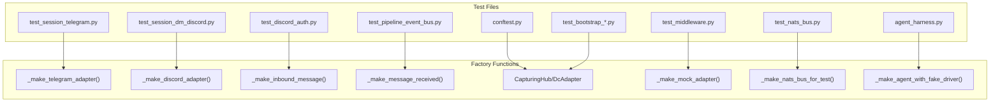
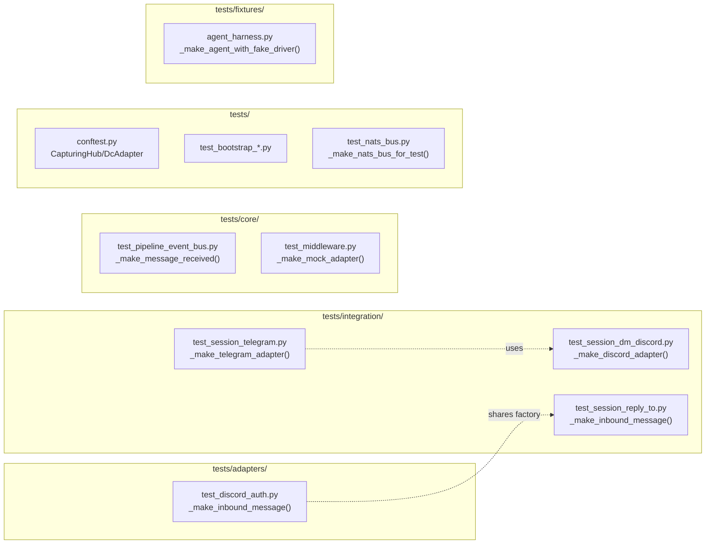

## Summary

Replace 12 `# type: ignore[arg-type]` sites across 8 test files with factory functions that have explicit typed parameters. Each slice creates/updates a factory function and removes the type ignore at affected call sites.

## Architecture

### Data Flow



### File x Function Map



## Agents

| Agent | Task count | Files |
|-------|-----------|-------|
| tester | 12 | tests/integration/*.py, tests/adapters/*.py, tests/core/*.py, tests/*.py, tests/fixtures/*.py |

## Consistency Report

- Criteria covered: 4/4
- Uncovered criteria: none
- Tasks without spec backing: none
- Gold plating exemptions applied: 0

## Micro-Tasks

### Slice V1: Telegram adapter factory

#### Task 1: Create _make_telegram_adapter factory [P] → tester
- **File:** `tests/integration/test_session_telegram.py`
- **Snippet:**
  ```python
  def _make_telegram_adapter(
      bot_id: str = "main",
      token: str = "test-token",
      inbound_bus: Bus[InboundMessage] | None = None,
      turn_store: TurnStore | None = None,
  ) -> tuple[TelegramAdapter, MagicMock]:
      """Build a TelegramAdapter with typed params."""
      from lyra.adapters.telegram import TelegramAdapter
      if inbound_bus is None:
          inbound_bus = MagicMock()
          inbound_bus.put_nowait = MagicMock()
      adapter = TelegramAdapter(
          bot_id=bot_id,
          token=token,
          inbound_bus=inbound_bus,
          turn_store=turn_store,
      )
      return adapter, inbound_bus
  ```
- **Verify:** `grep -n "_make_telegram_adapter" tests/integration/test_session_telegram.py | wc -l` (ready)
- **Expected:** ≥1 (factory defined)
- **Time:** 3 min
- **Difficulty:** 2
- **Traces:** U1→S1
- **Phase:** RED

#### Task 2: Update call sites to use factory → tester
- **File:** `tests/integration/test_session_telegram.py`
- **Snippet:** Replace `TelegramAdapter(**kwargs)` and direct kwarg calls with `_make_telegram_adapter(...)`
- **Verify:** `grep -n "# type: ignore\[arg-type\]" tests/integration/test_session_telegram.py | wc -l` (ready)
- **Expected:** 0
- **Time:** 2 min
- **Difficulty:** 1
- **Traces:** SC-1, U1→S1
- **Phase:** GREEN

#### RED-GATE: RED complete V1 → tester
- **Verify:** `grep -c "# type: ignore\[arg-type\]" tests/integration/test_session_telegram.py` returns 0
- **Phase:** RED-GATE

### Slice V2: Discord adapter factory

#### Task 3: Create _make_discord_adapter factory [P] → tester
- **File:** `tests/integration/test_session_dm_discord.py`
- **Snippet:**
  ```python
  def _make_discord_adapter(
      bot_id: str = "main",
      token: str = "test-token",
      inbound_bus: Bus[InboundMessage] | None = None,
      turn_store: TurnStore | None = None,
  ) -> DiscordAdapter:
      """Build a DiscordAdapter with typed params."""
      from lyra.adapters.discord import DiscordAdapter
      if inbound_bus is None:
          inbound_bus = MagicMock()
      return DiscordAdapter(
          bot_id=bot_id,
          inbound_bus=inbound_bus,
          intents=discord.Intents.none(),
          turn_store=turn_store,
      )
  ```
- **Verify:** `grep -n "_make_discord_adapter" tests/integration/test_session_dm_discord.py | wc -l` (ready)
- **Expected:** ≥1
- **Time:** 3 min
- **Difficulty:** 2
- **Traces:** U2→S2
- **Phase:** RED

#### Task 4: Update call sites to use factory → tester
- **File:** `tests/integration/test_session_dm_discord.py`
- **Snippet:** Replace direct kwarg calls with `_make_discord_adapter(...)`
- **Verify:** `grep -n "# type: ignore\[arg-type\]" tests/integration/test_session_dm_discord.py | wc -l` (ready)
- **Expected:** 0
- **Time:** 2 min
- **Difficulty:** 1
- **Traces:** SC-1, U2→S2
- **Phase:** GREEN

#### RED-GATE: RED complete V2 → tester
- **Verify:** `grep -c "# type: ignore\[arg-type\]" tests/integration/test_session_dm_discord.py` returns 0
- **Phase:** RED-GATE

### Slice V3: InboundMessage factory

#### Task 5: Create _make_inbound_message factory [P] → tester
- **File:** `tests/adapters/test_discord_auth.py`
- **Snippet:**
  ```python
  def _make_inbound_message(
      platform: Platform = Platform.DISCORD,
      chat_id: str = "123",
      user_id: str = "456",
      text: str = "hello",
      **overrides: Any,
  ) -> InboundMessage:
      """Build an InboundMessage with common defaults."""
      defaults = {"platform": platform, "chat_id": chat_id, "user_id": user_id, "text": text}
      defaults.update(overrides)
      return InboundMessage(**defaults)
  ```
- **Verify:** `grep -n "_make_inbound_message" tests/adapters/test_discord_auth.py | wc -l` (ready)
- **Expected:** ≥1
- **Time:** 3 min
- **Difficulty:** 2
- **Traces:** U3→S3
- **Phase:** RED

#### Task 6: Update test_session_reply_to.py to use shared factory [P] → tester
- **File:** `tests/integration/test_session_reply_to.py`
- **Snippet:** Import `_make_inbound_message` from test_discord_auth or define local wrapper
- **Verify:** `grep -n "# type: ignore\[arg-type\]" tests/integration/test_session_reply_to.py | wc -l` (ready)
- **Expected:** 0
- **Time:** 2 min
- **Difficulty:** 1
- **Traces:** U3→S3
- **Phase:** GREEN

#### RED-GATE: RED complete V3 → tester
- **Verify:** `grep -c "# type: ignore\[arg-type\]" tests/adapters/test_discord_auth.py tests/integration/test_session_reply_to.py` returns 0
- **Phase:** RED-GATE

### Slice V4: MessageReceived factory

#### Task 7: Create _make_message_received factory [P] → tester
- **File:** `tests/core/test_pipeline_event_bus.py`
- **Snippet:**
  ```python
  def _make_message_received(
      message: InboundMessage | None = None,
      timestamp: datetime | None = None,
  ) -> MessageReceived:
      """Build a MessageReceived event with defaults."""
      if message is None:
          message = _make_inbound_message()
      if timestamp is None:
          timestamp = datetime.now(timezone.utc)
      return MessageReceived(message=message, timestamp=timestamp)
  ```
- **Verify:** `grep -n "_make_message_received" tests/core/test_pipeline_event_bus.py | wc -l` (ready)
- **Expected:** ≥1
- **Time:** 3 min
- **Difficulty:** 2
- **Traces:** U4→S4
- **Phase:** RED

#### Task 8: Update call sites → tester
- **File:** `tests/core/test_pipeline_event_bus.py`
- **Snippet:** Replace `MessageReceived(**defaults)` with `_make_message_received(...)`
- **Verify:** `grep -n "# type: ignore\[arg-type\]" tests/core/test_pipeline_event_bus.py | wc -l` (ready)
- **Expected:** 0
- **Time:** 2 min
- **Difficulty:** 1
- **Traces:** SC-1, U4→S4
- **Phase:** GREEN

#### RED-GATE: RED complete V4 → tester
- **Verify:** `grep -c "# type: ignore\[arg-type\]" tests/core/test_pipeline_event_bus.py` returns 0
- **Phase:** RED-GATE

### Slice V5: conftest fixtures

#### Task 9: Fix CapturingDcAdapter in conftest.py [P] → tester
- **File:** `tests/conftest.py`
- **Snippet:**
  ```python
  class CapturingDcAdapter(_FakeDcAdapter):
      def __init__(self, shutdown_event: object | None = None, **kwargs: object) -> None:
          super().__init__(shutdown_event=shutdown_event, **kwargs)
  ```
- **Verify:** `grep -n "# type: ignore\[arg-type\]" tests/conftest.py | wc -l` (ready)
- **Expected:** 0
- **Time:** 3 min
- **Difficulty:** 2
- **Traces:** N2→S5
- **Phase:** GREEN

#### Task 10: Fix test_bootstrap_credential_resolution.py [P] → tester
- **File:** `tests/test_bootstrap_credential_resolution.py`
- **Snippet:** Same pattern as conftest — fix `CapturingTgAdapter` / `CapturingDcAdapter`
- **Verify:** `grep -n "# type: ignore\[arg-type\]" tests/test_bootstrap_credential_resolution.py | wc -l` (ready)
- **Expected:** 0
- **Time:** 2 min
- **Difficulty:** 2
- **Traces:** N2→S5
- **Phase:** GREEN

#### RED-GATE: RED complete V5 → tester
- **Verify:** `grep -c "# type: ignore\[arg-type\]" tests/conftest.py tests/test_bootstrap_credential_resolution.py` returns 0
- **Phase:** RED-GATE

### Slice V6: Misc test fixtures

#### Task 11: Fix test_middleware.py mock adapter → tester
- **File:** `tests/core/test_middleware.py`
- **Snippet:**
  ```python
  def _make_mock_adapter(platform: Platform = Platform.TELEGRAM) -> _MockAdapter:
      """Build a mock adapter that satisfies ChannelAdapter protocol."""
      adapter = _MockAdapter()
      adapter.platform = platform
      return adapter
  ```
- **Verify:** `grep -n "# type: ignore\[arg-type\]" tests/core/test_middleware.py | wc -l` (ready)
- **Expected:** 0
- **Time:** 3 min
- **Difficulty:** 3
- **Traces:** N3→S6
- **Phase:** GREEN

#### Task 12: Fix test_nats_bus.py and agent_harness.py → tester
- **File:** `tests/nats/test_nats_bus.py`, `tests/fixtures/agent_harness.py`
- **Snippet:** For `nc=None` in NatsBus, either cast to `NatsClient | None` or use `# justified: testing without real NATS`
- **Verify:** `grep -c "# type: ignore\[arg-type\]" tests/nats/test_nats_bus.py tests/fixtures/agent_harness.py` (ready)
- **Expected:** 0 (or justified)
- **Time:** 4 min
- **Difficulty:** 3
- **Traces:** N4,N5→S6
- **Phase:** GREEN

#### RED-GATE: RED complete V6 → tester
- **Verify:** `grep -c "# type: ignore\[arg-type\]" tests/core/test_middleware.py tests/nats/test_nats_bus.py tests/fixtures/agent_harness.py` returns 0
- **Phase:** RED-GATE

### Final Verification

#### Task 13: Run full verification → tester
- **Verify:** `uv run pyright && uv run pytest`
- **Expected:** 0 errors, all tests pass
- **Time:** 5 min
- **Difficulty:** 1
- **Traces:** SC-1, SC-2, SC-3, SC-4
- **Phase:** REFACTOR

## Task IDs

<!-- Generated by /plan. Used by /implement to resume tasks on session restart. -->
- T8: a3998fa6-26f5-4e03-9c6d-07e6a0dd5e72 — Create _make_telegram_adapter factory
- T9: a3998fa7-26f5-4e03-9c6d-07e6a0dd5e73 — Update Telegram call sites to use factory
- T10: a3998fa8-26f5-4e03-9c6d-07e6a0dd5e74 — Create _make_discord_adapter factory
- T11: a3998fa9-26f5-4e03-9c6d-07e6a0dd5e75 — Update Discord call sites to use factory
- T12: a3998faa-26f5-4e03-9c6d-07e6a0dd5e76 — Create _make_inbound_message factory
- T13: a3998fab-26f5-4e03-9c6d-07e6a0dd5e77 — Update test_session_reply_to.py to use shared factory
- T14: a3998fac-26f5-4e03-9c6d-07e6a0dd5e78 — Create _make_message_received factory
- T15: a3998fad-26f5-4e03-9c6d-07e6a0dd5e79 — Update MessageReceived call sites
- T16: a3998fae-26f5-4e03-9c6d-07e6a0dd5e7a — Fix CapturingDcAdapter in conftest.py
- T17: a3998faf-26f5-4e03-9c6d-07e6a0dd5e7b — Fix test_bootstrap_credential_resolution.py
- T18: a3998fb0-26f5-4e03-9c6d-07e6a0dd5e7c — Fix test_middleware.py mock adapter
- T19: a3998fb1-26f5-4e03-9c6d-07e6a0dd5e7d — Fix test_nats_bus.py and agent_harness.py
- T20: a3998fb2-26f5-4e03-9c6d-07e6a0dd5e7e — Run full verification (pyright + pytest)
