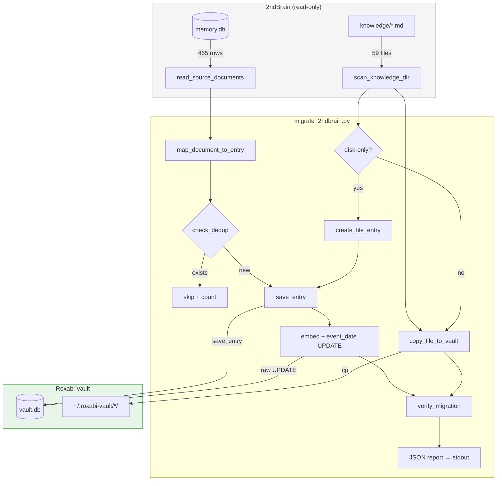
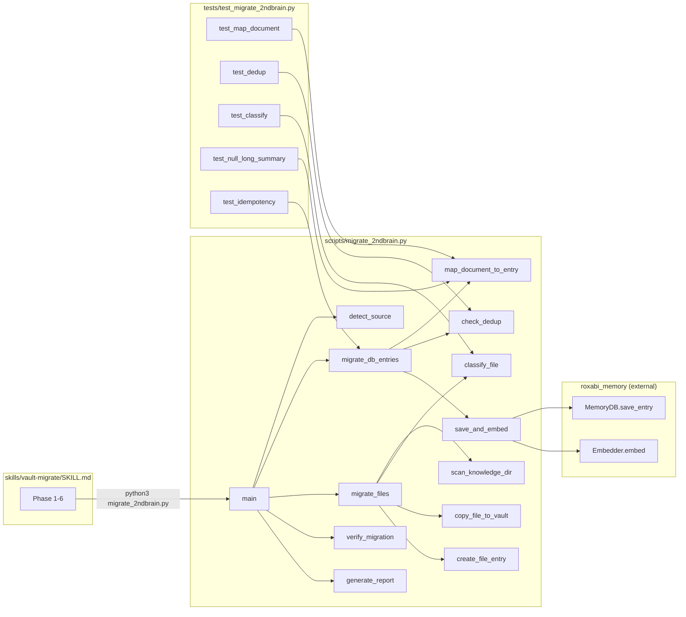

## Summary

Rewrite the vault-migrate skill as a standalone Python script (`migrate_2ndbrain.py`) + updated SKILL.md. The script handles all 3 slices: DB migration (465 entries with field mapping, dedup, embeddings), file migration (59 files + 16 disk-only entries), and verification with idempotency. Implementation lives in `~/projects/roxabi-plugins/plugins/vault/` on a feature branch.

## Architecture

### Data Flow



### File x Function Map



## Agents

| Agent | Tasks | Files |
|-------|-------|-------|
| backend-dev | 14 | `scripts/migrate_2ndbrain.py`, `skills/vault-migrate/SKILL.md` |
| tester | 4 | `tests/test_migrate_2ndbrain.py` |

## Repo and Branch

- **Repo:** `~/projects/roxabi-plugins/`
- **Branch:** `feat/84-vault-migrate-v2`
- **After merge:** run `./sync-plugins.sh` to update caches

## Consistency Report

| Criterion | Task(s) | Status |
|-----------|---------|--------|
| SC-1: 465 docs migrated with field mapping | T2, T3, T4 | covered |
| SC-2: 16 disk-only files auto-categorized | T9, T10 | covered |
| SC-3: namespace='vault' | T4 (save_entry default) | covered |
| SC-4: fastembed embeddings | T5 | covered |
| SC-5: event_date populated | T5 | covered |
| SC-6: dedup by source_id | T3, T16 | covered |
| SC-7: 59 files copied | T8 | covered |
| SC-8: 3 broken refs logged | T6 | covered |
| SC-9: FTS5 smoke tests | T13 | covered |
| SC-10: existing data untouched | T3 (dedup protects) | covered |
| SC-11: JSON report | T14 | covered |
| SC-12: memory.db read-only | T1 | covered |

**12/12 criteria covered. 0 uncovered. 0 untraced.**

## Micro-Tasks

### SL1 — DB Migration Core

---

**T1: Script scaffold + source detection** `[P]`
- **Agent:** backend-dev
- **File:** `scripts/migrate_2ndbrain.py`
- **Spec trace:** N1 → SC-12
- **Phase:** RED
- **Difficulty:** 2

Create `migrate_2ndbrain.py` with CLI entry point, source detection, schema validation, and read-only connection.

```python
#!/usr/bin/env python3
"""Migrate 2ndBrain memory.db → Roxabi Vault (v2 schema + fastembed)."""

import argparse, json, sqlite3, sys
from pathlib import Path

DEFAULT_SOURCE = Path.home() / "projects/2ndBrain/knowledge/memory.db"
EXPECTED_COLUMNS = {"id", "category", "type", "title", "summary", "saved_at"}

def detect_source(path: str | None = None) -> Path:
    p = Path(path) if path else DEFAULT_SOURCE
    if not p.exists():
        print(json.dumps({"error": f"Source not found: {p}"}))
        sys.exit(1)
    # Validate schema
    conn = sqlite3.connect(f"file:{p}?mode=ro", uri=True)
    cols = {r[1] for r in conn.execute("PRAGMA table_info(documents)")}
    if not EXPECTED_COLUMNS.issubset(cols):
        print(json.dumps({"error": f"Missing columns: {EXPECTED_COLUMNS - cols}"}))
        sys.exit(1)
    conn.close()
    return p

def main():
    parser = argparse.ArgumentParser()
    parser.add_argument("--source", help="Path to memory.db")
    parser.add_argument("--dry-run", action="store_true")
    args = parser.parse_args()
    src = detect_source(args.source)
    # ... migration phases ...

if __name__ == "__main__":
    main()
```

- **Verify:** `python3 scripts/migrate_2ndbrain.py --source /nonexistent 2>&1 | jq .error`
- **Expected:** `"Source not found: /nonexistent"`

---

**T2: Read source documents** `[P]`
- **Agent:** backend-dev
- **File:** `scripts/migrate_2ndbrain.py`
- **Spec trace:** N2
- **Phase:** RED
- **Difficulty:** 1

```python
def read_source_documents(src: Path) -> list[dict]:
    conn = sqlite3.connect(f"file:{src}?mode=ro", uri=True)
    conn.row_factory = sqlite3.Row
    rows = conn.execute("SELECT * FROM documents").fetchall()
    conn.close()
    return [dict(r) for r in rows]
```

- **Verify:** `python3 -c "from scripts.migrate_2ndbrain import read_source_documents; print(len(read_source_documents(Path('...'))))"`
- **Expected:** `465`

---

**T3: Field mapping + dedup check** `[P]`
- **Agent:** backend-dev
- **File:** `scripts/migrate_2ndbrain.py`
- **Spec trace:** N3, N4 → SC-1, SC-6, SC-10
- **Phase:** RED
- **Difficulty:** 3

```python
def map_document_to_entry(doc: dict) -> dict:
    content = doc["summary"]
    if doc.get("long_summary"):
        content += "\n\n" + doc["long_summary"]
    metadata = {
        "source_id": doc["id"],
        "url": doc.get("url"),
        "author": doc.get("author"),
        "preview": doc.get("preview"),
        "added_by": doc.get("added_by"),
        "subtype": doc.get("subtype"),
        "status": doc.get("status"),
        "content_file": doc.get("content_file"),
    }
    # Strip None values
    metadata = {k: v for k, v in metadata.items() if v is not None}
    return {
        "title": doc["title"],
        "content": content,
        "category": doc["category"],
        "type": doc["type"],
        "namespace": "vault",
        "metadata": metadata,
        "created_at": doc["saved_at"],
        "event_date": doc.get("source_date"),
    }

def check_dedup(vault_conn, source_id: str) -> bool:
    row = vault_conn.execute(
        "SELECT id FROM entries WHERE json_extract(metadata, '$.source_id') = ?",
        (source_id,)
    ).fetchone()
    return row is not None
```

- **Verify:** unit test (T15)
- **Expected:** mapping produces correct fields; dedup returns True for existing source_id

---

**T4: Save entry via MemoryDB.save_entry()** `[P]`
- **Agent:** backend-dev
- **File:** `scripts/migrate_2ndbrain.py`
- **Spec trace:** N5 → SC-1, SC-3
- **Phase:** RED
- **Difficulty:** 2

```python
def save_entry(db: "MemoryDB", mapped: dict) -> int:
    entry = db.save_entry(
        content=mapped["content"],
        type=mapped["type"],
        title=mapped["title"],
        category=mapped["category"],
        namespace=mapped["namespace"],
        metadata=mapped["metadata"],
    )
    return entry.id
```

- **Verify:** after calling, `vault stats` count increases by 1
- **Expected:** entry created with namespace='vault'

---

**T5: Embed + set event_date (raw UPDATE)** `[P]`
- **Agent:** backend-dev
- **File:** `scripts/migrate_2ndbrain.py`
- **Spec trace:** N6 → SC-4, SC-5
- **Phase:** RED
- **Difficulty:** 3

```python
def embed_and_update(db: "MemoryDB", embedder: "Embedder", entry_id: int, content: str, event_date: str | None):
    embedding = embedder.embed(content)
    db.connection.execute(
        "UPDATE entries SET embedding = ?, event_date = ? WHERE id = ?",
        (embedding, event_date, entry_id)
    )
    db.connection.commit()
```

Embedder instantiated once before the loop:
```python
from roxabi_memory import Embedder
embedder = Embedder()  # loads ONNX model once
```

- **Verify:** `SELECT length(embedding) FROM entries WHERE id = ?` → 1536 (384 floats × 4 bytes)
- **Expected:** non-null embedding BLOB, event_date populated

---

**T6: Migration loop + broken ref detection**
- **Agent:** backend-dev
- **File:** `scripts/migrate_2ndbrain.py`
- **Spec trace:** N5, N6, N10 → SC-1, SC-8
- **Phase:** RED
- **Difficulty:** 3
- **Depends on:** T1–T5

```python
def migrate_db_entries(src: Path, db: "MemoryDB", embedder: "Embedder", knowledge_dir: Path, dry_run=False) -> dict:
    docs = read_source_documents(src)
    stats = {"new": 0, "skipped": 0, "errors": 0, "broken_refs": []}
    for doc in docs:
        try:
            mapped = map_document_to_entry(doc)
            if check_dedup(db.connection, mapped["metadata"]["source_id"]):
                stats["skipped"] += 1
                continue
            if not dry_run:
                entry_id = save_entry(db, mapped)
                embed_and_update(db, embedder, entry_id, mapped["content"], mapped["event_date"])
            stats["new"] += 1
            # Check broken file refs
            cf = doc.get("content_file")
            if cf and not (knowledge_dir / cf).exists():
                stats["broken_refs"].append(cf)
        except Exception as e:
            stats["errors"] += 1
            print(json.dumps({"warning": f"Failed on {doc['id']}: {e}"}), file=sys.stderr)
    return stats
```

- **Verify:** run against real memory.db, check `vault stats` count
- **Expected:** 465 new entries on first run, 3 broken refs logged

---

**`RED-GATE SL1`** — DB migration complete. Verify: `vault stats` shows ~467 entries. `vault search "twitter"` returns results.

---

### SL2 — File Migration

---

**T7: Scan knowledge directory** `[P]`
- **Agent:** backend-dev
- **File:** `scripts/migrate_2ndbrain.py`
- **Spec trace:** N7
- **Phase:** RED
- **Difficulty:** 2

```python
KNOWLEDGE_DIR = Path.home() / "projects/2ndBrain/knowledge"

def scan_knowledge_dir(knowledge_dir: Path) -> list[Path]:
    """Return all .md files in knowledge dir, sorted."""
    return sorted(knowledge_dir.rglob("*.md"))
```

- **Verify:** `len(scan_knowledge_dir(KNOWLEDGE_DIR))` → 59
- **Expected:** 59 markdown files found

---

**T8: Copy files to vault + destination mapping** `[P]`
- **Agent:** backend-dev
- **File:** `scripts/migrate_2ndbrain.py`
- **Spec trace:** N8 → SC-7
- **Phase:** RED
- **Difficulty:** 2

```python
import shutil

VAULT_HOME = Path.home() / ".roxabi-vault"

def get_vault_dest(relative_path: str) -> Path:
    """Map source relative path to vault destination."""
    return VAULT_HOME / relative_path

def copy_file_to_vault(src_file: Path, knowledge_dir: Path) -> Path:
    relative = src_file.relative_to(knowledge_dir)
    dest = get_vault_dest(str(relative))
    dest.parent.mkdir(parents=True, exist_ok=True)
    shutil.copy2(src_file, dest)
    return dest
```

- **Verify:** file exists at `~/.roxabi-vault/ideas/lyra-avatar.md`
- **Expected:** all 59 files copied preserving directory structure

---

**T9: Classify disk-only files** `[P]`
- **Agent:** backend-dev
- **File:** `scripts/migrate_2ndbrain.py`
- **Spec trace:** N9 → SC-2
- **Phase:** RED
- **Difficulty:** 2

```python
DIR_CATEGORY_MAP = {
    "analyses": ("knowledge", "analysis"),
    "content": ("content", "article"),  # default; linkedin detected by filename
    "cv": ("content", "cv-base"),
    "cv/adapted": ("content", "cv-adapted"),
    "ideas": ("idea", "idea"),
    "learnings": ("knowledge", "learning"),
}

def classify_file(relative_path: str) -> tuple[str, str, str]:
    """Return (category, type, source_id) for a disk-only file."""
    parts = Path(relative_path).parts
    source_id = f"file:{relative_path}"

    if len(parts) >= 2 and parts[0] == "cv" and parts[1] == "adapted":
        return "content", "cv-adapted", source_id
    dir_name = parts[0] if parts else ""
    cat, typ = DIR_CATEGORY_MAP.get(dir_name, ("knowledge", "note"))
    # LinkedIn detection
    if dir_name == "content" and "linkedin" in relative_path.lower():
        typ = "linkedin"
    return cat, typ, source_id
```

- **Verify:** unit test (T16)
- **Expected:** correct classification for each directory

---

**T10: Create entries for disk-only files**
- **Agent:** backend-dev
- **File:** `scripts/migrate_2ndbrain.py`
- **Spec trace:** N9 → SC-2
- **Phase:** RED
- **Difficulty:** 2
- **Depends on:** T4, T5, T9

```python
def create_file_entry(db, embedder, file_path: Path, knowledge_dir: Path, dry_run=False) -> int | None:
    relative = str(file_path.relative_to(knowledge_dir))
    cat, typ, source_id = classify_file(relative)
    if check_dedup(db.connection, source_id):
        return None  # already migrated
    content = file_path.read_text(encoding="utf-8")
    title = file_path.stem.replace("-", " ").replace("_", " ")
    metadata = {"source_id": source_id, "content_file": relative}
    if not dry_run:
        entry_id = save_entry(db, {
            "title": title, "content": content,
            "category": cat, "type": typ,
            "namespace": "vault", "metadata": metadata,
            "created_at": None, "event_date": None,
        })
        embed_and_update(db, embedder, entry_id, content, None)
        return entry_id
    return -1
```

- **Verify:** `vault search "mmorpg"` returns a result after migration
- **Expected:** 16 new entries created

---

**T11: File migration loop**
- **Agent:** backend-dev
- **File:** `scripts/migrate_2ndbrain.py`
- **Spec trace:** N7, N8, N9 → SC-2, SC-7
- **Phase:** RED
- **Difficulty:** 3
- **Depends on:** T7–T10

```python
def migrate_files(knowledge_dir: Path, db, embedder, migrated_source_ids: set, dry_run=False) -> dict:
    files = scan_knowledge_dir(knowledge_dir)
    stats = {"copied": 0, "new_entries": 0, "skipped": 0}
    for f in files:
        relative = str(f.relative_to(knowledge_dir))
        copy_file_to_vault(f, knowledge_dir)
        stats["copied"] += 1
        # Check if this file already has a DB entry (migrated in SL1)
        file_source_id = f"file:{relative}"
        if file_source_id in migrated_source_ids or check_dedup(db.connection, file_source_id):
            stats["skipped"] += 1
            continue
        # Also skip if a DB entry with this content_file was already migrated
        row = db.connection.execute(
            "SELECT id FROM entries WHERE json_extract(metadata, '$.content_file') = ?",
            (relative,)
        ).fetchone()
        if row:
            stats["skipped"] += 1
            continue
        # Disk-only file → create entry
        entry_id = create_file_entry(db, embedder, f, knowledge_dir, dry_run)
        if entry_id:
            stats["new_entries"] += 1
    return stats
```

- **Verify:** 59 files in `~/.roxabi-vault/`, 16 new entries
- **Expected:** all files copied, 16 new entries created

---

**`RED-GATE SL2`** — File migration complete. Verify: `ls ~/.roxabi-vault/ideas/` shows files. `vault search "mmorpg"` returns results.

---

### SL3 — Verification + Idempotency

---

**T12: Count verification**
- **Agent:** backend-dev
- **File:** `scripts/migrate_2ndbrain.py`
- **Spec trace:** N11 → SC-11
- **Phase:** GREEN
- **Difficulty:** 2
- **Depends on:** T6, T11

```python
def verify_counts(db, src: Path) -> dict:
    src_conn = sqlite3.connect(f"file:{src}?mode=ro", uri=True)
    src_count = src_conn.execute("SELECT COUNT(*) FROM documents").fetchone()[0]
    src_by_cat = dict(src_conn.execute(
        "SELECT category, COUNT(*) FROM documents GROUP BY category"
    ).fetchall())
    src_conn.close()

    vault_total = db.connection.execute(
        "SELECT COUNT(*) FROM entries WHERE namespace='vault'"
    ).fetchone()[0]
    vault_by_cat = dict(db.connection.execute(
        "SELECT category, COUNT(*) FROM entries WHERE namespace='vault' GROUP BY category"
    ).fetchall())

    return {
        "source_count": src_count,
        "vault_count": vault_total,
        "expected_total": src_count + 16 + 2,  # DB + disk-only + pre-existing
        "by_category": {"source": src_by_cat, "vault": vault_by_cat},
    }
```

- **Verify:** `vault_count >= source_count + 16`
- **Expected:** counts match expected totals

---

**T13: FTS5 smoke tests**
- **Agent:** backend-dev
- **File:** `scripts/migrate_2ndbrain.py`
- **Spec trace:** N11 → SC-9
- **Phase:** GREEN
- **Difficulty:** 2
- **Depends on:** T6, T11

```python
SMOKE_QUERIES = [
    ("twitter", "knowledge/twitter entries"),
    ("github", "knowledge/github entries"),
    ("linkedin", "content/linkedin entries"),
    ("mmorpg", "learnings content"),
    ("Product Manager", "CV entries"),
]

def verify_fts(db) -> list[dict]:
    from roxabi_memory.fts import search_fts
    results = []
    for query, desc in SMOKE_QUERIES:
        hits = search_fts(db.connection, query, namespace="vault", limit=5)
        results.append({"query": query, "desc": desc, "hits": len(hits), "pass": len(hits) >= 1})
    return results
```

- **Verify:** all 5 queries return `pass: true`
- **Expected:** 5/5 pass

---

**T14: Report generation + main integration**
- **Agent:** backend-dev
- **File:** `scripts/migrate_2ndbrain.py`
- **Spec trace:** O1 → SC-11
- **Phase:** GREEN
- **Difficulty:** 3
- **Depends on:** T12, T13

Wire everything into `main()`. Generate JSON report to stdout.

```python
def generate_report(db_stats, file_stats, count_check, fts_results, broken_refs) -> dict:
    return {
        "migration": {
            "db_entries": {"new": db_stats["new"], "skipped": db_stats["skipped"], "errors": db_stats["errors"]},
            "files": {"copied": file_stats["copied"], "new_entries": file_stats["new_entries"]},
            "broken_refs": broken_refs,
        },
        "verification": {
            "counts": count_check,
            "fts_smoke_tests": fts_results,
            "all_fts_pass": all(r["pass"] for r in fts_results),
        },
        "idempotent": db_stats["skipped"] > 0 and db_stats["new"] == 0,  # on second run
    }
```

- **Verify:** `python3 scripts/migrate_2ndbrain.py | jq .migration.db_entries.new`
- **Expected:** JSON report to stdout

---

**T15: Rewrite SKILL.md**
- **Agent:** backend-dev
- **File:** `skills/vault-migrate/SKILL.md`
- **Spec trace:** U1
- **Phase:** REFACTOR
- **Difficulty:** 2
- **Depends on:** T14

Rewrite SKILL.md to call `migrate_2ndbrain.py` instead of inline Python. 6 phases: detect → confirm → migrate → verify → report.

- **Verify:** skill invocation triggers `migrate_2ndbrain.py`
- **Expected:** SKILL.md calls script, displays report

---

**`RED-GATE SL3`** — Verification complete. Second run = 0 new entries. All FTS5 tests pass.

---

### Tests

---

**T16: Unit tests — field mapping + classify** `[P]`
- **Agent:** tester
- **File:** `tests/test_migrate_2ndbrain.py`
- **Spec trace:** SC-1, SC-2
- **Phase:** GREEN
- **Difficulty:** 2

```python
def test_map_document_with_long_summary():
    doc = {"id": "abc", "title": "T", "summary": "S", "long_summary": "LS",
           "category": "knowledge", "type": "twitter", "saved_at": "2026-01-01T00:00:00"}
    result = map_document_to_entry(doc)
    assert result["content"] == "S\n\nLS"
    assert result["metadata"]["source_id"] == "abc"

def test_map_document_null_long_summary():
    doc = {"id": "abc", "title": "T", "summary": "S", "long_summary": None, ...}
    result = map_document_to_entry(doc)
    assert result["content"] == "S"

def test_classify_learnings():
    assert classify_file("learnings/session-foo.md") == ("knowledge", "learning", "file:learnings/session-foo.md")

def test_classify_cv_adapted():
    assert classify_file("cv/adapted/job/cv.md") == ("content", "cv-adapted", "file:cv/adapted/job/cv.md")

def test_classify_linkedin():
    assert classify_file("content/20260128_linkedin_post_foo.md") == ("content", "linkedin", "file:content/20260128_linkedin_post_foo.md")
```

- **Verify:** `uv run pytest tests/test_migrate_2ndbrain.py -v`
- **Expected:** all tests pass

---

**T17: Integration test — dedup + idempotency** `[P]`
- **Agent:** tester
- **File:** `tests/test_migrate_2ndbrain.py`
- **Spec trace:** SC-6
- **Phase:** GREEN
- **Difficulty:** 3

Test with a fixture DB (3 rows), run migration twice, verify second run = 0 new.

- **Verify:** `uv run pytest tests/test_migrate_2ndbrain.py::test_idempotency -v`
- **Expected:** second run stats show `new=0, skipped=3`

---

**T18: Integration test — broken refs** `[P]`
- **Agent:** tester
- **File:** `tests/test_migrate_2ndbrain.py`
- **Spec trace:** SC-8
- **Phase:** GREEN
- **Difficulty:** 2

Test with a fixture DB row referencing a non-existent file, verify warning logged + no crash.

- **Verify:** `uv run pytest tests/test_migrate_2ndbrain.py::test_broken_refs -v`
- **Expected:** broken ref logged, migration continues

---

**T19: Integration test — existing vault data preserved** `[P]`
- **Agent:** tester
- **File:** `tests/test_migrate_2ndbrain.py`
- **Spec trace:** SC-10
- **Phase:** GREEN
- **Difficulty:** 2

Pre-seed vault with 2 entries without `source_id`, run migration, verify both entries still present and unchanged.

- **Verify:** `uv run pytest tests/test_migrate_2ndbrain.py::test_existing_data_preserved -v`
- **Expected:** 2 pre-existing entries untouched
