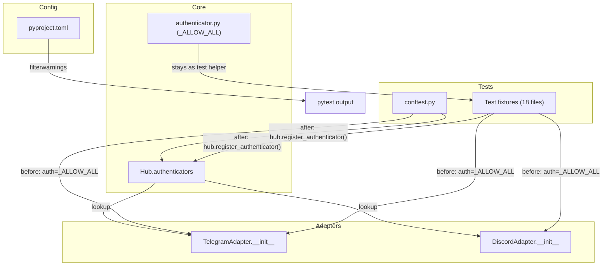
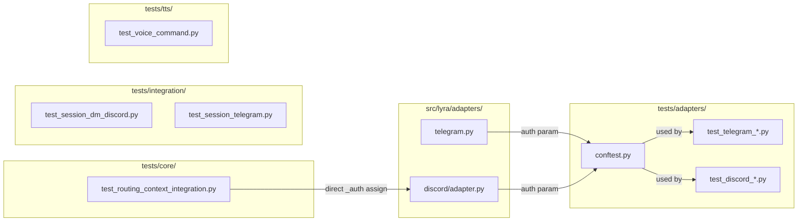

## Summary

Remove the deprecated `auth=` constructor parameter from TelegramAdapter and DiscordAdapter (2 files), migrate 18 test files from `auth=_ALLOW_ALL` to `hub.register_authenticator()` pattern, and suppress upstream deprecation warnings in pytest config.

## Architecture

### Data Flow



### File × Function Map



## Bootstrap Context

N/A — no analysis artifact exists for this issue.

## Agents

| Agent | Task count | Files |
|-------|-----------|-------|
| backend-dev | 2 | `src/lyra/adapters/telegram.py`, `src/lyra/adapters/discord/adapter.py` |
| tester | 18 | `tests/adapters/*.py`, `tests/core/test_routing_context_integration.py`, `tests/integration/*.py`, `tests/tts/test_voice_command.py` |
| devops | 1 | `pyproject.toml` |

## Consistency Report

- Criteria covered: 9/9
- Uncovered criteria: none
- Tasks without spec backing: none
- Gold plating exemptions applied: 0

## Micro-Tasks

### Slice V1: Remove auth param from adapters

#### Task 1: Remove auth param from TelegramAdapter → backend-dev
- **File:** `src/lyra/adapters/telegram.py`
- **Snippet:**
  ```python
  # Remove from signature (line 97):
  # auth: Authenticator = _DENY_ALL,

  # Remove warning code (lines 101-109):
  # if auth is not _DENY_ALL: ...

  # Remove self._auth assignment (line 121):
  # self._auth: Authenticator = auth
  ```
- **Verify:** `grep -q "auth:" src/lyra/adapters/telegram.py && grep -q "DeprecationWarning" src/lyra/adapters/telegram.py` (expect: both false)
- **Expected:** No `auth` param in signature, no DeprecationWarning code
- **Time:** 5 min | **Difficulty:** 2
- **Traces:** SC-1, SC-3, SC-4, N1 | **Phase:** GREEN

#### Task 2: Remove auth param from DiscordAdapter → backend-dev
- **File:** `src/lyra/adapters/discord/adapter.py`
- **Snippet:**
  ```python
  # Remove from signature (line 75):
  # auth: Authenticator = _DENY_ALL,

  # Remove warning code (lines 86-94):
  # if auth is not _DENY_ALL: ...

  # Remove self._auth assignment (line 101):
  # self._auth: Authenticator = auth
  ```
- **Verify:** `grep -q "auth:" src/lyra/adapters/discord/adapter.py && grep -q "DeprecationWarning" src/lyra/adapters/discord/adapter.py` (expect: both false)
- **Expected:** No `auth` param in signature, no DeprecationWarning code
- **Time:** 5 min | **Difficulty:** 2
- **Traces:** SC-2, SC-3, SC-4, N2 | **Phase:** GREEN

#### RED-GATE: V1 adapters compile → tester
- **Verify:** `uv run pyright src/lyra/adapters/telegram.py src/lyra/adapters/discord/adapter.py`
- **Expected:** 0 errors, 0 warnings
- **Phase:** RED-GATE

### Slice V2: Migrate test files (18 files)

#### Task 3: Migrate tests/adapters/conftest.py → tester
- **File:** `tests/adapters/conftest.py`
- **Snippet:**
  ```python
  # Line 245: Remove auth=_ALLOW_ALL from _make_telegram_adapter
  # If auth is needed in tests, use hub.register_authenticator() instead
  ```
- **Verify:** `grep -q "auth=_ALLOW_ALL" tests/adapters/conftest.py` (expect: false)
- **Expected:** No `auth=_ALLOW_ALL` pattern
- **Time:** 3 min | **Difficulty:** 2
- **Traces:** SC-5, N3 | **Phase:** GREEN

#### Task 4: Migrate tests/adapters/test_telegram_*.py (6 files) [P] → tester
- **Files:**
  - `tests/adapters/test_telegram_normalize_fields.py`
  - `tests/adapters/test_telegram_on_message.py`
  - `tests/adapters/test_telegram_outbound_send.py`
  - `tests/adapters/test_telegram_typing.py`
  - `tests/adapters/test_telegram_voice.py`
  - `tests/adapters/test_scope_id.py`
- **Snippet:** Remove `auth=_ALLOW_ALL` from adapter instantiations
- **Verify:** `grep -r "auth=_ALLOW_ALL" tests/adapters/test_telegram_*.py tests/adapters/test_scope_id.py` (expect: no matches)
- **Expected:** No `auth=_ALLOW_ALL` pattern in any file
- **Time:** 8 min | **Difficulty:** 2
- **Traces:** SC-5, N3 | **Phase:** GREEN

#### Task 5: Migrate tests/adapters/test_discord_*.py (8 files) [P] → tester
- **Files:**
  - `tests/adapters/test_discord_audio.py`
  - `tests/adapters/test_discord_edge.py`
  - `tests/adapters/test_discord_normalize.py`
  - `tests/adapters/test_discord_outbound.py`
  - `tests/adapters/test_discord_threads.py`
  - `tests/adapters/test_discord_typing.py`
  - `tests/adapters/test_discord_watch.py`
  - `tests/adapters/test_discord_voice_commands.py`
- **Snippet:** Remove `auth=_ALLOW_ALL` from adapter instantiations; remove `adapter._auth = _ALLOW_ALL` direct assignments
- **Verify:** `grep -r "auth=_ALLOW_ALL\|adapter\._auth" tests/adapters/test_discord_*.py` (expect: no matches)
- **Expected:** No `auth=_ALLOW_ALL` or `adapter._auth` patterns
- **Time:** 10 min | **Difficulty:** 3
- **Traces:** SC-5, SC-6, N3, N5 | **Phase:** GREEN

#### Task 6: Migrate tests/core/test_routing_context_integration.py → tester
- **File:** `tests/core/test_routing_context_integration.py`
- **Snippet:** Remove `adapter._auth = _ALLOW_ALL` (line 149)
- **Verify:** `grep -q "adapter\._auth" tests/core/test_routing_context_integration.py` (expect: false)
- **Expected:** No direct `_auth` assignment
- **Time:** 3 min | **Difficulty:** 2
- **Traces:** SC-6, N5 | **Phase:** GREEN

#### Task 7: Migrate tests/integration/*.py (2 files) [P] → tester
- **Files:**
  - `tests/integration/test_session_dm_discord.py`
  - `tests/integration/test_session_telegram.py`
- **Snippet:** Remove `auth=_ALLOW_ALL` from adapter instantiations
- **Verify:** `grep -r "auth=_ALLOW_ALL" tests/integration/` (expect: no matches)
- **Expected:** No `auth=_ALLOW_ALL` pattern
- **Time:** 4 min | **Difficulty:** 2
- **Traces:** SC-5, N3 | **Phase:** GREEN

#### Task 8: Migrate tests/tts/test_voice_command.py → tester
- **File:** `tests/tts/test_voice_command.py`
- **Snippet:** Remove `auth=_ALLOW_ALL` from adapter instantiations
- **Verify:** `grep -q "auth=_ALLOW_ALL" tests/tts/test_voice_command.py` (expect: false)
- **Expected:** No `auth=_ALLOW_ALL` pattern
- **Time:** 2 min | **Difficulty:** 2
- **Traces:** SC-5, N3 | **Phase:** GREEN

#### RED-GATE: V2 tests pass → tester
- **Verify:** `uv run pytest tests/ -x -q`
- **Expected:** All tests pass
- **Phase:** RED-GATE

### Slice V3: Suppress upstream warnings

#### Task 9: Add filterwarnings to pyproject.toml → devops
- **File:** `pyproject.toml`
- **Snippet:**
  ```toml
  [tool.pytest.ini_options]
  asyncio_mode = "auto"
  testpaths = ["tests", "packages/roxabi-nats/tests", "packages/roxabi-contracts/tests", "scripts/corpus/tests"]
  addopts = "--import-mode=importlib -n auto"
  filterwarnings = [
      "ignore:'audioop' is deprecated:DeprecationWarning",
      "ignore:websockets.legacy is deprecated:DeprecationWarning",
      "ignore:websockets.server.WebSocketServerProtocol is deprecated:DeprecationWarning",
  ]
  ```
- **Verify:** `grep -q "filterwarnings" pyproject.toml`
- **Expected:** filterwarnings section present
- **Time:** 2 min | **Difficulty:** 1
- **Traces:** SC-9, N4 | **Phase:** GREEN

#### RED-GATE: V3 warnings suppressed → tester
- **Verify:** `uv run pytest tests/ -W error::DeprecationWarning 2>&1 | grep -c "DeprecationWarning" || echo "0"` (expect: 0 Lyra warnings, upstream suppressed)
- **Expected:** No DeprecationWarning from Lyra code in output
- **Phase:** RED-GATE

### Slice V4: Full test suite pass

#### Task 10: Run full test suite → tester
- **File:** N/A
- **Verify:** `uv run pytest tests/ -v --tb=short`
- **Expected:** All tests pass, 0 failures
- **Time:** 5 min | **Difficulty:** 1
- **Traces:** SC-7, SC-8 | **Phase:** GREEN

#### Task 11: Verify no Lyra deprecation warnings → tester
- **File:** N/A
- **Verify:** `uv run pytest tests/ -W error::DeprecationWarning 2>&1 | grep -E "lyra|adapters" | grep -c "DeprecationWarning" || echo "0"`
- **Expected:** 0 warnings from Lyra code
- **Time:** 2 min | **Difficulty:** 1
- **Traces:** SC-8 | **Phase:** GREEN

## Task IDs

<!-- Generated by /plan. Used by /implement to resume tasks on session restart. -->
- T1: 9 — Remove auth param from TelegramAdapter
- T2: 10 — Remove auth param from DiscordAdapter
- T3: 11 — Migrate tests/adapters/conftest.py
- T4: 12 — Migrate test_telegram_*.py files (6 files)
- T5: 13 — Migrate test_discord_*.py files (8 files)
- T6: 14 — Migrate test_routing_context_integration.py
- T7: 15 — Migrate tests/integration/*.py (2 files)
- T8: 16 — Migrate tests/tts/test_voice_command.py
- T9: 17 — Add filterwarnings to pyproject.toml
- T10: 18 — Run full test suite
- T11: 19 — Verify no Lyra deprecation warnings
