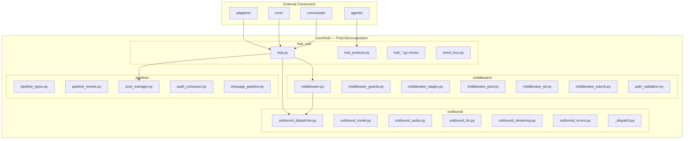
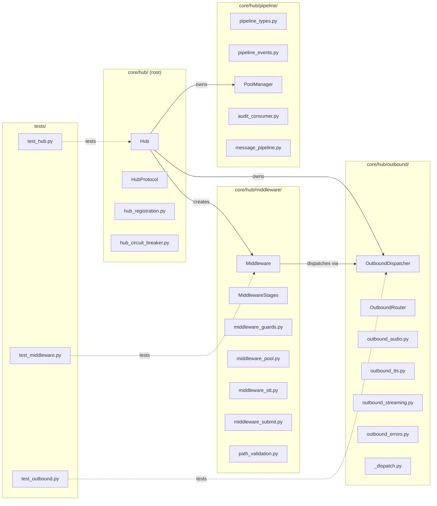

## Summary

Decompose `core/hub/` (30 files) into 4 sub-packages — `middleware/`, `outbound/`, `pipeline/`, `hub_root` — each ≤12 files. Pure refactoring with backward-compatible re-exports. Uses slice-by-slice approach with RED-GATE after each slice.

## Architecture

### Data Flow



### File x Function Map



## Agents

| Agent | Task count | Files |
|-------|-----------|-------|
| backend-dev | 16 | `core/hub/*.py`, `core/hub/*/__init__.py` |
| tester | 4 | Test verification only |

## Consistency Report

- Criteria covered: 9/9
- Uncovered criteria: none
- Tasks without spec backing: none
- Gold plating exemptions applied: 0

## Micro-Tasks

### Slice V1: Extract `middleware/` sub-package

#### Task 1: Create `core/hub/middleware/` directory and `__init__.py` → backend-dev
- **File:** `src/lyra/core/hub/middleware/__init__.py`
- **Snippet:**
```python
"""Middleware sub-package for inbound message processing."""
from .middleware import Middleware
from .middleware_stages import MiddlewareStages
from .middleware_guards import *
from .middleware_pool import *
from .middleware_stt import *
from .middleware_submit import *
from .path_validation import validate_path

__all__ = ["Middleware", "MiddlewareStages", "validate_path"]
```
- **Verify:** `test -d src/lyra/core/hub/middleware && test -f src/lyra/core/hub/middleware/__init__.py` (ready)
- **Expected:** exit 0
- **Time:** 2 min | **Difficulty:** 1
- **Traces:** SC-1
- **Phase:** GREEN

#### Task 2: Move middleware files to `middleware/` sub-package → backend-dev
- **File:** `src/lyra/core/hub/middleware/`
- **Snippet:** Move these files (git mv):
  - `middleware.py`
  - `middleware_guards.py`
  - `middleware_pool.py`
  - `middleware_stages.py`
  - `middleware_stt.py`
  - `middleware_submit.py`
  - `path_validation.py`
- **Verify:** `ls src/lyra/core/hub/middleware/*.py | wc -l` (ready)
- **Expected:** 8 (7 moved + __init__.py)
- **Time:** 3 min | **Difficulty:** 1
- **Traces:** SC-1
- **Phase:** GREEN

#### Task 3: Update internal imports to relative imports → backend-dev
- **File:** `src/lyra/core/hub/middleware/*.py`
- **Snippet:** Convert `from lyra.core.hub.X` to `from .X` within middleware/ files. Update `from .pipeline_types` to relative imports.
- **Verify:** `uv run python -c "from lyra.core.hub.middleware import Middleware; print('ok')"` (ready)
- **Expected:** `ok`
- **Time:** 5 min | **Difficulty:** 2
- **Traces:** SC-1
- **Phase:** GREEN

#### Task 4: Update `hub.py` to import from `middleware/` → backend-dev
- **File:** `src/lyra/core/hub/hub.py`
- **Snippet:**
```python
from .middleware import Middleware, MiddlewareStages
from .middleware.path_validation import validate_path
```
- **Verify:** `uv run python -c "from lyra.core.hub.hub import Hub; print('ok')"` (ready)
- **Expected:** `ok`
- **Time:** 3 min | **Difficulty:** 2
- **Traces:** SC-1
- **Phase:** GREEN

#### Task 5: Update root `__init__.py` to re-export middleware → backend-dev
- **File:** `src/lyra/core/hub/__init__.py`
- **Snippet:**
```python
from .middleware import Middleware, MiddlewareStages
```
- **Verify:** `uv run python -c "from lyra.core.hub import Middleware; print('ok')"` (ready)
- **Expected:** `ok`
- **Time:** 2 min | **Difficulty:** 1
- **Traces:** SC-1, SC-6
- **Phase:** GREEN

#### RED-GATE: V1 complete → tester
- **Verify:** `uv run pyright && uv run pytest tests/ -x -q && bash tools/check_folder_size.sh` (ready)
- **Expected:** all pass, no errors, folder size check shows middleware/ ≤12
- **Phase:** RED-GATE

### Slice V2: Extract `outbound/` sub-package

#### Task 6: Create `core/hub/outbound/` directory and `__init__.py` → backend-dev
- **File:** `src/lyra/core/hub/outbound/__init__.py`
- **Snippet:**
```python
"""Outbound sub-package for message dispatching."""
from .outbound_dispatcher import OutboundDispatcher
from .outbound_router import OutboundRouter
from .outbound_errors import *

__all__ = ["OutboundDispatcher", "OutboundRouter"]
```
- **Verify:** `test -d src/lyra/core/hub/outbound && test -f src/lyra/core/hub/outbound/__init__.py` (ready)
- **Expected:** exit 0
- **Time:** 2 min | **Difficulty:** 1
- **Traces:** SC-2
- **Phase:** GREEN

#### Task 7: Move outbound files to `outbound/` sub-package → backend-dev
- **File:** `src/lyra/core/hub/outbound/`
- **Snippet:** Move these files (git mv):
  - `outbound_audio.py`
  - `outbound_dispatcher.py`
  - `outbound_errors.py`
  - `outbound_router.py`
  - `outbound_streaming.py`
  - `outbound_tts.py`
  - `_dispatch.py`
- **Verify:** `ls src/lyra/core/hub/outbound/*.py | wc -l` (ready)
- **Expected:** 8 (7 moved + __init__.py)
- **Time:** 3 min | **Difficulty:** 1
- **Traces:** SC-2
- **Phase:** GREEN

#### Task 8: Update internal imports to relative imports → backend-dev
- **File:** `src/lyra/core/hub/outbound/*.py`
- **Snippet:** Convert `from lyra.core.hub.X` to `from .X` within outbound/ files. Update `_dispatch.py` imports.
- **Verify:** `uv run python -c "from lyra.core.hub.outbound import OutboundDispatcher; print('ok')"` (ready)
- **Expected:** `ok`
- **Time:** 5 min | **Difficulty:** 2
- **Traces:** SC-2
- **Phase:** GREEN

#### Task 9: Update `hub.py` and `hub_dispatch.py` to import from `outbound/` → backend-dev
- **File:** `src/lyra/core/hub/hub.py`, `src/lyra/core/hub/hub_dispatch.py`
- **Snippet:**
```python
from .outbound import OutboundDispatcher, OutboundRouter
```
- **Verify:** `uv run python -c "from lyra.core.hub.hub import Hub; print('ok')"` (ready)
- **Expected:** `ok`
- **Time:** 3 min | **Difficulty:** 2
- **Traces:** SC-2
- **Phase:** GREEN

#### Task 10: Update root `__init__.py` to re-export outbound → backend-dev
- **File:** `src/lyra/core/hub/__init__.py`
- **Snippet:**
```python
from .outbound import OutboundDispatcher, OutboundRouter
```
- **Verify:** `uv run python -c "from lyra.core.hub import OutboundDispatcher; print('ok')"` (ready)
- **Expected:** `ok`
- **Time:** 2 min | **Difficulty:** 1
- **Traces:** SC-2, SC-6
- **Phase:** GREEN

#### RED-GATE: V2 complete → tester
- **Verify:** `uv run pyright && uv run pytest tests/ -x -q && bash tools/check_folder_size.sh` (ready)
- **Expected:** all pass, no errors, folder size check shows outbound/ ≤12
- **Phase:** RED-GATE

### Slice V3: Extract `pipeline/` sub-package

#### Task 11: Create `core/hub/pipeline/` directory and `__init__.py` → backend-dev
- **File:** `src/lyra/core/hub/pipeline/__init__.py`
- **Snippet:**
```python
"""Pipeline sub-package for types, events, and pool management."""
from .pipeline_types import *
from .pipeline_events import *
from .pool_manager import PoolManager

__all__ = ["PoolManager"]
```
- **Verify:** `test -d src/lyra/core/hub/pipeline && test -f src/lyra/core/hub/pipeline/__init__.py` (ready)
- **Expected:** exit 0
- **Time:** 2 min | **Difficulty:** 1
- **Traces:** SC-3
- **Phase:** GREEN

#### Task 12: Move pipeline files to `pipeline/` sub-package → backend-dev
- **File:** `src/lyra/core/hub/pipeline/`
- **Snippet:** Move these files (git mv):
  - `pipeline_events.py`
  - `pipeline_types.py`
  - `pool_manager.py`
  - `audit_consumer.py`
  - `message_pipeline.py`
- **Verify:** `ls src/lyra/core/hub/pipeline/*.py | wc -l` (ready)
- **Expected:** 6 (5 moved + __init__.py)
- **Time:** 3 min | **Difficulty:** 1
- **Traces:** SC-3
- **Phase:** GREEN

#### Task 13: Update internal imports to relative imports → backend-dev
- **File:** `src/lyra/core/hub/pipeline/*.py`
- **Snippet:** Convert imports within pipeline/ files. Handle `TYPE_CHECKING` cycle for `pool_manager.py` ↔ `Hub`.
- **Verify:** `uv run python -c "from lyra.core.hub.pipeline import PoolManager; print('ok')"` (ready)
- **Expected:** `ok`
- **Time:** 5 min | **Difficulty:** 2
- **Traces:** SC-3
- **Phase:** GREEN

#### Task 14: Update `hub.py` to import from `pipeline/` → backend-dev
- **File:** `src/lyra/core/hub/hub.py`
- **Snippet:**
```python
from .pipeline import PoolManager
from .pipeline.pipeline_types import *
```
- **Verify:** `uv run python -c "from lyra.core.hub.hub import Hub; print('ok')"` (ready)
- **Expected:** `ok`
- **Time:** 3 min | **Difficulty:** 2
- **Traces:** SC-3
- **Phase:** GREEN

#### Task 15: Update root `__init__.py` to re-export pipeline → backend-dev
- **File:** `src/lyra/core/hub/__init__.py`
- **Snippet:**
```python
from .pipeline import PoolManager
```
- **Verify:** `uv run python -c "from lyra.core.hub import PoolManager; print('ok')"` (ready)
- **Expected:** `ok`
- **Time:** 2 min | **Difficulty:** 1
- **Traces:** SC-3, SC-6
- **Phase:** GREEN

#### RED-GATE: V3 complete → tester
- **Verify:** `uv run pyright && uv run pytest tests/ -x -q && bash tools/check_folder_size.sh` (ready)
- **Expected:** all pass, no errors, folder size check shows pipeline/ ≤12
- **Phase:** RED-GATE

### Slice V4: Verify root + finalize

#### Task 16: Remove `core/hub` entry from `folder_exemptions.txt` → backend-dev
- **File:** `tools/folder_exemptions.txt`
- **Snippet:** Remove the line `src/lyra/core/hub       # 26 files — V5 hub decomposition`
- **Verify:** `grep -c "core/hub" tools/folder_exemptions.txt || echo "0"` (ready)
- **Expected:** `0`
- **Time:** 1 min | **Difficulty:** 1
- **Traces:** SC-5
- **Phase:** GREEN

#### Task 17: Verify root has ≤12 files → backend-dev
- **File:** `src/lyra/core/hub/`
- **Verify:** `ls src/lyra/core/hub/*.py | wc -l` (ready)
- **Expected:** ≤ 12
- **Time:** 1 min | **Difficulty:** 1
- **Traces:** SC-4
- **Phase:** GREEN

#### Task 18: Final verification — all gates pass → tester
- **File:** all
- **Verify:** `uv run pyright && uv run pytest tests/ -x -q && uv run lint-imports && bash tools/check_folder_size.sh` (ready)
- **Expected:** all pass, zero errors, all folders ≤12 files, exemptions empty
- **Time:** 5 min | **Difficulty:** 1
- **Traces:** SC-6, SC-7, SC-8, SC-9
- **Phase:** RED-GATE

## Task IDs

<!-- Generated by /plan. Used by /implement to resume tasks on session restart. -->
- T1: 9 — Create `core/hub/middleware/` directory and `__init__.py`
- T2: 10 — Move middleware files to `middleware/` sub-package
- T3: 11 — Update internal imports to relative imports (middleware/)
- T4: 12 — Update `hub.py` to import from `middleware/`
- T5: 13 — Update root `__init__.py` to re-export middleware
- T6: 14 — RED-GATE: V1 complete
- T7: 15 — Create `core/hub/outbound/` directory and `__init__.py`
- T8: 16 — Move outbound files to `outbound/` sub-package
- T9: 17 — Update internal imports to relative imports (outbound/)
- T10: 18 — Update `hub.py` and `hub_dispatch.py` to import from `outbound/`
- T11: 19 — Update root `__init__.py` to re-export outbound
- T12: 20 — RED-GATE: V2 complete
- T13: 21 — Create `core/hub/pipeline/` directory and `__init__.py`
- T14: 22 — Move pipeline files to `pipeline/` sub-package
- T15: 23 — Update internal imports to relative imports (pipeline/)
- T16: 24 — Update `hub.py` to import from `pipeline/`
- T17: 25 — Update root `__init__.py` to re-export pipeline
- T18: 26 — RED-GATE: V3 complete
- T19: 27 — Remove `core/hub` entry from `folder_exemptions.txt`
- T20: 28 — Verify root has ≤12 files
- T21: 29 — Final verification — all gates pass
