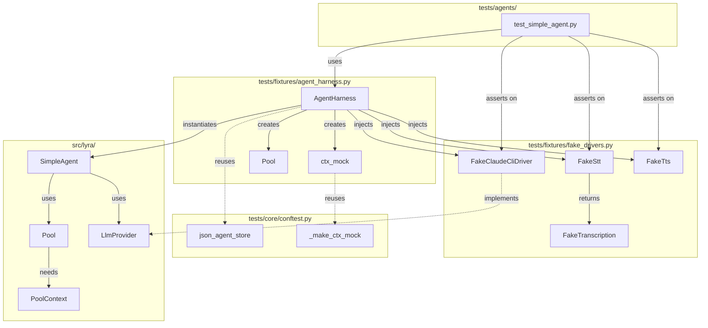
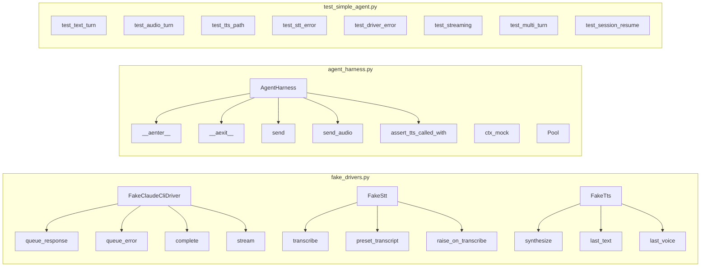

## Summary

Build a reusable test harness for agent integration tests. Creates `FakeClaudeCliDriver`, `FakeTts`, enhances `FakeStt`, and wires them via an ergonomic `agent_harness()` async context manager. First consumer: SimpleAgent integration suite.

## Architecture

### Data Flow



### File × Function Map



## Agents

| Agent | Tasks | Files |
|-------|-------|-------|
| backend-dev | 5 | `tests/fixtures/fake_drivers.py`, `tests/fixtures/agent_harness.py` |
| tester | 8 | `tests/agents/test_simple_agent.py` |

## Consistency Report

| Criterion | Covered | Tasks |
|-----------|---------|-------|
| SC-1: FakeClaudeCliDriver exists | ✓ | T1, T2 |
| SC-2: FakeTts exists | ✓ | T3 |
| SC-3: FakeStt enhanced | ✓ | T4 |
| SC-4: agent_harness exists | ✓ | T5 |
| SC-5: h.send returns Response | ✓ | T6 |
| SC-6: h.send_audio triggers STT | ✓ | T7 |
| SC-7: h.send with voice triggers TTS | ✓ | T8 |
| SC-8: assert_tts_called_with passes | ✓ | T9 |
| SC-9: Error injection works | ✓ | T10, T11 |
| SC-10: test_simple_agent.py ≥8 tests | ✓ | T12–T19 |
| SC-11: pytest passes <5s | ✓ | T20 |
| SC-12: Reuses existing fixtures | ✓ | T5 |
| SC-13: <10 lines ergonomics | ✓ | T6 |

**Uncovered:** None
**Untraced:** None

## Micro-Tasks

### Slice S1: Fake Drivers

#### T1 [RED] Create FakeClaudeCliDriver class
- **Description:** Create `FakeClaudeCliDriver` implementing `LlmProvider` protocol
- **File:** `tests/fixtures/fake_drivers.py`
- **Code:**
  ```python
  @dataclass
  class FakeClaudeCliDriver:
      capabilities: dict = field(default_factory=dict)
      _queue: list[LlmResult] = field(default_factory=list)
      raise_on_complete: Exception | None = None

      def queue_response(self, text: str, session_id: str = "test-sess") -> None: ...
      def queue_error(self, error: str) -> None: ...
      async def complete(self, pool_id, text, model_cfg, system_prompt, messages=None) -> LlmResult: ...
      async def stream(self, pool_id, text, model_cfg, system_prompt, messages=None) -> AsyncIterator[LlmEvent]: ...
      def is_alive(self, pool_id: str) -> bool: ...
  ```
- **Verify:** `uv run pytest tests/fixtures/test_fake_drivers.py -k "FakeClaudeCliDriver" -v`
- **Expected:** Class exists with all methods
- **Time:** 5 min
- **Agent:** backend-dev
- **Spec trace:** SC-1
- **Slice:** S1
- **Phase:** RED
- **Difficulty:** 2

#### T2 [GREEN] Implement FakeClaudeCliDriver methods
- **Description:** Implement all FakeClaudeCliDriver methods with queue-based responses
- **File:** `tests/fixtures/fake_drivers.py`
- **Code:** Implement `complete()`, `stream()`, `queue_response()`, `queue_error()`
- **Verify:** `uv run pytest tests/fixtures/test_fake_drivers.py -v`
- **Expected:** Tests pass: queue_response → complete returns queued LlmResult
- **Time:** 8 min
- **Agent:** backend-dev
- **Spec trace:** SC-1, S1 → N2
- **Slice:** S1
- **Phase:** GREEN
- **Difficulty:** 3
- **Dependencies:** T1

#### T3 [RED] Create FakeTts class
- **Description:** Create `FakeTts` with synthesize, called, last_text, last_voice attributes
- **File:** `tests/fixtures/fake_drivers.py`
- **Code:**
  ```python
  @dataclass
  class FakeTts:
      called: bool = False
      last_text: str = ""
      last_voice: str = ""
      raise_on_synthesize: Exception | None = None

      async def synthesize(self, text: str, voice: str) -> bytes: ...
  ```
- **Verify:** `uv run pytest tests/fixtures/test_fake_drivers.py -k "FakeTts" -v`
- **Expected:** Class exists with synthesize method
- **Time:** 3 min
- **Agent:** backend-dev
- **Spec trace:** SC-2
- **Slice:** S1
- **Phase:** RED
- **Difficulty:** 1
- **Parallel-safe:** Y (vs T1)

#### T4 [GREEN] Implement FakeTts.synthesize
- **Description:** Implement synthesize that records calls and returns mock bytes
- **File:** `tests/fixtures/fake_drivers.py`
- **Verify:** `uv run pytest tests/fixtures/test_fake_drivers.py -k "FakeTts" -v`
- **Expected:** Tests pass: synthesize sets called=True, last_text, last_voice
- **Time:** 3 min
- **Agent:** backend-dev
- **Spec trace:** SC-2, N4
- **Slice:** S1
- **Phase:** GREEN
- **Difficulty:** 1
- **Dependencies:** T3

#### T5 [P] Enhance FakeStt with error injection
- **Description:** Enhance existing `FakeStt` with `raise_on_transcribe` and `preset_transcript` attributes
- **File:** `tests/fixtures/fake_drivers.py`
- **Code:**
  ```python
  # Enhance existing FakeStt from tests/core/conftest.py
  @dataclass
  class FakeStt:
      preset_transcript: str = "Hello world"
      called: bool = False
      last_audio: bytes = b""
      raise_on_transcribe: Exception | None = None

      async def transcribe(self, path) -> FakeTranscription:
          self.called = True
          if self.raise_on_transcribe:
              raise self.raise_on_transcribe
          return FakeTranscription(text=self.preset_transcript)
  ```
- **Verify:** `uv run pytest tests/fixtures/test_fake_drivers.py -k "FakeStt" -v`
- **Expected:** Tests pass: raise_on_transcribe throws, preset_transcript used
- **Time:** 5 min
- **Agent:** backend-dev
- **Spec trace:** SC-3
- **Slice:** S1
- **Phase:** GREEN
- **Difficulty:** 2
- **Parallel-safe:** Y (vs T2)

#### S1-GATE [RED-GATE] Verify all fakes work together
- **Description:** Sentinel test verifying all three fakes can be instantiated and used
- **File:** `tests/fixtures/test_fake_drivers.py`
- **Verify:** `uv run pytest tests/fixtures/test_fake_drivers.py -v`
- **Expected:** All fake driver tests pass
- **Time:** 2 min
- **Agent:** backend-dev
- **Slice:** S1
- **Phase:** RED-GATE
- **Dependencies:** T2, T4, T5

### Slice S2: Harness Core

#### T6 [RED] Create agent_harness context manager skeleton
- **Description:** Create `agent_harness()` async context manager that returns `AgentHarness`
- **File:** `tests/fixtures/agent_harness.py`
- **Code:**
  ```python
  @asynccontextmanager
  async def agent_harness(agent_cls, toml: str) -> AsyncIterator[AgentHarness]: ...
  ```
- **Verify:** `uv run pytest tests/fixtures/test_agent_harness.py -k "context" -v`
- **Expected:** Context manager exists, __aenter__ returns AgentHarness
- **Time:** 3 min
- **Agent:** backend-dev
- **Spec trace:** SC-4
- **Slice:** S2
- **Phase:** RED
- **Difficulty:** 2
- **Dependencies:** S1-GATE

#### T7 [GREEN] Implement AgentHarness initialization
- **Description:** Implement `AgentHarness.__aenter__` with SimpleAgent, Pool, ctx_mock, FakeClaudeCliDriver wiring
- **File:** `tests/fixtures/agent_harness.py`
- **Code:**
  ```python
  class AgentHarness:
      agent: SimpleAgent
      driver: FakeClaudeCliDriver
      stt: FakeStt
      tts: FakeTts
      ctx: MagicMock  # PoolContext mock
      pool: Pool

      async def __aenter__(self) -> Self: ...
  ```
- **Verify:** `uv run pytest tests/fixtures/test_agent_harness.py -v`
- **Expected:** Harness initializes agent, driver, stt, tts, pool
- **Time:** 10 min
- **Agent:** backend-dev
- **Spec trace:** SC-4, SC-12, S2 → N1
- **Slice:** S2
- **Phase:** GREEN
- **Difficulty:** 4
- **Dependencies:** T6
- **Ref:** `tests/core/conftest.py:576-594` (_make_ctx_mock pattern)

#### T8 [GREEN] Implement h.send() method
- **Description:** Implement `send(text)` that builds InboundMessage, submits to pool, returns Response
- **File:** `tests/fixtures/agent_harness.py`
- **Verify:** `uv run pytest tests/fixtures/test_agent_harness.py -k "send" -v`
- **Expected:** send("hello") returns Response with queued content
- **Time:** 5 min
- **Agent:** backend-dev
- **Spec trace:** SC-5, S2 → S1
- **Slice:** S2
- **Phase:** GREEN
- **Difficulty:** 2
- **Dependencies:** T7

### Slice S3: Audio Path

#### T9 [GREEN] Implement h.send_audio() method
- **Description:** Implement `send_audio(bytes, transcript)` that sets `stt.preset_transcript`, builds audio InboundMessage
- **File:** `tests/fixtures/agent_harness.py`
- **Verify:** `uv run pytest tests/fixtures/test_agent_harness.py -k "send_audio" -v`
- **Expected:** send_audio sets preset_transcript, stt.called becomes True
- **Time:** 8 min
- **Agent:** backend-dev
- **Spec trace:** SC-6, S3 → U2, N3a-c
- **Slice:** S3
- **Phase:** GREEN
- **Difficulty:** 3
- **Dependencies:** T8

### Slice S4: TTS Path

#### T10 [GREEN] Implement h.send(voice=) and assert_tts_called_with
- **Description:** Implement `send(text, voice=)` and `assert_tts_called_with(voice)` methods
- **File:** `tests/fixtures/agent_harness.py`
- **Verify:** `uv run pytest tests/fixtures/test_agent_harness.py -k "tts" -v`
- **Expected:** send with voice triggers TTS, assert_tts_called_with passes
- **Time:** 5 min
- **Agent:** backend-dev
- **Spec trace:** SC-7, SC-8, S4 → U3, N4
- **Slice:** S4
- **Phase:** GREEN
- **Difficulty:** 2
- **Dependencies:** T8
- **Parallel-safe:** Y (vs T9)

### Slice S5: Error Injection

#### T11 [GREEN] Verify error injection via raise_on_transcribe
- **Description:** Ensure `stt.raise_on_transcribe = Error` causes `send_audio` to return error Response
- **File:** `tests/fixtures/test_agent_harness.py`
- **Verify:** `uv run pytest tests/fixtures/test_agent_harness.py -k "error" -v`
- **Expected:** Error injection returns graceful error Response
- **Time:** 3 min
- **Agent:** backend-dev
- **Spec trace:** SC-9, S5 → U4, N5, N6
- **Slice:** S5
- **Phase:** GREEN
- **Difficulty:** 2
- **Dependencies:** T9, T10

### Slice S6: SimpleAgent Suite

#### T12 [GREEN] Write test_text_turn
- **Description:** Write test: h.send("hello") with queued response returns matching content
- **File:** `tests/agents/test_simple_agent.py`
- **Code:**
  ```python
  async def test_text_turn(agent_harness):
      async with agent_harness(SimpleAgent, MINIMAL_TOML) as h:
          h.driver.queue_response("Hi!", session_id="s1")
          resp = await h.send("hello")
          assert resp.content == "Hi!"
  ```
- **Verify:** `uv run pytest tests/agents/test_simple_agent.py -k "test_text_turn" -v`
- **Expected:** Test passes
- **Time:** 3 min
- **Agent:** tester
- **Spec trace:** SC-5, SC-13
- **Slice:** S6
- **Phase:** GREEN
- **Difficulty:** 1
- **Dependencies:** S1-GATE

#### T13 [GREEN] Write test_audio_turn
- **Description:** Write test: h.send_audio(bytes, transcript) triggers STT, returns response
- **File:** `tests/agents/test_simple_agent.py`
- **Verify:** `uv run pytest tests/agents/test_simple_agent.py -k "test_audio_turn" -v`
- **Expected:** Test passes, stt.called is True
- **Time:** 3 min
- **Agent:** tester
- **Spec trace:** SC-6
- **Slice:** S6
- **Phase:** GREEN
- **Difficulty:** 1
- **Dependencies:** T9, T12

#### T14 [GREEN] Write test_tts_path
- **Description:** Write test: h.send("speak", voice="Sohee") triggers TTS, assert_tts_called_with passes
- **File:** `tests/agents/test_simple_agent.py`
- **Verify:** `uv run pytest tests/agents/test_simple_agent.py -k "test_tts" -v`
- **Expected:** Test passes, tts.called is True
- **Time:** 3 min
- **Agent:** tester
- **Spec trace:** SC-7, SC-8
- **Slice:** S6
- **Phase:** GREEN
- **Difficulty:** 1
- **Dependencies:** T10, T12

#### T15 [GREEN] Write test_stt_error
- **Description:** Write test: stt.raise_on_transcribe returns error Response
- **File:** `tests/agents/test_simple_agent.py`
- **Verify:** `uv run pytest tests/agents/test_simple_agent.py -k "test_stt_error" -v`
- **Expected:** Test passes, error message is user-friendly
- **Time:** 3 min
- **Agent:** tester
- **Spec trace:** SC-9
- **Slice:** S6
- **Phase:** GREEN
- **Difficulty:** 1
- **Dependencies:** T11, T13

#### T16 [GREEN] Write test_driver_error
- **Description:** Write test: driver.queue_error returns error Response
- **File:** `tests/agents/test_simple_agent.py`
- **Verify:** `uv run pytest tests/agents/test_simple_agent.py -k "test_driver_error" -v`
- **Expected:** Test passes
- **Time:** 3 min
- **Agent:** tester
- **Spec trace:** SC-5
- **Slice:** S6
- **Phase:** GREEN
- **Difficulty:** 1
- **Dependencies:** T12

#### T17 [GREEN] Write test_streaming
- **Description:** Write test: driver.queue_streaming returns AsyncIterator
- **File:** `tests/agents/test_simple_agent.py`
- **Verify:** `uv run pytest tests/agents/test_simple_agent.py -k "test_streaming" -v`
- **Expected:** Test passes, streaming path works
- **Time:** 5 min
- **Agent:** tester
- **Spec trace:** SC-1 (stream method)
- **Slice:** S6
- **Phase:** GREEN
- **Difficulty:** 2
- **Dependencies:** T12

#### T18 [GREEN] Write test_multi_turn
- **Description:** Write test: two sequential sends maintain session
- **File:** `tests/agents/test_simple_agent.py`
- **Verify:** `uv run pytest tests/agents/test_simple_agent.py -k "test_multi_turn" -v`
- **Expected:** Test passes
- **Time:** 5 min
- **Agent:** tester
- **Spec trace:** SC-11 (coverage)
- **Slice:** S6
- **Phase:** GREEN
- **Difficulty:** 2
- **Dependencies:** T12

#### T19 [GREEN] Write test_empty_response
- **Description:** Write test: driver returns empty result
- **File:** `tests/agents/test_simple_agent.py`
- **Verify:** `uv run pytest tests/agents/test_simple_agent.py -k "test_empty" -v`
- **Expected:** Test passes, handles gracefully
- **Time:** 3 min
- **Agent:** tester
- **Spec trace:** SC-11 (coverage)
- **Slice:** S6
- **Phase:** GREEN
- **Difficulty:** 1
- **Dependencies:** T12

#### T20 [REFACTOR] Verify all tests pass in <5s
- **Description:** Run full suite, ensure all pass and complete in <5 seconds
- **File:** `tests/agents/test_simple_agent.py`
- **Verify:** `uv run pytest tests/agents/test_simple_agent.py --durations -v`
- **Expected:** 8+ tests pass, total duration <5s
- **Time:** 2 min
- **Agent:** tester
- **Spec trace:** SC-10, SC-11
- **Slice:** S6
- **Phase:** REFACTOR
- **Difficulty:** 1
- **Dependencies:** T12–T19

## Task IDs

<!-- Generated by /plan. Used by /implement to resume tasks on session restart. -->
- T1: 9 — T1 [RED] Create FakeClaudeCliDriver class
- T3: 10 — T3 [RED] Create FakeTts class
- T5: 11 — T5 [GREEN] Enhance FakeStt with error injection
- T6: 12 — T6 [RED] Create agent_harness context manager
- T12: 13 — T12 [GREEN] Write test_text_turn
