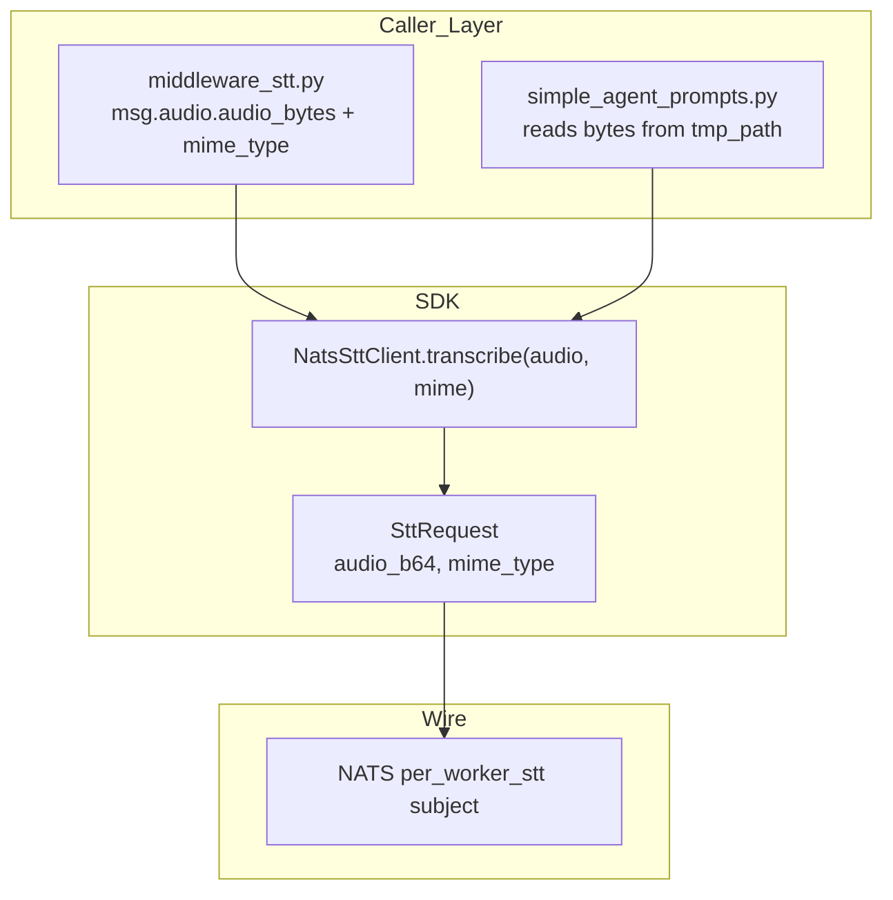
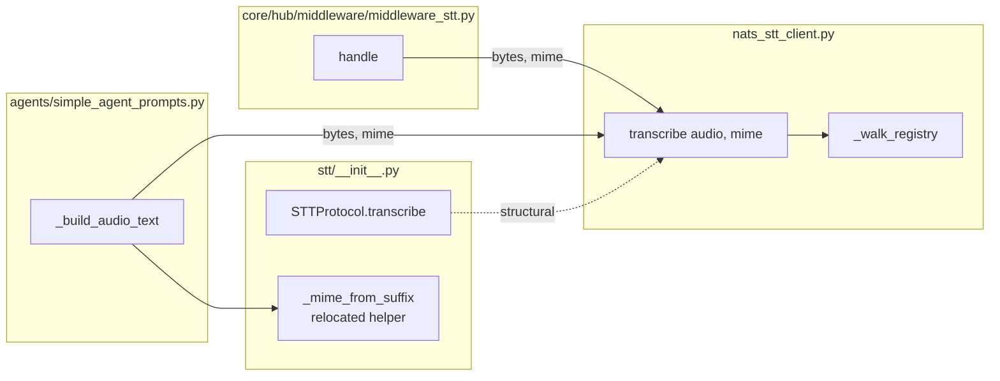

## Summary

Change `NatsSttClient.transcribe(path: Path | str)` → `transcribe(audio: bytes, mime: str)` to eliminate the path-traversal surface and tempfile round-trip. Migrate all callers + test fakes in the same PR.

## Architecture

### Data flow (post-refactor)

### File × function map

## Scope Notes

- Spec mentioned `voice_overlay.py`; grep confirms it does not call `transcribe()`. Out of scope.
- `anthropic_agent.py` has been removed (#666 landed) — no adaptation needed.
- `_mime_from_suffix` helper is **relocated** from `nats_stt_client.py` to `lyra.stt` (public util) rather than deleted outright — agents still receive paths from attachments and need mime derivation. This preserves SC2 intent (no Path surface in client) without duplicating a 7-entry dict across 2 callers. Minor deviation from strict spec wording; approved.

## Agents

| Agent | Task count | Files |
|---|---|---|
| backend-dev | 5 | `src/lyra/nats/nats_stt_client.py`, `src/lyra/stt/__init__.py`, `src/lyra/core/hub/middleware/middleware_stt.py`, `src/lyra/agents/simple_agent_prompts.py` |
| tester | 2 | `tests/nats/test_nats_stt_client.py`, `tests/integration/test_voice_end_to_end.py`, `tests/core/conftest.py`, `tests/core/hub/test_message_pipeline_stt.py` |

F-lite → single worktree, sequential slices.

## Consistency Report

- Covered: SC1, SC3, SC4, SC5, SC6, SC7, SC8 (7/8)
- Deviation: SC2 (`_mime_from_suffix` removed from `nats_stt_client.py` but relocated to `lyra.stt`, not deleted). Documented exemption.
- Untraced tasks: 0

## Micro-Tasks

### Slice S1 — SDK signature change

**T1 [RED] · tester · difficulty 2**
- Files: `tests/nats/test_nats_stt_client.py`
- Replace `wav_file` path fixture with `wav_bytes` bytes fixture (e.g. `b"RIFF....WAVE"` minimal); update all ~20 `client.transcribe(wav_file)` call sites → `client.transcribe(wav_bytes, "audio/wav")`.
- Verify: `uv run pytest tests/nats/test_nats_stt_client.py -x`
- Expected: tests fail (signature mismatch against current impl) — RED
- Spec trace: SC1, SC6

**T2 [GREEN] · backend-dev · difficulty 2**
- Files: `src/lyra/nats/nats_stt_client.py`
- Rewrite `transcribe(self, audio: bytes, mime: str)`. Drop lines 195–197 (`Path(...).resolve()`, `read_bytes`, `_mime_from_suffix`). Use `audio` directly for `base64.b64encode`, use `mime` for `mime_type`.
- Verify: `uv run pyright src/lyra/nats/nats_stt_client.py && uv run pytest tests/nats/test_nats_stt_client.py -x`
- Expected: pyright clean, tests pass
- Spec trace: SC1, SC6
- Dependencies: T1

**T3 [GREEN] · backend-dev · difficulty 1**
- Files: `src/lyra/nats/nats_stt_client.py`
- Remove `from pathlib import Path` (line 17); delete `_mime_from_suffix` function (lines 258–267). Move function body into `src/lyra/stt/__init__.py` as public helper.
- Verify: `rg -n "Path|_mime_from_suffix" src/lyra/nats/nats_stt_client.py`
- Expected: 0 matches
- Spec trace: SC2, SC3, SC8
- Dependencies: T2

**T4 [GREEN] · backend-dev · difficulty 1**
- Files: `src/lyra/stt/__init__.py`
- Update `STTProtocol.transcribe` signature → `async def transcribe(self, audio: bytes, mime: str) -> "TranscriptionResult": ...`. Add relocated `_mime_from_suffix` as public util. Drop `from pathlib import Path` if unused after change (keep if `STTConfig` or others need it — currently only Protocol uses it).
- Verify: `uv run pyright src/lyra/stt/__init__.py`
- Expected: clean
- Spec trace: SC1
- Dependencies: T2

**T5 [RED-GATE] · backend-dev · difficulty 1**
- Verify: `uv run pytest tests/nats -x && uv run pyright src/lyra/nats src/lyra/stt`
- Expected: all green — Slice 1 gate
- Dependencies: T1, T2, T3, T4

### Slice S2 — Caller updates + test fakes

**T6 [GREEN] · backend-dev · difficulty 2**
- Files: `src/lyra/core/hub/middleware/middleware_stt.py`
- Delete `_write_temp` closure (lines 115–124), `_MIME_TO_EXT` dict lookup (line 113), `asyncio.to_thread(_write_temp, ...)` (lines 126–130), `tmp_path = Path(tmp_path_str)` (line 131), `tmp_path.unlink(missing_ok=True)` in finally (line 161). Call `hub._stt.transcribe(msg.audio.audio_bytes, msg.audio.mime_type)` at line 135. Drop `import tempfile`, `import os`, `from pathlib import Path` if unused after.
- Verify: `uv run pyright src/lyra/core/hub/middleware/middleware_stt.py && uv run pytest tests/core/hub/test_message_pipeline_stt.py -x`
- Expected: tests still fail until T9 (test fakes); pyright clean
- Spec trace: SC4, SC5
- Dependencies: T4

**T7 [GREEN] · backend-dev · difficulty 2**
- Files: `src/lyra/agents/simple_agent_prompts.py`
- In `_build_audio_text`: before `stt.transcribe(...)`, read bytes via `audio_bytes = await asyncio.to_thread(tmp_path.read_bytes)` and compute `mime = _mime_from_suffix(tmp_path.suffix)` (import from `lyra.stt`). Call `stt.transcribe(audio_bytes, mime)`. Keep `tmp_path.unlink(missing_ok=True)` cleanup.
- Verify: `uv run pyright src/lyra/agents/simple_agent_prompts.py`
- Expected: clean
- Spec trace: SC5
- Dependencies: T4

**T8 [GREEN] · tester · difficulty 2**
- Files: `tests/integration/test_voice_end_to_end.py` (2 fakes, lines 94, 254), `tests/core/conftest.py` (1 fake, line 759), `tests/core/hub/test_message_pipeline_stt.py` (3 fakes, lines 48/60/70).
- Update all fake `async def transcribe(self, path: Any)` signatures to `(self, audio: Any, mime: Any)`. Update any direct `.transcribe(...)` invocations to pass bytes + mime.
- Verify: `uv run pytest tests/integration tests/core/hub -x`
- Expected: all green
- Spec trace: SC6
- Dependencies: T6, T7

**T9 [RED-GATE] · tester · difficulty 1**
- Verify: `uv run pytest && uv run pyright`
- Expected: all green — Slice 2 + overall gate
- Spec trace: SC6, SC7
- Dependencies: T6, T7, T8

## Task IDs

<!-- Seeded below after approval -->
