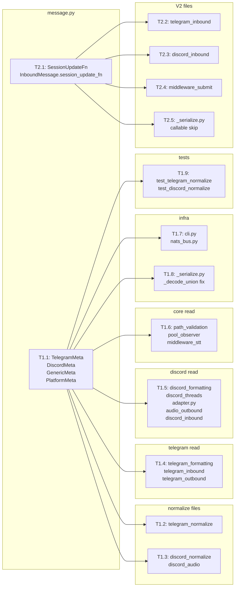

## Summary

Two-slice mechanical refactor: define `TelegramMeta / DiscordMeta / GenericMeta` typed
dataclasses, migrate ~51 call sites from `.get("key")` to typed attribute access, then
move `_session_update_fn` from the opaque dict to a dedicated typed field. Touches
`roxabi-nats` (separate package) in both slices.

## Architecture

```mermaid
flowchart TD
    subgraph message.py ["core/messaging/message.py"]
        TM[TelegramMeta]
        DM[DiscordMeta]
        GM[GenericMeta]
        PM[PlatformMeta = TM|DM|GM]
        SF[SessionUpdateFn type alias]
        IM["InboundMessage\n.platform_meta: PlatformMeta\n.session_update_fn: SessionUpdateFn|None"]
        RC["RoutingContext\n.platform_meta: PlatformMeta"]
    end
    subgraph adapters_construct ["Adapters — construction (V1)"]
        TN[telegram_normalize.py] -->|TelegramMeta| IM
        DN[discord_normalize.py] -->|DiscordMeta| IM
        DA[discord_audio.py] -->|DiscordMeta| IM
        CLI[cli.py] -->|GenericMeta| IM
    end
    subgraph adapters_read ["Adapters — read sites (V1)"]
        TF[telegram_formatting.py]
        TI[telegram_inbound.py]
        TO[telegram_outbound.py]
        DF[discord_formatting.py]
        DT[discord_threads.py]
        AD[adapter.py]
        DAO[discord_audio_outbound.py]
        DI[discord_inbound.py]
    end
    subgraph core_read ["Core — read sites (V1)"]
        PV[path_validation.py]
        PO[pool_observer.py]
        STT[middleware_stt.py]
    end
    subgraph v2_wiring ["V2 — session_update_fn wiring"]
        TI2[telegram_inbound.py] -->|set session_update_fn| IM
        DI2[discord_inbound.py] -->|set session_update_fn| IM
        MS[middleware_submit.py] -->|read .session_update_fn| Pool
    end
    subgraph nats_pkg ["packages/roxabi-nats"]
        SER["_serialize.py\n_decode_union field-overlap fix (V1)\n_encode callable-field skip (V2)"]
        NB[nats_bus.py] -->|remove sanitize_platform_meta call| SER
    end
    IM --> adapters_read
    IM --> core_read
    IM --> nats_pkg
```



## Agents

| Agent | Tasks | Files |
|-------|-------|-------|
| backend-dev | T1.1–T1.8, T2.1–T2.5 | message.py, all adapter + core files, roxabi-nats |
| tester | T1.9 | test_telegram_normalize_fields.py, test_discord_normalize.py |

## Ref Patterns

- Existing frozen dataclass: `OutboundAudio` in `message.py:125` — pattern for new `TelegramMeta/DiscordMeta` (frozen, field defaults)
- Existing `dataclasses.replace` usage: `telegram_inbound.py:97-100` — pattern for injecting session_update_fn in V2
- Existing `_decode_union` in `_serialize.py:190-214` — location of field-overlap fix

## Consistency Report

| SC | Covered by | Task |
|----|-----------|------|
| SC-1 (typed platform_meta on InboundMessage) | T1.1 | message.py |
| SC-2 (frozen dataclasses) | T1.1 | message.py |
| SC-3 (all .get() replaced) | T1.2–T1.7 | all call sites |
| SC-4 (no dict[str,Any] literal) | T1.1–T1.3 | normalize + message |
| SC-5 (_session_update_fn gone) | T2.2–T2.4 | adapters + middleware |
| SC-6 (session_update_fn field) | T2.1 | message.py |
| SC-7 (middleware reads typed field) | T2.4 | middleware_submit |
| SC-8 (_serialize.py callable skip) | T2.5 | roxabi-nats |
| SC-9 (nats_bus sanitize removed) | T1.7 | nats_bus.py |
| SC-10 (middleware_stt no dict()) | T1.6 | middleware_stt |
| SC-11 (pyright clean) | RED-GATE V1 + V2 | — |
| SC-12 (pytest passes) | RED-GATE V1 + V2 | — |
| SC-13 (cli GenericMeta) | T1.7 | cli.py |

Uncovered: none. Untraced: T1.8 (_decode_union fix — required to prevent NATS
deserialization regression when union replaces dict; implicit in SC-11 pyright/SC-12 pytest).

---

## Micro-Tasks

### V1 — Typed PlatformMeta

---

#### T1.1 — Define PlatformMeta types in message.py

- **File:** `src/lyra/core/messaging/message.py`
- **Snippet:**
  ```python
  @dataclass(frozen=True)
  class TelegramMeta:
      chat_id: int = 0
      message_id: int | None = None
      topic_id: int | None = None
      is_group: bool = False
      thread_session_id: str | None = None

  @dataclass(frozen=True)
  class DiscordMeta:
      channel_id: int = 0
      message_id: int = 0
      guild_id: int | None = None
      thread_id: int | None = None
      channel_type: str | None = None
      thread_session_id: str | None = None

  @dataclass(frozen=True)
  class GenericMeta:
      pass

  PlatformMeta = TelegramMeta | DiscordMeta | GenericMeta

  # In RoutingContext:
  platform_meta: PlatformMeta = field(default_factory=GenericMeta)

  # In InboundMessage:
  platform_meta: PlatformMeta = field(default_factory=GenericMeta)
  ```
  Also: export `TelegramMeta`, `DiscordMeta`, `GenericMeta`, `PlatformMeta` from
  `src/lyra/core/messaging/__init__.py`.
- **Verify:** `uv run pyright src/lyra/core/messaging/message.py`
- **Expected:** 0 errors on file
- **Time:** 8 min
- **Agent:** backend-dev
- **Spec trace:** SC-1, SC-2, U1, U2, U3, N1
- **Slice:** V1
- **Phase:** RED
- **Difficulty:** 2

---

#### T1.2 — Migrate telegram_normalize.py → TelegramMeta [P]

- **File:** `src/lyra/adapters/telegram/telegram_normalize.py`
- **Snippet:**
  ```python
  from lyra.core.messaging.message import TelegramMeta, RoutingContext, ...

  platform_meta = TelegramMeta(
      chat_id=chat_id,
      topic_id=topic_id,
      message_id=message_id,
      is_group=is_group,
  )
  # RoutingContext.platform_meta: also TelegramMeta (already constructed above)
  routing = RoutingContext(..., platform_meta=platform_meta)
  return InboundMessage(..., platform_meta=platform_meta)
  ```
- **Verify:** `uv run pyright src/lyra/adapters/telegram/telegram_normalize.py`
- **Expected:** 0 errors
- **Time:** 5 min
- **Agent:** backend-dev
- **Spec trace:** SC-4, U1
- **Slice:** V1
- **Phase:** GREEN
- **Difficulty:** 2
- **[P]** parallel-safe: depends only on T1.1

---

#### T1.3 — Migrate discord_normalize.py + discord_audio.py → DiscordMeta [P]

- **Files:** `src/lyra/adapters/discord/discord_normalize.py`, `src/lyra/adapters/discord/discord_audio.py`
- **Snippet:**
  ```python
  from lyra.core.messaging.message import DiscordMeta, ...

  platform_meta = DiscordMeta(
      guild_id=raw.guild.id if raw.guild else None,
      channel_id=resolved_channel_id,
      message_id=raw.id,
      thread_id=resolved_thread_id,
      channel_type=channel_type,
  )
  routing = RoutingContext(..., platform_meta=platform_meta)
  return InboundMessage(..., platform_meta=platform_meta)
  ```
  Same pattern for `discord_audio.py` (simpler: guild_id, channel_id, message_id only).
  Note: both `InboundMessage.platform_meta` and `RoutingContext.platform_meta` must be updated.
- **Verify:** `uv run pyright src/lyra/adapters/discord/discord_normalize.py src/lyra/adapters/discord/discord_audio.py`
- **Expected:** 0 errors
- **Time:** 5 min
- **Agent:** backend-dev
- **Spec trace:** SC-4, U2
- **Slice:** V1
- **Phase:** GREEN
- **Difficulty:** 2
- **[P]** parallel-safe: depends only on T1.1

---

#### T1.4 — Migrate telegram read sites [P]

- **Files:** `src/lyra/adapters/telegram/telegram_formatting.py`, `src/lyra/adapters/telegram/telegram_inbound.py`, `src/lyra/adapters/telegram/telegram_outbound.py`
- **Snippet:**
  ```python
  # Before: inbound.platform_meta.get("chat_id")
  # After:
  from lyra.core.messaging.message import TelegramMeta
  assert isinstance(inbound.platform_meta, TelegramMeta)  # or type-narrow
  chat_id = inbound.platform_meta.chat_id
  topic_id = inbound.platform_meta.topic_id
  message_id = inbound.platform_meta.message_id
  is_group = inbound.platform_meta.is_group
  ```
  Use `isinstance` guard or cast where needed for pyright satisfaction.
- **Verify:** `uv run pyright src/lyra/adapters/telegram/`
- **Expected:** 0 errors
- **Time:** 5 min
- **Agent:** backend-dev
- **Spec trace:** SC-3, S1, S2
- **Slice:** V1
- **Phase:** GREEN
- **Difficulty:** 2
- **[P]** parallel-safe: depends only on T1.1

---

#### T1.5 — Migrate discord read sites [P]

- **Files:** `src/lyra/adapters/discord/discord_formatting.py`, `src/lyra/adapters/discord/discord_threads.py`, `src/lyra/adapters/discord/adapter.py`, `src/lyra/adapters/discord/discord_audio_outbound.py`, `src/lyra/adapters/discord/discord_inbound.py`
- **Snippet:**
  ```python
  from lyra.core.messaging.message import DiscordMeta
  # discord_formatting.py
  assert isinstance(inbound.platform_meta, DiscordMeta)
  channel_id = inbound.platform_meta.channel_id
  thread_id = inbound.platform_meta.thread_id
  message_id = inbound.platform_meta.message_id
  guild_id = inbound.platform_meta.guild_id
  ```
  Note: `discord_inbound.py:210` reads `thread_id` presence check →
  `_has_thread_id = inbound.platform_meta.thread_id is not None`.
  `discord_inbound.py:234` spreads meta updates →
  `dataclasses.replace(hub_msg.platform_meta, thread_session_id=...)` (Slice 1 covers data fields).
- **Verify:** `uv run pyright src/lyra/adapters/discord/`
- **Expected:** 0 errors
- **Time:** 8 min
- **Agent:** backend-dev
- **Spec trace:** SC-3, S2, S3
- **Slice:** V1
- **Phase:** GREEN
- **Difficulty:** 3
- **[P]** parallel-safe: depends only on T1.1

---

#### T1.6 — Migrate core read sites [P]

- **Files:** `src/lyra/core/hub/middleware/path_validation.py`, `src/lyra/core/pool/pool_observer.py`, `src/lyra/core/hub/middleware/middleware_stt.py`
- **Snippet:**
  ```python
  # path_validation.py:113
  thread_session_id = msg.platform_meta.thread_session_id  # was .get("thread_session_id")

  # pool_observer.py:167
  _msg_id = msg.platform_meta.message_id  # was .get("message_id")

  # middleware_stt.py:46 — remove dict() copy entirely; platform_meta is now typed
  # Before: meta = dict(msg.platform_meta)
  # After:  platform_meta=msg.platform_meta  (pass typed value directly)
  ```
- **Verify:** `uv run pyright src/lyra/core/hub/middleware/path_validation.py src/lyra/core/pool/pool_observer.py src/lyra/core/hub/middleware/middleware_stt.py`
- **Expected:** 0 errors
- **Time:** 5 min
- **Agent:** backend-dev
- **Spec trace:** SC-3, SC-10, S4, S8
- **Slice:** V1
- **Phase:** GREEN
- **Difficulty:** 2
- **[P]** parallel-safe: depends only on T1.1

---

#### T1.7 — cli.py + nats_bus.py cleanup [P]

- **Files:** `src/lyra/adapters/shared/cli.py`, `src/lyra/nats/nats_bus.py`
- **Snippet:**
  ```python
  # cli.py — replace platform_meta={} with GenericMeta()
  from lyra.core.messaging.message import GenericMeta
  InboundMessage(..., platform_meta=GenericMeta())

  # nats_bus.py — remove sanitize_platform_meta call entirely
  # Before:
  #   if hasattr(item, "platform_meta"):
  #       item = dataclasses.replace(_item, platform_meta=sanitize_platform_meta(...))
  # After: delete those lines + remove the import
  ```
- **Verify:** `uv run pyright src/lyra/adapters/shared/cli.py src/lyra/nats/nats_bus.py`
- **Expected:** 0 errors; `grep sanitize_platform_meta src/lyra/nats/nats_bus.py` → no output
- **Time:** 5 min
- **Agent:** backend-dev
- **Spec trace:** SC-9, SC-13, S7, U3
- **Slice:** V1
- **Phase:** GREEN
- **Difficulty:** 2
- **[P]** parallel-safe: depends only on T1.1

---

#### T1.8 — Fix _decode_union in roxabi-nats/_serialize.py [P]

- **File:** `packages/roxabi-nats/src/roxabi_nats/_serialize.py`
- **Snippet:**
  ```python
  # _decode_union — replace "first dataclass candidate" with field-overlap selection
  # Before:
  for candidate in non_none:
      if dataclasses.is_dataclass(candidate) and isinstance(candidate, type) and isinstance(value, dict):
          return _decode_dataclass(value, candidate, resolver)

  # After:
  for candidate in non_none:
      if dataclasses.is_dataclass(candidate) and isinstance(candidate, type) and isinstance(value, dict):
          hints = _get_hints(candidate, resolver)
          # Empty dataclass (GenericMeta) matches empty dicts; non-empty matches by field overlap
          if not hints or (set(hints) & set(value)):
              return _decode_dataclass(value, candidate, resolver)
  ```
  This ensures Discord JSON reconstructs as `DiscordMeta` (not `TelegramMeta`) and
  `{}` reconstructs as `GenericMeta`.
- **Verify:** `cd packages/roxabi-nats && uv run pytest tests/ -q 2>/dev/null || uv run python -c "from roxabi_nats._serialize import deserialize; print('ok')"`
- **Expected:** import succeeds; existing tests pass
- **Time:** 5 min
- **Agent:** backend-dev
- **Spec trace:** SC-11, SC-12 (implicit — prevents NATS round-trip regression)
- **Slice:** V1
- **Phase:** GREEN
- **Difficulty:** 2
- **[P]** parallel-safe: depends only on T1.1

---

#### T1.9 — Update normalize tests [P]

- **Files:** `tests/adapters/test_telegram_normalize_fields.py`, `tests/adapters/test_discord_normalize.py`
- **Snippet:**
  ```python
  # Before:
  assert msg.platform_meta["chat_id"] == 123
  # After:
  from lyra.core.messaging.message import TelegramMeta
  assert isinstance(msg.platform_meta, TelegramMeta)
  assert msg.platform_meta.chat_id == 123
  assert msg.platform_meta.topic_id is None
  assert msg.platform_meta.is_group is False
  assert msg.platform_meta.message_id == 99
  ```
  Same pattern for Discord tests (`DiscordMeta`).
- **Verify:** `uv run pytest tests/adapters/test_telegram_normalize_fields.py tests/adapters/test_discord_normalize.py -v`
- **Expected:** all tests pass
- **Time:** 8 min
- **Agent:** tester
- **Spec trace:** SC-12
- **Slice:** V1
- **Phase:** GREEN
- **Difficulty:** 2
- **[P]** parallel-safe: depends only on T1.1

---

#### RED-GATE V1

```bash
uv run pyright && uv run pytest
```

Expected: 0 pyright errors on touched files, all tests green.
**Block V2 on RED-GATE V1 passing.**

---

### V2 — Typed session_update_fn

---

#### T2.1 — Add SessionUpdateFn + session_update_fn field to InboundMessage

- **File:** `src/lyra/core/messaging/message.py`
- **Snippet:**
  ```python
  from collections.abc import Awaitable, Callable
  from typing import TYPE_CHECKING
  if TYPE_CHECKING:
      pass  # SessionUpdateFn used at runtime too

  # After PlatformMeta definition:
  SessionUpdateFn = Callable[["InboundMessage", str, str], Awaitable[None]]

  # In InboundMessage (after existing fields, before routing):
  session_update_fn: SessionUpdateFn | None = None
  ```
  Export `SessionUpdateFn` from `messaging/__init__.py`.
- **Verify:** `uv run pyright src/lyra/core/messaging/message.py`
- **Expected:** 0 errors
- **Time:** 5 min
- **Agent:** backend-dev
- **Spec trace:** SC-6, N2, N3
- **Slice:** V2
- **Phase:** RED
- **Difficulty:** 2

---

#### T2.2 — Update telegram_inbound.py: set session_update_fn [P]

- **File:** `src/lyra/adapters/telegram/telegram_inbound.py`
- **Snippet:**
  ```python
  # Remove TrustedCallback import for this path
  # Before:
  _meta_updates["_session_update_fn"] = TrustedCallback(_tg_session_update_fn)
  hub_msg = dataclasses.replace(hub_msg, platform_meta={**hub_msg.platform_meta, **_meta_updates})

  # After:
  hub_msg = dataclasses.replace(
      hub_msg,
      session_update_fn=_tg_session_update_fn,
      platform_meta=dataclasses.replace(hub_msg.platform_meta, thread_session_id=_last_sid),
  )
  ```
- **Verify:** `uv run pyright src/lyra/adapters/telegram/telegram_inbound.py`
- **Expected:** 0 errors; no `_session_update_fn` in file
- **Time:** 5 min
- **Agent:** backend-dev
- **Spec trace:** SC-5, SC-6, N3
- **Slice:** V2
- **Phase:** GREEN
- **Difficulty:** 3
- **[P]** parallel-safe: depends only on T2.1

---

#### T2.3 — Update discord_inbound.py: set session_update_fn [P]

- **File:** `src/lyra/adapters/discord/discord_inbound.py`
- **Snippet:**
  ```python
  # Three cases (DM, thread, stored session only):
  # Remove TrustedCallback wrapping for _session_update_fn

  # Before (DM path):
  _meta_updates["_session_update_fn"] = TrustedCallback(_dm_session_update_fn)
  hub_msg = dataclasses.replace(hub_msg, platform_meta={**hub_msg.platform_meta, **_meta_updates})

  # After:
  hub_msg = dataclasses.replace(
      hub_msg,
      session_update_fn=_dm_session_update_fn,  # or _session_update_fn for thread path
      platform_meta=dataclasses.replace(hub_msg.platform_meta, thread_session_id=_stored_session_id),
  )
  # If only thread_session_id but no callback: only update platform_meta field
  ```
  Note: `TrustedCallback` import may still be needed for other uses — check before removing.
- **Verify:** `uv run pyright src/lyra/adapters/discord/discord_inbound.py`
- **Expected:** 0 errors; no `_session_update_fn` key in platform_meta assignments
- **Time:** 8 min
- **Agent:** backend-dev
- **Spec trace:** SC-5, SC-6, N3
- **Slice:** V2
- **Phase:** GREEN
- **Difficulty:** 3
- **[P]** parallel-safe: depends only on T2.1

---

#### T2.4 — Update middleware_submit.py: read session_update_fn [P]

- **File:** `src/lyra/core/hub/middleware/middleware_submit.py`
- **Snippet:**
  ```python
  # Before:
  _update_cb = unwrap_callback(msg.platform_meta, "_session_update_fn")
  if _update_cb is not None and not pool.has_session_update_fn():
      pool.register_session_callbacks(update_fn=_update_cb.fn)

  # After:
  if msg.session_update_fn is not None and not pool.has_session_update_fn():
      pool.register_session_callbacks(update_fn=msg.session_update_fn)
  ```
  Remove `unwrap_callback` import if no longer used in this file.
- **Verify:** `uv run pyright src/lyra/core/hub/middleware/middleware_submit.py`
- **Expected:** 0 errors; no `unwrap_callback` call for `_session_update_fn`
- **Time:** 3 min
- **Agent:** backend-dev
- **Spec trace:** SC-7, S5
- **Slice:** V2
- **Phase:** GREEN
- **Difficulty:** 2
- **[P]** parallel-safe: depends only on T2.1

---

#### T2.5 — Update _encode in roxabi-nats/_serialize.py: skip callable fields [P]

- **File:** `packages/roxabi-nats/src/roxabi_nats/_serialize.py`
- **Snippet:**
  ```python
  # In _encode, dataclass branch — skip callable-valued fields
  for f in dataclasses.fields(obj):
      value = getattr(obj, f.name)
      if callable(value):
          continue  # non-serializable wiring (e.g. session_update_fn)
      encoded_value = _encode(value)
      if isinstance(encoded_value, dict):
          encoded_value = _strip_callables(encoded_value)
      result[f.name] = encoded_value
  ```
  After NATS round-trip, `session_update_fn` deserializes as `None` (field absent in
  JSON → relies on `field(default=None)` in `_decode_dataclass`). This matches current
  behavior (callables already stripped from dict fields).
- **Verify:** `grep -n "callable" packages/roxabi-nats/src/roxabi_nats/_serialize.py`
- **Expected:** callable skip present in `_encode` dataclass branch
- **Time:** 3 min
- **Agent:** backend-dev
- **Spec trace:** SC-8, S6
- **Slice:** V2
- **Phase:** GREEN
- **Difficulty:** 2
- **[P]** parallel-safe: depends only on T2.1

---

#### RED-GATE V2

```bash
uv run pyright && uv run pytest
```

Expected: 0 pyright errors, all tests green, `_session_update_fn` absent from all `platform_meta` accesses.

---

## Task IDs

<!-- Generated by /plan. Used by /implement to resume tasks on session restart. -->

| Task | ID |
|------|----|
| T1.1 | 10 |
| T1.2 | 11 |
| T1.3 | 12 |
| T1.4 | 13 |
| T1.5 | 14 |
| T1.6 | 15 |
| T1.7 | 16 |
| T1.8 | 17 |
| T1.9 | 18 |
| RED-GATE V1 | 19 |
| T2.1 | 20 |
| T2.2 | 21 |
| T2.3 | 22 |
| T2.4 | 23 |
| T2.5 | 24 |
| RED-GATE V2 | 25 |
