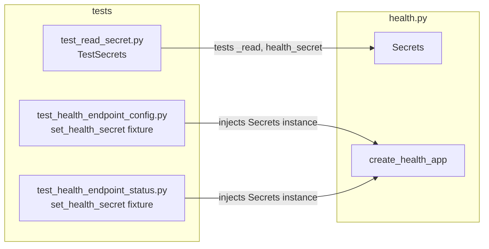

## Summary

Replace `_read_secret(name: str)` in `health.py` with a `Secrets` class whose
`@cached_property` fields enumerate known secrets by name, eliminating the
open string surface. Update `create_health_app` to accept an optional `Secrets`
instance and migrate three test files from `monkeypatch.setattr` to injection.

## Architecture

```mermaid
flowchart TD
    subgraph health.py
        SC[Secrets.__init__\nresolves LYRA_VAULT_DIR]
        SR[Secrets._read\nname → path.read_text]
        SH[Secrets.health_secret\n@cached_property]
        CA[create_health_app\nsecrets: Secrets | None]
        SC --> SR --> SH
        CA -->|_secrets = secrets or Secrets| SH
    end
    ENV[LYRA_VAULT_DIR env var] --> SC
    FS["~/.lyra/secrets/health_secret"] --> SR
```



## Agents

| Agent | Tasks | Files |
|---|---|---|
| backend-dev | T1, T2 | `src/lyra/bootstrap/infra/health.py` |
| tester | T3, T4, T5 | `tests/test_read_secret.py`, `tests/test_health_endpoint_config.py`, `tests/test_health_endpoint_status.py` |

## Ref Patterns

- `src/lyra/bootstrap/infra/health.py` — existing `_read_secret` for fallback semantics to preserve exactly
- `tests/test_read_secret.py` — current test structure to migrate

## Consistency Report

Covered: 7/7 ACs | Uncovered: 0 | Untraced: 0

## Micro-Tasks

### Slice V1 — Secrets class + wire

---

**T1** — Define `Secrets` class in `health.py` [P: N]
- **File:** `src/lyra/bootstrap/infra/health.py`
- **Phase:** GREEN
- **Agent:** backend-dev
- **Spec trace:** AC-1, AC-2, AC-3
- **Difficulty:** 2
- **Description:** Add `Secrets` class after the imports block (before `_probe_nats`).
  Class must have:
  - `__init__(self, vault_dir: Path | None = None)` — resolves `LYRA_VAULT_DIR`
    env var with `~/.lyra` default and `.resolve()`, stores as `self._vault_dir: Path`.
    Optional `vault_dir` param enables test injection without env var setup.
  - `_read(self, name: str) -> str` — private; reads
    `self._vault_dir / "secrets" / name`, calls `.read_text().strip()` on success,
    returns `""` on `FileNotFoundError`, calls `log.warning(...)` and returns `""`
    on other `OSError`. Exact same semantics as `_read_secret`.
  - `health_secret(self) -> str` — `@cached_property`, returns `self._read("health_secret")`.
  Do NOT delete `_read_secret` yet and do NOT modify `create_health_app` yet.
- **Snippet:**
  ```python
  class Secrets:
      def __init__(self, vault_dir: Path | None = None) -> None:
          self._vault_dir = vault_dir or Path(
              os.environ.get("LYRA_VAULT_DIR", str(Path.home() / ".lyra"))
          ).resolve()

      def _read(self, name: str) -> str:
          path = self._vault_dir / "secrets" / name
          try:
              return path.read_text().strip()
          except FileNotFoundError:
              return ""
          except OSError as exc:
              log.warning("Could not read secret %r: %s", name, exc)
              return ""

      @cached_property
      def health_secret(self) -> str:
          return self._read("health_secret")
  ```
  Add `from functools import cached_property` to imports.
- **Verify:** `uv run pyright src/lyra/bootstrap/infra/health.py`
- **Expected:** 0 errors

---

**T2** — Wire `create_health_app` + delete `_read_secret` [P: N, depends T1]
- **File:** `src/lyra/bootstrap/infra/health.py`
- **Phase:** GREEN
- **Agent:** backend-dev
- **Spec trace:** AC-4, AC-5
- **Difficulty:** 2
- **Description:**
  1. Add `secrets: Secrets | None = None` as the last keyword parameter to
     `create_health_app`. Inside the function body, add:
     `_secrets = secrets or Secrets()` before the route definitions.
  2. Replace `health_secret = _read_secret("health_secret")` with
     `health_secret = _secrets.health_secret`.
  3. Delete the `_read_secret` function entirely.
- **Verify:** `grep -r '_read_secret' src/`
- **Expected:** no output (zero matches)

---

**T3** — Rewrite `test_read_secret.py` → `TestSecrets` [P: Y, depends T1]
- **File:** `tests/test_read_secret.py`
- **Phase:** REFACTOR
- **Agent:** tester
- **Spec trace:** AC-2, AC-3, AC-7
- **Difficulty:** 2
- **Description:** Replace all references to `_read_secret` with `Secrets`.
  - Change import: `from lyra.bootstrap.infra.health import Secrets`
  - Rename class to `TestSecrets` (or keep existing name — either is fine)
  - Construct `Secrets(vault_dir=secrets_dir.parent)` (where `secrets_dir` is the
    `secrets/` subdirectory under `tmp_path`) instead of calling `_read_secret(name)` directly.
  - All 5 existing test cases must be preserved and cover: read present secret,
    strip whitespace, missing secret returns `""`, empty file returns `""`,
    unreadable file returns `""` + warning logged.
  - The `_setup_secrets_dir` helper can stay; adjust it to return the parent
    dir (for `vault_dir=`) rather than the secrets subdirectory if needed.
- **Verify:** `uv run pytest tests/test_read_secret.py -v`
- **Expected:** 5 passed, 0 failed

---

**T4** — Migrate `test_health_endpoint_config.py` fixtures [P: Y, depends T2]
- **File:** `tests/test_health_endpoint_config.py`
- **Phase:** REFACTOR
- **Agent:** tester
- **Spec trace:** AC-4, AC-7
- **Difficulty:** 2
- **Description:** Replace both `monkeypatch.setattr(health_mod, "_read_secret", ...)` calls.
  Pattern: the `set_health_secret` fixture (and any inline monkeypatch) should instead
  construct `Secrets(vault_dir=tmp_path)` with the desired secret written to
  `tmp_path / "secrets" / "health_secret"`, then pass `secrets=` to `create_health_app`.
  Alternatively, if fixtures don't already receive `tmp_path`, import `Secrets` and use
  `unittest.mock.Mock(spec=Secrets, health_secret=HEALTH_SECRET)`.
  Remove the `import lyra.bootstrap.infra.health as health_mod` lines if they are
  only used for the monkeypatch.
- **Verify:** `uv run pytest tests/test_health_endpoint_config.py -v`
- **Expected:** all tests pass

---

**T5** — Migrate `test_health_endpoint_status.py` fixtures [P: Y, depends T2]
- **File:** `tests/test_health_endpoint_status.py`
- **Phase:** REFACTOR
- **Agent:** tester
- **Spec trace:** AC-4, AC-7
- **Difficulty:** 2
- **Description:** Replace both `set_health_secret` autouse fixtures that do
  `monkeypatch.setattr(health_mod, "_read_secret", lambda name: HEALTH_SECRET)` (lines 103–106
  and 283–286). Same approach as T4: inject a `Secrets` instance (mock or real tmp_path-backed)
  into `create_health_app(hub, secrets=...)`.
  Note: tests that do NOT go through `set_health_secret` (i.e. those in classes without
  that autouse fixture) do not call `_read_secret` and need no change.
  Remove `import lyra.bootstrap.infra.health as health_mod` if no longer needed.
- **Verify:** `uv run pytest tests/test_health_endpoint_status.py -v`
- **Expected:** all tests pass

---

**RED-GATE V1** — Full quality gate [depends T2, T3, T4, T5]
- **Phase:** RED-GATE
- **Description:** Verify the full gate after all tasks complete.
- **Verify:**
  ```bash
  grep -r '_read_secret' src/ && echo FAIL || echo PASS
  uv run pyright
  uv run pytest
  ```
- **Expected:** grep PASS (0 matches), pyright 0 errors, pytest all green

## Task IDs

<!-- Generated by /plan. Used by /implement to resume tasks on session restart. -->
- T1: 9 — T1: Define Secrets class in health.py
- T2: 10 — T2: Wire create_health_app + delete _read_secret
- T3: 11 — T3: Rewrite test_read_secret.py → TestSecrets
- T4: 12 — T4: Migrate test_health_endpoint_config.py fixtures
- T5: 13 — T5: Migrate test_health_endpoint_status.py fixtures
- RED-GATE: 14 — RED-GATE V1: pyright + pytest full gate
