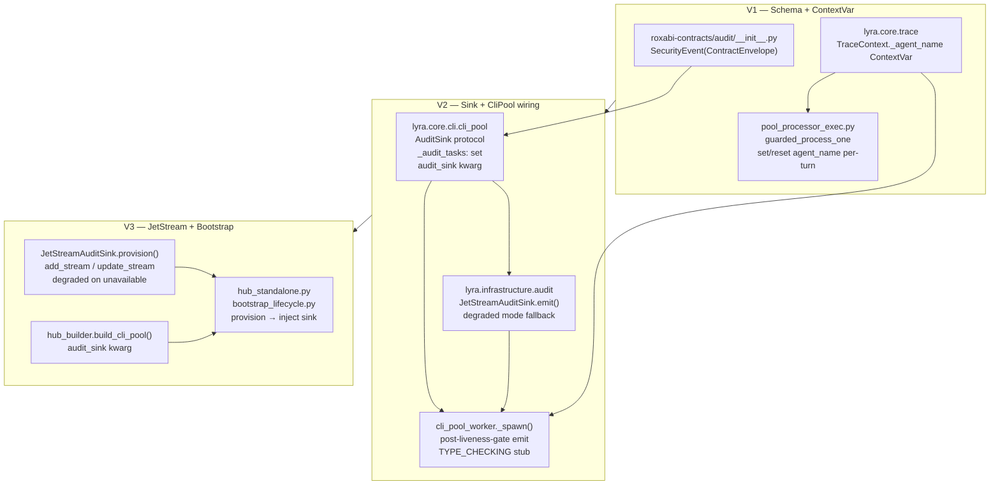
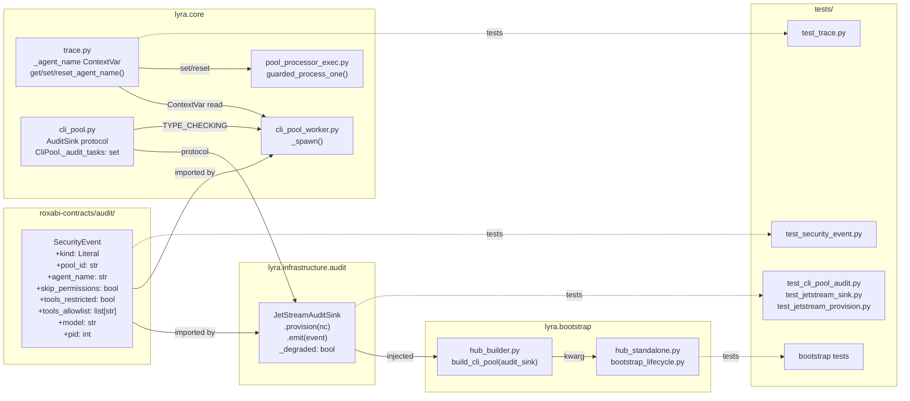

## Summary

Structured security event stream for every CLI subprocess spawn: `SecurityEvent(ContractEnvelope)` schema in `roxabi-contracts`, `JetStreamAuditSink` in `lyra.infrastructure.audit`, emitted fire-and-forget from `_spawn()` after the liveness gate, with `LYRA_AUDIT` JetStream stream provisioned at bootstrap startup. Agent name flows via new `TraceContext._agent_name` ContextVar set per-turn in `guarded_process_one`.

## Architecture





## Bootstrap Context

- Ref pattern — ContractEnvelope subclass: `packages/roxabi-contracts/src/roxabi_contracts/voice/models.py`
- Ref pattern — ContextVar test: `tests/core/test_trace.py` (`copy_context()` pattern)
- Ref pattern — CLI pool test: `tests/core/test_cli_pool_process.py` + `conftest_cli_pool.py`
- Ref pattern — infrastructure module: `src/lyra/infrastructure/stores/__init__.py`

## Agents

| Agent | Task count | Files |
|-------|-----------|-------|
| backend-dev | 10 | roxabi-contracts/audit/, contracts __init__, trace.py, pool_processor_exec.py, cli_pool.py, infrastructure/audit/, cli_pool_worker.py, hub_builder.py, hub_standalone.py, bootstrap_lifecycle.py |
| tester | 5 | test_security_event.py, test_trace.py (extend), test_cli_pool_audit.py, test_jetstream_sink.py, test_jetstream_provision.py, bootstrap tests |

## Consistency Report

- Spec criteria covered: 22/22
- Uncovered criteria: none
- Untraced tasks: none
- Slices: 3 (V1→V2→V3 sequential)

## Micro-Tasks

---

### V1 — Schema + ContextVar

---

#### T1 — Create `SecurityEvent(ContractEnvelope)` schema `[P]`

- **File:** `packages/roxabi-contracts/src/roxabi_contracts/audit/__init__.py` (new)
- **Agent:** backend-dev
- **Spec trace:** SC-S1.1, SC-S1.2, SC-S1.3
- **Phase:** RED
- **Difficulty:** 2
- **Parallel-safe:** Y
- **Dependencies:** —

**Code shape:**
```python
"""Audit-domain security event contracts."""
from __future__ import annotations
from typing import Literal
from roxabi_contracts.envelope import ContractEnvelope

class SecurityEvent(ContractEnvelope):
    """Emitted on every CLI subprocess spawn. trace_id/issued_at/contract_version inherited."""
    kind: Literal["cli.subprocess.spawned"]
    pool_id: str
    agent_name: str
    skip_permissions: bool
    tools_restricted: bool
    tools_allowlist: list[str]
    model: str
    pid: int
```

**Verify:** `uv run pyright packages/roxabi-contracts/src/roxabi_contracts/audit/__init__.py`
**Expected:** 0 errors

---

#### T2 — Re-export `SecurityEvent` in roxabi-contracts package

- **File:** `packages/roxabi-contracts/src/roxabi_contracts/__init__.py` (modify)
- **Agent:** backend-dev
- **Spec trace:** SC-S1.1
- **Phase:** RED
- **Difficulty:** 1
- **Parallel-safe:** N
- **Dependencies:** T1

**Code shape:** Add `from .audit import SecurityEvent` and add `"SecurityEvent"` to `__all__`.

**Verify:** `python -c "from roxabi_contracts import SecurityEvent; print('ok')"`
**Expected:** `ok`

---

#### T3 — Add `_agent_name` ContextVar to `TraceContext` `[P]`

- **File:** `src/lyra/core/trace.py` (modify)
- **Agent:** backend-dev
- **Spec trace:** SC-S1.4, SC-S1.5
- **Phase:** RED
- **Difficulty:** 2
- **Parallel-safe:** Y
- **Dependencies:** —

**Code shape:**
```python
_agent_name: ContextVar[str] = ContextVar("agent_name")

class TraceContext:
    @staticmethod
    def get_agent_name() -> str | None:
        return _agent_name.get(None)

    @staticmethod
    def set_agent_name(value: str) -> Token[str]:
        return _agent_name.set(value)

    @staticmethod
    def reset_agent_name(token: Token[str]) -> None:
        _agent_name.reset(token)
```

Also add `_agent_name` injection in `TraceIdFilter.filter()` (same pattern as `pool_id`).

**Verify:** `uv run pyright src/lyra/core/trace.py`
**Expected:** 0 errors

---

#### T4 — Set/reset `agent_name` in `guarded_process_one`

- **File:** `src/lyra/core/pool/pool_processor_exec.py` (modify)
- **Agent:** backend-dev
- **Spec trace:** SC-S1.6
- **Phase:** RED
- **Difficulty:** 2
- **Parallel-safe:** N
- **Dependencies:** T3

**Code shape:**
```python
from lyra.core.trace import TraceContext

async def guarded_process_one(msg, agent, pool):
    token_an = TraceContext.set_agent_name(pool.agent_name)
    try:
        # existing body unchanged
        ...
    finally:
        TraceContext.reset_agent_name(token_an)
```

**Verify:** `uv run pyright src/lyra/core/pool/pool_processor_exec.py`
**Expected:** 0 errors

---

#### T5 — Tests: `SecurityEvent` schema validation `[P]`

- **File:** `packages/roxabi-contracts/tests/test_security_event.py` (new)
- **Agent:** tester
- **Spec trace:** SC-S1.1, SC-S1.2, SC-S1.3
- **Phase:** GREEN
- **Difficulty:** 2
- **Parallel-safe:** Y
- **Dependencies:** T1

**Verify:** `uv run pytest packages/roxabi-contracts/tests/test_security_event.py -v`
**Expected:** all tests pass

---

#### T6 — Tests: `TraceContext.agent_name` ContextVar `[P]`

- **File:** `tests/core/test_trace.py` (extend — add `TestTraceContextAgentName` class)
- **Agent:** tester
- **Spec trace:** SC-S1.4, SC-S1.5, SC-S1.6
- **Phase:** GREEN
- **Difficulty:** 2
- **Parallel-safe:** Y
- **Dependencies:** T3, T4

**Verify:** `uv run pytest tests/core/test_trace.py -v -k agent_name`
**Expected:** all agent_name tests pass

---

#### 🔴 RED-GATE V1

- **Phase:** RED-GATE
- **Dependencies:** T4, T5, T6

**Verify:** `uv run pytest packages/roxabi-contracts/tests/test_security_event.py tests/core/test_trace.py -v && uv run pyright src/lyra/core/trace.py src/lyra/core/pool/pool_processor_exec.py packages/roxabi-contracts/src/ 2>&1 | grep -c error | grep ^0`
**Expected:** all pass, 0 type errors

---

### V2 — Sink + CliPool wiring

---

#### T7 — `AuditSink` protocol + `_audit_tasks` + `audit_sink` kwarg in `CliPool`

- **File:** `src/lyra/core/cli/cli_pool.py` (modify)
- **Agent:** backend-dev
- **Spec trace:** SC-S2.1, SC-S2.6, SC-S2.7
- **Phase:** RED
- **Difficulty:** 3
- **Parallel-safe:** N
- **Dependencies:** RED-GATE V1

**Code shape:**
```python
from typing import Protocol, runtime_checkable

@runtime_checkable
class AuditSink(Protocol):
    async def emit(self, event: "SecurityEvent") -> None: ...

class CliPool(...):
    def __init__(self, ..., audit_sink: AuditSink | None = None) -> None:
        ...
        self._audit_sink = audit_sink
        self._audit_tasks: set[asyncio.Task[None]] = set()
```

Add `AuditSink` to `__all__`.

**Verify:** `uv run pyright src/lyra/core/cli/cli_pool.py`
**Expected:** 0 errors

---

#### T8 — `JetStreamAuditSink` class + `emit()` (connected + degraded)

- **File:** `src/lyra/infrastructure/audit/__init__.py` (new), `src/lyra/infrastructure/audit/jetstream_sink.py` (new)
- **Agent:** backend-dev
- **Spec trace:** SC-S2.2, SC-S3.4, SC-S3.5
- **Phase:** RED
- **Difficulty:** 4
- **Parallel-safe:** N
- **Dependencies:** T7

**Code shape (`jetstream_sink.py`):**
```python
import asyncio, json, logging
from datetime import datetime, timezone
from roxabi_contracts import SecurityEvent

log = logging.getLogger(__name__)
_audit_log = logging.getLogger("lyra.security")

class JetStreamAuditSink:
    def __init__(self) -> None:
        self._js: Any | None = None
        self._degraded: bool = False

    async def emit(self, event: SecurityEvent) -> None:
        payload = event.model_dump_json()
        try:
            if self._degraded or self._js is None:
                _audit_log.warning(payload)
                return
            await self._js.publish("lyra.audit.security", payload.encode())
        except Exception as exc:
            log.warning("AUDIT: emit failed (%s) — %s", exc, payload)
```

**Verify:** `uv run pyright src/lyra/infrastructure/audit/`
**Expected:** 0 errors

---

#### T9 — Wire emit into `_spawn()` post-liveness-gate + TYPE_CHECKING stub

- **File:** `src/lyra/core/cli/cli_pool_worker.py` (modify)
- **Agent:** backend-dev
- **Spec trace:** SC-S2.2, SC-S2.3, SC-S2.4, SC-S2.5
- **Phase:** RED
- **Difficulty:** 4
- **Parallel-safe:** N
- **Dependencies:** T7, T8

**Code shape (after the liveness check `try/except asyncio.TimeoutError` block):**
```python
from typing import TYPE_CHECKING
if TYPE_CHECKING:
    from lyra.core.cli.cli_pool import AuditSink
    _audit_tasks: set[asyncio.Task[None]]
    _audit_sink: "AuditSink | None"

# in _spawn(), after liveness gate passes:
if self._audit_sink is not None:
    event = SecurityEvent(
        contract_version=CONTRACT_VERSION,
        trace_id=TraceContext.get_trace_id() or "",
        issued_at=datetime.now(timezone.utc),
        kind="cli.subprocess.spawned",
        pool_id=pool_id,
        agent_name=TraceContext.get_agent_name() or "",
        skip_permissions=model_config.skip_permissions,
        tools_restricted=bool(model_config.tools),
        tools_allowlist=list(model_config.tools or []),
        model=model_config.model,
        pid=proc.pid,
    )
    task = asyncio.create_task(self._audit_sink.emit(event))
    self._audit_tasks.add(task)
    task.add_done_callback(self._audit_tasks.discard)
```

**Verify:** `uv run pyright src/lyra/core/cli/cli_pool_worker.py`
**Expected:** 0 errors

---

#### T10 — Tests: emit safety, `_audit_tasks`, pid, trace_id, liveness gate

- **File:** `tests/core/test_cli_pool_audit.py` (new), `tests/infrastructure/test_jetstream_sink.py` (new)
- **Agent:** tester
- **Spec trace:** SC-S2.1–SC-S2.7
- **Phase:** GREEN
- **Difficulty:** 4
- **Parallel-safe:** N
- **Dependencies:** T7, T8, T9

Test anchoring with `asyncio.Event`:
```python
async def test_audit_task_anchored(cli_pool_with_frozen_sink):
    # sink.emit() blocks on event until released
    # assert task in _audit_tasks while blocked
    # release event, await task
    # assert _audit_tasks empty after done-callback
```

**Verify:** `uv run pytest tests/core/test_cli_pool_audit.py tests/infrastructure/test_jetstream_sink.py -v`
**Expected:** all tests pass

---

#### 🔴 RED-GATE V2

- **Phase:** RED-GATE
- **Dependencies:** T9, T10

**Verify:** `uv run pytest tests/core/test_cli_pool_audit.py tests/infrastructure/test_jetstream_sink.py -v && uv run ruff check src/lyra/core/cli/cli_pool_worker.py src/lyra/infrastructure/audit/`
**Expected:** all pass, 0 lint errors

---

### V3 — JetStream provisioning + bootstrap

---

#### T11 — `JetStreamAuditSink.provision()` — add_stream + update_stream + degraded `[P]`

- **File:** `src/lyra/infrastructure/audit/jetstream_sink.py` (modify)
- **Agent:** backend-dev
- **Spec trace:** SC-S3.1–SC-S3.6
- **Phase:** RED
- **Difficulty:** 4
- **Parallel-safe:** Y
- **Dependencies:** RED-GATE V2

**Code shape:**
```python
from nats.aio.client import Client as NATS
from nats.js.api import RetentionPolicy, StorageType, StreamConfig

_STREAM_CONFIG = StreamConfig(
    name="LYRA_AUDIT",
    subjects=["lyra.audit.>"],
    retention=RetentionPolicy.LIMITS,
    storage=StorageType.FILE,
    max_age=90 * 86_400,
    max_bytes=1 * 1024 ** 3,
    duplicate_window=60,
)

async def provision(self, nc: NATS) -> None:
    try:
        js = nc.jetstream()
        self._js = js
        try:
            await js.add_stream(_STREAM_CONFIG)
        except Exception as e:  # BadRequestError = already exists
            try:
                await js.update_stream(_STREAM_CONFIG)
            except Exception as ue:
                log.warning("AUDIT: stream config mismatch — %s", ue)
    except Exception as exc:
        log.warning("AUDIT: JetStream not available (%s) — falling back to lyra.security logger", exc)
        self._degraded = True
```

**Verify:** `uv run pyright src/lyra/infrastructure/audit/jetstream_sink.py`
**Expected:** 0 errors

---

#### T12 — `build_cli_pool` accepts `audit_sink` kwarg `[P]`

- **File:** `src/lyra/bootstrap/factory/hub_builder.py` (modify)
- **Agent:** backend-dev
- **Spec trace:** SC-S3.7 (bootstrap wiring)
- **Phase:** RED
- **Difficulty:** 2
- **Parallel-safe:** Y
- **Dependencies:** RED-GATE V2

**Code shape:**
```python
from lyra.core.cli.cli_pool import AuditSink

async def build_cli_pool(
    raw_config: dict,
    agent_configs: dict[str, Agent],
    audit_sink: AuditSink | None = None,
) -> CliPool | None:
    ...
    cli_pool = CliPool(..., audit_sink=audit_sink)
```

**Verify:** `uv run pyright src/lyra/bootstrap/factory/hub_builder.py`
**Expected:** 0 errors

---

#### T13 — Both bootstrap entry points: provision + inject sink

- **File:** `src/lyra/bootstrap/standalone/hub_standalone.py`, `src/lyra/bootstrap/lifecycle/bootstrap_lifecycle.py` (modify both)
- **Agent:** backend-dev
- **Spec trace:** SC-S3.1, SC-S3.7
- **Phase:** RED
- **Difficulty:** 3
- **Parallel-safe:** N
- **Dependencies:** T11, T12

**Code shape (hub_standalone.py, after `nc = await nats_connect(...)`):**
```python
from lyra.infrastructure.audit.jetstream_sink import JetStreamAuditSink
audit_sink = JetStreamAuditSink()
await audit_sink.provision(nc)
...
cli_pool = await build_cli_pool(raw_config, agent_configs, audit_sink=audit_sink)
```

Same pattern in `bootstrap_lifecycle.py` where `nc` is available.

**Verify:** `uv run pyright src/lyra/bootstrap/standalone/hub_standalone.py src/lyra/bootstrap/lifecycle/bootstrap_lifecycle.py`
**Expected:** 0 errors

---

#### T14 — Tests: `provision()` — create, idempotent, mismatch, degraded `[P]`

- **File:** `tests/infrastructure/test_jetstream_provision.py` (new)
- **Agent:** tester
- **Spec trace:** SC-S3.1–SC-S3.4, SC-S3.6
- **Phase:** GREEN
- **Difficulty:** 3
- **Parallel-safe:** Y
- **Dependencies:** T11

**Verify:** `uv run pytest tests/infrastructure/test_jetstream_provision.py -v`
**Expected:** all tests pass

---

#### T15 — Tests: bootstrap wiring (audit_sink injected) `[P]`

- **File:** extend `tests/test_bootstrap_missing_credentials.py` or add `tests/test_bootstrap_audit_wiring.py`
- **Agent:** tester
- **Spec trace:** SC-S3.7
- **Phase:** GREEN
- **Difficulty:** 2
- **Parallel-safe:** Y
- **Dependencies:** T12, T13

**Verify:** `uv run pytest tests/test_bootstrap_audit_wiring.py -v`
**Expected:** all tests pass

---

#### 🔴 RED-GATE V3

- **Phase:** RED-GATE
- **Dependencies:** T13, T14, T15

**Verify:** `uv run pytest tests/infrastructure/ tests/test_bootstrap_audit_wiring.py -v && uv run ruff check src/lyra/bootstrap/ && uv run pyright src/lyra/bootstrap/`
**Expected:** all pass

---

## Task IDs

<!-- Generated by /plan. Used by /implement to resume tasks on session restart. -->
- T1: 12 — T1: Create SecurityEvent(ContractEnvelope) schema
- T2: 13 — T2: Re-export SecurityEvent in roxabi-contracts package __init__
- T3: 14 — T3: Add _agent_name ContextVar to TraceContext
- T4: 15 — T4: Set/reset agent_name ContextVar in guarded_process_one
- T5: 16 — T5: Tests — SecurityEvent schema validation
- T6: 17 — T6: Tests — TraceContext.agent_name ContextVar
- GATE-V1: 18 — RED-GATE V1 — Schema + ContextVar complete
- T7: 19 — T7: AuditSink protocol + _audit_tasks + audit_sink kwarg in CliPool
- T8: 20 — T8: JetStreamAuditSink class + emit() connected + degraded modes
- T9: 21 — T9: Wire emit() into _spawn() post-liveness-gate + TYPE_CHECKING stub
- T10: 22 — T10: Tests — emit safety, _audit_tasks, pid, trace_id, liveness gate
- GATE-V2: 23 — RED-GATE V2 — Sink + CliPool wiring complete
- T11: 24 — T11: JetStreamAuditSink.provision() — add_stream + update_stream + degraded
- T12: 25 — T12: build_cli_pool() accepts audit_sink kwarg
- T13: 26 — T13: Both bootstrap entry points — provision + inject sink
- T14: 27 — T14: Tests — provision() create, idempotent, mismatch, degraded
- T15: 28 — T15: Tests — bootstrap audit_sink wiring
- GATE-V3: 29 — RED-GATE V3 — JetStream provisioning + bootstrap complete
