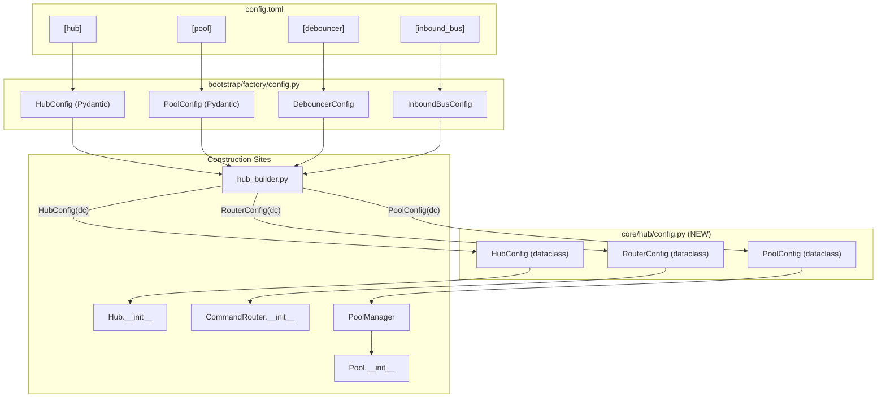
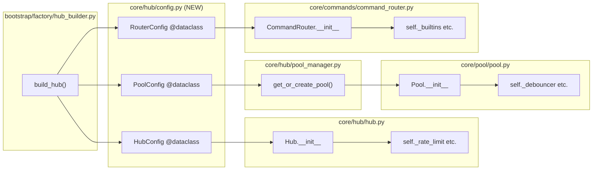

## Summary

Extract frozen dataclasses for Hub, Pool, and CommandRouter config values. Reduces constructor params from 13-21 to 3-9 essential params + config object. No behavior change — only signature restructuring.

## Architecture

### Data Flow



### File × Function Map



## Agents

| Agent | Tasks | Files |
|-------|-------|-------|
| backend-dev | 3 | config.py, hub.py, pool.py, command_router.py, pool_manager.py, hub_builder.py |
| tester | 1 | tests/ |

## Consistency Report

| Metric | Value |
|--------|-------|
| Success criteria covered | 12/12 |
| Uncovered criteria | 0 |
| Untraced tasks | 0 |
| Exemptions | 0 |

## Micro-Tasks

### Slice 1: HubConfig Extraction

#### RED Phase

**T1: Create HubConfig dataclass**
- **Description:** Create `core/hub/config.py` with frozen HubConfig dataclass
- **File:** `src/lyra/core/hub/config.py` (NEW)
- **Code:**
```python
from dataclasses import dataclass, field

@dataclass(frozen=True)
class HubConfig:
    rate_limit: int = 20
    rate_window: int = 60
    pool_ttl: float = 604800.0
    debounce_ms: int = 0
    cancel_on_new_message: bool = False
    turn_timeout: float | None = None
    max_sdk_history: int = 50
    safe_dispatch_timeout: float = 10.0
    staging_maxsize: int = 500
    platform_queue_maxsize: int = 100
    queue_depth_threshold: int = 100
    max_merged_chars: int = 4096
```
- **Verify:** `uv run python -c "from lyra.core.hub.config import HubConfig; print(HubConfig())"`
- **Expected:** `HubConfig(rate_limit=20, rate_window=60, ...)`
- **Time:** 3 min
- **Agent:** backend-dev
- **Spec trace:** SC-1, N1
- **Phase:** RED
- **Difficulty:** 1

**T2: Re-export HubConfig from core/hub/__init__.py**
- **Description:** Add HubConfig to `core/hub/__init__.py` exports
- **File:** `src/lyra/core/hub/__init__.py`
- **Code:**
```python
from .config import HubConfig as HubConfig
```
- **Verify:** `uv run python -c "from lyra.core.hub import HubConfig; print(HubConfig())"`
- **Expected:** `HubConfig(rate_limit=20, ...)`
- **Time:** 2 min
- **Agent:** backend-dev
- **Spec trace:** SC-9, W1
- **Phase:** RED
- **Difficulty:** 1

#### GREEN Phase

**T3: Refactor Hub.__init__ to accept HubConfig**
- **Description:** Replace 12 config params with single HubConfig param
- **File:** `src/lyra/core/hub/hub.py`
- **Code:**
```python
def __init__(
    self,
    circuit_registry: CircuitRegistry | None = None,
    msg_manager: MessageManager | None = None,
    pairing_manager: "PairingManager | None" = None,
    stt: "STTProtocol | None" = None,
    tts: "TtsProtocol | None" = None,
    prefs_store: "PrefsStore | None" = None,
    event_bus: "PipelineEventBus | None" = None,
    inbound_bus: "Bus[InboundMessage] | None" = None,
    config: HubConfig | None = None,
) -> None:
    config = config or HubConfig()
    self._rate_limiter = RateLimiter(config.rate_limit, config.rate_window)
    self._pool_ttl = config.pool_ttl
    self._debounce_ms = config.debounce_ms
    # ... etc
```
- **Verify:** `uv run python -c "from lyra.core.hub import Hub, HubConfig; h = Hub(config=HubConfig()); print(h._rate_limiter)"`
- **Expected:** `<RateLimiter ...>`
- **Time:** 8 min
- **Agent:** backend-dev
- **Spec trace:** U1, SC-4
- **Phase:** GREEN
- **Difficulty:** 3

**T4: Update hub_builder.py to construct HubConfig**
- **Description:** Build HubConfig from Pydantic config values and pass to Hub
- **File:** `src/lyra/bootstrap/factory/hub_builder.py`
- **Code:**
```python
from lyra.core.hub.config import HubConfig

def build_hub(...) -> Hub:
    # ... load Pydantic configs ...
    hub_config = HubConfig(
        rate_limit=hub_cfg.rate_limit,
        rate_window=hub_cfg.rate_window,
        pool_ttl=hub_cfg.pool_ttl,
        debounce_ms=debouncer_cfg.default_debounce_ms,
        cancel_on_new_message=debouncer_cfg.cancel_on_new_message,
        turn_timeout=cli_pool_cfg.turn_timeout,
        max_sdk_history=pool_cfg.max_sdk_history,
        safe_dispatch_timeout=pool_cfg.safe_dispatch_timeout,
        staging_maxsize=inbound_bus_cfg.staging_maxsize,
        platform_queue_maxsize=inbound_bus_cfg.platform_queue_maxsize,
        queue_depth_threshold=inbound_bus_cfg.queue_depth_threshold,
        max_merged_chars=debouncer_cfg.max_merged_chars,
    )
    hub = Hub(
        circuit_registry=circuit_registry,
        msg_manager=msg_manager,
        pairing_manager=pairing_manager,
        stt=stt_service,
        tts=tts_service,
        prefs_store=prefs_store,
        event_bus=event_bus,
        inbound_bus=inbound_bus,
        config=hub_config,
    )
```
- **Verify:** `uv run ruff check src/lyra/bootstrap/factory/hub_builder.py`
- **Expected:** No errors
- **Time:** 5 min
- **Agent:** backend-dev
- **Spec trace:** S1, SC-7
- **Phase:** GREEN
- **Difficulty:** 2

#### RED-GATE

**T5: HubConfig integration test**
- **Description:** Verify Hub works with HubConfig
- **File:** `tests/unit/test_hub_config.py` (NEW) or inline verify
- **Verify:** `uv run pytest tests/ -k hub -x --tb=short`
- **Expected:** All tests pass
- **Time:** 5 min
- **Agent:** backend-dev
- **Spec trace:** V1, SC-11
- **Phase:** RED-GATE
- **Difficulty:** 2

---

### Slice 2: PoolConfig Extraction

#### RED Phase

**T6: Create PoolConfig dataclass**
- **Description:** Add PoolConfig to `core/hub/config.py`
- **File:** `src/lyra/core/hub/config.py`
- **Code:**
```python
@dataclass(frozen=True)
class PoolConfig:
    turn_timeout: float | None = None
    debounce_ms: int = 300
    turn_timeout_ceiling: float | None = None
    max_sdk_history: int = 50
    safe_dispatch_timeout: float = 10.0
    max_merged_chars: int = 4096
    cancel_on_new_message: bool = False
```
- **Verify:** `uv run python -c "from lyra.core.hub.config import PoolConfig; print(PoolConfig())"`
- **Expected:** `PoolConfig(turn_timeout=None, debounce_ms=300, ...)`
- **Time:** 2 min
- **Agent:** backend-dev
- **Spec trace:** SC-2, N1
- **Phase:** RED
- **Difficulty:** 1

**T7: Re-export PoolConfig**
- **Description:** Add PoolConfig to `core/hub/__init__.py`
- **File:** `src/lyra/core/hub/__init__.py`
- **Verify:** `uv run python -c "from lyra.core.hub import PoolConfig"`
- **Expected:** No error
- **Time:** 1 min
- **Agent:** backend-dev
- **Spec trace:** SC-9
- **Phase:** RED
- **Difficulty:** 1

#### GREEN Phase

**T8: Refactor Pool.__init__ to accept PoolConfig**
- **Description:** Replace 7 config params with PoolConfig
- **File:** `src/lyra/core/pool/pool.py`
- **Code:**
```python
def __init__(
    self,
    pool_id: str,
    agent_name: str,
    ctx: PoolContext,
    config: PoolConfig | None = None,
) -> None:
    config = config or PoolConfig()
    self._turn_timeout = config.turn_timeout
    self._debouncer = MessageDebouncer(config.debounce_ms, config.max_merged_chars)
    # ... etc
```
- **Verify:** `uv run python -c "from lyra.core.pool import Pool; from lyra.core.hub import PoolConfig; print('OK')"`
- **Expected:** OK
- **Time:** 6 min
- **Agent:** backend-dev
- **Spec trace:** U2, SC-5
- **Phase:** GREEN
- **Difficulty:** 2

**T9: Update PoolManager to pass PoolConfig**
- **Description:** PoolManager.get_or_create_pool() receives PoolConfig from Hub and passes to Pool
- **File:** `src/lyra/core/hub/pool_manager.py`
- **Verify:** `uv run ruff check src/lyra/core/hub/pool_manager.py`
- **Expected:** No errors
- **Time:** 5 min
- **Agent:** backend-dev
- **Spec trace:** S2, SC-8
- **Phase:** GREEN
- **Difficulty:** 2

#### RED-GATE

**T10: PoolConfig integration test**
- **Description:** Verify Pool works with PoolConfig
- **Verify:** `uv run pytest tests/ -k pool -x --tb=short`
- **Expected:** All tests pass
- **Time:** 3 min
- **Agent:** backend-dev
- **Spec trace:** V2
- **Phase:** RED-GATE
- **Difficulty:** 1

---

### Slice 3: RouterConfig Extraction

#### RED Phase

**T11: Create RouterConfig dataclass**
- **Description:** Add RouterConfig with field(default_factory=...) for mutable defaults
- **File:** `src/lyra/core/hub/config.py`
- **Code:**
```python
from lyra.core.commands.command_patterns import load_pattern_configs

@dataclass(frozen=True)
class RouterConfig:
    builtins: dict = field(default_factory=dict)
    workspaces: dict = field(default_factory=dict)
    patterns: dict = field(default_factory=dict)
    pattern_configs: dict = field(default_factory=load_pattern_configs)
```
- **Verify:** `uv run python -c "from lyra.core.hub.config import RouterConfig; r = RouterConfig(); print(type(r.pattern_configs))"`
- **Expected:** `<class 'dict'>`
- **Time:** 3 min
- **Agent:** backend-dev
- **Spec trace:** SC-3, N1
- **Phase:** RED
- **Difficulty:** 2

**T12: Re-export RouterConfig**
- **Description:** Add RouterConfig to `core/hub/__init__.py`
- **File:** `src/lyra/core/hub/__init__.py`
- **Verify:** `uv run python -c "from lyra.core.hub import RouterConfig"`
- **Expected:** No error
- **Time:** 1 min
- **Agent:** backend-dev
- **Spec trace:** SC-9
- **Phase:** RED
- **Difficulty:** 1

#### GREEN Phase

**T13: Refactor CommandRouter.__init__ to accept RouterConfig**
- **Description:** Replace 4 config params with RouterConfig
- **File:** `src/lyra/core/commands/command_router.py`
- **Code:**
```python
def __init__(
    self,
    command_loader: CommandLoader,
    enabled_plugins: list[str],
    circuit_registry: "CircuitRegistry | None" = None,
    msg_manager: "MessageManager | None" = None,
    runtime_config_holder: "RuntimeConfigHolder | None" = None,
    runtime_config_path: Path | None = None,
    smart_routing_decorator: "SmartRoutingProtocol | None" = None,
    config: RouterConfig | None = None,
) -> None:
    config = config or RouterConfig()
    self._builtins = config.builtins or dict(DEFAULT_BUILTINS)
    self._workspaces = config.workspaces
    # ... etc
```
- **Verify:** `uv run python -c "from lyra.core.commands import CommandRouter; print('OK')"`
- **Expected:** OK
- **Time:** 6 min
- **Agent:** backend-dev
- **Spec trace:** U3, SC-6
- **Phase:** GREEN
- **Difficulty:** 2

**T14: Update hub_builder.py to construct RouterConfig**
- **Description:** Build RouterConfig and pass to CommandRouter (if constructed in hub_builder)
- **File:** `src/lyra/bootstrap/factory/hub_builder.py`
- **Verify:** `uv run ruff check src/lyra/bootstrap/factory/hub_builder.py`
- **Expected:** No errors
- **Time:** 3 min
- **Agent:** backend-dev
- **Spec trace:** S1
- **Phase:** GREEN
- **Difficulty:** 1

#### RED-GATE

**T15: RouterConfig integration test**
- **Description:** Verify CommandRouter works with RouterConfig
- **Verify:** `uv run pytest tests/ -k command_router -x --tb=short`
- **Expected:** All tests pass
- **Time:** 3 min
- **Agent:** backend-dev
- **Spec trace:** V3
- **Phase:** RED-GATE
- **Difficulty:** 1

---

### Slice 4: Test Updates

#### GREEN Phase

**T16: Update all tests for new constructors**
- **Description:** Fix any tests that construct Hub/Pool/CommandRouter directly
- **File:** `tests/`
- **Verify:** `uv run pytest --tb=short -q`
- **Expected:** All tests pass
- **Time:** 15 min
- **Agent:** tester
- **Spec trace:** V4, SC-10
- **Phase:** GREEN
- **Difficulty:** 3

---

## Task Summary

| # | Task | Slice | Phase | Agent | Time | Difficulty |
|---|------|-------|-------|-------|------|------------|
| T1 | Create HubConfig dataclass | 1 | RED | backend-dev | 3m | 1 |
| T2 | Re-export HubConfig | 1 | RED | backend-dev | 2m | 1 |
| T3 | Refactor Hub.__init__ | 1 | GREEN | backend-dev | 8m | 3 |
| T4 | Update hub_builder.py | 1 | GREEN | backend-dev | 5m | 2 |
| T5 | HubConfig integration test | 1 | RED-GATE | backend-dev | 5m | 2 |
| T6 | Create PoolConfig dataclass | 2 | RED | backend-dev | 2m | 1 |
| T7 | Re-export PoolConfig | 2 | RED | backend-dev | 1m | 1 |
| T8 | Refactor Pool.__init__ | 2 | GREEN | backend-dev | 6m | 2 |
| T9 | Update PoolManager | 2 | GREEN | backend-dev | 5m | 2 |
| T10 | PoolConfig integration test | 2 | RED-GATE | backend-dev | 3m | 1 |
| T11 | Create RouterConfig dataclass | 3 | RED | backend-dev | 3m | 2 |
| T12 | Re-export RouterConfig | 3 | RED | backend-dev | 1m | 1 |
| T13 | Refactor CommandRouter.__init__ | 3 | GREEN | backend-dev | 6m | 2 |
| T14 | Update hub_builder.py | 3 | GREEN | backend-dev | 3m | 1 |
| T15 | RouterConfig integration test | 3 | RED-GATE | backend-dev | 3m | 1 |
| T16 | Update all tests | 4 | GREEN | tester | 15m | 3 |

**Total time:** ~70 min

## Dependencies

```
T1 → T2 → T3 → T4 → T5
                ↓
T6 → T7 → T8 → T9 → T10
                ↓
T11 → T12 → T13 → T14 → T15
                    ↓
                    T16
```

Note: Slices 1-3 can partially overlap (T6/T11 can start after T1), but T4/T9/T14 all modify hub_builder.py → recommend sequential slices.
