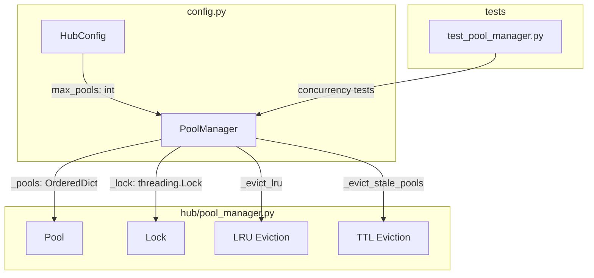
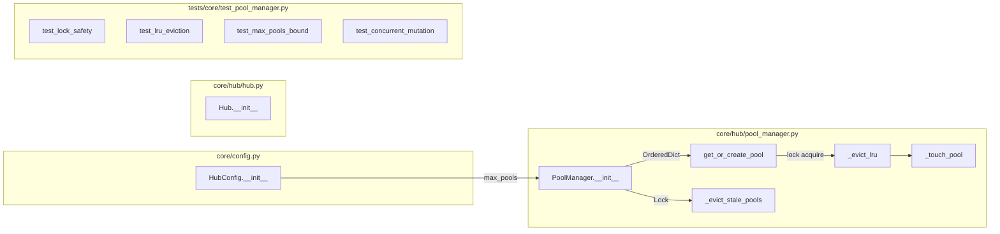

## Summary

Add `max_pools` limit to `HubConfig`, protect `PoolManager` with `threading.Lock`, implement LRU eviction via `OrderedDict`. Single PR bundling race fix + memory bound.

## Architecture

### Data Flow



### File × Function Map



## Agents

| Agent | Tasks | Files |
|-------|-------|-------|
| backend-dev | 4 | `config.py`, `pool_manager.py`, `hub.py` |
| tester | 3 | `test_pool_manager.py` |

## Consistency Report

| Criteria | Covered | Notes |
|----------|---------|-------|
| SC-1: HubConfig.max_pools | ✓ T1 | config.py |
| SC-2: OrderedDict | ✓ T2 | pool_manager.py |
| SC-3: threading.Lock | ✓ T2 | pool_manager.py |
| SC-4: _evict_lru | ✓ T3 | pool_manager.py |
| SC-5: No RuntimeError | ✓ T5 | test |
| SC-6: Pool count bounded | ✓ T6 | test |
| SC-7: TTL unchanged | ✓ T7 | regression test |
| SC-8: ValueError max_pools<=0 | ✓ T4 | hub.py |
| SC-9: pyright | ✓ | CI |
| SC-10: ruff | ✓ | CI |

**Coverage:** 10/10 criteria → 10 tasks

## Micro-Tasks

### Slice 1: HubConfig.max_pools field

#### T1: Add max_pools to HubConfig [P]
- **Description:** Add `max_pools: int = 500` field to `HubConfig` dataclass
- **File:** `src/lyra/core/config.py`
- **Code:**
  ```python
  @dataclass(frozen=True)
  class HubConfig:
      # ... existing fields ...
      max_pools: int = 500  # hard cap on pool count
  ```
- **Verify:** `uv run pyright src/lyra/core/config.py`
- **Expected:** 0 errors
- **Time:** 2 min
- **Agent:** backend-dev
- **Spec trace:** SC-1
- **Slice:** V1
- **Phase:** GREEN
- **Difficulty:** 1
- **Parallel-safe:** Y

---

### Slice 2: threading.Lock + iteration safety

#### T2: Add threading.Lock and convert to OrderedDict
- **Description:** Add `_lock: threading.Lock` to PoolManager, convert `self.pools` to `OrderedDict`, guard all mutations
- **File:** `src/lyra/core/hub/pool_manager.py`
- **Code:**
  ```python
  from collections import OrderedDict
  import threading

  class PoolManager:
      def __init__(self, hub: Hub, pool_config: PoolConfig) -> None:
          self._hub = hub
          self._pool_config = pool_config
          self._pools: OrderedDict[str, Pool] = OrderedDict()
          self._lock = threading.Lock()
          self._last_eviction_check: float = 0.0

      def get_or_create_pool(self, pool_id: str, agent_name: str) -> Pool:
          with self._lock:
              self._evict_stale_pools()
              if pool_id in self._pools:
                  pool = self._pools[pool_id]
                  pool._touch()
                  self._pools.move_to_end(pool_id)  # LRU update
                  return pool
              # create logic...

      def _evict_stale_pools(self) -> None:
          """Called inside lock context."""
          # iteration now safe under lock
          ...
  ```
- **Verify:** `uv run pyright src/lyra/core/hub/pool_manager.py`
- **Expected:** 0 errors
- **Time:** 15 min
- **Agent:** backend-dev
- **Spec trace:** SC-2, SC-3
- **Slice:** V2
- **Phase:** GREEN
- **Difficulty:** 3
- **Parallel-safe:** N (core change)

#### T3: Implement _evict_lru method
- **Description:** Add `_evict_lru()` method to pop leftmost pool when at capacity
- **File:** `src/lyra/core/hub/pool_manager.py`
- **Code:**
  ```python
  def _evict_lru(self) -> None:
      """Evict least-recently-used pool. Called inside lock."""
      if not self._pools:
          return
      pool_id, pool = self._pools.popitem(last=False)  # FIFO = LRU
      # same flush logic as TTL eviction
      if pool.user_id:
          agent = self._hub.agent_registry.get(pool.agent_name)
          if agent and hasattr(agent, "flush_session"):
              task = asyncio.create_task(agent.flush_session(pool, "lru"))
              self._hub._memory_tasks.add(task)
              task.add_done_callback(lambda t: self._hub._memory_tasks.discard(t))
  ```
- **Verify:** `uv run pyright src/lyra/core/hub/pool_manager.py`
- **Expected:** 0 errors
- **Time:** 10 min
- **Agent:** backend-dev
- **Spec trace:** SC-4
- **Slice:** V2
- **Phase:** GREEN
- **Difficulty:** 2
- **Parallel-safe:** N (depends on T2)

---

### Slice 3: OrderedDict + LRU eviction

#### T4: Add max_pools validation in Hub init
- **Description:** Validate `max_pools > 0` in Hub constructor, raise ValueError if invalid
- **File:** `src/lyra/core/hub/hub.py`
- **Code:**
  ```python
  def __init__(self, config: HubConfig, ...) -> None:
      if config.max_pools <= 0:
          raise ValueError(f"max_pools must be > 0, got {config.max_pools}")
      ...
  ```
- **Verify:** `uv run pyright src/lyra/core/hub/hub.py`
- **Expected:** 0 errors
- **Time:** 3 min
- **Agent:** backend-dev
- **Spec trace:** SC-8
- **Slice:** V3
- **Phase:** GREEN
- **Difficulty:** 1
- **Parallel-safe:** N

#### T5: Write test_lock_safety
- **Description:** Test that concurrent pop + iterate doesn't raise RuntimeError
- **File:** `tests/core/test_pool_manager.py`
- **Code:**
  ```python
  def test_lock_safety_concurrent_mutation():
      """Concurrent pop + iterate must not raise RuntimeError."""
      # Setup PoolManager with mock hub
      # Spawn 100 threads: 50 iterating, 50 popping
      # Assert no RuntimeError, final count consistent
  ```
- **Verify:** `uv run pytest tests/core/test_pool_manager.py::test_lock_safety_concurrent_mutation -v`
- **Expected:** passed
- **Time:** 10 min
- **Agent:** tester
- **Spec trace:** SC-5
- **Slice:** V3
- **Phase:** GREEN
- **Difficulty:** 3
- **Parallel-safe:** Y

#### T6: Write test_lru_eviction
- **Description:** Test that fill-to-cap + create triggers LRU eviction of oldest
- **File:** `tests/core/test_pool_manager.py`
- **Code:**
  ```python
  def test_lru_eviction_at_capacity():
      """When at max_pools, next create evicts LRU."""
      # Set max_pools=3
      # Create pools A, B, C (in order)
      # Touch B (makes it most recent)
      # Create pool D → should evict A (oldest)
      # Assert A not in pools, D present
  ```
- **Verify:** `uv run pytest tests/core/test_pool_manager.py::test_lru_eviction_at_capacity -v`
- **Expected:** passed
- **Time:** 8 min
- **Agent:** tester
- **Spec trace:** SC-4, SC-6
- **Slice:** V3
- **Phase:** GREEN
- **Difficulty:** 2
- **Parallel-safe:** Y

---

### Slice 4: Integration + regression

#### T7: Write test_max_pools_bound
- **Description:** Test that pool count never exceeds max_pools under high load simulation
- **File:** `tests/core/test_pool_manager.py`
- **Code:**
  ```python
  def test_max_pools_never_exceeded():
      """Pool count stays bounded under concurrent creates."""
      # max_pools=10
      # Spawn 100 threads creating pools
      # Assert len(pools) <= 10 at all times
  ```
- **Verify:** `uv run pytest tests/core/test_pool_manager.py::test_max_pools_never_exceeded -v`
- **Expected:** passed
- **Time:** 10 min
- **Agent:** tester
- **Spec trace:** SC-6
- **Slice:** V4
- **Phase:** GREEN
- **Difficulty:** 3
- **Parallel-safe:** Y

#### T8: Run existing TTL eviction tests (regression)
- **Description:** Verify existing tests pass after changes
- **File:** `tests/core/test_pool_manager.py` (existing)
- **Verify:** `uv run pytest tests/core/test_pool_manager.py -v`
- **Expected:** all passed
- **Time:** 5 min
- **Agent:** tester
- **Spec trace:** SC-7
- **Slice:** V4
- **Phase:** GREEN
- **Difficulty:** 1
- **Parallel-safe:** N (depends on T2-T7)

---

### RED-GATE Sentinels

#### RED-GATE-1: Slice 1 complete
- **Description:** HubConfig.max_pools field exists and typechecks
- **Verify:** `uv run pyright src/lyra/core/config.py && grep -q "max_pools" src/lyra/core/config.py`
- **Expected:** 0 errors, field found
- **Dependencies:** T1

#### RED-GATE-2: Slice 2 complete
- **Description:** PoolManager has lock + OrderedDict, no race under concurrency
- **Verify:** `uv run pytest tests/core/test_pool_manager.py::test_lock_safety_concurrent_mutation -v`
- **Expected:** passed
- **Dependencies:** T2, T3, T5

#### RED-GATE-3: Slice 3 complete
- **Description:** LRU eviction works, max_pools validated
- **Verify:** `uv run pytest tests/core/test_pool_manager.py::test_lru_eviction_at_capacity -v`
- **Expected:** passed
- **Dependencies:** T4, T6

#### RED-GATE-4: All tests pass
- **Description:** Full test suite passes including existing tests
- **Verify:** `uv run pytest tests/core/test_pool_manager.py -v && uv run pyright && uv run ruff check .`
- **Expected:** all passed, 0 errors
- **Dependencies:** T7, T8

## Task IDs

<!-- Generated by /plan. Used by /implement to resume tasks on session restart. -->
- T1: 8 — Add max_pools to HubConfig
- T2: 9 — Add threading.Lock and convert to OrderedDict
- T3: 10 — Implement _evict_lru method
- T4: 11 — Add max_pools validation in Hub init
- T5: 12 — Write test_lock_safety_concurrent_mutation
- T6: 13 — Write test_lru_eviction_at_capacity
- T7: 14 — Write test_max_pools_never_exceeded
- T8: 15 — Run existing TTL eviction tests (regression)
