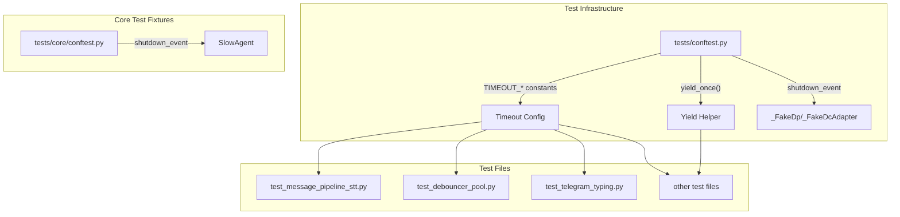

## Summary

Replace `asyncio.sleep(N)` calls in test files with event-based coordination (Event + wait_for) to eliminate CI flakiness on slow runners.

## Architecture



## Agents

| Agent | Tasks | Files |
|-------|-------|-------|
| tester | 11 | tests/conftest.py, tests/core/conftest.py, test_*.py |

## Consistency Report

- Covered: 5/5 success criteria
- Uncovered: none
- Untraced: none
- Exemptions: 0

## Micro-Tasks

### Slice V1: Event-ready fixtures

#### Task 1: Add TIMEOUT constants [P] → tester
- **File:** `tests/conftest.py`
- **Snippet:**
  ```python
  # Timeout constants for event-based coordination
  TIMEOUT_FAST = 0.5   # In-memory operations
  TIMEOUT_IO = 2.0     # Single network round-trip
  TIMEOUT_SLOW = 5.0   # Multi-step coordination, CI variance buffer
  ```
- **Verify:** `grep -q "TIMEOUT_FAST" tests/conftest.py && grep -q "TIMEOUT_IO" tests/conftest.py && grep -q "TIMEOUT_SLOW" tests/conftest.py`
- **Expected:** Exit code 0
- **Time:** 2 min | **Difficulty:** 1
- **Traces:** SC-3 | **Phase:** RED

#### Task 2: Replace _FakeDp sleep with shutdown event → tester
- **File:** `tests/conftest.py`
- **Snippet:**
  ```python
  class _FakeDp:
      def __init__(self, shutdown_event: asyncio.Event):
          self._shutdown = shutdown_event

      async def start_polling(self, bot, **kwargs):
          await self._shutdown.wait()  # explicit: wait for teardown signal
  ```
- **Verify:** `grep -q "_shutdown.wait()" tests/conftest.py && ! grep -q "asyncio.sleep(1_000)" tests/conftest.py`
- **Expected:** Exit code 0
- **Time:** 5 min | **Difficulty:** 3
- **Traces:** SC-1, P1 | **Phase:** GREEN

#### Task 3: Replace _FakeDcAdapter sleep with shutdown event → tester
- **File:** `tests/conftest.py`
- **Snippet:**
  ```python
  class _FakeDcAdapter:
      def __init__(self, shutdown_event: asyncio.Event):
          self._shutdown = shutdown_event

      async def start(self):
          await self._shutdown.wait()  # explicit: wait for teardown signal
  ```
- **Verify:** `grep -c "_shutdown.wait()" tests/conftest.py | grep -q "2"`
- **Expected:** Two occurrences (Dp + DcAdapter)
- **Time:** 5 min | **Difficulty:** 3
- **Traces:** SC-1, P1 | **Phase:** GREEN

#### RED-GATE: RED complete V1 → tester
- **Verify:** `grep -rn "asyncio.sleep([0-9]" tests/conftest.py && echo "FAIL" || echo "PASS"`
- **Expected:** PASS (no sleep(N>0) in conftest.py)
- **Time:** 1 min | **Difficulty:** 1
- **Traces:** SC-1 | **Phase:** RED-GATE

### Slice V2: Yield semantics

#### Task 4: Add yield_once() helper [P] → tester
- **File:** `tests/conftest.py`
- **Snippet:**
  ```python
  async def yield_once() -> None:
      """Yield control to the event loop once. Replaces asyncio.sleep(0)."""
      await asyncio.sleep(0)
  ```
- **Verify:** `grep -q "async def yield_once" tests/conftest.py`
- **Expected:** Exit code 0
- **Time:** 2 min | **Difficulty:** 1
- **Traces:** SC-2, P4 | **Phase:** RED

#### Task 5: Replace sleep(0) with yield_once() → tester
- **File:** Multiple test files
- **Verify:** `grep -rn "asyncio.sleep(0)" tests/ --include="*.py" | wc -l`
- **Expected:** Significant reduction (target: < 10 remaining or all converted)
- **Time:** 15 min | **Difficulty:** 2
- **Traces:** SC-2 | **Phase:** GREEN

#### RED-GATE: RED complete V2 → tester
- **Verify:** `grep -rn "yield_once()" tests/ --include="*.py" | wc -l`
- **Expected:** ≥ 20 calls to yield_once()
- **Time:** 1 min | **Difficulty:** 1
- **Traces:** SC-2 | **Phase:** RED-GATE

### Slice V3: Task coordination

#### Task 6: Fix SlowAgent sleep(10) → tester
- **File:** `tests/core/conftest.py`
- **Snippet:**
  ```python
  class SlowAgent:
      def __init__(self, shutdown_event: asyncio.Event):
          self._shutdown = shutdown_event

      async def run(self):
          await self._shutdown.wait()  # explicit wait
  ```
- **Verify:** `! grep -q "asyncio.sleep(10)" tests/core/conftest.py`
- **Expected:** Exit code 0
- **Time:** 5 min | **Difficulty:** 3
- **Traces:** SC-1, P2 | **Phase:** GREEN

#### Task 7: Fix message_pipeline_stt sleep(9999) → tester
- **File:** `tests/core/hub/test_message_pipeline_stt.py`
- **Snippet:**
  ```python
  # Replace sleep(9999) with explicit wait_for on event
  await asyncio.wait_for(never_fires.wait(), timeout=TIMEOUT_SLOW)
  ```
- **Verify:** `! grep -q "asyncio.sleep(9999)" tests/core/hub/test_message_pipeline_stt.py`
- **Expected:** Exit code 0
- **Time:** 5 min | **Difficulty:** 3
- **Traces:** SC-1 | **Phase:** GREEN

#### Task 8: Fix debouncer_pool sleep(10) → tester
- **File:** `tests/core/test_debouncer_pool.py`
- **Snippet:**
  ```python
  # Use wait_for with event or counter
  await asyncio.wait_for(condition_satisfied.wait(), timeout=TIMEOUT_IO)
  ```
- **Verify:** `! grep -q "asyncio.sleep(10)" tests/core/test_debouncer_pool.py`
- **Expected:** Exit code 0
- **Time:** 5 min | **Difficulty:** 3
- **Traces:** SC-1 | **Phase:** GREEN

#### Task 9: Fix conftest_cli_pool sleep(3600) → tester
- **File:** `tests/core/conftest_cli_pool.py`
- **Snippet:**
  ```python
  # Replace block-forever pattern with shutdown event
  await shutdown_event.wait()
  ```
- **Verify:** `! grep -q "asyncio.sleep(3600)" tests/core/conftest_cli_pool.py`
- **Expected:** Exit code 0
- **Time:** 5 min | **Difficulty:** 3
- **Traces:** SC-1 | **Phase:** GREEN

#### Task 10: Fix remaining sleep(N>0) in test files → tester
- **File:** Multiple test files (integration, adapters, etc.)
- **Verify:** `grep -rn "asyncio.sleep([1-9]" tests/ --include="*.py" && echo "FAIL" || echo "PASS"`
- **Expected:** PASS
- **Time:** 20 min | **Difficulty:** 3
- **Traces:** SC-1 | **Phase:** GREEN

#### RED-GATE: RED complete V3 → tester
- **Verify:** `grep -rn "asyncio.sleep([1-9]" tests/ --include="*.py" && echo "FAIL" || echo "PASS"`
- **Expected:** PASS (zero sleep(N≥1))
- **Time:** 1 min | **Difficulty:** 1
- **Traces:** SC-1 | **Phase:** RED-GATE

### Final Validation

#### Task 11: Run full test suite → tester
- **File:** All test files
- **Verify:** `uv run pytest tests/ --timeout=60 -q`
- **Expected:** All tests pass
- **Time:** 10 min | **Difficulty:** 2
- **Traces:** SC-4, SC-5 | **Phase:** REFACTOR
