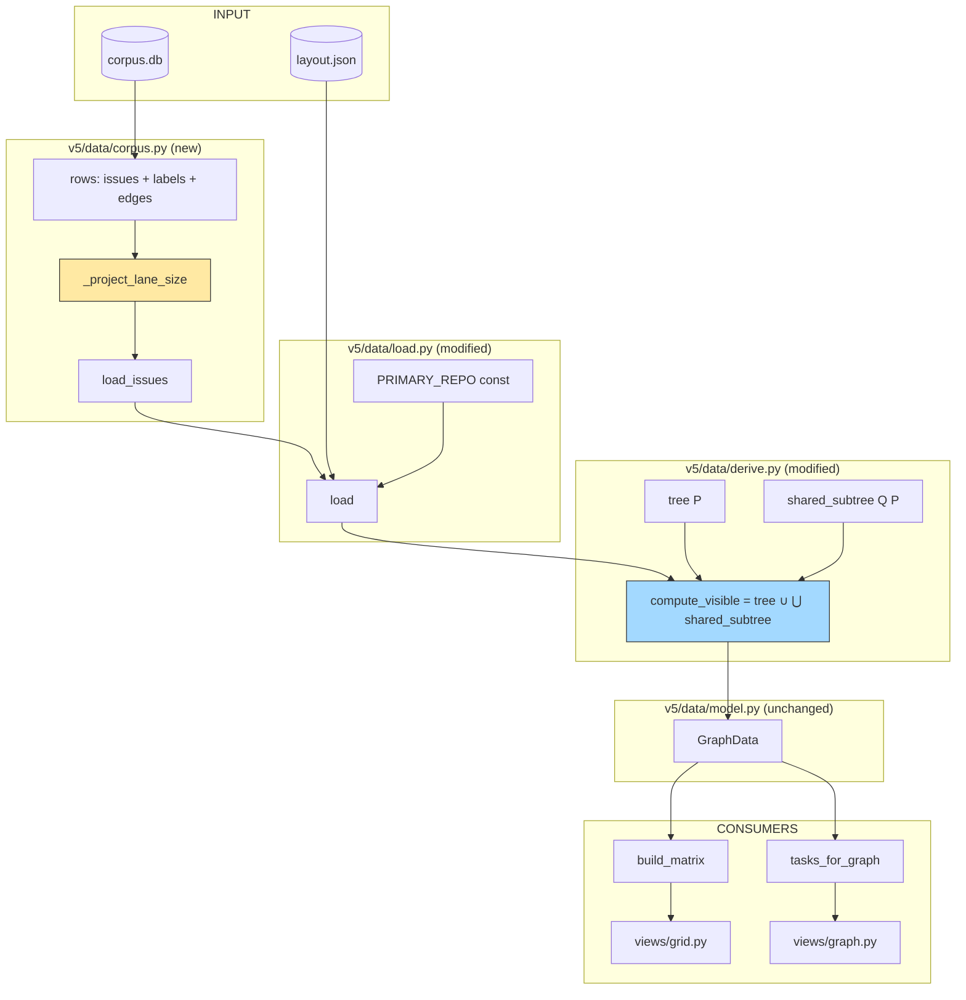
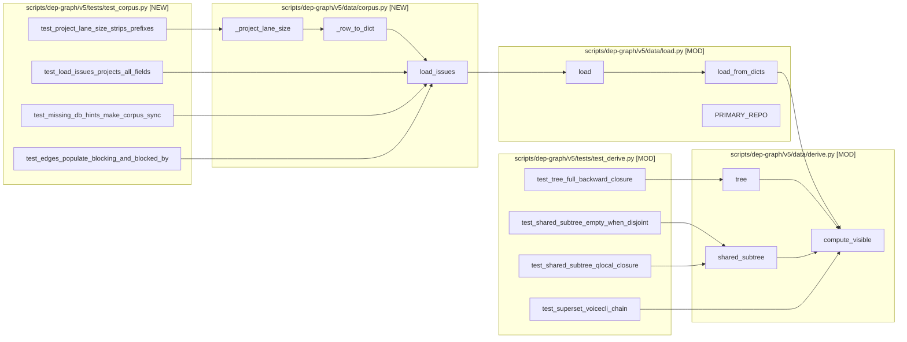

## Summary

Swap v5's data source from `~/.roxabi/forge/lyra/visuals/lyra-v2-dependency-graph.gh.json` to `~/.roxabi/corpus.db` and rewrite `compute_visible(P)` to `tree(P) ∪ ⋃_Q shared_subtree(Q, P)`. Ships in 3 TDD slices: adapter → reader swap (algebra unchanged) → new algebra. Lane/size projection is isolated in one function so the label→projectV2-field flip in #872 is a one-line swap.

## Architecture

### Data flow



Highlighted: `_project_lane_size` (swap point for #872) and `compute_visible` (rewritten algebra).

### File × Function map



## Bootstrap Context

- **Corpus schema** (Phase 1, landed): `scripts/corpus/schema.py` — `issues(key, repo, number, title, state, url, created_at, updated_at, closed_at, milestone, is_stub)`, `labels(issue_key, name)`, `edges(src_key, dst_key)` where `src blocks dst`, indexes `ix_edges_dst`, `ix_issues_repo_state`, `ix_labels_name`.
- **Current reader**: `scripts/dep-graph/v5/data/load.py:26-28` hard-codes `FORGE = Path.home() / ".roxabi/forge/lyra/visuals"` and `CACHE_PATH = FORGE / "lyra-v2-dependency-graph.gh.json"`. Remove both.
- **Projected-dict shape**: documented in spec §Data Model. Source of truth for adapter output is `scripts/dep-graph/dep_graph/fetch.py:46-60` (label derivation) and a sample gh.json row (e.g. `Roxabi/lyra#544`).
- **Current `compute_visible`**: `scripts/dep-graph/v5/data/derive.py:58-85`. Old rule: open-in-P + forward cascade + 1-hop backward. Rewrite preserves the signature `(issues, primary_repo) -> set[str]`.
- **Test conftest**: `scripts/dep-graph/v5/tests/conftest.py` provides `LAYOUT` + `GH` synthetic dicts and `load_from_dicts` fixture; reuse for tests that don't need sqlite.
- **Reference test styles**: `scripts/corpus/tests/test_schema.py` (sqlite tmp_path fixture), `scripts/dep-graph/v5/tests/test_derive.py` (synthetic issue-dict fixtures for derive logic).

## Agents

| Agent | Task count | Files |
|---|---|---|
| backend-dev | 8 | `scripts/dep-graph/v5/data/corpus.py`, `load.py`, `derive.py` |
| tester | 3 (red-phase + gates) | `scripts/dep-graph/v5/tests/test_corpus.py`, `test_derive.py`, `test_load.py` |

F-lite single session: blend backend-dev + tester in one worktree. No intra-domain parallel fan-out.

## Consistency Report

| Coverage | Status |
|---|---|
| Spec acceptance criteria → tasks | 15 / 15 |
| Micro-tasks → spec trace | 11 / 11 (no orphan tasks) |
| Breadboard affordances covered | N1, N1a, N2, N3, N4, N5, N6 (all) |
| Slices covered | V1, V2, V3 (all) |
| Exemptions | none |

## Micro-Tasks

### Slice V1 — Adapter

#### T1 [RED] — Write adapter projection tests

- **File:** `scripts/dep-graph/v5/tests/test_corpus.py`
- **Expected shape:**
  ```python
  def test_project_lane_size_strips_prefixes() -> None: ...
  def test_project_lane_size_returns_none_when_absent() -> None: ...
  def test_load_issues_projects_all_fields(tmp_path: Path) -> None: ...
  def test_edges_populate_blocking_and_blocked_by(tmp_path: Path) -> None: ...
  def test_missing_db_hints_make_corpus_sync(tmp_path: Path) -> None: ...
  ```
  Each sqlite test seeds corpus via `scripts.corpus.schema.bootstrap` + direct INSERTs, then asserts the projected dict shape matches spec §Data Model.
- **Verify:** `uv run pytest scripts/dep-graph/v5/tests/test_corpus.py -x`
- **Expected output:** 5 failed (ModuleNotFoundError: scripts.dep_graph.v5.data.corpus)
- **Time:** 8 min · **Difficulty:** 3 · **Spec trace:** SC-1, SC-2, SC-3, SC-4 · **Agent:** tester · **Phase:** RED

#### T2 [GREEN] — Implement corpus adapter

- **File:** `scripts/dep-graph/v5/data/corpus.py` (new)
- **Expected shape:**
  ```python
  DEFAULT_DB = Path.home() / ".roxabi" / "corpus.db"

  def load_issues(db_path: Path | None = None) -> dict[str, dict[str, Any]]:
      """Load all issues + labels + edges from corpus.db.

      Raises FileNotFoundError with a hint pointing to `make corpus-sync`
      when db_path does not exist. No filter by repo — returns every row.
      """

  def _project_lane_size(labels: list[str]) -> tuple[str | None, str | None]:
      """Projects `graph:lane/X` / `size:X` labels.

      Single swap point for roxabi-plugins#119 taxonomy migration
      (follow-up #872 flips this to read corpus.db lane/size columns
      once the hub project is populated). Do NOT inline.
      """

  def _row_to_dict(row, labels_by_key, blocking_by_key, blocked_by_key) -> dict: ...
  ```
- **Verify:** `uv run pytest scripts/dep-graph/v5/tests/test_corpus.py -x`
- **Expected output:** 5 passed
- **Time:** 10 min · **Difficulty:** 3 · **Spec trace:** N1, N1a, N6, SC-1..SC-7 · **Agent:** backend-dev · **Phase:** GREEN · **[P]:** N

#### T3 [RED-GATE] — V1 gate

- **Verify:** `uv run pytest scripts/dep-graph/v5/tests/test_corpus.py && uv run ruff check scripts/dep-graph/v5/data/corpus.py && uv run pyright scripts/dep-graph/v5/data/corpus.py`
- **Expected output:** all green
- **Time:** 2 min · **Difficulty:** 1 · **Spec trace:** V1 · **Agent:** tester · **Phase:** RED-GATE

### Slice V2 — Reader swap (algebra unchanged)

#### T4 [RED] — Update load.py test expectations for corpus source

- **File:** `scripts/dep-graph/v5/tests/test_load.py`
- **Expected shape:** add/modify tests asserting (a) `load()` reads from corpus.db, (b) the `FORGE/CACHE_PATH` constants no longer referenced, (c) missing `~/.roxabi/corpus.db` raises `FileNotFoundError` with `make corpus-sync` hint. Existing `load_from_dicts` tests stay — they feed dicts directly and bypass both sources.
- **Verify:** `uv run pytest scripts/dep-graph/v5/tests/test_load.py -x`
- **Expected output:** fails — pre-swap `load()` still reads gh.json
- **Time:** 5 min · **Difficulty:** 2 · **Spec trace:** SC-5, SC-8 · **Agent:** tester · **Phase:** RED · **Depends on:** T3

#### T5 [GREEN] — Swap load.py source + introduce PRIMARY_REPO

- **File:** `scripts/dep-graph/v5/data/load.py`
- **Expected shape:**
  ```python
  from .corpus import load_issues

  PRIMARY_REPO = "Roxabi/lyra"

  def load(layout_path: Path | None = None, db_path: Path | None = None) -> GraphData:
      layout_path = layout_path or LAYOUT_PATH
      layout_raw = layout_path.read_text()  # unchanged
      issues = load_issues(db_path)  # replaces json.loads(cache_raw)
      return load_from_dicts(json.loads(layout_raw), {"issues": issues})
  ```
  Delete `FORGE`, `CACHE_PATH`, and the `cache_raw` read.
- **Verify:** `uv run pytest scripts/dep-graph/v5/tests/test_load.py && uv run pytest scripts/dep-graph/v5/tests/`
- **Expected output:** all tests green (algebra unchanged — old `compute_visible` still in place)
- **Time:** 8 min · **Difficulty:** 3 · **Spec trace:** N2, SC-5, SC-6 · **Agent:** backend-dev · **Phase:** GREEN · **[P]:** N · **Depends on:** T4

#### T6 [REFACTOR] — Prune dead gh.json plumbing

- **File:** `scripts/dep-graph/v5/data/load.py`
- **Expected shape:** confirm no remaining references to `FORGE`, `CACHE_PATH`, `lyra-v2-dependency-graph.gh.json` in v5 sources. Adjust docstring on `load` to mention corpus.db.
- **Verify:** `rg 'gh\.json|CACHE_PATH|lyra-v2-dependency-graph' scripts/dep-graph/v5/ --type py`
- **Expected output:** no matches (test fixtures in tests/ may still reference gh.json shape via `GH` dict — that's OK, they use `load_from_dicts`)
- **Time:** 3 min · **Difficulty:** 1 · **Spec trace:** SC-5 · **Agent:** backend-dev · **Phase:** REFACTOR · **[P]:** N · **Depends on:** T5

#### T7 [RED-GATE] — V2 gate

- **Verify:** `uv run pytest scripts/dep-graph/v5/tests/ && make graph 2>&1 | tail -5`
- **Expected output:** all tests green; `make graph` produces output referencing corpus.db, not gh.json
- **Time:** 3 min · **Difficulty:** 1 · **Spec trace:** V2 · **Agent:** tester · **Phase:** RED-GATE

### Slice V3 — New visibility algebra

#### T8 [RED] — Add tree / shared_subtree / superset tests

- **File:** `scripts/dep-graph/v5/tests/test_derive.py`
- **Expected shape:**
  ```python
  def test_tree_full_backward_closure() -> None:
      """Given open A → blocked_by B → blocked_by C (all in P),
      new tree(P) returns {A, B, C}; old rule returned {A, B} only."""

  def test_shared_subtree_empty_when_disjoint() -> None:
      """Q with no node in tree(P) contributes empty set."""

  def test_shared_subtree_qlocal_closure() -> None:
      """Q with one shared node x returns Q-local closure of {x}."""

  def test_superset_contains_voicecli_chain() -> None:
      """On a fixture of lyra open + voiceCLI chain via blocking edge,
      new compute_visible ⊇ old, and voiceCLI#83 is in the diff."""
  ```
  Reuse `issues` dict fixtures; no sqlite needed.
- **Verify:** `uv run pytest scripts/dep-graph/v5/tests/test_derive.py -x`
- **Expected output:** 4 fail (new semantics not yet implemented)
- **Time:** 10 min · **Difficulty:** 3 · **Spec trace:** SC-9, SC-10, SC-11, SC-12 · **Agent:** tester · **Phase:** RED · **Depends on:** T7

#### T9 [GREEN] — Rewrite compute_visible

- **File:** `scripts/dep-graph/v5/data/derive.py`
- **Expected shape:**
  ```python
  def _tree(issues, seed_keys) -> set[str]:
      """Closure of seed over (blocking ∪ blocked_by), any-state any-repo."""

  def _shared_subtree(issues, tree_set, q_repo) -> set[str]:
      """For repo q_repo: closure within q_repo of (q_repo ∩ tree_set)."""

  def compute_visible(issues, primary_repo) -> set[str]:
      seed = {k for k, i in issues.items()
              if i.get("repo") == primary_repo and i.get("state") == "open"}
      tree = _tree(issues, seed)
      other_repos = {i["repo"] for i in issues.values() if i.get("repo") != primary_repo}
      result = set(tree)
      for q in other_repos:
          result |= _shared_subtree(issues, tree, q)
      return result
  ```
- **Verify:** `uv run pytest scripts/dep-graph/v5/tests/test_derive.py && uv run pytest scripts/dep-graph/v5/tests/`
- **Expected output:** all tests green, including the superset test
- **Time:** 12 min · **Difficulty:** 4 · **Spec trace:** N3, N4, N5, SC-9..SC-12 · **Agent:** backend-dev · **Phase:** GREEN · **[P]:** N · **Depends on:** T8

#### T10 [REFACTOR] — Tidy derive.py + update docstrings

- **File:** `scripts/dep-graph/v5/data/derive.py`, `scripts/dep-graph/v5/data/model.py`
- **Expected shape:** update the `GraphData.visible` docstring (`model.py:114-117`) to describe the new rule. Remove any dead code. Ensure helper fns are module-private (`_`-prefixed).
- **Verify:** `uv run ruff check scripts/dep-graph/v5/data/ && uv run pyright scripts/dep-graph/v5/data/`
- **Expected output:** clean
- **Time:** 4 min · **Difficulty:** 1 · **Spec trace:** — · **Agent:** backend-dev · **Phase:** REFACTOR · **[P]:** N · **Depends on:** T9

#### T11 [RED-GATE] — Final gate: full suite + `make graph` renders voiceCLI chain

- **Verify:** `uv run pytest scripts/dep-graph/v5/tests/ && uv run ruff check scripts/dep-graph/v5/ && uv run pyright scripts/dep-graph/v5/ && make graph 2>&1 | tail -10`
- **Expected output:** all green; graph output file contains `voiceCLI` references
- **Time:** 3 min · **Difficulty:** 1 · **Spec trace:** V3, SC-13, SC-14, SC-15 · **Agent:** tester · **Phase:** RED-GATE · **Depends on:** T10

## Task IDs

<!-- Generated by /plan. Used by /implement to resume tasks on session restart. -->
- T1: 12 — [RED] Write adapter projection tests
- T2: 13 — [GREEN] Implement corpus adapter (load_issues + _project_lane_size)
- T3: 14 — [RED-GATE] V1 gate — adapter tests + lint + typecheck
- T4: 15 — [RED] Update load.py tests for corpus source
- T5: 16 — [GREEN] Swap load.py source + introduce PRIMARY_REPO
- T6: 17 — [REFACTOR] Prune dead gh.json plumbing
- T7: 18 — [RED-GATE] V2 gate — full suite + make graph on corpus.db
- T8: 19 — [RED] Add tree / shared_subtree / superset tests
- T9: 20 — [GREEN] Rewrite compute_visible = tree ∪ shared_subtree
- T10: 21 — [REFACTOR] Tidy derive.py + update GraphData.visible docstring
- T11: 22 — [RED-GATE] Final gate — suite + make graph renders voiceCLI chain
