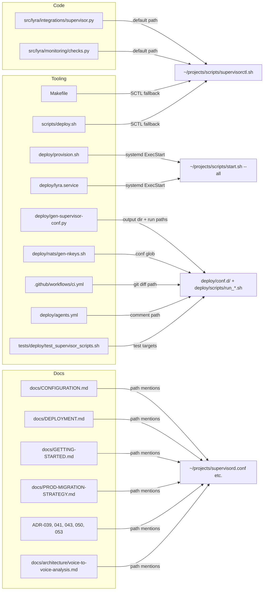

## Summary

Strip host scaffolding from `deploy/supervisor/`, move tenant-specific launchers to `deploy/scripts/`, move tenant confs to `deploy/conf.d/`, and rewire every repo reference (code, Makefile, CI, docs) to point at the machine-level supervisord at `~/projects/`.

## Architecture

### Target layout

```mermaid
flowchart TD
  subgraph Before["Before (to delete)"]
    B1[deploy/supervisor/supervisord.conf]:::del
    B2[deploy/supervisor/start.sh]:::del
    B3[deploy/supervisor/supervisorctl.sh]:::del
    B4[deploy/supervisor/scripts/run.sh]:::del
    B5[deploy/supervisor/scripts/start.sh]:::del
    B6[deploy/supervisor/scripts/stop.sh]:::del
    B7[deploy/supervisor/scripts/run_hub.sh]:::mv
    B8[deploy/supervisor/scripts/run_adapter.sh]:::mv
    B9[deploy/supervisor/conf.d/lyra-hub.conf]:::mv
    B10[deploy/supervisor/conf.d/lyra-telegram.conf]:::mv
    B11[deploy/supervisor/conf.d/lyra-discord.conf]:::mv
    B12[deploy/supervisor/conf.d/README.md]:::mv
  end
  subgraph After["After (lyra as tenant)"]
    A1[deploy/conf.d/lyra-hub.conf]
    A2[deploy/conf.d/lyra-telegram.conf]
    A3[deploy/conf.d/lyra-discord.conf]
    A4[deploy/conf.d/README.md]
    A5[deploy/scripts/run_hub.sh]
    A6[deploy/scripts/run_adapter.sh]
  end
  subgraph Host["Machine host ~/projects/ (out of repo)"]
    H1[~/projects/supervisord.conf]
    H2[~/projects/scripts/start.sh]
    H3[~/projects/scripts/supervisorctl.sh]
    H4[~/projects/conf.d/lyra-*.conf  ← copy of A1-A3]
  end
  B7 -.move.-> A5
  B8 -.move.-> A6
  B9 -.move.-> A1
  B10 -.move.-> A2
  B11 -.move.-> A3
  B12 -.rewrite.-> A4
  A1 -. operator copies .-> H4
  classDef del fill:#fee,stroke:#c00;
  classDef mv fill:#eef,stroke:#06c;
```

### Reference rewiring

## Agents

| Agent | Slice | Task count | Primary files |
|-------|-------|-----------|---------------|
| devops | V1, V2, V3 | 14 | deploy/**, Makefile, scripts/deploy.sh, src/lyra/**, tests/deploy/**, CI |
| doc-writer | V3 | 2 | docs/**, ADRs |
| tester | V3 | 1 | repo-wide grep + quality gates |

F-lite → single worktree `.claude/worktrees/886-retire-deploy-supervisor`, devops drives slices V1→V2→V3 sequentially; doc-writer parallel within V3.

## Consistency Report

- 3 slices × acceptance criteria 7 → all mapped.
- No uncovered affordances (F1–F9, D1–D7 all in tasks).
- No untraced tasks.

## Micro-Tasks

### Slice V1 — Relocate tenant confs + launchers

**T1** [P] Move lyra-specific launchers
- Files: `git mv deploy/supervisor/scripts/run_hub.sh deploy/scripts/run_hub.sh` ; same for `run_adapter.sh`.
- Verify: `test -x deploy/scripts/run_hub.sh && test -x deploy/scripts/run_adapter.sh`
- Expected: exit 0
- Agent: devops | Slice: V1 | Phase: GREEN | Spec: F6-prep | Difficulty: 1 | Time: 2m

**T2** [P] Move tenant confs
- Files: `git mv deploy/supervisor/conf.d/{lyra-hub,lyra-telegram,lyra-discord}.conf deploy/conf.d/`
- Update `command=` line in each: `%(ENV_HOME)s/projects/lyra/deploy/supervisor/scripts/run_{hub,adapter}.sh` → `%(ENV_HOME)s/projects/lyra/deploy/scripts/run_{hub,adapter}.sh`
- Verify: `grep -l "deploy/supervisor" deploy/conf.d/*.conf | wc -l`
- Expected: 0
- Agent: devops | Slice: V1 | Phase: GREEN | Spec: F6,F7,F8 | Difficulty: 2 | Time: 4m

**T3** Rewrite conf.d README
- Files: `deploy/conf.d/README.md` (move + rewrite; delete old `deploy/supervisor/conf.d/README.md`)
- Content: (a) lyra = tenant, (b) host = `~/projects/supervisord.conf`, (c) copy-in: `cp deploy/conf.d/*.conf ~/projects/conf.d/`, (d) refs to ADR-041 / ADR-047 / `lyra-nats-truth §14`.
- Verify: `grep -c "~/projects/supervisord.conf\|~/projects/conf.d" deploy/conf.d/README.md`
- Expected: ≥2
- Agent: devops | Slice: V1 | Phase: GREEN | Spec: F9 | Difficulty: 2 | Time: 6m

### Slice V2 — Delete host scaffolding

**T4** Delete host files + leftover helpers
- Files: `git rm deploy/supervisor/supervisord.conf deploy/supervisor/start.sh deploy/supervisor/supervisorctl.sh deploy/supervisor/.gitignore deploy/supervisor/scripts/run.sh deploy/supervisor/scripts/start.sh deploy/supervisor/scripts/stop.sh deploy/supervisor/scripts/supervisorctl.sh`
- Then `rmdir deploy/supervisor/scripts deploy/supervisor/conf.d deploy/supervisor` (expect empty).
- Verify: `test ! -d deploy/supervisor`
- Expected: exit 0
- Agent: devops | Slice: V2 | Phase: GREEN | Spec: F1,F2,F3,F4,F5 | Difficulty: 1 | Time: 2m

### Slice V3 — Repo-wide reference scrub

**T5** Update runtime code paths — SupervisorctlManager
- File: `src/lyra/integrations/supervisor.py`
- Change `DEFAULT_SUPERVISORCTL_PATH` to `Path.home() / "projects" / "scripts" / "supervisorctl.sh"`. Refresh module docstring.
- Verify: `uv run pyright src/lyra/integrations/supervisor.py && grep -c "deploy/supervisor" src/lyra/integrations/supervisor.py`
- Expected: pyright ok, grep returns 0
- Agent: devops | Slice: V3 | Phase: GREEN | Spec: D7 | Difficulty: 2 | Time: 4m

**T6** Update runtime code paths — monitoring.checks
- File: `src/lyra/monitoring/checks.py`
- Replace hardcoded `deploy/supervisor/supervisorctl.sh` with `~/projects/scripts/supervisorctl.sh`. Update docstring from "Uses supervisorctl via deploy/supervisor" to "Uses machine-level supervisorctl at ~/projects/scripts/".
- Verify: `grep -c "deploy/supervisor" src/lyra/monitoring/checks.py`
- Expected: 0
- Agent: devops | Slice: V3 | Phase: GREEN | Spec: D7 | Difficulty: 2 | Time: 3m

**T7** Update Makefile paths
- File: `Makefile`
- L126-128 conf paths → `deploy/conf.d/lyra-{hub,telegram,discord}.conf`.
- L170 SCTL fallback → `$(HOME)/projects/scripts/supervisorctl.sh`.
- L196 CONF path → `$(DEPLOY_DIR)/deploy/conf.d`.
- Verify: `grep -c "deploy/supervisor" Makefile`
- Expected: 0
- Agent: devops | Slice: V3 | Phase: GREEN | Spec: D2 | Difficulty: 2 | Time: 4m

**T8** Update gen-supervisor-conf.py
- File: `deploy/gen-supervisor-conf.py`
- Default output → `deploy/conf.d`. `RUN_HUB`/`RUN_ADAPTER` paths → `deploy/scripts/run_{hub,adapter}.sh`. Help text + module docstring.
- Regenerate confs: `uv run python deploy/gen-supervisor-conf.py`; expect no diff (confs already have the new paths after T2).
- Verify: `grep -c "deploy/supervisor" deploy/gen-supervisor-conf.py && git diff --exit-code deploy/conf.d/*.conf`
- Expected: grep 0, diff exit 0
- Agent: devops | Slice: V3 | Phase: GREEN | Spec: D3 | Difficulty: 3 | Time: 8m

**T9** Update provision.sh + lyra.service
- Files: `deploy/provision.sh` (L355-358 embedded unit), `deploy/lyra.service` (L8-10).
- `PIDFile` + `ExecStart` + `ExecStop` → target `~/projects/supervisord.pid`, `~/projects/scripts/start.sh --all`, `~/projects/scripts/supervisorctl.sh shutdown`. Align with prod reality.
- Verify: `grep -c "deploy/supervisor" deploy/provision.sh deploy/lyra.service`
- Expected: 0
- Agent: devops | Slice: V3 | Phase: GREEN | Spec: D4 | Difficulty: 2 | Time: 5m

**T10** Update scripts/deploy.sh
- File: `scripts/deploy.sh`
- `SCTL` → `$HOME/projects/scripts/supervisorctl.sh`. PID + start.sh refs → `$HOME/projects/supervisord.pid`, `$HOME/projects/scripts/start.sh`.
- Verify: `grep -c "deploy/supervisor" scripts/deploy.sh`
- Expected: 0
- Agent: devops | Slice: V3 | Phase: GREEN | Spec: D4 | Difficulty: 2 | Time: 4m

**T11** Update deploy/nats/gen-nkeys.sh + deploy/agents.yml
- `deploy/nats/gen-nkeys.sh` L129 `SUPERVISOR_GLOB` → `${REPO_ROOT}/deploy/conf.d/lyra-*.conf`.
- `deploy/agents.yml` L2 comment → `deploy/conf.d/*.conf`.
- Verify: `grep -c "deploy/supervisor" deploy/nats/gen-nkeys.sh deploy/agents.yml`
- Expected: 0
- Agent: devops | Slice: V3 | Phase: GREEN | Spec: D2 | Difficulty: 1 | Time: 2m

**T12** Update tests/deploy/test_supervisor_scripts.sh
- File: `tests/deploy/test_supervisor_scripts.sh`
- `HUB_SCRIPT` / `ADAPTER_SCRIPT` → `deploy/scripts/run_{hub,adapter}.sh`.
- Delete any assertions tied to deleted files (`start.sh`, `stop.sh`, `run.sh`).
- Verify: `bash tests/deploy/test_supervisor_scripts.sh`
- Expected: exit 0
- Agent: devops | Slice: V3 | Phase: GREEN | Spec: D5 | Difficulty: 2 | Time: 5m

**T13** Update CI workflow
- File: `.github/workflows/ci.yml`
- L61-62 git diff path + error message → `deploy/conf.d/*.conf`.
- Verify: `grep -c "deploy/supervisor" .github/workflows/ci.yml && yq '.' .github/workflows/ci.yml > /dev/null`
- Expected: grep 0, yq exits 0
- Agent: devops | Slice: V3 | Phase: GREEN | Spec: D6 | Difficulty: 1 | Time: 2m

**T14** Update docs — path mentions
- Files: `docs/CONFIGURATION.md`, `docs/DEPLOYMENT.md`, `docs/GETTING-STARTED.md`, `docs/PROD-MIGRATION-STRATEGY.md`, `docs/architecture/voice-to-voice-analysis.md`.
- Replace all `deploy/supervisor/...` references with the appropriate target (`deploy/conf.d/*.conf`, `~/projects/supervisord.conf`, `~/projects/scripts/start.sh --all`). Ensure each systemd example in docs uses `~/projects/scripts/start.sh --all`.
- Verify: `grep -rln "deploy/supervisor" docs/ | grep -v architecture/adr`
- Expected: empty
- Agent: doc-writer | Slice: V3 | Phase: GREEN | Spec: D1 | Difficulty: 2 | Time: 10m

**T15** Update ADRs — path mentions
- Files: `docs/architecture/adr/{039,041,043,050,053}-*.mdx`.
- Replace `deploy/supervisor/...` references with current layout. Preserve historical narrative (ADRs are immutable-ish; update only path mentions not decision records). ADR-041 gets an explicit "Superseded by ADR-047 for host layout" note if not already present.
- Verify: `grep -rln "deploy/supervisor" docs/architecture/adr/`
- Expected: empty (or only inside explicit "historical" fenced blocks, documented)
- Agent: doc-writer | Slice: V3 | Phase: GREEN | Spec: D1 | Difficulty: 3 | Time: 8m

**T16** [RED-GATE] Repo-wide scrub verification
- Verify: `git grep -n "deploy/supervisor" -- ':!artifacts' ':!*.mdx' | wc -l` and inspect any remaining matches manually.
- Expected: 0 live references (only artifact/ADR historical mentions allowed, and only if framed as historical).
- Agent: tester | Slice: V3 | Phase: RED-GATE | Spec: SC-4 | Difficulty: 1 | Time: 3m

**T17** [RED-GATE] Quality gates
- Run: `uv run ruff check . && uv run ruff format --check . && uv run pyright && uv run pytest`.
- Verify: all pass.
- Agent: tester | Slice: V3 | Phase: RED-GATE | Spec: SC-6 | Difficulty: 1 | Time: 5m

## Task IDs

<!-- Generated by /plan. Used by /implement to resume tasks on session restart. -->
- T1: 12 — Move lyra-specific launchers to deploy/scripts/
- T2: 13 — Move + rewrite tenant confs (deploy/conf.d/)
- T3: 14 — Rewrite deploy/conf.d/README.md
- T4: 15 — Delete host scaffolding (deploy/supervisor/)
- T5: 16 — Rewire SupervisorctlManager default path
- T6: 17 — Rewire monitoring.checks supervisorctl path
- T7: 18 — Update Makefile paths
- T8: 19 — Update deploy/gen-supervisor-conf.py
- T9: 20 — Update deploy/provision.sh + lyra.service systemd units
- T10: 21 — Update scripts/deploy.sh
- T11: 22 — Update gen-nkeys.sh + agents.yml comments
- T12: 23 — Update tests/deploy/test_supervisor_scripts.sh
- T13: 24 — Update .github/workflows/ci.yml
- T14: 25 — Update docs — path mentions
- T15: 26 — Update ADRs — path mentions
- T16: 27 — [RED-GATE] Repo-wide scrub verification
- T17: 28 — [RED-GATE] Quality gates
