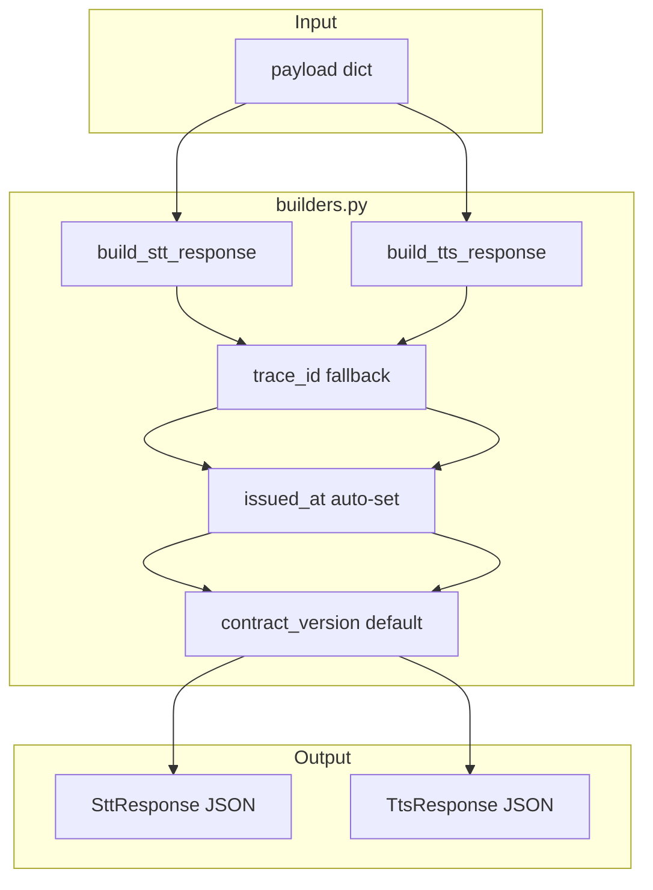
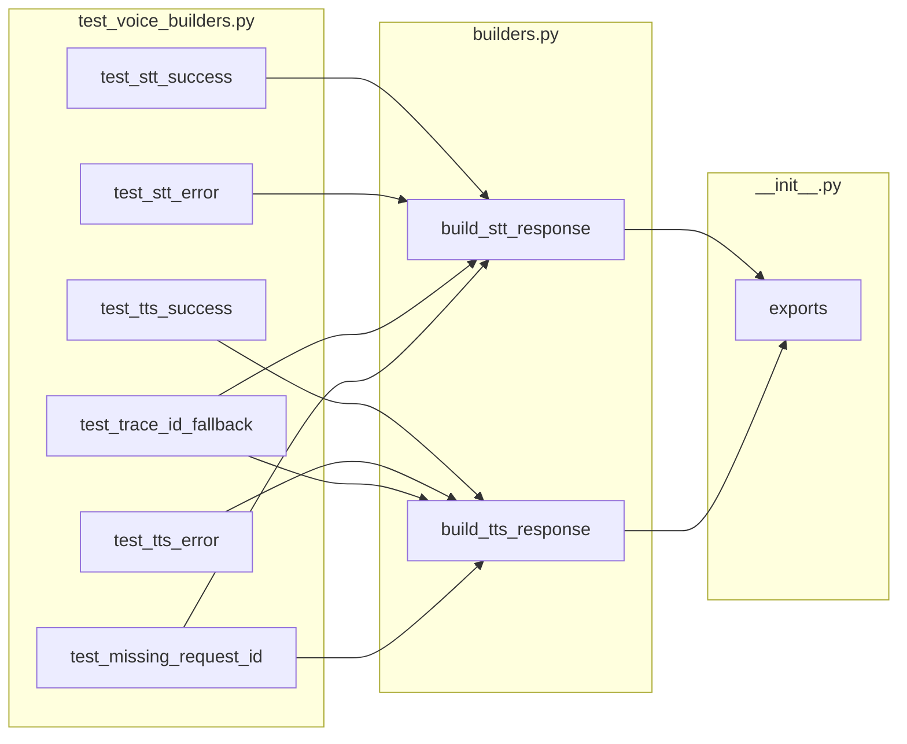

## Summary

Add `build_stt_response()` and `build_tts_response()` helper functions to `roxabi-contracts/voice/` that auto-populate required envelope fields (`contract_version`, `trace_id`, `issued_at`) and return JSON strings. Derived from the response construction pattern in `testing.py` lines 128-138, 196-205.

## Architecture

### Data Flow

### File × Function Map

## Reference Patterns

- `packages/roxabi-contracts/src/roxabi_contracts/voice/testing.py:128-138` — TtsResponse construction
- `packages/roxabi-contracts/src/roxabi_contracts/voice/testing.py:196-205` — SttResponse construction
- `packages/roxabi-contracts/src/roxabi_contracts/envelope.py:14` — CONTRACT_VERSION constant

## Agents

| Agent | Tasks | Files |
|-------|-------|-------|
| backend-dev | 3 | builders.py, __init__.py |
| tester | 3 | test_voice_builders.py |

## Micro-Tasks

### Slice V1: STT Builder

| # | Description | File | Agent | Time | Phase | P |
|---|-------------|------|-------|------|-------|---|
| 1 | Add `build_stt_response(payload, ok, text, language, duration_seconds, error=None) -> str` | builders.py | backend-dev | 5m | RED | N |
| 2 | Implement trace_id fallback: `payload.get("trace_id") or payload["request_id"]` | builders.py | backend-dev | 2m | GREEN | N |
| 3 | Unit tests for STT builder (success + error) | test_voice_builders.py | tester | 5m | GREEN | Y |

### Slice V2: TTS Builder

| # | Description | File | Agent | Time | Phase | P |
|---|-------------|------|-------|------|-------|---|
| 4 | Add `build_tts_response(payload, ok, audio_b64, mime_type, duration_ms, error=None, waveform_b64=None) -> str` | builders.py | backend-dev | 5m | RED | N |
| 5 | Unit tests for TTS builder (success + error) | test_voice_builders.py | tester | 5m | GREEN | Y |

### Slice V3: Edge Cases + Exports

| # | Description | File | Agent | Time | Phase | P |
|---|-------------|------|-------|------|-------|---|
| 6 | Export builders from `__init__.py` | __init__.py | backend-dev | 2m | GREEN | Y |
| 7 | Edge case tests: missing trace_id fallback, missing request_id raises KeyError | test_voice_builders.py | tester | 5m | GREEN | Y |

## Consistency Report

- **Covered criteria:** 9/9 (all success criteria mapped to tasks)
- **Uncovered:** None
- **Untraced tasks:** None
- **Exemptions:** None

## Task IDs

<!-- Generated by /plan. Used by /implement to resume tasks on session restart. -->
- T1: 8 — Add build_stt_response() to builders.py
- T2: 9 — Implement trace_id fallback in build_stt_response
- T3: 10 — Unit tests for STT builder
- T4: 11 — Add build_tts_response() to builders.py
- T5: 12 — Unit tests for TTS builder
- T6: 13 — Export builders from __init__.py
- T7: 14 — Edge case tests for builders
