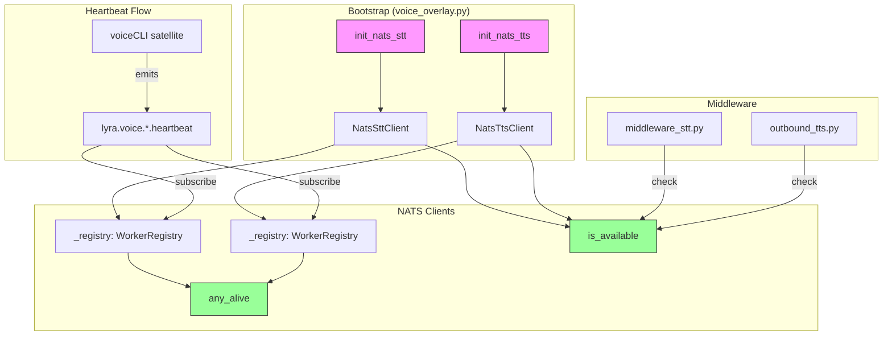
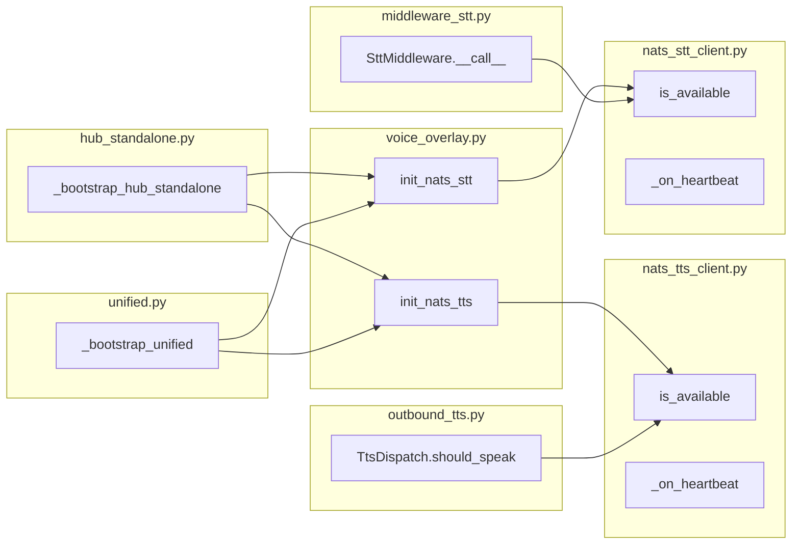

## Summary

Add `is_available()` method to NATS voice clients that delegates to `WorkerRegistry.any_alive()`, remove env var checks from bootstrap, and update middleware to check availability dynamically instead of `None`.

## Architecture

### Data Flow

### File × Function Map

## Bootstrap Context

None — this is F-lite, no analysis artifact.

## Agents

| Agent | Tasks | Files |
|-------|-------|-------|
| backend-dev | 7 | `nats_tts_client.py`, `nats_stt_client.py`, `voice_overlay.py`, `hub_standalone.py`, `unified.py`, `middleware_stt.py`, `outbound_tts.py` |
| tester | 3 | `test_nats_tts_client.py`, `test_nats_stt_client.py`, `test_voice_overlay.py` |

## Consistency Report

| Metric | Value |
|--------|-------|
| Covered criteria | 11/11 |
| Uncovered | 0 |
| Untraced tasks | 0 |
| Exemptions | 0 |

## Micro-Tasks

### V1: Add `is_available()` to clients [RED]

| # | Description | File | Verify | Expected | Time | Agent |
|---|-------------|------|--------|----------|------|-------|
| 1.1 | Add `is_available()` method to `NatsTtsClient` that returns `self._registry.any_alive()` | `src/lyra/nats/nats_tts_client.py` | `grep -n "def is_available" src/lyra/nats/nats_tts_client.py` | Method exists | 2m | backend-dev |
| 1.2 | Add `is_available()` method to `NatsSttClient` that returns `self._registry.any_alive()` | `src/lyra/nats/nats_stt_client.py` | `grep -n "def is_available" src/lyra/nats/nats_stt_client.py` | Method exists | 2m | backend-dev |

**RED-GATE V1:** Both methods exist, return bool. `uv run pytest tests/nats/test_nats_tts_client.py tests/nats/test_nats_stt_client.py -v`.

### V2: Remove env var checks + unconditional `start()` [RED]

| # | Description | File | Verify | Expected | Time | Agent |
|---|-------------|------|--------|----------|------|-------|
| 2.1 | Remove `LYRA_STT_ENABLED` check from `init_nats_stt()` — always create client | `src/lyra/bootstrap/factory/voice_overlay.py` | `grep -c "LYRA_STT_ENABLED" src/lyra/bootstrap/factory/voice_overlay.py` | 0 | 3m | backend-dev |
| 2.2 | Remove `LYRA_TTS_ENABLED` check from `init_nats_tts()` — always create client | `src/lyra/bootstrap/factory/voice_overlay.py` | `grep -c "LYRA_TTS_ENABLED" src/lyra/bootstrap/factory/voice_overlay.py` | 0 | 2m | backend-dev |
| 2.3 | Update `hub_standalone.py`: call `await stt_service.start()` unconditionally (remove `if stt_service is not None` guard) | `src/lyra/bootstrap/standalone/hub_standalone.py` | `grep -A1 "stt_service = init_nats_stt" src/lyra/bootstrap/standalone/hub_standalone.py \| grep -c "await.*start()"` | 1 | 3m | backend-dev |
| 2.4 | Update `hub_standalone.py`: call `await tts_service.start()` unconditionally | `src/lyra/bootstrap/standalone/hub_standalone.py` | `grep -A1 "tts_service = init_nats_tts" src/lyra/bootstrap/standalone/hub_standalone.py \| grep -c "await.*start()"` | 1 | 2m | backend-dev |
| 2.5 | Update `unified.py`: call `await stt_service.start()` unconditionally | `src/lyra/bootstrap/factory/unified.py` | `grep -A1 "stt_service = init_nats_stt" src/lyra/bootstrap/factory/unified.py \| grep -c "await.*start()"` | 1 | 2m | backend-dev |
| 2.6 | Update `unified.py`: call `await tts_service.start()` unconditionally | `src/lyra/bootstrap/factory/unified.py` | `grep -A1 "tts_service = init_nats_tts" src/lyra/bootstrap/factory/unified.py \| grep -c "await.*start()"` | 1 | 2m | backend-dev |

**RED-GATE V2:** No env var checks. Bootstrap files call `start()` unconditionally. `uv run pytest tests/bootstrap/test_voice_overlay.py -v`.

### V3: Update middleware to check availability [RED]

| # | Description | File | Verify | Expected | Time | Agent |
|---|-------------|------|--------|----------|------|-------|
| 3.1 | Replace `if hub._stt is None:` with `if not hub._stt.is_available():` in `middleware_stt.py` (line ~100) | `src/lyra/core/hub/middleware_stt.py` | `grep "is_available" src/lyra/core/hub/middleware_stt.py` | Match found | 3m | backend-dev |
| 3.2 | Update error message key from `stt_unsupported` to `stt_unavailable` when `is_available()` returns False | `src/lyra/core/hub/middleware_stt.py` | `grep -B2 "stt_unavailable" src/lyra/core/hub/middleware_stt.py \| grep "is_available"` | Match found | 2m | backend-dev |
| 3.3 | Replace `if self._tts is None` with `if not self._tts.is_available():` in `outbound_tts.py` `should_speak()` (line ~56) | `src/lyra/core/hub/outbound_tts.py` | `grep "is_available" src/lyra/core/hub/outbound_tts.py` | Match found | 3m | backend-dev |

**RED-GATE V3:** Middleware uses `is_available()` instead of `None` checks. `uv run pytest tests/core/test_hub_tts_dispatch.py -v`.

### V4: Remove env vars from supervisor configs [GREEN]

| # | Description | File | Verify | Expected | Time | Agent |
|---|-------------|------|--------|----------|------|-------|
| 4.1 | Search for `LYRA_TTS_ENABLED` / `LYRA_STT_ENABLED` in `deploy/` configs; remove if found, add deprecation note if not | `deploy/supervisord.d/*.conf` | `grep -r "LYRA_.*_ENABLED" deploy/ 2>/dev/null \|\| echo "Not found"` | "Not found" or removed | 2m | backend-dev |

**RED-GATE V4:** No `LYRA_*_ENABLED` in deploy configs. Manual verification.

### V5: Update tests [GREEN]

| # | Description | File | Verify | Expected | Time | Agent |
|---|-------------|------|--------|----------|------|-------|
| 5.1 | Add unit test for `NatsTtsClient.is_available()` — returns True when registry has alive workers, False otherwise | `tests/nats/test_nats_tts_client.py` | `grep "test_is_available" tests/nats/test_nats_tts_client.py` | Test exists | 5m | tester |
| 5.2 | Add unit test for `NatsSttClient.is_available()` — returns True when registry has alive workers, False otherwise | `tests/nats/test_nats_stt_client.py` | `grep "test_is_available" tests/nats/test_nats_stt_client.py` | Test exists | 5m | tester |
| 5.3 | Update `test_voice_overlay.py` — remove tests for env var checks, add tests for unconditional client creation | `tests/bootstrap/test_voice_overlay.py` | `uv run pytest tests/bootstrap/test_voice_overlay.py -v` | All pass | 8m | tester |

**RED-GATE V5:** All tests pass. `uv run pytest tests/ -v --tb=short`.

## Task IDs

<!-- Generated by /plan. Used by /implement to resume tasks on session restart. -->
- T1: 10 — Add is_available() to NatsTtsClient
- T2: 11 — Add is_available() to NatsSttClient
- T3: 12 — Remove LYRA_STT_ENABLED check from init_nats_stt
- T4: 13 — Remove LYRA_TTS_ENABLED check from init_nats_tts
- T5: 14 — Unconditional stt.start() in hub_standalone.py
- T6: 15 — Unconditional tts.start() in hub_standalone.py
- T7: 16 — Unconditional stt.start() in unified.py
- T8: 17 — Unconditional tts.start() in unified.py
- T9: 18 — Update middleware_stt.py to check is_available()
- T10: 19 — Update error message to stt_unavailable
- T11: 20 — Update outbound_tts.py to check is_available()
- T12: 21 — Remove env vars from deploy configs
- T13: 22 — Test NatsTtsClient.is_available()
- T14: 23 — Test NatsSttClient.is_available()
- T15: 24 — Update voice_overlay tests
