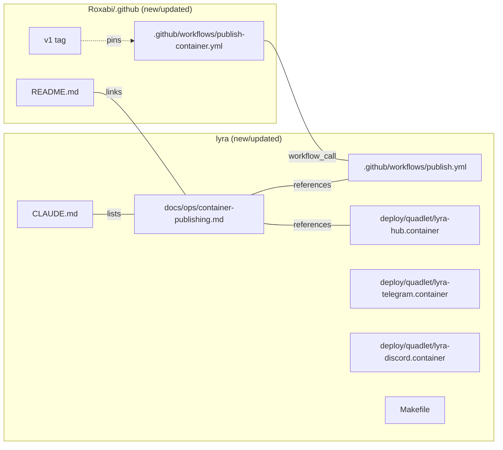

## Summary

Ship the Shape-2 reusable container-publishing workflow in `Roxabi/.github`, wire lyra as the reference caller, swap lyra's three Quadlet `Image=` lines from `localhost/lyra:latest` to `ghcr.io/roxabi/lyra:<tag>`, and publish the canonical pattern doc. Work spans two repos (Roxabi/.github + lyra); all CI/infra, no application code.

## Architecture

### Data flow

```mermaid
flowchart TD
  subgraph lyraRepo["lyra repo"]
    DF[Dockerfile] -->|built by| CALLER[.github/workflows/publish.yml<br/>caller, ~25 lines]
    CALLER -->|on push staging<br/>on tags lyra/v*| USES{{uses:<br/>Roxabi/.github@v1}}
  end

  subgraph orgRepo["Roxabi/.github"]
    REUSABLE[.github/workflows/<br/>publish-container.yml<br/>reusable, workflow_call]
    V1TAG[v1 floating tag]
    README[README.md<br/>quickstart]
  end

  USES --> REUSABLE
  V1TAG -.pins.-> REUSABLE

  REUSABLE -->|metadata-action<br/>+ buildx + push| GHCR[(ghcr.io/roxabi/lyra<br/>:staging · :X.Y.Z · :X · :latest)]

  subgraph M1["M₁ roxabituwer"]
    HUB[lyra-hub.container]
    TG[lyra-telegram.container]
    DC[lyra-discord.container]
  end

  GHCR -->|podman pull| HUB
  GHCR -->|podman pull| TG
  GHCR -->|podman pull| DC

  subgraph docs["Canonical doc"]
    DOC[lyra/docs/ops/<br/>container-publishing.md]
  end
  DOC -.reference.-> CALLER
  DOC -.reference.-> HUB
  README -.links to.-> DOC

  style REUSABLE fill:#2d5f8f,color:#fff
  style DOC fill:#2d5f8f,color:#fff
  style GHCR fill:#c7a34b,color:#000
```

### File × responsibility map



## Bootstrap Context

- **Dockerfile already exists** (two-stage, UID 1500, HEALTHCHECK). No changes needed.
- **release-please config** emits tags in format `lyra/X.Y.Z` (component `lyra`, tag-separator `/`). Caller workflow pattern: `tags: 'lyra/v*'`.
- **Existing remote-image precedent** in Quadlets: `deploy/quadlet/nats.container` pulls `docker.io/library/nats:2.10.29-alpine@sha256:...`. Use as reference for syntax.
- **Existing CI action-version pins**: see `.github/workflows/ci.yml` (`actions/checkout@v4`, `actions/setup-python`, etc.). Match the same pin style in the new workflow.
- **`Roxabi/.github` confirmed public**, has `FUNDING.yml` + `profile/`, no `.github/workflows/` directory yet — workflow + README are net-new additions.
- **GHCR visibility**: publish first, then explicitly flip package to public via `gh api --method PATCH /user/packages/container/lyra/visibility` or via the UI (GHCR packages default to private when first published from a private repo, public when the repo is public — lyra repo's visibility will dictate; verify after first push).

## Agents

| Agent | Task count | Files |
|---|---|---|
| `devops` | 9 | All workflow files, Quadlets, Makefile, M₁ validation |
| `doc-writer` | 3 | `docs/ops/container-publishing.md`, `Roxabi/.github/README.md`, lyra `CLAUDE.md` |

No `tester` agent — this is CI/infra; verification is "workflow succeeds and image appears in registry". No `architect` (design locked in analysis). No `security-auditor` (public image, no secret handling beyond built-in `GITHUB_TOKEN`).

## Consistency Report

- **Criteria → tasks coverage:** 14 / 14 covered.
- **Uncovered criteria:** none.
- **Tasks without spec trace:** none.
- **Slice coverage:** V1 (5 tasks) · V2 (2 tasks) · V3 (3 tasks) · V4 (3 tasks) · cross-slice/wrap (1 task).

## Slice Selection

All 4 slices land in one PR (spec decision — criteria are inseparably coupled, no meaningful seam to split). Order is V1 → V2 → V3 → V4 with RED-GATE between each.

## Micro-Tasks

### V1 — Reusable workflow + staging publish

**T1 [devops] · Difficulty 2**
Clone `Roxabi/.github` into a sibling working directory; scaffold `.github/workflows/` directory.
- Files: `<sibling>/Roxabi-dotgithub/.github/workflows/` (new dir)
- Verify: `git -C <sibling>/Roxabi-dotgithub status` → clean, directory exists
- Spec trace: N1
- Phase: GREEN

**T2 [devops] · Difficulty 4**
Write reusable workflow `publish-container.yml` in `Roxabi/.github` with `on: workflow_call`, 4 inputs (`image_name` required string, `release_please_component` required string, `dockerfile_path` default `./Dockerfile`, `build_context` default `.`), permissions `contents: read` + `packages: write`. Jobs: checkout → `docker/setup-buildx-action@v3` → `docker/login-action@v3` to ghcr.io with `GITHUB_TOKEN` → `docker/metadata-action@v5` producing tags (`type=raw,value=staging,enable={{is_default_branch==false && ref_name==staging}}` effectively "on staging branch"; `type=semver,pattern={{version}}` + `type=semver,pattern={{major}}` + `type=raw,value=latest,enable={{is tag push}}` on tag push) and OCI labels (`org.opencontainers.image.{source,revision,version,created}`) → `docker/build-push-action@v5` with `push: true`.
- Files: `Roxabi/.github/.github/workflows/publish-container.yml` (new, ~80 lines)
- Verify: `actionlint .github/workflows/publish-container.yml` (install via `go install github.com/rhysd/actionlint/cmd/actionlint@latest` if absent) → 0 errors
- Ref: lyra `.github/workflows/ci.yml` for action-pin style
- Spec trace: N1
- Phase: GREEN

**T3 [devops] · Difficulty 2**
Commit T2 to `Roxabi/.github`, push to `main`, create and push floating branch `v1` tracking the same commit (branch, not tag — GitHub's `uses: @v1` resolves branches or tags; branch allows moving forward non-breakingly).
- Files: `Roxabi/.github` remote
- Verify: `gh api repos/Roxabi/.github/branches/v1 --jq .name` → `v1`; `gh api repos/Roxabi/.github/contents/.github/workflows/publish-container.yml --jq .name` → `publish-container.yml`
- Spec trace: N3
- Phase: GREEN

**T4 [devops] · Difficulty 3**
Create lyra caller workflow `.github/workflows/publish.yml`. Triggers: `push: branches: [staging]` (V1 scope — tag trigger added in T6). Permissions: `contents: read`, `packages: write`. Single job `publish` with `uses: Roxabi/.github/.github/workflows/publish-container.yml@v1` and `secrets: inherit`, passing `image_name: ghcr.io/roxabi/lyra` and `release_please_component: lyra`.
- Files: `.github/workflows/publish.yml` (new, ≤30 lines)
- Verify: `actionlint .github/workflows/publish.yml` → 0 errors; file ≤30 lines (`wc -l`)
- Ref: spec U1
- Spec trace: U1
- Phase: GREEN

**T5 [devops] · Difficulty 3** · **RED-GATE for V1**
End-to-end staging publish proof. On feature branch (not staging), temporarily add `workflow_dispatch` to `publish.yml` and run via `gh workflow run publish.yml --ref <feature-branch>` OR merge the caller first and do a throwaway commit to `staging`. Observe workflow success; confirm `ghcr.io/roxabi/lyra:staging` image exists; `podman pull ghcr.io/roxabi/lyra:staging` from M₂ succeeds. Verify GHCR package visibility is public (flip via `gh api --method PATCH -f visibility=public /orgs/Roxabi/packages/container/lyra/visibility` if not).
- Files: (no code change; if `workflow_dispatch` added temporarily, revert before merge)
- Verify: `podman pull ghcr.io/roxabi/lyra:staging` → success; `skopeo inspect docker://ghcr.io/roxabi/lyra:staging | jq '.Labels'` → shows OCI labels
- Spec trace: SC-4, SC-6, SC-7
- Phase: RED-GATE

### V2 — Release-please tag publish

**T6 [devops] · Difficulty 2**
Add tag trigger to lyra caller workflow: `push: tags: ['lyra/v*']` alongside the staging branch trigger. Confirm reusable workflow's metadata-action handles tag-push correctly (emits `:X.Y.Z`, `:X`, `:latest`).
- Files: `.github/workflows/publish.yml` (edit)
- Verify: `actionlint` → 0 errors; visual inspection of metadata-action config
- Spec trace: U1
- Phase: GREEN

**T7 [devops] · Difficulty 3** · **RED-GATE for V2**
Semver publish proof. Either wait for the next real release-please tag, OR cut a throwaway pre-release tag manually: `git tag lyra/v0.0.1-rc.1 <sha-on-main> && git push origin lyra/v0.0.1-rc.1`. Workflow fires, publishes `:0.0.1-rc.1` + `:0.0.1-rc` + `:latest`. Verify all three tags land. Delete the throwaway tag + GHCR tag after validation (`gh api --method DELETE ...`).
- Files: (registry-side, ephemeral)
- Verify: `skopeo list-tags docker://ghcr.io/roxabi/lyra | jq '.Tags | map(select(startswith("0.0.1")))'` → `["0.0.1-rc.1", "0.0.1-rc", "latest"]` (approximate — adjust for metadata-action's actual pre-release handling)
- Spec trace: SC-5
- Phase: RED-GATE

### V3 — Lyra Quadlets swapped + M₁ pulling

**T8 [devops] · Difficulty 1** · `[P]`
Swap `Image=localhost/lyra:latest` → `Image=ghcr.io/roxabi/lyra:staging` in three Quadlet files. `:staging` chosen as initial pin (immutable semver pin happens after first real release-please cut on `main`).
- Files: `deploy/quadlet/lyra-hub.container`, `deploy/quadlet/lyra-telegram.container`, `deploy/quadlet/lyra-discord.container`
- Verify: `grep -n "Image=" deploy/quadlet/lyra-{hub,telegram,discord}.container` → all three show `ghcr.io/roxabi/lyra:staging`
- Ref: `deploy/quadlet/nats.container` (remote-image syntax precedent)
- Spec trace: U2, U3, U4, SC-8
- Phase: GREEN

**T9 [devops] · Difficulty 2** · `[P]`
Update `Makefile`: default `LYRA_IMAGE ?= ghcr.io/roxabi/lyra:latest`; add comment on `make push` target noting it is now an opt-in fallback for offline/dev scenarios (the canonical path is `podman pull` from ghcr.io after CI publishes).
- Files: `Makefile`
- Verify: `grep -A2 'LYRA_IMAGE' Makefile | head` → shows `ghcr.io/roxabi/lyra:latest`
- Spec trace: U6, SC-13
- Phase: GREEN

**T10 [devops] · Difficulty 3** · **RED-GATE for V3**
M₁ validation runbook. On `roxabituwer`: `podman pull ghcr.io/roxabi/lyra:staging` succeeds with no auth flags → `systemctl --user daemon-reload` → `systemctl --user restart lyra-hub lyra-telegram lyra-discord` → all three active and healthy (`systemctl --user status lyra-hub` shows `active (running)`, hub health endpoint `curl localhost:8443/health` green).
- Files: (operational; no repo change — record outcome in PR description)
- Verify: Remote exec: `ssh M1 'podman pull ghcr.io/roxabi/lyra:staging && systemctl --user daemon-reload && systemctl --user restart lyra-hub lyra-telegram lyra-discord && systemctl --user is-active lyra-hub lyra-telegram lyra-discord'` → all three report `active`
- Spec trace: SC-9
- Phase: RED-GATE

### V4 — Canonical doc + quickstart

**T11 [doc-writer] · Difficulty 3** · `[P]`
Create `docs/ops/container-publishing.md`. Sections: Overview · Dockerfile conventions (multi-stage, pinned base, UID pinning, HEALTHCHECK) · Caller workflow template (copy-pasteable, with required + optional inputs documented) · Quadlet `Image=` convention (semver pin default, `:staging` for pre-release validation) · M₁ pull + restart runbook (the 3 commands from T10) · M₁ `containers-auth.json` setup (for future private-image adopters — public images need no auth) · Rollback recipe (edit Quadlet `Image=` to previous semver, `daemon-reload`, restart) · Cross-repo adoption checklist (5 items from spec's "Other Roxabi repos adopt" section).
- Files: `docs/ops/container-publishing.md` (new)
- Verify: `test -f docs/ops/container-publishing.md && wc -l docs/ops/container-publishing.md` (expect 150–250 lines); `grep -c '^##' docs/ops/container-publishing.md` → ≥7 sections
- Spec trace: U5, SC-10
- Phase: GREEN

**T12 [doc-writer] · Difficulty 2** · `[P]`
Update `Roxabi/.github/README.md` (in the separate clone). Add a "Publishing container images" section with ~10-line caller snippet, link to `https://github.com/Roxabi/lyra/blob/main/docs/ops/container-publishing.md` as the canonical reference. Commit + push to `Roxabi/.github` main, fast-forward `v1` branch.
- Files: `Roxabi/.github/README.md` (edit)
- Verify: `gh api repos/Roxabi/.github/contents/README.md --jq .content | base64 -d | grep -c 'container-publishing.md'` → ≥1
- Spec trace: N2, SC-11
- Phase: GREEN

**T13 [doc-writer] · Difficulty 1** · `[P]`
Add a row for `docs/ops/container-publishing.md` to lyra `CLAUDE.md` under `## Key files`.
- Files: `CLAUDE.md` (edit)
- Verify: `grep 'container-publishing' CLAUDE.md` → 1 hit
- Spec trace: U7, SC-12
- Phase: GREEN

### Cross-slice

**T14 [devops] · Difficulty 1**
Add a one-line cross-reference comment on voiceCLI #111 pointing to this PR as the unblocking artifact.
- Files: `gh issue comment Roxabi/voiceCLI#111 -b "Unblocked by Roxabi/lyra#920 — see docs/ops/container-publishing.md in that PR."`
- Verify: `gh issue view Roxabi/voiceCLI#111 --json comments --jq '.comments[-1].body'` → contains `#920`
- Spec trace: SC-14
- Phase: GREEN

## Execution order

```
T1 → T2 → T3  (Roxabi/.github setup)
      ↓
      T4 → T5 (RED-GATE V1)
            ↓
            T6 → T7 (RED-GATE V2)
                  ↓
                  T8 ∥ T9 → T10 (RED-GATE V3)
                                  ↓
                                  T11 ∥ T12 ∥ T13 → T14
```

Dependencies drawn for `/implement`: T2→T1, T3→T2, T4→T3, T5→T4, T6→T5, T7→T6, T8→T7, T9→T7, T10→[T8,T9], T11→T10, T12→T10, T13→T10, T14→[T11,T12,T13].

## Task IDs

<!-- Generated by /plan. Used by /implement to resume tasks on session restart. -->
- T1: 12 — Clone Roxabi/.github, scaffold workflows dir
- T2: 13 — Write reusable publish-container.yml workflow
- T3: 14 — Push Roxabi/.github + create v1 floating branch
- T4: 15 — Create lyra caller .github/workflows/publish.yml
- T5: 16 — V1 RED-GATE — staging publish E2E proof
- T6: 17 — Add release-please tag trigger to caller workflow
- T7: 18 — V2 RED-GATE — semver tag publish proof
- T8: 19 — Swap Image= in three Quadlet units [P]
- T9: 20 — Update Makefile LYRA_IMAGE default [P]
- T10: 21 — V3 RED-GATE — M₁ pull + restart validation
- T11: 22 — Write docs/ops/container-publishing.md [P]
- T12: 23 — Add quickstart section to Roxabi/.github README [P]
- T13: 24 — Link new doc in lyra CLAUDE.md Key files [P]
- T14: 25 — Cross-reference unblock comment on voiceCLI #111
