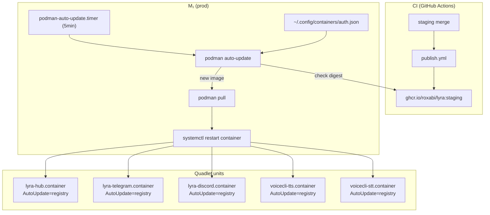
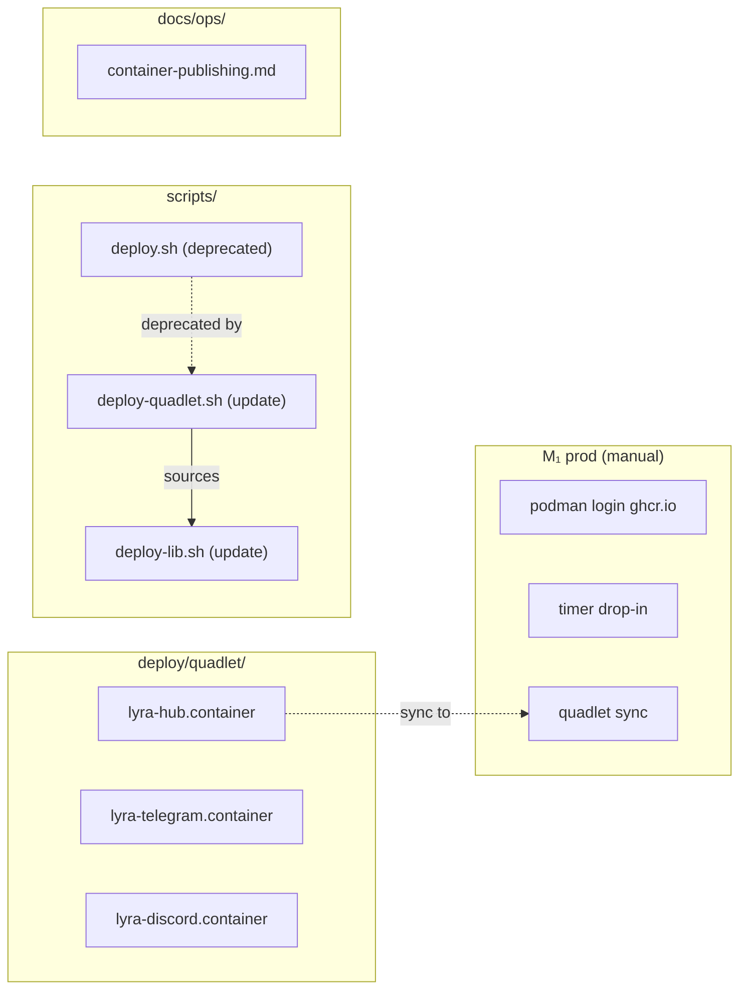

## Summary

Enable Podman auto-update on prod (M₁) so GHCR images published by CI are automatically pulled and deployed. Add `AutoUpdate=registry` labels to Quadlet `.container` files, configure GHCR auth and timer on prod, then clean up legacy deploy scripts.

## Architecture

### Data Flow



### File x Function Map



## Agents

| Agent | Task count | Files |
|-------|-----------|-------|
| devops | 8 | `deploy/quadlet/*.container`, `scripts/deploy*.sh`, prod config |
| doc-writer | 1 | `docs/ops/container-publishing.md` |

## Consistency Report

- Criteria covered: 9/9
- Uncovered criteria: none
- Tasks without spec backing: none
- Gold plating exemptions applied: 0

## Micro-Tasks

### Slice V1: GHCR auth + image ref fix

#### Task 1: Add AutoUpdate=registry label to lyra .container files [P] → devops
- **File:** `deploy/quadlet/lyra-hub.container`, `deploy/quadlet/lyra-telegram.container`, `deploy/quadlet/lyra-discord.container`
- **Snippet:** `Label=io.containers.autoupdate=registry` (add to `[Container]` section)
- **Verify:** `grep -q 'io.containers.autoupdate=registry' deploy/quadlet/lyra-hub.container deploy/quadlet/lyra-telegram.container deploy/quadlet/lyra-discord.container` (ready)
- **Expected:** exit 0
- **Time:** 3 min
- **Difficulty:** 1
- **Traces:** SC-2, U1
- **Phase:** GREEN

#### Task 2: Configure GHCR auth on M₁ → devops
- **File:** prod: `~/.config/containers/auth.json`
- **Snippet:** `podman login ghcr.io --username <user> --password-stdin <<< $PAT`
- **Verify:** `ssh roxabituwer 'podman login --get-login ghcr.io'` (ready)
- **Expected:** username printed (not error)
- **Time:** 5 min
- **Difficulty:** 2
- **Traces:** SC-4, U3
- **Phase:** GREEN

#### Task 3: Sync .container files to prod and restart → devops
- **File:** prod: `~/.config/containers/systemd/lyra-*.container`
- **Snippet:** Copy repo `.container` files → prod quadlet dir, `systemctl --user daemon-reload`
- **Verify:** `ssh roxabituwer 'grep -q "ghcr.io/roxabi/lyra:staging" ~/.config/containers/systemd/lyra-hub.container && grep -q "io.containers.autoupdate" ~/.config/containers/systemd/lyra-hub.container'` (ready)
- **Expected:** exit 0
- **Time:** 5 min
- **Difficulty:** 2
- **Traces:** SC-1, SC-2
- **Phase:** GREEN
- **Dependencies:** Task 1, Task 2

#### RED-GATE: V1 complete → devops
- **Verify:** `ssh roxabituwer 'podman pull ghcr.io/roxabi/lyra:staging'` succeeds (manual)
- **Phase:** RED-GATE

### Slice V2: AutoUpdate label + timer

#### Task 4: Add AutoUpdate=registry label to voicecli .container files → devops
- **File:** prod: `~/.config/containers/systemd/voicecli-tts.container`, `voicecli-stt.container`
- **Snippet:** `Label=io.containers.autoupdate=registry` (add to `[Container]` section)
- **Verify:** `ssh roxabituwer 'grep -q "io.containers.autoupdate=registry" ~/.config/containers/systemd/voicecli-tts.container ~/.config/containers/systemd/voicecli-stt.container'` (ready)
- **Expected:** exit 0
- **Time:** 3 min
- **Difficulty:** 1
- **Traces:** SC-2, U1
- **Phase:** GREEN

#### Task 5: Create podman-auto-update timer drop-in on M₁ → devops
- **File:** prod: `~/.config/systemd/user/podman-auto-update.timer.d/override.conf`
- **Snippet:**
  ```ini
  [Timer]
  OnCalendar=
  OnCalendar=*:0/5
  RandomizedDelaySec=0
  ```
- **Verify:** `ssh roxabituwer 'systemctl --user is-active podman-auto-update.timer'` (ready)
- **Expected:** `active`
- **Time:** 5 min
- **Difficulty:** 2
- **Traces:** SC-3, U2
- **Phase:** GREEN
- **Dependencies:** Task 3

#### Task 6: Verify end-to-end auto-update → devops
- **File:** n/a
- **Snippet:** `podman auto-update --dry-run` on M₁ to confirm containers are detected
- **Verify:** `ssh roxabituwer 'podman auto-update --dry-run 2>&1 | grep -q "registry"'` (ready)
- **Expected:** exit 0 with registry-mode containers listed
- **Time:** 3 min
- **Difficulty:** 1
- **Traces:** SC-5, N1
- **Phase:** GREEN
- **Dependencies:** Task 4, Task 5

#### RED-GATE: V2 complete → devops
- **Verify:** `podman auto-update --dry-run` lists all 5 containers (manual)
- **Phase:** RED-GATE

### Slice V3: Legacy cleanup

#### Task 7: Disable lyra-deploy.timer on M₁ → devops
- **File:** prod: `~/.config/systemd/user/lyra-deploy.timer`
- **Snippet:** `systemctl --user disable --now lyra-deploy.timer`
- **Verify:** `ssh roxabituwer 'systemctl --user is-active lyra-deploy.timer'` (ready)
- **Expected:** `inactive`
- **Time:** 2 min
- **Difficulty:** 1
- **Traces:** SC-7
- **Phase:** GREEN

#### Task 8: Deprecate legacy deploy scripts → devops
- **File:** `scripts/deploy.sh`, `scripts/deploy-quadlet.sh`, `scripts/deploy-lib.sh`
- **Snippet:** Add deprecation header: `# DEPRECATED: replaced by podman-auto-update (see #929). Retained as offline fallback.`
- **Verify:** `grep -q 'DEPRECATED' scripts/deploy.sh scripts/deploy-quadlet.sh` (ready)
- **Expected:** exit 0
- **Time:** 3 min
- **Difficulty:** 1
- **Traces:** SC-8
- **Phase:** GREEN

#### Task 9: Update container-publishing docs → doc-writer
- **File:** `docs/ops/container-publishing.md`
- **Snippet:** Add "## Auto-Update Flow" section documenting: timer config, auth prereq, how to verify, how to force manual update
- **Verify:** `grep -q 'Auto-Update' docs/ops/container-publishing.md` (ready)
- **Expected:** exit 0
- **Time:** 5 min
- **Difficulty:** 2
- **Traces:** SC-9
- **Phase:** GREEN
- **Dependencies:** Task 7

## Task IDs

<!-- Generated by /plan. Used by /implement to resume tasks on session restart. -->
- T1: 10 — Add AutoUpdate=registry label to lyra .container files
- T2: 11 — Configure GHCR auth on M₁
- T3: 12 — Sync .container files to prod and restart
- T4: 13 — Add AutoUpdate=registry to voicecli .container files on prod
- T5: 14 — Create podman-auto-update timer drop-in on M₁
- T6: 15 — Verify end-to-end auto-update dry-run
- T7: 16 — Disable lyra-deploy.timer on M₁
- T8: 17 — Deprecate legacy deploy scripts
- T9: 18 — Update container-publishing docs
