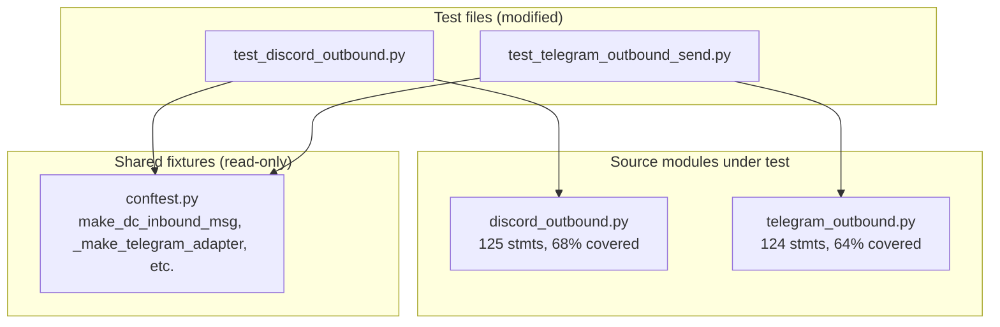

## Summary

Add ~20 targeted tests across 2 slices to cover the remaining gaps in `discord_outbound.py` (68% → ≥80%) and `telegram_outbound.py` (64% → ≥80%). Test-only — no production code changes.

## Architecture

## Agents

| Agent | Tasks | Files |
|-------|-------|-------|
| tester | all | `tests/adapters/test_discord_outbound.py`, `tests/adapters/test_telegram_outbound_send.py` |

Single agent — all work is in the same domain and test files.

## Reference Patterns

- `tests/adapters/test_discord_outbound.py` — existing send() tests, `_make_discord_adapter()`, mock channel setup
- `tests/adapters/test_telegram_outbound_send.py` — existing send() tests, `_make_telegram_adapter()`
- `tests/adapters/conftest.py` — `make_dc_inbound_msg()`, `attach_typing_cm()`, `_make_telegram_message()`

## Micro-Tasks

### Slice 1 — Streaming callbacks

#### T1 [P] — Discord streaming callback tests (RED)

**Description:** Add tests for `build_streaming_callbacks()` inner closures in discord_outbound.py.
**File:** `tests/adapters/test_discord_outbound.py`
**Tests to add:**
1. `test_build_streaming_noop_on_non_discord_msg` — pass non-discord InboundMessage → `_send_placeholder` raises ValueError (covers L169–175)
2. `test_streaming_send_placeholder_no_reply` — `should_reply=False` (thread context or no message_id) → `channel.send()` called (covers L200–201)
3. `test_streaming_edit_placeholder_text` — calls `ph.edit(content=..., embed=None)` (covers L204–205)
4. `test_streaming_edit_placeholder_tool` — builds embed, calls `ph.edit(content="", embed=...)` (covers L211–212)
5. `test_streaming_send_message_multi_chunk` — text > 2000 chars → 2 chunks, `send_with_retry` for first, direct send for last, returns last id (covers L218–234)
6. `test_streaming_send_message_failure` — last chunk send raises → logs exception, returns None (covers L227–228)

**Mock strategy:**
- Build adapter with `make_dc_inbound_msg()`
- Mock `adapter._resolve_channel` → returns mock channel
- Mock `adapter._msg` → returns placeholder text
- For edit tests: call closure directly with mock placeholder object
- For multi-chunk: use text > `DISCORD_MAX_LENGTH` (2000)

**Verify:** `uv run pytest tests/adapters/test_discord_outbound.py -q`
**Expected:** All tests pass
**Spec trace:** SC-1 (discord ≥80%)
**Difficulty:** 3

#### T2 [P] — Telegram streaming callback tests (RED)

**Description:** Add tests for `build_streaming_callbacks()` inner closures in telegram_outbound.py.
**File:** `tests/adapters/test_telegram_outbound_send.py`
**Tests to add:**
1. `test_build_streaming_noop_on_non_telegram_msg` — pass non-telegram InboundMessage → `_send_placeholder` raises ValueError (covers L176–182)
2. `test_streaming_send_placeholder_with_reply` — `reply_to` set → `bot.send_message` with `reply_to_message_id` (covers L199–205)
3. `test_streaming_send_placeholder_no_reply` — `reply_to=None` → sends without `reply_to_message_id`
4. `test_streaming_edit_placeholder_text` — renders text, calls `bot.edit_message_text` (covers L208–218)
5. `test_streaming_edit_placeholder_text_failure` — edit raises → logs debug, no re-raise (covers L217–218)
6. `test_streaming_edit_placeholder_tool` — formats tool summary, edits message (covers L221–232)
7. `test_streaming_send_message` — renders chunks, sends each, returns last message_id (covers L235–244)
8. `test_streaming_send_fallback_with_text` — renders text + sends (covers L246–256)
9. `test_streaming_send_fallback_empty_text` — uses placeholder_text when text is falsy (covers L250)

**Mock strategy:**
- Build adapter with `_make_telegram_adapter()`, attach `AsyncMock` bot
- Mock `adapter._msg` → returns placeholder text
- For tool tests: create `ToolSummaryRenderEvent(is_complete=True/False)` directly
- For edit failure: `bot.edit_message_text = AsyncMock(side_effect=Exception(...))`

**Verify:** `uv run pytest tests/adapters/test_telegram_outbound_send.py -q`
**Expected:** All tests pass
**Spec trace:** SC-2 (telegram ≥80%)
**Difficulty:** 3

#### RED-GATE — Slice 1

**Verify:** `uv run pytest tests/adapters/test_discord_outbound.py tests/adapters/test_telegram_outbound_send.py -q`
**Expected:** All new + existing tests pass

### Slice 2 — Tool formatting + send edges

#### T3 [P] — Discord tool embed + send edge tests (RED)

**Description:** Add tests for `_build_tool_embed`, intermediate outbound, thread-context send, typing worker bail-out/retry.
**File:** `tests/adapters/test_discord_outbound.py`
**Tests to add:**
1. `test_build_tool_embed_complete` — `ToolSummaryRenderEvent(is_complete=True)` → green embed (covers L144–149)
2. `test_build_tool_embed_incomplete` — `is_complete=False` → blue embed (covers L144–149)
3. `test_send_intermediate_starts_typing` — `outbound.intermediate=True` → `_start_typing` called (covers L132)
4. `test_send_thread_context_uses_channel_send` — `thread_id` set → `messageable.send()` not `reply()` (covers L105, L125–128)
5. `test_send_thread_context_with_view` — thread + buttons → `messageable.send(chunk, view=...)` (covers L126)
6. `test_send_invalid_inbound_returns_early` — non-discord msg → `send()` returns without calling API (covers L103)
7. `test_typing_worker_retry_resolve` — first resolve raises, second succeeds → proceeds to typing loop. Patch `asyncio.sleep`. (covers L47–60)
8. `test_typing_worker_bailout_after_3_errors` — `channel.typing()` raises 3 times → worker returns. Patch `asyncio.sleep`. (covers L67–83)

**Mock strategy:**
- Tool embed: call `_build_tool_embed(event)` directly — it's a module-level function
- Thread context: use `make_dc_inbound_msg()` variant with `thread_id=777` in platform_meta
- Typing worker: call `_discord_typing_worker(resolve_fn, channel_id)` directly, patch `asyncio.sleep` to `AsyncMock`
- Intermediate: set `outbound.intermediate = True`, mock `adapter._start_typing`

**Verify:** `uv run pytest tests/adapters/test_discord_outbound.py -q`
**Expected:** All tests pass
**Spec trace:** SC-1 (discord ≥80%)
**Difficulty:** 2

#### T4 [P] — Telegram tool summary + send edge tests (RED)

**Description:** Add tests for `_format_tool_summary`, intermediate outbound, no-reply send, typing worker bail-out.
**File:** `tests/adapters/test_telegram_outbound_send.py`
**Tests to add:**
1. `test_format_tool_summary_complete` — `is_complete=True` → contains "Done ✅" (covers L154–158)
2. `test_format_tool_summary_incomplete` — `is_complete=False` → contains "Working…" (covers L154–158)
3. `test_send_intermediate_starts_typing` — `outbound.intermediate=True` → `_start_typing` called (covers L147)
4. `test_send_no_reply_to` — `message_id=None` in platform_meta → `reply_to_message_id` not in kwargs (covers L139–140)
5. `test_typing_worker_bailout_after_3_failures` — `bot.send_chat_action` raises 3 times → breaks. Patch `asyncio.sleep`. (covers L53–67)

**Mock strategy:**
- Tool summary: call `_format_tool_summary(event)` directly — module-level function
- No reply: build InboundMessage with `platform_meta={"chat_id": 123, "message_id": None, ...}`
- Typing worker: call `_typing_worker(bot, chat_id)` directly, patch `asyncio.sleep`, cancel after bail-out
- Intermediate: set `outbound.intermediate = True`, mock `adapter._start_typing`

**Verify:** `uv run pytest tests/adapters/test_telegram_outbound_send.py -q`
**Expected:** All tests pass
**Spec trace:** SC-2 (telegram ≥80%)
**Difficulty:** 2

#### RED-GATE — Slice 2

**Verify:** `uv run pytest tests/adapters/test_discord_outbound.py tests/adapters/test_discord_typing.py tests/adapters/test_telegram_outbound_send.py tests/adapters/test_telegram_outbound_render.py tests/adapters/test_telegram_typing.py --cov=lyra.adapters.discord.discord_outbound --cov=lyra.adapters.telegram.telegram_outbound --cov-report=term-missing -q`
**Expected:** discord ≥80%, telegram ≥80%, all tests pass

## Coverage Math

**Discord:** 125 stmts, currently 88 covered (68%). Need ≥100 covered for 80%. T1 adds ~12 stmts (streaming closures), T3 adds ~15 stmts (tool embed + send edges + typing). Total ≈115 covered → ~92%. Buffer for branch misses.

**Telegram:** 124 stmts, currently 81 covered (64%). Need ≥100 covered for 80%. T2 adds ~18 stmts (streaming closures), T4 adds ~10 stmts (tool summary + send edges + typing). Total ≈109 covered → ~88%. Buffer for branch misses.

## Task IDs

<!-- Generated by /plan. Used by /implement to resume tasks on session restart. -->
- T1: 9 — Discord streaming callback tests
- T2: 10 — Telegram streaming callback tests
- T3: 11 — Discord tool embed + send edge tests
- T4: 12 — Telegram tool summary + send edge tests

## Consistency Report

| Spec criterion | Tasks | Status |
|----------------|-------|--------|
| SC-1: discord ≥80% | T1, T3 | covered |
| SC-2: telegram ≥80% | T2, T4 | covered |
| SC-3: all new tests pass | RED-GATE 1, RED-GATE 2 | covered |
| SC-4: existing 44 tests green | RED-GATE 2 | covered |
| SC-5: no new Any types | all (test-only, no prod changes) | covered |
| SC-6: no prod code changes | all | covered |
| SC-7: asyncio.sleep patched | T3, T4 | covered |
