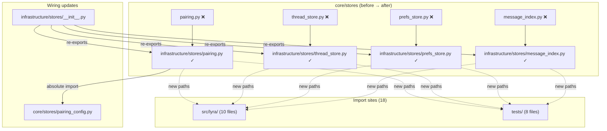
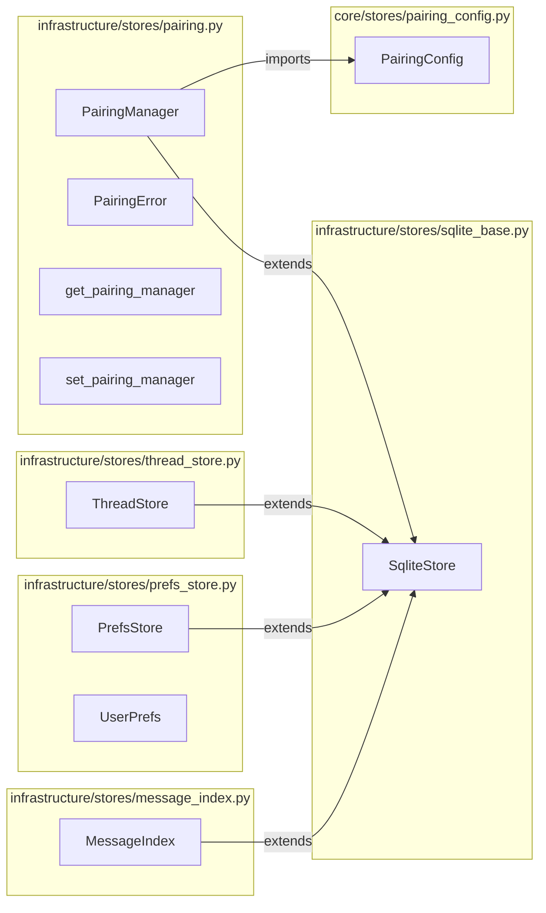

## Summary

Move 4 SQLite store implementations from `core/stores/` to `infrastructure/stores/`, update all 18 import sites, and clean 6 transitional ignore entries from `.importlinter`. Pure mechanical refactor with no behavioral changes.

## Architecture

### Data Flow

### File × Function Map

## Agents

| Agent | Task count | Files |
|-------|-----------|-------|
| backend-dev | 7 | message_index.py, prefs_store.py, thread_store.py, pairing.py, __init__.py, .importlinter, 18 import sites |
| tester | 2 | RED-GATE verification (ruff + pytest + lint-imports) |

## Consistency Report

- Criteria covered: 9/9
- Uncovered criteria: none
- Tasks without spec backing: none
- Gold plating exemptions applied: 0

## Micro-Tasks

### Slice V1: Move stores + update imports

#### Task 1: Move 4 store files from core/stores/ to infrastructure/stores/ → backend-dev
- **File:** `src/lyra/core/stores/{message_index,prefs_store,thread_store,pairing}.py`
- **Snippet:** `git mv src/lyra/core/stores/message_index.py src/lyra/infrastructure/stores/`
- **Verify:** `test -f src/lyra/infrastructure/stores/message_index.py && test -f src/lyra/infrastructure/stores/prefs_store.py && test -f src/lyra/infrastructure/stores/thread_store.py && test -f src/lyra/infrastructure/stores/pairing.py` (ready)
- **Expected:** All 4 files exist in infrastructure/stores/
- **Time:** 3 min | **Difficulty:** 2
- **Traces:** SC-1, SC-2 | **Phase:** REFACTOR

#### Task 2: Fix pairing.py relative import → absolute import for pairing_config [P] → backend-dev
- **File:** `src/lyra/infrastructure/stores/pairing.py`
- **Snippet:** `from lyra.core.stores.pairing_config import (PairingConfig, ...)`
- **Verify:** `grep -q 'from lyra.core.stores.pairing_config' src/lyra/infrastructure/stores/pairing.py` (ready)
- **Expected:** Absolute import found
- **Time:** 2 min | **Difficulty:** 1
- **Traces:** SC-4 | **Phase:** REFACTOR

#### Task 3: Update infrastructure/stores/__init__.py exports [P] → backend-dev
- **File:** `src/lyra/infrastructure/stores/__init__.py`
- **Snippet:** `from lyra.infrastructure.stores.message_index import MessageIndex`
- **Verify:** `python -c "from lyra.infrastructure.stores import MessageIndex, PrefsStore, ThreadStore, PairingManager"` (deferred)
- **Expected:** No ImportError
- **Time:** 3 min | **Difficulty:** 2
- **Traces:** SC-5 | **Phase:** REFACTOR

#### Task 4: Update 10 import sites in src/lyra/ [P] → backend-dev
- **File:** `src/lyra/bootstrap/*.py`, `src/lyra/adapters/discord/*.py`, `src/lyra/commands/pairing/handlers.py`
- **Snippet:** `from lyra.infrastructure.stores.message_index import MessageIndex` (etc.)
- **Verify:** `grep -rn 'from lyra.core.stores.message_index\|from lyra.core.stores.prefs_store\|from lyra.core.stores.thread_store\|from lyra.core.stores.pairing' src/lyra/ | wc -l` (ready)
- **Expected:** 0
- **Time:** 5 min | **Difficulty:** 2
- **Traces:** SC-3 | **Phase:** REFACTOR

#### Task 5: Update 8 import sites in tests/ [P] → backend-dev
- **File:** `tests/core/conftest.py`, `tests/core/test_pairing_*.py`, `tests/core/test_prefs_*.py`, `tests/core/test_message_index.py`, `tests/core/test_submit_middleware_context.py`
- **Snippet:** `from lyra.infrastructure.stores.pairing import PairingManager` (etc.)
- **Verify:** `grep -rn 'from lyra.core.stores.message_index\|from lyra.core.stores.prefs_store\|from lyra.core.stores.thread_store\|from lyra.core.stores.pairing' tests/ | wc -l` (ready)
- **Expected:** 0
- **Time:** 5 min | **Difficulty:** 2
- **Traces:** SC-3 | **Phase:** REFACTOR

#### Task 6: Verify CLAUDE.md pairing_config.py note still accurate [P] → backend-dev
- **File:** `src/lyra/core/CLAUDE.md`
- **Snippet:** Line 59: `**pairing_config.py** is a sibling dataclass with no DB logic — it is not a store.`
- **Verify:** `grep -q 'pairing_config.py' src/lyra/core/CLAUDE.md` (ready)
- **Expected:** Note still present and accurate (pairing_config.py stays in core/stores/)
- **Time:** 2 min | **Difficulty:** 1
- **Traces:** SC-1 | **Phase:** REFACTOR

#### RED-GATE: RED complete V1 → tester
- **Verify:** `uv run ruff check . && uv run pytest`
- **Expected:** All checks pass, all tests green
- **Phase:** RED-GATE

### Slice V2: Clean import-linter config

#### Task 8: Remove 6 Direction-1 ignore entries from .importlinter → backend-dev
- **File:** `.importlinter`
- **Snippet:** Remove lines 18–23 (core.stores.pairing/message_index/thread_store/prefs_store → infrastructure)
- **Verify:** `grep -c 'core.stores.pairing\|core.stores.message_index\|core.stores.thread_store\|core.stores.prefs_store' .importlinter` (ready)
- **Expected:** 0
- **Time:** 3 min | **Difficulty:** 1
- **Traces:** SC-6 | **Phase:** REFACTOR

#### RED-GATE: RED complete V2 → tester
- **Verify:** `uv run lint-imports`
- **Expected:** Zero layer violations, exit code 0
- **Phase:** RED-GATE

## Task IDs

<!-- Generated by /plan. Used by /implement to resume tasks on session restart. -->
- T1: 10 — Move 4 store files from core/stores/ to infrastructure/stores/
- T2: 11 — Fix pairing.py relative import → absolute import for pairing_config
- T3: 12 — Update infrastructure/stores/__init__.py exports
- T4: 13 — Update 10 import sites in src/lyra/
- T5: 14 — Update 8 import sites in tests/
- T6: 15 — Verify CLAUDE.md pairing_config.py note still accurate
- T7: 16 — RED-GATE V1: ruff check + pytest
- T8: 17 — Remove 6 Direction-1 ignore entries from .importlinter
- T9: 18 — RED-GATE V2: lint-imports
