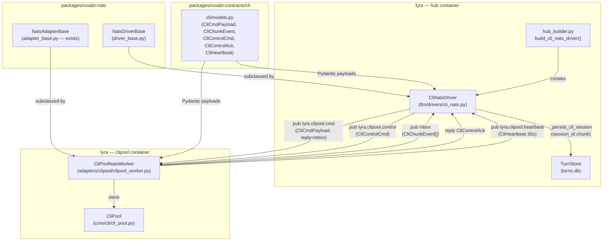
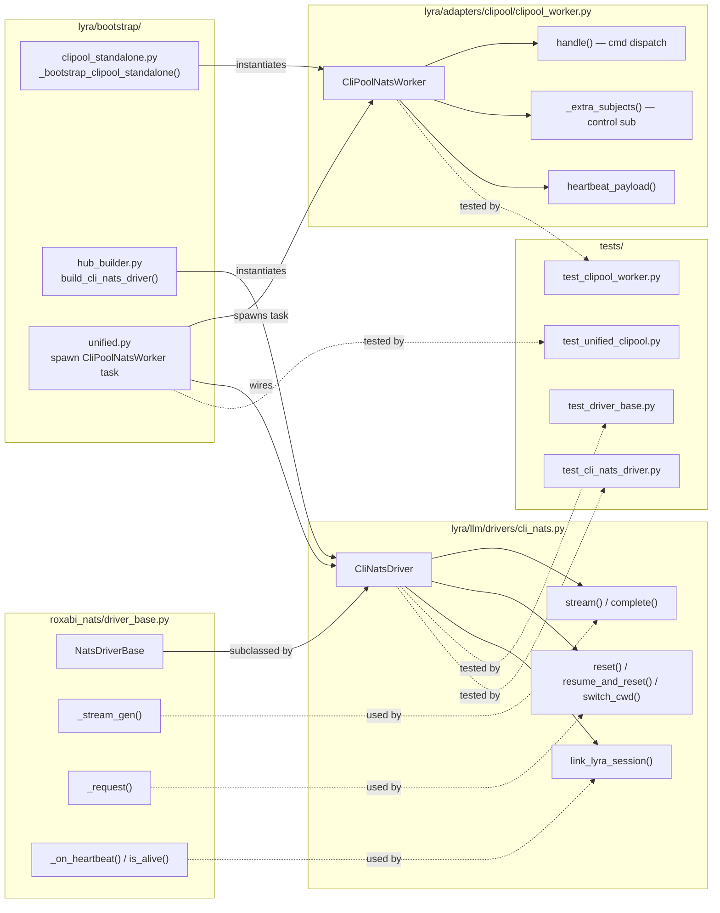

## Summary

Replace the in-process `Hub → CliPool` boundary with a NATS cmd/reply protocol,
running CliPool in a dedicated `lyra-clipool` container. The hub uses a new
`CliNatsDriver(NatsDriverBase)` — where `NatsDriverBase` is extracted into
`roxabi-nats` first — so the inbox-streaming + heartbeat + control-request pattern
becomes a reusable SDK primitive.

## Architecture

### Data Flow



### File × Function Map



## Bootstrap Context

**Shape 1 — Thin CLI worker wrapping CliPool** selected (see analysis artifact).

Key decisions carried forward:
- Flat subjects (`lyra.clipool.cmd`, `.control`, `.heartbeat`) — not per-pool-id.
  Queue group `clipool-workers` enables future multi-instance scaling with zero
  subject changes. `pool_id` routed via payload.
- Ephemeral inbox (not fixed reply subject) for streaming replies — mirrors
  `NatsLlmDriver._stream_gen()` pattern, already in `NatsDriverBase`.
- `CliPool` API frozen — `CliPoolNatsWorker` consumes it as-is.
- S1 (`roxabi-contracts`) requires its own PR before S2/S3 can land.
- New slice S0 (`NatsDriverBase` in `roxabi-nats`) prepended — both `CliNatsDriver`
  and future drivers subclass it; `NatsLlmDriver` migration is a follow-up issue.
- Naming: new NATS adapter named `CliPoolNatsWorker` (not `CliPoolWorker`) to avoid
  collision with existing `CliPoolWorkerMixin` in `core/cli/cli_pool_worker.py`.

## Agents

| Agent | Task count | Files |
|-------|-----------|-------|
| backend-dev | 13 | `roxabi_nats/driver_base.py`, `roxabi_contracts/cli/models.py`, `adapters/clipool/clipool_worker.py`, `bootstrap/standalone/clipool_standalone.py`, `llm/drivers/cli_nats.py`, `bootstrap/factory/hub_builder.py`, `bootstrap/factory/agent_factory.py`, `bootstrap/standalone/hub_standalone.py`, `bootstrap/factory/unified.py`, `llm/drivers/__init__.py`, `adapters/clipool/__init__.py`, `cli.py` |
| tester | 10 (5 RED + 5 RED-GATE) | `test_driver_base.py`, `test_cli_models.py`, `test_clipool_worker.py`, `test_cli_nats_driver.py`, `test_unified_clipool.py` |
| devops | 5 | `roxabi-nats/pyproject.toml`, `roxabi-contracts/pyproject.toml`, `lyra-clipool.container`, `clipool.env.example`, `lyra-hub.container`, `auth.conf` |
| doc-writer | 1 | `docs/architecture/container-split.md` |

## Wave Structure

7 waves, max 4 parallel agents. Elapsed ~3 weeks vs ~10 sequential.

| Wave | Trigger | Agents | Tasks |
|------|---------|--------|-------|
| 1 | start | 4 ∥ | tester-A: T1 · backend-A: T2 · tester-B: T5 · backend-B: T6 |
| 2 | Wave 1 done | 2 ∥ | devops: T3+T7 (version bumps) · tester: T4+T8 (RED-GATEs V0+V1) |
| 3 | RED-GATEs V0+V1 | 4 ∥ | tester-A: T9 · backend-A: T10 · tester-B: T14 · backend-B: T15 |
| 4 | Wave 3 done | 4 ∥ | backend-A: T11→T12 · backend-B: T16→T17+T18→T19 · devops: T24+T26 · doc-writer: T27 |
| 5 | Wave 4 done | 2 ∥ | tester: T13+T20 (RED-GATEs V2+V3) · devops: T25 |
| 6 | RED-GATEs V2+V3 | 2 ∥ | tester: T21 · backend: T22 |
| 7 | Wave 6 done | 1 | tester: T23 (RED-GATE V4) → done |

**Wave 4 detail** — two sequential chains run in parallel:
- `backend-A`: T11 `clipool_standalone` → T12 `lyra adapter clipool` in `cli.py`
- `backend-B`: T16 re-export → T17 `hub_builder` ∥ T18 `agent_factory` → T19 `hub_standalone`

**V5 infra** slots into Wave 4 alongside code — no dedicated wave.

## Consistency Report

- Criteria covered: 9/9 success criteria
- Uncovered criteria: none
- Tasks without spec backing: tasks 3, 7, 12, 16, 26, 27 (version bumps, re-export, CLI command wiring, auth conf, docs)
- Gold plating exemptions applied: 6 (all infra/build/docs)

## Micro-Tasks

### Slice V0: NatsDriverBase in roxabi-nats

#### Task 1: Write NatsDriverBase tests → tester
- **File:** `packages/roxabi-nats/tests/test_driver_base.py`
- **Snippet:** `async def test_stream_gen_yields_chunks(): ...` / `test_is_alive_threshold()` / `test_heartbeat_sub_updates_freshness()`
- **Verify:** `cd packages/roxabi-nats && uv run pytest tests/test_driver_base.py` (deferred — expected fail pre-impl)
- **Expected:** 5+ passing tests post-implementation
- **Time:** 5 min | **Difficulty:** 3
- **Traces:** U1→N1, U6→N6, N7 | **Phase:** RED

#### Task 2: Implement NatsDriverBase [P] → backend-dev
- **File:** `packages/roxabi-nats/src/roxabi_nats/driver_base.py`
- **Snippet:**
  ```python
  class NatsDriverBase:
      HB_TTL: float = 30.0
      def __init__(self, nc: NATS, *, timeout: float = 120.0) -> None: ...
      async def start(self) -> None: ...   # subscribe heartbeat_subject
      async def stop(self) -> None: ...
      async def _on_heartbeat(self, msg) -> None: ...   # updates _worker_freshness
      def _any_worker_alive(self) -> bool: ...
      def is_alive(self, worker_id: str) -> bool: ...
      async def _stream_gen(self, subject, payload_dict, *, timeout) -> AsyncIterator[dict]: ...
      async def _request(self, subject, payload_dict, *, timeout) -> dict: ...
  ```
- **Verify:** `cd packages/roxabi-nats && uv run pytest tests/test_driver_base.py` (deferred)
- **Expected:** all driver_base tests pass
- **Time:** 8 min | **Difficulty:** 3
- **Traces:** U1→N1, U2→N2, U6→N6, N7 | **Phase:** GREEN

#### Task 3: Re-export NatsDriverBase + bump roxabi-nats 0.2.0→0.3.0 → devops
- **File:** `packages/roxabi-nats/src/roxabi_nats/__init__.py`, `packages/roxabi-nats/pyproject.toml`
- **Snippet:** `from roxabi_nats.driver_base import NatsDriverBase`
- **Verify:** `grep 'NatsDriverBase' packages/roxabi-nats/src/roxabi_nats/__init__.py` (ready)
- **Expected:** `NatsDriverBase` in `__init__.py`, version bumped
- **Time:** 2 min | **Difficulty:** 1
- **Traces:** infra | **Phase:** GREEN

#### RED-GATE: RED complete V0 → tester
- **Verify:** `cd packages/roxabi-nats && uv run pytest tests/test_driver_base.py`
- **Phase:** RED-GATE

---

### Slice V1: roxabi-contracts cli/ domain

#### Task 5: Write cli models tests [P] → tester
- **File:** `packages/roxabi-contracts/tests/test_cli_models.py`
- **Snippet:** `def test_cli_cmd_payload_roundtrip(): ...` / `test_cli_chunk_event_literals()` / `test_cli_heartbeat_fields()`
- **Verify:** `cd packages/roxabi-contracts && uv run pytest tests/test_cli_models.py` (deferred)
- **Expected:** 10+ passing tests post-implementation
- **Time:** 4 min | **Difficulty:** 2
- **Traces:** U1→N1, U2→N2, U3→N3, U4→N4, U5→N5, N7 | **Phase:** RED

#### Task 6: Implement cli/models.py [P] → backend-dev
- **File:** `packages/roxabi-contracts/src/roxabi_contracts/cli/__init__.py`, `packages/roxabi-contracts/src/roxabi_contracts/cli/models.py`
- **Snippet:**
  ```python
  class CliCmdPayload(ContractEnvelope):
      pool_id: str; lyra_session_id: str; text: str
      model_cfg: dict; system_prompt: str
      resume_session_id: str | None = None; stream: bool = True

  class CliChunkEvent(ContractEnvelope):
      pool_id: str
      event_type: Literal["text","tool_use","session_id","result","error"]
      text: str | None = None; session_id: str | None = None
      is_error: bool = False; done: bool = False

  class CliControlCmd(ContractEnvelope):
      pool_id: str
      op: Literal["reset","resume_and_reset","switch_cwd"]
      session_id: str | None = None; cwd: str | None = None

  class CliControlAck(ContractEnvelope):
      pool_id: str; ok: bool; resumed: bool | None = None

  class CliHeartbeat(ContractEnvelope):
      worker_id: str; pool_count: int
  ```
- **Verify:** `cd packages/roxabi-contracts && uv run pytest tests/test_cli_models.py` (deferred)
- **Expected:** all cli_models tests pass
- **Time:** 5 min | **Difficulty:** 2
- **Traces:** U1→N1, U2→N2, U3→N3, U4→N4, U5→N5, N7 | **Phase:** GREEN

#### Task 7: Bump roxabi-contracts version → devops
- **File:** `packages/roxabi-contracts/pyproject.toml`
- **Snippet:** bump minor version
- **Verify:** `grep '^version' packages/roxabi-contracts/pyproject.toml` (ready)
- **Expected:** version incremented
- **Time:** 2 min | **Difficulty:** 1
- **Traces:** infra | **Phase:** GREEN

#### RED-GATE: RED complete V1 → tester
- **Verify:** `cd packages/roxabi-contracts && uv run pytest tests/test_cli_models.py`
- **Phase:** RED-GATE

---

### Slice V2: CliPoolNatsWorker + lyra adapter clipool

#### Task 9: Write CliPoolNatsWorker tests → tester
- **File:** `tests/adapters/test_clipool_worker.py`
- **Snippet:** `test_handle_cmd_stream_calls_pool()` / `test_handle_cmd_nonstream()` / `test_handle_control_reset()` / `test_heartbeat_payload_has_pool_count()`
- **Verify:** `uv run pytest tests/adapters/test_clipool_worker.py` (deferred)
- **Expected:** 8+ passing tests post-implementation
- **Time:** 5 min | **Difficulty:** 3
- **Traces:** U1→N1, U2→N2, U3→N3, U4→N4, U5→N5, N7 | **Phase:** RED

#### Task 10: Implement CliPoolNatsWorker → backend-dev
- **File:** `src/lyra/adapters/clipool/__init__.py`, `src/lyra/adapters/clipool/clipool_worker.py`
- **Snippet:**
  ```python
  class CliPoolNatsWorker(NatsAdapterBase):
      def __init__(self, pool: CliPool, *, timeout=30.0, ...) -> None:
          super().__init__(
              subject="lyra.clipool.cmd",
              queue_group="clipool-workers",
              envelope_name="CliCmdPayload",
              schema_version="1.0",
              heartbeat_subject="lyra.clipool.heartbeat",
              heartbeat_interval=30.0,
          )
          self._pool = pool

      def _extra_subjects(self) -> list[str]:
          return ["lyra.clipool.control"]

      async def handle(self, msg, payload: dict) -> None:
          # route cmd vs control by subject
          if msg.subject == "lyra.clipool.control":
              return await self._handle_control(msg, payload)
          await self._handle_cmd(msg, payload)

      def heartbeat_payload(self) -> dict:
          base = super().heartbeat_payload()
          base["pool_count"] = len(self._pool._entries)
          return base
  ```
- **Verify:** `uv run pytest tests/adapters/test_clipool_worker.py` (deferred)
- **Expected:** all clipool_worker tests pass
- **Time:** 10 min | **Difficulty:** 4
- **Traces:** U1→N1, U2→N2, U3→N3, U4→N4, U5→N5, N7 | **Phase:** GREEN

#### Task 11: Implement _bootstrap_clipool_standalone() → backend-dev
- **File:** `src/lyra/bootstrap/standalone/clipool_standalone.py`
- **Snippet:**
  ```python
  async def _bootstrap_clipool_standalone(raw_config: dict) -> None:
      nc = await nats_connect(os.environ["NATS_URL"])
      cli_pool = CliPool(...)
      await cli_pool.start()
      worker = CliPoolNatsWorker(cli_pool, ...)
      await worker.run(os.environ["NATS_URL"])
  ```
- **Verify:** `grep '_bootstrap_clipool_standalone' src/lyra/bootstrap/standalone/clipool_standalone.py` (ready)
- **Expected:** function exists with correct signature
- **Time:** 5 min | **Difficulty:** 3
- **Traces:** SC (startup + heartbeat within 5s) | **Phase:** GREEN

#### Task 12: Add `lyra adapter clipool` CLI command → backend-dev
- **File:** `src/lyra/cli.py`
- **Snippet:**
  ```python
  @adapter_app.command("clipool")
  def _adapter_clipool() -> None:
      """Start the standalone CliPool NATS worker."""
      from lyra.bootstrap.standalone.clipool_standalone import _bootstrap_clipool_standalone
      _boot(_bootstrap_clipool_standalone)
  ```
- **Verify:** `uv run lyra adapter --help | grep clipool` (ready)
- **Expected:** `clipool` listed in adapter subcommands
- **Time:** 2 min | **Difficulty:** 1
- **Traces:** infra | **Phase:** GREEN

#### RED-GATE: RED complete V2 → tester
- **Verify:** `uv run pytest tests/adapters/test_clipool_worker.py`
- **Phase:** RED-GATE

---

### Slice V3: CliNatsDriver + 3-process hub wiring

#### Task 14: Write CliNatsDriver tests → tester
- **File:** `tests/llm/drivers/test_cli_nats_driver.py`
- **Snippet:** `test_stream_yields_text_events()` / `test_complete_returns_llm_result()` / `test_reset_publishes_control_cmd()` / `test_is_alive_uses_freshness_threshold()` / `test_heartbeat_updates_freshness()`
- **Verify:** `uv run pytest tests/llm/drivers/test_cli_nats_driver.py` (deferred)
- **Expected:** 10+ passing tests post-implementation
- **Time:** 5 min | **Difficulty:** 3
- **Traces:** U1→N1, U2→N2, U3→N3, U4→N4, U5→N5, U6→N6, N7 | **Phase:** RED

#### Task 15: Implement CliNatsDriver → backend-dev
- **File:** `src/lyra/llm/drivers/cli_nats.py`
- **Snippet:**
  ```python
  class CliNatsDriver(NatsDriverBase):
      SUBJECT_CMD = "lyra.clipool.cmd"
      SUBJECT_CONTROL = "lyra.clipool.control"
      HB_SUBJECT = "lyra.clipool.heartbeat"
      capabilities: dict = {"streaming": True, "auth": "nats"}

      async def stream(self, pool_id, text, model_cfg, system_prompt, *, ...) -> AsyncIterator[LlmEvent]:
          payload = CliCmdPayload(pool_id=pool_id, text=text, ..., stream=True).model_dump()
          async for chunk in self._stream_gen(self.SUBJECT_CMD, payload):
              yield self._parse_chunk(chunk)

      async def reset(self, pool_id: str) -> None: ...
      async def resume_and_reset(self, pool_id: str, session_id: str) -> bool: ...
      async def switch_cwd(self, pool_id: str, cwd: Path) -> None: ...
      def is_alive(self, pool_id: str) -> bool:
          return self._nc.is_connected and self._any_worker_alive()
      def link_lyra_session(self, pool_id: str, lyra_session_id: str) -> None: ...
  ```
- **Verify:** `uv run pytest tests/llm/drivers/test_cli_nats_driver.py` (deferred)
- **Expected:** all cli_nats_driver tests pass
- **Time:** 10 min | **Difficulty:** 4
- **Traces:** U1→N1, U2→N2, U3→N3, U4→N4, U5→N5, U6→N6, SC (session_id, hub restart, worker failure) | **Phase:** GREEN

#### Task 16: Re-export CliNatsDriver from llm/drivers/__init__.py → backend-dev
- **File:** `src/lyra/llm/drivers/__init__.py`
- **Snippet:** `from lyra.llm.drivers.cli_nats import CliNatsDriver`
- **Verify:** `grep 'CliNatsDriver' src/lyra/llm/drivers/__init__.py` (ready)
- **Expected:** symbol accessible from package
- **Time:** 1 min | **Difficulty:** 1
- **Traces:** infra | **Phase:** GREEN

#### Task 17: Add build_cli_nats_driver() to hub_builder.py → backend-dev
- **File:** `src/lyra/bootstrap/factory/hub_builder.py`
- **Snippet:**
  ```python
  async def build_cli_nats_driver(nc: NATS, *, timeout: float = 120.0) -> CliNatsDriver:
      driver = CliNatsDriver(nc, timeout=timeout)
      await driver.start()  # subscribe heartbeat
      return driver
  ```
- **Verify:** `grep 'build_cli_nats_driver' src/lyra/bootstrap/factory/hub_builder.py` (ready)
- **Expected:** function present, `build_cli_pool` kept but deprecated-commented
- **Time:** 5 min | **Difficulty:** 2
- **Traces:** SC (startup, hub wiring) | **Phase:** GREEN

#### Task 18: Update agent_factory.py — CliNatsDriver path for claude-cli → backend-dev
- **File:** `src/lyra/bootstrap/factory/agent_factory.py`
- **Snippet:**
  ```python
  # In _build_shared_base_providers:
  if cli_nats_driver is not None:
      providers["claude-cli"] = CircuitBreakerDecorator(cli_nats_driver, cli_cb)
  elif cli_pool is not None:
      providers["claude-cli"] = CircuitBreakerDecorator(ClaudeCliDriver(cli_pool), cli_cb)
  ```
- **Verify:** `uv run pyright src/lyra/bootstrap/factory/agent_factory.py` (ready)
- **Expected:** no type errors; CliNatsDriver accepted as claude-cli provider
- **Time:** 5 min | **Difficulty:** 3
- **Traces:** SC (hub restart, session resume via CliNatsDriver) | **Phase:** GREEN

#### Task 19: Wire CliNatsDriver in hub_standalone.py → backend-dev
- **File:** `src/lyra/bootstrap/standalone/hub_standalone.py`
- **Snippet:**
  ```python
  cli_nats_driver = await build_cli_nats_driver(nc)
  # pass cli_nats_driver to register_agents; remove build_cli_pool() call
  ```
- **Verify:** `grep 'build_cli_nats_driver' src/lyra/bootstrap/standalone/hub_standalone.py` (ready)
- **Expected:** hub standalone no longer instantiates CliPool
- **Time:** 5 min | **Difficulty:** 3
- **Traces:** SC (3-process mode end-to-end) | **Phase:** GREEN

#### RED-GATE: RED complete V3 → tester
- **Verify:** `uv run pytest tests/llm/drivers/test_cli_nats_driver.py`
- **Phase:** RED-GATE

---

### Slice V4: Unified mode (lyra start asyncio task)

#### Task 21: Write unified mode test → tester
- **File:** `tests/bootstrap/test_unified_clipool.py`
- **Snippet:** `test_unified_spawns_clipool_worker_task()` / `test_unified_no_direct_cli_pool_instantiation()`
- **Verify:** `uv run pytest tests/bootstrap/test_unified_clipool.py` (deferred)
- **Expected:** 4+ passing tests post-implementation
- **Time:** 5 min | **Difficulty:** 3
- **Traces:** SC (unified mode full turn, no direct CliPool in bootstrap) | **Phase:** RED

#### Task 22: Update unified.py — spawn CliPoolNatsWorker + wire CliNatsDriver → backend-dev
- **File:** `src/lyra/bootstrap/factory/unified.py`
- **Snippet:**
  ```python
  cli_nats_driver = await build_cli_nats_driver(nc)
  # Start CliPoolNatsWorker as asyncio background task
  cli_pool = CliPool(...)
  await cli_pool.start()
  worker = CliPoolNatsWorker(cli_pool, ...)
  worker_task = asyncio.create_task(worker.run_embedded(nc))
  # Remove: cli_pool = await build_cli_pool(...)
  # hub.cli_pool = None  (CliNatsDriver owns control ops)
  ```
- **Verify:** `uv run pytest tests/bootstrap/test_unified_clipool.py` (deferred)
- **Expected:** unified tests pass; no `CliPool(` in unified.py
- **Time:** 8 min | **Difficulty:** 4
- **Traces:** SC (unified mode, no direct CliPool in bootstrap/factory/unified.py) | **Phase:** GREEN

#### RED-GATE: RED complete V4 → tester
- **Verify:** `uv run pytest tests/bootstrap/test_unified_clipool.py`
- **Phase:** RED-GATE

---

### Slice V5: Container infra

#### Task 24: Create lyra-clipool.container + clipool.env.example [P] → devops
- **File:** `deploy/quadlet/lyra-clipool.container`, `deploy/quadlet/clipool.env.example`
- **Snippet:**
  ```ini
  [Unit]
  Description=Lyra CliPool Worker
  After=lyra-nats.service
  # No Requires= — clipool connects directly to NATS; hub restarts must not cascade

  [Container]
  Image=ghcr.io/roxabi/lyra:staging
  ContainerName=lyra-clipool
  Network=roxabi.network
  NoNewPrivileges=true
  ReadOnly=true
  DropCapability=all
  UserNS=keep-id:uid=1500,gid=1500
  EnvironmentFile=%h/.lyra/env/clipool.env
  Environment=NATS_URL=nats://lyra-nats:4222
  Secret=lyra-nkey-clipool-worker,type=mount,target=clipool-worker.seed,mode=0400,uid=1500,gid=1500
  Environment=NATS_NKEY_SEED_PATH=/run/secrets/clipool-worker.seed
  # All 8 ~/.claude/ mounts (moved from lyra-hub.container)
  Volume=%h/.claude/.credentials.json:/home/lyra/.claude/.credentials.json:z
  Volume=%h/.claude/settings.json:/home/lyra/.claude/settings.json:ro,z
  Volume=%h/.claude/settings.local.json:/home/lyra/.claude/settings.local.json:ro,z
  Volume=%h/.claude/CLAUDE.md:/home/lyra/.claude/CLAUDE.md:ro,z
  Volume=%h/.claude/projects:/home/lyra/.claude/projects:z
  Volume=%h/.claude/plugins:/home/lyra/.claude/plugins:ro,z
  Volume=%h/.claude/skills:/home/lyra/.claude/skills:ro,z
  Volume=%h/.claude/shared:/home/lyra/.claude/shared:ro,z
  Volume=%h/projects:/home/lyra/projects:z
  Environment=LYRA_CLAUDE_CWD=/home/lyra/projects
  # NOT mounting lyra-data.volume — clipool has no business with ~/.lyra/
  Exec=lyra adapter clipool

  [Service]
  Restart=on-failure
  RestartSec=5
  CPUQuota=400%
  ```
- **Verify:** `test -f deploy/quadlet/lyra-clipool.container` (ready)
- **Expected:** file exists with all 8 Volume= lines, no lyra-data.volume mount
- **Time:** 5 min | **Difficulty:** 2
- **Traces:** SC (container infra, volume exclusion, CPUQuota) | **Phase:** GREEN

#### Task 25: Remove ~/.claude/ Volume= from lyra-hub.container → devops
- **File:** `deploy/quadlet/lyra-hub.container`
- **Snippet:** Remove 8 Volume= lines for `.credentials.json`, `settings.json`, `settings.local.json`, `CLAUDE.md`, `projects`, `plugins`, `skills`, `shared`; remove `LYRA_CLAUDE_CWD` and `projects` volume; add comment noting they moved to `lyra-clipool.container`
- **Verify:** `grep -c 'claude' deploy/quadlet/lyra-hub.container` (ready)
- **Expected:** 0 lines matching `.claude` Volume= or LYRA_CLAUDE_CWD
- **Time:** 3 min | **Difficulty:** 2
- **Traces:** SC (lyra-hub.container has zero ~/.claude/ Volume= lines) | **Phase:** GREEN

#### Task 26: Add clipool-worker nkey ACL to auth.conf [P] → devops
- **File:** `deploy/nats/auth.conf`
- **Snippet:**
  ```
  {
    nkey: "UDUMMYCLIPOOLWORKER"
    # clipool-worker
    permissions: {
      publish:   { allow: ["lyra.clipool.heartbeat"] }
      subscribe: { allow: ["lyra.clipool.cmd", "lyra.clipool.control", "_INBOX.>"] }
      allow_responses: true
    }
  }
  ```
  Also update hub permissions to allow `pub lyra.clipool.cmd`, `lyra.clipool.control`; sub `lyra.clipool.heartbeat`, `_INBOX.>`.
- **Verify:** `grep 'UDUMMYCLIPOOLWORKER' deploy/nats/auth.conf` (ready)
- **Expected:** clipool-worker block present; hub block updated
- **Time:** 5 min | **Difficulty:** 2
- **Traces:** infra (nkey provisioning) | **Phase:** GREEN

#### Task 27: Update container-split.md NATS Topics table [P] → doc-writer
- **File:** `docs/architecture/container-split.md`
- **Snippet:** Replace per-pool-id subjects with flat subjects; add ephemeral inbox note; add clipool-worker to container topology table
- **Verify:** `grep 'lyra.clipool.cmd' docs/architecture/container-split.md` (ready)
- **Expected:** flat subjects documented; ephemeral inbox semantics noted; queue group `clipool-workers` documented
- **Time:** 4 min | **Difficulty:** 2
- **Traces:** docs | **Phase:** GREEN

## Task IDs

<!-- Generated by /plan. Used by /implement to resume tasks on session restart. -->
- T1: 13 — Write NatsDriverBase tests
- T2: 14 — Implement NatsDriverBase
- T3: 15 — Re-export NatsDriverBase + bump roxabi-nats 0.2.0→0.3.0
- T4: 16 — RED-GATE V0: NatsDriverBase tests pass
- T5: 17 — Write cli models tests (roxabi-contracts)
- T6: 18 — Implement roxabi_contracts/cli/models.py (5 Pydantic models)
- T7: 19 — Bump roxabi-contracts version
- T8: 20 — RED-GATE V1: cli models tests pass
- T9: 21 — Write CliPoolNatsWorker tests
- T10: 22 — Implement CliPoolNatsWorker (NatsAdapterBase subclass)
- T11: 23 — Implement _bootstrap_clipool_standalone()
- T12: 24 — Add `lyra adapter clipool` CLI command
- T13: 25 — RED-GATE V2: CliPoolNatsWorker tests pass
- T14: 26 — Write CliNatsDriver tests
- T15: 27 — Implement CliNatsDriver (NatsDriverBase subclass)
- T16: 28 — Re-export CliNatsDriver from llm/drivers/__init__.py
- T17: 29 — Add build_cli_nats_driver() to hub_builder.py
- T18: 30 — Update agent_factory.py — CliNatsDriver path for claude-cli backend
- T19: 31 — Wire CliNatsDriver in hub_standalone.py
- T20: 32 — RED-GATE V3: CliNatsDriver tests pass
- T21: 33 — Write unified mode CliPoolNatsWorker test
- T22: 34 — Update unified.py — spawn CliPoolNatsWorker task + wire CliNatsDriver
- T23: 35 — RED-GATE V4: unified clipool tests pass
- T24: 36 — Create lyra-clipool.container + clipool.env.example
- T25: 37 — Remove ~/.claude/ Volume= lines from lyra-hub.container
- T26: 38 — Add clipool-worker nkey ACL to auth.conf + update hub permissions
- T27: 39 — Update container-split.md NATS Topics table
