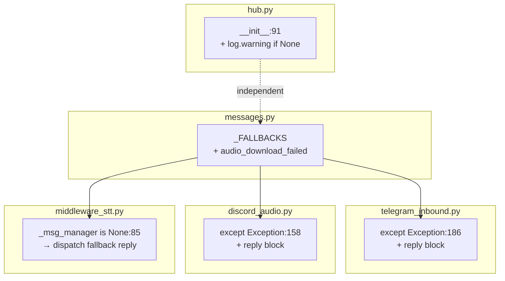
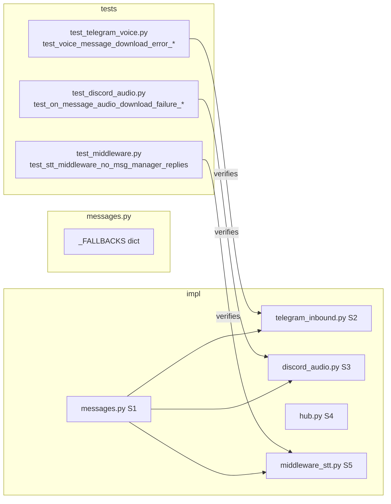

## Summary

Patch 3 silent-failure callsites (Telegram download, Discord download, STT middleware) plus a Hub init warning. All changes mirror the existing `audio_too_large` reply pattern exactly. Tests are inverted first (RED), then implementation makes them green.

## Architecture

## Agents

| Agent | Tasks | Files |
|---|---|---|
| tester | T1–T4 (RED + GREEN verify) | `tests/adapters/test_telegram_voice.py`, `tests/adapters/test_discord_audio.py`, `tests/core/test_middleware.py` |
| backend-dev | T5–T8 (implementation) | `src/lyra/core/messaging/messages.py`, `src/lyra/adapters/telegram/telegram_inbound.py`, `src/lyra/adapters/discord/discord_audio.py`, `src/lyra/core/hub/hub.py`, `src/lyra/core/hub/middleware/middleware_stt.py` |

## Reference Patterns

- `src/lyra/adapters/telegram/telegram_inbound.py:170–185` — `audio_too_large` block (mirror exactly for S2)
- `src/lyra/adapters/discord/discord_audio.py:142–154` — `audio_too_large` block (mirror exactly for S3)
- `tests/adapters/test_telegram_voice.py:146–158` — `test_voice_message_too_large_sends_reply` (test pattern for RED-1)
- `tests/adapters/test_discord_audio.py:215–235` — `test_on_message_audio_too_large_sends_reply` (test pattern for RED-2)

## Consistency Report

Spec criteria covered: 9/9
- SC-1 `audio_download_failed` in `_FALLBACKS` → T5 (S1)
- SC-2 Telegram reply on Exception → T1 (RED), T6 (GREEN)
- SC-3 Discord reply on Exception → T2 (RED), T7 (GREEN)
- SC-4 `audio_too_large`/`audio_invalid_format` unchanged → T8 (full suite)
- SC-5 Inner-except `log.warning` on reply failure → T6/T7 (impl mirrors pattern)
- SC-6 STT middleware `_msg_manager=None` dispatches reply → T3 (RED), T7 impl
- SC-7 Hub `log.warning` when `msg_manager=None` → T5 (S4)
- SC-8 STT middleware tests unchanged → T8 (full suite)
- SC-9 ruff + pyright pass → T8

## Micro-Tasks

### V1 — RED Phase (write failing tests first)

**T1** [RED] [P] Invert Telegram download-failure test
- File: `tests/adapters/test_telegram_voice.py`
- Change: `test_voice_message_download_error_returns_silently` — rename to `test_voice_message_download_error_sends_reply`, remove `send_message.assert_not_called()`, add `adapter.bot.send_message.assert_called_once()`
- Verify: `uv run pytest tests/adapters/test_telegram_voice.py::test_voice_message_download_error_sends_reply -x 2>&1 | grep -E "FAILED|PASSED"`
- Expected: `FAILED` (implementation not yet done)
- Agent: tester | Spec trace: SC-2 | Difficulty: 1 | Parallel: Y

**T2** [RED] [P] Invert Discord download-failure test
- File: `tests/adapters/test_discord_audio.py`
- Change: `test_on_message_audio_download_failure_returns_cleanly` — rename to `test_on_message_audio_download_failure_sends_reply`, remove `msg.reply.assert_not_called()`, add `msg.reply.assert_called_once()`
- Verify: `uv run pytest tests/adapters/test_discord_audio.py::test_on_message_audio_download_failure_sends_reply -x 2>&1 | grep -E "FAILED|PASSED"`
- Expected: `FAILED`
- Agent: tester | Spec trace: SC-3 | Difficulty: 1 | Parallel: Y

**T3** [RED] [P] Add STT middleware no-manager reply test
- File: `tests/core/test_middleware.py`
- Add: `test_stt_middleware_no_msg_manager_replies` — construct `SttMiddleware`, pass `Hub(msg_manager=None)` in ctx, send voice message, assert `dispatch_response` called (mock it), assert NOT `_DROP` returned
- Verify: `uv run pytest tests/core/test_middleware.py -k "no_msg_manager" -x 2>&1 | grep -E "FAILED|PASSED"`
- Expected: `FAILED`
- Agent: tester | Spec trace: SC-6 | Difficulty: 2 | Parallel: Y

---
🔴 RED-GATE — verify T1/T2/T3 all FAIL before proceeding:
`uv run pytest tests/adapters/test_telegram_voice.py::test_voice_message_download_error_sends_reply tests/adapters/test_discord_audio.py::test_on_message_audio_download_failure_sends_reply tests/core/test_middleware.py -k "no_msg_manager" 2>&1 | grep -E "FAILED|passed|error"`
---

### V2 — GREEN Phase (implementation)

**T5** [GREEN] Add `audio_download_failed` fallback key
- File: `src/lyra/core/messaging/messages.py`
- Add to `_FALLBACKS` after `"stt_failed"`: `"audio_download_failed": "Couldn't retrieve your audio file. Please try again.",`
- Verify: `uv run python -c "from lyra.core.messaging.messages import _FALLBACKS; assert 'audio_download_failed' in _FALLBACKS; print('OK')"`
- Expected: `OK`
- Agent: backend-dev | Spec trace: SC-1 | Difficulty: 1 | Parallel: N (blocks T6/T7/T8)

**T6** [GREEN] [P] Fix Telegram download silent failure
- File: `src/lyra/adapters/telegram/telegram_inbound.py`
- At line 186, after `log.exception(...)`, add reply block mirroring lines 172–184 (`audio_too_large` pattern) with key `"audio_download_failed"` and fallback `"Couldn't retrieve your audio file. Please try again."`
- Verify: `uv run pytest tests/adapters/test_telegram_voice.py::test_voice_message_download_error_sends_reply -x`
- Expected: `1 passed`
- Agent: backend-dev | Spec trace: SC-2 | Difficulty: 2 | Parallel: Y (with T7/T8/T9)

**T7** [GREEN] [P] Fix Discord download silent failure
- File: `src/lyra/adapters/discord/discord_audio.py`
- At line 158, after `log.exception(...)`, add reply block mirroring lines 142–153 (`audio_too_large` pattern) with key `"audio_download_failed"` and fallback `"Couldn't retrieve your audio file. Please try again."`
- Verify: `uv run pytest tests/adapters/test_discord_audio.py::test_on_message_audio_download_failure_sends_reply -x`
- Expected: `1 passed`
- Agent: backend-dev | Spec trace: SC-3 | Difficulty: 2 | Parallel: Y

**T8** [GREEN] [P] Fix STT middleware silent drop when `_msg_manager is None`
- File: `src/lyra/core/hub/middleware/middleware_stt.py`
- Replace lines 85–86 (`if hub._msg_manager is None: return _DROP`) with: import `_FALLBACKS` from `lyra.core.messaging.messages`, then dispatch a reply using `Response(content=_FALLBACKS.get("audio_download_failed", "Voice messages are not available."))` via `hub.dispatch_response(...)`, then `return _DROP`
- Verify: `uv run pytest tests/core/test_middleware.py -k "no_msg_manager" -x`
- Expected: `1 passed`
- Agent: backend-dev | Spec trace: SC-6 | Difficulty: 2 | Parallel: Y

**T9** [GREEN] [P] Add Hub init warning when `msg_manager is None`
- File: `src/lyra/core/hub/hub.py`
- After `self._msg_manager: MessageManager | None = msg_manager` (line 91), add: `if msg_manager is None: log.warning("Hub initialised without a MessageManager — STT error replies will use hardcoded fallbacks")`
- Verify: `uv run python -c "import logging, lyra.core.hub.hub"`
- Expected: no import error
- Agent: backend-dev | Spec trace: SC-7 | Difficulty: 1 | Parallel: Y

### V3 — Full Suite Verify

**T10** [REFACTOR] Full test suite + quality gates
- Files: all
- Verify: `uv run pytest tests/ -x && uv run ruff check . && uv run pyright`
- Expected: all green, no new type errors
- Agent: backend-dev | Spec trace: SC-4, SC-8, SC-9 | Difficulty: 1 | Parallel: N

## Task IDs

<!-- Generated by /plan. Used by /implement to resume tasks on session restart. -->
- T1: 10 — T1 [RED] Invert Telegram download-failure test
- T2: 11 — T2 [RED] Invert Discord download-failure test
- T3: 12 — T3 [RED] Add STT middleware no-manager reply test
- T4: 13 — RED-GATE verify T1/T2/T3 all FAIL
- T5: 14 — T5 [GREEN] Add audio_download_failed fallback key
- T6: 15 — T6 [GREEN] Fix Telegram download silent failure
- T7: 16 — T7 [GREEN] Fix Discord download silent failure
- T8: 17 — T8 [GREEN] Fix STT middleware silent drop when _msg_manager is None
- T9: 18 — T9 [GREEN] Add Hub init warning when msg_manager is None
- T10: 19 — T10 [REFACTOR] Full test suite + quality gates
