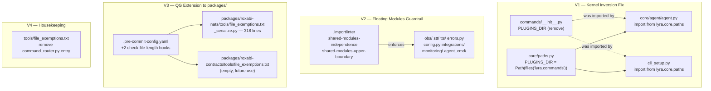
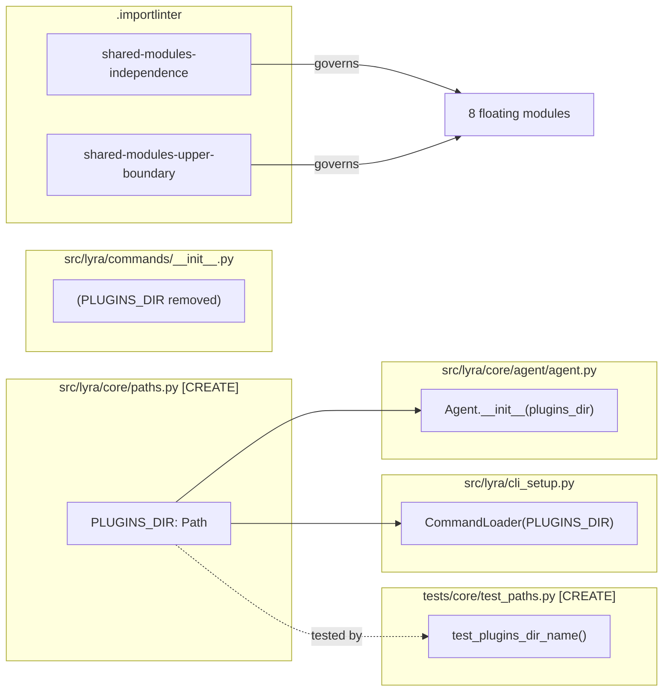

## Summary

Four surgical fixes to Lyra's hexagonal architecture: move `PLUGINS_DIR` into `lyra.core.paths` (kernel inversion), add two importlinter contracts for 8 floating modules (peer isolation + upper-boundary), extend quality gates to `packages/` roots, and remove a stale exemption entry. No runtime behavior changes, no file moves.

## Architecture

### Data Flow



### File × Function Map



## Bootstrap Context

Shape 3 selected from analysis: surgical fixes + importlinter closed-namespace guardrail. No file moves, no namespace restructure. The circular dep in `roxabi-contracts/testing.py` (violation 2 in analysis) is out of scope — accepted as-is per shape decision. The 23 `core→infrastructure` exemptions (violation 5) are blocked on #935.

## Agents

| Agent | Task count | Files |
|-------|-----------|-------|
| backend-dev | 4 | `src/lyra/core/paths.py`, `src/lyra/cli_setup.py`, `src/lyra/core/agent/agent.py`, `src/lyra/commands/__init__.py` |
| tester (V1) | 1 | `tests/core/test_paths.py` |
| devops #1 | 2 | `.importlinter` |
| devops #2 | 3 | `.pre-commit-config.yaml`, `packages/roxabi-nats/tools/file_exemptions.txt`, `packages/roxabi-contracts/tools/file_exemptions.txt` |
| devops #3 | 1 | `tools/file_exemptions.txt` |
| tester (post-all) | 1 | (verification run — no file output) |

## Consistency Report

- Criteria covered: 8/8
- Uncovered criteria: none
- Tasks without spec backing: none
- Gold plating exemptions applied: 0

## Micro-Tasks

### Slice V1: Kernel Inversion Fix

#### Task 1: Write RED test for PLUGINS_DIR path resolution [P] → tester
- **File:** `tests/core/test_paths.py`
- **Snippet:** `from lyra.core.paths import PLUGINS_DIR; def test_plugins_dir_name(): assert PLUGINS_DIR.name == "commands"`
- **Verify:** `uv run pytest tests/core/test_paths.py -x` (deferred — module doesn't exist yet)
- **Expected:** Import error until T2 complete, then green
- **Time:** 2 min
- **Difficulty:** 1
- **Traces:** SC-3
- **Phase:** RED

#### Task 2: Create src/lyra/core/paths.py with PLUGINS_DIR → backend-dev
- **File:** `src/lyra/core/paths.py`
- **Snippet:** `from importlib.resources import files; from pathlib import Path; PLUGINS_DIR: Path = Path(str(files("lyra.commands")))`
- **Verify:** `python -c "from lyra.core.paths import PLUGINS_DIR; assert PLUGINS_DIR.name == 'commands'"` (ready)
- **Expected:** exits 0
- **Time:** 3 min
- **Difficulty:** 1
- **Traces:** SC-3
- **Phase:** GREEN

#### Task 3: Swap import in cli_setup.py [P] → backend-dev
- **File:** `src/lyra/cli_setup.py`
- **Snippet:** `from lyra.core.paths import PLUGINS_DIR` (replaces `from lyra.commands import PLUGINS_DIR`)
- **Verify:** `grep "from lyra.commands import PLUGINS_DIR" src/lyra/cli_setup.py` (ready)
- **Expected:** no output (match gone)
- **Time:** 2 min
- **Difficulty:** 1
- **Traces:** SC-2, SC-3
- **Phase:** GREEN

#### Task 4: Swap import in core/agent/agent.py [P] → backend-dev
- **File:** `src/lyra/core/agent/agent.py`
- **Snippet:** `from lyra.core.paths import PLUGINS_DIR` (replaces `from lyra.commands import PLUGINS_DIR`)
- **Verify:** `grep "from lyra.commands import PLUGINS_DIR" src/lyra/core/agent/agent.py` (ready)
- **Expected:** no output
- **Time:** 2 min
- **Difficulty:** 1
- **Traces:** SC-2, SC-3
- **Phase:** GREEN

#### Task 5: Strip PLUGINS_DIR export from commands/__init__.py → backend-dev
- **File:** `src/lyra/commands/__init__.py`
- **Snippet:** file becomes empty or `# lyra.commands plugin directory` (remove `files` import + `PLUGINS_DIR` + `__all__`)
- **Verify:** `grep "PLUGINS_DIR" src/lyra/commands/__init__.py` (ready)
- **Expected:** no output
- **Time:** 2 min
- **Difficulty:** 1
- **Traces:** SC-2
- **Phase:** GREEN

#### RED-GATE V1 → tester
- **Verify:** `grep -r "from lyra.commands" src/lyra/core/ && uv run lint-imports`
- **Expected:** grep → 0 matches; lint-imports → exit 0
- **Phase:** RED-GATE

---

### Slice V2: Floating Modules Guardrail

#### Task 6: Add shared-modules-independence contract [P] → devops #1
- **File:** `.importlinter`
- **Snippet:**
  ```
  [importlinter:contract:shared-modules-independence]
  name = Shared floating modules must not import each other (peer isolation)
  type = independence
  modules =
      lyra.obs
      lyra.stt
      lyra.tts
      lyra.errors
      lyra.config
      lyra.integrations
      lyra.monitoring
      lyra.agent_cmd
  ```
- **Verify:** `uv run lint-imports` (deferred — run after both contracts added)
- **Expected:** exits 0
- **Time:** 3 min
- **Difficulty:** 2
- **Traces:** SC-4
- **Phase:** GREEN

#### Task 7: Add shared-modules-upper-boundary contract [P] → devops #1
- **File:** `.importlinter`
- **Snippet:**
  ```
  [importlinter:contract:shared-modules-upper-boundary]
  name = Shared floating modules must not import bootstrap, adapters, or infrastructure
  type = forbidden
  source_modules =
      lyra.obs
      lyra.stt
      lyra.tts
      lyra.errors
      lyra.config
      lyra.integrations
      lyra.monitoring
      lyra.agent_cmd
  forbidden_modules =
      lyra.bootstrap
      lyra.adapters
      lyra.infrastructure
  allow_indirect_imports = true
  ```
- **Verify:** `uv run lint-imports` (deferred)
- **Expected:** exits 0
- **Time:** 3 min
- **Difficulty:** 2
- **Traces:** SC-5
- **Phase:** GREEN

#### RED-GATE V2 → devops #1
- **Verify:** `uv run lint-imports`
- **Expected:** exit 0, no new `ignore_imports` entries needed
- **Phase:** RED-GATE

---

### Slice V3: Quality Gate Extension to packages/

#### Task 8: Add check-file-length hooks for packages/ in .pre-commit-config.yaml [P] → devops #2
- **File:** `.pre-commit-config.yaml`
- **Snippet:**
  ```yaml
  - id: check-file-length-roxabi-nats
    name: check-file-length (roxabi-nats)
    entry: bash -c "QG_FILE_ROOT=packages/roxabi-nats/src/ QG_FILE_EXEMPTIONS=packages/roxabi-nats/tools/file_exemptions.txt tools/check_file_length.sh"
    language: system
    pass_filenames: false
  - id: check-file-length-roxabi-contracts
    name: check-file-length (roxabi-contracts)
    entry: bash -c "QG_FILE_ROOT=packages/roxabi-contracts/src/ QG_FILE_EXEMPTIONS=packages/roxabi-contracts/tools/file_exemptions.txt tools/check_file_length.sh"
    language: system
    pass_filenames: false
  ```
- **Verify:** `grep "check-file-length-roxabi-nats" .pre-commit-config.yaml` (ready)
- **Expected:** match found
- **Time:** 4 min
- **Difficulty:** 2
- **Traces:** SC-6, SC-7
- **Phase:** GREEN

#### Task 9: Create packages/roxabi-nats/tools/file_exemptions.txt with _serialize.py [P] → devops #2
- **File:** `packages/roxabi-nats/tools/file_exemptions.txt`
- **Snippet:**
  ```
  # File size exemptions (≤300 lines per file)
  # Each entry must have a tracking issue.
  # Format: <path>  # <lines> lines — <issue> <description>
  packages/roxabi-nats/src/roxabi_nats/_serialize.py  # 318 lines — #977 needs split, tracked for follow-up
  ```
- **Verify:** `QG_FILE_ROOT=packages/roxabi-nats/src/ QG_FILE_EXEMPTIONS=packages/roxabi-nats/tools/file_exemptions.txt bash tools/check_file_length.sh` (ready)
- **Expected:** exit 0
- **Time:** 3 min
- **Difficulty:** 1
- **Traces:** SC-6
- **Phase:** GREEN

#### Task 10: Create packages/roxabi-contracts/tools/file_exemptions.txt [P] → devops #2
- **File:** `packages/roxabi-contracts/tools/file_exemptions.txt`
- **Snippet:**
  ```
  # File size exemptions (≤300 lines per file)
  # Each entry must have a tracking issue.
  # Format: <path>  # <lines> lines — <issue> <description>
  ```
- **Verify:** `ls packages/roxabi-contracts/tools/file_exemptions.txt` (ready)
- **Expected:** file exists
- **Time:** 2 min
- **Difficulty:** 1
- **Traces:** SC-7
- **Phase:** GREEN

#### RED-GATE V3 → devops #2
- **Verify:** `QG_FILE_ROOT=packages/roxabi-nats/src/ QG_FILE_EXEMPTIONS=packages/roxabi-nats/tools/file_exemptions.txt bash tools/check_file_length.sh`
- **Expected:** exit 0 (exemption applied)
- **Phase:** RED-GATE

---

### Slice V4: Housekeeping

#### Task 11: Remove command_router.py entry from tools/file_exemptions.txt → devops #3
- **File:** `tools/file_exemptions.txt`
- **Snippet:** Remove line: `src/lyra/core/commands/command_router.py  # 303 lines — #858 backward-compat param overrides`
- **Verify:** `grep "command_router" tools/file_exemptions.txt` (ready)
- **Expected:** no output
- **Time:** 2 min
- **Difficulty:** 1
- **Traces:** SC-8
- **Phase:** GREEN

#### RED-GATE V4 → devops #3
- **Verify:** `bash tools/check_file_length.sh`
- **Expected:** exit 0
- **Phase:** RED-GATE

---

### Post-all: Verification

#### Task 12: Full test suite + lint-imports green → tester
- **File:** (no file output)
- **Verify:** `uv run pytest && uv run lint-imports` (ready)
- **Expected:** both exit 0
- **Time:** 5 min
- **Difficulty:** 1
- **Traces:** SC-1, SC-9
- **Phase:** GREEN

## Task IDs

<!-- Generated by /plan. Used by /implement to resume tasks on session restart. -->
- T1: 1 — Write RED test for PLUGINS_DIR path resolution
- T2: 2 — Create src/lyra/core/paths.py with PLUGINS_DIR
- T3: 3 — Swap PLUGINS_DIR import in cli_setup.py
- T4: 4 — Swap PLUGINS_DIR import in core/agent/agent.py
- T5: 5 — Strip PLUGINS_DIR export from commands/__init__.py
- T6: 6 — RED-GATE V1: grep core imports clean + lint-imports green
- T7: 7 — Add shared-modules-independence contract to .importlinter
- T8: 8 — Add shared-modules-upper-boundary contract to .importlinter
- T9: 9 — Add check-file-length hooks for packages/ in .pre-commit-config.yaml
- T10: 10 — Create packages/roxabi-nats/tools/file_exemptions.txt with _serialize.py entry
- T11: 11 — Create packages/roxabi-contracts/tools/file_exemptions.txt (empty)
- T12: 12 — Remove stale command_router.py entry from tools/file_exemptions.txt
- T13: 13 — Full test suite + lint-imports green (post-all verification)
