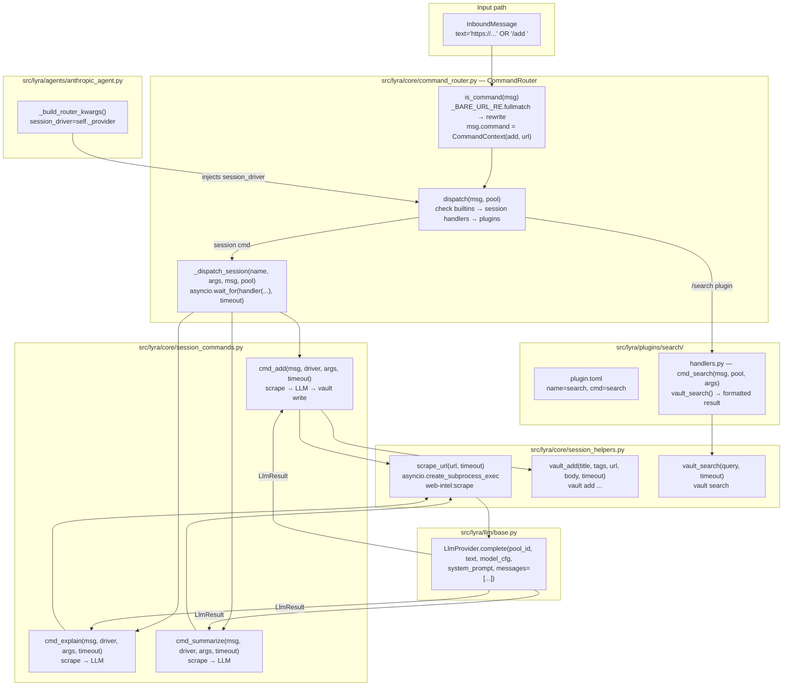
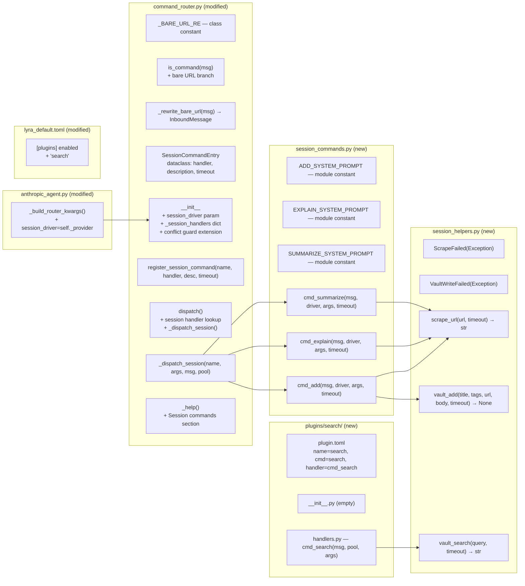

## Summary

Introduce a session command handler type in `CommandRouter`: async handlers backed by an isolated `AnthropicSdkDriver` call, with no pool history interaction. Wire `/add`, `/explain`, `/summarize` as session commands. Wire `/search` as a stateless plugin command. Extend `CommandRouter.is_command()` to detect and rewrite single bare URLs as `/add`. Seven slices, S1–S7.

---

## Architecture

### Data flow diagram



### File x function map



---

## Tasks

### T1 — S1: Bare URL detection in CommandRouter

**Slice:** S1
**Files:**
- `src/lyra/core/command_router.py`
- `tests/core/test_command_router.py`

**What to implement:**
- Add `_BARE_URL_RE = re.compile(r"^https?://\S+$")` as a class constant on `CommandRouter`.
- Add `_rewrite_bare_url(msg: InboundMessage) -> InboundMessage`: creates a synthetic `CommandContext(prefix="/", name="add", args=<url>, raw=<msg.text>)` and returns `dataclasses.replace(msg, command=ctx)`.
- Extend `is_command()`: if `msg.command is None` and `_BARE_URL_RE.fullmatch(msg.text)`, call `_rewrite_bare_url()` and mutate the in-scope message reference. Return `True`. Otherwise existing logic unchanged.
- Note: `InboundMessage` is frozen, so `_rewrite_bare_url` returns a new instance. The caller (`is_command`) cannot mutate `msg` in-place — the rewritten message must be returned by `is_command` or the calling site (Hub) must use the returned value. Review the Hub call site to confirm. If `is_command` is called on the original message and `dispatch` is called separately on the original, the rewrite must be persisted. The cleanest path: make `is_command` return `bool` but store the rewritten message on the router instance (scoped per call) OR adjust the Hub to call a new `prepare(msg) -> InboundMessage` method that both rewrites and returns the message. Consult the spec breadboard: it shows `msg.command` attached via `replace()`. Choose the approach that avoids mutating the frozen dataclass at the Hub call site.

**Tests:**
- Bare HTTPS URL → `is_command()` returns `True`, `get_command_name()` returns `"/add"`.
- `http://` URL → same.
- URL with surrounding text → `is_command()` returns `False`.
- Already-command message → unaffected.

**AC:** AC-1
**Depends on:** nothing

---

### T2 — S2: SessionCommandEntry type + registry plumbing in CommandRouter

**Slice:** S2
**Files:**
- `src/lyra/core/command_router.py`
- `tests/core/test_command_router.py`

**What to implement:**
- Add `SessionCommandEntry` frozen dataclass: `handler: SessionCommandHandler`, `description: str`, `timeout: float = 60.0`.
- Add `SessionCommandHandler` Protocol (in the same file or a `_types.py`): `async def __call__(msg, driver, args, timeout) -> Response`.
- Extend `CommandRouter.__init__` signature: `session_driver: LlmProvider | None = None`. Store as `self._session_driver`. Import `LlmProvider` under `TYPE_CHECKING` to avoid circular import.
- Add `self._session_handlers: dict[str, SessionCommandEntry] = {}` in `__init__`.
- Extend the builtin/plugin conflict guard to also check `_session_handlers` when populated later (or check at `register_session_command` time).
- Add `register_session_command(name: str, handler: SessionCommandHandler, description: str = "", timeout: float = 60.0) -> None`.
- Add `_dispatch_session(name, args, msg, pool) -> Response`: wraps the handler in `asyncio.wait_for(timeout=entry.timeout)`. On `asyncio.TimeoutError`, returns `Response(content=f"Command timed out after {entry.timeout:.0f}s.")`. If `self._session_driver is None`, returns `Response(content="Session commands require anthropic-sdk backend.")`.
- Extend `dispatch()`: after `_dispatch_builtin`, before the plugin handler lookup, check `self._session_handlers.get(command_name)` and call `_dispatch_session` if found.
- Extend `_help()`: if `self._session_handlers`, append a `"Session commands:"` section before the plugin section, listing each entry with name and description.
- The `PLR0913` noqa comment on `__init__` will need updating.

**Tests:**
- Session command registered and dispatched.
- Timeout path returns timeout message.
- `session_driver=None` returns degradation message without raising.
- `/help` output includes `"Session commands:"` section.
- Conflict guard: registering a session command that matches a builtin raises `ValueError`.

**AC:** AC-2, AC-8, AC-9 (no driver), AC-10
**Depends on:** T1

---

### T3 — S3: Subprocess helpers (session_helpers.py)

**Slice:** S3
**Files:**
- `src/lyra/core/session_helpers.py` (new)
- `tests/core/test_session_helpers.py` (new)

**What to implement:**
- `ScrapeFailed(Exception)` with a `reason: str` attribute.
- `VaultWriteFailed(Exception)`.
- `async def scrape_url(url: str, timeout: float = 30.0) -> str`:
  - Use `asyncio.create_subprocess_exec` to run `web-intel:scrape`, `url`, with `stdout=PIPE`, `stderr=PIPE`.
  - If binary not found (`FileNotFoundError`), raise `ScrapeFailed("not_available")`.
  - On non-zero return code, raise `ScrapeFailed("subprocess_error")`.
  - Wrap in `asyncio.wait_for(timeout=timeout)`.
  - Return decoded stdout.
- `async def vault_add(title: str, tags: list[str], url: str, body: str, timeout: float = 30.0) -> None`:
  - Build args: `["vault", "add", "--title", title, "--url", url, "--body", body]` + `["--tags", ",".join(tags)]` if tags.
  - `FileNotFoundError` → raise `VaultWriteFailed("not_available")`.
  - Non-zero exit → raise `VaultWriteFailed("subprocess_error")`.
- `async def vault_search(query: str, timeout: float = 30.0) -> str`:
  - Run `vault search <query>`, return stdout.
  - `FileNotFoundError` → return `"vault CLI not available."`.
  - Non-zero exit → return `"Search returned no results."`.

**Tests** (mock `asyncio.create_subprocess_exec`):
- `scrape_url` happy path: returns stdout string.
- `scrape_url` PATH miss: raises `ScrapeFailed("not_available")`.
- `vault_add` happy path: completes without raising.
- `vault_add` PATH miss: raises `VaultWriteFailed("not_available")`.
- `vault_search` happy path: returns results string.
- `vault_search` PATH miss: returns graceful string.

**AC:** AC-9 (partial), AC-3 (partial), AC-6 (partial)
**Depends on:** nothing (parallel with T2)

---

### T4 — S4: Session command handlers (/add, /explain, /summarize)

**Slice:** S4
**Files:**
- `src/lyra/core/session_commands.py` (new)
- `tests/core/test_session_commands.py` (new)

**What to implement:**
- Module-level constants:
  - `ADD_SYSTEM_PROMPT`: instructs the LLM to return a structured summary with title, one-paragraph summary, and 3–5 tags.
  - `EXPLAIN_SYSTEM_PROMPT`: plain-language explanation suitable for sharing in chat.
  - `SUMMARIZE_SYSTEM_PROMPT`: 3–5 bullet-point summary.
- `async def cmd_add(msg: InboundMessage, driver: LlmProvider, args: list[str], timeout: float) -> Response`:
  - If `not args`: return `Response(content="Usage: /add <url>")`.
  - `url = args[0]`
  - Call `scrape_url(url, timeout=timeout/3)` — catch `ScrapeFailed`: if `"not_available"`, set `scraped = f"[scraping unavailable] {url}"`; else set `scraped = f"[scrape failed] {url}"`.
  - Build `model_cfg = ModelConfig(backend="anthropic-sdk", model=driver.capabilities.get("default_model", "claude-haiku-4-5-20251001"))`. If `driver.capabilities` does not expose a usable model, use a safe default.
  - Call `await driver.complete("session:add", scraped, model_cfg, ADD_SYSTEM_PROMPT, messages=[{"role":"user","content":scraped}])`.
  - Parse `result.result` for title and tags (use simple line-prefix parsing: `Title: ...`, `Tags: ...`). Fallback to a default if parsing fails.
  - Call `await vault_add(title, tags, url, result.result, timeout=timeout/3)` — catch `VaultWriteFailed`: append a note to the response.
  - Return `Response(content=f"Saved: {title}\n\n{result.result}")` or error description.
- `async def cmd_explain(msg, driver, args, timeout) -> Response`:
  - Same scrape pattern; `driver.complete("session:explain", ...)` with `EXPLAIN_SYSTEM_PROMPT`; return explanation.
- `async def cmd_summarize(msg, driver, args, timeout) -> Response`:
  - Same scrape pattern; `driver.complete("session:summarize", ...)` with `SUMMARIZE_SYSTEM_PROMPT`; return summary.
- None of these functions access or modify `pool.sdk_history` or `pool.history`.

**Tests** (mock `driver.complete`, `scrape_url`, `vault_add`):
- `cmd_add` happy path: scrape called, driver called, vault called, response confirms save.
- `cmd_add` with scrape failure: driver still called with fallback text, response returned (no crash).
- `cmd_add` with vault failure: response includes "vault unavailable" note, no crash.
- `cmd_explain` happy path: scrape called, driver called, response contains explanation.
- `cmd_summarize` happy path: scrape called, driver called, response contains summary.
- Missing arg: returns usage hint without calling driver.

**AC:** AC-3, AC-4, AC-5, AC-7
**Depends on:** T2, T3

---

### T5 — S5: /search plugin

**Slice:** S5
**Files:**
- `src/lyra/plugins/search/plugin.toml` (new)
- `src/lyra/plugins/search/__init__.py` (new, empty)
- `src/lyra/plugins/search/handlers.py` (new)
- `tests/plugins/test_search.py` (new)

**What to implement:**
- `plugin.toml`:
  ```toml
  name = "search"
  description = "Full-text search over the vault"
  version = "0.1.0"
  priority = 100
  enabled = true
  timeout = 30.0

  [[commands]]
  name = "search"
  description = "Search the vault: /search <query>"
  handler = "cmd_search"
  ```
- `handlers.py`:
  - `async def cmd_search(msg: InboundMessage, pool: Pool, args: list[str]) -> Response`
  - If `not args`: return `Response(content="Usage: /search <query>")`.
  - `query = " ".join(args)`.
  - Call `await vault_search(query, timeout=25.0)` from `session_helpers`.
  - Format result as a compact list; return `Response(content=result)`.

**Tests:**
- Happy path: vault returns results, response formatted.
- Empty query: usage hint returned.
- Vault absent: graceful string returned, no crash.

**AC:** AC-6
**Depends on:** T3

---

### T6 — S6: AnthropicAgent wiring + TOML config

**Slice:** S6
**Files:**
- `src/lyra/agents/anthropic_agent.py`
- `src/lyra/agents/lyra_default.toml`
- `tests/agents/test_anthropic_agent.py`

**What to implement:**
- In `AnthropicAgent._build_router_kwargs()`: add `"session_driver": self._provider` to the returned dict. This propagates the existing `LlmProvider` instance to `CommandRouter.__init__` as `session_driver`.
- In `AgentBase._maybe_reload()` and `AgentBase._reload_plugins()`: these already call `**self._build_router_kwargs()` when rebuilding the router — no additional changes needed there.
- Register session commands on the router after construction. The cleanest hook is to add a `_register_session_commands()` call in `AgentBase.__init__` (called by `AnthropicAgent` via `super().__init__`) and in `_maybe_reload`/`_reload_plugins` after the router is rebuilt. `AgentBase._register_session_commands()` is a no-op; `AnthropicAgent` overrides it to call `self.command_router.register_session_command(...)` for `/add`, `/explain`, `/summarize` using handlers imported from `session_commands`.
  - Alternative: `AnthropicAgent.__init__` registers after calling `super().__init__`. This is simpler but means hot-reload does not re-register. Evaluate: since session commands are code-defined (not config-driven), re-registration on hot-reload is not strictly needed unless the timeout changes. Prefer the simple approach unless the spec requires it.
- In `lyra_default.toml`: add `"search"` to `[plugins] enabled`:
  ```toml
  [plugins]
  enabled = ["echo", "search"]
  ```
- Note: `/add`, `/explain`, `/summarize` are session commands registered in code, not listed in `[plugins]`. They do not appear in the plugins TOML section.

**Tests** (extend `tests/agents/test_anthropic_agent.py`):
- Router is built with `session_driver` set to the provider instance.
- `command_router._session_handlers` contains `/add`, `/explain`, `/summarize` keys after construction.

**AC:** AC-11
**Depends on:** T4, T5

---

### T7 — S7: Integration smoke test

**Slice:** S7
**Files:**
- `tests/integration/test_command_sessions.py` (new)

**What to implement:**
End-to-end tests using a mock `LlmProvider` and patched subprocess calls:
- Bare URL message → `is_command()` returns `True` → `dispatch()` routes to `/add` → response confirms save.
- `/explain <url>` message → dispatched as session command → response contains explanation text.
- `/search <query>` message → dispatched as plugin command → vault_search called → results returned.
- After any session command dispatch, assert that `pool.sdk_history` and `pool.history` are unchanged (AC-7).
- `session_driver=None` path: session command returns the degradation message.
- Timeout path: `asyncio.wait_for` timeout triggers the timeout response.

**AC:** AC-1 through AC-11 (smoke)
**Depends on:** T1, T2, T3, T4, T5, T6

---

## Dependency graph

```
T1 (S1 — bare URL detection)
  └── T2 (S2 — registry plumbing)
        └── T4 (S4 — session handlers)
                └── T6 (S6 — agent wiring)
                        └── T7 (S7 — integration)

T3 (S3 — subprocess helpers)   ← parallel with T2
  ├── T4 (S4) ← blocked on both T2 + T3
  └── T5 (S5 — search plugin)
        └── T6 (S6)
```

Execution order:

| Step | Tasks (run in parallel) | Gate |
|------|------------------------|------|
| 1 | T1, T3 | none |
| 2 | T2 | T1 done |
| 3 | T4, T5 | T2 + T3 done |
| 4 | T6 | T4 + T5 done |
| 5 | T7 | T6 done |

---

## Agent breakdown

All tasks target the `backend` agent (Python, no frontend). Single-domain: `src/lyra/core/` and `src/lyra/agents/`. No cross-domain coordination required.

| Task | Domain | Assignee |
|------|--------|----------|
| T1 | `src/lyra/core/command_router.py` | backend |
| T2 | `src/lyra/core/command_router.py` | backend |
| T3 | `src/lyra/core/session_helpers.py` (new) | backend |
| T4 | `src/lyra/core/session_commands.py` (new) | backend |
| T5 | `src/lyra/plugins/search/` (new) | backend |
| T6 | `src/lyra/agents/anthropic_agent.py`, `lyra_default.toml` | backend |
| T7 | `tests/integration/test_command_sessions.py` (new) | backend |

---

## File impact summary

| File | Status | Change |
|------|--------|--------|
| `src/lyra/core/command_router.py` | modify | T1: bare URL regex + rewrite; T2: `SessionCommandEntry`, registry, `_dispatch_session`, `_help` update, `register_session_command` |
| `src/lyra/core/session_helpers.py` | new | T3: `scrape_url`, `vault_add`, `vault_search`, exception types |
| `src/lyra/core/session_commands.py` | new | T4: `cmd_add`, `cmd_explain`, `cmd_summarize`, system prompt constants |
| `src/lyra/plugins/search/plugin.toml` | new | T5 |
| `src/lyra/plugins/search/__init__.py` | new | T5: empty |
| `src/lyra/plugins/search/handlers.py` | new | T5: `cmd_search` |
| `src/lyra/agents/anthropic_agent.py` | modify | T6: `_build_router_kwargs` + `_register_session_commands` |
| `src/lyra/agents/lyra_default.toml` | modify | T6: add `"search"` to `[plugins] enabled` |
| `tests/core/test_command_router.py` | modify | T1, T2: new test cases |
| `tests/core/test_session_helpers.py` | new | T3 |
| `tests/core/test_session_commands.py` | new | T4 |
| `tests/plugins/test_search.py` | new | T5 |
| `tests/agents/test_anthropic_agent.py` | modify | T6: new test cases |
| `tests/integration/test_command_sessions.py` | new | T7 |

---

## Implementation notes

### Bare URL rewrite and frozen InboundMessage

`InboundMessage` is a frozen dataclass. `is_command()` cannot mutate it. The Hub calls `is_command(msg)` and then `dispatch(msg, pool)` separately, passing the original `msg` both times. For the rewrite to be visible in `dispatch`, one of these approaches must be used:

**Option A (recommended):** Add a `prepare(msg: InboundMessage) -> InboundMessage` method to `CommandRouter` that the Hub calls before `is_command` and `dispatch`. It returns the rewritten message (or the original if no rewrite). The Hub replaces `msg` with the return value. This is the cleanest approach and matches the spec breadboard (`replace()` language). Check the Hub's `_run_pipeline` to confirm where to inject.

**Option B:** Store the last-rewritten message on the router as `self._pending_rewrite: InboundMessage | None` and consume it in `dispatch`. Fragile under concurrency.

Implement Option A unless `_run_pipeline` in `hub.py` has a structural reason that prevents it.

### SessionCommandHandler Protocol and import

`LlmProvider` lives in `lyra.llm.base`. Import it under `TYPE_CHECKING` in `command_router.py` to avoid a circular import (`core` importing `llm`). At runtime, the driver is passed as an object; type annotation is string-based.

### Session command registration and hot-reload

When `AgentBase._maybe_reload()` rebuilds `self.command_router`, it calls `**self._build_router_kwargs()`. If `AnthropicAgent` overrides `_register_session_commands()` and this is called after router rebuild, session commands will be present after hot-reload. Ensure the registration call is made every time the router is rebuilt (both in `__init__`, `_maybe_reload`, and `_reload_plugins`).

Simplest safe pattern: add `self._register_session_commands()` as the last line of `AgentBase.__init__`, and again after each `self.command_router = CommandRouter(...)` reassignment in `_maybe_reload` and `_reload_plugins`.

### vault CLI argument format

The spec says `vault add --title "..." --tags "..." --url <url> --body "..."`. Verify the actual vault CLI arg format before hardcoding. The helper should quote strings defensively; `asyncio.create_subprocess_exec` passes args as a list so shell quoting is not needed.

### pool_id convention for session commands

Session commands use `"session:<command>"` as `pool_id` (e.g., `"session:add"`). This avoids polluting any real pool's history in the driver and makes log lines identifiable.
