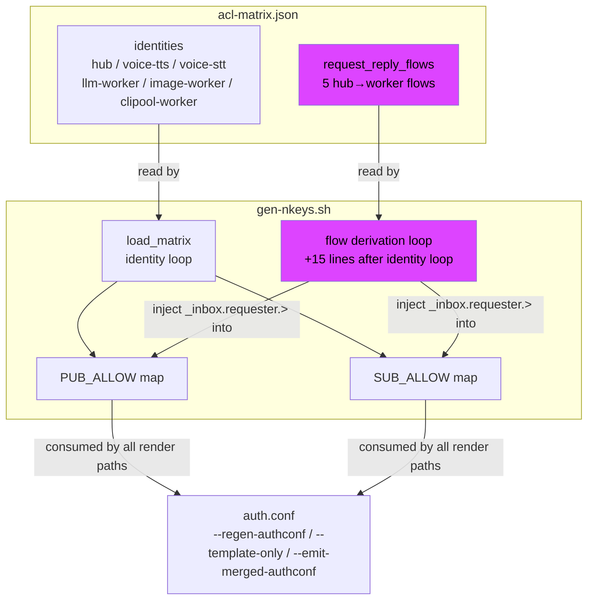
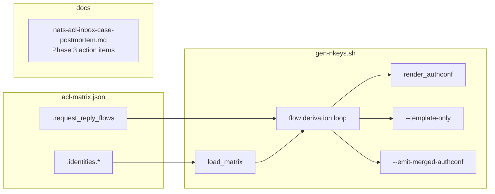

## Summary

Add `request_reply_flows` to `acl-matrix.json` and extend `load_matrix()` in `gen-nkeys.sh` to derive all `_inbox.hub.>` grants from flow declarations, eliminating 6 manual cross-identity entries.

## Architecture





## Agents

| Agent | Tasks | Files |
|-------|-------|-------|
| devops-A | T1, T2, T3, T4 | deploy/nats/acl-matrix.json, deploy/nats/gen-nkeys.sh, docs/ops/nats-acl-inbox-case-postmortem.md |

## Wave Structure

2 waves, 1 parallel agent. Sequential — all tasks on devops-A.

| Wave | Trigger | Agents | Tasks |
|------|---------|--------|-------|
| 1 | start | devops-A | T1→T4 (schema + doc, chainable) |
| 2 | Wave 1 done | devops-A | T2→T3 (generator + verify) |

Elapsed: ~20 min sequential (no parallelization benefit — single domain, single agent).

## Micro-Tasks

### Wave 1 — schema + doc

<!-- T1: RED -->
**T1** [devops-A] — Add `request_reply_flows` array to `acl-matrix.json`

- File: `deploy/nats/acl-matrix.json`
- Change: Insert top-level `request_reply_flows` array after `"version": "1"`, before `"identities"`:
  ```json
  "request_reply_flows": [
    { "requester": "hub", "responder": "clipool-worker", "subject": "lyra.clipool.cmd" },
    { "requester": "hub", "responder": "voice-tts",      "subject": "lyra.voice.tts.request.>" },
    { "requester": "hub", "responder": "voice-stt",      "subject": "lyra.voice.stt.request.>" },
    { "requester": "hub", "responder": "llm-worker",     "subject": "lyra.llm.request" },
    { "requester": "hub", "responder": "image-worker",   "subject": "lyra.image.generate.request" }
  ],
  ```
- Verify: `jq '.request_reply_flows | length' deploy/nats/acl-matrix.json`
- Expected: `5`
- Time: 3 min
- Spec trace: SC-1
- Phase: RED

<!-- T1b: RED -->
**T1b** [devops-A] — Remove manual `_inbox.hub.>` entries from identity blocks

- File: `deploy/nats/acl-matrix.json`
- Remove from:
  - `hub.subscribe`: `"_inbox.hub.>"`
  - `voice-tts.publish`: `"_inbox.hub.>"`
  - `voice-stt.publish`: `"_inbox.hub.>"`
  - `llm-worker.publish`: `"_inbox.hub.>"`
  - `image-worker.publish`: `"_inbox.hub.>"`
  - `clipool-worker.publish`: `"_inbox.hub.>"`
- Update descriptions: remove "Explicit _inbox.hub.> publish grant per postmortem Fix 2." → replace with "Inbox grant derived from request_reply_flows (Fix 3 / #992)."
- Verify: `jq '[.. | strings | select(. == "_inbox.hub.>")] | length' deploy/nats/acl-matrix.json`
- Expected: `0`
- Time: 5 min
- Spec trace: SC-2
- Phase: RED

<!-- T4: parallel-safe, doc only -->
**T4** [devops-A] — Mark Phase 3 action items done in postmortem

- File: `docs/ops/nats-acl-inbox-case-postmortem.md`
- Find Phase 3 table rows and mark them done (add ✓ or "Done — #992" to status column)
- Verify: `grep -c "992\|Done\|✓" docs/ops/nats-acl-inbox-case-postmortem.md`
- Expected: ≥ 3 matches
- Time: 3 min
- Spec trace: SC-5 (out of scope items closed)
- Phase: GREEN
- parallel-safe: Y

---

### Wave 2 — generator + verify

<!-- T2: RED — blocked by T1 -->
**T2** [devops-A] — Extend `load_matrix()` in `gen-nkeys.sh` with flow derivation loop

- File: `deploy/nats/gen-nkeys.sh`
- After the identity `done < <(jq -r '.identities | keys_unsorted[]' ...)` line (current ~line 103), insert:
  ```bash
  # Derive _inbox.{requester}.> grants from request_reply_flows
  while IFS= read -r flow; do
      local requester responder inbox
      requester=$(jq -r '.requester' <<<"$flow")
      responder=$(jq -r '.responder'  <<<"$flow")
      inbox="\"_inbox.${requester}.>\""

      if [[ "${SUB_ALLOW[$requester]}" != *"${inbox}"* ]]; then
          if [[ -n "${SUB_ALLOW[$requester]}" ]]; then
              SUB_ALLOW[$requester]="${SUB_ALLOW[$requester]},${inbox}"
          else
              SUB_ALLOW[$requester]="${inbox}"
          fi
      fi

      if [[ "${PUB_ALLOW[$responder]}" != *"${inbox}"* ]]; then
          if [[ -n "${PUB_ALLOW[$responder]}" ]]; then
              PUB_ALLOW[$responder]="${PUB_ALLOW[$responder]},${inbox}"
          else
              PUB_ALLOW[$responder]="${inbox}"
          fi
      fi
  done < <(jq -c '.request_reply_flows[]?' "${MATRIX_JSON}")
  ```
- Verify: `bash -n deploy/nats/gen-nkeys.sh` (syntax check)
- Expected: no output (clean)
- Time: 5 min
- Spec trace: SC-3
- Phase: RED
- Blocked by: T1

<!-- T3: GREEN — blocked by T2 -->
**T3** [devops-A] — Verify generator output: `_inbox.hub.>` appears in hub subscribe + all responders publish

- File: n/a (verification only)
- Commands:
  ```bash
  cd deploy/nats
  bash gen-nkeys.sh --template-only 2>/dev/null | grep '_inbox\.hub\.'
  ```
- Expected: lines containing `_inbox.hub.>` in hub's subscribe section AND in voice-tts, voice-stt, llm-worker, image-worker, clipool-worker publish sections (5 responders)
- Also verify: `bash gen-nkeys.sh --regen-authconf` exits 0
- Time: 3 min
- Spec trace: SC-3, SC-4
- Phase: GREEN
- Blocked by: T2

---

## Consistency Report

| | Count |
|---|---|
| Acceptance criteria covered | 5/5 |
| Micro-tasks | 5 (T1, T1b, T2, T3, T4) |
| Uncovered criteria | 0 |

SC-5 (services reconnect after NATS reload) — deferred to post-deploy smoke test per runbook, not automatable in CI without a live NATS instance.

## Task Seeding Blueprint

<!-- Used by /implement to seed TaskCreate calls on session start. -->

### Wave 1 — start, 1 agent

| Task | Agent instance | blockedBy | Subject |
|------|---------------|-----------|---------|
| T1 | devops-A | — | Add request_reply_flows array to acl-matrix.json |
| T1b | devops-A | T1 | Remove manual _inbox.hub.> from 6 identity blocks |
| T4 | devops-A | — | Mark Phase 3 done in postmortem doc |

### Wave 2 — after T1+T1b, 1 agent

| Task | Agent instance | blockedBy | Subject |
|------|---------------|-----------|---------|
| T2 | devops-A | T1b | Extend load_matrix() with flow derivation loop |
| T3 | devops-A | T2 | Verify --template-only output + --regen-authconf |

## Task IDs

<!-- Generated by /plan. Used by /implement to resume tasks on session restart. -->
- T1: 7 — Add request_reply_flows array to acl-matrix.json
- T1b: 8 — Remove manual _inbox.hub.> from 6 identity blocks in acl-matrix.json
- T4: 9 — Mark Phase 3 action items done in postmortem doc
- T2: 10 — Extend load_matrix() in gen-nkeys.sh with flow derivation loop
- T3: 11 — Verify gen-nkeys.sh output: _inbox.hub.> in hub subscribe + all 5 responder publish
