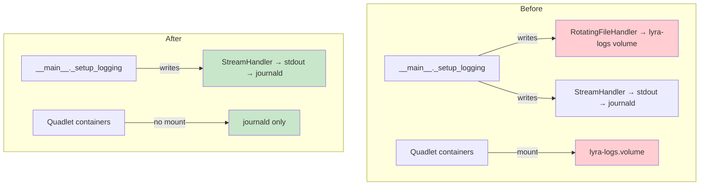
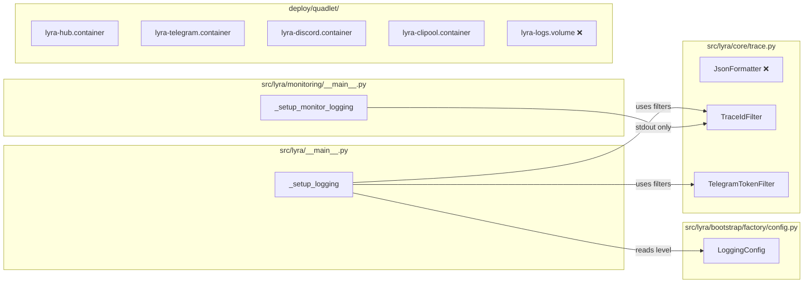

## Summary

Pure deletion across 3 independent domains: remove `RotatingFileHandler` machinery from 2 Python entry points + 1 config model + dead class in core, strip `lyra-logs` volume and `LYRA_LOG_DIR` env from 4 Quadlet units, and scrub 2 docs. All 3 agents can run in parallel — no cross-domain dependencies.

## Architecture

## Agents

| Agent | Tasks | Files |
|---|---|---|
| backend-dev | T1 T2 T3 T4 | `src/lyra/__main__.py`, `src/lyra/monitoring/__main__.py`, `src/lyra/bootstrap/factory/config.py`, `src/lyra/core/trace.py` |
| devops | T5 T6 T7 T8 T9 | `deploy/quadlet/lyra-hub.container`, `deploy/quadlet/lyra-telegram.container`, `deploy/quadlet/lyra-discord.container`, `deploy/quadlet/lyra-clipool.container`, `deploy/quadlet/lyra-logs.volume` |
| doc-writer | T10 T11 | `docs/DEPLOYMENT-quadlet.md`, `docs/PROD-MIGRATION-STRATEGY.md` |

## Wave Structure

1 wave, 3 parallel agents. All tasks independent — no cross-domain deps.

| Wave | Trigger | Agents | Tasks |
|---|---|---|---|
| 1 | start | 3 ∥ | backend-dev: T1→T2→T3→T4 · devops: T5→T6→T7→T8→T9 · doc-writer: T10→T11 |

Estimated elapsed: ~15 min parallel vs ~30 min sequential.

## Micro-Tasks

### Slice S1 — Python entry points

**T1** — Remove RotatingFileHandler block from `src/lyra/__main__.py`
- File: `src/lyra/__main__.py`
- Agent: backend-dev
- Phase: RED
- Parallel-safe: Y (independent file)
- Difficulty: 2
- Spec trace: SC-1, SC-2, SC-3, SC-4, SC-5
- Remove: `from datetime import datetime, timezone`, `from pathlib import Path`, `RotatingFileHandler` import, `from lyra.core.trace import JsonFormatter` (partial — see T3), `log_dir`/`log_file` creation block, `LYRA_LOG_DIR` env read, `stamp` variable, `file_handler` block, `json_file` branch from `_setup_logging`. Keep `console_handler` with both filters. Keep `LoggingConfig` usage for `level` only.
- Verify: `grep -n "RotatingFileHandler\|LYRA_LOG_DIR\|json_file\|log_dir\|log_file\|datetime\|from pathlib" src/lyra/__main__.py` → no matches (except existing `logging` module import)
- Expected: exit 0, no matches

**T2** — Remove `json_file` from `LoggingConfig`
- File: `src/lyra/bootstrap/factory/config.py`
- Agent: backend-dev
- Phase: RED
- Parallel-safe: Y
- Difficulty: 1
- Spec trace: SC-3
- Remove: `json_file: bool = True` field from `LoggingConfig`. Keep `level: str = "info"`.
- Verify: `grep "json_file" src/lyra/bootstrap/factory/config.py` → no match
- Expected: exit 0, no match

**T3** — Remove `JsonFormatter` from `__main__.py` import + delete class from `core/trace.py`
- Files: `src/lyra/__main__.py`, `src/lyra/core/trace.py`
- Agent: backend-dev
- Phase: RED (after T1 removes the usage)
- Parallel-safe: N (depends on T1 clearing the usage)
- Difficulty: 1
- Spec trace: SC-5, SC-6
- In `__main__.py`: remove `JsonFormatter` from the `from lyra.core.trace import ...` line (already partially done in T1 — confirm clean).
- In `core/trace.py`: delete the `JsonFormatter` class definition (lines ~141–end of class).
- Verify: `grep -n "JsonFormatter" src/lyra/__main__.py src/lyra/core/trace.py` → no matches
- Expected: exit 0, no matches

**T4** — Simplify `monitoring/__main__.py` to stdout-only
- File: `src/lyra/monitoring/__main__.py`
- Agent: backend-dev
- Phase: RED
- Parallel-safe: Y
- Difficulty: 2
- Spec trace: SC-2
- Remove: `from logging.handlers import RotatingFileHandler`, `log_dir` creation, `log_file` assignment, `file_handler` block. Replace `logging.basicConfig(level=logging.INFO, handlers=[file_handler, console_handler])` with `logging.basicConfig(level=logging.INFO, handlers=[console_handler])`. Remove `from pathlib import Path` and `import os` if unused after change.
- Verify: `grep -n "RotatingFileHandler\|file_handler\|log_dir\|log_file" src/lyra/monitoring/__main__.py` → no matches
- Expected: exit 0, no matches

### Slice S2 — Quadlet cleanup

**T5** — Clean `lyra-hub.container`
- File: `deploy/quadlet/lyra-hub.container`
- Agent: devops
- Phase: RED
- Parallel-safe: Y
- Difficulty: 1
- Spec trace: SC-7, SC-8
- Remove: `Volume=lyra-logs.volume:/home/lyra/.local/state/lyra/logs:z` line, `Environment=LYRA_LOG_DIR=/home/lyra/.local/state/lyra/logs` line, inline comment mentioning `LYRA_LOG_DIR` (line 25).
- Verify: `grep "lyra-logs\|LYRA_LOG_DIR" deploy/quadlet/lyra-hub.container` → no match
- Expected: exit 0, no match

**T6** — Clean `lyra-telegram.container`
- File: `deploy/quadlet/lyra-telegram.container`
- Agent: devops
- Phase: RED
- Parallel-safe: Y
- Difficulty: 1
- Spec trace: SC-7, SC-8
- Remove: `Volume=lyra-logs.volume:…` line, `Environment=LYRA_LOG_DIR=…` line.
- Verify: `grep "lyra-logs\|LYRA_LOG_DIR" deploy/quadlet/lyra-telegram.container` → no match

**T7** — Clean `lyra-discord.container`
- File: `deploy/quadlet/lyra-discord.container`
- Agent: devops
- Phase: RED
- Parallel-safe: Y
- Difficulty: 1
- Spec trace: SC-7, SC-8
- Remove: `Volume=lyra-logs.volume:…` line, `Environment=LYRA_LOG_DIR=…` line.
- Verify: `grep "lyra-logs\|LYRA_LOG_DIR" deploy/quadlet/lyra-discord.container` → no match

**T8** — Clean `lyra-clipool.container`
- File: `deploy/quadlet/lyra-clipool.container`
- Agent: devops
- Phase: RED
- Parallel-safe: Y
- Difficulty: 1
- Spec trace: SC-7, SC-8
- Remove: `Volume=lyra-logs.volume:…` line, `Environment=LYRA_LOG_DIR=…` line.
- Verify: `grep "lyra-logs\|LYRA_LOG_DIR" deploy/quadlet/lyra-clipool.container` → no match

**T9** — Delete `lyra-logs.volume`
- File: `deploy/quadlet/lyra-logs.volume`
- Agent: devops
- Phase: RED (after T5–T8 remove all references)
- Parallel-safe: N (depends on T5–T8)
- Difficulty: 1
- Spec trace: SC-7
- Action: `git rm deploy/quadlet/lyra-logs.volume`
- Verify: `ls deploy/quadlet/lyra-logs.volume` → No such file
- Expected: file absent

### Slice S3 — Docs

**T10** — Update `docs/DEPLOYMENT-quadlet.md`
- File: `docs/DEPLOYMENT-quadlet.md`
- Agent: doc-writer
- Phase: RED
- Parallel-safe: Y
- Difficulty: 1
- Spec trace: SC-9
- Remove: `lyra-logs` row from Volumes table (line 37) and any inline reference.
- Verify: `grep "lyra-logs" docs/DEPLOYMENT-quadlet.md` → no match

**T11** — Update `docs/PROD-MIGRATION-STRATEGY.md`
- File: `docs/PROD-MIGRATION-STRATEGY.md`
- Agent: doc-writer
- Phase: RED
- Parallel-safe: Y
- Difficulty: 1
- Spec trace: SC-10
- Remove: `lyra-logs` from the volumes column in the lyra row (line 102).
- Verify: `grep "lyra-logs" docs/PROD-MIGRATION-STRATEGY.md` → no match

## Consistency Report

- Spec criteria covered: 10/11 static criteria + 2 smoke tests noted
- Uncovered in tasks: smoke tests (SC-11/SC-12 — manual only, not CI-gated)
- Untraced: none
- Exemptions: smoke tests explicitly annotated as out of CI scope in spec

## Wave Structure

1 wave, 3 parallel agents. Elapsed ~15 min parallel vs ~30 min sequential.

| Wave | Trigger | Agents | Tasks |
|---|---|---|---|
| 1 | start | 3 ∥ | backend-dev: T1→T2→T3→T4 · devops: T5→T6→T7→T8→T9 · doc-writer: T10→T11 |

## Task Seeding Blueprint

<!-- Used by /implement to seed TaskCreate calls on session start. -->

### Wave 1 — no deps, 3 agents ∥

| Task | Agent instance | blockedBy | Subject |
|---|---|---|---|
| T1 | backend-dev | — | Remove RotatingFileHandler + dead imports from src/lyra/__main__.py |
| T2 | backend-dev | T1 | Remove json_file from LoggingConfig in bootstrap/factory/config.py |
| T3 | backend-dev | T1 | Remove JsonFormatter import + delete class from core/trace.py |
| T4 | backend-dev | T3 | Simplify monitoring/__main__.py to stdout-only basicConfig |
| T5 | devops | — | lyra-hub.container: rm Volume=lyra-logs + Env=LYRA_LOG_DIR + dead comment |
| T6 | devops | — | lyra-telegram.container: rm Volume=lyra-logs + Env=LYRA_LOG_DIR |
| T7 | devops | — | lyra-discord.container: rm Volume=lyra-logs + Env=LYRA_LOG_DIR |
| T8 | devops | — | lyra-clipool.container: rm Volume=lyra-logs + Env=LYRA_LOG_DIR |
| T9 | devops | T5,T6,T7,T8 | Delete deploy/quadlet/lyra-logs.volume |
| T10 | doc-writer | — | docs/DEPLOYMENT-quadlet.md: remove lyra-logs from Volumes table |
| T11 | doc-writer | T10 | docs/PROD-MIGRATION-STRATEGY.md: remove lyra-logs from volumes column |

## Task IDs

<!-- Generated by /plan. Used by /implement to resume tasks on session restart. -->
- T1: 10 — Remove RotatingFileHandler + dead imports from src/lyra/__main__.py
- T2: 11 — Remove json_file from LoggingConfig in bootstrap/factory/config.py
- T3: 12 — Remove JsonFormatter import + delete class from core/trace.py
- T4: 13 — Simplify monitoring/__main__.py to stdout-only basicConfig
- T5: 14 — lyra-hub.container: rm Volume=lyra-logs + Env=LYRA_LOG_DIR + dead comment
- T6: 15 — lyra-telegram.container: rm Volume=lyra-logs + Env=LYRA_LOG_DIR
- T7: 16 — lyra-discord.container: rm Volume=lyra-logs + Env=LYRA_LOG_DIR
- T8: 17 — lyra-clipool.container: rm Volume=lyra-logs + Env=LYRA_LOG_DIR
- T9: 18 — Delete deploy/quadlet/lyra-logs.volume
- T10: 19 — docs/DEPLOYMENT-quadlet.md: remove lyra-logs from Volumes table
- T11: 20 — docs/PROD-MIGRATION-STRATEGY.md: remove lyra-logs from volumes column
